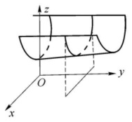
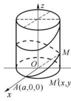
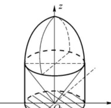

import ExerciseTrigger from '@/components/exercises/ExerciseTrigger.astro';

import Guide from '@/components/Guide.astro';
import Knowledge from '@/components/Knowledge.astro';
import Example from '@/components/Example.astro';
import Analysis from '@/components/Analysis.astro';
import Solution from '@/components/Solution.astro';
import Variant from '@/components/Variant.astro';
import Note from '@/components/Note.astro';
import SideNote from '@/components/SideNote.astro';
import Block from '@/components/Block.astro';
import Method from '@/components/Method.astro';
import Exercise from '@/components/Exercise.astro';

## 一、空间曲线的方程

### 1. 空间曲线的一般方程

设曲面 $S_1: F_1(x, y, z) = 0$ 与曲面 $S_2: F_2(x, y, z) = 0$ 的交线为 $C$，则 $C$ 上的点 $P(x, y, z)$ 满足方程组

$$
\begin{cases}
F_1(x, y, z) = 0, \\
F_2(x, y, z) = 0.
\end{cases} \tag{8.2}
$$

反之，若点 $P(x, y, z)$ 满足方程组 (8.2)，则点 $P$ 既在 $S_1$ 上，也在 $S_2$ 上，因此在曲线 $C$ 上。因此方程组 (8.2) 就是曲线 $C$ 的方程，称为曲线 $C$ 的**一般方程**。

例如方程组

$$
\begin{cases}
(x - 1)^2 + y^2 + (z + 1)^2 = 4, \\
2y + z = 0
\end{cases}
$$

表示的是球面 $(x - 1)^2 + y^2 + (z + 1)^2 = 4$ 与平面 $2y + z = 0$ 的交线，是一个圆。

<Example title="例 6 方程组表示的曲线">

方程组

$$
\begin{cases}
x^2 + y^2 = z - 1, \\
y = 2
\end{cases}
$$

表示怎样的曲线？

</Example>

<Solution title="解">

将 $y = 2$ 代入方程 $x^2 + y^2 = z - 1$，得 $z = x^2 + 5$，这是一个以 $xOz$ 平面上的抛物线 $z = x^2 + 5$ 为准线，母线平行于 $y$ 轴的柱面。这个柱面与平面 $y = 2$ 的交线就是方程组所表示的曲线，它是平面 $y = 2$ 上的抛物线

$$
\begin{cases}
z = x^2 + 5, \\
y = 2,
\end{cases}
$$

如图 8.13 所示。

</Solution>

<figure class="vp-figure">
  
  <figcaption>图 8.13 平面与柱面的交线</figcaption>
</figure>

### 2. 空间曲线的参数方程

除了一般方程外，还可以用参数方程来表示空间曲线。设空间曲线 $C$ 上的动点坐标 $x, y, z$ 可以表示为参数 $t$ 的函数

$$
\begin{cases}
x = x(t), \\
y = y(t), \quad t \in I, \\
z = z(t).
\end{cases} \tag{8.3}
$$

如果任给 $t_0 \in I$，点 $(x(t_0), y(t_0), z(t_0))$ 在曲线 $C$ 上；反之，任给曲线 $C$ 上的点 $P_0(x_0, y_0, z_0)$，都有某个 $t_0 \in I$，使 $(x_0, y_0, z_0) = (x(t_0), y(t_0), z(t_0))$，则称方程组 (8.3) 为空间曲线 $C$ 的**参数方程**。

<Example title="例 7 求空间曲线的参数方程">

写出曲线

$$
C: \begin{cases}
(x - 2)^2 + (y + 1)^2 + (z - 1)^2 = 4, \\
z = 0
\end{cases}
$$

的参数方程。

</Example>

<Solution title="解">

曲线 $C$ 的一般方程也可以表示为

$$
C: \begin{cases}
(x - 2)^2 + (y + 1)^2 = 3, \\
z = 0,
\end{cases}
$$

因此 $C$ 的参数方程为

$$
\begin{cases}
x = 2 + \sqrt{3}\cos\theta, \\
y = -1 + \sqrt{3}\sin\theta, \quad \theta \in [0, 2\pi], \\
z = 0.
\end{cases}
$$

</Solution>

<Example title="例 8 螺旋线的参数方程">

设空间动点 $M$ 在圆柱面 $x^2 + y^2 = a^2$ ($a > 0$) 上以角速度 $\omega$ 绕 $z$ 轴旋转，同时以线速度 $v$ 平行于 $z$ 轴的正向上升（$\omega, v$ 均为常数）。点 $M$ 的轨迹称为螺旋线。试建立其参数方程。

</Example>

<Solution title="解">

如图 8.14 所示，取时间 $t$ 为参数。设 $t = 0$ 时，点 $M$ 位于 $A(a, 0, 0)$ 处。经过时间 $t$，动点 $M(x, y, z)$ 在 $xOy$ 平面上的投影点为 $M'(x, y, 0)$，则

$$
\begin{cases}
x = |OM'| \cos\angle M'OA = a \cos\omega t, \\
y = |OM'| \sin\angle M'OA = a \sin\omega t.
\end{cases}
$$

由于点 $M$ 以线速度 $v$ 平行于 $z$ 轴的正向上升，故 $z = vt$。此螺旋线的参数方程为

$$
\begin{cases}
x = a \cos\omega t, \\
y = a \sin\omega t, \\
z = vt.
\end{cases}
$$

螺旋线是日常生活中常见的曲线，当动点 $M$ 每旋转 $2\pi$ 的角度后，上升的高度为 $h = v \cdot \frac{2\pi}{\omega}$，称为**螺距**。

</Solution>

<figure class="vp-figure">
  
  <figcaption>图 8.14 螺旋线</figcaption>
</figure>

## 二、空间曲线在坐标面上的投影

设 $C$ 为空间曲线，以 $C$ 为准线，母线平行于 $z$ 轴（即垂直于 $xOy$ 平面）的柱面称为曲线 $C$ 关于 $xOy$ 平面的**投影柱面**。投影柱面与 $xOy$ 平面的交线称为曲线 $C$ 在 $xOy$ 面上的**投影曲线**（简称为**投影**）。

那么，如何求出空间曲线 $C$ 在 $xOy$ 面上的投影呢？

设空间曲线 $C$ 的一般方程为

$$
C: \begin{cases}
F_1(x, y, z) = 0, \\
F_2(x, y, z) = 0.
\end{cases}
$$

从方程中消去 $z$，得到一个不含变量 $z$ 的方程 $F(x, y) = 0$。由 8.1 节可知这个方程的图形是母线平行于 $z$ 轴的柱面。将这个柱面记为 $S$，很明显，曲线 $C$ 上的点都满足柱面 $S$ 的方程 $F(x, y) = 0$，即曲线 $C$ 在柱面 $S$ 上。因此柱面 $S$ 包含了 $C$ 关于 $xOy$ 面的投影柱面，曲线

$$
\begin{cases}
F(x, y) = 0, \\
z = 0
\end{cases}
$$

包含了 $C$ 在 $xOy$ 面上的投影。

同理，若从 $C$ 的方程中消去变量 $x$ 或变量 $y$，再分别与 $x = 0$ 或 $y = 0$ 联立，便可得到包含曲线 $C$ 在 $yOz$ 面或 $xOz$ 面上的投影的曲线方程

$$
\begin{cases}
H(y, z) = 0, \\
x = 0
\end{cases}
\quad \text{或} \quad
\begin{cases}
R(x, z) = 0, \\
y = 0.
\end{cases}
$$

<Example title="例 9 空间曲线在坐标面上的投影">

分别求曲线

$$
C: \begin{cases}
x^2 + y^2 + z^2 = 9, \\
x + z = 1
\end{cases}
$$

在 $xOy$ 面与 $xOz$ 面上的投影。

</Example>

<Solution title="解">

从 $C$ 的方程中消去 $z$，得 $2x^2 + y^2 - 2x = 8$，即

$$
\frac{\left(x - \frac{1}{2}\right)^2}{\frac{17}{4}} + \frac{y^2}{\frac{17}{2}} = 1.
$$

$C$ 在 $xOy$ 面上的投影为椭圆

$$
\begin{cases}
\frac{\left(x - \frac{1}{2}\right)^2}{\frac{17}{4}} + \frac{y^2}{\frac{17}{2}} = 1, \\
z = 0.
\end{cases}
$$

从 $C$ 的方程中消去 $y$，得 $x + z = 1$，$C$ 在 $xOz$ 面上的投影曲线方程为

$$
\begin{cases}
x + z = 1, \\
y = 0.
\end{cases}
$$

这是一条直线，$C$ 是一个圆，很明显 $C$ 在 $xOz$ 面上的投影只是这条直线的一段，方程为

$$
\begin{cases}
x + z = 1, \\
y = 0,
\end{cases}
\quad \left|x - \frac{1}{2}\right| \leqslant \frac{\sqrt{17}}{2}.
$$

<SideNote title="几何注记：投影范围的确定">
空间点 $P(x, y, z)$ 在 $xOz$ 面与 $xOy$ 面上的投影点分别为 $(x, 0, z)$ 与 $(x, y, 0)$，因此空间曲线在 $xOz$ 面与 $xOy$ 面上的投影有相同的 $x$ 的范围，可依据 $C$ 在 $xOy$ 面上的投影得出 $\left|x - \frac{1}{2}\right| \leqslant \frac{\sqrt{17}}{2}$。
</SideNote>

</Solution>

<Example title="例 10 空间立体的投影区域">

某空间立体由旋转抛物面 $z = 6 - x^2 - y^2$ 与圆锥面 $z = \sqrt{x^2 + y^2}$ 围成（图 8.15）。求它在 $xOy$ 面上的投影。

</Example>

<Solution title="解">

旋转抛物面 $z = 6 - x^2 - y^2$ 与圆锥面的交线为

$$
C: \begin{cases}
z = 6 - x^2 - y^2, \\
z = \sqrt{x^2 + y^2}.
\end{cases}
$$

从方程组中消去 $z$，得 $x^2 + y^2 = 4$。因此 $C$ 在 $xOy$ 面上的投影为

$$
\begin{cases}
x^2 + y^2 = 4, \\
z = 0,
\end{cases}
$$

所求立体的投影为

$$
\begin{cases}
x^2 + y^2 \leqslant 4, \\
z = 0.
\end{cases}
$$

</Solution>

<figure class="vp-figure">
  
  <figcaption>图 8.15 旋转抛物面与圆锥面围成立体</figcaption>
</figure>

## 习题八

<ExerciseTrigger chapter={8} section="8.3" title="8.3 空间曲线及其方程 课后真题与自测练习" />
