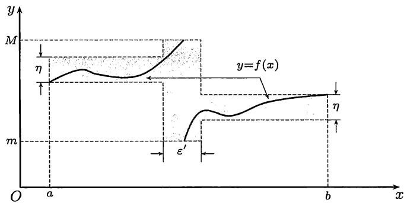
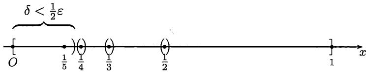

import Guide from '@/components/Guide.astro';
import Knowledge from '@/components/Knowledge.astro';
import Example from '@/components/Example.astro';
import Solution from '@/components/Solution.astro';
import Note from '@/components/Note.astro';
import Block from '@/components/Block.astro';
import Method from '@/components/Method.astro';

## 10.1.1 定积分的定义

设函数 $f$ 在区间 $[a, b]$ 上有定义.

1. 称点集 $P = \{x_{0}, x_{1}, \cdots, x_{n-1}, x_{n}\}$ 为 $[a, b]$ 的一个分划，如果满足条件：  
   $$
   a = x _ {0} <   x _ {1} <   \dots <   x _ {n - 1} <   x _ {n} = b.
   $$  
   记 $\Delta x_{i}=x_{i}-x_{i-1},\quad i=1,\cdots,n,$ 并称 $\|P\|=\max_{1\leqslant i\leqslant n}\{\Delta x_{i}\}$ 为分划 $P$ 的细度. 如果 $\Delta x_{i}=\frac{b-a}{n},\quad i=1,\cdots,n,$ 则称 $P$ 为等距分划.

2. 设 $P = \{x_{0}, x_{1}, \cdots, x_{n-1}, x_{n}\}$ 为区间 $[a, b]$ 的一个分划。对每个子区间 $[x_{i-1}, x_{i}]$ ，任取 $\xi_{i} \in [x_{i-1}, x_{i}]$ ，则称 $\xi = \{\xi_{i} \mid i = 1, 2, \cdots, n\}$ 为从属于 $P$ 的一个介点集；并称和式 $\sum_{i=1}^{n} f(\xi_{i}) \Delta x_{i}$ 或 $\sum_{P} f(\xi_{i}) \Delta x_{i}$ 为 $f$ 在区间 $[a, b]$ 上的一个 $Riemann$ (积分) 和。

3. 设 $I$ 为实数, 且有 $\lim_{\| P \| \to 0} \sum_{i=1}^{n} f(\xi_i) \Delta x_i = I$ , 即 $\forall \varepsilon > 0, \exists \delta > 0$ , 对 $\| P \| < \delta$ 的每个分划 $P$ , 以及对从属于 $P$ 的每个介点集 $\xi$ , 成立 $\left|\sum_{i=1}^{n} f(\xi_i) \Delta x_i - I\right| < \varepsilon$ , 则称函数 $f$ 在区间 $[a, b]$ 上 $Riemann$ 可积或简称可积, 记为  
   $$
   f \in R [ a, b ],
   $$  
   并称 $I$ 为 $f$ 在区间 $[a, b]$ 上的 $Riemann$ 积分或定积分，简称积分，记为 $\int_{a}^{b} f(x) \mathrm{d}x = I$ ，或其简化记号 $\int_{a}^{b} f = I$ .

<Note>
注1 在上述定义中, 虽然仍然是用记号 $\lim$ , 但是这里的极限与以前的函数极限或数列极限是不一样的. 主要区别在于, 在函数极限或数列极限的定义中, 自变量简单地就是 $x$ 或 $n$ . 但这里对于每个确定的细度 $\|P\|$ , 区间 $[a,b]$ 的分划 $P$ 可以有无限多个, 而相对于每个 $P$ , 介点集 $\xi$ 的取法又有无限多个, 因此就有无限多个不同的 $Riemann$ 和. 尽管如此, 函数极限和数列极限的许多性质, 例如, 极限的唯一性、极限运算与线性运算可以交换次序等, 对于这种新的极限仍然成立.
</Note>

<Note>
注2 定积分 $\int_{a}^{b} f(x) \, \mathrm{d}x$ 是一个数, 它的值仅仅与被积函数 $f$ 和积分区间 $[a, b]$ 有关, 而与积分变量用什么符号无关, 即有  
$$
\int_ {a} ^ {b} f (x) \mathrm{d} x = \int_ {a} ^ {b} f (t) \mathrm{d} t = \int_ {a} ^ {b} f (u) \mathrm{d} u = \dots .
$$  
因此在不需要写出积分变量时, 就可以使用定积分的简化记号 $\int_{a}^{b} f$ .
</Note>

## 10.1.2 可积条件

利用积分定义中介点集的任意性就可以得到可积的一个必要条件.

<Knowledge title="命题 $10.1.1$">
设 $f \in R[a, b]$ ，则 $f$ 在 $[a, b]$ 上有界.

<Solution title="证明">
若记 $\int_{a}^{b} f(x) \, \mathrm{d}x = I$ , 则从可积定义知道, 对于 $\varepsilon = 1$ , 存在一个分划 $P$ , 使得对于从属于这个 $P$ 的任何介点集 $\xi$ , 均成立不等式  
$$
\left| \sum_ {i = 1} ^ {n} f (\xi_ {i}) \Delta x _ {i} - I \right| <   1.\tag{10.1}
$$

以下只要证明 $f$ 在每个 $I_{i} = [x_{i - 1},x_{i}]$ 上有界即可. 对于确定的子区间 $I_{i}$ , 固定所有 $\xi_{k}(k\neq i)$ , 就可以从不等式 $(10.1)$ 出发对于 $f(\xi_i)$ 作出估计如下:

$$
\frac {1}{\Delta x _ {i}} (I - 1 - \sum_ {k \neq i} f (\xi_ {k}) \Delta x _ {k}) <   f (\xi_ {i}) <   \frac {1}{\Delta x _ {i}} (I + 1 - \sum_ {k \neq i} f (\xi_ {k}) \Delta x _ {k}).
$$

由于 $\xi_{i}\in I_{i} = [x_{i - 1},x_{i}]$ 的任意性，可见 $f$ 在 $I_{i}$ 上有界.
</Solution>
</Knowledge>

为叙述可积的充分必要条件, 需要引入以下概念. 设函数 $f$ 在区间 $[a, b]$ 上有界, $P = \{x_{0}, x_{1}, \cdots, x_{n-1}, x_{n}\}$ 为 $[a, b]$ 的一个分划, 对 $i = 1, \cdots, n$ , 记  

$$
M _ {i} = \sup \{f (x) \mid x \in [ x _ {i - i}, x _ {i} ] \} \quad {\text {与}} \quad m _ {i} = \inf \{f (x) \mid x \in [ x _ {i - i}, x _ {i} ] \},
$$

称 $\omega_{i} = M_{i} - m_{i}$ 为 $f$ 在 $[x_{i - 1},x_i]$ 上的振幅， $\sum_{i = 1}^{n}\omega_{i}\Delta x_{i}$ 为 $f$ 的振幅面积.

在一般的分析教科书中对下面两个最常用的可积充分必要条件都有证明.

<Knowledge title="命题 $10.1.2$ （可积的第一充分必要条件）">
有界函数 $f \in R[a, b]$ 的充分必要条件是  
$$
\lim _ {\| P \| \rightarrow 0} \sum_ {i = 1} ^ {n} \omega_ {i} \Delta x _ {i} = 0.
$$
</Knowledge>

<Knowledge title="命题 $10.1.3$ (可积的第二充分必要条件)">
有界函数 $f \in R[a, b]$ 的充分必要条件是对每个 $\varepsilon > 0$ ，存在区间 $[a, b]$ 的一个分划 $P$，使成立  
$$
\sum_ {P} \omega_ {i} \Delta x _ {i} <   \varepsilon .
$$
</Knowledge>

<Note>
注1 条件“ $\lim_{\|P\|\to0}\sum_{i=1}^{n}\omega_i \Delta x_i = 0$ ”是指“ $\forall \varepsilon > 0, \exists \delta > 0$ , 对 $[a, b]$ 的任意分划 $P$ , 只要 $\|P\| < \delta$ , 就都成立 $\sum_{P} \omega_i \Delta x_i < \varepsilon$ ”。而在可积的第二充分必要条件中, 对于每一个给定的 $\varepsilon$ , 只要存在一个分划 $P$ 就够了。因此, 要证明给定函数的可积性, 用可积的第二充分必要条件方便得多。
</Note>

<Note>
注2 在数列极限或函数极限的收敛定义中, 似乎没有与上述第二充分必要条件对应的结果, 但是对于单调数列 (以及单调函数) 却有类似的结果. 例如, 单调增加数列 $\{x_{n}\}$ 收敛于数 $a$ 的充分必要条件是: 对每个 $\varepsilon > 0$ , 存在数列的某一项 $x_{N}$ , 使成立 $a - \varepsilon < x_{N} \leqslant a$ . 这个结果已用于例题 $3.1.1$ 中. 这个类比并非偶然. 可积的第二充分必要条件就是来源于 $Riemann$ 和对于分划的某种“单调性”. 对此有兴趣的读者可以参考 $[14]$ 第三卷附录中的 $Moore-Smith$ 收敛.
</Note>

利用上面的充分必要条件, 就可以证明关于 $Riemann$ 可积函数类的三个结论:

1. 设 $f \in C[a, b]$ , 则 $f \in R[a, b]$ .

2. 设 $f$ 在 $[a, b]$ 上有界且只有有限个间断点, 则 $f \in R[a, b]$ .

3. 设 $f$ 在 $[a, b]$ 上单调, 则 $f \in R[a, b]$ .

另一方面，设 $D(x)$ 为 $Dirichlet$ 函数(见 $4.1.5$ 小节题 $11$)，则对任意区间 $[a,b]$ 以及 $[a,b]$ 的任意分划 $P$ ，当 $\xi_{i}$ 均取有理数时，有 $\sum_P f(\xi_i)\Delta x_i = b - a,$ 而当 $\xi_{i}$ 均取无理数时，则有 $\sum_P f(\xi_i)\Delta x_i = 0.$ 因此振幅面积总是等于 $b - a$ .由此可见，$Dirichlet$ 函数在任何有界区间 $[a,b]$ 上都不可积.

下面是另一个可积的充分必要条件, 它在讨论较为复杂的函数的可积性时, 往往比可积的第二充分必要条件更为方便.

<Knowledge title="命题 $10.1.4$ (可积的第三充分必要条件)">
有界函数 $f \in R[a, b]$ 的充分必要条件是 $\forall \varepsilon, \eta > 0$ ，存在 $[a, b]$ 的分划 $P$，使振幅不小于 $\eta$ 的子区间的长度之和小于 $\varepsilon$ .

<Solution title="证明">
设在 $[a, b]$ 上有 $m \leqslant f(x) \leqslant M$ .

先证充分性. 对于 $\varepsilon > 0$ , 取  

$$
\varepsilon^ {\prime} = \frac {\varepsilon}{2 (M - m)}, \quad \eta = \frac {\varepsilon}{2 (b - a)}.
$$

根据条件, 存在 $[a, b]$ 的分划 $P$ , 使振幅不小于 $\eta$ 的子区间的长度之和小于 $\varepsilon'$ (见图 $10.1$). 对 $P$ , 用 $\sum'$ 和 $\sum''$ 分别表示在积分和式中对振幅不小于 $\eta$ 的子区间和对振幅小于 $\eta$ 的子区间求和. 我们有  

$$
\begin{array}{r l} & {\sum^ {\prime} \omega_ {i} \Delta x _ {i} \leqslant (M - m) \sum^ {\prime} \Delta x _ {i} \leqslant (M - m) \varepsilon^ {\prime},} \\ & {\sum^ {\prime \prime} \omega_ {i} \Delta x _ {i} <   \eta \sum^ {\prime \prime} \Delta x _ {i} \leqslant \eta (b - a).} \end{array}
$$

合并得到  

$$
\sum \omega_ {i} \Delta x _ {i} \leqslant (M - m) \varepsilon^ {\prime} + \eta (b - a) <   \varepsilon .
$$

由可积的第二充分必要条件可见 $f$ 在 $[a, b]$ 上 $Riemann$ 可积.

再证必要性. 设 $f$ 在 $[a, b]$ 上 $Riemann$ 可积, 则由可积的第二充分必要条件, 对给定的 $\varepsilon, \eta > 0$ , 存在 $[a, b]$ 的分划 $P$ , 使 $\sum_{p} \omega_{i} \Delta x_{i} < \varepsilon \eta$ . 用 $\sum^{\prime}$ 表示对振幅不小于 $\eta$ 的子区间求和, 则  

$$
\eta \sum^ {\prime} \Delta x _ {i} \leqslant \sum^ {\prime} \omega_ {i} \Delta x _ {i} \leqslant \sum_ {P} \omega_ {i} \Delta x _ {i} <   \varepsilon \eta .
$$

因此 $\sum^{\prime}\Delta x_{i} < \varepsilon$ ，即振幅不小于 $\eta$ 的子区间的长度之和小于 $\varepsilon$ .
</Solution>
</Knowledge>

  
图 $10.1$

对于有无限多个间断点的函数, 用可积的第三充分必要条件来讨论其可积性比较容易.

<Example title="例题 $10.1.1$">
证明函数  

$$
f (x) = \left\{ \begin{array}{l l} \frac {1}{x} - [ \frac {1}{x} ], & x \in (0, 1 ], \\ 0, & x = 0 \end{array} \right.
$$

在 $[0,1]$ 上可积.

分析 虽然 $f$ 在 $[0,1]$ 内有无限个间断点, 然而由于这些间断点可以看成为收敛于 $0$ 的数列, 因此可用总长度任意小的有限个区间把所有间断点覆盖住, 这就是下列证明的要点.

<Solution title="证明">
对给定的 $\varepsilon, \eta > 0$ 取 $n$ 充分大, 使得  

$$
\delta = \frac {1}{n + \frac {1}{2}} <   \frac {\varepsilon}{2}.
$$

将区间 $[0,1]$ 分成 $[0,\delta)$ 和 $[\delta,1]$ . $f$ 在 $[\delta,1]$ 内的所有间断点是 $\{1/i \mid i=2,\cdots,n\}$ . 用包含于 $(\delta,1]$ 中的 $n-1$ 个互不相交的开区间覆盖这些间断点，并要求这些开区间的总长度小于 $\varepsilon/2$ (见图 $10.2$). 从 $[0,1]$ 中挖掉这些子区间与 $[0,\delta)$ ，剩余的部分是 $n$ 个闭子区间. 因为 $f$ 在这些闭子区间上一致连续，因此我们能够将这些子区间细分为更小的子区间，使 $f$ 在每个子区间上的振幅都小于 $\eta$ . 上面所有子区间的端点构成 $[0,1]$ 的一个分划. 其中振幅不小于 $\eta$ 的子区间的长度之和小于 $\varepsilon$ ，由可积的第三充分必要条件可知 $f \in R[a,b]$ . □
</Solution>
</Example>

  
图 $10.2$

这样我们就看到 $Riemann$ 可积函数可以有无限多个不连续点. 不仅如此, 这些不连续点的分布还可能比例题 $10.1.1$ 中的情况复杂得多. 例如, 例题 $5.1.4$ 中的 $Riemann$ 函数以所有的有理数点为间断点, 但它仍然是可积函数 (留作 $10.1.3$ 小节的练习题 $10$).

这里要注意, 虽然有理数在数轴上处处稠密, 但仍然可以用总长度任意小的开区间族来覆盖. 不过这时开区间的个数不是有限个, 而是可列个. 关键是用有理数的可列性, 先将它们记为一个数列 $\{r_n\}$ . 对于给定的 $\varepsilon > 0$ , 用长度 $\frac{1}{2}\varepsilon$ 的开区间覆盖点 $r_1$ , 用长度 $\frac{1}{4}\varepsilon$ 的开区间覆盖 $r_2, \cdots$ , 用长度 $\frac{1}{2^n}\varepsilon$ 的开区间覆盖 $r_n$ , 如此进行下去, 就可以覆盖所有有理数, 而所用的开区间的总长度不超过 $\varepsilon$ .

从可积的第三充分必要条件不难得到下面对于可积函数的很一般的刻画.

<Knowledge title="命题 $10.1.5$">
设函数 $f$ 在区间 $[a, b]$ 上有界, 如果 $f$ 的所有不连续点可以用总长度任意小的至多可列个开区间覆盖, 则 $f \in R[a, b]$ .

<Solution title="证明">
对于给定的 $\varepsilon, \eta > 0$ , 先用总长度小于 $\varepsilon$ 的有限个或可列个开区间覆盖 $f$ 的所有不连续点. 然后对于每个连续点, 设为 $x_0$ , 用一个邻域 $O(x_0)$ 覆盖, 且要求 $f$ 在这个邻域上的振幅小于 $\eta$ . 由于 $f$ 在点 $x_0$ 的连续性, 这是能够满足的.

对于每个连续点都取这样的邻域, 于是所有这些邻域和覆盖不连续点的开区间一起就构成为区间 $[a, b]$ 的一个开覆盖, 记为 $\{\mathcal{O}_{\alpha}\}$ .

利用加强形式的覆盖定理 (即例题 $3.5.3$), 存在 $Lebesgue$ 数 $\delta$ , 使得在区间 $[a, b]$ 中的相距不超过 $\delta$ 的任何两点可以用开覆盖 $\{\mathcal{O}_{\alpha}\}$ 中的某一个开区间同时覆盖.

对于区间 $[a, b]$ 取细度不超过 $\delta$ 的等距分划 $P$ . 这时每个子区间被开覆盖中的一个开区间所覆盖. 如果子区间是由原来覆盖不连续点的开区间所覆盖, 则这类子区间的总长度必小于 $\varepsilon$ . 而覆盖所有其他子区间的开区间都是原先用于覆盖连续点的邻域, 因此 $f$ 在每一个这类子区间上的振幅小于 $\eta$ .

根据可积的第三充分必要条件, 可知 $f$ 在 $[a, b]$ 上可积.
</Solution>

<Note>
注 在实变函数论中, 如果一个点集可以用总长度任意小的至多可列个开区间覆盖, 就称这个点集为零测度集. 如果某种性质在一个零测度集之外成立, 就说这个性质几乎处处成立. 应用这些术语, 我们就可以叙述实变函数论中的 $Lebesgue$ 定理, 它给出了 $Riemann$ 可积函数的完整刻画, 非常有用.
</Note>
</Knowledge>

<Knowledge title="命题 $10.1.6$ ($Lebesgue$ 定理)">
若函数 $f$ 在 $[a, b]$ 上有界, 则 $f \in R[a, b]$ 的充分必要条件是 $f$ 在 $[a, b]$ 上几乎处处连续.

<Solution title="证明">
这个定理的充分性部分就是上面的命题 $10.1.5$. 其必要性证明简述如下 (对细节有兴趣的读者可以参考 $[8]$).

设 $f \in R[a, b]$ , 则从积分的第三充分必要条件可知, 对于 $\varepsilon, \eta > 0$ , 存在分划 $P$ , 使得其中振幅不小于 $\eta$ 的子区间的长度之和小于 $\varepsilon$ . 利用函数在一点的振幅概念 (见 $5.1.1$ 小节的第 $5$ 点), 可见 $f$ 的振幅超过 $\eta$ 的不连续点或者落在振幅超过 $\eta$ 的子区间内 (而所有这类子区间的总长度小于 $\varepsilon$ ), 或者是分划 $P$ 的某些分点. 再增加几个长度充分小的开区间来覆盖这些分点, 就可以用总长度小于 $\varepsilon$ 的有限个开区间将所有振幅超过 $\eta$ 的不连续点全部覆盖住.

现在取 $\eta_{n} = 1 / 2^{n},\varepsilon_{n} = \varepsilon /2^{n}$ ，并对每个 $n$ 重复以上过程，就可用总长度不超过 $\varepsilon$ 的至多可列个开区间覆盖 $f$ 的所有不连续点．由于这对每个 $\varepsilon >0$ 都能做到，因此 $f$ 在 $[a,b]$ 上几乎处处连续. □
</Solution>
</Knowledge>

## 10.1.3 练习题

对下面的前 $10$ 个题来说, 每题至少可以举出两个解法. 其中的一个解法是从定积分定义出发, 而另一个解法则是以 $Lebesgue$ 定理 (命题 $10.1.6$) 为根据的, 这两种解法的思路很不一样. 初学者通过这样的训练既可以熟悉定积分的基本出发点, 又可以学会如何应用 $Lebesgue$ 定理和有关的概念去处理一般的 $Riemann$ 可积函数. 对于今后遇到的有关可积函数的问题都可以如此考虑.

1. 设  
   $$
   f (x) = {\left\{ \begin{array}{l l} {x (1 - x),} & {x {\text {是有理数}},} \\ {0,} & {x {\text {是无理数}}.} \end{array} \right.}
   $$  
   问 $f$ 在 $[0,1]$ 上是否可积？

2. 设 $f, g \in R[a, b]$ , 且 $f$ 的值域在 $[a, b]$ 中, 问 $g \circ f$ 在 $[a, b]$ 上是否可积? 又若 $f, g$ 在 $[a, b]$ 上都不可积, 问 $g \circ f$ 在 $[a, b]$ 上是否一定不可积?

3. 讨论区间 $[a, b]$ 上 $f, |f|$ , $f^2$ 的可积性之间的关系.

4. 设 $f \in R[a, b]$ , $g$ 与 $f$ 在 $[a, b]$ 上仅在有限个点上取不同值, 证明: $g \in R[a, b]$ , 并且 $\int_{a}^{b} f = \int_{a}^{b} g^{①}$ . 又问: 如果 $f$ 和 $g$ 在 $[a, b]$ 上几乎处处相等, 例如只在所有有理数点上的函数值不同, 则是否有相同结论?

5. 设 $f \in R[a, b]$ , 且对每个 $(\alpha, \beta) \subseteq [a, b], \exists x_1, x_2 \in (\alpha, \beta)$ , 使 $f(x_1)f(x_2) \leqslant 0$ , 问定积分 $\int_{a}^{b} f$ 的值是多少? 为什么?

6. 设 $g \in R[a, b]$ , $M = \sup_{x \in [a, b]} \{g(x)\}$ , $m = \inf_{x \in [a, b]} \{g(x)\}$ , 如果 $m < M$ , $f \in C[m, M]$ , 证明: $f \circ g \in R[a, b]$ .

7. 设 $f \in R[a, b]$ , 且 $1/f$ 在 $[a, b]$ 上有界, 证明: $1/f \in R[a, b]$ .

8. 设 $f$ 在 $[a, b]$ 上有界, 且其所有间断点构成一个收敛数列, 证明: $f \in R[a, b]$ .

9. 设 $f$ 在区间 $[a, b]$ 的每一点的极限都存在且为零, 证明: $f \in R[a, b]$ 且 $\int_{a}^{b} f = 0$ .

10. 证明: $Riemann$ 函数 (见例题 $5.1.4$) 在每个有界区间 $[a, b]$ 上可积.

11. 对连续函数, 能否如下定义定积分: 如果 $f \in C[a, b]$ 且存在实数 $I$ , 使  
    $$
    \lim _ {n \rightarrow \infty} \frac {b - a}{n} \sum_ {i = 1} ^ {n} f \left(a + \frac {i}{n} (b - a)\right) = I,
    $$  
    则 $f \in R[a, b]$ 且 $\int_{a}^{b} f = I$ .

12. 设 $f, g \in R[a, b]$ , $P = \{x_{0}, x_{1}, \cdots, x_{n}\}$ 是区间 $[a, b]$ 的分划, 证明: $\forall \varepsilon > 0$ , $\exists \delta > 0$ , 使对于满足 $\|P\| < \delta$ 的任意分划 $P$, 成立  
    $$
    \left| \sum_ {k = 1} ^ {n} f (x _ {k}) \sin (g (x _ {k}) \Delta x _ {k}) - \int_ {a} ^ {b} f (x) g (x) \mathrm{d} x \right| <   \varepsilon .
    $$
