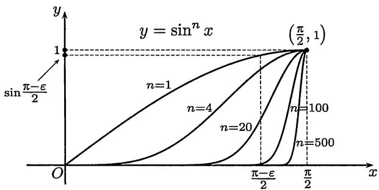

import Guide from '@/components/Guide.astro';
import Knowledge from '@/components/Knowledge.astro';
import Example from '@/components/Example.astro';
import Solution from '@/components/Solution.astro';
import Note from '@/components/Note.astro';
import Block from '@/components/Block.astro';
import Method from '@/components/Method.astro';

本节只列出最重要的两个积分中值定理, 介绍一般书中不放在正文中的两个基本性质, 并讨论第一中值定理的中值 $\xi$ 的取值范围. 此外还介绍对积分求极限的几个重要例题. 关于积分中值定理的应用将在 $10.4.5$ 小节作专题介绍.

## $10.2.1$ 积分中值定理

<Knowledge title="命题$10.2.1$（积分第一中值定理）">
设 $f, g \in R[a, b]$ , $m \leqslant f(x) \leqslant M, \forall x \in [a, b]$ , $g$ 在 $[a, b]$ 上不变号, 则存在 $\eta \in [m, M]$ , 使

$$
\int_ {a} ^ {b} f (x) g (x) \mathrm{d} x = \eta \int_ {a} ^ {b} g (x) \mathrm{d} x.
$$

如果 $f \in C[a, b]$ , $g \in R[a, b]$ 且在 $[a, b]$ 上不变号, 则存在 $\xi \in [a, b]$ , 使

$$
\int_ {a} ^ {b} f (x) g (x) \mathrm{d} x = f (\xi) \int_ {a} ^ {b} g (x) \mathrm{d} x.\tag{10.2}
$$

特别是, 如果 $f \in C[a, b]$ , 则存在 $\xi \in [a, b]$ , 使 $\int_{a}^{b} f(x) \, \mathrm{d}x = f(\xi)(b - a)$ .

<Note>
与微分中值定理 (见 §$7.1$) 作比较, 自然会提出一个问题: 在 $(10.2)$ 中的 $\xi \in [a, b]$ 能否改进为 $\xi \in (a, b)$ ? 答案是肯定的. 证明见后面的例题 $10.2.2$.
</Note>
</Knowledge>

<Knowledge title="命题$10.2.2$（积分第二中值定理）">
设 $f \in R[a, b]$ , $g$ 在 $[a, b]$ 上单调，则存在 $\xi \in [a, b]$ , 使

$$
\int_ {a} ^ {b} f (x) g (x) \mathrm{d} x = g (a) \int_ {a} ^ {\xi} f (x) \mathrm{d} x + g (b) \int_ {\xi} ^ {b} f (x) \mathrm{d} x.
$$

特别是, 如果 $g$ 在 $[a, b]$ 上单调增加且 $g(x) \geqslant 0$ , 则存在 $\xi \in [a, b]$ , 使

$$
\int_ {a} ^ {b} f (x) g (x) \mathrm{d} x = g (b) \int_ {\xi} ^ {b} f (x) \mathrm{d} x;
$$

如果 $g$ 在 $[a, b]$ 上单调减少且 $g(x) \geqslant 0$ , 则存在 $\xi \in [a, b]$ , 使

$$
\int_ {a} ^ {b} f (x) g (x) \mathrm{d} x = g (a) \int_ {a} ^ {\xi} f (x) \mathrm{d} x.
$$

<Note>
积分第二中值定理有几种形式. 上述形式的证明可在很多教科书中找到, 例如 $[25]$ 上册第九章第 $5$ 节. 证明中一般需用 $Abel$ 变换 (见本书下册 $(13.21)$ 和 $[62]$ 的第一章). 但在实际应用中往往不需要这么强的形式. 本书中只在 “ $f \in C[a,b]$ , $g$ 在 $[a,b]$ 上可微且 $g'(x) \leqslant 0$ (或 $\geqslant 0$ ), $\forall x \in (a,b)$ ” 的条件下作出证明, 这时只需用积分第一中值定理 (见例题 $10.4.11$), 中值的取值范围也可改进为 $\xi \in (a,b)$ .
</Note>
</Knowledge>

<Block title="思考题">
1. 举例说明: 在积分第一中值定理中 $g$ 的保号性条件不满足时, 定理的结论可以不成立.

2. 举例说明: 在积分第二中值定理中 $g$ 不是单调函数时, 定理的结论可以不成立.
</Block>

## $10.2.2$ 例题

下面一个例题的结果是定积分的一个基本性质。它对于连续的被积函数是平凡的。对于一般的可积函数则可以用积分定义中介点集的任意性得到。

<Example title="例题$10.2.1$">
设 $f \in R[a, b]$ , 且 $I = \int_{a}^{b} f(x) \, \mathrm{d}x > 0$ , 则有子区间 $[c, d] \subset [a, b]$ 和 $\mu > 0$ , 使在区间 $[c, d]$ 上成立 $f(x) \geqslant \mu$ .

<Solution title="证法1">
从积分定义可知, 存在 $[a,b]$ 的一个分划 $P=\{x_{0},x_{1},\cdots,x_{n}\}$ ，使得对从属于 $P$ 的任何介点集 $\xi$ ，成立

$$
\sum_ {i = 1} ^ {n} f (\xi_ {i}) \Delta x _ {i} > \frac {I}{2} > 0.
$$

记 $m_{i}=\inf_{x\in[x_{i-1},x_{i}]}f(x), i=1,2,\cdots,n,$ 并对于上面的和式取下确界, 就得到

$$
\sum_ {i = 1} ^ {n} m _ {i} \Delta x _ {i} \geqslant \frac {I}{2} > 0.
$$

显然在和式中至少有一项大于 $0$. 设这一项是第 $k$ 项, 则就可取 $\mu = m_k$ , $[c, d] = [x_{k-1}, x_k]$ .
</Solution>

<Solution title="证法2">
用反证法. 若结论不成立, 则 (由对偶法则) 对于每个 $\mu > 0$ 和每个子区间 $[c, d]$ , 存在 $\xi \in [c, d]$ , 满足 $f(\xi) < \mu$ . 在 $f$ 的 $Riemann$ 和式中对于任何分划都取满足这个要求的介点集, 这样就得到 $\int_{a}^{b} f(x) \mathrm{d}x \leqslant \mu(b - a)$ . 由于 $\mu > 0$ 是任意的, 因此只能得到 $\int_{a}^{b} f(x) \mathrm{d}x \leqslant 0$ , 与条件矛盾.
</Solution>

<Note>
若在教科书中有上、下和的 $Darboux$ 理论, 则上题的证明可更为简单.
</Note>
</Example>

在上一个例题的基础上就可以解决关于积分第一中值定理 (命题 $10.2.1$) 中的中值取值范围问题.

<Example title="例题$10.2.2$（对积分第一中值定理的改进）">
如果 $f \in C[a, b]$ , $g \in R[a, b]$ 且在 $[a, b]$ 上不变号，则有 $\eta \in [m, M] = f([a, b])$ 使得成立等式

$$
\int_ {a} ^ {b} f (x) g (x) \mathrm{d} x = \eta \int_ {a} ^ {b} g (x) \mathrm{d} x,\tag{10.3}
$$

而且一定存在 $\xi\in(a,b)$ ，使得 $\eta=f(\xi)$ .

<Solution title="证明">
在此没有必要重复积分第一中值定理的经典证明过程, 下面只讨论一个问题: 能否在开区间 $(a, b)$ 内取到中值 $\xi$ .

下列三种情况是平凡的, 不需要多讨论.

(1) 如果积分 $\int_{a}^{b} g(x) \, \mathrm{d}x = 0$ , 则从积分第一中值定理可见 $(10.3)$ 左边也等于 $0$, 于是 $\xi$ 可任取, 结论已成立.

(2) 如果 $f$ 在 $[a, b]$ 上的最小值和最大值相等, 即有 $m = M$ , 则 $f$ 为常值函数, 因此 $\xi$ 也可任取.

(3) 如果 $m < M$ , 且在等式 $(10.3)$ 中的 $\eta \in (m, M)$ , 则从连续函数的介值性可知存在 $\xi \in (a, b)$ 使得 $f(\xi) = \eta$ .

要讨论的只是以上三种情况之外的问题. 不妨设 $g$ 在区间 $[a, b]$ 上非负, 且有 $\int_{a}^{b} g(x) \mathrm{d}x > 0$ . 又设 $m < M$ , 且不妨只讨论情况 $\eta = m$ .

从例题 $10.2.1$ 知道存在子区间 $[c,d]$ 和 $\mu > 0$ ，使得在 $[c,d]$ 上有

$$
g (x) \geqslant \mu > 0.\tag{10.4}
$$

又由于 $f(x) - m$ 和 $g(x)$ 在 $[a, b]$ 上均非负，因此从等式 $(10.3)$ 得到

$$
0 = \int_ {a} ^ {b} (f (x) - m) g (x) \mathrm{d} x \geqslant \int_ {c} ^ {d} (f (x) - m) g (x) \mathrm{d} x \geqslant \mu \int_ {c} ^ {d} (f (x) - m) \mathrm{d} x \geqslant 0,
$$

可见上式最右边的积分等于 $0$. 由于 $f \in C[c, d]$ , 这只能导致在 $[c, d]$ 上成立

$$
f (x) \equiv m.
$$

因此在 $(c,d)\subset (a,b)$ 中任取一点作为中值 $\xi$ 即可.
</Solution>

<Note>
关于这个问题的讨论有许多文献, 可以参考 $[53, 57]$. 在 $[53]$ 中指出, 若 $f$ 的连续性条件改为只是可积, 则结论不成立. 而在 $[57]$ 中则证明: 如果 $f$ 既可积又有原函数, 则仍有 $\xi \in (a, b)$ (这将作为本章的第一组参考题 $11$).
</Note>
</Example>

下一例题的结论与例题 $10.2.1$ 具有某种互补性, 也是可积函数的一个基本性质. 从方法上看则需要用实数系的基本定理 (参见第三章).

<Example title="例题$10.2.3$">
设在区间 $[a, b]$ 上处处大于 $0$ 的函数 $f \in R[a, b]$ , 则有

$$
\int_ {a} ^ {b} f (x) \mathrm{d} x > 0.
$$

<Solution title="证明">
用反证法. 这时易知 $f$ 在 $[a, b]$ 上的定积分非负. 如果有 $\int_{a}^{b} f(x) \mathrm{d}x = 0$ , 则可如下导致矛盾.

首先, 为在记号上不引起混淆, 将例题 $10.2.1$ 的部分结论用文字概述如下:

若某定积分大于 $0$，则其被积函数必在积分区间的某子区间上大于 $0$. $(10.5)$

对于 $\varepsilon > 0$ , 在反证法的前提 $\int_{a}^{b} f(x) \, \mathrm{d}x = 0$ 下, 函数 $\varepsilon - f$ 在 $[a, b]$ 上的定积分为 $\varepsilon(b - a) > 0$ . 用 $(10.5)$ 就可以得到

$\int_{a}^{b} (\varepsilon - f(x)) \, \mathrm{d}x > 0 \Longrightarrow \exists [c, d] \subset [a, b]$ ，使得 $f(x) < \varepsilon, \forall x \in [c, d]$ . 这时 $f$ 在 $[c, d]$ 上的积分仍然是 $0$.

$(10.6)$

以下应用实数系的闭区间套定理 (见 §$3.2$).

令 $\varepsilon_{n} = 1 / n, n\in \mathbf{N}_{+}$ .对于 $n = 1$ ，改记 $(10.6)$ 中的 $[c,d]$ 为 $[a_1,b_1]$ .在 $[a_1,b_1]$ 上 $f$ 的积分为 $0$．对于 $n = 2$ 用 $(10.6)$ 得到的 $[c,d]$ 记为 $[a_2,b_2]$ .如此归纳地用 $(10.6)$，就得到闭区间套 $\{[a_n,b_n]\}$ ，使得对每个 $n$ ，在区间 $[a_n,b_n]$ 上成立不等式

$$
f (x) <   \frac {1}{n}.
$$

根据闭区间套定理, 在 $[a, b]$ 中存在属于每个闭区间 $[a_n, b_n]$ 的点 $\xi$ , 也就是说对每个 $n$ 成立

$$
f (\xi) <   \frac {1}{n}.
$$

于是只能是 $f(\xi) \leqslant 0$ , 但这与假设条件中 $f$ 在 $[a, b]$ 上处处大于 $0$ 相矛盾. $\square$
</Solution>

<Note>
如 $10.1.3$ 小节开始所说, 上面的例题 $10.2.1$ 和 $10.2.3$ 均可从 $Lebesgue$ 定理 (命题 $10.1.6$) 推得. 读者可以一试. 但“杀鸡可不用牛刀”, 因此我们只从积分定义出发给出它们的证明. 例题 $10.2.3$ 也可从第一组参考题 $8$ 推出.
</Note>
</Example>

## $10.2.3$ 对积分求极限

定积分是一个数. 如果其中的被积函数带有参数, 则就会得到数列或函数, 从而就会出现对积分求极限的问题 (也称为在积分号下求极限的问题). 这一小节主要考虑离散参数情况.

设有一列函数 $f_{n}(x) \in R[a, b]$ , $n \in \mathbf{N}_{+}$ , 又在 $[a, b]$ 上处处有极限 $\lim_{n \to \infty} f_{n}(x) = f(x)$ , 而且极限函数 $f \in R[a, b]$ , 这时经常会问下列等式是否成立:

$$
\lim _ {n \rightarrow \infty} \int_ {a} ^ {b} f _ {n} (x) \mathrm{d} x \stackrel {?} {=} \int_ {a} ^ {b} \lim _ {n \rightarrow \infty} f _ {n} (x) \mathrm{d} x = \int_ {a} ^ {b} f (x) \mathrm{d} x.\tag{10.7}
$$

这就是两种极限运算是否可以交换顺序的问题.

“不幸”的是, 对于问题 $(10.7)$ 的答案是“不一定”. 例如, 设

$$
f _ {n} (x) = {\left\{ \begin{array}{l l} {n,} & {0 <   x \leqslant {\frac {1}{n}},} \\ {0,} & {{\frac {1}{n}} <   x \leqslant 1 {\text {或}} x = 0,} \end{array} \right.}
$$

则对一切 $x \in [0,1]$ , 有

$$
f (x) = \lim _ {n \rightarrow \infty} f _ {n} (x) = 0.
$$

但容易验证

$$
\lim _ {n \rightarrow \infty} \int_ {0} ^ {1} f _ {n} (x) \mathrm{d} x = 1 \neq 0 = \int_ {0} ^ {1} f (x) \mathrm{d} x.
$$

这说明在对积分求极限 (也称为在积分号下求极限) 时, 不能随意将求极限运算与求积分运算交换顺序. 对于这种交换极限顺序问题的一般性讨论, 需要函数项级数和多元微积分的知识, 将在本书下册的 §$14.2$ 和 $18.1.5$ 小节中介绍. 下面将通过一个典型例题, 说明如何利用定积分的性质和一些技巧来解决一些较简单的问题.

<Example title="例题$10.2.4$">
证明： $\lim_{n\to \infty}\int_0^{\pi /2}\sin^n x\mathrm{d}x = 0.$

由于本题的积分是定积分的重要结果 (见例题 $10.4.9$), 因此可将本题变为普通的数列极限问题, 而且还可以引用 $2.3.2$ 小节的练习题 $8$. 但这种方法过分地依赖于定积分计算, 积不出怎么办? 所以我们下面要介绍新的方法.

<Solution title="证明">
**分析** 首先是从几何上作观察. 在图 $10.3$ 中作出了 $n = 1,4,20,100,500$ 时的函数 $\sin^n x$ 的几何图像.

  
图$10.3$

从图中可以看出, 由于 $\sin \frac{\pi}{2} = 1$ , 因此对每个 $n$ , 当 $x$ 与 $\frac{\pi}{2}$ 充分接近时, 函数值 $\sin^n x$ 一定接近 $1$. 另一方面, 对于固定的 $x$ 值, 只要 $x$ 小于 $\frac{\pi}{2}$ , 则当 $n$ 增加时函数值 $\sin^n x$ 就很快趋于 $0$. 这就是下面的“分而治之”方法的几何背景.

按照数列极限的 $\varepsilon-N$ 定义写出证明.

对于给定的 $\varepsilon > 0$ , 不妨设 $\varepsilon < \pi$ , 可以将积分分拆如下 (参看图$10.3$):

$$
\begin{array}{l} 0 \leqslant \int_ {0} ^ {\pi / 2} \sin^ {n} x \mathrm{d} x = \int_ {0} ^ {(\pi - \varepsilon) / 2} \sin^ {n} x \mathrm{d} x + \int_ {(\pi - \varepsilon) / 2} ^ {\pi / 2} \sin^ {n} x \mathrm{d} x \\ \leqslant \frac {\pi}{2} \sin^ {n} \frac {\pi - \varepsilon}{2} + \frac {\varepsilon}{2}. \end{array}\tag{10.8}
$$

由 $0 < \sin \frac{\pi - \varepsilon}{2} < 1$ , 可见 $\lim_{n \to \infty} \sin^n \frac{\pi - \varepsilon}{2} = 0$ . 从而对上述 $\varepsilon, \exists N$ , 使 $n > N$ 时, 成立

$$
0 <   \frac {\pi}{2} \sin^ {n} \frac {\pi - \varepsilon}{2} <   \frac {\varepsilon}{2}.
$$

因此 $n > N$ 时，就有 $0 \leqslant \int_{0}^{\pi / 2} \sin^n x \, \mathrm{d}x < \varepsilon$ .
</Solution>

<Note>
**注1** 利用上、下极限工具(见 §$3.6$)，还可将证明写得简洁一些. 在 $(10.8)$ 的不等式中直接令 $n \to \infty$ ，就得到

$$
0 \leqslant \varliminf_ {n \rightarrow \infty} \int_ {0} ^ {\pi / 2} \sin^ {n} x \mathrm{d} x \leqslant \varlimsup_ {n \rightarrow \infty} \int_ {0} ^ {\pi / 2} \sin^ {n} x \mathrm{d} x \leqslant \frac {\varepsilon}{2}.
$$

利用 $\varepsilon > 0$ 的任意性, 可见上、下极限相等且为 $0$.
</Note>

<Note>
**注2** 在分拆积分时可以采取动态方法, 例如在 $[41]$ 中按照区间

$$
\left[ 0, \frac {\pi}{2} - \frac {1}{\sqrt [ 3 ]{n}} \right] \text {和} \left[ \frac {\pi}{2} - \frac {1}{\sqrt [ 3 ]{n}}, \frac {\pi}{2} \right]
$$

拆成两个积分, 然后分别证明它们 (作为数列) 当 $n \to \infty$ 时的极限都是 $0$. 读者可以一试.
</Note>

<Note>
**注3** 本题的常见错误如下:

由积分第一中值定理， $\exists \xi \in \left(0, \frac{\pi}{2}\right)$ ，使得

$$
\int_ {0} ^ {\pi / 2} \sin^ {n} x \mathrm{d} x = \sin^ {n} \xi \int_ {0} ^ {\pi / 2} \mathrm{d} x = \frac {\pi}{2} \sin^ {n} \xi .
$$

不难看出一定有 $0 < \sin \xi < 1$ 成立, 因此得到

$$
\lim _ {n \rightarrow \infty} \int_ {0} ^ {\pi / 2} \sin^ {n} x \mathrm{d} x = \lim _ {n \rightarrow \infty} \frac {\pi}{2} \sin^ {n} \xi = 0.
$$

错误分析 错误在于 $\xi$ 不是常数, 而是随着 $n$ 的变化而变化的, 应该记为 $\xi_{n}$ . 当 $n \to \infty$ 时, 不难证明有 $\xi_{n} \to \frac{\pi}{2}$ , 因此 $\sin^{n} \xi_{n}$ 是 $1^{\infty}$ 型的不定式. 回忆数列极限的内容, 我们知道, 从一个数列 $\{a_{n}\}$ 的每一项满足 $0 < a_{n} < 1$ 是得不出 $\lim_{n \to \infty} a_{n}^{n} = 0$ 的 (试举例).
</Note>
</Example>

下一题是例题 $2.2.3$ 在积分学中的推广.

<Example title="例题$10.2.5$">
设非负函数 $f \in C[a, b]$ , 证明:

$$
\lim _ {n \to \infty} \left(\int_ {a} ^ {b} f ^ {n} (x) \mathrm{d} x\right) ^ {\frac {1}{n}} = \max \{f (x) \mid x \in [ a, b ] \}.\tag{10.9}
$$

<Solution title="证明">
**分析** 设 $M = \max \{f(x) \mid x \in [a, b]\}$ . 由于 $M = 0$ 时等式显然成立, 因此只要考虑 $M > 0$ . 利用熟知的极限 $\lim_{n \to \infty} \sqrt[n]{a} = 1 (a > 0)$ , 可见若存在区间 $[\alpha, \beta] \subseteq [a, b]$ , 使在这个区间上有

$$
f (x) \geqslant M,\tag{10.10}
$$

那么由

$$
\left(\int_ {a} ^ {b} f ^ {n} (x) \mathrm{d} x\right) ^ {\frac {1}{n}} \geqslant \left(\int_ {\alpha} ^ {\beta} f ^ {n} (x) \mathrm{d} x\right) ^ {\frac {1}{n}} \geqslant M (\beta - \alpha) ^ {\frac {1}{n}} \rightarrow M (n \rightarrow \infty),
$$

问题便解决了. 但 $M$ 是函数 $f$ 的最大值, 因此一般来说 $(10.10)$ 不可能成立. 现在我们退而求其次, 对 $0 < \varepsilon < M$ , 将 $(10.10)$ 中的 $M$ 改为 $M - \varepsilon$ 则不难实现. 下面就是将这个证法写出来而已.

如果 $f(x) \equiv 0$ , 则所证等式显然成立. 否则, 设 $M = \max \{f(x) \mid x \in [a, b]\}$ , 则 $M > 0$ .

对 $0 < \varepsilon < M, \exists [\alpha, \beta] \subseteq [a, b]$ , 使得

$$
M - \varepsilon \leqslant f (x) \leqslant M, \quad x \in [ \alpha , \beta ].
$$

于是有

$$
\left(\int_ {a} ^ {b} f ^ {n} (x) \mathrm{d} x\right) ^ {\frac {1}{n}} \geqslant \left(\int_ {\alpha} ^ {\beta} f ^ {n} (x) \mathrm{d} x\right) ^ {\frac {1}{n}} \geqslant (M - \varepsilon) (\beta - \alpha) ^ {\frac {1}{n}}.
$$

对于不等式

$$
M (b - a) ^ {\frac {1}{n}} \geqslant \left(\int_ {a} ^ {b} f ^ {n} (x) \mathrm{d} x\right) ^ {\frac {1}{n}} \geqslant (M - \varepsilon) (\beta - \alpha) ^ {\frac {1}{n}},
$$

利用上、下极限工具就得到

$$
M \geqslant \varlimsup_ {n \rightarrow \infty} \left(\int_ {a} ^ {b} f ^ {n} (x) \mathrm{d} x\right) ^ {\frac {1}{n}} \geqslant \varliminf_ {n \rightarrow \infty} \left(\int_ {a} ^ {b} f ^ {n} (x) \mathrm{d} x\right) ^ {\frac {1}{n}} \geqslant M - \varepsilon .
$$

从 $\varepsilon$ 的任意性可见上、下极限相等且等于 $M$.
</Solution>
</Example>

对含有参数的积分求极限的例题很多. 下面的 $Riemann$ 引理是研究 $Fourier$ (傅里叶) 级数的基本工具, 其证明在一般教科书中都可找到.

<Example title="例题$10.2.6$（$Riemann$引理）">
设 $f \in R[a, b]$ ，则

$$
\lim _ {p \to + \infty} \int_ {a} ^ {b} f (x) \sin p x \mathrm{d} x = 0, \quad \lim _ {p \to + \infty} \int_ {a} ^ {b} f (x) \cos p x \mathrm{d} x = 0.
$$
</Example>

这个结论可以推广为

<Example title="例题$10.2.7$（$Riemann$定理）">
设 $f \in R[a, b]$ ，$g$ 以 $T$ 为周期且在 $[0, T]$ 上可积，则

$$
\lim _ {p \rightarrow + \infty} \int_ {a} ^ {b} f (x) g (p x) \mathrm{d} x = \frac {1}{T} \int_ {0} ^ {T} g (x) \mathrm{d} x \int_ {a} ^ {b} f (x) \mathrm{d} x.
$$

<Note>
其证明留作为本章的第二组参考题 $4$. 需要指出, 以上两个结果对于 (第十二章中的) 广义可积函数 $f$ 也是成立的, 但这时要求 $f$ 还是绝对可积的.
</Note>
</Example>

## $10.2.4$ 练习题

<Block title="练习题">
1. 设 $f \in C[a, b]$ , 且对满足条件 $g(a) = g(b) = 0$ 的每个函数 $g \in C[a, b]$ , 都有 $\int_{a}^{b} f(x) g(x) \mathrm{d}x = 0$ , 证明: $f \equiv 0$ .

2. 设非负函数 $f \in R[a, b]$ ，且 $\int_{a}^{b} f > 0$ ，若有多项式 $P$ 使 $\int_{a}^{b} P^{2}(x)f(x) \, \mathrm{d}x = 0$ ，证明： $P \equiv 0$ .

3. 设 $f \in C[-1,1]$ , 且对 $[-1,1]$ 上的每个可积偶函数 $g$ 都有 $\int_{-1}^{1} f(x)g(x) \, \mathrm{d}x = 0$ , 证明: $f$ 是 $[-1,1]$ 上的奇函数.

4. 计算极限 $\lim_{n\to \infty}\int_0^1 (1 - x^2)^n\mathrm{d}x.$

5. 分析例题 $10.2.4$ 的条件和证明过程, 试写出它的可能推广, 并作出证明.

(这是一道开放题, 要求设计出一定的条件, 使 $\lim_{n\to \infty}\int_a^b f^n (x)\mathrm{d}x = 0$ 成立.)

6. 已知 $x_{n} \in \left[0, \frac{\pi}{2}\right]$ ， $n = 1, 2, \cdots$ ，且满足 $\frac{2}{\pi} \int_{0}^{\pi/2} \sin^{n} x \, dx = \sin^{n} x_{n}$ ，计算极限 $\lim_{n \to \infty} x_{n}$ .

7. 设 $f \in C[-1, 1]$ ，证明： $\lim_{h \to 0^{+}} \int_{-1}^{1} \frac{h}{h^2 + x^2} f(x) \, \mathrm{d}x = \pi f(0)$ .

8. 设 $f \in C[0,1]$ , 计算:

(1) $\lim_{n\to \infty}\int_0^1 x^n f(x)\mathrm{d}x,$ (2) $\lim_{n\to \infty}\int_0^1 nx^n f(x)\mathrm{d}x.$

9. 设正数列 $\{a_{n}\}$ 满足 $\lim_{n\to \infty}\int_0^{a_n}x^n\mathrm{d}x = 2,$ 计算极限 $\lim_{n\to \infty}a_n.$

10. 设 $n \in \mathbf{N}_+$ , $I_n = \int_0^{\pi/2} \frac{\sin^2 n t}{\sin t} \, \mathrm{d}t$ , 计算极限 $\lim_{n \to \infty} \frac{I_n}{\ln n}$ .
</Block>
