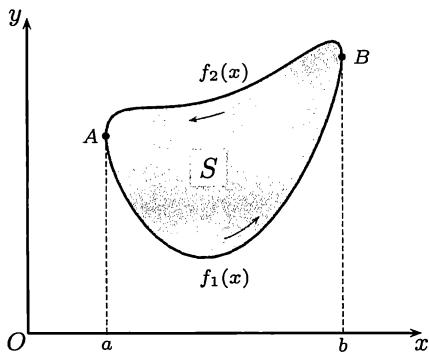
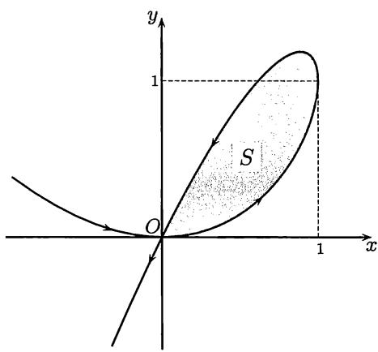
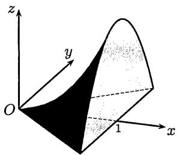

import Guide from '@/components/Guide.astro';
import Knowledge from '@/components/Knowledge.astro';
import Example from '@/components/Example.astro';
import Solution from '@/components/Solution.astro';
import Note from '@/components/Note.astro';
import Block from '@/components/Block.astro';
import Method from '@/components/Method.astro';

## 11.1.1 基本公式与方法

对于平面图形的面积计算，除了可以用几个曲边梯形面积的代数和来计算之外，还可以用下面两个公式，它们在许多问题中比直角坐标下的公式要方便。

<Block title="面积公式列表">

1. 设没有自交点的平面封闭曲线的参数方程为 $x = x(t), y = y(t), t \in [\alpha, \beta]$ ，当 $t$ 从 $\alpha$ 增加到 $\beta$ 时，点 $(x(t), y(t))$ 以逆时针方向绕闭曲线一周，则该闭曲线所围面积为

$$
S = \frac {1}{2} \int_ {\alpha} ^ {\beta} (x \mathrm{d} y - y \mathrm{d} x).\tag{11.1}
$$

这个公式实际上是下册的 §24.3 中关于第二型曲线积分的 $Green$ (格林) 公式的特例. 对于比较简单的情况将在下面给出证明.

2. 在极坐标中由射线 $\theta = \theta_{1}, \theta = \theta_{2}$ (其中 $\theta_{1} < \theta_{2}$ ) 与连续曲线 $\rho = \rho(\theta)$ 围成的扇形面积为

$$
S = \frac {1}{2} \int_ {\theta_ {1}} ^ {\theta_ {2}} \rho^ {2} (\theta) \mathrm{d} \theta .\tag{11.2}
$$

在一定的条件下，利用一元函数定积分还可以计算某些三维形体的体积和侧面积. 这些公式以及求曲线弧长的公式在一般教科书中都有，这里不再列出.

</Block>

需要学习的是导出这些公式中所用的方法.

关于体积与侧面积公式的严格讨论，要以多元微积分为基础才能进行. 在现阶段，它们的推导是基于微元法. 这种方法虽然并不完全严格，但被广泛用于计算分布在区间 $[a, b]$ 上的几何量以及物理量，其中实际上包含了两个内容:

<Method title="以直代曲法">
计算分布在充分小的区间 $[x, x + \Delta x] \subseteq [a, b]$ 上的部分几何量时，对那些当 $\Delta x \to 0$ 时，其长度趋于 $0$ 的曲线段，可以用连接曲线端点的直线段来代替进行计算. 如果由此得到的量可表示为 $f(\xi) \Delta x$ ，其中 $\xi \in [x, x + \Delta x]$ ，则所求的几何量为 $\int_{a}^{b} f(x) \mathrm{d}x$ .
</Method>

<Method title="舍弃高阶无穷小量法">
如果存在 $M > 0, p > 1$ ，使在任一充分小的区间 $[x, x + \Delta x] \subseteq [a, b]$ 上，成立

$$
| g (\eta) \Delta x - f (\xi) \Delta x | \leqslant M (\Delta x) ^ {p},
$$

其中 $\eta, \xi \in [x, x + \Delta x]$ ，$f(\xi) \Delta x$ 为用以直代曲法得出的部分量，则所求的几何量也可写成积分 $\int_{a}^{b} g$ . 在对具体问题应用舍弃高阶无穷小量法时，我们往往取 $p = 2$ .
</Method>

## 11.1.2 例题

<Block title="公式(11.1)的证明">
平面图形的面积计算公式 (11.1) 往往很有用。由于目前的各种教科书在定积分应用部分不一定都有介绍，因此我们在这里仿照 [42] 给出简单情况下的一个证明，其中假定运算所需要的连续和可微等条件均满足。

如图11.1所示的一条封闭曲线由参数方程 $x = x(t), y = y(t) (\alpha \leqslant t \leqslant \beta)$ 所描述。当 $t$ 从 $\alpha$ 到 $\beta$ 时，点 $(x(t), y(t))$ 从 $A$ 点出发按逆时针方向经过 $B$ 点绕曲线一周回到 $A$ 点。设 $A, B$ 两点的横坐标分别是函数 $x(t)$ 在区间 $[\alpha, \beta]$ 上的最小值和最大值。 $A$ 点对应的参数值是 $\alpha$ 和 $\beta, B$ 点对应的参数值为 $\gamma$ 。设从 $A$ 点到 $B$ 点的两段曲线在直角坐标下的方程为 $f_1(x)$ 和 $f_2(x)$ ， $a \leqslant x \leqslant b$ ，且如图所示在区间 $(a, b)$ 上有 $f_2(x) > f_1(x)$ 。

<figure class="vp-figure">
  
  <figcaption>图11.1</figcaption>
</figure>

这样就可以计算封闭曲线所包含的图形面积如下:

$$
\begin{array}{r l} S & = \int_ {a} ^ {b} [ f _ {2} (x) - f _ {1} (x) ] \mathrm{d} x \\ & = \int_ {\beta} ^ {\gamma} y (t) \mathrm{d} x (t) - \int_ {\alpha} ^ {\gamma} y (t) \mathrm{d} x (t) = - \int_ {\alpha} ^ {\beta} y (t) \mathrm{d} x (t), \end{array}
$$

由分部积分又可得到

$$
S = - y (t) x (t) \bigg | _ {\alpha} ^ {\beta} + \int_ {\alpha} ^ {\beta} x (t) \mathrm{d} y (t) = \int_ {\alpha} ^ {\beta} x (t) \mathrm{d} y (t).
$$

取两者的平均值就得到公式 (11.1).

<Note title="注 1">
从证明中可见实际上得到了计算面积 $S$ 的三个公式. 但是将前两个取平均值后得到的公式 (11.1) 在计算中一般较为方便, 这从下面举例就可明白. 此外, 如前所说, 该公式对于一般的没有自交点的参数曲线都是成立的.
</Note>

<Note title="注 2">
由于极坐标下的 $\theta$ 就可看成为参数, 因此完全可以从公式 (11.1) 推导出极坐标下的扇形面积计算公式 (11.2) (留作为 11.1.4 小节的练习题 2).
</Note>

</Block>

<Example title="例 11.1.1">
求由方程 $x^{2} + xy + y^{2} = 1$ 所确定的图形面积.

这就是求 $174$ 页上图 $6.5$ 所示椭圆的面积. 容易想到的一种思路是: 先用解析几何中的转轴方法消去交叉项, 由此确定椭圆的长、短半轴, 最后用简单的定积分计算即可求出椭圆面积. 以下是不用转轴的几种积分解法.

<Solution title="解1">
从方程解出

$$
y _ {1, 2} (x) = - \frac {x}{2} \pm \sqrt {1 - \frac {3}{4} x ^ {2}}, \quad - \frac {2}{\sqrt {3}} \leqslant x \leqslant \frac {2}{\sqrt {3}},
$$

然后计算定积分

$$
\begin{array}{l} S = \int_ {- 2 / \sqrt {3}} ^ {2 / \sqrt {3}} [ y _ {1} (x) - y _ {2} (x) ] \mathrm{d} x = 2 \int_ {- 2 / \sqrt {3}} ^ {2 / \sqrt {3}} \sqrt {1 - \frac {3}{4} x ^ {2}} \mathrm{d} x \\ = \frac {4}{\sqrt {3}} \int_ {- \pi / 2} ^ {\pi / 2} \cos^ {2} \theta \mathrm{d} \theta = \frac {2 \pi}{\sqrt {3}}. \end{array}
$$
</Solution>

<Solution title="解2">
用极坐标, 以 $x = r \cos \theta, y = r \sin \theta$ 代入方程, 得到

$$
r ^ {2} = \frac {1}{1 + \sin \theta \cos \theta}.
$$

用公式 (11.2) 计算定积分:

$$
S = \frac {1}{2} \int_ {0} ^ {2 \pi} r ^ {2} \mathrm{d} \theta = \frac {1}{2} \int_ {0} ^ {2 \pi} \frac {\mathrm{d} \theta}{1 + \frac {1}{2} \sin 2 \theta} = \int_ {0} ^ {2 \pi} \frac {\mathrm{d} \varphi}{2 + \sin \varphi} = \frac {2 \pi}{\sqrt {3}}.
$$
</Solution>

<Note title="注 1">
一个更简单的方法是: 从表达式 $r^{-2} = 1 + \frac{1}{2} \sin 2\theta$ 出发, 求出 $r$ 的最大值和最小值, 即椭圆的长半轴和短半轴, 然后利用椭圆面积公式就可计算出 $S$.
</Note>

<Solution title="解3">
先将方程左边配方为

$$
x ^ {2} + x y + y ^ {2} = \frac {3}{4} x ^ {2} + \left(y + \frac {x}{2}\right) ^ {2} = 1,
$$

然后引入参数方程

$$
x = \frac {2}{\sqrt {3}} \cos t, y = \sin t - \frac {1}{\sqrt {3}} \cos t, 0 \leqslant t \leqslant 2 \pi .
$$

由于

$$
\begin{array}{l} x (t) y ^ {\prime} (t) - y (t) x ^ {\prime} (t) \\ = \frac {2}{\sqrt {3}} \cos t \left(\cos t + \frac {1}{\sqrt {3}} \sin t\right) - \left(\sin t - \frac {1}{\sqrt {3}} \cos t\right) \left(- \frac {2}{\sqrt {3}} \sin t\right) \\ = \frac {2}{\sqrt {3}}, \end{array}
$$

因此最后的定积分计算极其简单:

$$
S = \frac {1}{2} \int_ {0} ^ {2 \pi} (x \mathrm{d} y - y \mathrm{d} x) = \frac {1}{2} \int_ {0} ^ {2 \pi} \frac {2}{\sqrt {3}} \mathrm{d} t = \frac {2 \pi}{\sqrt {3}}.
$$
</Solution>

<Note title="注 2">
在 [59] 第二册的习题 $2406$ 的讲解中, 列举了求椭圆

$$

A x ^ {2} + 2 B x y + C y ^ {2} = 1 (A > 0, \Delta = A C - B ^ {2} > 0)

$$

所围面积的 $10$ 种解法, 其中解 $8$ 和解 $9$ 是多元微积分知识的应用, 解 $10$ 则是代数方法. 此外, 还对于这些解法能否推广做了一点评论.
</Note>

</Example>

<Example title="例 11.1.2">
求由 $y^{2}-2xy+x^{3}=0$ 所确定的封闭曲线所包围的图形面积.

分析 为了知道图形的形状，需要找出 $y$ 随 $x$ 变化的规律. 为此需要引入参数. 令 $y = tx$ 是常用的方法. 这样就可以得到参数方程:

$$
x = 2 t - t ^ {2}, y = 2 t ^ {2} - t ^ {3}.
$$

首先分析 $x = x(t)$ 和 $y = y(t)$ 的变化情况，然后就不难合成 $xOy$ 坐标平面上的曲线. 利用这些分析就可以画出题设的曲线图形如图11.2所示. (参看例题8.6.1中对于类似问题的分析.) 当变量 $t$ 从0到2时点 $(x(t), y(t))$ 从原点出发又回到原点，恰好按照逆时针方向描出图中的一条封闭曲线.

<figure class="vp-figure">
  
  <figcaption>图11.2</figcaption>
</figure>

<Solution title="解1">
利用直角坐标下的公式. 由于不难从方程直接解出

$$
y _ {1, 2} (x) = x (1 \pm \sqrt {1 - x}), 0 \leqslant x \leqslant 1,
$$

因此就有

$$
\begin{array}{l} S = \int_ {0} ^ {1} (x + x \sqrt {1 - x}) \mathrm{d} x - \int_ {0} ^ {1} (x - x \sqrt {1 - x}) \mathrm{d} x = 2 \int_ {0} ^ {1} x \sqrt {1 - x} \mathrm{d} x \\ = 2 \int_ {0} ^ {1} (1 - t) \sqrt {t} \mathrm{d} t = 2 \left(\frac {2}{3} t ^ {3 / 2} - \frac {2}{5} t ^ {5 / 2}\right) \Big | _ {0} ^ {1} = \frac {8}{1 5}. \end{array}
$$
</Solution>

<Solution title="解2">
用公式(11.1):

$$
\begin{array}{r l} & {S = \frac {1}{2} \int_ {0} ^ {2} (x \mathrm{d} y - y \mathrm{d} x) = \frac {1}{2} \int_ {0} ^ {2} [ (2 t - t ^ {2}) \mathrm{d} (2 t ^ {2} - t ^ {3}) - (2 t ^ {2} - t ^ {3}) \mathrm{d} (2 t - t ^ {2}) ]} \\ & {\quad = \frac {1}{2} \int_ {0} ^ {2} (4 t ^ {2} - 4 t ^ {3} + t ^ {4}) \mathrm{d} t = \frac {8}{1 5}.} \end{array}
$$
</Solution>

</Example>

<Example title="例 11.1.3">
设曲线方程为 $y = \int_0^x\sqrt{\sin t}\mathrm{d}t, 0 \leqslant x \leqslant \pi,$ 求曲线的长度.

<Solution title="解">
记方程为 $y = f(x)$ ，由弧长公式计算定积分：

$$
\begin{array}{r l} & {l = \int_ {0} ^ {\pi} \sqrt {1 + f ^ {\prime 2} (x)} \mathrm{d} x = \int_ {0} ^ {\pi} \sqrt {1 + \sin x} \mathrm{d} x} \\ & {\quad = \int_ {0} ^ {\pi} \left(\sin \frac {x}{2} + \cos \frac {x}{2}\right) \mathrm{d} x \text {(作代换} t = \frac {x}{2})} \\ & {\quad = 2 \left(\int_ {0} ^ {\pi / 2} \sin t \mathrm{d} t + \int_ {0} ^ {\pi / 2} \cos t \mathrm{d} t\right) = 4 \int_ {0} ^ {\pi / 2} \sin t \mathrm{d} t = 4.} \end{array}
$$
</Solution>

</Example>

<Example title="例 11.1.4">
求双曲抛物面 $z = x^{2} - y^{2}$ 与平面 $x = 1, z = 0$ 所围成的立体体积.

分析 如图 11.3 所示, 该立体不是旋转体. 我们将用两种方法求解. 先计算平行于坐标平面 $yOz$ 的平面或平行于坐标平面 $xOy$ 的平面截立体所得的面积 $A(x)$ 或 $B(z)$, 然后计算定积分

$$
\int_ {0} ^ {1} A (x) \mathrm{d} x \quad \text {或} \quad \int_ {0} ^ {1} B (z) \mathrm{d} z
$$

得到所论立体的体积

<figure class="vp-figure">
  
  <figcaption>图11.3</figcaption>
</figure>

<Solution title="解1">
$x$ 的变化范围是 $0 \leqslant x \leqslant 1$ . 对每个固定的 $x \in [0,1]$ ，计算截面积 $A(x)$ 时， $z = x^{2} - y^{2}$ 成为抛物线的方程，其中 $y \in [-x, x]$ . 从而得到

$$
\begin{array}{r l} A (x) & = 2 \int_ {0} ^ {x} (x ^ {2} - y ^ {2}) \mathrm{d} y \\ & = 2 \left(x ^ {3} - \frac {1}{3} x ^ {3}\right) = \frac {4}{3} x ^ {3}. \end{array}
$$

因此, 所求的体积为

$$
V = \frac {4}{3} \int_ {0} ^ {1} x ^ {3} \mathrm{d} x = \frac {1}{3}.
$$
</Solution>

<Solution title="解2">
$z$ 的变化范围也是 $0 \leqslant z \leqslant 1$ ，这可由 $x = 1$ 时 $z = 1 - y^2$ ，而 $|y| \leqslant 1$ 得到. 计算 $B(z)$ 时, 也应把 $z$ 看作在 $[0,1]$ 上取值的固定数, 于是 $z = x^2 - y^2$ 成为双曲线方程 $y^2 = x^2 - z$ ， $x \in [\sqrt{z}, 1]$ 或 $y = \pm \sqrt{x^2 - z}$ ， $x \in [\sqrt{z}, 1]$ . 这样, $B(z)$ 便是平面 $Z = z$ 上的上述双曲线与 $x = 1$ 围成的弓形面积, 因此利用图形关于 $x$ 轴的对称性, 可以计算得到

$$
\begin{array}{r l} & B (z) = 2 \int_ {\sqrt {z}} ^ {1} \sqrt {x ^ {2} - z} \mathrm{d} x = \left(x \sqrt {x ^ {2} - z} - z \ln \left(x + \sqrt {x ^ {2} - z}\right)\right) \bigg | _ {\sqrt {z}} ^ {1} \\ & \qquad = \sqrt {1 - z} - z \ln \left(1 + \sqrt {1 - z}\right) + z \ln \sqrt {z}. \end{array}
$$

因此所求的体积为

$$
\begin{array}{l} V = \int_ {0} ^ {1} B (z) \mathrm{d} z \\ = \int_ {0} ^ {1} \sqrt {1 - z} \mathrm{d} z - \int_ {0} ^ {1} z \ln \left(1 + \sqrt {1 - z}\right) \mathrm{d} z + \int_ {0} ^ {1} z \ln \sqrt {z} \mathrm{d} z. \end{array}
$$

显然这三个积分的计算要比解1中的计算复杂得多(细节从略)，最后结果为

$$
V = \frac {2}{3} - \frac {5}{2 4} - \frac {1}{8} = \frac {1}{3}.
$$
</Solution>

<Note title="注">
由此可见, 在利用平行的截面面积求体积的问题中, 选择合适的截面是十分重要的. 请读者考虑, 本题如果通过用平行于坐标平面 $xOz$ 的平面去截所论立体, 先计算与 $y$ 有关的截面积后再积分的方法求体积, 计算过程是否简便?
</Note>

</Example>

## 11.1.3 Guldin定理

质心是一个物理量. $Guldin$ (古尔丁) 的第一和第二定理将求旋转体的体积和侧面积转化为求质心, 体现了数学问题与物理问题之间的内在联系.

<Knowledge title="命题 11.1.1 (质心公式)">
设密度均匀的平面图形分布在直线 $X = a, X = b$ 和 $Y = c, Y = d$ 之间，且对任一 $x \in [a, b]$ 和 $y \in [c, d]$ ，直线 $X = x$ 和 $Y = y$ 截图形的线段长度为 $s(x)$ 和 $t(y)$ ，则图形的质心的横坐标与纵坐标分别为

$$
x _ {c} = \frac {\int_ {a} ^ {b} x s (x) \mathrm{d} x}{\int_ {a} ^ {b} s (x) \mathrm{d} x}, \quad y _ {c} = \frac {\int_ {c} ^ {d} y t (y) \mathrm{d} y}{\int_ {c} ^ {d} t (y) \mathrm{d} y};\tag{11.3}
$$
</Knowledge>

而密度均匀的分段光滑曲线 $y = f(x) (a \leqslant x \leqslant b)$ 的质心的横坐标与纵坐标分别为

$$
x _ {c} = \frac {\int_ {a} ^ {b} x \sqrt {1 + f ^ {\prime 2} (x)} \mathrm{d} x}{\int_ {a} ^ {b} \sqrt {1 + f ^ {\prime 2} (x)} \mathrm{d} x}, y _ {c} = \frac {\int_ {a} ^ {b} f (x) \sqrt {1 + f ^ {\prime 2} (x)} \mathrm{d} x}{\int_ {a} ^ {b} \sqrt {1 + f ^ {\prime 2} (x)} \mathrm{d} x}.\tag{11.4}
$$

由上面的质心公式，可以得到下面两条定理 (证明见 [59] 第二册 §4.9).

<Knowledge title="命题 11.1.2 (Guldin第一定理)">
设平面曲线的质心坐标为 $(x_{c},y_{c})$ ，且曲线位于右半平面内，则曲线绕 $y$ 轴旋转一周所产生的旋转曲面的面积 $S_{y}$ 等于质心绕 $y$ 轴一周所经过的路程 $2\pi x_{c}$ 乘以曲线的弧长 $l,$ 即 $S_{y} = 2\pi x_{c}l.$
</Knowledge>

<Knowledge title="命题 11.1.3 (Guldin第二定理)">
设平面图形的质心坐标为 $(x_{c}, y_{c})$ ，且图形位于右半平面内，则图形绕 y 轴旋转一周所产生的旋转立体的体积 $V_{y}$ 等于质心绕 y 轴一周所经过的路程 $2\pi x_{c}$ 乘以图形的面积 S，即 $V_{y} = 2\pi x_{c}S$ .
</Knowledge>

<Example title="例 11.1.5">
设曲线 $y = f(x) (a \leqslant x \leqslant b)$ 分段光滑. 求曲边梯形

$$
\{(x, y) \mid 0 \leqslant a \leqslant x \leqslant b, 0 \leqslant y \leqslant f (x) \}
$$

绕 y 轴旋转一周得到的旋转体体积.

<Solution title="解1">
由微元法, 对曲边梯形在充分小的区间 $[x, x + \Delta x] \subseteq [a, b]$ 上的部分, 取 $\xi \in [x, x + \Delta x]$ . 我们用过点 $(\xi, f(\xi))$ 而平行于 $x$ 轴的直线段代替 $y = f(x)$ 的对应曲线段, 然后将所得到的矩形绕 $y$ 轴旋转一周, 这样得到的旋转体体积为

$$
\Delta V = \pi f (\xi) [ (x + \Delta x) ^ {2} - x ^ {2} ] = \pi f (\xi) [ 2 x \Delta x - (\Delta x) ^ {2} ],
$$

舍弃高阶无穷小量 $\pi f(\xi)(\Delta x)^{2}$ 后在 $[a,b]$ 上积分，就得到旋转体体积

$$
V = 2 \pi \int_ {a} ^ {b} x f (x) \mathrm{d} x.
$$
</Solution>

<Solution title="解2">
由 $Guldin$ 第二定理, 曲边梯形 $\{(x, y) \mid 0 \leqslant a \leqslant x \leqslant b, 0 \leqslant y \leqslant f(x)\}$ 绕 $y$ 轴旋转一周得到的旋转体体积等于曲边梯形的质心 $(x_{c}, y_{c})$ 绕 $y$ 轴一周所经过的路程 $2\pi x_{c}$ 乘以图形的面积 $S$ , 即有

$$
V = 2 \pi x _ {c} S.\tag{11.5}
$$

将质心公式 (11.3) 中关于 $x_{c}$ 的公式与曲边梯形的面积公式 $S = \int_{a}^{b} f$ 代入 (11.5), 便得到

$$
V = 2 \pi \cdot \frac {\int_ {a} ^ {b} x f (x) \mathrm{d} x}{\int_ {a} ^ {b} f (x) \mathrm{d} x} \cdot \int_ {a} ^ {b} f (x) \mathrm{d} x = 2 \pi \int_ {a} ^ {b} x f (x) \mathrm{d} x.
$$
</Solution>

</Example>

<Example title="例 11.1.6">
求上题的旋转体中由曲线 $y = f(x)$ ( $a \leqslant x \leqslant b$ ) 生成的侧面积.

<Solution title="解1">
由以曲代直法, 曲线 $y = f(x)$ 在充分小的区间 $[x, x + \Delta x] \subseteq [a, b]$ 上的曲线段绕 $y$ 轴旋转一周得到的面积可用连接点 $(x, f(x))$ 与点 $(x + \Delta x, f(x + \Delta x))$ 的直线段绕 $y$ 轴旋转一周得到的圆台的侧面积来代替, 即

$$
\begin{array}{r} {{\Delta S _ {\mathrm{侧}} = 2 \pi \cdot \frac {1}{2} [ x + (x + \Delta x) ] \sqrt {(\Delta x) ^ {2} + (\Delta f (x)) ^ {2}}}} \\ {{= 2 \pi \cdot \frac {1}{2} [ x + (x + \Delta x) ] \sqrt {1 + \left(\frac {\Delta f (x)}{\Delta x}\right) ^ {2}} \Delta x.}} \end{array}
$$

舍弃高阶无穷小量 $\pi \sqrt{1 + \left(\frac{\Delta f(x)}{\Delta x}\right)^2} (\Delta x)^2$ 后在 $[a,b]$ 上积分，得旋转体侧面积

$$
S _ {\text {侧}} = 2 \pi \int_ {a} ^ {b} x \sqrt {1 + f ^ {\prime 2} (x)}   \mathrm{d} x.
$$
</Solution>

<Solution title="解2">
由 $Guldin$ 第一定理, 所求的侧面积等于曲线段 $y = f(x) (a \leqslant x \leqslant b)$ 的质心 $(x_{c}, y_{c})$ 绕 $y$ 轴一周所经过的路程 $2\pi x_{c}$ 乘以曲线的弧长 $l$ , 即有

$$
S _ {\text {侧}} = 2 \pi x _ {c} l.\tag{11.6}
$$

将弧长公式 $l = \int_{a}^{b}\sqrt{1 + (f'(x))^2}\mathrm{d}x$ 与质心公式(11.4)中 $x_{c}$ 的公式代入(11.6)，便得到

$$
S _ {\text {侧}} = 2 \pi \int_ {a} ^ {b} x \sqrt {1 + f ^ {\prime 2} (x)}   \mathrm{d} x.
$$
</Solution>

</Example>

## 11.1.4 练习题

由于在习题集 [27] (及其学习指引 [59]) 和各种教科书中都有许多几何计算题可用，因此本节只收入少量练习题作为补充.

1. 设椭圆方程为 $Ax^2 + 2Bxy + Cy^2 = 1$ ，其中 $A > 0, \Delta = AC - B^2 > 0$ . 试用例题 $11.1.1$ 中的第三种方法（即公式(11.1)）证明：由该椭圆所围的面积等于 $\pi / \sqrt{\Delta}$ .

2. 试以公式 (11.1) 为出发点，推导出极坐标下的扇形面积计算公式 (11.2).

3. 已知三个半径为 $r$ 的圆，其中每个圆的圆周都通过另外两个圆的圆心，求三个圆公共部分的面积.

   (本题有不用微积分的初等解法.)

4. 周长一定的等腰三角形，腰与底的比例为多少时，它绕底边旋转所得的旋转体体积最大?

5. 半轴长为 $a$ 和 $b$ 的一个椭圆在曲线 $y = c\sin (x / a)$ 上进行无滑动的滚动. 问 $a, b, c$ 之间的关系怎样时，椭圆在曲线上滚动了曲线的一个周期时，它正好转了一周?

6. 在单位圆周上任意取一段位于第一象限且长度为 $s$ 的弧，设位于该弧下方、 $x$ 轴上方的曲边梯形的面积为 $A$ ，而位于该弧左侧、 $y$ 轴右侧的曲边梯形的面积为 $B$ . 证明: $A + B$ 只依赖于弧的长度 $s$ ，而与弧的位置无关.

7. 试求由抛物线 $y^{2} = 2x$ 与过其焦点的弦所围的图形面积的最小值.

8. 至少用两种方法计算下列三个圆的公共部分的面积:

   $$
   x ^ {2} + y ^ {2} \leqslant 4, (x - 2) ^ {2} + y ^ {2} \leqslant 4, x ^ {2} + (y - 2) ^ {2} \leqslant 4.
   $$

9. 求椭圆柱 $\frac{x^2}{16} + \frac{y^2}{100} \leqslant 1$ 夹在平面 $z = 0, y = 2z$ 之间部分的体积.

10. 求圆柱面 $x^{2} + y^{2} = a^{2}$ 与 $x^{2} + z^{2} = a^{2}$ 所围立体区域的体积.

    (这个立体区域在中国古代数学史上称为牟合方盖, 它是刘徽在研究球体积计算问题中提出来的, 见 [35]. 在这之前, $Archimedes$ 在其著作《方法》的命题 $15$ 中已经给出了这个立体区域的体积计算 (参见 [60] 的 $192$ 页). )
