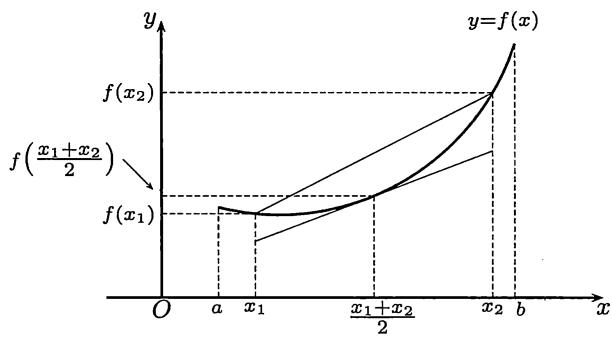
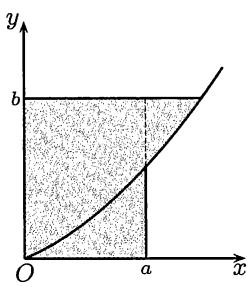
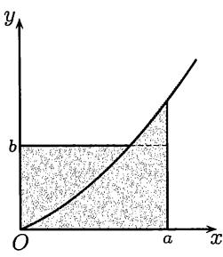
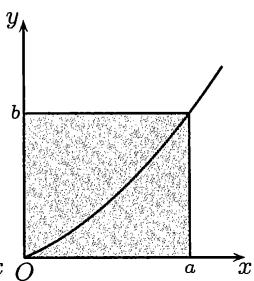

import Guide from '@/components/Guide.astro';
import Knowledge from '@/components/Knowledge.astro';
import Example from '@/components/Example.astro';
import Solution from '@/components/Solution.astro';
import Note from '@/components/Note.astro';
import Block from '@/components/Block.astro';
import Method from '@/components/Method.astro';

在§$1.3$和§$8.5$已经接触到了许多不等式. 现在有了积分学的工具, 可以得到的不等式就更多了. 由于这方面的材料较多, 我们将分成几小节来介绍.

## 11.2.1 凸函数不等式

凸函数的基本定义和主要理论见§$8.4$和第八章的部分参考题. 需要指出, 本书中的下凸函数和上凸函数分别与有的文献中的凸函数和凹函数相对应.

在含有积分的凸函数不等式中, 先介绍 $Hadamard$ 不等式.

<Example title="例11.2.1">

**例11.2.1 ($Hadamard$不等式)** 设 $f$ 是 $(a,b)$ 上的下凸函数, 则对每一对 $x_{1}, x_{2} \in (a,b), x_{1} < x_{2}$ , 有

$$
f \left(\frac {x _ {1} + x _ {2}}{2}\right) \leqslant \frac {1}{x _ {2} - x _ {1}} \int_ {x _ {1}} ^ {x _ {2}} f (t) \mathrm{d} t \leqslant \frac {f (x _ {1}) + f (x _ {2})}{2}.\tag{11.7}
$$

从图$11.4$上可以看出$Hadamard$不等式具有明显的几何意义.由于 $f$ 是 $[a,b]$ 上的下凸函数，曲线段 $y = f(x)$ $(x_{1}\leqslant x\leqslant x_{2})$ 位于曲线过点 $\left(\frac{1}{2} (x_1 + x_2),f\left(\frac{1}{2} (x_1 + x_2)\right)\right)$ 的切线段上方①，并位于连接点 $(x_{1},f(x_{1}))$ 与点 $(x_{2},f(x_{2}))$ 的直线段下方, 因此曲线段 $y = f(x)$ ( $x_1 \leqslant x \leqslant x_2$ ) 与直线 $x = x_1, x = x_2$ 及 $x$ 轴围成的曲边梯形面积应在上述两直线段分别与直线 $x = x_1, x = x_2$ 及 $x$ 轴围成的两个梯形的面积之间.

  
图$11.4$

<Solution title="证明">

从命题$8.4.2$知道 $f$ 连续, 因此可积性没有问题. 注意到点 $\frac{1}{2} (x_1 + x_2)$ 不仅是 $x_{1}$ 和 $x_{2}$ 的中点, 同时也是 $x_{1} + \lambda (x_{2} - x_{1})$ 和 $x_{2} - \lambda (x_{2} - x_{1})$ 的中点, 其中 $\lambda \in [0,1]$ . 利用 $f$ 为下凸函数, 则就有不等式

$$
\frac {1}{2} \left[ f (x _ {1} + \lambda (x _ {2} - x _ {1})) + f (x _ {2} - \lambda (x _ {2} - x _ {1})) \right] \geqslant f \left(\frac {x _ {1} + x _ {2}}{2}\right).\tag{11.8}
$$

将上式两边对 $\lambda$ 从 $0$ 到 $1$ 积分, 经计算后就可以得到

$$
\frac {1}{x _ {2} - x _ {1}} \int_ {x _ {1}} ^ {x _ {2}} f (t) \mathrm{d} t \geqslant f \left(\frac {x _ {1} + x _ {2}}{2}\right).\tag{11.9}
$$

另一方面, 由 $f$ 是下凸函数又可得到

$$
\begin{array}{r l} \frac {1}{x _ {2} - x _ {1}} \int_ {x _ {1}} ^ {x _ {2}} f (t) \mathrm{d} t & = \int_ {0} ^ {1} f (\lambda x _ {2} + (1 - \lambda) x _ {1}) \mathrm{d} \lambda \\ & \leqslant \int_ {0} ^ {1} [ \lambda f (x _ {2}) + (1 - \lambda) f (x _ {1}) ] \mathrm{d} \lambda \\ & = \frac {f (x _ {1}) + f (x _ {2})}{2}. \end{array}
$$

</Solution>

<Note>

$Hadamard$ 不等式 ($11.7$) 含有左边和右边的两个不等式. 可以证明, 其中每一个不等式都是函数下凸的充分必要条件. 还可以证明, 若其中任何一个不等式对所有 $x_{1}, x_{2} \in (a, b)$ 成立等号, 则 $f$ 只能是线性函数 (留作本章第二组参考题 $7$).

</Note>

</Example>

第二个重要的凸函数不等式可以从命题 $8.4.7$ ($Jensen$ 不等式) 取极限得到:

<Knowledge title="命题11.2.1 ($Jensen$不等式)">

**命题11.2.1 ($Jensen$不等式)** 设 $f, p \in R[a, b], m \leqslant f(x) \leqslant M, p(x)$ 非负且 $\int_{a}^{b}p(x) > 0$ ，则当 $\varphi$ 是 $[m,M]$ 上的下凸函数时，成立不等式：

$$
\varphi \left(\frac {\int_ {a} ^ {b} p (x) f (x) \mathrm{d} x}{\int_ {a} ^ {b} p (x) \mathrm{d} x}\right) \leqslant \frac {\int_ {a} ^ {b} p (x) \varphi (f (x)) \mathrm{d} x}{\int_ {a} ^ {b} p (x) \mathrm{d} x}.
$$

若 $\varphi$ 为上凸函数则不等式反向.

$Jensen$ 不等式包含了很多不等式. 取 $p(x) \equiv 1$ , 就得到

$$
\varphi \left(\frac {1}{b - a} \int_ {a} ^ {b} f (t) \mathrm{d} t\right) \leqslant \frac {1}{b - a} \int_ {a} ^ {b} \varphi (f (t)) \mathrm{d} t.
$$

又若 $\int_{a}^{b}p(x)\mathrm{d}x = 1$ ，并利用 $\mathbf{e}^x$ 为下凸函数和 $\ln x$ 为上凸函数就得到

$$
\exp \left(\int_a^b p(x)\ln f(x)\mathrm{d}x\right)\leqslant \int_a^b p(x)f(x)\mathrm{d}x\leqslant \ln \left(\int_a^b p(x)\exp f(x)\mathrm{d}x\right). \tag{11.10}
$$

左边的不等式就是广义的平均值不等式 (命题 $8.5.1$) 的积分形式.

下一个不等式也是 $Jensen$ 不等式的特例. 设 $f \in R[a, b]$ , $f(x) \geqslant m > 0$ , 则成立不等式:

$$
\ln \left(\frac {1}{b - a} \int_ {a} ^ {b} f (x) \mathrm{d} x\right) \geqslant \frac {1}{b - a} \int_ {a} ^ {b} \ln f (x) \mathrm{d} x.
$$

以上的每个不等式又包含了许多具体的不等式. 例如

<Example title="例11.2.2">

**例11.2.2** 若 $f$ 为 $[0,1]$ 上的上凸函数, 则对每个正整数 $n$ 成立不等式:

$$
\int_ {0} ^ {1} f (x ^ {n}) \mathrm{d} x \leqslant f \left(\frac {1}{n + 1}\right).
$$

</Example>

</Knowledge>

## 11.2.2 Schwarz 积分不等式

$Schwarz$ 积分不等式是最基本的积分不等式之一, 应用非常广泛.

<Knowledge title="命题11.2.2 ($Schwarz$积分不等式)">

**命题11.2.2（$Schwarz$积分不等式）** 设 $f,g\in R[a,b]$ ，则

$$
\left(\int_ {a} ^ {b} f (x) g (x) \mathrm{d} x\right) ^ {2} \leqslant \int_ {a} ^ {b} f ^ {2} (x) \mathrm{d} x \int_ {a} ^ {b} g ^ {2} (x) \mathrm{d} x.
$$

<Solution title="证1">

（用证明$Cauchy$不等式(命题$1.3.5$)的同样方法.）如果 $\int_{a}^{b}f^{2}(x)\mathrm{d}x$ 与 $\int_{a}^{b}g^{2}(x)\mathrm{d}x$ 两个积分中至少有一个不等于$0$,我们不妨设 $\int_{a}^{b}f^{2}(x)\mathrm{d}x\neq 0.$ 由于对一切实数 $\lambda ,$ 在 $[a,b]$ 上 $[\lambda f(x) - g(x)]^2\geqslant 0,$ 因此有

$$
\int_ {a} ^ {b} [ \lambda f (x) - g (x) ] ^ {2} \mathrm{d} x \geqslant 0.
$$

将它展开, 得到关于 $\lambda$ 的非负二次三项式

$$
\lambda^ {2} \int_ {a} ^ {b} f (x) ^ {2} \mathrm{d} x - 2 \lambda \int_ {a} ^ {b} f (x) g (x) \mathrm{d} x + \int_ {a} ^ {b} g ^ {2} (x) \mathrm{d} x \geqslant 0,
$$

因此它的判别式 $\Delta \leqslant 0$ ，即

$$
\left(\int_ {a} ^ {b} f (x) g (x) \mathrm{d} x\right) ^ {2} - \int_ {a} ^ {b} f ^ {2} (x) \mathrm{d} x \int_ {a} ^ {b} g ^ {2} (x) \mathrm{d} x \leqslant 0,
$$

移项即得所欲证的不等式.

如果积分 $\int_{a}^{b}f^{2}(x)\mathrm{d}x = \int_{a}^{b}g^{2}(x)\mathrm{d}x = 0,$ 则可以如下证明：

$$
\begin{array}{r l} & {\left| \int_ {a} ^ {b} f (x) g (x) \mathrm{d} x \right| \leqslant \int_ {a} ^ {b} | f (x) g (x) | \mathrm{d} x \leqslant \int_ {a} ^ {b} \frac {f ^ {2} (x) + g ^ {2} (x)}{2} \mathrm{d} x} \\ & {\qquad = \frac {1}{2} \int_ {a} ^ {b} f ^ {2} (x) \mathrm{d} x + \frac {1}{2} \int_ {a} ^ {b} g ^ {2} (x) \mathrm{d} x = 0.} \end{array}
$$

</Solution>

<Note>

注$1$ 以上两个证明表明, 为了得到与离散不等式对应的积分不等式, 经常有两条思路可用: ($1$) 用过去的方法; ($2$) 从对应的离散不等式取极限.

</Note>

<Solution title="证2">

将 $[a, b]$ 作等距分划, 令 $x_{i} = a + \frac{i}{n}(b - a), i = 0, 1, \cdots, n$ , 应用 $Cauchy$ 不等式 (命题 $1.3.5$) 得到

$$
\left(\frac {1}{n} \sum_ {i = 1} ^ {n} f (x _ {i}) g (x _ {i})\right) ^ {2} \leqslant \frac {1}{n} \sum_ {i = 1} ^ {n} f ^ {2} (x _ {i}) \cdot \frac {1}{n} \sum_ {i = 1} ^ {n} g ^ {2} (x _ {i}),
$$

令 $n\to \infty$ ，即得

$$
\left(\int_ {a} ^ {b} f (x) g (x) \mathrm{d} x\right) ^ {2} \leqslant \int_ {a} ^ {b} f ^ {2} (x) \mathrm{d} x \int_ {a} ^ {b} g ^ {2} (x) \mathrm{d} x.
$$

</Solution>

<Note>

注$2$ 从证$1$就可以得到$Schwarz$不等式成立等号的充分必要条件.实际上,从判别式 $\Delta = 0$ 知道存在某个 $\lambda_0$ ,使得 $(\lambda_0f - g)^2$ 在 $[a,b]$ 上的积分等于$0$.利用第十章的$Lebesgue$定理(命题$10.1.6$)和该章的第一组参考题$9$,可见在 $[a,b]$ 上几乎处处成立 $\lambda_0f(x) = g(x)$ . 回顾证$1$, 这是在 $f^2$ 于区间 $[a,b]$ 上的积分大于$0$的前提下得到的. 对于 $g^2$ 的积分不等于$0$的情况有类似的结论.

注$3$ 从上述证明可见 $Schwarz$ 不等式与 $Cauchy$ 不等式本质上是同一不等式, 只是前者用积分形式表示而已. 因此 $Schwarz$ 不等式也称为 $Cauchy$-$Schwarz$ 不等式, 或者 $Cauchy$-$Schwarz$-$Bunyakowskii$ (布尼亚科夫斯基) 不等式.

</Note>

</Knowledge>

$Schwarz$ 积分不等式在本书中有多次应用, 下面先举一个例子.

<Example title="例11.2.3">

**例11.2.3** 设 $f \in C^{1}[a, b]$ , 且 $f(a) = 0$ , 证明:

$$
\int_ {a} ^ {b} f ^ {2} (x) \mathrm{d} x \leqslant \frac {(b - a) ^ {2}}{2} \int_ {a} ^ {b} \left(f ^ {\prime} (x)\right) ^ {2} \mathrm{d} x.
$$

<Solution title="证明">

利用条件 $f(a) = 0$ 可以写出

$$
f (x) = \int_ {a} ^ {x} f ^ {\prime} (t) \mathrm{d} t,
$$

然后用 $Schwarz$ 不等式作如下估计:

$$
f ^ {2} (x) = \left(\int_ {a} ^ {x} f ^ {\prime} (t) \mathrm{d} t\right) ^ {2} \leqslant \left(\int_ {a} ^ {x} \left(f ^ {\prime} (x)\right) ^ {2} \mathrm{d} x\right) (x - a) \leqslant (x - a) \int_ {a} ^ {b} \left(f ^ {\prime} (x)\right) ^ {2} \mathrm{d} x,
$$

再将两边对 $x$ 从 $a$ 到 $b$ 积分就得到所求的结果.

</Solution>

</Example>

## 11.2.3 其他著名积分不等式

除了 $Schwarz$ 不等式, 还有许多其他的著名积分不等式. 下面我们再介绍三个在分析中的基本不等式, 即 $Young$ 不等式, $Hölder$ 积分不等式与 $Minkowski$ 积分不等式.

<Knowledge title="命题11.2.3 ($Young$不等式）">

**命题11.2.3 ($Young$不等式）** 设 $f$ 在 $[0, +\infty)$ 上连续可导且严格单调增加， $f(0) = 0, a, b > 0$ ，则有

$$
a b \leqslant \int_ {0} ^ {a} f (x) \mathrm{d} x + \int_ {0} ^ {b} g (y) \mathrm{d} y.\tag{11.11}
$$

其中 $g(y)$ 是 $f(x)$ 的反函数, 而等号当且仅当 $b = f(a)$ 时成立.

<Solution title="证明">

将 ($11.11$) 右边的两个积分之和记为 $I$ . 利用 $g(f(x)) \equiv x$ , 对其中第二个积分作变量代换 $y = f(x)$ , 即 $x = g(y)$ , 然后分部积分得到:

$$
\begin{array}{l} I = \int_ {0} ^ {a} f (x) \mathrm{d} x + \int_ {0} ^ {b} g (y) \mathrm{d} y = \int_ {0} ^ {a} f (x) \mathrm{d} x + \int_ {0} ^ {g (b)} x \mathrm{d} f (x) \\ = \int_ {0} ^ {a} f (x) \mathrm{d} x + x f (x) \Big | _ {0} ^ {g (b)} - \int_ {0} ^ {g (b)} f (x) \mathrm{d} x \\ = b g (b) - \int_ {a} ^ {g (b)} f (x) \mathrm{d} x, \end{array}\tag{11.12}
$$

其中利用了 $f(g(b)) = b$ . 如果 $a = g(b)$ , 也就是 $b = f(a)$ , 则已经得到 ($11.11$) 中成立等号的情况 (见图 $11.5(c)$).

在 $a < g(b)$ 时, 对于 ($11.12$) 中的积分利用 $f(x)$ 在区间 $[a, g(b)]$ 上严格单调增加, $f(x) \leqslant f(g(b)) = b$ , 就得到 $I > bg(b) - [g(b) - a]b = ab$ . 在 $a > g(b)$ 时, 类似地可得到

$$
I = b g (b) + \int_ {g (b)} ^ {a} f (x) \mathrm{d} x > b g (b) + [ a - g (b) ] b = a b.
$$

</Solution>

<Note>

注 $Young$ 不等式的几何意义十分清楚. 由于定积分在几何上等于曲边梯形的面积, 可能发生的只有图 $11.5$ 所示的 ($a$)、($b$)、($c$) 三种情况. 定积分 $\int_{0}^{a} f(x) \mathrm{d}x$ 和定积分 $\int_{0}^{b} g(y) \mathrm{d}y$ 的值在每一张分图中分别等于带有阴影的两个曲边三角形的面积. 对于前两种情况, 这两个面积之和都严格大于边长为 $a$ 和 $b$ 的矩形面积, 而在第三种情况则相等. 这个矩形在图$11.5(a)$和$11.5(b)$中的边界是由曲边三角形的部分边界和一段虚线构成的.

  
($a$)

  
($b$)  
图$11.5$

  
($c$)

</Note>

<Note>

注 可以发现以上证明的每一步都有明显的几何意义. 此外, $Young$ 不等式中的条件 “ $f \in C^{1}[0, \infty)$ ” 可以降低为 “ $f \in C[0, \infty)$ ”. 但这样改变条件后, 不能再用分部积分法, 而需要从积分定义出发来建立 ($11.12$). 这个证明及 $Young$ 不等式的另一边估计留作为本章的第二组参考题 $6$.

</Note>

</Knowledge>

下面的 $Hölder$ 不等式和 $Minkowski$ 不等式都可以从 §$8.5$ 中对应的离散不等式取极限或者用与那里类似的方法得到, 因此这里不再给出证明.

<Knowledge title="命题11.2.4 ($Hölder$不等式)">

**命题11.2.4（$Hölder$不等式）** 设 $f,g\in R[a,b],p,q$ 为满足 $\frac{1}{p} +\frac{1}{q} = 1$ 的一对正实数(共轭实数)，则成立

$$
\left(\int_ {a} ^ {b} | f (x) g (x) | \mathrm{d} x\right) \leqslant \left(\int_ {a} ^ {b} | f (x) | ^ {p} \mathrm{d} x\right) ^ {\frac {1}{p}} \left(\int_ {a} ^ {b} | g (x) | ^ {q} \mathrm{d} x\right) ^ {\frac {1}{q}}.\tag{11.13}
$$

</Knowledge>

<Knowledge title="命题11.2.5 ($Minkowski$不等式)">

**命题11.2.5（$Minkowski$不等式）** 设 $f,g\in R[a,b],1\leqslant p <   + \infty$ ，则成立

$$
\left(\int_ {a} ^ {b} | f (x) + g (x) | ^ {p} \mathrm{d} x\right) ^ {\frac {1}{p}} \leqslant \left(\int_ {a} ^ {b} | f (x) | ^ {p} \mathrm{d} x\right) ^ {\frac {1}{p}} + \left(\int_ {a} ^ {b} | g (x) | ^ {p} \mathrm{d} x\right) ^ {\frac {1}{p}},\tag{11.14}
$$

当 $0 < p < 1$ 时不等式反向成立.

<Note>

注 $Hölder$ 积分不等式与 $Minkowski$ 积分不等式是“实变函数”与“泛函分析”课程中的两个基本不等式。当然在那里对于函数 $f, g$ 的条件要更为一般。此外，在 $Hölder$ 不等式中成立等号的条件是存在常数 $c$ ，使得 $|f(x)|^p = c|g(x)|^q$ （或者对换 $f$ 和 $g$ 并将 $p$ 换为 $q$ ）；在 $Minkowski$ 不等式中成立等号的条件是存在非负常数 $c$ ，使得 $f(x) = cg(x)$ （或者对换 $f$ 和 $g$ ）。但即使是在 $Riemann$ 可积条件下，这两个条件中的等式都应当理解为几乎处处成立（参见命题 $10.1.6$）。

</Note>

</Knowledge>

## 11.2.4 不等式的其他例题

用积分学方法可以建立过去要用 $Taylor$ 定理才能得到的某些不等式. 下面就是一个例子 (见《美国数学月刊》($1990$) 第 $97$ 卷 $912$–$915$ 页).

<Example title="例11.2.4">

**例11.2.4** 用积分学方法求出 $\sin x$ 和 $\cos x$ 的一些基本不等式.

<Solution title="解">

在 $x > 0$ 时从 $\cos x \leqslant 1$ 出发, 从 $0$ 到 $x$ 积分, 得到不等式 (命题 $1.3.6$)

$$
\sin x <   x.
$$

再对两边从 $0$ 到 $x$ 积分, 得到 $1 - \cos x < \frac{x^{2}}{2}$ . 将它改写为

$$
\cos x > 1 - \frac {x ^ {2}}{2},
$$

然后再做一次积分得到

$$
\sin x > x - \frac {x ^ {3}}{6},
$$

即例题$8.5.3$中的不等式.于是已经有

$$
x - \frac {x ^ {3}}{6} <   \sin x <   x.
$$

再一次积分后可以得到

$$
1 - \frac {x ^ {2}}{2} <   \cos x <   1 - \frac {x ^ {2}}{2} + \frac {x ^ {4}}{2 4}.
$$

归纳地进行下去就可以得到关于正弦和余弦函数的一般性不等式, 其中包括了$8.5.3$小节的练习题$15$中的不等式. 此外, 还可以得到以下两个对所有 $x$ 成立的绝对值不等式

$$
\begin{array}{r l} & {\left| \sin x - \sum_ {k = 0} ^ {n} (- 1) ^ {k} \frac {x ^ {2 k + 1}}{(2 k + 1) !} \right| \leqslant \frac {| x | ^ {2 n + 3}}{(2 n + 3) !},} \\ & {\quad \left| \cos x - \sum_ {k = 0} ^ {n} (- 1) ^ {k} \frac {x ^ {2 k}}{(2 k) !} \right| \leqslant \frac {| x | ^ {2 n + 2}}{(2 n + 2) !}.} \end{array}
$$

此外, 对于每个固定的 $x$ , 令 $n \to \infty$ , 就可得到正弦和余弦函数的 $Taylor$ 级数展开式 (参见下册 §$14.4$ 关于 $Taylor$ 级数的一般性讨论).

</Solution>

</Example>

<Example title="例11.2.5">

**例11.2.5** 设函数 $f \in C[a, b]$ 且单调增加, 证明:

$$
\int_ {a} ^ {b} x f (x) \mathrm{d} x \geqslant \frac {a + b}{2} \int_ {a} ^ {b} f (x) \mathrm{d} x.
$$

<Note>

注 当 $f$ 非负时, 本题有明显的物理意义: 如果曲线 $y = f(x)$ 单调增加, 则密度均匀的曲边梯形 $\{(x, y) \mid a \leqslant x \leqslant b, 0 \leqslant y \leqslant f (x)\}$ 的质心不可能落在直线 $x = \frac{a + b}{2}$ 的左边(参见($11.3$)中关于 $x_{c}$ 的公式).

</Note>

分析 本题的解法很多 (参见 [$13, 30$]), 下面举出其中的两个证明. 关键是要利用 $f$ 的单调性和 $x - \frac{a + b}{2}$ 关于积分区间的中点为奇函数的性质.

<Solution title="证1">

因为 $f$ 单调增加, 所以成立

$$
\left(x - \frac {a + b}{2}\right) \left[ f (x) - f \left(\frac {a + b}{2}\right) \right] \geqslant 0.\tag{11.15}
$$

将上式对 $x$ 从 $a$ 到 $b$ 积分, 又利用

$$
\int_ {a} ^ {b} \left(x - \frac {a + b}{2}\right) \mathrm{d} x = 0,
$$

就可以得到所要的不等式.

</Solution>

<Solution title="证2">

将 $[a, b]$ 分为两个区间, 分别用第一中值定理, 就得到

$$
\begin{array}{l} \int_ {a} ^ {b} \left(x - \frac {a + b}{2}\right) f (x) \mathrm{d} x \\ = \int_ {a} ^ {\frac {a + b}{2}} \left(x - \frac {a + b}{2}\right) f (x) \mathrm{d} x + \int_ {\frac {a + b}{2}} ^ {b} \left(x - \frac {a + b}{2}\right) f (x) \mathrm{d} x \\ = f (\xi_ {1}) \int_ {a} ^ {\frac {a + b}{2}} \left(x - \frac {a + b}{2}\right) \mathrm{d} x + f (\xi_ {2}) \int_ {\frac {a + b}{2}} ^ {b} \left(x - \frac {a + b}{2}\right) \mathrm{d} x \\ = [ f (\xi_ {2}) - f (\xi_ {1}) ] \cdot \frac {(b - a) ^ {2}}{2} \geqslant 0, \end{array}
$$

因为其中 $a < \xi_1 < \frac{1}{2} (a + b) < \xi_2 < b,$ 而 $f$ 单调增加.

</Solution>

</Example>

下面是对于广义算术平均值－几何平均值不等式 (例题 $8.5.1$) 的一个新的积分学证明, 见《美国数学月刊》(1996) 第 $103$ 卷 $585$ 页.

<Example title="例11.2.6">

**例11.2.6** 设有 $n$ 个非负数 $x_{1}, \cdots, x_{n}$ 和 $n$ 个正数 $\lambda_{1}, \cdots, \lambda_{n}$ ，且 $\lambda_{1} + \cdots + \lambda_{n} = 1$ ，则成立不等式

$$
G _ {n} \equiv \prod_ {i = 1} ^ {n} x _ {i} ^ {\lambda_ {i}} \leqslant \sum_ {i = 1} ^ {n} \lambda_ {i} x _ {i} \equiv A _ {n},\tag{11.16}
$$

其中当且仅当 $x_{1}=x_{2}=\cdots=x_{n}$ 时成立等号.

<Solution title="证明">

只需对 $n$ 个正数 $x_{1}, \cdots, x_{n}$ 证明即可. 不妨设已有 $x_{1} \leqslant \cdots \leqslant x_{n}$ ，则存在 $k \in \{1, \cdots, n-1\}$ ，使得 $x_{k} \leqslant G_{n} \leqslant x_{k+1}$ . 这时用拟合法得到

$$
\begin{array}{c} \frac {A _ {n}}{G _ {n}} - 1 = \sum_ {i = 1} ^ {n} \lambda_ {i} \left(\frac {x _ {i} - G _ {n}}{G _ {n}}\right) = \sum_ {i = 1} ^ {n} \lambda_ {i} \int_ {G _ {n}} ^ {x _ {i}} \frac {\mathrm{d} t}{G _ {n}} \\ = - \sum_ {i = 1} ^ {k} \lambda_ {i} \int_ {x _ {i}} ^ {G _ {n}} \frac {\mathrm{d} t}{G _ {n}} + \sum_ {i = k + 1} ^ {n} \lambda_ {i} \int_ {G _ {n}} ^ {x _ {i}} \frac {\mathrm{d} t}{G _ {n}}. \end{array}
$$

又用拟合法（“无中生有”）写出

$$
\begin{array}{l} 0 = \ln G _ {n} - \sum_ {i = 1} ^ {n} \lambda_ {i} \ln x _ {i} = \sum_ {i = 1} ^ {n} \lambda_ {i} (\ln G _ {n} - \ln x _ {i}) = \sum_ {i = 1} ^ {n} \lambda_ {i} \int_ {x _ {i}} ^ {G _ {n}} \frac {\mathrm{d} t}{t} \\ = \sum_ {i = 1} ^ {k} \lambda_ {i} \int_ {x _ {i}} ^ {G _ {n}} \frac {\mathrm{d} t}{t} - \sum_ {i = k + 1} ^ {n} \lambda_ {i} \int_ {G _ {n}} ^ {x _ {i}} \frac {\mathrm{d} t}{t}. \end{array}
$$

将两式相加得到

$$
\frac {A _ {n}}{G _ {n}} - 1 = \sum_ {i = 1} ^ {k} \lambda_ {i} \int_ {x _ {i}} ^ {G _ {n}} \left(\frac {1}{t} - \frac {1}{G _ {n}}\right) \mathrm{d} t + \sum_ {i = k + 1} ^ {n} \lambda_ {i} \int_ {G _ {n}} ^ {x _ {i}} \left(\frac {1}{G _ {n}} - \frac {1}{t}\right) \mathrm{d} t,
$$

由于右边的每一项都非负, 因此就得到 $A_{n} \geqslant G_{n}$ , 而且可直接看出等号成立的充分必要条件是 $x_{i} = G_{n}, i = 1, \cdots, n$ , 也就是 $x_{1} = \cdots = x_{n}$ . ☐

</Solution>

<Note>

注 这个证明确有新意, 但关键并不在于用积分工具. 如果对于中间一步的 $\ln G_{n} - \ln x_{i}, i = 1,2,\dots ,n,$ 用$Lagrange$中值定理(命题$7.1.4$)也可以进行到底.

</Note>

</Example>

## 11.2.5 练习题

1. 设 $f$ 在 $[a, b]$ 上单调增加, 证明: 对每个 $c \in (a, b)$ , 函数 $F(x) = \int_{c}^{x} f(t) \, \mathrm{d}t$ 为 $[a, b]$ 上的下凸函数.

2. 设 $f$ 在 $[0, +\infty)$ 上是下凸函数, 证明: 函数 $F(x) = \frac{1}{x} \int_{0}^{x} f(t) \, \mathrm{d}t$ 是 $(0, +\infty)$ 上的下凸函数.

3. 设 $f$ 于 $[0,1]$ 上为非负的上凸函数, 证明: $\int_0^1 2f(x)\mathrm{d}x\geqslant \max_{x\in [0,1]}\{f(x)\}$ .

4. 设 $f$ 在 $[a, b]$ 上为上凸可微函数, $f(a) = f(b) = 0$ , $f'(a) = \alpha > 0$ , $f'(b) = \beta < 0$ , 证明:

$$
0 \leqslant \int_ {a} ^ {b} f (x) \mathrm{d} x \leqslant \frac {1}{2} \alpha \beta \cdot \frac {(b - a) ^ {2}}{\beta - \alpha}.
$$

5. 设 $f \in C^1[0,2]$ , $f(0) = f(2) = 1$ , $|f'(x)| \leqslant 1$ , 证明: $\left|\int_0^2 f(x) \, \mathrm{d}x\right| \geqslant 1$ .

6. 已知函数 $f \in C[a, b]$ ，且 $f(x)$ 处处大于 $0$，证明：

$$
\int_ {a} ^ {b} f (x) \mathrm{d} x \int_ {a} ^ {b} \frac {1}{f (x)} \mathrm{d} x \geqslant (b - a) ^ {2}.
$$

7. 已知非负函数 $f \in R[a, b]$ , $\int_{a}^{b} f(x) \, \mathrm{d}x = 1$ , $k$ 为实数, 证明:

$$
\left(\int_ {a} ^ {b} f (x) \cos k x \mathrm{d} x\right) ^ {2} + \left(\int_ {a} ^ {b} f (x) \sin k x \mathrm{d} x\right) ^ {2} \leqslant 1.
$$

8. 设 $f \in C^1[a, b]$ 且 $f(a) = 0$ , 证明比例题 $11.2.3$ 更强的不等式:

$$
\int_ {a} ^ {b} f ^ {2} (x) \mathrm{d} x \leqslant \frac {(b - a) ^ {2}}{2} \int_ {a} ^ {b} \left(f ^ {\prime} (x)\right) ^ {2} \mathrm{d} x - \frac {1}{2} \int_ {a} ^ {b} \left(f ^ {\prime} (x)\right) ^ {2} (x - a) ^ {2} \mathrm{d} x.
$$

9. 设 $f$ 在 $[0,1]$ 上可微且当 $x \in (0,1)$ 时, $0 \leqslant f'(x) \leqslant 1$ , $f(0) = 0$ . 证明:

$$
\left(\int_ {0} ^ {1} f (x) \mathrm{d} x\right) ^ {2} \geqslant \int_ {0} ^ {1} f ^ {3} (x) \mathrm{d} x,
$$

且仅当 $f(x) \equiv 0$ 或 $f(x) = x$ 时成立等号.

10. ($1$) 试用 $Young$ 不等式证明: 当 $a, b \geqslant 1$ 时成立 $ab \leqslant \mathrm{e}^{a - 1} + b \ln b$ ;

($2$) 设函数 $f \in R[a, b]$ , 试用 $Minkowski$ 不等式证明下面两个不等式不能同时成立:

$$
\int_ {0} ^ {\pi} | f (x) - \sin x | ^ {2} \mathrm{d} x \leqslant {\frac {3}{4}} \quad {\text {和}} \quad \int_ {0} ^ {\pi} | f (x) - \cos x | ^ {2} \mathrm{d} x \leqslant {\frac {3}{4}}.
$$
