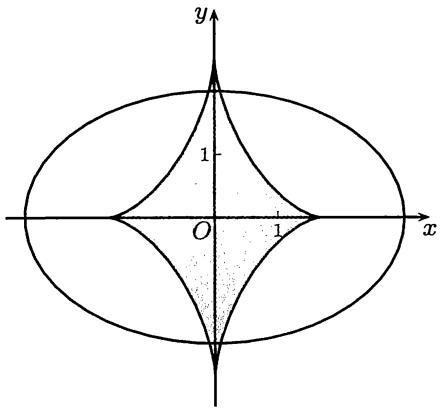
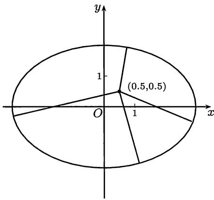

import Guide from '@/components/Guide.astro';
import Knowledge from '@/components/Knowledge.astro';
import Example from '@/components/Example.astro';
import Solution from '@/components/Solution.astro';
import Note from '@/components/Note.astro';
import Block from '@/components/Block.astro';
import Method from '@/components/Method.astro';

## $12.5.1$ 学习要点

$1$. 在很多教科书中, 无穷限积分与无界积分的定义、性质、敛散性判别和计算等都是分成两部分来讲授的. 这样做必然会使得可以统一的许多结果必须分成两次重复叙述了. 我们倾向于将它们放在一起叙述, 而在需要分开的地方再分开叙述, 这样不但可以精简文字, 而且可以突出两类广义积分的异同之处.

$2$. 广义积分的许多敛散性判别法与数项级数的敛散性判别法是平行的，例如比较判别法、$Cauchy$ 收敛准则、$Abel$ 判别法与 $Dirichlet$ 判别法等。这在学了级数之后就非常清楚。如果所用教材中数项级数的讲授安排在广义积分之前，则应当加入这方面的例题和练习题。

$3$. 对习题课的建议 广义积分内容在各种数学分析教科书中所占篇幅一般不多, 因此主要的训练内容集中在敛散性判别法上, 而关于计算和估计就比较少. 但是从目前考研的情况来看, 在常义积分方面的每种题型都可能在广义积分中出现. 因此我们在参考题中较多地收入了这方面的题, 希望引起注意. 在这方面较有特色的不仅有传统题, 也有过去注意不多的题. 前者如用代换 $x = t - 1 / t$ 解决积分

$$
\int_ {0} ^ {+ \infty} {\frac {1}{1 + x ^ {4}}} \mathrm{d} x = \int_ {0} ^ {+ \infty} {\frac {x ^ {2}}{1 + x ^ {4}}} \mathrm{d} x = {\frac {1}{2}} \int_ {0} ^ {+ \infty} {\frac {1 + x ^ {2}}{1 + x ^ {4}}} \mathrm{d} x
$$

的计算, 后者如第一组参考题 $1$, $2$, 第二组参考题 $7$, $8$.

## $12.5.2$ 参考题

## 第一组参考题

$1$. 证明：对于任何实数 $\alpha$ ，成立恒等式

$$
\int_ {0} ^ {+ \infty} \frac {\mathrm{d} x}{(1 + x ^ {2}) (1 + x ^ {\alpha})} = \int_ {1} ^ {+ \infty} \frac {\mathrm{d} x}{1 + x ^ {2}} = \frac {\pi}{4},
$$

并计算以下积分:

(1) $\int_0^{+\infty}\frac{\mathrm{d}x}{(1 + x^2)(1 + x^6)};$

(2) $\int_0^{\pi /2}\frac{\mathrm{d}x}{1 + \tan^{100}x}.$

$2$. 证明 (或改进) 对以下广义积分的估计:

(1) $\frac{1}{29} < \int_{1}^{+\infty} \frac{x^{30} + 1}{x^{60} + 1} \, \mathrm{d}x < \frac{1}{29} + \frac{1}{59}$ ;

(2) $\frac{\pi}{10} < \int_{0}^{2} \frac{\mathrm{d}x}{(4 + \sqrt{\sin x})\sqrt{4 - x^2}} < \frac{\pi}{8}$ ;

(3) $\frac{1}{30} < \int_{2}^{+\infty} \frac{\sqrt{x^3 - x^2 + 3}}{x^5 + x^2 + 1} \, \mathrm{d}x < \frac{\sqrt{2}}{20}$ ;

(4) $0.0099 < \int_{0}^{+\infty}\frac{\mathrm{e}^{-x}}{x + 100}\mathrm{d}x < 0.01.$

$3$. 设 $f$ 在 $(- \infty, + \infty)$ 上内闭可积, $p \geqslant 1$ , 且 $|f|^p$ 在 $(- \infty, + \infty)$ 上可积, 证明:

$$
\lim _ {h \rightarrow 0} \int_ {- \infty} ^ {+ \infty} | f (x + h) - f (x) | ^ {p} \mathrm{d} x = 0.
$$

$4$. 设 $f, g$ 在 $(- \infty, +\infty)$ 上内闭可积, $p > 1$ , 且 $|f|^p$ , $|g|^{p/(p-1)}$ 在 $(- \infty, +\infty)$ 上可积, 证明: 函数

$$
I (t) = \int_ {- \infty} ^ {+ \infty} f (x + t) g (x) \mathrm{d} x
$$

在 $(-∞,+∞)$ 上连续.

$5$. 设 $f \in C^{1}[a, +\infty)$ , 单调减少, 且 $f(+\infty) = 0$ , 证明: 广义积分 $\int_{a}^{+\infty} f(x) \, \mathrm{d}x$ 收敛的充分必要条件是 $\int_{a}^{+\infty} x f'(x) \, \mathrm{d}x$ 收敛.

$6$. 设 $f$ 在 $[a, +\infty)$ 上为内闭可积的正函数, 且有 $\lim_{x \to +\infty} \frac{\ln f(x)}{\ln x} = p$ , 则当 $-\infty \leqslant p < -1$ 时, 积分 $\int_{a}^{+\infty} f(x) \mathrm{d}x$ 收敛, 而当 $-1 < p \leqslant +\infty$ 时, 积分 $\int_{a}^{+\infty} f(x) \mathrm{d}x$ 发散.

$7$. 证明: $\int_{1}^{+\infty}\left(\frac{1}{[x]} - \frac{1}{x}\right) \mathrm{d}x = \gamma$ , 其中 $\gamma$ 是 $Euler$ 常数 (见 $2.5.3$ 小节).

$8$. 判别广义积分 $\int_0^{+\infty}\left[\left(1 - \frac{\sin x}{x}\right)^{-\frac{1}{3}} - 1\right]\mathrm{d}x$ 的收敛性与绝对收敛性.

$9$. 讨论以下带有参数的广义积分的敛散性, 确定使得积分绝对收敛、条件收敛和发散的参数范围:

(1) $\int_{0}^{+\infty}\frac{x^{p}}{1+x^{q}|\sin x|^{r}}\mathrm{d}x\quad(p,q,r>0);$ (2) $\int_{1}^{+\infty}\frac{\sin x\cos\frac{1}{x}}{x^{p}}\mathrm{d}x.$

$10$. 设 $f$ 在 $[a, +\infty)$ 上单调有界, 广义积分 $\int_{a}^{+\infty} f(x) \sin px \, \mathrm{d}x$ 在 $p > 0$ 时收敛, 证明: $\lim_{p \to +\infty} \int_{a}^{+\infty} f(x) \sin px \, \mathrm{d}x = 0.$

$11$. 设 $f \in C[0, +\infty)$ , 广义积分 $\int_{0}^{+\infty} \varphi(x) \mathrm{d}x$ 绝对收敛, 证明: $\lim_{n \to \infty} \int_{0}^{\sqrt{n}} f\left(\frac{x}{n}\right) \varphi(x) \mathrm{d}x = f(0) \int_{0}^{+\infty} \varphi(x) \mathrm{d}x.$

$12$. 设 $f$ 在 $(- \infty, + \infty)$ 上绝对可积, 证明:
(1) $\lim_{n\to \infty}\int_{-\infty}^{+\infty}f(x)\sin nx\mathrm{d}x = 0;$ (2) $\lim_{n\to \infty}\int_{-\infty}^{+\infty}f(x)|\sin nx|\mathrm{d}x = \frac{2}{\pi}\int_{-\infty}^{+\infty}f(x)\mathrm{d}x.$

$13$. 在常义积分的积分第二中值定理的基础上, 证明广义积分第二中值定理: 设广义积分 $\int_{a}^{b} g(x) \mathrm{d}x$ 收敛 (奇点为 $a$ 或 $b$ , 或者 $a$ 和 $b$ 都是奇点), 如果 $f$ 在 $(a, b)$ 上单调有界, 则存在 $\xi \in [a, b]$ , 使 $\int_{a}^{b} f(x) g(x) \mathrm{d}x = f(a^{+}) \int_{a}^{\xi} g(x) \mathrm{d}x + f(b^{-}) \int_{\xi}^{b} g(x) \mathrm{d}x.$

$14$. 设广义积分 $\int_{1}^{+\infty} f(x) \, \mathrm{d}x$ 收敛. 证明: 存在 $\xi \in (1, +\infty)$ , 使得 $\int_{1}^{+\infty} x^{-1} f(x) \, \mathrm{d}x = \int_{1}^{\xi} f(x) \, \mathrm{d}x$ .

$15$. 设 $a > 0$ , $f$ 在 $[a, +\infty)$ 上平方可积, 证明: 积分 $\int_{a}^{+\infty} \frac{f(x)}{x} \mathrm{d}x$ 收敛.

$16$. 在 $x > 0$ 时定义特殊函数 $\Gamma(x) = \int_{0}^{+\infty} t^{x-1} \mathrm{e}^{-t} \, \mathrm{d}t$ , 证明:

(1) $\Gamma(x) < +\infty, \forall x > 0$ ;

$$
\Gamma (x + 1) = x \Gamma (x)
$$

(3) $\Gamma(1) = 1$ , $\Gamma(n + 1) = n!, \forall n \in \mathbf{N}_{+}$ ; (4) $\Gamma\left(\frac{1}{2}\right) = \sqrt{\pi}$ .

(从 (3) 可见 $\Gamma(x)$ 是阶乘 $n!$ 的连续化. 这在一定条件下是唯一的, 见下册 §$23.3$ 对 $\Gamma(x)$ 的介绍和命题 $23.3.1$, 或参见 [$14$, $55$].)

## 第二组参考题

$1$. 先证明不等式 ($12.8$), 然后由

$$
\int_ {0} ^ {1} (1 - x ^ {2}) ^ {n} \mathrm{d} x \leqslant \int_ {0} ^ {+ \infty} \mathrm{e} ^ {- n x ^ {2}} \mathrm{d} x \leqslant \int_ {0} ^ {+ \infty} \frac {\mathrm{d} x}{(1 + x ^ {2}) ^ {n}}
$$

出发, 用夹逼方法计算概率积分.

$2$. ($Gordon$ 不等式) 证明: 函数 $f(x) = \mathrm{e}^{\frac{x^2}{2}} \int_x^{+\infty} \mathrm{e}^{-\frac{t^2}{2}} \, \mathrm{d}t$ 在 $x > 0$ 时严格单调减少, 且成立

$$
\frac {x}{x ^ {2} + 1} <   f (x) <   \frac {1}{x}.
$$

$3$. 设 $f \in C[0, +\infty)$ 且平方可积, 令 $g(x) = \int_{0}^{x} f(t) \, \mathrm{d}t$ , 证明: $\frac{g(x)}{x}$ 在 $[0, +\infty)$ 上平方可积, 且成立

$$
\int_ {0} ^ {+ \infty} \frac {g ^ {2} (x)}{x ^ {2}} \mathrm{d} x \leqslant 4 \int_ {0} ^ {+ \infty} f ^ {2} (x) \mathrm{d} x.
$$

$4$. 设 $f$ 在 $[0, +\infty)$ 上二阶可微, $f$ 和 $f''$ 在这个区间上均平方可积, 证明: $f'$ 在这个区间上也平方可积.

$5$. 设 $f \in C^{1}[0, +\infty)$ , 且 $xf(x)$ 和 $f'(x)$ 在这个区间上均平方可积, 证明:

(1) $f$ 也在这个区间上平方可积;

(2) 成立不等式

$$
\int_ {0} ^ {+ \infty} f ^ {2} (x) \mathrm{d} x \leqslant 2 \left(\int_ {0} ^ {+ \infty} x ^ {2} f ^ {2} (x) \mathrm{d} x \int_ {0} ^ {+ \infty} (f ^ {\prime} (x)) ^ {2} \mathrm{d} x\right) ^ {\frac {1}{2}};
$$

(3) 在上述不等式中成立等号的充分必要条件是 $f(x) = a\mathrm{e}^{-bx^2}$ ，其中 $b > 0$ .

$6$. 问 $a, b$ 是怎样的正实数时, 广义积分

$$
\int_ {0} ^ {+ \infty} \left(\sqrt {\sqrt {x + a} - \sqrt {x}} - \sqrt {\sqrt {x} - \sqrt {x - b}}\right) \mathrm{d} x
$$

是收敛的？

$7$. 设有理函数 $f(x) = P(x) / Q(x)$ 在 $(- \infty, + \infty)$ 上可积, 证明:

$$
\int_ {- \infty} ^ {+ \infty} \frac {P (x)}{Q (x)} \mathrm{d} x = 2 \pi \mathrm{i} \sum_ {k} A _ {k},
$$

其中 $A_{k}$ 是有理函数 $f$ 的部分分式分解中 $1 / x_{k}$ 项的系数, $x_{k}$ 是分母 $Q(x)$ 的零点, 和式只对虚部大于$0$的 $x_{k}$ 求和. 当 $x_{k}$ 为单根时, 有简单公式 $A_{k} = P(x_{k}) / Q'(x_{k})$ .

$8$. 应用上题的结果于下列各小题:

(1) 证明: 对 $n \in \mathbf{N}_{+}$ 成立 $\int_{-\infty}^{+\infty} \frac{1}{1 + x^{2n}} \, \mathrm{d}x = \frac{\pi}{n} \csc \frac{\pi}{2n}$ ;

(2) 证明: 若 $n, m \in \mathbf{N}_{+}$ 满足条件 $2m + 1 < 2n$ , 则成立

$$
\int_ {- \infty} ^ {+ \infty} \frac {x ^ {2 m}}{1 + x ^ {2 n}} \mathrm{d} x = \frac {\pi}{n} \csc \frac {(2 m + 1) \pi}{2 n};
$$

(3) 计算积分: (a) $\int_{0}^{+\infty} \frac{x^{50}}{x^{100} + 1} \mathrm{d}x$ , (b) $\int_{0}^{+\infty} \frac{x^{30} + 1}{x^{60} + 1} \mathrm{d}x$ .

$9$. 设 $f$ 是 $(- \infty, + \infty)$ 上的非负函数, 且满足以下条件:

$$
\int_ {- \infty} ^ {+ \infty} f (x) \mathrm{d} x = 1, \int_ {- \infty} ^ {+ \infty} x f (x) \mathrm{d} x = 0, \int_ {- \infty} ^ {+ \infty} x ^ {2} f (x) \mathrm{d} x = 1,
$$

证明：

(1) 在 $x > 0$ 时, 成立 $\int_{-\infty}^{x} f(t) \, \mathrm{d}t \geqslant \frac{x^2}{1 + x^2}$ ;

(2) 在 $x < 0$ 时, 成立 $\int_{-\infty}^{x} f(t) \mathrm{d}t \leqslant \frac{1}{1 + x^2}$ .

(本题是概率论中的基本不等式, 且不能再改进 (见 [$30$]). 它表明期望与方差有限的连续随机变量的分布函数 (在标准化之后) 所必须满足的限制.)

$10$. 设 $p > 0$ , 定义

$$
g (x) = \left\{ \begin{array}{l l} p \left[ \frac {x}{p} \right] + \frac {p}{2}, & x \geqslant 0, \\ - g (- x), & x <   0. \end{array} \right.
$$

证明：对所有 $x$ ，成立

$$
\frac {p}{2 \pi} \int_ {- \infty} ^ {+ \infty} \sum_ {n = - [ x / p ]} ^ {[ x / p ]} \frac {\sin \left(n + \frac {1}{2}\right) p t}{\sin \frac {1}{2} p t} \cdot \frac {\sin x t}{t} d t = \frac {1}{2} [ g (x ^ {+}) + g (x ^ {-}) ].
$$

## 参考题提示

## 第二章 数列极限

## 第一组参考题 ($55$ 页)

$1$. 设前两个子列收敛于 $\alpha$ 和 $\beta$ , 利用第三个条件取适当的子列证明 $\alpha = \beta$ .

$2$. 利用单调有界数列收敛定理和上一题的结论.

$3$. 用极限的和差运算法则即可.

$4$. 试用反证法.

$5$. 试用夹逼定理.

$6$. 将 $n$ 写成素数因子的乘积, 由此对 $p(n)$ 作出估计.

$7$. 用拟合法 (参考例题 $2.4.3$ 及其注 $1$). 答案为 $0$.

$8$. 利用 $0 < k < 1$ 和 $x > 0$ 时成立的不等式 $(1 + x)^{k} < 1 + x$ .

$9$. (1) 答案是不一定收敛, 甚至可以是无穷大量; (2) 用反证法, 并利用例题 $2.2.6$.

$10$. (1) 用反证法, 注意至少从某项开始, $\{a_{n}\}$ 是递增的; (2) 用反证法, 对 $a_{n}$ 作出估计.

$11$. 可用数学归纳法.

$12$. 可用数学归纳法.

$13$. (1) 可用数学归纳法; 由 (1) 即可得 (2); 对于 (3), 可模仿命题 $2.5.4$ 对误差作出估计.

$14$. 证明数列递减且有下界. 此题今后还可用积分法做 (见第十一章第一组参考题 $10$).

$15$. 将 $\frac{a_{n}}{n}$ 用算术平均值表示出来.

$16$. 可用夹逼定理, 也可取对数后用 $Stolz$ 定理. (此题还可以推广: 设 $a_{n} > 0$ , $a_{n+1}/a_{n} \to a$ , 则有 $(a_{1}a_{2}\cdots a_{n})^{1/n^{2}} \to \sqrt{a}$ . 用两次 $Stolz$ 定理即可.)

$17$. 注意 $\{x_{n}\}$ 至少从第二项起大于$0$. 证明 $\{x_{n}\}$ 单调增加有上界. 极限为 $1 / 2$ .

$18$. 此题解法非常多. 一种方法是归纳地证明 $a_{2k} \searrow, a_{2k-1} \nearrow$ , 且有相同极限. 答案为 $(b + 2c)/3$ .

$19$. 注意对每个 $n$ 成立 $a_{n} + b_{n} + c_{n} = a + b + c = A$ . 答案为 $A / 3$ .

$20$. (1) 证明 $b_{n} \nearrow, a_{n} \searrow$ , 且有相同极限; (2) 在题中已有提示. 极限 $\lim_{n \to \infty} n \sin \frac{\pi}{n} = \pi$ 可从命题 $1.3.6$ 的不等式得到.

## 第二组参考题 ($57$ 页)

$1$. 有很多方法可以证明 $\{a_{n}\}$ 有界, 其中较有推广价值的一种方法是先利用

$$
\sqrt {n - 1 + \sqrt {n}} \leqslant \sqrt {n - 1 + 2 \sqrt {n - 1} + 1} = \sqrt {n - 1} + 1,
$$

然后用 $\sqrt{n - 1} < 2\sqrt{n - 2} (n \geqslant 3)$ 从里向外将根号逐个脱去.

$2$. 将左边展开, 并利用一个辅助不等式 (见 $1.3.2$ 小节的练习题 $1(3)$):

$$
\left(1 - \frac {1}{2}\right) \left(1 - \frac {1}{3}\right) \dots \left(1 - \frac {1}{k}\right) \geqslant 1 - \frac {1}{2} - \frac {1}{3} - \dots - \frac {1}{k}.
$$

$3$. 利用命题 $2.5.4$ 和夹逼定理. 答案为 $2\pi$ .

$4$. 利用命题 $2.5.6$. 答案为 $\mathrm{e}$.

$5$. 用两次 $Stolz$ 定理. 答案为 $1/2$.

$6$. (1) 用二项式定理; (2) 取对数后用两次 $Stolz$ 定理.

$7$. 作 $Abel$ 变换 (见下册 ($13.21$)): 用 $a_1 = A_1, a_k = A_k - A_{k-1}, k = 2, \cdots, n$ 整理得到

$$
\frac {p _ {1} a _ {1} + p _ {2} a _ {2} + \cdots + p _ {n} a _ {n}}{p _ {n}} = \frac {(p _ {1} - p _ {2}) A _ {1} + \cdots + (p _ {n - 1} - p _ {n}) A _ {n - 1}}{p _ {n}} + A _ {n}.
$$

若 $\{p_n\}$ 严格单调增加, 对右边第一项用 $Stolz$ 定理即可; 否则用 $Cauchy$ 命题的证明方法, 或用下面题 $10$ 提供的 $Toeplitz$ 定理.

$8$. 先证明 $\lim_{n\to \infty}\sum_{i = 1}^{n}a_i^2 = +\infty$ ，然后再用 $Stolz$ 定理计算 $\lim_{n\to \infty}na_n^3.$

$9$. 先找出 $u_{n}$ 与 $u_{n + 1}$ 的关系. 由此可知, 若 $u_{0} > 0$ , 则每个 $u_{n} > 0$ , 数列 $\{u_{n}\}$ 严格单调减少趋于 $0$. 用 $Stolz$ 定理证明 $u_{n} \sim \frac{1}{n}$ , 引出矛盾.

$10$. 用 $Cauchy$ 命题的证明方法即可.

$11$. 将 $\frac{a_{n}}{b_{n}}$ 用 $\frac{a_{i}-a_{i-1}}{b_{i}-b_{i-1}}\left(i=2,\cdots,n\right)$ 的线性组合表示出来.

$12$. 试用拟合法 (参考例题 $2.4.3$).

$13$. 先推出 $\lim_{n\to \infty}y_n = 0$ (参见例题 $2.2.9$), 然后用 $Cauchy$ 命题的证明方法．反例可考虑 $x_{n} = y_{n} = 1 / \sqrt{n}, n\in \mathbf{N}_{+}$

$14$. 可以直接写出 $\{x_{n}\}$ 的表达式, 然后用上一题的结论. 本题的其他解法见例题 $3.6.3$.

$15$. 可求出通项 $a_{n}$ 的表达式. 答案是 $a_0 = 1 / 5$ .

$16$. 分别考虑奇数项子列和偶数项子列, 证明它们均收敛于 $2$.

$17$. 试作变量代换 $y_0 = x + x^{-1}$ ，然后用 $x$ 将 $y_n$ 和 $S_n$ 表示出来.

$18$. 用迭代生成数列一节的结论即可。(关于函数性质的讨论可以在学了微分学后再做.)

$19$. 注意 $b = 1 + \sqrt{5}$ 时 $\{x_{n}\}$ 本身恰为一个周期$2$轨.

$20$. 本题有多种证法, 这里提示两种.

(1) 记 $n$ 维空间 $\mathbf{R}^n$ 中的点 $\pmb{x} = (x_1, \dots, x_n)$ , 证明对点 $\pmb{x}$ 反复作题示的线性变换的极限是每个分量等于 $x_1, \dots, x_n$ 的平均值 $\overline{\pmb{x}}$ 的点. 写出线性变换的矩阵 $\mathbf{A}$ , 计算出其特征方程, 即可发现所有特征值均匀分布在复平面上以点 $(1/2, 0)$ 为圆心, 半径为 $1/2$ 的圆周上, 其中有一个单重特征值 $1$ , 其余特征值的模均小于 $1$ , 由此可以计算得到 $\lim_{k \to \infty} \mathbf{A}^k \pmb{x} = \overline{\pmb{x}} \pmb{e}$ , 其中 $\pmb{e} = (1, \dots, 1)$ .

(2) 令 $f(\varepsilon) = x_1 + x_2\varepsilon + \cdots + x_n\varepsilon^{n-1}$ , $f^{(k)}(\varepsilon) = x_1^{(k)} + x_2^{(k)}\varepsilon + \cdots + x_n^{(k)}\varepsilon^{n-1}$ , $k \in \mathbf{N}_+$ , 其中 $\varepsilon$ 是 $1$ 的 $n$ 次原根 (即 $\varepsilon^i, i = 0, 1, \cdots, n-1$ , 给出了方程 $x^n = 1$ 的所有 $n$ 个根). 这样就可以得到 $f^{(k)}(\varepsilon) = f(\varepsilon)(1 + \varepsilon)^k / 2^k$ . 由此将 $x_i^{(k)} (i = 1, \cdots, n)$ 写为 $x_1, \cdots, x_n$ 的线性组合, 可以发现问题归结为证明在二项式系数 $1, C_k^1, \cdots, C_k^k$ 中将相隔 $n$ 项的各项取和后除以 $2^k$ , 当 $k \to \infty$ 时极限均为 $\frac{1}{n}$ . (参见 [$19$] 之题 $77$.)

## 第三章 实数系的基本定理

## 第一组参考题 ($95$ 页)

$1$. 用凝聚定理等工具即可.

$2$. 与上一题类似.

$3$. 参考例题 $3.7.1$ 的某一个证明. 举例说明, 开区间上的无界函数未必有这样的性质.

$4$. 用闭区间套定理或其他等价工具.

$5$. 与原证明无本质不同. 参考例题 $3.6.1$ 的几个证明.

$6$. 与正文内容基本平行. 可先对有界数列证明.

$7$. 与题$5$类似.

$8$. 考虑子列中的收敛子列就够了.

$9$. 只要证明存在无穷多个 $n$ , 使得 $\frac{1 + x_{n+1}}{x_n} > 1 + \frac{1}{n}$ . 然后用反证法.

$10$. 与上题类似.

## 第二组参考题 ($96$ 页)

$1$. 本题的意义是: 在用公理化方法建立实数系时, 若取确界存在定理的结论为公理, 则 $Archimedes$ 公理不再是一条独立的公理.

$2$. 试用实数系的某一个基本定理来证明.

$3$. 试用实数系的某一个基本定理来证明.

$4$. 需要确定一个闭区间, 使得在这个区间上压缩常数较易估计.

$5$. 可试用 $y_{n} = -x_{n}, n \in \mathbf{N}_{+}$ .

$6$. (1) 试从几何上考虑如何归纳地找出所要的项; (2) 用反证法.

$7$. 参考例题 $3.6.3$ 的证明方法. (第二章第二组参考题 $14$ 是本题的特例.)

$8$. 参考例题 $3.6.3$ 的证明方法.

$9$. 为了证明 $\{\sin n\}$ 在 $[-1, 1]$ 中稠密, 可定义 $a_n \equiv n \mod 2\pi, n \in \mathbf{N}_+$ , 先证明数列 $\{a_n\}$ 在 $[0, 2\pi]$ 中稠密.

$10$. 利用几何直观: 数列 $\{x_{n}\}$ 的项在 $n$ 增加时既要到 $l$ 邻近, 又要到 $L$ 邻近, 而且前后两项之差趋于 $0$, 因此一定会无限多次进入在 $(l, L)$ 中的任意一个邻域中去.

## 第四章 函数极限

## 参考题 ($122$ 页)

$1$. 利用单调性与单侧极限定义.

$2$. 用极限定义即可.

$3$. 必要性无问题. 充分性在作了修改 (1) 和 (2) 后仍成立. 但对于推论来说, 情况不同. (1) 不行; (2) 可以.

$4$. 只能说阶小于 $1/2$, 但不是 $1/2$.

$5$. 这里 $a > 1$ 和 $a < 1$ 是不一样的. 答案为 $\max \{a, 1\}$ .

$6$. (1) 除以 $x$ 后求极限即可. (2) 类似.

$7$. 记极限为 $p(n)$ , 求出递推关系. 答案为 $p(n) = \frac{n(n^2 - 1)}{6}$ .

$8$. 直接验证即可 $(D(x)$ 的定义见 $4.1.5$ 小节题 $10)$.

$9$. (1) 和 (2) 均与例题 $5.1.1$ 类似.

$10$. 与上一题类似, 稍难一点.

$11$. 对 $a > 1$ 有 $k \geqslant 0$ , 使 $2^k \leqslant a < 2^{k+1}$ , 然后利用条件. 对 $0 < a < 1$ 可化为前一情况.

$12$. 这是数列极限中的 $Cauchy$ 命题的推广, 证明方法相同.

$13$. 与上一题类似.

$14$. 这是数列极限中的 $\frac{*}{\infty}$ 型的 $Stolz$ 定理的推广, 并包含了前两题.

$15$. 本题比 $4.4.4$ 小节题 $2$ 难一点, 需要用 $Cauchy$ 命题的证明方法.

## 第五章 连续函数

## 第一组参考题 ($153$ 页)

$1$. 构造辅助函数 $F(x) = f(x + a) - f(x)$，$0 \leqslant x \leqslant 1 - a$。

$2$. 与上一题类似，但注意两个题的条件和结论均不相同。

$3$. 请先作图。

$4$. 充要条件为有界。对充分性证明可用反证法。两个极限是类似的。

$5$. (1) 可直接证；(2) 可作辅助函数 $F(x) = f(x) - x$。

$6$. 可证明 $\{c_n\}$ 严格单调.

$7$. 学习例题 $5.1.4$ 的方法.

$8$. 试用反证法.

$9$. 作辅助函数 $g(x) = f(x + \lambda) - f(x)$ ，试证明： $\forall \varepsilon > 0, \forall M > 0, \exists x > M$ ，使得 $|g(x)| < \varepsilon$ .

$10$. 任取 $x < y$ , 在两点之间插入足够多的等距分布的点, 用以估计 $|f(x) - f(y)|$ . 此外, 在学了微分学后有更容易的解法. (从本题可知, 在文献中若提到带指数的 $Lipschitz$ 条件时, 总假定其中的指数不大于 $1$.)

$11$. 能否从 $Dirichlet$ 函数学到点什么?

$12$. 利用一致连续性. (本题有重要的意义, 即可以用简单的分段线性连续函数来一致逼近任何给定的连续函数.)

$13$. 试用反证法.

$14$. 严格单调性是明显的. 试从几何观察来设计一个证明方法.

$15$. 前半题可用反证法. 后半题的答案是否定的. 例如考虑 $Dirichlet$ 函数.

$16$. 直接按定义证即可.

$17$. 与连续性的两个定义的等价性证明类似.

$18$. 与上题类似.

$19$. 按定义证明即可.

$20$. 可以从几何上考虑 $y = f(x)$ 的图像, 理解为什么会有这样的“线性估计”?

## 第二组参考题 ($154$ 页)

$1$. 再强调一次, 这里的 $7$ 个小题都不要很多知识, 有连续函数的零点存在定理就够了. 关键在于发挥你的想像力.

$2$. 可用数学归纳法. 其中第二步假设结论对 $n - 1$ 已成立. 首先在区间 $[0, n]$ 内找出点 $x_0$ , 使得 $f(x_0) = f(x_0 + 1)$ (这与第一组参考题$2$相同). 然后挖掉子区间 $[x_0, x_0 + 1]$ 而将 $f$ 在 $[0, x_0]$ 和 $[x_0 + 1, n]$ 上的两段衔接成为区间 $[0, n - 1]$ 上的一个函数. 对它用归纳假设, 从而可以实现数学归纳法的第二步.

$3$. 在题 (1) 中可试用反证法和凝聚定理; (2) 以 (1) 为基础, 例如取 $\varepsilon_{n} = \frac{1}{n}, n \in \mathbf{N}_{+}$ .

$4$. 有了上一个题的结论本题就很容易了.

$5$. 本题的结论很有趣: (1) 答案是不存在 (请证明); (2) 答案是存在 (请举例).

$6$. 设法将问题转化为熟知的函数方程 $f(x + y) = f(x) + f(y)$ .

$7$. 试用反证法. (如将条件 $f(f(x)) \equiv x$ 中 $f$ 的两次迭代改为 $n$ 次, 结论仍然成立.)

$8$. 结论是 $k \geqslant 0$ .

$9$. 可从证明 $f$ 一定是严格单调增加函数着手.

$10$. 注意: $M(x)$ 和 $m(x)$ 都是单调函数. 证明前先作草图观察这两个函数有什么特点.

$11$. 可试用 $Lebesgue$ 方法.

$12$. 用闭区间套定理或其他工具均可.

$13$. 本题中的连续性条件是本质的, 但还可以减弱, 见 [$59$] 第一册 $73$ 页之命题 $6.1$. 还可以注意: 在《数学通报》($1965$) 第 $5$ 期和《美国数学月刊》($1957$) 第 $64$ 卷 $598-599$ 页上均有讨论, 指出两个周期不可公约的周期函数之和仍有可能为周期函数.

$14$. 注意 $f$ 和 $g$ 的周期未必相同.

$15$. 充分性容易. 证明必要性时可以考虑在 $x$ 和 $y$ 之间插入多个等分点.

$16$. 可试用 $Lebesgue$ 方法.

$17$. 可试用闭区间套定理.

$18$. 可以学习命题 $5.5.2$ 中的方法.

$19$. 可以先建立一个中间结果: 对于 $\varepsilon > 0$ , 存在某个正整数 $k$ 和某个 (非退化) 闭区间 $[a, b]$ , 使得对 $n \geqslant k$ 和 $x \in [a, b]$ 成立 $|f(nx)| \leqslant \varepsilon$ (用反证法和闭区间套定理即可).

$20$. 用反证法. 这时设有两个极限点 $\xi_1 < \xi_2$ . 根据第三章第二组参考题$10$, 区间 $(\xi_1, \xi_2)$ 中每个点都是极限点. 只需证明它们都是 $f$ 的不动点. (本题的第一个证明见《美国数学月刊》($1976$)第$83$卷$273$页. 此外还可看该杂志($1980$)第$87$卷$748-749$页.)

## 第六章 导数与微分

## 第一组参考题 ($181$ 页)

$1$. 本题完全是巧用导数定义.

$2$. 将 $f(x)$ 拆成简单分式后求导.

$3$. 先取对数, 用 $Heine$ 归结原理化为导数计算问题.

$4$. $f$ 是常值函数. 用三角公式即可.

$5$. 用无穷小增量公式 ($6.1$). 答案为 $\frac{1}{2} f'(0)$ .

$6$. (1) $\frac{1}{2}$ ; (2) $\sqrt{\mathrm{e}}$ .

$7$. 将 $f$ 拆成适当的两项后求导.

$8$. 试用数学归纳法.

$9$. 用微分法更方便一些.

$10$. 与上题类似.

$11$. 焦点可以倒用题意来确定.

$12$. 与上题类似, 但计算可能复杂一些.

$13$. 证明不难. 注意本题解释了曳物线的实际意义.

$14$. 必要性就是正文中的例题 $6.1.4$.

$15$. 用 $Leibniz$ 公式或数学归纳法均可.

$16$. 先考虑 $a_{n} \neq 0$ 的情况.

$17$. 可以借用 $6.1.4$ 之题 $6$ 中的公式.

$18$. 试用凝聚定理.

$19$. 想出这些结果不容易, 用数学归纳法证明不难.

$20$. 试用数学归纳法.

## 第二组参考题 ($183$ 页)

$1$. (1) 用 $Euler$ 公式 $e^{ix} = \cos x + i \sin x$ 计算 $e^{ix} + e^{2ix} + \cdots + e^{ni x}$ 的实部和虚部较为方便. (2) 在 (1) 的基础上求导. ($Euler$ 公式的证明可以留到今后解决, 但不必因为尚未证明而在数学分析教学中不敢用它.)

$2$. 在有理点上 $R(x)$ 不连续, 因此只要对 $x_0$ 为无理点时证明 $R(x)$ 不可导. 对每个正整数 $q$ , 总有整数 $p$ , 使 $\frac{p}{q} < x_0 < \frac{p + 1}{q}$ . 然后估计差商.

$3$. 先作图猜出结论, 然后设法写出证明. (总是先要有结论, 然后才去证明它, 否则证明什么? 当然结论可能猜错, 那就重新再来过.)

$4$. 直接计算即可.

$5$. 用数学归纳法即可. 但本题还有其他捷径.

$6$. 可以用 $(u + v + w)^n = \sum_{\substack{0 \leqslant i,j,k \leqslant n \\ i + j + k = n}} \frac{n!}{i!j!k!} u^i v^j w^k$ 为样板.

$7$. 注意导函数是线性的, 因此最大值在边界达到.

$8$. 引入 $f_{m}(x)=\sum_{k=1}^{n}(-1)^{k}\binom{n}{k}k^{m}x^{k-1}, m=1,\cdots,n.$ 发现它们之间的递推关系.

$9$. 可先用 $Leibniz$ 公式写出 $\frac{f^{(n)}\left(\frac{1}{n}\right)}{n!} = \ln\left(\frac{1}{n}\right) + g(n)$ . 然后证明 $g(n) = 1 + \frac{1}{2} + \cdots + \frac{1}{n}$ . 答案为 $Euler$ 常数 $\gamma$ .

$10$. 注意要证明 $f'(0)$ 存在. 也可利用第四章参考题 $15$ 的结果.

$11$. 令 $z = (1 - \sqrt{x})^{2n + 2}$ , 证明 $z^{(n)}(1) = 0$ , 然后计算 $y^{(n)}(1) = (y + z)^{(n)}(1)$ .

$12$. $Schwarz$ 导数是在复分析中较老的概念, 但自 $1978$ 年后出人意料地在混沌研究中得到重要的应用. 本题的各小题计算均不难.

## 第七章 微分学的基本定理

## 第一组参考题 ($221$ 页)

$1$. 仿例题 $7.1.2$.

$2$. 令方程左边为 $f(x)$ , 分析 $f'(x)$ , 讨论 $f$ 的单调性.

$3$. 与上题的方法类似.

$4$. 试作辅助函数 $F(x) = \mathrm{e}^{-kx}f(x)$ .

$5$. 试用数学归纳法.

$6$. (1) 试作辅助函数 $F(x) = f^{2}(x)f(1 - x)$ ; (2) 类似.

$7$. 先从几何意义搞清楚本题要证明什么？

$8$. 与上一题类似.

$9$. 这 $4$ 小题都可用于复习在例题 $7.1.3$ 中的方法.

$10$. 设法用 $Cauchy$ 中值定理.

$11$. 实际上与题$9$类似.

$12$. 试用反证法.

$13$. 可用 $Cauchy$ 中值定理和函数 $\sqrt{x}$ 在 $[0, +\infty)$ 上一致连续.

$14$. 可用第四章参考题 $12$. 本题是下一章的 $L'Hospital$ 法则的特例.

$15$. 设法利用例题 $7.1.5$ 的结论.

$16$. 设 $0 < x < 2$ , 写出 $f(0), f(2)$ 在点 $x$ 处的 $Taylor$ 展开式.

$17$. 注意在例题 $7.2.5$ 中只能用 $t > 0$ 作估计. (在 [$59$] 第一册 $332$ 页对本题给出了一个有强烈几何直观意义的证明.)

$18$. 在 $(0, a)$ 中的最大值点当然是极大值点, 因此在该点的导数为 $0$. 如何利用这个条件?

## 第二组参考题 ($223$ 页)

$1$. 若 $f' \in C[a, b]$ , 则用 $Lagrange$ 中值定理即可. 本题的意义在于对导函数来说, 连续性的要求不是必要的.

$2$. 可研究辅助函数 $g(x) = f(x) - \frac{1}{1 + x^2}$ .

$3$. 试用变换 $y = \frac{1}{x}$ 后再作合适的辅助函数.

$4$. 用反证法. 若 $f''$ 无零点, 则保号. 然后用 $Taylor$ 公式导出矛盾.

$5$. 考虑本题的几何意义. 可试用辅助函数

$$
F (x) = \left\{ \begin{array}{l l} \frac {f (x) - f (a)}{x - a}, & a <   x \leqslant b, \\ f ^ {\prime} (a), & x = a. \end{array} \right.
$$

$6$. 试用辅助函数 $F(x) = [f(x) - f(a)] \cdot \mathrm{e}^{-\frac{x}{b - a}}$ .

$7$. 可以只考虑 $\alpha > 1$ . 试用辅助函数 $F(x) = \ln f(x), a < x < b$ .

$8$. 试用辅助函数 $F(x) = f^{2}(x) + [f'(x)]^{2}$ .

$9$. 本题给出了关于 $x, h$ 的一个恒等式, 条件很强. 试固定 $x$ 后对 $h$ 求导, 先证明 $f'$ 为线性函数.

$10$. 对线性函数和二次函数, 广义二阶导数与普通的二阶导数是一样的. 试用辅助函数

$$
F (x) = \pm [ f (x) - f (a) - \frac {f (b) - f (a)}{b - a} (x - a) ] - \varepsilon (x - a) (b - x) ],
$$

其中 $\varepsilon > 0$ . 设法证明 $F(x) \leqslant 0$ .

$11$. 可以先证明在区间 $\left[0, \frac{1}{2c}\right]$ 上 $f(x) \equiv 0$ .

$12$. 注意在条件中蕴涵了 $f^{(n)}(0) = 0, \forall n \geqslant 0$ .

$13$. 上题的提示在这里也是对的.

$14$. 一阶导数是差商的极限. 本题是其推广. 试用带 $Peano$ 余项的 $Taylor$ 公式. 还可以利用第六章第二组参考题 $8$.

$15$. 利用例题 $7.2.5$ 的方法, 写出带 $Lagrange$ 余项的 $Taylor$ 公式:

$$
f (x + h) = f (x) + f ^ {\prime} (x) h + \frac {f ^ {\prime \prime} (x)}{2 !} h ^ {2} + \dots + \frac {f ^ {(n - 1)} (x)}{(n - 1) !} h ^ {n - 1} + \frac {f ^ {(n)} (x + \theta h)}{n !} h ^ {n}.
$$

取互异的 $h_{1}, \cdots, h_{n-1}$ 代替上面的 $h$，然后从中解出 $f'(x), \cdots, f^{(n-1)}(x)$ .

$16$. 不妨设已有 $f(+\infty) = 0$ . 设法证明 $f^{(n)}(+\infty) = 0$ . 然后可以借用上题中的思路.

$17$. (1) 本题可以从例题 $7.2.5$ 得到. 实际上 (1) 可从 (2)(ii) 推出.

(2) 从几何上不难考虑. 对 (ii) 试用反证法. 这里需要关于极限类型为 $x \to +\infty$ 的 $Cauchy$ 收敛准则.

(在学了积分学后可以知道本题所讨论的问题等价于: 在区间 $[a, +\infty)$ 上广义可积的函数当 $x \to +\infty$ 时是否一定收敛于 $0$.)

$18$. 写出 $f(x + r)$ 在点 $x$ 的带 $Lagrange$ 余项的 $Taylor$ 公式, 利用单调性作估计.

$19$. 在上题的基础上已不难得到. (参见《美国数学月刊》($1983$) 第 $90$ 卷 $130-131$ 页.)

## 第八章 微分学的应用

## 第一组参考题 ($274$ 页)

$1$. 试考虑辅助函数 $\mathrm{e}^x f(x)$ 和 $\mathrm{e}^x (f(x)\pm 1)$ .

$2$. 先证明 $f(0) = f'(0) = 0$ ，然后从条件中求出 $f''(0) = 4$ 。答案为 $\mathrm{e}^{2}$ .

$3$. 与例题 $8.1.10$ 类似. 答案: $\alpha = k - 1$ , 极限为 $-\frac{1}{(k - 1)A}$ .

$4$. 注意 $f$ 是闭区间上的连续函数.

$5$. $p = 1$ 时即三点不等式. 对于 $0 < p < 1$ 可以用微分学工具.

$6$. 注意所要证明的不等式等价于

$$
\left(1 + \frac {1}{2 n + 1}\right) \left(1 + \frac {1}{n}\right) ^ {n} <   e <   \left(1 + \frac {1}{2 n}\right) \left(1 + \frac {1}{n}\right) ^ {n}.
$$

若将 $n$ 改为连续变量 $x$，就可用微分学方法证明.

$7$. 可试对辅助函数 $f(x) = x - \sin x(\cos x)^{-1/3}$ 计算 $f'$ 和 $f''$ . 若能够用广义的算术平均值 - 几何平均值不等式 (命题 $8.5.1$), 则不必计算 $f''$ .

$8$. 可以按常规的微分学方法求解.

$9$. 分别处理左边和右边的不等式.

$10$. 试用辅助函数 $f(x) = \frac{\sin x}{x} + \frac{1}{3\pi} x^2, x \in \left(0, \frac{\pi}{2}\right]$ . 在 $x = 0$ 用极限值补充定义.

$11$. 取对数, 然后利用凸函数知识.

$12$. 只要证明 $f(x) = (\sin x)^{\cos x}$ 严格单调增加.

$13$. 可用 $Young$ 不等式或凸性不等式.

$14$. 必要性对一般可微函数都成立. 充分性可用反证法.

$15$. 研究映射 $g \circ g$ 的不动点, 它可能是 $g$ 的不动点或周期 $2$ 点. 然后利用可微性计算 $[g(g(x))]'$ 在该点的值.

$16$. 写出 $f(0)$ 和 $f(1)$ 在极小值点处的 $Taylor$ 展开式.

$17$. 用 $Taylor$ 展开式, 或试用辅助函数 $\varphi(t) = f(t) - \frac{1}{2} t^2(t + 1)$ .

$18$. 用反证法. 若 $g$ 在 $(a, b)$ 中无零点, 则可以试用辅助函数 $F(x) = \frac{f(x)}{g(x)}$ .

## 第二组参考题 ($275$ 页)

$1$. 可从辅助函数 $F(x) = \mathrm{e}^{x}f(x)$ 开始.

$2$. 计算 $x \neq 0$ 时的 $g^{(n)}(x)$ 和它在 $x \to 0$ 时的极限. 这里可以使用导数极限定理 ($7.1.2$ 小节).

$3$. 可以用上一题的结论.

$4$. 注意基本关系 $P_{n}^{\prime}(x) = P_{n - 1}(x), \forall n \geqslant 2$ . 主要工具是带 $Lagrange$ 余项的 $Maclaurin$ 公式. 只有(3)稍难一点.

$5$. 可以利用上题的 (6). 答案为 $a + (b - a)\mathrm{e}^{-1 / 2}$ .

$6$. 证明数列 $\{x_{n} / y_{n}\}$ 严格单调增加.

$7$. 不妨从 $\alpha = 1, a = 0$ 开始. 可以证明: 若分母有实根或 $b = 0$ , 则不会有三个拐点. 再用平移, 将问题归结为讨论

$$
y = \frac {x}{x ^ {2} + 2 \beta x + \gamma}, \beta^ {2} - \gamma <   0.
$$

可以用二阶导数证明这时存在三个拐点.

$8$. 可以用第一章中的向前-向后数学归纳法证明对一切正整数 $n$ , 成立

$$
f \left(\frac {x _ {1} + \cdots + x _ {n}}{n}\right) \leqslant \frac {f (x _ {1}) + \cdots + f (x _ {n})}{n},
$$

然后用连续性条件.

$9$. 证明对每个 $x_0 \in (a, b)$ , 成立 $f(x_0) = f(x_0^+) = f(x_0^-)$ .

$10$. 从条件可有 $f(x + h) - f(x) \leqslant \frac{1}{2} [f(x + 2h) - f(x)]$ ，反复利用这个关系和 $f$ 的局部有界性，可证明 $f$ 在 $(a, b)$ 内的每个闭子区间上一致连续.

$11$. 可以先在一个长度较小的区间上证明 $f$ 恒等于$0$.

$12$. 试用反证法.

$13$. 用带 $Lagrange$ 余项的 $Taylor$ 公式即可 (本题的结论若联系到凸性就容易理解).

$14$. 用反证法. 若对每个 $x \in \mathbf{R}$ 成立 $f(x)f'(x)f''(x)f'''(x) < 0$ , 则由于 $f$ 及其各阶导函数均具有介值性质, 因此均保号. 然后设法利用上一题.

$15$. 可以先证明一个引理: 若多项式 $p$ 对每个 $x$ 成立 $p + p' \geqslant 0$ (或 $p - p' \geqslant 0$ ), 则 $p \geqslant 0$ . 然后用三次引理即可.

$16$. 注意有 $Q(x) = (xP(x) + P'(x)) \cdot (xP'(x) + P(x))$ ，然后分别研究两个因子的零点个数，并证明这些零点都是单重根.

$17$. 用 $F(x) = f(x) - x$ 就容易做.

$18$. 思路同上, 只是讨论稍长一些.

$19$. 结论取决于表达式 $A = a^{\frac{2}{3}} + b^{\frac{2}{3}} - 1$ 的值. 在 $A < 0$ 时有$4$个相异实根, 在 $A > 0$ 时有两个相异实根. 在 $A = 0$ 时有重根.

$20$. 法线的条数可以归结为上一题的三角方程的实根个数 (也可归结为四次代数方程的实根个数问题). 设定点的座标为 $(X, Y)$ , 则可以确定出一条曲线:

$$
\left(a X\right) ^ {\frac {2}{3}} + \left(b Y\right) ^ {\frac {2}{3}} = \left(a ^ {2} - b ^ {2}\right) ^ {\frac {2}{3}}.
$$

稍有一点曲率知识的读者会知道这就是椭圆的渐屈线方程 ① 。结论是：若定点在椭圆的渐屈线内（即图$1$的阴影区）时，可引出$4$条法线；若定点在渐屈线外，则只有两条。若在渐屈线上，则一般为三条，但在尖点处只有两条。在下面的图$1$中作出了一个椭圆和它的渐屈线，其中$a=3$, $b=2$。在图$2$中显示了从点$(0.5,0.5)$出发得到$4$条法线的情况。

  
图$1$

  
图$2$

## 第九章 不定积分

## 参考题 ($298$ 页)

$1$. 作代换 $\sin^2 x = t$ .

$2$. (1) 先求 $x \ln(1 + x^2)$ 的原函数, 然后分部积分; (2) 作代换 $x = e^t$ ; (3) 求 $F(0) = 0$ 的原函数, 分段求出 $F$ 的增量; (4) 分部积分; (5) 在 $a - b$ 不是 $\pi$ 的整数倍时利用 $\sin(a - b) = \sin[(x + a) - (x + b)]$ ; (6) 将被积函数拆成两项即可积出.

$3$. 分部积分.

$4$. 对积分作线性代换 $t = (x + a) / 2$ ，将被积函数写为两个因子之积：

$$
I _ {n} = 2 \int \left[ \frac {\sin (t - a)}{\sin t} \right] ^ {n} \mathrm{d} t = 2 \int \left[ \frac {\sin (t - a)}{\sin t} \right] ^ {n - 2} \cdot \frac {\sin^ {2} (t - a)}{\sin^ {2} t} \mathrm{d} t,
$$

展开上式右边积分号下被积函数的第二个因子成三项即可.

$5$. 这时的部分分式分解是形式为 $A_{i} / (x - x_{i})$ 的 $n$ 项之和.

$6$. 求满足条件 $F(0) = 0$ 的原函数.

$7$. 这里的方法与证明 $\sqrt{2}$ 不是有理数的代数方法类似. 用反证法. 设 $h(x) = P(x) / Q(x)$ , 其中 $P$ 和 $Q$ 是不可约的多项式, 设法引出矛盾.

## 第十章 定积分

## 第一组参考题 ($332$ 页)

$1$. 不要取等距分划.

$2$. (1) 将 $Dirichlet$ 函数加以改造; (2) 利用导函数的介值性.

$3$. 分析因介点集不同所引起的差.

$4$. 所需知识均见命题 $8.4.3$ (及其证明).

$5$. (1) 可从积分定义得到, 其余可以由此逐步改造得到.

$6$. 可先对连续函数情况作出证明, 这比较容易, 然后对一般情况利用题 $5$ 之 (3).

$7$. 与例题 $10.2.1$ 类似.

$8$. 连续点即振幅为零的点, 因此可用上题与闭区间套定理.

$9$. 必要性明显, 充分性可用上题的结论.

$10$. 令 $h = f - g$ , 直接证明 $h$ 在 $[a, b]$ 上的定积分值为 $0$.

$11$. 利用导函数的介值性.

$12$. 作两次分部积分, 然后对最后出现的定积分作出估计, 证明其极限为 $0$.

$13$. 利用例题 $10.2.5$ (将其中 $n$ 换为连续参数 $p$ ), 并证明 $x_{p}$ 关于 $p$ 为单调增加.

$14$. 将题中的变上限积分记为 $F(x)$ , 用 $L'Hospital$ 法则计算 $F(x) = [F(x)\mathrm{e}^{ax}] / \mathrm{e}^{ax}$ 当 $x \to +\infty$ 时的极限.

$15$. 作适当代换, 使变量 $x$ 不出现在被积函数中.

$16$. $n$ 为奇数时就是例题 $10.4.3$, $n$ 为偶数时需要利用类似的三角恒等式.

$17$. 求出 $B(m, n)$ 的积分形式, 然后利用例题 $10.4.10$.

$18$. 参考例题 $10.4.4$ 并用 $L'Hospital$ 法则计算 $x \to 0^{+}$ 时的极限.

$19$. 用 $Jordan$ 不等式克服指数上出现 $\sin \theta$ 的困难.

$20$. 对 $f''(x) \sin x$ 的积分用分部积分法.

$21$. 这样的 $f$ 是不存在的.

$22$. 用积分中值定理和微分中值定理. 若引入适当的辅助函数, 也可以只用微分中值定理.

$23$. 将题设条件中的不等式两边开方, 然后将右边除到左边再积分.

$24$. 利用 $f$ 单调增加, 在 $x \geqslant 1$ 时有 $f'(x) \leqslant 1/(x^{2} + 1)$ .

$25$. 利用例题 $10.3.1$.

## 第二组参考题 ($334$ 页)

$1$. (1) 为证单调性可作代换 $t = xu$ ，关于连续性只需证 $F$ 在点 $x = 0$ 右连续；(2) 由于 $f$ 未必连续，不能用 $L'Hospital$ 法则，但可用第二章中 $Cauchy$ 命题的证明方法.

$2$. 只需证明充分性. 首先, 与命题 $10.1.1$ 类似地证明 $f$ 在积分区间上有界. 然后利用条件中的一列特殊分划去估计细度足够小的任何一个分划的和式与 $I$ 之差.

$3$. 此题尚未见到较为简明的解法. 读者可以参考 [$56$] $106$ 页上的证明. 此外, 在 [$69$] 中也给出了一个证明.

$4$. 先对周期函数 $g$ 作预处理. 由于 $g$ 为常值函数时结论平凡成立, 因此只需要对于 $g$ 在一个周期上的积分为$0$的情况证明题中的极限为$0$. 注意这时 $g$ 在 $[0, x]$ 上的积分为 $x$ 的周期为 $T$ 的连续函数. 对 $f \in R[a, b]$ 的讨论则可从常值函数开始, 然后是阶梯函数, 最后利用本章第一组参考题$5(1)$.

$5$. 写出 $f$ 的多项式形式, 将 $f$ 与 $x^{k}$ 相乘后的积分写成关于 $k$ 的有理分式.

$6$. 找递推关系.

$7$. 对给定的 $\varepsilon > 0$ ，将积分拆开估计.

$8$. 作代换 $y = \sqrt{2} x$ 可使计算容易些. 对被积函数的分子和分母作因式分解, 发现它们有 $4$ 次公因子, 约去后就可用 $9.2.1$ 小节中的标准方法求出原函数并计算出积分值.

## 第十一章 积分学的应用

## 第一组参考题 ($370$ 页)

$1$. 将被积函数乘以 $e^{-x}$ (积分值不会增加), 然后进行估计即可.

$2$. 利用对称性处理左边第一个积分, 然后用 $Schwarz$ 不等式 (参见 $11.2.5$ 小节题 $6$).

$3$. (1) 将不等式 $F(x)F(y)(x - y)(F(x) - F(y)) \leqslant 0$ 先对 $x$ 积分, 再对 $y$ 积分. (2) 与 (1) 的方法类似.

$4$. 先将不等式整理成等价形式 $\left(\int_{0}^{1}\frac{1}{1-f}\right)\left(\int_{0}^{1}(1-f)\right) \geqslant 1.$

$5$. 作积分代换, 使两边的被积函数分别为 $\cos (\sin x)$ 和 $\sin (\cos x)$ , 证明在 $[0, \pi / 2]$ 上 $\cos (\sin x) \geqslant \sin (\cos x)$ .

$6$. 令 $g(x) = (x - a)^n (b - x)^n$ ，对 $f^{(2n)}(x)g(x)$ 在 $[a,b]$ 上的积分作多次分部积分即可.

$7$. 先用 $Schwarz$ 不等式证明数列 $\{d_{n+1} / d_n\}$ 单调有界, 然后利用 $2.4.3$ 小节题 $6$.

$8$. 用夹逼方法将问题化为求积分和的极限.

$9$. 取对数后用 $Taylor$ 公式分出主部并求和.

$10$. 参考命题 $2.5.6$ 的证明.

$11$. 作 $Taylor$ 展开, 并用余项控制误差. 答案为 $0.310$.

$12$. 从 $\sin (1 / t)$ 的几何图像可猜到 $F(1 / (n\pi))$ 与 $(-1)^n$ 同号. 然后用分部积分法证明它.

$13$. 对积分作代换 $f(x) = y$ ，然后用命题 $10.2.2$ 的最后一个公式作出估计.

$14$. 先将对 $f$ 有零点时的讨论转化为对 $f$ 无零点时的讨论, 对后一种情况可作代换 $f(x) = y$ , 然后用积分第一中值定理作估计.

$15$. 将 $S_{n}$ 用组合数表示并作简化.

## 第二组参考题 ($372$ 页)

$1$. 将积分分拆成在 $[0, \pi/2]$ 和 $[\pi/2, \pi]$ 两个区间上的积分之和, 然后设法用勾股定理.

$2$. 在证明 $Poisson$ 积分时利用在复数域中的因式分解 $r^{2n} - 1 = \prod_{k=-n}^{n-1}(r - \mathrm{e}^{\mathrm{i}k\pi / n})$ .

$3$. (1) 用反证法即可, 因为 $3x^{2}$ 在 $[0,1]$ 上的积分为 $1$; (2) 这时积分 $\int_{0}^{1} x(x - a)f(x)\mathrm{d}x = 1$ 对每个 $a$ 成立, 利用 $a$ 的任意性作最佳估计.

$4$. 与上题类似, 这时 $\int_0^1 (x - a)^n f(x)\mathrm{d}x = 1$ 对每个 $a$ 成立.

$5$. 从函数 $\sin x / x$ 的几何图像 (见图 $4.2(a)$) 容易猜到答案, 然后作出证明. (1) $c_{1}$ 是从 $\pi$ 到 $2\pi$ 的积分, 而 $c_{2}$ 是从$0$到 $\pi$ 的积分, 它们的近似值为$-0.433785$和$1.85194$; (2) 这时 $c_{1}$ 不变, $c_{2}$ 是从 $-\pi$ 到 $\pi$ 的积分.

$6$. 先要理解不等式的几何意义, 由此设计出证明方法, 并写出证明.

$7$. (1) 先证明满足条件的函数在任何闭区间上必在端点达到最大值, 然后将此结论用于函数 $h(x) = f(x) - f(x_1) - [(f(x_2) - f(x_1)) / (x_2 - x_1)] \cdot (x - x_1)$ ; (2) 可用反证法; (3) 同时具有两种凸性的函数一定是线性函数.

$8$. (1) 令 $h(x) = \int_{0}^{x} |f'(t)| \, \mathrm{d}t, 0 \leqslant x \leqslant a$ , 则 $h \geqslant |f|, h' = |f'|$ , 再用 $Schwarz$ 不等式.
(2) 将积分拆开, 用两次 (1).

$9$. 将右边除到左边, 乘以函数 $g(x)$ 后再积分.

$10$. 不妨设 $f$ 在 $(0,1)$ 上大于 $0$. 设 $f(x_0)$ 为最大值, 将分母 $|f(x)|$ 换为 $f(x_0)$ , 积分只会严格变小. 然后在 $[0, x_0]$ 和 $[x_0, 1]$ 上用微分中值定理, 得到两个中值点 $\alpha$ 和 $\beta$ , 在子区间 $[\alpha, \beta]$ 上的积分即大于等于 $4$.

$11$. 从 $\frac{(f(x) - m)(f(x) - M)}{f(x)} \leqslant 0$ 出发积分即可.

$12$. 记 $K = \sup_{a \leqslant x \leqslant b} \{|f'(x)|\}$ . 若 $K = +\infty$ , 则无需再讨论. 否则利用边界条件, $|f(x)|$ 的图像可由带有角点的折线控制. 由于 $f$ 处处可微, 两者不可能重合, 积分比较即可.

$13$. 记 $p(x) = x^3 - x^2$ , 证明 $\int_0^1 (f'')^2 - 4 = \int_0^1 [(f'')^2 - (p'')^2] = \int_0^1 (f'' - p'')^2 \geqslant 0$ .

$14$. 因 $f$ 连续, 取 $m$ 为其最小值, 设 $f(x_0) = m$ , 则 $m \leqslant f(x) \leqslant m + L|x - x_0|$ . 由此出发估计有关的积分.

$15$. 参考正文中的 $Stirling$ 公式的证明和注, 并先做 $11.4.5$ 小节练习题 $7$. (关于 $Stirling$ 公式的进一步改进可以参看 [$59$] 第二册 $397—398$ 页上的有关内容.)

## 第十二章 广义积分

## 第一组参考题 ($398$ 页)

$1$. 作代换即可. 注意与例题 $10.4.8$ 的联系.

$2$. (4) 的左边估计需要作分部积分.

$3$. 用 $Minkowski$ 不等式和第十章第一组参考题 $6$ (积分的连续性命题).

$4$. 用 $Hölder$ 不等式和上一题.

$5$. 在 $[a, A]$ 上分部积分, 在必要性证明中用例题 $12.4.2$.

$6$. 归结到 $Cauchy$ 判别法. (这是广义积分的比较判别法中的对数判别法.)

$7$. 先证明积分收敛. 在计算时注意: 若 $k$ 为正整数, 则在区间 $[k, k + 1)$ 上 $[x] = k$ .

$8$. 用 $Taylor$ 公式估计阶.

$9$. (1) $\frac{q}{p + 1} \leqslant 1$ 时发散; $\frac{q}{p + 1} > 1$ 时, 若 $\frac{q}{p + 1} > r$ 则收敛, 否则发散;

(2) $1 < p < 2$ 时绝对收敛, $0 < p \leqslant 1$ 与 $2 \leqslant p < 3$ 时条件收敛, 其他情况均发散.

$10$. 先证 $f(+\infty)=0$ ，然后可用积分第二中值定理作估计.

$11$. 分段估计.

$12$. 这两题在常义积分情况都可归之于 $Riemann$ 定理 (第十章第二组参考题 $4$), 这里的推广不难.

$13$. 参考常义积分的第二中值定理的证明.

$14$. 先证明 $\int_{1}^{+\infty} \frac{f(x)}{x} \, \mathrm{d}x = \int_{1}^{+\infty} \frac{F(x)}{x^2} \, \mathrm{d}x$ , 其中 $F(x) = \int_{1}^{x} f(t) \, \mathrm{d}t, x \geqslant 0$ . 关于存在 $\xi > 1$ 的讨论可参考例题 $10.2.2$ 的证明过程.

$15$. 用 $Schwarz$ 不等式. 注意本题的积分还是绝对收敛的.

$16$. (4) 需要概率积分 (见例题 $12.3.7$).

## 第二组参考题 ($401$ 页)

$1$. 需要 $Wallis$ 公式.

$2$. 为得到右边的不等式, 可以用辅助函数 $F(x) = \int_{x}^{+\infty} \mathrm{e}^{-\frac{t^2}{2}} \, \mathrm{d}t - \frac{1}{x} \mathrm{e}^{-\frac{x^2}{2}}, x > 0$ . 另一边不等式的证明是类似的.

$3$. 可在区间 $[0, A]$ 上对积分作分部积分, 然后用 $Schwarz$ 不等式, 最后令 $A \to +\infty$ .

$4$. 用 $Schwarz$ 不等式, 或反证法.

$5$. 主要工具是分部积分和 $Schwarz$ 不等式.

$6$. 作 $Taylor$ 展开.

$7$. 用 $9.2.1$ 小节中分解有理函数为部分分式的方法做, 可参考[$14$]的第二卷$496$小节.

$8$. 在 (1), (2) 中用 $Euler$ 公式 $\mathrm{e}^{\mathrm{i}\theta} = \cos \theta + \mathrm{i}\sin \theta$ 做比较方便.

$9$. (1) 与 (2) 等价. 用 $Schwarz$ 不等式即可.

$10$. 积分号下和式可以对消至只剩一项.

## 参考文献

[说明] 以下文献按作者名(编者名)的(拼音)字母顺序排列.为简明起见,对翻译著作未列出原著作的外文名和译者名.

[$1$] Bailey D H, Borwein J M, Borwein P B, et al. The quest for pi. The Mathematical Intelligencer, $1997$, $19$: $50–57$.

[$2$] Beckenbach E F, Bellman R. Inequalities. Berlin: Springer, $1961$.

[$3$] 别莱利曼. 趣味代数学. $3$版. 北京: 中国青年出版社, $1980$.

[$4$] Berggren L, Borwein J, Borwein P. Pi: A Source Book. New York: Springer, $1997$.

[$5$] 布朗克. 微积分和数学分析习题集. 北京: 科学出版社, $1986$.

[$6$] 波耶. 微积分概念史. 上海: 上海人民出版社, $1977$.

[$7$] Bullen P S. Handbook of Means and Their Inequalities. Dordrecht: Kluwer Academic Publishers, $2003$.

[$8$] 常庚哲, 史济怀. 数学分析教程. 北京: 高等教育出版社, $2003$.

[$9$] Conway J H, Guy R K. The Book of Numbers. New York: Copernicus, $1996$.

[$10$] 柯朗, 约翰. 微积分和数学分析引论. 北京: 科学出版社, $1979$.

[$11$] 德林费尔特. 普通数学分析教程补篇. 北京: 人民教育出版社, $1960$.

[$12$] 邓纳姆. 天才引导的历程. 北京: 中国对外翻译出版公司, $1994$.

[$13$] 方企勤, 林源渠. 数学分析习题课教材. 北京: 北京大学出版社, $1990$.

[$14$] 菲赫金哥尔茨. 微积分学教程. $8$ 版. 北京: 高等教育出版社, $2006$.

[$15$] Finlay-Freundlich E. Celestial Mechanics. London: Pergamon Press, $1958$.

[$16$] 格雷克. 混沌: 开创新科学. 北京: 高等教育出版社, $2004$.

[$17$] 格列本卡, 罗渥舍诺夫. 数学分析教程. 上海: 商务印书馆, $1953$.

[$18$] 关肇直. 高等数学教程. 北京: 高等教育出版社, $1959$.

[$19$] 陈湘能, 黄汉侠, 等. 国际最佳数学征解问题分析. 长沙: 湖南科学技术出版社, $1983$.

[$20$] Halmos P R. How to write mathematics. L'Enseignement mathématique, $1970$, $14$: $123–152$.

[$21$] 郝柏林. 从抛物线谈起: 混沌动力学引论. 上海: 上海科技教育出版社, $1993$.

[$22$] 哈代, 李特伍德, 波利亚. 不等式. 北京: 科学出版社, $1965$.

[$23$] 侯世达. 哥德尔、艾舍尔、巴赫: 集异璧之大成. 北京: 商务印书馆, $1996$.

[$24$] 胡雁军, 李育生, 邓聚成. 数学分析中的证题方法与难题选解. 郑州: 河南大学出版社, $1987$.

[$25$] 华东师范大学数学系. 数学分析. $4$ 版. 北京: 高等教育出版社, $2001$.

[$26$] 华罗庚. 高等数学引论. 北京: 高等教育出版社, $2009$.

[$27$] 吉米多维奇. 数学分析习题集 (根据 $2010$ 年俄文版翻译). 北京: 高等教育出版社, $2011$.

[$28$] 克莱鲍尔. 分析中的问题与命题. 长沙: 湖南师范学院学报, $1984$.

[$29$] 克莱因. 古今数学思想. 上海: 上海科学技术出版社, $2014$.

[$30$] 匡继昌. 常用不等式. $4$ 版. 济南: 山东科学技术出版社, $2010$.

[$31$] 邝荣雨, 杨新华, 林莉. 数学分析习题集. 北京: 教育科学出版社, $1997$.

[$32$] Larson L C. Problem-Solving through Problems. New York: Springer, $1983$.

[$33$] 李成章, 黄玉民. 数学分析. $2$ 版. 北京: 科学出版社, $2007$.

[$34$] Li T-Y, Yorke J A. Period three implies chaos. Am. Math. Monthly, $1975$, $82$: $985-992$.

[$35$] 李文林. 数学珍宝: 历史文献精选. 北京: 科学出版社, $1998$.

[$36$] 刘玉琏, 傅沛仁. 数学分析讲义. 北京: 高等教育出版社, $1985$.

[$37$] 李世金, 赵洁. 数学分析方法$600$例. 长春: 东北师范大学出版社, $1992$.

[$38$] 卢侃, 孙建华, 欧阳容百, 等. 混沌动力学. 上海: 上海翻译出版公司, $1990$.

[$39$] May R M. Simple mathematical models with very complicated dynamics. Nature, $1976$, $261$: $459–467$.

[$40$] 米尔诺. 从微分观点看拓扑. 上海: 上海科学技术出版社, $1983$.

[$41$] 沐定夷. 数学分析. 上海: 上海交通大学出版社, $1993$.

[$42$] 欧阳光中, 姚允龙, 周渊. 数学分析. 上海: 复旦大学出版社, $2004$.

[$43$] 欧阳光中, 朱学炎, 金福临, 等. 数学分析. $3$ 版. 北京: 高等教育出版社, $2007$.

[$44$] 裴礼文. 数学分析中的典型问题与方法. $2$版. 北京: 高等教育出版社, $2006$.

[$45$] 波利亚. 怎样解题. 北京: 科学出版社, $1982$.

[$46$] 波利亚. 数学与猜想. 北京: 科学出版社, $1984$.

[$47$] 波利亚. 数学的发现. 呼和浩特: 内蒙古人民出版社, $1979$.

[$48$] 波利亚, 舍贵. 数学分析中的问题和定理. 上海: 上海科学技术出版社, $1981$.

[$49$] 钱昌本. 高等数学解题过程的分析和研究. 北京: 科学出版社, $1994$.

[$50$] 秦曾复, 朱学炎. 数学分析. 北京: 高等教育出版社, $1991$.

[$51$] 卢丁. 数学分析原理. 北京: 人民教育出版社, $1979$.

[$52$] Saunders P T. An Introduction to Catastrophe Theory. Cambridge: Cambridge University Press, $1980$.

[$53$] 沈燮昌, 邵品琮. 数学分析纵横谈. 北京: 北京大学出版社, $1991$.

[$54$] 沈燮昌, 方企勤, 廖可人, 等. 数学分析. 北京: 高等教育出版社, $1986$.

[$55$] 斯皮瓦克. 微积分. 北京: 人民教育出版社, $1980$.

[$56$] 孙本旺, 汪浩. 数学分析中的典型例题和解题方法. 长沙: 湖南科学技术出版社, $1981$.

[$57$] 汪林, 戴正德, 杨富春, 等. 数学分析问题研究与评注. 北京: 科学出版社, $1995$.

[$58$] 谢邦杰. 超穷数与超穷论法. 长春: 吉林人民出版社, $1979$.

[$59$] 谢惠民, 沐定夷. 吉米多维奇数学分析习题集学习指引. 北京: 高等教育出版社, $2010$.

[$60$] 谢惠民. 数学史赏析. 北京: 高等教育出版社, $2014$.

[$61$] 薛宗慈, 曾昭著, 邝荣雨, 等. 数学分析习作课讲义. 北京: 北京师范大学出版社, $1985$.

[$62$] 徐利治. 数学分析的方法及例题选讲. 上海: 商务印书馆, $1955$.

[$63$] 徐利治, 王兴华. 数学分析的方法及例题选讲. 修订版. 北京: 高等教育出版社, $1983$.

[$64$] 杨宗磐. 数学分析入门. 北京: 科学出版社, $1958$.

[$65$] 张元德, 宋烈侠. 高等数学辅导三十讲. 北京: 清华大学出版社, $1988$.

[$66$] 张志军. 数学分析中的一些新思想与新方法. 兰州: 兰州大学出版社, $1998$.

[$67$] 张筑生. 数学分析新讲. 北京: 北京大学出版社, $1990$.

[$68$] 赵显曾. 高等微积分. 北京: 高等教育出版社, $1991$.

[$69$] 赵显曾. 数学分析拾遗. 南京: 东南大学出版社, $2006$.

[$70$] 郑英元, 毛羽辉, 宋国栋. 数学分析习题课教程. 北京: 高等教育出版社, $1991$.

[$71$] 周家云, 刘一鸣, 解际太. 数学分析的方法. 济南: 山东教育出版社, $1991$.

[$72$] 卓里奇. 数学分析. $4$版. 北京: 高等教育出版社, $2006$.

[$73$] 邹应. 数学分析. 北京: 高等教育出版社, $1995$.

[$74$] 邹应. 数学分析习题及其解答. 武汉: 武汉大学出版社, $2001$.

## 中文名词索引

凹函数……$243$

B

闭区间套……$70$
～定理……$70$
构造～的 $Bolzano$ 二分法…$71$, $129$
构造～的三分法……$76$

不等式……$250$, $344$
$Bellman-Gronwall$～……$224$, $373$
$Bernoulli$～……$3$
～的推广……$7$, $258$
$Cauchy$～……$6$, $8$
$Cauchy$ 平均值～……$5$
$Cauchy-Schwarz$～……$348$
～的反向不等式……$374$
$Fan Ky$～……$9$
$Gordon$～……$401$
$Hadamard$～……$344$, $365$, $373$
$Hölder$～……$255$, $350$
$Jensen$～……$248$, $345$
$Jordan$～……$253$, $274$
$Kantorovich$～……$374$
$Minkowski$～…$257$, $259$, $350$, $354$
$Opial$～……$373$
$Schwarz$～……$6$, $346$
$Tchebycheff$～……$370$
$Young$～…$259$, $260$, $348$, $354$, $372$
几何平均值-调和平均值～……$8$
平均值～……$4$, $369$
～的 $Cauchy$ 证明……$5$
～的 $Liouville$ 证明……$252$
广义～……$255$, $346$
广义～的积分学证明……$352$
用 $Bernoulli$ 不等式证明～…$4$算术平均值-几何平均值～(见平均值不等式)
有关阶乘$n!$的～……$7$,$46$,$56$
不定式……$31$,$102$

D

导数……$157$
～存在与连续的关系……$159$,$160$
～的 $Carathéodory$ 定义……$183$
～极限定理……$195$
$Schwarz$～……$184$,$408$
单侧～……$157$
高阶～……$167$
导函数……$157$
～不会有第一类间断点……$195$
有第二类间断点的～……$196$
单侧导数极限定理……$194$
单调函数……$143$
～的单侧极限存在定理……$104$
～的间断点至多可列……$144$
～的无穷限积分……$377$,$396$,$397$
单调数列……$20$,$26$
～的收敛定理……$20$
等价量代换法……$119$,$120$
迭代生成数列……$46$,$59$,$156$
～的单调性……$49$
～收敛的充分必要条件……$156$
～与上、下极限……$89$
～与压缩映射原理……$77$
方程求根中的～……$264$
研究～的几何方法……$49$
动力系统……$147$
对数求导法……$165$
对偶法则……$9$,$10$

## F

反函数求导公式…… $162$
覆盖
    \~定理 ($Heine-Borel$ 定理) …… $80$
    加强形式的～…… $82$
    开～…… $80$
    \~的 $Lebesgue$ 数…… $82$
    有限子～…… $80$
复合函数求导的链式法则…… $163$

G
概率积分…… $392$, $395$
拐点…… $249$, $263$
广义积分(见积分)
归结原理
    $Heine$～…… $104$
    \~的推论…… $105$

H
函数方程…… $126$, $127$
换元法
    不定积分的～…… $279$, $280$
    定积分的～…… $319$
混沌…… $51$, $59$, $146$
    \~的 $Li-Yorke$ 定义…… $151$
    周期$3$蕴涵～…… $146$

J
积分
    \~不等式…… $346$, $348$
    \~的连续性命题…… $333$
    变限～…… $314$
    不定～…… $278$
    常义～…… $375$
    定～…… $299$
    非初等不定～…… $297$
    广义～…… $375$
    \~的主值…… $376$
    无界～…… $376$无穷限～……$376$
无界～(见广义积分)
无穷限～(见广义积分)
夹逼定理……$20$
间断点……$124$
单调函数的～……$144$
第一类～……$124$
导函数不会有～……$195$
第二类～……$124$
导函数的～……$196$
极限
单侧～……$98$
广义～(或非正常～)……$13$
函数～……$97$
～的基本类型……$97$
～的其他类型……$98$
上、下～……$83$
数列～……$12$
极限点……$83$
无限～……$83$
有限～……$83$
介值定理……$132$
导函数的～($Darboux$ 定理)…$193$
阶乘($n!$)……$7$
～的 $Stirling$ 公式……$363$, $364$
双～($n!!$)……$30$, $326$, $363$
有关～的不等式……$7$, $46$, $56$
近似计算
数$e$的～……$42$, $56$, $230$
用压缩映射原理的～……$77$
微分与～……$177$
方程求根与～……$264$
矩形公式……$357$, $360$
K
快速算法……$52$
除法的～……$272$
计算圆周率的～……$267$

求平方根的～… $52$, $53$, $268$, $271$, $272$

L

连续…… $124$
～函数…… $124$
一致～(见一致连续)
单侧～(左～和右～)…… $124$
一致～(见一致连续)

连续可微…… $185$
零点存在定理…… $129$
刘徽
$Archimedes$—～算法… $57$, $265$, $266$
逻辑符号∀和∃…… $9$

M

面积原理…… $371$

N

拟合法…… $36$, $352$
凝聚定理…… $73$

P

抛物线映射…… $24$, $60$
平均值
～不等式(见不等式)
$Gauss$ 的算术几何～…… $29$, $266$
加权的 $t$ 阶～($t$ 阶和)…… $259$
几何～…… $259$
平方～(均方根值)…… $259$
算术～…… $259$
调和～…… $8$

Q

确界…… $67$
～存在定理…… $67$
上～与下～…… $67$

S

上、下极限…… $83$
适当放大法…… $14$实数与实数系……$2$,$67$
收敛准则
$Cauchy$～……$74$
函数极限的～……$106$
数列……$12$
～的上极限和下极限……$83$
～极限……$12$
$Cauchy$～……$74$
$Fibonacci$～……$48$
部分和～……$24$
单调～……$26$
由迭代生成的～…$46$,$49$,$51$
单调有界～……$20$
～的收敛定理……$20$,$26$
发散～……$12$,$21$
基本～……$74$
收敛～……$12$
数学归纳法……$4$,$48$
～与不完全归纳法……$48$
向前向后～……$5$
双煎饼定理……$154$
似然猜想……$48$
素数定理……$117$
算法
～的阶……$264$
$Archimedes-刘徽$～…$57$,$265$,$266$
$Salamin-Brent$～……$29$,$267$
二阶～……$267$
一阶(线性)～……$265$
T
梯形公式……$357$
调和级数……$21$,$25$
凸函数……$243$
～不等式……$248$,$344$
～的 $Hadamard$ 不等式…$344$,$373$
～的 $Jensen$ 不等式……$248$
～的 $Jensen$ 定义……$276$

～的可微性……$246$
～的连续性……$245$
～的支撑线……$247$, $250$, $344$
椭圆周长估计……$355$, $356$

W

万能公式……$358$
微分……$177$
～与近似计算……$177$
一阶～……$177$
～的形式不变性……$179$
微积分基本定理……$314$, $315$
微积分基本公式……$314$
微元法……$336$
无穷大量……$12$, $114$, $115$
无穷级数……$24$
无穷小量……$12$, $114$, $115$
无穷小增量公式……$159$

X

细度

分划的～……$299$
瑕点……$376$
瑕积分……$376$
循环法

积分计算中的～……$283$

Y

圆周率(见外文索引之$\pi$)

压缩映射……$77$
～原理……$77$
燕尾突变……$263$
一致连续(性)……$137$
～的 $Cantor$ 定理……$137$, $138$
～与无穷限积分的联系……$396$
隐函数求导法……$171$
有界变差函数……$146$
有界性定理……$134$
有限增量公式……$191$

原函数…… $278$

## Z

振幅 …… $124$, $300$
～面积…… $300$
函数在一点的～…… $124$
值域定理…… $134$
中值定理
$Cauchy$～…… $191$
$Lagrange$～…… $190$
$Rolle$～…… $187$
$Taylor$～…… $205$
积分～…… $306$, $327$, $333$
第一～…… $306$, $308$, $333$
第二～…… $306$, $327$
微分学～…… $185$
驻点(或平稳点)…… $187$
蛛网工作法…… $50$, $233$
子覆盖(见覆盖)
子列…… $13$
自然对数的底$e$(见外文索引之$e$)
最值定理…… $134$

## 外文名词索引

$Abel$ 变换…… $307$, $404$
$Abel$ 判别法 (中条件的必要性)
广义积分的～…… $381$
$Archimedes$ 公理…… $96$
$Archimedes-刘徽$算法
圆周率的～…… $57$, $265$, $266$
$Bellman-Gronwall$ 不等式…… $224$, $373$
$Bernoulli$ 不等式…… $3$, $7$, $258$
用～证明平均值不等式…… $4$
$Bernoulli$ 数…… $215$, $216$, $357$, $364$
$Bernstein$ 定理…… $225$
$Bolzano$ 二分法…… $71$, $129$
$Bolzano-Weierstrass$ 凝聚定理…… $73$
$Brouwer$ 不动点定理…… $132$
$Cantor$ 定理…… $137$
$Carathéodory$ 定义
导数的～…… $183$
$Catalan$ 恒等式…… $55$
$Cauchy$ 不等式…… $6$, $8$
$Cauchy$ 积分…… $335$
$Cauchy$ 命题…… $31$
$Cauchy$ 平均值不等式…… $5$
$Cauchy$ 收敛准则…… $74$
～的凝聚定理证明…… $75$
～的三分法证明…… $76$
～的上、下极限证明…… $88$
函数极限的～…… $106$
迭代生成数列的～…… $156$
$Cauchy$ 数列…… $74$
$Cauchy$ 余项
$Taylor$ 公式的～…… $206$, $366$
$Cauchy$ 证明
平均值不等式的～…… $5$
$Cauchy$ 中值定理…… $191$
$Cauchy-Schwarz$ 不等式…… $348$～的反向不等式……$374$
$Darboux$ 定理……$193$
$Dedekind$ 的连续性定理……$96$
$Dirichlet$ 函数…$103$, $123$, $128$, $137$, $301$
$Dirichlet$ 积分……$322$, $392$
$Dirichlet$ 判别法 (中条件的必要性)
广义积分的～……$380$
$e$ (自然对数的底)……$37$
～的近似计算……$42$, $56$, $230$
～的无穷级数展开式……$40$
～的无理性证明……$41$
与～有关的两个问题……$38$, $240$
$Euler$ 变换……$282$
$Euler$ 常数 $\gamma$……$37$, $43$, $369$, $399$, $408$
$Euler$ 公式……$217$, $408$
$Euler$ 积分……$390$, $394$
$Euler$ 数……$215$
$Euler-Maclaurin$ 求和公式……$356$
$Euler-Poisson$ 积分……$392$
$Fan Ky$ 不等式……$9$
$Fejér$ 积分……$330$
$Fermat$ 定理……$186$
$Fibonacci$ 数列……$48$
$Froullani$ 积分……$391$, $394$
$Gauss$ 的算术几何平均值……$29$, $266$
$Gordon$ 不等式……$401$
$Green$ 公式与面积计算……$336$, $343$
$Guldin$ 定理……$341$, $342$
$Hadamard$ 不等式……$344$, $365$, $373$
$Heine$ 归结原理……$104$
～的推论……$105$
$Heine-Borel$ 覆盖定理……$80$
$Hölder$ 不等式……$255$, $350$
$Jensen$ 不等式……$248$, $345$

$Jensen$ 定义
凸函数的～……$276$
$Jordan$ 不等式……$253$, $274$
$Kantorovich$ 不等式……$374$
$Kepler$ 方程……$80$, $146$, $172$
$Lagrange$ 恒等式……$8$
$Lagrange$ 余项
$Taylor$ 公式的～……$205$, $366$
$Lagrange$ 中值定理……$190$
～的面积证明……$190$
$Laguerre$ 多项式……$201$
$Lebesgue$ 定理……$304$
$Lebesgue$ 方法……$81$, $94$, $131$
$Lebesgue$ 数……$82$
$Legendre$ 多项式……$184$, $201$
$Leibniz$ 公式……$167$
$L'Hospital$ 法则……$226$
$Li-Yorke$ 定理……$148$
$Li-Yorke$ 定义
混沌的～……$151$
$Liouville$ 定理
关于非初等不定积分的～……$298$
$Liouville$ 证明
平均值不等式的～……$252$
$Lipschitz$ 条件……$142$, $153$, $199$
$logistic$ 映射……$24$, $60$
$Maclaurin$ 公式……$209$
$\sec x$ 的～……$215$
$x \cot x$ 的～……$217$
$\tan x$ 的～……$217$
$Minkowski$ 不等式…$257$, $259$, $350$, $354$
$Newton(-Raphson)$ 求根法……$268$, $272$
$Newton-Leibniz$ 公式……$314$
$Cauchy$ 关于～的例子……$329$
$o$, $O$ 和～……$13$, $115$
$Opial$ 不等式……$373$
$Peano$ 余项
$Taylor$ 公式的～……$203\pi$ (圆周率)
    \~ 的 $Archimedes-刘徽$算法 $57$, $265$,
    $266$
    \~ 的 $Salamin-Brent$ 算法 …… $267$
    \~ 的 $Viète$ 公式 …… $114$
    \~ 的 $Wallis$ 公式 …… $362$
    \~ 的超越性 …… $368$
    \~ 的无理性证明 …… $367$
$Poisson$ 积分 …… $296$, $372$
$Riemann$ 定理 …… $313$, $335$
$Riemann$ 积分 …… $299$
$Riemann$ 函数 …… $127$, $137$, $183$, $305$
$Riemann$ 引理 …… $313$
$Rolle$ 定理 …… $187$
    \~ 的 $Samuleson$ 证明 …… $188$
$Salamin-Brent$ 算法 …… $29$, $267$
$Schwarz$ 不等式 …… $6$, $346$
$Schwarz$ 定理 …… $224$
$Schwarz$ 导数 …… $184$, $408$
$Stirling$ 公式 …… $117$, $363$, $364$, $369$, $374$
$Stolz$ 定理 …… $31$ $\frac{0}{0}$ 型的 \~ …… $33$ $\frac{*}{\infty}$ 型的 \~ …… $33$
$Taylor$ 多项式 …… $204$
    \~ 的最优逼近性质 …… $207$
$Taylor$ 公式 …… $202$
    \~ 与极限计算 …… $229$
    带 $Peano$ 余项的 \~ …… $203$
    带 $Lagrange$ 余项的 \~ …… $205$, $366$
    带 $Cauchy$ 余项的 \~ …… $206$, $366$
    带 积分型余项的 \~ …… $365$
$Toeplitz$ 定理 …… $58$
$Tchebycheff$ 不等式 …… $370$
$Viète$ 公式 …… $114$
$Wallis$ 公式 …… $326$, $362$, $363$
$Young$ 不等式 …… $259$, $260$, $348$, $354$
    \~ 的另一个方向的不等式 …… $372$

## 郑重声明

高等教育出版社依法对本书享有专有出版权。任何未经许可的复制、销售行为均违反《中华人民共和国著作权法》，其行为人将承担相应的民事责任和行政责任；构成犯罪的，将被依法追究刑事责任。为了维护市场秩序，保护读者的合法权益，避免读者误用盗版书造成不良后果，我社将配合行政执法部门和司法机关对违法犯罪的单位和个人进行严厉打击。社会各界人士如发现上述侵权行为，希望及时举报，本社将奖励举报有功人员。

反盗版举报电话 (010) 58581999 58582371 58582488

反盗版举报传真 (010) 82086060

反盗版举报邮箱 dd@hep.com.cn

通信地址 北京市西城区德外大街$4$号

高等教育出版社法律事务与版权管理部

邮政编码 $100120$
