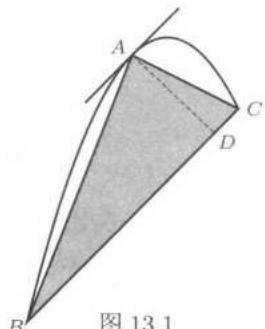
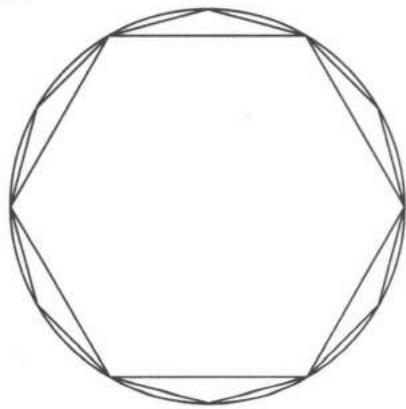

import Guide from '@/components/Guide.astro';
import Knowledge from '@/components/Knowledge.astro';
import Example from '@/components/Example.astro';
import Solution from '@/components/Solution.astro';
import Note from '@/components/Note.astro';
import Block from '@/components/Block.astro';
import Method from '@/components/Method.astro';

## 13.1.1 无穷级数的多种视角

可以从几个不同角度来理解无穷级数的概念。

首先，无穷级数是有限项求和的直接推广。下面是数学发展史上的几个重要例子，其中都涉及无穷级数问题（参见 $[30, 56]$）。

<Example title="例 13.1.1">

我国古代重要典籍《庄子》（约公元前 $300$ 年）一书中有“一尺之棰，日取其半，万世不竭”。从数学上看，这与下列无穷项求和有密切联系：

$$
1 = \frac {1}{2} + \frac {1}{4} + \frac {1}{8} + \dots + \frac {1}{2 ^ {n}} + \dots .
$$

</Example>

<Example title="例 13.1.2">

古希腊伊利亚学派的 $Zeno$（芝诺）提出过 $4$ 个著名的悖论，其中的 $Achilles$ ①悖论是：$Achilles$ 永远追不上在他前面的一只乌龟，因为 $Achilles$ 必须首先跑到乌龟的出发点，而在这段时间中乌龟又已经向前爬过一段距离，因此仍然在 $Achilles$ 的前面，这种情况会无休止地继续下去。

若将上面提到的时间记为 $t_{1}$，并继续下去，问题就变成了计算 $t_{1} + t_{2} + \cdots$ 的和。这是一个无穷级数求和问题。虽然谁都知道 $Achilles$ 一定会赶上乌龟，而且不难直接计算出所需要的时间，但是为了驳倒 $Zeno$ 的说法，就需要有关于无穷级数的概念和工具，这超出了当时希腊数学的水平（见下一小节的思考题 $1$）。

</Example>

<Example title="例 13.1.3">

古希腊数学家 $Archimedes$ 求得抛物线弓形的面积是同底同高的三角形面积乘以因子 $\frac{4}{3}$。如图 $13.1$ 所示，其中作出了经过点 $A, B, C$ 的抛物线弓形和对应的三角形。由于过抛物线上点 $A$ 的切线平行于直线段 $BC$，因此它们符合同底 $(BC)$ 同高 $(AD)$ 的条件。从该图中又可以看出在抛物线弓形中去掉上述三角形之后又得到两个较小的抛物线弓形，于是又可以继续作出与它们分别为同底同高的两个三角形。$Archimedes$ 证明它们的面积之和是第一个三角形面积的 $\frac{1}{4}$，而且这个过程可以无限继续。因此就出现了无穷级数的求和问题：

$$
1 + \frac {1}{4} + \frac {1}{4 ^ {2}} + \dots + \frac {1}{4 ^ {n}} + \dots = \frac {4}{3}.\tag{13.1}
$$

由于当时没有无穷级数的概念和极限理论，$Archimedes$ 在论证中只能使用 $Eudoxus$（欧多克索斯）的穷竭法（详见 $[56]$ 中 $2.3.2$ 小节的 (三) 和 (四)）。

</Example>

<Example title="例 13.1.4">

我国魏晋时代的数学家刘徽提出用“割圆术”来计算圆周率。他的方法是从计算圆的内接正六边形的面积出发，然后将内接正多边形的边数成倍增加，将每次增加的小三角形的面积累加，以得到越来越精确的圆面积值，从而求出圆周率 $\pi$ 的近似值。刘徽提出：“割之弥细，所失弥少，割之又割以至于不可割，则与圆合体而无所失矣。”这就是说圆面积是一个无穷级数之和（本题的分析将在本小节末完成）。

  
图 $13.1$

**续：** 考虑刘徽对半径为 $1$ 的圆面积计算。从内接正六边形开始，每次边数加倍，第 $n$ 次的正多边形边数为 $6 \cdot 2^{n-1}$，其面积为

$$
S_{n} = 3 \cdot 2^{n-1} \sin \frac {\pi}{3 \cdot 2^{n-1}}.
$$

从 $\sin x \sim x\ (x \to 0)$ 可见

$$
\lim_{n \to \infty} S_{n} = \pi .
$$

  
图 $13.2$

以 $\{S_{n}\}$ 为部分和数列的无穷级数是 $\sum_{n=1}^{\infty} a_{n}$ ，其中 $a_{n} = S_{n} - S_{n-1}$（设 $S_{0}=0$）。刘徽的方法就是将 $a_{n}$ 累加以得到级数和 $\pi$ 的近似值。在图 $13.2$ 中的正六边形的面积为 $S_{1} = a_{1}$，而在其每条边上的 $6$ 个小三角形面积之和就是 $a_{2} = S_{2} - S_{1}$。

现在分析级数通项的渐近性态。为方便起见，令 $x_{n} = 3 \cdot 2^{n-1}$，则有

$$
\begin{array}{r l} a_{n} & = S_{n} - S_{n-1} = x_{n} \left(\sin \frac {\pi}{x_{n}} - \frac {1}{2} \sin \frac {2\pi}{x_{n}}\right) \\ & = x_{n} \sin \frac {\pi}{x_{n}} \left(1 - \cos \frac {\pi}{x_{n}}\right) \\ & \sim \frac {\pi^{3}}{2} \cdot \frac {1}{x_{n}^{2}} = \frac {2\pi^{3}}{9} \cdot \left(\frac {1}{4}\right)^{n}. \end{array}\tag{13.6}
$$

因此刘徽的级数 $\sum_{n=1}^{\infty} a_{n}$ 在渐近性态上相当于公比为 $\frac{1}{4}$ 的几何级数。

类似地可以分析每次计算后的误差，这就是级数的余项：

$$
\varepsilon_{n} = S - S_{n} = \pi \left(1 - \frac {\sin \frac {\pi}{x_{n}}}{\frac {\pi}{x_{n}}}\right) \sim \frac {\pi^{3}}{6} \cdot \frac {1}{x_{n}^{2}}.\tag{13.7}
$$

由这些分析已可得到有用的结论。首先，从 $(13.7)$ 知道 $\varepsilon_{n+1} \approx \frac{1}{4} \varepsilon_n$，这与上册的例题 $8.7.1$ 的分析可谓异曲同工。其次，比较 $(13.6)$ 和 $(13.7)$ 可以知道

$$
\varepsilon_{n} \sim \frac {1}{3} a_{n}.\tag{13.8}
$$

从而就可以建立外推公式

$$
\pi \approx S_{n} + \frac {1}{3} (S_{n} - S_{n-1}) = S_{n-1} + \frac {4}{3} (S_{n} - S_{n-1}).\tag{13.9}
$$

例如根据参考文献 $[4]$ 中的第 $48$ 页，仿照刘徽计算出 $96$ 边形和 $192$ 边形的面积：

$$
S_{5} \approx 3.139350203, \quad S_{6} \approx 3.141031951,
$$

然后用 $(13.9)$ 就可以得到有显著改进的结果：

$$
\pi \approx S_{6} + \frac {1}{3} (S_{6} - S_{5}) \approx 3.141592534.
$$

从 $[4]$ 还知道，刘徽在这一步也用了某种外推法，但究竟是什么方法则仍是中国数学史上的一个悬案 ①（关于外推法可以参看 $[12]$）。

① 根据 $[4]$（第 $48$ 页），刘徽计算的是 $100\pi$ 的近似值。他得到的 $S_{5} = 313 \frac{584}{625}$，$S_{6} = 314 \frac{64}{625}$，$S_{6} - S_{5} = \frac{105}{625}$，因此按照 $(13.8)$ 的修正量为 $\frac{35}{625}$，而刘徽实际所用的修正量为 $\frac{36}{625}$，从而得到 $100\pi \approx 314 \frac{100}{625} = 314.16$。

</Example>

其次，对数列的研究就可引出无穷级数。在上册中我们已经有意识地这样做了。在 $2.2.3$ 小节末的注解中（上册 $24$-$25$ 页）引入了无穷级数

$$
\sum_{n=1}^{\infty} a_{n} = a_{1} + a_{2} + \dots + a_{n} + \dots\tag{13.2}
$$

的基本概念，其中包括通项 $a_{n}$，部分和数列 $S_{n} = a_{1} + a_{2} + \cdots + a_{n},\ n = 1, 2, \cdots$。当部分和数列 $\{S_{n}\}$ 收敛时，称无穷级数 $(13.2)$ 收敛，否则称 $(13.2)$ 发散。当无穷级数 $(13.2)$ 收敛时，称极限 $S = \lim_{n \to \infty} S_{n}$ 为无穷级数 $(13.2)$ 的和，并记为

$$
\sum_{n=1}^{\infty} a_{n} = a_{1} + a_{2} + \dots + a_{n} + \dots = S.
$$

此外，对于 $S$ 为无穷大量，即部分和数列 $\{S_{n}\}$ 有广义极限的情况，也写为 $\sum_{n=1}^{\infty} a_{n} = S$。为简明起见，常将无穷级数简称为级数，有时还将 $\sum_{n=1}^{\infty} a_{n}$ 简记为 $\sum a_{n}$。

对收敛级数来说，还需要有余项概念。设 $\sum_{n=1}^{\infty} a_{n}$ 收敛，则级数 $\sum_{k=n+1}^{\infty} a_{k}$ 对每个 $n$ 均收敛。将它的和 $R_{n}$ 称为收敛级数 $\sum_{n=1}^{\infty} a_{n}$ 的第 $n$ 个余项。若将级数 $\sum_{n=1}^{\infty} a_{n}$ 的部分和数列记为 $\{S_{n}\}$，记级数的和为 $S$，则就有 $R_{n} = S - S_{n}$，因此作为数列的余项 $\{R_{n}\}$ 一定是无穷小量：$\lim_{n \to \infty} R_{n} = 0$。

由级数的定义可见，从给定的数列 $\{a_{n}\}$ 出发可以构造一个级数

$$
a_{1} + \sum_{n=1}^{\infty} (a_{n+1} - a_{n}),\tag{13.3}
$$

使得两者同时收敛或发散。当它们收敛时，级数 $(13.3)$ 的和 $S$ 就等于数列的极限：$\lim_{n\to \infty} a_{n} = S$。今后将会看到，对于给定的数列构造级数 $(13.3)$ 是研究数列以及计算其极限的一种有用方法。

由于级数与数列的上述联系，关于级数的不少性质可以从数列的性质直接推出。首先是级数收敛的必要条件：

$$
\sum_{n=1}^{\infty} a_{n} \text{ 收敛 } \Longrightarrow \lim_{n \to \infty} a_{n} = 0,\tag{13.4}
$$

其证明见例题 $2.2.9$。同时在那里已经指出，这不是级数收敛的充分条件。

由数列的 $Cauchy$ 收敛准则（见 §3.4）就得到级数的 $Cauchy$ 收敛准则：级数 $\sum a_{n}$ 收敛的充分必要条件是对每个 $\varepsilon > 0$，存在正整数 $N$，使得对满足条件 $n > N$ 的正整数和每个正整数 $p$，成立不等式

$$
\left| a_{n+1} + a_{n+2} + \dots + a_{n+p} \right| < \varepsilon .\tag{13.5}
$$

注意：若于 $(13.5)$ 中令 $p = 1$，就得到收敛级数的必要条件 $(13.4)$。此外，上册中的例题 $3.4.1$ 和 $3.4.2$ 就是这个收敛准则在无穷级数上的应用。

若级数 $\sum a_{n}$ 的每一项同号，则称该级数为同号级数。习惯上称非负项级数为正项级数。显然对同号级数只需研究正项级数就够了。对于正项级数，其部分和数列为单调增加数列，因此就知道：正项级数收敛的充分必要条件是其部分和数列有上界。

在上册中已经介绍了几个重要的正项级数。例如，已经用多种方法证明调和级数 $\sum_{n=1}^{\infty} \frac{1}{n}$ 发散（见例题 $2.2.6$, $3.4.2$）。进一步是关于 $p$ 次幂的调和级数（简称为 $p$ 级数）$\sum_{n=1}^{\infty} \frac{1}{n^{p}}$ 的敛散性结论：当 $p \leqslant 1$ 时发散，当 $p > 1$ 时收敛（见 $2.2.4$ 小节的题 $9$ 和 $2.3.2$ 小节的题 $6$）。在命题 $2.5.2$ 中得到了自然对数的底 $e$ 的无穷级数表示，并将它用于 $e$ 的近似计算与无理性证明中。

对无穷级数的第三个视角是将它与上册第十二章的广义积分作比较。例如，在级数 $\sum_{n=1}^{\infty} a_{n}$ 与无穷限广义积分 $\int_{a}^{+\infty} f(x) \, \mathrm{d}x$ 的基本概念之间，存在离散 $\leftrightarrow$ 连续的对应关系：$n \leftrightarrow x$, $a_{n} \leftrightarrow f(x)$, $S_{n} = \sum_{k=1}^{n} a_{k} \leftrightarrow \int_{a}^{A} f(x) \, \mathrm{d}x$ 和 $R_{n} = \sum_{k=n+1}^{\infty} a_{k} \leftrightarrow \int_{A}^{+\infty} f(x) \, \mathrm{d}x$。

在敛散性判别方面级数理论为广义积分提供了以下两个工具：

<Knowledge title="命题 13.1.1">

设 $f$ 于 $[a, +\infty)$ 上内闭可积，则广义积分 $\int_{a}^{+\infty} f(x) \, dx$ 收敛的充分必要条件是：对于发散于正无穷大的每个数列 $\{A_{n}\} \subset [a, +\infty)$，级数

$$
\sum_{n=1}^{\infty} \int_{A_{n-1}}^{A_{n}} f(x) \mathrm{d}x
$$

收敛，其中 $A_{0}=a$。

</Knowledge>

<Knowledge title="命题 13.1.2">

设 $f$ 于 $[a, +\infty)$ 上内闭可积且不变号，则 $\int_{a}^{+\infty} f(x) \mathrm{d}x$ 收敛的充分必要条件是：存在发散于正无穷大的严格单调增加数列 $\{A_{n}\} \subset [a, +\infty)$，使同号级数

$$
\sum_{n=1}^{\infty} \int_{A_{n-1}}^{A_{n}} f(x) \mathrm{d}x
$$

收敛，其中 $A_{0}=a$。

<Note>

在例题 $12.2.5$ 中实际上已经用了这个命题。又已在 $12.4.1$ 小节中指出，无穷级数的性质 $(13.4)$ 在广义积分中没有简单的平行结果。

</Note>

</Knowledge>

## 13.1.2 思考题

这一小节的思考题主要用于对级数定义进行复习，对于其中的是非题，若回答“是”，则要作出证明，若回答“不是”，则要举出反例。

1. （例题 $13.1.2$ 之续）设比赛开始时，乌龟在 $Achilles$ 之前 $1000$ m，$Achilles$ 的速度为 $10$ m/s，乌龟的爬行速度为 $0.1$ m/s。试将 $Zeno$ 悖论中的论点转化为无穷级数求和问题，并计算出 $Achilles$ 赶上乌龟所需要的时间。（本题表明：有了无穷级数的工具之后，$Zeno$ 的这个悖论就不再是悖论了。）

2. 设级数 $\sum a_{n}$ 与 $\sum b_{n}$ 均收敛（或发散），讨论下列级数的敛散性：

$$
\sum (a_{n} \pm b_{n}),\ \sum a_{n} b_{n},\ \sum \frac {a_{n}}{b_{n}}\ (b_{n} \neq 0),
$$

又对于 $\sum a_{n}$ 和 $\sum b_{n}$ 均为正项级数情况讨论同样的问题。

3. 对于级数 $\sum \max\{a_{n}, b_{n}\},\ \sum \min\{a_{n}, b_{n}\}$ 继续上题的讨论。

4. 如果级数 $\sum (a_{n} + a_{n+1})$ 收敛，是否必可推出 $\sum a_{n}$ 收敛？在 $\sum a_{n}$ 是正项级数时，答案又是什么？

5. 记 $S = 1 - 1 + 1 - 1 + \cdots$，并作以下计算：

$$
S = 1 - (1 - 1 + 1 - 1 + \dots) = 1 - S \Longrightarrow S = \frac {1}{2},
$$

问：其中有何错误？又可在阅读第二组参考题 $18$ 后再做此题。

6. 讨论级数 $a_{1} - a_{1} + a_{2} - a_{2} + \cdots + a_{n} - a_{n} + \cdots$ 的敛散性。

7. 如果对每个正整数 $p$ 均成立

$$
\lim_{n \rightarrow \infty} (a_{n+1} + a_{n+2} + \dots + a_{n+p}) = 0,
$$

问：是否能由此推出级数 $\sum a_{n}$ 一定收敛？

8. 设 $a_{n} \leqslant c_{n} \leqslant b_{n},\ n = 1, 2, \cdots$，若已知级数 $\sum a_{n}$ 和 $\sum b_{n}$ 同时收敛（或发散），问：能否推出级数 $\sum c_{n}$ 收敛（或发散）？并请将你的结论与数列的夹逼定理（见上册 $20$ 页）作比较。

9. 设 $\sum a_{n}$ 收敛于和 $S$，若对于每个 $n$ 将 $a_{2n-1}$ 和 $a_{2n}$ 两项作交换，证明所得的新级数收敛，并求其和。

10. 设有收敛正项级数 $\sum a_{n}$，且对于每个正整数 $n$ 成立 $a_{n} \leqslant a_{n} R_{n}$，其中 $R_{n}$ 为第 $n$ 个余项，证明：$\sum a_{n}$ 实际上是有限和。
