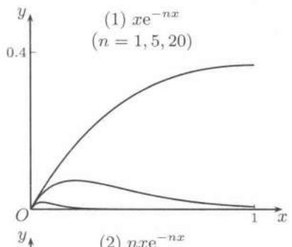
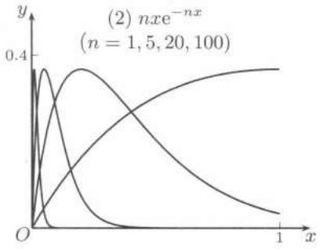
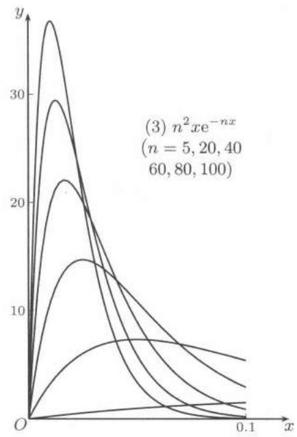
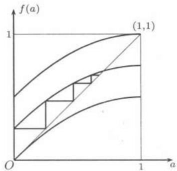

import Guide from '@/components/Guide.astro';
import Knowledge from '@/components/Knowledge.astro';
import Example from '@/components/Example.astro';
import Solution from '@/components/Solution.astro';
import Note from '@/components/Note.astro';
import Block from '@/components/Block.astro';
import Method from '@/components/Method.astro';

函数是数学分析的主要研究对象。将函数展开为函数项级数，使得级数的通项是比较简单的函数，这样就为函数的研究和计算提供了新工具。对于以函数项级数的和函数形式出现的大量非初等函数，如何利用级数来研究它们的基本性质，如连续性、可微性、可积性以及如何计算它们的导数和积分就成为需要解决的基本理论问题。为此我们需要引进新的概念，这就是一致收敛性。

## 14.1.1 基本内容

下面先列出函数项级数的一致收敛概念的要点。

1. 函数项级数 $\sum_{n=1}^{\infty} u_n(x)$ 在某个数集 $E$ 上的收敛性以及在收敛时的和函数（值）是逐点定义的，一般称为“点收敛”“逐点收敛”或“点态收敛”等。这在上一章都已见过，在讨论时与常数项级数没有区别。但为了研究函数项级数的和函数，则需要有比点收敛更强的条件，这就是一致收敛性。在 $[31]$ 的第六章中有这方面发展的历史性材料。

2. 函数项级数在数集 $E$ 上的一致收敛性是一种整体性质。这类整体性质在数学分析中多次出现。例如函数在某个区间上的有界性、一致连续性和 $Riemann$ 可积性等。与此相反，函数的连续性、可微性和函数项级数的点收敛性则是局部性质（可参考上册 $137$， $140$ 页）。

3. 称函数项级数 $\sum_{n=1}^{\infty} u(x)$ 在数集 $E$ 上一致收敛，如果该级数的部分和函数列 $\{S_n(x)\}$ 在 $E$ 上一致收敛。

4. 设一个函数列 $\{S_n(x)\}$ 在数集 $E$ 上收敛于其极限函数 $S(x)$ 。称 $\{S_n(x)\}$ 于 $E$ 上一致收敛，如果对于每个正数 $\varepsilon > 0$ ，存在 $N$ ，使得对每个正整数 $n > N$ ，和每个 $x \in E$ ，均成立 $|S_n(x) - S(x)| < \varepsilon$ 。

容易看出，这与 $\lim_{n\to \infty}S_n(x) = S(x)$ 在所有 $x\in E$ 成立的不同之处是目前的 $N$ 只与 $\varepsilon$ 有关，它对于所有 $x\in E$ 同时适用。这就是收敛的“一致性”。

5. 若函数项级数 $\sum_{n=1}^{\infty} u_n(x)$ 在开区间 $I$ 中的每个有界闭区间上一致收敛，则称该级数在 $I$ 中内闭一致收敛。与函数的有界性、一致连续性和可积性等整体性质一样，若一个函数项级数在 $I$ 上一致收敛，则一定在 $I$ 中内闭一致收敛，但反之不一定成立。

6. 若 $\sum_{n=1}^{\infty}|u_n(x)|$ 于数集 $E$ 上一致收敛，则称 $\sum_{n=1}^{\infty} u_n(x)$ 于 $E$ 上绝对一致收敛。在 $E$ 上绝对一致收敛的函数项级数必在 $E$ 上一致收敛，但反之不真。

一致收敛性有明显的几何意义。下面是三个例子及其几何图像。

<Example title="例题 14.1.1">
非负连续函数列

(1) $\{xe^{-nx}\}$ ， (2) $\{nxe^{-nx}\}$ ， (3) $\{n^{2}xe^{-nx}\}$ 

在区间 $[0,1]$ 上收敛于同一个极限函数 $S(x) \equiv 0$ 。从图 $14.1$ 上可以看出它们在 $[0,1]$ 上的收敛情况大不相同。 (1) 是一致收敛的； (2) 不一致收敛，但还是一致有界的； (3) 不一致收敛，而且不一致有界。（图中对 (3) 只作出 $0 \leqslant x \leqslant 0.1$ 的部分。）

  
图 $14.1$

容易看出三个函数列中的第 $n$ 个函数都在点 $x = 1 / n$ 处达到最大值。这些最大值分别为 $1 / (ne)$ ， $1 / e$ 和 $n / e$ 。又不难计算出，对这三个函数列都存在（曲边梯形面积的）极限 $\lim_{n\to \infty}\int_0^1 f_n(x)\mathrm{d}x$ ，极限值分别为 $0$， $0$ 和 $1$。
</Example>

其次是一致收敛性的判别方法。

1. 对于函数项级数来说，主要的一致收敛性判别法有： $Cauchy$ 一致收敛准则， $Weierstrass$ 判别法（也称为 $M$ -判别法、强级数判别法和优级数判别法等），以及通过 $Abel$ 变换得到的 $Abel$ 判别法和 $Dirichlet$ 判别法。

2. $Cauchy$ 一致收敛准则是充分必要条件，但应用时往往需要较复杂的技巧。

3. $Weierstrass$ 判别法只对绝对一致收敛的情况有效。但是可举例说明，存在绝对一致收敛的函数项级数的例子，使得 $Weierstrass$ 判别法失效。但由于它将问题归结为正项级数的收敛性判别，使用方便，因此有广泛的应用。

4. $Abel$ 判别法和 $Dirichlet$ 判别法都是函数项级数一致收敛的充分必要条件，其证明与广义积分和数项级数的同名判别法类似。

5. 在数项级数中没有对应物的是基于 $Dini$ 定理的 $Dini$ 判别法：

<Knowledge title="Dini 定理">
若函数项级数 $\sum_{n=1}^{\infty} u_{n}(x)$ 的每一项（或 $n$ 充分大后的项）为有界闭区间 $[a, b]$ 上的非负连续函数，又已知级数的和函数 $S(x)$ 也在 $[a, b]$ 上连续，则级数在 $[a, b]$ 上一致收敛 $^{①}$ 。
</Knowledge>

当然 $Dini$ 判别法对条件的要求较高，但它仍在许多问题中有效。此外，如果关心的区间不是有界闭区间，则还有可能得到内闭一致收敛性的结论。

6. 在讨论函数项级数 $\sum_{n=1}^{\infty} u_n(x)$ 的一致收敛性时比较容易的一类情况是能够得到其部分和函数列 $\{S_n(x)\}$ 的紧凑表达式，这时问题就转化为函数列的一致收敛性问题（不难看出可以将已经列举的各种判别法改述为关于函数列的一致收敛性判别法）。如果同时还能得到级数的和函数，即函数列 $\{S_n(x)\}$ 的极限函数 $S(x)$ 的表达式，则就有上确界判别法：函数列 $\{S_n(x)\}$ 在数集 $E$ 上一致收敛于 $S(x)$ 的充分必要条件是

$$
\lim _ {n \to \infty} \sup _ {x \in E} \{| S _ {n} (x) - S (x) | \} = 0.
$$

对于具体问题来说，则往往有可能用微分法求 $\left|S_{n}(x)-S(x)\right|$ 在 $E$ 上的最大值或上确界，又若能估计出它的上界 $a_{n}$ 使得成立 $\lim_{n\to\infty}a_{n}=0$ ，则也可以得到一致收敛的结论。这也可称为优势判别法。

这里需要指出几点：

(1) 请初学者注意：这个上确界判别法（即优势判别法）与函数项级数的 $Weierstrass$ 判别法不一样，并无直接关系，前者是充分必要条件，后者只是充分条件。

(2) 由于上确界判别法是充分必要条件，因此往往能解决不一致收敛的判别问题。特别是还能得到以下的对角线判别法：如果存在数列 $\{x_{n}\} \subset E$ ，使得条件

$$
\lim _ {n \rightarrow \infty} | S _ {n} (x _ {n}) - S (x _ {n}) | = 0
$$

不满足，则 $\{S_n(x)\}$ 在 $E$ 上不一致收敛于 $S(x)$ 。

(3) 为了便于掌握有关一致收敛的基本概念，在教科书中均举出许多可以用上确界判别法得到解决的例题。但是这并不表明这类方法可以用于许多函数项级数问题上去。事实上求函数项级数的部分和函数列以及和函数的表达式一般是困难的或者根本做不到的事情。

7. 证明给定的函数项级数在某个数集 $E$ 上不一致收敛的方法不多。如果不能将问题归结为函数列去研究的话，则一般需要用 $Cauchy$ 一致收敛准则。此外，在一致收敛条件下保证和函数或极限函数具有某种性质的一系列命题的逆否命题，也往往可以用来判定非一致收敛性。最常用的就是连续性命题的逆否命题：若函数项级数（或函数列）的每一项于区间 $I$ 上处处连续，又已知其和函数（或极限函数）在 $I$ 上不是处处连续，则级数（或函数列）于 $I$ 上不一致收敛。在下面例题 $14.1.3$ 中还会介绍它的一种变形。

## 14.1.2 例题

由于在一般教科书中已有大量关于函数列的例题，本节不拟收入这方面的很多材料。下面首先是几个涉及判别方法的例题。

<Example title="例题 14.1.2">
绝对一致收敛的函数项级数的一致收敛性不一定能够用 $Weierstrass$ 判别法来判定：观察非负函数项级数 $\sum_{n=1}^{\infty} u_{n}(x)$ ，其中对 $n = 1, 2, \cdots$ 令

$$
u _ {n} (x) = \left\{ \begin{array}{l l} { \frac {1}{n},} & { \frac {1}{n + 1} \leqslant x <   \frac {1}{n},} \\ {0,} & {x \text {为区间} [ 0, 1 ] \text {中的其他值}.} \end{array} \right.
$$

容易看出，对于区间 $[0,1]$ 中的每个 $x$ ，在级数的无限项中至多只有一项不是 $0$，因此级数处处收敛。又可以看出对余项的估计 $R_{n}(x) = \sum_{k=n+1}^{\infty} u_{k}(x) \leqslant \frac{1}{n+1}$ 在 $[0,1]$ 上一致成立，因此级数在 $[0,1]$ 上一致收敛。但是从 $\sup_{x \in [0,1]} \{u_{n}(x)\} = \frac{1}{n}$（ $n=1,2,\cdots$ ）和调和级数发散可知，用 $Weierstrass$ 判别法一定不成功。

<Note>本题的构造方法可以推广为：设非负数列 $\{a_{n}\}$ 收敛于 $0$，区间 $I$ 上的函数列 $\{u_{n}(x)\}$ 满足条件 $|u_{n}(x)| \leqslant a_{n}, \forall n, u_{i}(x)u_{j}(x) = 0, \forall i \neq j$ ，则 $\sum_{n=1}^{\infty} u_{n}(x)$ 在区间 $I$ 上必一致收敛。</Note>
</Example>

下一个例题中的结论可以作为一种不一致收敛判别法来使用。

<Example title="例题 14.1.3">
设对每个 $n$，函数 $u_{n}(x)$ 在 $x=c$ 处左连续，又已知 $\sum_{n=1}^{\infty} u_{n}(c)$ 发散。证明：对任意正数 $\delta > 0$， $\sum_{n=1}^{\infty} u_{n}(x)$ 在区间 $(c - \delta, c)$ 上必不一致收敛。

<Solution title="证明">
用反证法。设有 $\delta > 0$ ，使 $\sum_{n=1}^{\infty} u_n(x)$ 在区间 $(c - \delta, c)$ 上一致收敛，这就是 $\forall \varepsilon > 0, \exists N > 0$ ，当 $n \geqslant N$ 时，对每个正整数 $p$ 和每个 $x \in (c - \delta, c)$ ，成立

$$
\left| u _ {n + 1} (x) + u _ {n + 2} (x) + \dots + u _ {n + p} (x) \right| <   \varepsilon .\tag{14.1}
$$

由题设， $u_{n+1}(x)+u_{n+2}(x)+\cdots+u_{n+p}(x)$ 在 $x=c$ 左连续，在 $(14.1)$ 中令 $x\to c^{-}$ ，得到

$$
\left| u _ {n + 1} (c) + u _ {n + 2} (c) + \dots + u _ {n + p} (c) \right| \leqslant \varepsilon .
$$

由数项级数的 $Cauchy$ 收敛准则知道，这与 $\sum_{n=1}^{\infty} u_{n}(c)$ 发散的条件相矛盾。 ☐
</Solution>

<Note>注1 可将本题与一致连续性理论中的例题 $5.4.5$（上册 $140$ 页）作比较。</Note>

<Note>注2 例如，函数项级数 $\sum_{n=1}^{\infty} n e^{-nx}$ 在 $x = 0$ 时发散，因此该级数在 $(0, +\infty)$ 上必定不一致收敛。当然，还可以进一步研究是否内闭一致收敛等可能性。</Note>
</Example>

下一个例题是用导函数的性质来判定函数项级数的一致收敛性。

<Example title="例题 14.1.4 (Bendixon (本迪克松) 判别法)">
设 $\sum_{n=1}^{\infty} u_{n}(x)$ 为 $[a, b]$ 上的可微函数项级数，且 $\sum_{n=1}^{\infty} u_{n}'(x)$ 的部分和函数列在 $[a, b]$ 上一致有界，证明：如果 $\sum_{n=1}^{\infty} u_{n}(x)$ 在 $[a, b]$ 上收敛，则必在 $[a, b]$ 上一致收敛。

<Solution title="证明">
由题设，存在正常数 $C$，使得对每个正整数 $n$ 和每个 $x \in [a, b]$ ，同时成立不等式

$$
\left| \sum_ {k = 1} ^ {n} u _ {k} ^ {\prime} (x) \right| \leqslant C.
$$

对每个给定的 $\varepsilon > 0$ ，取区间 $[a, b]$ 的等距分划 $\{x_{0}, x_{1}, \cdots, x_{m}\}$ ，其中 $m$ 充分大，使分划的细度 $\Delta x_{i} = \frac{b - a}{m} < \frac{\varepsilon}{4C}$ .

由于函数项级数 $\sum_{n=1}^{\infty} u_n(x)$ 在 $[a, b]$ 上处处收敛，因此从 $Cauchy$ 收敛准则知，存在 $N$ ，使 $n > N$ 时，对任意正整数 $p$ 和分划的每个分点 $x_i$ ，同时成立

$$
\left| \sum_ {k = n + 1} ^ {n + p} u _ {k} (x _ {i}) \right| <   \frac {\varepsilon}{2}, i = 0, 1, \dots , m.
$$

现在对于任意的 $x \in [a, b]$ ，不妨设 $x \in [x_{i-1}, x_i]$ ，就可以作出估计：

$$
\begin{array}{r l} \left| \sum_ {k = n + 1} ^ {n + p} u _ {k} (x) \right| & = \left| \sum_ {k = n + 1} ^ {n + p} u _ {k} (x _ {i}) + \sum_ {k = n + 1} ^ {n + p} (u _ {k} (x) - u _ {k} (x _ {i})) \right| \\ & \leqslant \left| \sum_ {k = n + 1} ^ {n + p} u _ {k} (x _ {i}) \right| + \left| \sum_ {k = n + 1} ^ {n + p} u _ {k} ^ {\prime} (\xi_ {i}) \right| \cdot | x - x _ {i} | \\ & <   \frac {\varepsilon}{2} + 2 C | x - x _ {i} | \leqslant \frac {\varepsilon}{2} + \frac {\varepsilon}{2} = \varepsilon , \end{array}
$$

其中在 $[x, x_i]$ 上对 $\sum_{k=n+1}^{n+p} [u_k(x) - u_k(x_i)]$ 用微分中值定理， $\xi_i \in (x, x_i)$ 。这表明 $\sum_{n=1}^{\infty} u_n(x)$ 在 $[a, b]$ 上满足 $Cauchy$ 一致收敛准则，从而在 $[a, b]$ 上一致收敛。 □
</Solution>
</Example>

<Example title="例题 14.1.5">
证明：函数项级数 $\sum_{n = 1}^{\infty}(-1)^{n}x^{n}(1 - x)$ 在 $[0,1]$ 上绝对收敛且一致收敛，但不绝对一致收敛。

<Solution title="证明">
(1) $\sum_{n=1}^{\infty} (-1)^{n} x^{n}(1 - x)$ 在 $[0,1]$ 上绝对收敛：实际上每项取绝对值之后的级数 $\sum_{n=1}^{\infty} x^{n}(1 - x)$ 的部分和函数列为 $\{x - x^{n+1}\}$ ，因此在 $[0,1]$ 上处处收敛。

(2) $\sum_{n=1}^{\infty} (-1)^{n} x^{n}(1 - x)$ 在 $[0,1]$ 上不绝对一致收敛：从 (1) 可见取绝对值后级数 $\sum_{n=1}^{\infty} x^{n}(1 - x)$ 的和函数为 $S(x) = x, x \in [0,1), S(1) = 0$ ，它在点 $x = 1$ 的左侧不连续，而级数通项在 $[0,1]$ 上连续，因此该级数在 $[0,1]$ 上不一致收敛。

(3) $\sum_{n=1}^{\infty} (-1)^{n} x^{n}(1 - x)$ 在 $[0, 1]$ 上一致收敛：直接计算出余项

$$
R _ {n} (x) = \sum_ {k = n + 1} ^ {\infty} (- 1) ^ {k} x ^ {k} (1 - x) = \frac {(- 1) ^ {n + 1} x ^ {n + 1} (1 - x)}{1 + x},
$$

因此有估计（其中利用了算术平均值-几何平均值不等式）：

$$
\begin{array}{r l}| R _ {n} (x) |&\leqslant (1 - x) x ^ {n + 1} = \frac {1}{n + 1} [ (n + 1) (1 - x) \cdot x ^ {n + 1} ]\\&\leqslant \frac {1}{n + 1} \left(\frac {n + 1}{n + 2}\right) ^ {n + 2} <   \frac {1}{n + 1} \rightarrow 0,\end{array}
$$

可见级数于 $[0,1]$ 上一致收敛。
</Solution>
</Example>

<Example title="例题 14.1.6">
求 $\sum_{n=1}^{\infty} n\left(x + \frac{1}{n}\right)^n$ 的收敛域，并讨论其一致收敛性。

<Solution title="解">
(1) 先求收敛域。当 $x = 0$ 时级数显然收敛。当 $x \neq 0$ 时，观察级数通项的绝对值：

$$
\left| n \left(x + \frac {1}{n}\right) ^ {n} \right| = n | x | ^ {n} \cdot \left| \left(1 + \frac {1}{n x}\right) ^ {n} \right| \sim n | x | ^ {n} \mathrm{e} ^ {\frac {1}{x}},
$$

因而原级数当 $|x| < 1$ 时收敛，当 $|x| \geqslant 1$ 时发散，级数的收敛域是 $(-1, 1)$ 。

(2) 函数项级数一致收敛的一个必要条件是其通项一致收敛于 $0$。但本题的级数通项不满足这个条件。这用对角线判别法就可以知道：对每个正整数 $n$ ，取 $x_{n} = 1 - \frac{1}{n} \in (-1, 1)$ ，则就有

$$
n \left(x _ {n} + \frac {1}{n}\right) ^ {n} = n \rightarrow + \infty .
$$

因此所论级数在 $(-1,1)$ 上不一致收敛。
</Solution>

<Note>这里也可用例题 $14.1.3$ 提供的判别法。由于当 $|x| = 1$ 时级数发散，因此不可能在 $(-1, 1)$ 上一致收敛。但是容易证明级数在其中内闭一致收敛。</Note>
</Example>

下一题在每种教科书中都有，为了比较起见，我们列入该题，证明从略。

<Example title="例题 14.1.7">
证明：级数 $\sum_{n=1}^{\infty} \frac{\sin nx}{n}$ 在闭区间 $[a, b]$ 上一致收敛的充分必要条件是该闭区间不含 $2\pi$ 的整倍数点。
</Example>

下面是用 $Cauchy$ 一致收敛准则来判定函数项级数的经典性结果，其中所用的分析方法具有新的特点，值得学习（参见 $[51]$）。

<Example title="例题 14.1.8">
设 $\{b_{n}\}$ 为单调减少的非负数列，证明：级数 $\sum_{n=1}^{\infty} b_{n} \sin nx$ 在 $(-\infty, +\infty)$ 上一致收敛的充分必要条件是 $b_{n} = o\left(\frac{1}{n}\right)$ 。

<Solution title="证明">
为方便起见引入下列记号，其中 $n < p$：

$$
S _ {n, p} = b _ {n} \sin n x + b _ {n + 1} \sin (n + 1) x + \dots + b _ {p} \sin p x.
$$

先证必要性。此时只需考虑区间 $(0,1)$。设级数在这个区间上一致收敛，则对于 $\varepsilon > 0$ ，存在 $N$ ，使得对于任意的 $p > n > N$ ，不等式 $|S_{n,p}| < \varepsilon$ 对所有 $x \in (0,1)$ 同时成立。

取 $p = 2n - 1, x = \frac{\pi}{4n}$ ，这时在和式

$$
S _ {n, 2 n - 1} = b _ {n} \sin n x + b _ {n + 1} \sin (n + 1) x + \dots + b _ {2 n - 1} \sin (2 n - 1) x
$$

中的每个正弦函数的自变量都在区间 $\left[\frac{\pi}{4},\frac{\pi}{2}\right]$ 中，因此就有

$$
b _ {2 n} n \sin \frac {\pi}{4} <   b _ {2 n} [ \sin n x + \sin (n + 1) x + \dots + \sin (2 n - 1) x ] \leqslant S _ {n, 2 n - 1} <   \varepsilon ,
$$

可见 $b_{n} = o\left(\frac{1}{n}\right)$ 成立。

再证充分性。显然只要证明级数在区间 $[0, \pi]$ 上一致收敛。这时对 $S_{n,p}$ 的估计将随 $x$ 取不同值而采用不同的方法，但最后综合起来的估计则与 $x$ 无关。

从非负无穷小量 $\{nb_{n}\}$ 可以合理地定义一个新的单调减少数列：

$$
\mu_ {n} = \max _ {m \geqslant n} \{m b _ {m} \}, n = 1, 2, \dots ,
$$

且有 $\mu_{n} \rightarrow 0$ 。以下分三种情况估计 $S_{n,p}$ 。

(1) 若 $x \leqslant \frac{\pi}{p}$ ，则在 $S_{n,p}$ 中的每一个正弦函数的自变量都在 $[0, \pi]$ 内，再利用 $\sin \theta \leqslant \theta, \forall \theta \in [0, \pi]$ ，就得到

$$
\left| S _ {n, p} \right| = S _ {n, p} \leqslant b _ {n} n x + b _ {n + 1} (n + 1) x + \dots + b _ {p} p x \leqslant p \mu_ {n} x \leqslant \pi \mu_ {n}.
$$

(2) 若 $x \geqslant \frac{\pi}{n}$ ，则利用三角变换（见例题 $13.3.3$）， $Jordan$ 不等式 $\sin \theta \geqslant \frac{2}{\pi} \theta, \forall \theta \in \left[0, \frac{\pi}{2}\right]$ （例题 $8.5.6$）和 $\frac{x}{2} \leqslant \frac{\pi}{2}$ ，可以对于任意 $r \geqslant n$ 估计出

$$
\left| \sin n x + \sin (n + 1) x + \dots + \sin r x \right| \leqslant \frac {1}{\sin (x / 2)} \leqslant \frac {\pi}{x} \leqslant n,
$$

然后从 $Abel$ 变换和 $\{b_{n}\}$ 的非负单调性（见 $(13.22)$）得到

$$
\left| S _ {n, p} \right| \leqslant \frac {\pi}{x} \cdot b _ {n} \leqslant n b _ {n} \leqslant \mu_ {n}.
$$

(3) 若 $\frac{\pi}{p} < x < \frac{\pi}{n}$ ，则需同时使用以上两种方法。分拆 $S_{n,p} = S_{n,k} + S_{k+1,p}$ ，其中取 $k = [\pi/x]$ （使得 $n \leqslant k < p$ ），并分别用前面的两种方法估计，就得到

$$
\left| S _ {n, p} \right| \leqslant \left| S _ {n, k} \right| + \left| S _ {k + 1, p} \right| \leqslant \pi \mu_ {n} + \mu_ {k + 1} \leqslant \mu_ {n} (\pi + 1),
$$

其中利用了 $kx \leqslant \pi < (k + 1)x$ 和 $\mu_{k+1} \leqslant \mu_n$ 。

合并 $(1)—(3)$，就得到估计式 $|S_{n,p}|\leqslant\mu_{n}(\pi+1)$ 对于任意 $p>n$ 和 $x\in[0,\pi]$ 同时成立。由于 $\mu_{n}\rightarrow0$ ，可见级数一致收敛。
</Solution>

<Note>注1 例题 $14.1.7$ 中的级数显然不满足本题的条件。</Note>

<Note>注2 用本题的方法（或其他方法）可以证明例题 $14.1.7$ 中级数的部分和函数列在 $(-\infty,+\infty)$ 上一致有界。用 $Dirichlet$ 判别法就得到比本题较弱的结论：若 $\{nb_{n}\}$ 单调减少趋于 $0$，则函数项级数 $\sum_{n=1}^{\infty}b_{n}\sin nx$ 在 $(-\infty,+\infty)$ 上一致收敛。</Note>
</Example>

下一个例题为 § $16.3$ 中的 $Weierstrass$ 逼近定理的证明提供了一个初等起点，同时又可以看成是 § $2.6$ 中迭代生成数列方法在函数列中的延伸。

<Example title="例题 14.1.9 (Visser (维塞) 定理)">
设在区间 $[-1,1]$ 上定义函数列 $\{a_{n}(x)\}$ 如下：

$$
a _ {1} (x) \equiv 0, a _ {n + 1} (x) = a _ {n} (x) + \frac {1}{2} [ x ^ {2} - a _ {n} ^ {2} (x) ], n = 1, 2, \dots .
$$

证明： $\{a_{n}(x)\}$ 是在区间 $[-1,1]$ 上一致收敛于 $|x|$ 的多项式序列。

<Solution title="证明">
分析 从对称性可见只需在区间 $[0,1]$ 上讨论。不难知道本题中由迭代得到的多项式序列 $\{a_n(x)\}$ 是在 $[0,1]$ 上的严格单调增加的连续函数列，且收敛于极限函数 $a(x) = x$ 。因此用 $Dini$ 定理就知道结论成立。其中的具体细节请读者完成。

这里将从 § $2.6$ 的迭代生成数列的几何理论出发，配合图 $14.2$ 观察本题，说明如何在分析论证之前就可以发现以上全部事实。

  
图 $14.2$

考虑 $[0,1]$ 上的点收敛，则从 $a_{n}$ 到 $a_{n + 1}$ 的迭代方程是

$$
f (a) = a + \frac {1}{2} (x ^ {2} - a ^ {2}),\tag{14.2}
$$

其中 $x$ 是参数。初始值 $a_1 = 0$ 。如图 $14.2$ 所示，其中作出了迭代方程的三条曲线，它们的参数分别为 $x = 0, \frac{\sqrt{2}}{2}, 1$ 。在图中还对于中间一条曲线用 $2.6.2$ 小节中的蛛网工作法从 $a_1 = 0$ 开始作了几次迭代（参见上册 $50$ 页的图 $2.4$）。容易看到，由于参数 $x \in [0,1]$ 时的每条迭代曲线都严格单调增加，因此所得到的迭代生成数列 $\{a_n(x)\}$ 也严格单调增加。此外，对每个参数 $x \in [0,1]$ 都有

$$
\lim _ {n \rightarrow \infty} a _ {n} (x) = x,
$$

即收敛于迭代方程 $(14.2)$ 的不动点 $a = x$ 。这些都可以从关于迭代数列的两个基本规律的命题 $2.6.1$ 和 $2.6.2$ 直接得出。
</Solution>
</Example>

## 14.1.3 练习题

1. 讨论函数列或函数项级数在给定区间上的一致收敛性：

$$
S _ {n} (x) = \frac {x}{1 + n ^ {2} x ^ {2}}, n = 1, 2, \dots , x \in (- \infty , + \infty);
$$

(2) $S_{n}(x)=\frac{nx}{1+n^{2}x^{2}}, n=1,2,\cdots,x\in(-\infty,+\infty);$

(3) $S_{n}(x)=\frac{n+x^{2}}{nx}, n=1,2,\cdots, x\in(0,+\infty);$

(4) $S_{n}(x)=\frac{x}{n}\ln\frac{x}{n},\quad n=1,2,\cdots,(i)x\in(0,1),(ii)x\in(0,+\infty);$

(5) $S_{n}(x)=n\sin\frac{x}{n}, n=1,2,\cdots,$ (i) $x\in[0,a]$ ， (ii) $x\in(0,+\infty)$ ；

$$
S _ {n} (x) = \frac {1}{n} \ln \left(1 + \mathrm{e} ^ {- n x}\right), n = 1, 2, \dots , (\mathrm{i}) x \geqslant 0, (\mathrm{ii}) x <   0;
$$

$$
\sum_ {n = 1} ^ {\infty} \frac {n ^ {8}}{\sqrt {n !}} \left(x ^ {n} + x ^ {- n}\right), \frac {1}{t} \leqslant | x | \leqslant t, t > 1; \tag {7}
$$

$$
\sum_ {n = 1} ^ {\infty} \frac {\sin x \sin n x}{\sqrt {n + x}}, x > 0; \tag {8}
$$

(9) $\sum_{n=1}^{\infty}\frac{1}{n}\left[\mathrm{e}^{x}-\left(1+\frac{x}{n}\right)^{n}\right]$ ，(i)有限闭区间 $[0,b]$ ，(ii) $[0,+\infty)$ 。

2. 确定函数项级数 $\sum_{n=1}^{\infty} \frac{x^n}{1 + x^{2n}}$ 的收敛域与一致收敛域。

3. 证明：函数项级数 $\sum_{n=1}^{\infty} \frac{(-1)^{n-1} x^2}{(1 + x^2)^n}$ 在 $(- \infty, +\infty)$ 上绝对收敛且一致收敛，但不绝对一致收敛。

4. 证明：函数项级数 $\sum_{n=2}^{\infty} \ln \left(1 + \frac{x}{n \ln^{2} n}\right)$ 在区间 $(-a, a)$ 上一致收敛，其中 $a$ 是小于 $2 \ln^{2} 2$ 的任意固定正数。

5. 证明：函数项级数 $\sum_{n=1}^{\infty} 2^{n} \sin \frac{1}{3^{n} x}$ 在 $(0, +\infty)$ 上处处收敛，但不一致收敛。

6. 证明：函数项级数 $\sum_{n=0}^{\infty} \int_{0}^{x} t^{n} \sin \pi t \, \mathrm{d}t$ 在 $[0,1]$ 上一致收敛。

7. 设 $\{f_n\}$ 是有界闭区间 $[a, b]$ 上的连续函数列，且设该函数列在 $(a, b)$ 上一致收敛，证明： $\{f_n\}$ 在点 $a$ 和 $b$ 都收敛，且在 $[a, b]$ 上一致收敛。

8. 设 $f$ 在 $(a, b)$ 上有连续导函数，定义

$$
F _ {n} (x) = \frac {n}{2} \left[ f \left(x + \frac {1}{n}\right) - f \left(x - \frac {1}{n}\right) \right], x \in (a, b), n = 1, 2, \dots .
$$

证明：函数列 $\{F_n\}$ 在 $(a,b)$ 上处处收敛且内闭一致收敛。

9. 设函数列 $\{u_n(x)\}$ 中的函数在 $[a, b]$ 上同为单调增加函数或同为单调减少函数，如果 $\sum_{n=1}^{\infty} u_n(a)$ 与 $\sum_{n=1}^{\infty} u_n(b)$ 都绝对收敛，证明：函数项级数 $\sum_{n=1}^{\infty} u_n(x)$ 在 $[a, b]$ 上一致收敛。

10. 设在区间 $[a, b]$ 上的连续函数列 $\{f_n\}$ 一致收敛于极限函数 $f$ ，且已知 $f$ 在 $[a, b]$ 上无零点，证明：函数列 $\left\{\frac{1}{f_n}\right\}$ 在 $[a, b]$ 上一致收敛。

11. 设函数列 $\{f_n\}$ 于区间 $I$ 上一致收敛，又设每个 $f_n$ 于 $I$ 上有界，证明：函数列 $\{f_n\}$ 于 $I$ 上一致有界。

12. 设函数列 $\{f_n\}$ 与 $\{g_n\}$ 分别在区间 $I$ 上一致收敛。如果每个 $f_n$ 和 $g_n$ 在 $I$ 上有界，证明：函数列 $\{f_n \cdot g_n\}$ 在 $I$ 上一致收敛 $^{①}$。

13. 设 $f \in C(-\infty, +\infty)$ ，定义函数列 $S_{n}(x) = \sum_{k=1}^{n} \frac{1}{n} f \left( x + \frac{k}{n} \right)$ ， $n = 1, 2, \cdots$ ，证明：函数列 $\{S_{n}(x)\}$ 在 $(-\infty, +\infty)$ 上内闭一致收敛。

14. 设 $S_{1}(x) \in R[a, b]$ ，定义

$$
S _ {n + 1} (x) = \int_ {a} ^ {x} S _ {n} (t) \mathrm{d} t, n = 1, 2, \dots .
$$

证明：函数列 $\{S_n(x)\}$ 在 $[a,b]$ 上一致收敛。
