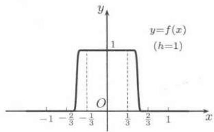

import Guide from '@/components/Guide.astro';
import Knowledge from '@/components/Knowledge.astro';
import Example from '@/components/Example.astro';
import Solution from '@/components/Solution.astro';
import Note from '@/components/Note.astro';
import Block from '@/components/Block.astro';
import Method from '@/components/Method.astro';

由于幂级数可以看成为多项式的直接推广, 因此如果一个函数能够在某个区间上展开为幂级数, 则就提供了研究和计算这个函数的有效手段 ① .

## $14.4.1$ $Taylor$级数与函数的幂级数展开式

设函数 $f$ 在区间 $I$ 上有定义, $x_{0}$ 为 $I$ 的一个内点, 如果存在点 $x_{0}$ 的一个邻域 $U(x_{0})$ , 使在该邻域上成立等式 $f(x)=\sum_{n=0}^{\infty}a_{n}(x-x_{0})^{n}$ , 则称 $f$ 能在 $x_{0}$ 附近 (也称在点 $x_{0}$ 处) 展开为幂级数, 并将该幂级数称为 $f$ 在点 $x_{0}$ 的幂级数展开式.

由幂级数理论可见, $f$ 能够在点 $x_0$ 展开为幂级数的必要条件是 $f$ 在点 $x_0$ 处无限次可导. 利用幂级数在其收敛域内部可以无限次逐项求导就可以知道, 如果在点 $x_0$ 邻近成立

$$
f (x) = \sum_ {n = 0} ^ {\infty} a _ {n} (x - x _ {0}) ^ {n},
$$

则一定有 $a_{n}=\frac{f^{(n)}(x_{0})}{n!}$, $n=0,1,\cdots$ 。因此，如果 $f$ 能够在点 $x_{0}$ 附近展开为幂级数，则这个展开式是惟一的，其系数是完全确定的。

现设函数 $f$ 在点 $x_0$ 处无限次可微，则称幂级数

$$
\sum_ {n = 0} ^ {\infty} \frac {f ^ {(n)} (x _ {0})}{n !} (x - x _ {0}) ^ {n}\tag{14.17}
$$

为函数 $f$ 在点 $x_0$ 处的 $Taylor$ 级数（在点 $x_0 = 0$ 时，又称幂级数 $(14.17)$ 为 $f$ 的 $Maclaurin$ 级数).由上面的讨论已经得到下面的命题，它说明函数 $f$ 在点 $x_0$ 处的 $Taylor$ 级数与其在点 $x_0$ 处的幂级数展开式之间的基本关系：

<Knowledge title="命题 $14.4.1$">
  幂级数展开的惟一性定理：如果函数 $f$ 在点 $x_0$ 的某个邻域 $U(x_0)$ 上能够展开为幂级数 $\sum_{n = 0}^{\infty}a_n(x - x_0)^n$ ，则这个幂级数展开式是惟一的，而且它就是 $f$ 在 $x_0$ 处的 $Taylor$ 级数。
</Knowledge>

仔细检查上面的概念, 就可以发现, 为了将一个函数于某点附近展开为幂级数, 有几个重要的问题是必须研究的:

1. 若 $f$ 在点 $x_0$ 处无限次可微, 则按照 $(14.17)$ 写出的 $Taylor$ 级数是否一定有正收敛半径?

2. 若 $f$ 在点 $x_0$ 处无限次可微, 并且 $f$ 在 $x_0$ 处的 $Taylor$ 级数有正收敛半径, 则在收敛域上该级数的和函数是否一定等于 $f$ ?

可以举例说明, 对这两个重要问题的回答都是不一定.

就问题 $1$ 来说, 在许多教科书中都收入了下列函数

$$
f (x) = \sum_ {n = 0} ^ {\infty} \frac {\sin (2 ^ {n} x)}{n !}.\tag{14.18}
$$

如果计算出这个函数在原点的所有阶导数值, 就可以证明所得到的 $Maclaurin$ 级数的收敛半径为 $0$. 其他例子可以参考 $[21]$ 等. 这些例子容易使人以为它们是少有的精品. 但是在《数学通报》(1964) 第 $10$ 期 $38$-$40$ 页的一文中证明了下列命题, 从而完全改变了人们的看法 (又见《美国数学月刊》(1981) 第 $88$ 卷 $51$-$52$ 页和 $[53]$).

<Knowledge title="命题 $14.4.2$">
  每个幂级数都是 $Taylor$ 级数.

  <Solution title="证明">
    只需证明对于每个给定的数列 $\{a_{n}\}$ 存在函数 $f$，使满足 $f^{(n)}(0)=n!a_{n}(n=0,1,\cdots)$ 即可。这里当 $n=0$ 时记号 $f^{(0)}(0)=f(0)$ 。与 $(14.18)$ 相类似，这样的函数可以用无穷级数构造出来。

    首先介绍其中的基本“构件”：对于指定的正整数 $n$ 和常数 $h$ ，可以构造一个无限次可微函数，使它在原点的 $n$ 阶导数等于 $h$ ，而所有其他阶导数都等于 $0$。先定义在三个区间上分别取常值的函数

    $$
    f (x) = \left\{ \begin{array}{l l} h, & | x | \leqslant \frac {1}{2 | h | + 1}, \\ 0, & | x | \geqslant \frac {2}{2 | h | + 1}, \end{array} \right.\tag{14.19}
    $$

    然后在 $f$ 已有定义的区间之间用无限次可微的单调函数相连接（这里可以用上册 $171$ 页例题 $6.2.5$ 中的方法），从而得到在 $(- \infty, + \infty)$ 上的无限次可微函数。在图 $14.3$ 中作出了参数 $h = 1$ 的函数 $f$ 的图像，其中 $f$ 在 $x \geqslant 2 / 3, x \leqslant -2 / 3$ 和 $-1 / 3 \leqslant x \leqslant 1 / 3$ 三个区间上均取常值，

    这个函数 $f$ 满足条件 $f(0) = h, f^{(n)}(0) = 0, \forall n > 0$ . 改记 $f = f_0$ , 定义 $f_1(x) = \int_0^x f_0(t)\mathrm{d}t$ , 则 $f_1'(x) = f_0(x), f_1'(0) = h, f_1^{(n)}(0) = 0, \forall n \neq 1$ . 归纳地定义

    $$
    f _ {n} (x) = \int_ {0} ^ {x} f _ {n - 1} (t) \mathrm{d} t,
    $$

    就知道 $f_{n}^{(k)}(0)=0,\forall k\neq n,f_{n}^{(n)}(0)=h.$

    同时还可以作出与 $h$ 无关的估计.从

    $$
    f _ {n} ^ {(n - 1)} (x) = \int_ {0} ^ {x} f _ {0} (t) \mathrm{d} t
    $$

    可知， $|f_{n}^{(n-1)}(x)|<1$ ，即在图 $14.3$ 中的曲线下面积小于 $2$.

    由此出发作积分, 就可以归纳地证明:

    $$
    \left| f _ {n} ^ {(k)} (x) \right| <   \frac {\left| x \right| ^ {n - 1 - k}}{(n - 1 - k) !},
    $$

      
    图 $14.3$

    其中 $0 \leqslant k < n$ .

    现在对于每个非负整数 $n$ 取 $h = a_{n}n!$ ，用上面的方法构造出在 $(- \infty, + \infty)$ 上无限次可微的函数列 $\{u_n(x)\}$ ，使满足条件

    $$
    u _ {n} ^ {(k)} (0) = 0, \forall k \neq n, u _ {n} ^ {(n)} (0) = a _ {n} n!,
    $$

    同时有估计 $|u_n^{(k)}(x)| < \frac{|x|^{n - 1 - k}}{(n - 1 - k)!}, \forall 0 \leqslant k < n.$

    现在定义下列函数项级数及其和函数:

    $$
    u _ {0} (x) + u _ {1} (x) + \dots + u _ {n} (x) + \dots = U (x).\tag{14.20}
    $$

    由以上估计可知, 不仅级数 $(14.20)$ 在任意有界闭区间上一致收敛, 而且在任意次逐项求导后的级数也一致收敛, 因此 $U(x)$ 无穷次可微, 且其导数可以用级数的逐项求导来得到. 这样就得到 $U^{(n)}(0) = u_n^{(n)}(0) = n!a_n$ .
  </Solution>

  <Note>
    根据上述命题, 只要取 $\{a_{n}\}$ , 使得幂级数 $\sum_{n=0}^{\infty} a_{n} x^{n}$ 的收敛半径为 $0$, 这样就得到收敛半径为 $0$ 的 $Taylor$ 级数.
  </Note>
</Knowledge>

就问题 $2$ 来说, 上册 $169$ 页的例题 $6.2.4$ 已提供了这样的例子. 这就是

$$
f (x) = \left\{ \begin{array}{l l} \mathrm{e} ^ {- \frac {1}{x ^ {2}}}, & x \neq 0, \\ 0, & x = 0. \end{array} \right.
$$

它处处无限次可微, 在 $x = 0$ 处的任意阶导数值为 $0$ , 因此在该点的 $Taylor$ 级数的每一项为 $0$ , 收敛半径当然是 $R = +\infty$ . 但是这个级数在 $x \neq 0$ 的每一点上的和函数值都不等于 $f(x)$ 的值. 因此, 这个函数在 $x = 0$ 处 (附近) 不能展开为幂级数 (参见上册 $169$ 页的图 $6.4$) ① .

解决函数是否能展开为幂级数的工具是第七章中的 $Taylor$ 公式: 设 $f$ 在点 $x_{0}$ 的某个邻域 $U(x_{0})$ 中无限次可微, 则对于每个 $n$ 有

$$
f (x) = \sum_ {k = 0} ^ {n} \frac {f ^ {(k)} (x _ {0})}{k !} (x - x _ {0}) ^ {k} + r _ {n} (x),
$$

其中余项可以有多种形式(见命题 $7.2.2$—$7.2.4$ 或命题 $11.4.3$). 将此式改写为

$$
r _ {n} (x) = f (x) - \sum_ {k = 0} ^ {n} \frac {f ^ {(k)} \left(x _ {0}\right)}{k !} \left(x - x _ {0}\right) ^ {k},\tag{14.21}
$$

并与 $(14.17)$ 作比较, 就可以看出, 这里的 $r_n(x)$ 就是 $f(x)$ 与其 $Taylor$ 级数的第 $n + 1$ 个部分和函数之差. 因此就可以建立下列基本结论:

<Knowledge title="命题 $14.4.3$">
  $f$ 在点 $x_0$ 的邻域 $U(x_0)$ 能展开为幂级数 $\sum_{n=0}^{\infty} a_n (x - x_0)^n$ 的充分必要条件是 $f$ 的 $Taylor$ 公式的余项 $(14.21)$ 在邻域 $U(x_0)$ 内处处收敛于 $0$.

  <Solution title="证明">
    先证必要性. 设 $f$ 在点 $x_0$ 的某个邻域 $U(x_0)$ 上是幂级数 $\sum_{n=0}^{\infty} a_n(x - x_0)^n$ 的和函数. 根据命题 $14.4.1$ 可知, 这个幂级数只能是 $Taylor$ 级数 $(14.17)$. 由于该级数收敛, 因此该级数作为收敛级数的余项就是 $Taylor$ 公式的余项 $(14.21)$. 于是已经证明了 $r_n(x)$ 在该邻域内处处收敛于 $0$.

    再证充分性. 若 $\{r_n(x)\}$ 在某个邻域 $U(x_0)$ 内处处趋于 $0$, 则从 $(14.21)$ 可见 $Taylor$ 级数 $(14.17)$ 有正收敛半径, 且至少在 $U(x_0)$ 上以 $f(x)$ 为其和函数.
  </Solution>

  <Note>
    注 $1$: 由此可见, 利用 $Taylor$ 公式的余项在理论上可以同时解决 $Taylor$ 级数 $(14.17)$ 是否有正收敛半径以及其和函数是否等于 $f(x)$ 的问题.
  </Note>

  <Note>
    注 $2$: 初学者往往容易将第七章的 $Taylor$ 公式与本节的 $Taylor$ 级数混淆，因此这里简要地指出两者的差别如下。第七章的 $Taylor$ 公式并不涉及无限项求和问题，其中只有有限项。同时，对于函数 $f$ 的要求也只需要有若干次可微性。这些都与本节的 $Taylor$ 级数不同。在上册 $204$ 页开始引入的 $Taylor$ 公式的余项概念与无穷级数中的余项概念完全不同。在命题 $14.4.3$ 的证明中的关键之处就在于这两个余项在命题的条件下可以等同起来。
  </Note>
</Knowledge>

## $14.4.2$ 将函数展开为幂级数的基本方法

与 $7.2.2$ 小节中计算 $Taylor$ 公式的方法类似，将给定的一个函数在指定点附近展开为幂级数有直接法与间接法两种方法。本节中将较多地介绍间接法。这里的原因是容易理解的。所谓直接法或直接展开法，就是利用命题 $14.4.1$ 写出级数 $(14.17)$，然后再用命题 $14.4.3$ 证明余项趋于 $0$。因此用直接法首先需要计算函数在展开点的所有高阶导数，又为了研究余项，还需要计算 $f$ 的所有高阶导函数，而这往往是更困难的工作。在教科书中也只是对于少数几个初等函数采用直接法得到它们的幂级数展开式。因此我们将较多地介绍间接法。

下面六个基本的 $Taylor$ 级数就是应用间接法的基础, 希望初学者把它们作为数学分析中最重要的公式牢牢记住。

$$
\frac {1}{1 - x} = 1 + x + x ^ {2} + \dots + x ^ {n} + \dots , x \in (- 1, 1);
$$

$$
2. \mathrm{e} ^ {x} = 1 + x + \frac {x ^ {2}}{2 !} + \dots + \frac {x ^ {n}}{n !} + \dots , x \in (- \infty , + \infty);
$$

$$
\sin x = x - \frac {x ^ {3}}{3 !} + \frac {x ^ {5}}{5 !} - \dots + (- 1) ^ {n} \frac {x ^ {2 n + 1}}{(2 n + 1) !} + \dots , x \in (- \infty , + \infty);
$$

$$
\cos x = 1 - \frac {x ^ {2}}{2 !} + \frac {x ^ {4}}{4 !} - \dots + (- 1) ^ {n} \frac {x ^ {2 n}}{(2 n) !} + \dots , x \in (- \infty , + \infty);
$$

$$
\ln (1 + x) = x - \frac {x ^ {2}}{2} + \dots + \frac {(- 1) ^ {n - 1} x ^ {n}}{n} + \dots , x \in (- 1, 1 ];
$$

$$
(1 + x) ^ {\alpha} = 1 + \alpha x + \frac {\alpha (\alpha - 1)}{2 !} x ^ {2} + \dots + \frac {\alpha (\alpha - 1) \cdots (\alpha - n + 1)}{n !} x ^ {n} + \dots ,
$$

其中 $\alpha$ 为不等于非负整数的任何实数，而展开式成立的范围当 $\alpha \leqslant -1$ 时为 $(-1,1)$ ，当 $-1 < \alpha < 0$ 时为 $(-1,1]$ ，当 $\alpha > 0$ 时为 $[-1,1]$ .

注 上面的 $Taylor$ 级数 $6$, 即二项式级数, 是一个十分有用的幂级数展开式. 例如上面的级数展开式 $1$ 实际上是二项式级数的特例, 只要在其中将 $x$ 换为 $-x$ 并且取 $\alpha = -1$ 即可. 只是由于该展开式的重要性, 我们单独把它作为一个展开式列出. 级数展开式 $5$ 也可以用先对 $\ln(1 + x)$ 求导, 再对 $\alpha = -1$ 时的二项式级数逐项积分得到. 在下面的例题中, 我们还会再用二项式级数推出一些常见的初等函数的幂级数展开式.

这里需要说明, 所谓间接法并没有明确的范围, 实际上只要不是用直接法就都是间接法. 间接法的理论基础是幂级数展开的惟一性定理 (即命题 $14.4.1$). 根据这个定理, 不论用什么方法, 只要所得到的幂级数有正收敛半径就可以. 其中当然可以使用四则运算和微积分运算. 对于乘法运算, 由于幂级数在收敛域内部的绝对收敛性, 而乘积级数按照幂级数形式写出时恰好就是 $Cauchy$ 乘积, 因此在 $13.3.2$ 小节中的命题 $13.3.5$ 已经解决了幂级数的相乘问题. 但是对于除法, 则需要有新的理论根据. 下面是这方面的一个命题, 其中的证明取自 $[60]$.

<Knowledge title="命题 $14.4.4$">
  设函数 $f$ 在点 $x = 0$ 邻近可以展开为幂级数 $1 + a_{1}x + a_{2}x^{2} + \cdots + a_{n}x^{n} + \cdots$ ，则其倒函数 $\frac{1}{f}$ 也可以在点 $x = 0$ 邻近展开为幂级数.

  <Solution title="证明">
    从给出收敛半径的 $Cauchy$-$Hadamard$ 公式可以知道, 存在 $r > 0$, 使得 $\left|a_{n}\right| < r^{n}$ 对每个 $n = 1, 2, \cdots$ 成立. (此点请读者根据公式 $(14.14)$ 作出证明.) 现在先作形式计算, 即求待定的数列 $\{b_{n}\}$ , 使得成立

    $$
    (1 + a _ {1} x + a _ {2} x ^ {2} + \dots) \cdot (1 + b _ {1} x + b _ {2} x ^ {2} + \dots) = 1.\tag{14.22}
    $$

    将左边的乘积展开，并等置两边同次数的乘幂项，就得到计算 $\{b_n\}$ 的递归公式：

    $$
    b _ {1} = - a _ {1}, b _ {2} = - a _ {1} b _ {1} - a _ {2}, \dots ,
    $$

    $$
    b _ {n} = - a _ {1} b _ {n - 1} - a _ {2} b _ {n - 2} - \dots - a _ {n}, \dots .
    $$

    现在我们用数学归纳法来证明, 对于 $\{b_{n}\}$ 有下列估计式:

    $$
    \left| b _ {n} \right| <   2 ^ {n - 1} r ^ {n}, n = 1, 2, \dots .\tag{14.23}
    $$

    对于 $n = 1$，有 $\left|b_{1}\right| = \left|a_{1}\right| < r$ ，因此符合 $(14.23)$. 设估计式 $(14.23)$ 对于 $n = 1, 2, \cdots, k - 1$ 成立，则对于 $n = k$ 就有

    $$
    \begin{array}{r l} & {| b _ {k} | \leqslant | a _ {1} b _ {k - 1} | + | a _ {2} b _ {k - 2} | + \dots + | a _ {k - 1} b _ {1} | + | a _ {k} |} \\ & {\quad \leqslant (2 ^ {k - 2} + 2 ^ {k - 3} + \dots + 1 + 1) r ^ {k} = 2 ^ {k - 1} r ^ {k}.} \end{array}
    $$

    因此估计式 $(14.23)$ 成立.

    利用这个估计式, 从 $Cauchy$-$Hadamard$ 公式 $(14.14)$ 就知道, 幂级数

    $$
    1 + b _ {1} x + b _ {2} x ^ {2} + \dots + b _ {n} x ^ {n} + \dots
    $$

    至少在 $|x| < \frac{1}{2r}$ 时收敛. 从而当 $|x| < \min \{r, \frac{1}{2r}\}$ 时, 等式 $(14.22)$ 不只是作形式运算 (即待定系数法) 的出发点, 而且是严格成立的. 这也就是所要的结果: 在 $x = 0$ 的一个邻域上有幂级数展开式:

    $$
    \frac {1}{1 + a _ {1} x + \cdots + a _ {n} x ^ {n} + \cdots} = 1 + b _ {1} x + b _ {2} x ^ {2} + \dots + b _ {n} x ^ {n} + \dots .
    $$
  </Solution>

  <Note>
    注 $1$: 在这个命题的基础上再结合级数相乘, 就可以得到幂级数相除的一般结论: 若 $f = g / h$ , 其中函数 $g$ 和 $h$ 在点 $x_0$ 的邻近都可以展开为幂级数, 且 $h(x_0) \neq 0$ , 则 $f$ 也可以在点 $x_0$ 邻近展开成幂级数, 同时这个级数的系数可以用类似于上述命题证明中的待定系数法来得到.
  </Note>

  <Note>
    注 $2$: 在 $[18]$ 第二卷 $446$ 小节中证明了更为一般的命题.这里只叙述其结论，证明从略.还可以参考 $[15]$ 的第二章.

    命题 设幂级数展开式 $y = f(x) = \sum_{n=0}^{\infty} a_n x^n$ 在点 $x = 0$ 邻近成立，又有幂级数展开式 $z = \varphi(y) = \sum_{n=0}^{\infty} b_n y^n$ 在区间 $(- \rho, \rho)$ 中成立，如果满足条件 $|a_0| = |f(0)| < \rho$ ，则复合函数 $z = \varphi(f(x))$ 在点 $x = 0$ 的邻近可以展开为幂级数，同时其系数可以用级数代入级数的待定系数法得到.
  </Note>
</Knowledge>

## $14.4.3$ 例题

这一节的内容与上册 $7.2.2$ 和 $7.2.3$ 小节的部分内容有密切联系. 那里的许多 $Taylor$ 公式的计算可以作为本节的特例得到, 而且当时的间接法还只有级数代入级数之类的方法, 现在则还可以用逐项求积与逐项求导方法.

以下第一个例题中的两个初等函数的 $Maclaurin$ 展开式可以用直接法得到, 也可以用逐项积分的间接法得到, 后者无疑更为方便. 初学者应当重视这些基本训练, 同时也应当记住这两个基本的 $Taylor$ 级数展开式.

<Example title="例题 $14.4.1$">
  用间接法求 $\arctan x$ 与 $\arcsin x$ 的 $Maclaurin$ 级数展开式.

  <Solution title="解">
    (1) 由于 $(\arctan x)' = \frac{1}{1 + x^2} = \sum_{n=0}^{\infty} (-1)^n x^{2n}, x \in (-1, 1)$ , 用逐项积分就得到

    $$
    \arctan x = x - \frac {x ^ {3}}{3} + \dots + \frac {(- 1) ^ {n} x ^ {2 n + 1}}{2 n + 1} + \dots , x \in (- 1, 1).
    $$

    (2) 由于 $(\arcsin x)' = \frac{1}{\sqrt{1 - x^2}} = 1 + \sum_{n=1}^{\infty} \frac{(2n-1)!!}{(2n)!!} x^{2n}, x \in (-1,1)$ , 用逐项积分就得到

    $$
    \arcsin x = x + \frac {x ^ {3}}{6} + \dots + \frac {(2 n - 1) ! !}{(2 n) ! ! (2 n + 1)} x ^ {2 n + 1} + \dots , x \in (- 1, 1).
    $$

    注意: 用 $Abel$ 第二定理知道两个展开式都在端点 $x = \pm1$ 处成立.
  </Solution>
</Example>

<Example title="例题 $14.4.2$">
  现在求正弦和余弦之外的四个基本三角函数的 $Maclaurin$ 展开式(其中 $\cot x$ 和 $\csc x$ 是在乘以因子 $x$ 之后的 $Maclaurin$ 展开式).仿照上册 $216$ 页中的做法，并应用命题 $14.4.4$，就得到 $Maclaurin$ 级数展开式

  $$
  \frac {x}{\mathrm{e} ^ {x} - 1} = B _ {0} + \frac {B _ {1}}{1 !} x + \frac {B _ {2}}{2 !} x ^ {2} + \dots + \frac {B _ {n}}{n !} x ^ {n} + \dots ,\tag{14.24}
  $$

  其中左边的表达式在点 $x = 0$ 处用其极限值 $1$ 来代替.与 $7.2.3$ 小节中的记号相同， $\{B_n\}$ 为 $Bernoulli$ 数，其中 $B_{1} = -1 / 2$ ，当 $n$ 为大于 $1$ 的奇数时 $B_{n} = 0$ .以下采用记号 $\overline{B}_n = (-1)^{n - 1}B_{2n}(n\geqslant 1)$

  由此出发就可以与例题 $7.2.8$ 和 $7.2.9$ 类似地得到 $Maclaurin$ 级数展开式

  $$
  x \cot x = 1 - \frac {\overline {{{B}}} _ {1} 2 ^ {2}}{2 !} x ^ {2} - \frac {\overline {{{B}}} _ {2} 2 ^ {4}}{4 !} x ^ {4} + \dots - \frac {\overline {{{B}}} _ {n} 2 ^ {2 n}}{(2 n) !} x ^ {2 n} + \dots ,\tag{14.25}
  $$

  $$
  \begin{array}{r l} \tan x & = \frac {\overline {{{B}}} _ {1} (2 ^ {2} - 1) 2 ^ {2}}{2 !} x + \frac {\overline {{{B}}} _ {2} (2 ^ {4} - 1) 2 ^ {4}}{4 !} x ^ {3} + \dots \\ & \quad + \frac {\overline {{{B}}} _ {n} (2 ^ {2 n} - 1) 2 ^ {2 n}}{(2 n) !} x ^ {2 n - 1} + \dots . \end{array}\tag{14.26}
  $$

  再利用三角恒等式 $\csc x = \frac{1}{2}\left(\cot \frac{x}{2} +\tan \frac{x}{2}\right)$ ，即可得到

  $$
  x \csc x = 1 + \sum_ {n = 1} ^ {\infty} \frac {\overline {{{B}}} _ {n} (2 ^ {2 n} - 2)}{(2 n) !} x ^ {2 n}.\tag{14.27}
  $$

  最后，回顾例题 $7.2.7$ 并应用命题 $14.4.4$ 就可以得到

  $$
  \sec x = E _ {0} - \frac {E _ {2}}{2 !} x ^ {2} + \dots + \frac {(- 1) ^ {n} E _ {2 n}}{(2 n) !} x ^ {2 n} + \dots ,\tag{14.28}
  $$

  其中 $\{E_{2n}\}$ 为 $Euler$ 数 (见上册 $215$ 页) ① .
</Example>

<Example title="例题 $14.4.3$">
  求 $f(x) = \frac{1}{1 + x + x^2}$ 在(1)点 $x_0 = 0$ 和(2)点 $x_0 = -\frac{1}{2}$ 处的幂级数展开式.

  <Solution title="解">
    (1) 这时可以如下计算:

    $$
    \begin{array}{r l} f (x) & = \frac {1}{1 + x + x ^ {2}} = \frac {1 - x}{1 - x ^ {3}} = (1 - x) \sum_ {n = 0} ^ {\infty} x ^ {3 n} = \sum_ {n = 0} ^ {\infty} x ^ {3 n} - \sum_ {n = 0} ^ {\infty} x ^ {3 n + 1} \\ & = (1 + x ^ {3} + x ^ {6} + \dots + x ^ {3 n} + \dots) - (x + x ^ {4} + x ^ {7} + \dots + x ^ {3 n + 1} + \dots) \\ & = 1 - x + x ^ {3} - x ^ {4} + \dots + x ^ {3 n} - x ^ {3 n + 1} + \dots , x \in (- 1, 1). \end{array}
    $$

    这就是所求的幂级数展开式.

    (2) 为了将函数 $f$ 展开成关于 $x + \frac{1}{2}$ 的乘幂的幂级数, 可计算如下:

    $$
    \begin{array}{r l} f (x) & = \frac {1}{1 + x + x ^ {2}} = \frac {1}{\frac {3}{4} + \left(x + \frac {1}{2}\right) ^ {2}} = \frac {4}{3} \cdot \frac {1}{1 + \frac {4}{3} \left(x + \frac {1}{2}\right) ^ {2}} \\ & = \frac {4}{3} \sum_ {n = 0} ^ {\infty} (- 1) ^ {n} \left[ \frac {4}{3} \left(x + \frac {1}{2}\right) ^ {2} \right] ^ {n} \\ & = \frac {4}{3} \sum_ {n = 0} ^ {\infty} \left(- \frac {4}{3}\right) ^ {n} \left(x + \frac {1}{2}\right) ^ {2 n}. \end{array}
    $$

    其中应用了上一节中列举的基本公式之 $1$，即 $\frac{1}{1 - x}$ 的幂级数展开式．从以上计算过程不难看出级数展开式成立的范围为 $\left|\frac{2}{\sqrt{3}}\left(x + \frac{1}{2}\right)\right| < 1$ ，即 $x\in$ $\left(-\frac{1}{2} -\frac{\sqrt{3}}{2}, - \frac{1}{2} +\frac{\sqrt{3}}{2}\right).$
  </Solution>

  <Note>
    注 如果注意到

    $$
    \sin \frac {2 (n + 1) \pi}{3} = \left\{ \begin{array}{l l} \frac {\sqrt {3}}{2}, & n = 3 k, \\ - \frac {\sqrt {3}}{2}, & n = 3 k + 1, k = 0, 1, 2, \dots , \\ 0, & n = 3 k + 2, \end{array} \right.
    $$

    就可以将(1)的幂级数展开式改写为

    $$
    f (x) = \frac {2}{\sqrt {3}} \sum_ {n = 0} ^ {\infty} \sin \frac {2 (n + 1) \pi}{3} x ^ {n}, x \in (- 1, 1).
    $$
  </Note>
</Example>

<Example title="例题 $14.4.4$">
  求函数 $f(x)=\ln^{2}(1+x)$ 的 $Maclaurin$ 级数展开式.

  <Solution title="解">
    用级数乘法即可得到在 $(-1,1)$ 中成立幂级数展开式:

    $$
    \ln^ {2} (1 + x) = 2 \sum_ {n = 2} ^ {\infty} \frac {(- 1) ^ {n}}{n} \left(1 + \frac {1}{2} + \frac {1}{3} + \dots + \frac {1}{n - 1}\right) x ^ {n}.\tag{14.29}
    $$

    当 $x=1$ 时右边级数收敛, 从 $Abel$ 第二定理知该展开式在 $x=1$ 时仍成立. □
  </Solution>
</Example>

<Example title="例题 $14.4.5$">
  设 $a$ 不是 $\pi$ 的整倍数, 求函数 $\frac{x \sin a}{1 - 2x \cos a + x^{2}}$ 的 $Maclaurin$ 级数展开式.

  <Solution title="解">
    用待定系数法计算如下. 设

    $$
    \frac {x \sin a}{1 - 2 x \cos a + x ^ {2}} = \sum_ {n = 0} ^ {\infty} a _ {n} x ^ {n},
    $$

    两边乘以 $1 - 2x\cos a + x^2$ 并等置两边同次项，就可求出

    $$
    a _ {0} = 0, a _ {1} = \sin a, a _ {2} = \sin 2 a, \dots , a _ {n} = \sin n a, \dots .
    $$

    因此 $\frac{x\sin a}{1 - 2x\cos a + x^2} = \sum_{n = 1}^{\infty}x^n\sin na.$ 容易看出右边的级数在 $x\in (-1,1)$ 上收敛．而当 $a$ 不是 $\pi$ 的整倍数时，数列 $\{\sin na\}$ 不趋于 $0$，因此级数的收敛域就是 $(-1,1)$. □
  </Solution>
</Example>

<Example title="例题 $14.4.6$">
  求 $f(x)=\mathrm{e}^{x}\sin x$ 的 $Maclaurin$ 级数展开式.

  <Solution title="解">
    如果用间接展开法, 则需要将 $\mathrm{e}^x$ 与 $\sin x$ 的 $Maclaurin$ 级数展开式相乘, 运算将较为复杂. 因此我们采用直接展开法. 首先, 可用数学归纳法证明公式 $f^{(n)}(x) = (\sqrt{2})^n\mathrm{e}^x\sin \left(x + \frac{n\pi}{4}\right)$ , 由此得到

    $$
    f ^ {(n)} (0) = (\sqrt {2}) ^ {n} \sin \frac {n \pi}{4}, n = 1, 2, 3, \dots .
    $$

    这样就得到所求的 $Maclaurin$ 级数为

    $$
    \sum_ {n = 0} ^ {\infty} \frac {(\sqrt {2}) ^ {n} \sin \frac {n \pi}{4}}{n !} x ^ {n}.\tag{14.30}
    $$

    按照直接法的一般步骤, 到这里为止还不知道级数 $(14.30)$ 是否收敛于 $e^{x}\sin x$ , 因此需要应用命题 $14.4.3$ 去研究 $Taylor$ 公式的余项. 但是这里可以避免这一步. 利用 $e^{x}$ 和 $\sin x$ 的 $Maclaurin$ 级数展开式均在 $(-∞,+∞)$ 成立, 因此处处绝对收敛. 应用级数乘积定理 (命题 $13.3.5$), 就可以知道 $e^{x}\sin x$ 也能够展开为幂级数, 且收敛半径也是 $+∞$ . 再利用幂级数展开的惟一性定理 (即命题 $14.4.1$), 可见 $(14.30)$ 必定在 $(-∞,+∞)$ 上收敛于 $e^{x}\sin x$ .
  </Solution>
</Example>

## $14.4.4$ 练习题

<Block title="练习题">
  1. 将函数 $f(x) = \frac{1}{a - x} (a \neq 0)$ 分别按 $x$, $x - b$, $\frac{1}{x}$ 的乘幂展开.

  2. 将函数 $f(x) = \ln x$ 展开为 $\frac{x - 1}{x + 1}$ 的幂级数.

  3. 设函数 $f$ 在区间 $(-a, a) (a > 0)$ 上无限次可微，且导函数序列 $\{f^{(n)}\}$ 在 $(-a, a)$ 上一致有界，证明： $f$ 在 $(-a, a)$ 上可以展开为 $Maclaurin$ 级数.

  4. 设函数 $f$ 在 $(-∞,+∞)$ 上无穷次可导，并且其导函数列在 $(-∞,+∞)$ 上一致有界。如果存在正数数列 $\{x_{n}\}$ ，使 $\lim_{n\to\infty}x_{n}=0$ 且 $f(x_{n})=0$, $n=1,2,\cdots$ 。证明： $f(x)\equiv0$ 。

  5. 求下列函数的 $Maclaurin$ 展开式, 并确定其成立范围:

  (1) $\sqrt{4 - x}$ ;

  (2) $a^{x}$, $a > 0;$

  (3) $\ln(1+3x+2x^{2})$ ;

  (4) $\arctan\frac{2x}{1-x^{2}};$

  (5) $\frac{1}{1 + x + x^2 + x^3 + x^4}$ ;

  (6) $\frac{\mathrm{e}^{x^2}}{1 - x^2}$ ;

  (7) $\frac{\mathrm{d}}{\mathrm{d}x}\left(\frac{\mathrm{e}^x - 1}{x}\right)$ ;

  (8) $\int_{0}^{x}\frac{1-\cos t}{t^{2}}dt.$

  6. 将下列函数在指定点展开为幂级数:

  (1) $\frac{1}{3 + x}$, $x = 2$ ;

  (2) $\ln \frac{1}{3 + 2x + x^2}$, $x = -1;$

  (3) $\ln x$, $x = 3;$

  (4) $\frac{x-1}{x+1}$, $x=1;$

  (5) $\sin x$, $x = \frac{\pi}{6}.$
</Block>
