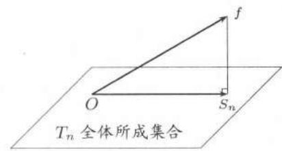

import Guide from '@/components/Guide.astro';
import Knowledge from '@/components/Knowledge.astro';
import Example from '@/components/Example.astro';
import Solution from '@/components/Solution.astro';
import Note from '@/components/Note.astro';
import Block from '@/components/Block.astro';
import Method from '@/components/Method.astro';

$Fourier$ 级数是一类特殊的三角级数, 它的特殊性在于其系数是从某个可积函数出发经过 $Euler-Fourier$ 公式计算出来的.

## 15.1.1 $Fourier$系数的计算公式

设 $f$ 是以 $2\pi$ 为周期的函数且在 $[- \pi, \pi]$ 上可积和绝对可积. (若 $f$ 为常义可积, 则可积蕴含绝对可积, 又若 $f$ 为广义可积, 则绝对可积蕴含可积.)

计算 $f$ 的 $Fourier$ 系数的 $Euler-Fourier$ 公式是:

$$
a _ {n} = \frac {1}{\pi} \int_ {- \pi} ^ {\pi} f (x) \cos n x \mathrm{d} x, n = 0, 1, 2, \dots ;\tag{15.1}
$$

$$
b _ {n} = \frac {1}{\pi} \int_ {- \pi} ^ {\pi} f (x) \sin n x \mathrm{d} x, n = 1, 2, \dots .\tag{15.2}
$$

如果三角级数 $\frac{a_0}{2} +\sum_{n = 1}^{\infty}(a_n\cos nx + b_n\sin nx)$ 中的系数满足公式$(15.1)$和$(15.2)$，则称该三角级数是 $f$ 的$Fourier$级数，记为

$$
f (x) \sim \frac {a _ {0}}{2} + \sum_ {n = 1} ^ {\infty} \left(a _ {n} \cos n x + b _ {n} \sin n x\right).\tag{15.3}
$$

注意: 上述公式只表明右边的系数 $a_{n}, b_{n}$ 与左边的函数 $f$ 之间满足公式 $(15.1)$ 和 $(15.2)$. 记号 “\~” 没有其他含义, 公式 $(15.3)$ 右边的级数是否收敛, 以及在收敛时其和函数是否等于 $f$ , 都是需要另行讨论的问题.

回顾教科书中导出 $Euler-Fourier$ 公式的过程, 其出发点是在 $(-∞,+∞)$ 上一致收敛 (也就是在一个周期长度的闭区间上一致收敛) 的一个三角级数, 然后通过逐项求积导出上述公式. 由此就得到 $Fourier$ 级数学习中的第一个基本定理 (其中对一致收敛的范围理解如上):

<Knowledge title="命题 15.1.1">
一致收敛的三角级数必是其和函数的 $Fourier$ 级数.
</Knowledge>

虽然用 $Euler-Fourier$ 公式得到的 $Fourier$ 级数未必一致收敛, 但这个命题仍然是很有用的一个基本结果.

<Note>
注1 虽然只有周期函数才可能有$Fourier$级数，但当 $f$ 的定义域是某个长度为 $2\pi$ 的区间时，可先将其延拓成周期函数，且把延拓后的周期函数的$Fourier$级数称为 $f$ 在该区间上的$Fourier$级数。对于周期不是 $2\pi$ 的周期函数或只在长度不是 $2\pi$ 的区间上定义的函数，也可用类似的方法定义它们的$Fourier$级数。
</Note>

<Note>
注2 当 $f$ 为偶函数或奇函数时， $f$ 的$Fourier$级数有较为简单的形式：当 $f$ 为偶函数时，所有的 $b_{n}$ 均为 $0$，并且$(15.1)$成为

$$
a _ {n} = \frac {2}{\pi} \int_ {0} ^ {\pi} f (x) \cos n x \mathrm{d} x, n = 0, 1, 2, \dots ,\tag{15.4}
$$

当 $f$ 为奇函数时，所有的 $a_{n}$ 均为 $0$，并且$(15.2)$成为

$$
b _ {n} = \frac {2}{\pi} \int_ {0} ^ {\pi} f (x) \sin n x \mathrm{d} x, n = 1, 2, \dots .\tag{15.5}
$$

这时 $f$ 的 $Fourier$ 级数中只出现含有余弦函数的项与常数项或只出现含有正弦函数的项, 分别称为余弦级数或正弦级数.
</Note>

<Note>
注3 从公式$(15.4)$不难看出, 如果 $f$ 在 $[0, \pi]$ 上具有某种对称性, 例如关于点 $\left(\frac{\pi}{2}, 0\right)$ 为偶函数 (奇函数), 则可以证明在公式$(15.4)$中当 $n$ 为奇数 (偶数)时积分为 $0$. 对于公式$(15.5)$有类似的结论 (参见上册10.4.3小节中的命题和例题).
</Note>

下一个命题建立 $f$ 的$Fourier$系数与其导函数 $f^{\prime}$ 的$Fourier$系数之间的联系.这也是$Fourier$系数的基本性质之一.

<Knowledge title="命题 15.1.2">
设以 $2\pi$ 为周期的连续函数 $f$ 在 $[- \pi, \pi]$ 上除了有限个点以外可导，又设（在任意补充有限个点上的值之后） $f'$ 在 $[- \pi, \pi]$ 上可积和绝对可积，则从 $f(x) \sim \frac{a_0}{2} + \sum_{n=1}^{\infty} (a_n \cos nx + b_n \sin nx)$ 就有

$$
\begin{array}{r l} f ^ {\prime} (x) & \sim \left(\frac {a _ {0}}{2}\right) ^ {\prime} + \sum_ {n = 1} ^ {\infty} (a _ {n} \cos n x + b _ {n} \sin n x) ^ {\prime} \\ & = \sum_ {n = 1} ^ {\infty} (n b _ {n} \cos n x - n a _ {n} \sin n x). \end{array}
$$

若用 $a_{n}^{\prime}, b_{n}^{\prime}$ 记 $f^{\prime}$ 的$Fourier$系数，这就等价于

$$
a _ {0} ^ {\prime} = 0, a _ {n} ^ {\prime} = n b _ {n}, b _ {n} ^ {\prime} = - n a _ {n}, n = 1, 2, \dots .\tag{15.6}
$$

<Solution title="证明">
因为 $f$ 是以 $2\pi$ 为周期的连续函数, 因此 $f(-\pi) = f(\pi)$ , 由此即可推出 $a_0' = 0$ . 然后由分部积分公式①可得

$$
\begin{array}{r l} \pi a _ {n} ^ {\prime} & = \int_ {- \pi} ^ {\pi} f ^ {\prime} (x) \cos n x \mathrm{d} x = f (x) \cos n x \Big | _ {- \pi} ^ {\pi} - \int_ {- \pi} ^ {\pi} f (x) \mathrm{d} \cos n x \\ & = n \int_ {- \pi} ^ {\pi} f (x) \sin n x \mathrm{d} x = n \pi b _ {n}. \end{array}
$$

这就是 $b_{n} = \frac{a_{n}^{\prime}}{n}$ .类似地可以证明 $a_{n} = -\frac{b_{n}^{\prime}}{n}$
</Solution>

<Note>
注 对于满足条件的 $f$ , 公式 $(15.6)$ 可以用于从 $f$ 的 $Fourier$ 系数得到 $f'$ 的 $Fourier$ 系数. 这里只需要形式上的“逐项求导”即可.
</Note>
</Knowledge>

反之，能否从 $f'$ 的 $Fourier$ 系数得到 $f$ 的 $Fourier$ 系数？从命题的证明可知，如果 $f \in C[-\pi, \pi]$ 但不满足 $f(\pi) = f(-\pi)$ ，则肯定不行。这时 $a_0' \neq 0$ 。但是有一个方法可以解决这个问题。这就是将 $f$ 写成

$$
f (x) = \left[ f (x) - \frac {a _ {0} ^ {\prime}}{2} x \right] + \frac {a _ {0} ^ {\prime}}{2} x,\tag{15.7}
$$

这时右边第一项满足命题中的条件，其导函数为 $f'(x) - a_0' / 2$ ，因此可用$(15.6)$. 至于右边的第二项，则可直接计算它的$Fourier$系数．最后将两个结果合并．当然 $f$ 的$Fourier$系数 $a_0$ 需要直接计算得到（见后面的例题$15.1.2$之解2）.

## 15.1.2 $Fourier$系数的渐近性质

由 $Riemann$ 引理 (上册的例题 $10.2.6$) 就得到这方面的第一个性质:

<Knowledge title="命题 15.1.3">
若 $f$ 为周期 $2\pi$ 的可积和绝对可积函数, 则其 $Fourier$ 系数 $\{a_{n}\}$ 和 $\{b_{n}\}$ 必为无穷小量: $\lim_{n\to\infty}a_{n}=\lim_{n\to\infty}b_{n}=0$ .
</Knowledge>

利用命题$15.1.2$可知在 $f$ 的可导性与其$Fourier$系数的渐近性态之间的联系：

<Knowledge title="命题 15.1.4">
设以 $2\pi$ 为周期的函数 $f$ 在 $[- \pi, \pi]$ 上除了有限个点以外均有 $k + 1$ 阶导数. 如果其 $k$ 阶导函数 $f^{(k)}$ 在 $[- \pi, \pi]$ 上处处连续且 $f^{(k + 1)}$ 在 $[- \pi, \pi]$ 上可积和绝对可积，则有

$$
a _ {n} = o \left(\frac {1}{n ^ {k + 1}}\right), b _ {n} = o \left(\frac {1}{n ^ {k + 1}}\right).
$$
</Knowledge>

<Knowledge title="命题 15.1.5">
设 $f$ 是以 $2\pi$ 为周期的函数且存在 $\alpha \in (0,1]$ ，使 $f$ 满足 $\alpha$ 阶 $Lipschitz$ 条件：

$$
| f (x) - f (y) | \leqslant L | x - y | ^ {\alpha},
$$

其中 $L$ 为常数 ① ，则成立：

$$
a _ {n} = O \left(\frac {1}{n ^ {\alpha}}\right), b _ {n} = O \left(\frac {1}{n ^ {\alpha}}\right).
$$

<Solution title="证明">
由本题的条件知, $f$ 在 $[- \pi, \pi]$ 上连续, 因此其 $Fourier$ 系数存在. 在 $Fourier$ 系数公式

$$
a _ {n} = \frac {1}{\pi} \int_ {- \pi} ^ {\pi} f (x) \cos n x \mathrm{d} x\tag{15.8}
$$

中令 $x = t + \frac{\pi}{n}$ ，可得

$$
a _ {n} = \frac {1}{\pi} \int_ {- \pi - \frac {\pi}{n}} ^ {\pi - \frac {\pi}{n}} f \left(t + \frac {\pi}{n}\right) \cos (n t + \pi) \mathrm{d} t = - \frac {1}{\pi} \int_ {- \pi} ^ {\pi} f \left(t + \frac {\pi}{n}\right) \cos n t \mathrm{d} t.
$$

将上式与$(15.8)$取平均得到 $a_{n} = \frac{1}{2\pi}\int_{-\pi}^{\pi}\left[f(x) - f\left(x + \frac{\pi}{n}\right)\right]\cos nx\mathrm{d}x.$ 然后可以估计如下：

$$
\begin{array}{r l} | a _ {n} | & \leqslant \frac {1}{2 \pi} \int_ {- \pi} ^ {\pi} \left| f (x) - f \left(x + \frac {\pi}{n}\right) \right| \cdot | \cos n x | \mathrm{d} x \\ & \leqslant \frac {1}{2 \pi} L \left(\frac {\pi}{n}\right) ^ {\alpha} \int_ {- \pi} ^ {\pi} | \cos n x | \mathrm{d} x \leqslant L \left(\frac {\pi}{n}\right) ^ {\alpha}. \end{array}
$$

这就证明了 $a_{n} = O\left(\frac{1}{n^{\alpha}}\right)$ . 类似地可证明 $b_{n} = O\left(\frac{1}{n^{\alpha}}\right)$ .
</Solution>
</Knowledge>

## 15.1.3 $Fourier$系数的几何意义

初学者一定会感到奇怪, $Fourier$ 系数的计算公式 $(15.1)$, $(15.2)$ 完全是积分运算, 怎么会有什么几何意义?

实际上这里的几何意义是人们的一种想像或者一种类比, 即将满足一定条件的函数集合想像为空间, 并将几何学中的正交 (即垂直) 概念推广到函数之间. 泛函分析等学科的发展充分证明这种方法具有极强的生命力. 对于 $Fourier$ 级数来说, 这种观点也是非常本质的. 本小节就是要用几何观点来解释 $Fourier$ 系数和 $Fourier$ 级数的意义.

这里的函数空间是周期 $2\pi$ 的可积和绝对可积函数集合, 其中有函数之间相加以及函数与实数的乘法. 按照线性代数这就是一个线性空间或向量空间.

然后在这个空间中引进正交概念. 考虑空间中的两个函数 $f$ 与 $g$ , 如果有

$$
\int_ {- \pi} ^ {\pi} f (x) g (x) \mathrm{d} x = 0,
$$

就称 $f$ 和 $g$ 正交. 在这个定义下, 三角函数系

$$
\cos x, \sin x, \cos 2 x, \sin 2 x, \dots , \cos n x, \sin n x, \dots
$$

中任何两个函数正交, 因此称为正交函数系.

现在考虑用三角多项式

$$
T _ {n} (x) = \frac {A _ {0}}{2} + \sum_ {k = 1} ^ {n} (A _ {k} \cos k x + B _ {k} \sin k x)\tag{15.9}
$$

来逼近函数 $f$, 其中的逼近误差, 也就是 $T_{n}$ 与 $f$ 之间的距离, 是按照平方平均意义来定义的:

$$
d ^ {2} (f, T _ {n}) = \frac {1}{2 \pi} \int_ {- \pi} ^ {\pi} [ f (x) - T _ {n} (x) ] ^ {2} \mathrm{d} x.\tag{15.10}
$$

这时就可以证明下列结论.

<Knowledge title="命题 15.1.6（$Fourier$ 系数的最优性）">
设 $f$ 是区间 $[-π, π]$ 上的可积和平方可积函数 ① ， $T_{n}(x)$ 是 $(15.9)$ 中的任意 $n$ 次三角多项式， $S_{n}(x)$ 是 $f$ 的 $Fourier$ 级数 $(15.3)$ 的部分和函数

$$
S _ {n} (x) = \frac {a _ {0}}{2} + \sum_ {k = 1} ^ {n} (a _ {n} \cos n x + b _ {n} \sin n x),
$$

则有

$$
d ^ {2} (f, S _ {n}) \leqslant d ^ {2} (f, T _ {n}),
$$

其中成立等号当且仅当 $A_{0}=a_{0}, A_{k}=a_{k}, B_{k}=b_{k}, k=1,2,\cdots,n.$

<Solution title="证明">
直接按照定义 $(15.10)$ 计算并作配方得到

$$
\begin{array}{l} 2 \pi d ^ {2} (f, T _ {n}) = \int_ {- \pi} ^ {\pi} f ^ {2} - \pi a _ {0} A _ {0} - 2 \pi \sum_ {k = 1} ^ {n} (a _ {k} A _ {k} + b _ {k} B _ {k}) + \frac {\pi A _ {0} ^ {2}}{2} + \pi \sum_ {k = 1} ^ {n} (A _ {k} ^ {2} + B _ {k} ^ {2}) \\ = \int_ {- \pi} ^ {\pi} f ^ {2} - \frac {\pi a _ {0} ^ {2}}{2} - \pi \sum_ {k = 1} ^ {n} (a _ {k} ^ {2} + b _ {k} ^ {2}) \\ + \pi \left\{\frac {(A _ {0} - a _ {0}) ^ {2}}{2} + \sum_ {k = 1} ^ {n} [ (A _ {k} - a _ {k}) ^ {2} + (B _ {k} - b _ {k}) ^ {2} ] \right\} \\ \geqslant \int_ {- \pi} ^ {\pi} f ^ {2} - \frac {\pi a _ {0} ^ {2}}{2} - \pi \sum_ {k = 1} ^ {n} (a _ {k} ^ {2} + b _ {k} ^ {2}) = 2 \pi d ^ {2} (f, S _ {n}). \end{array}
$$
</Solution>

<Note>
注 在右边的图 $15.1$ 中作出了命题的几何意义的示意图. 如果考虑由所有 $T_{n}$ 构成的集合, 问题就是要从中找出与 $f$ 距离最小的一个三角多项式. 这个问题的解就是 $S_{n}$ . 其原因在于, $Euler-Fourier$ 公式在几何上就是 $f$ 到三角函数系的正交投影, 而 $S_{n}$ 就是 $f$ 到所有 $T_{n}$ 的集合上的正交投影, 因此 $S_{n}$ 到 $f$ 的距离最短.
</Note>
</Knowledge>

  
图15.1

<Knowledge title="命题 15.1.7（$Bessel$ 不等式）">
若 $f$ 于区间 $[-π, π]$ 上可积和平方可积，且 $f(x) \sim \frac{a_{0}}{2} + \sum_{n=1}^{\infty} (a_{n} \cos nx + b_{n} \sin nx)$ ，则有

$$
\frac {a _ {0} ^ {2}}{2} + \sum_ {n = 1} ^ {\infty} (a _ {n} ^ {2} + b _ {n} ^ {2}) \leqslant \frac {1}{\pi} \int_ {- \pi} ^ {\pi} f ^ {2} (x) \mathrm{d} x.\tag{15.11}
$$

<Solution title="证明">
从命题$15.1.6$得到

$$
2 \pi d ^ {2} (f, S _ {n}) = \int_ {- \pi} ^ {\pi} f ^ {2} - \frac {\pi a _ {0} ^ {2}}{2} - \pi \sum_ {k = 1} ^ {n} (a _ {k} ^ {2} + b _ {k} ^ {2}) \geqslant 0.
$$

由于这对每个 $n$ 成立, 因此 $(15.11)$ 左边的正项级数的每个部分和均以右边的积分为上界, 从而收敛, 且使该不等式成立.
</Solution>

<Note>
注1 这个结果与$Fourier$级数的收敛性没有关系, 由此就可以得到 $a_{n} = o(1)$ , $b_{n} = o(1)$ , 这里也不需要用$Riemann$引理.
</Note>

<Note>
注2 由此可知, 在 $0 < p \leqslant \frac{1}{2}$ 时, 三角级数 $\sum_{n=1}^{\infty} \frac{\sin nx}{n^p}, \sum_{n=1}^{\infty} \frac{\cos nx}{n^p}$ 不可能是可积和平方可积函数的 $Fourier$ 级数①.
</Note>
</Knowledge>

## 15.1.4 例题

<Example title="例题 15.1.1">
证明: 三角多项式 $P_{n}(x) = \sum_{k=0}^{n}\left(A_{k} \cos kx + B_{k} \sin kx\right)$ 的$Fourier$级数就是其本身.

<Solution title="证">
三角多项式可看成是只含有限个非零项的三角级数, 因此在 $(- \infty, + \infty)$ 上一致收敛, 引用命题 $15.1.1$ 即得. (本题的另一个解法当然是直接计算.)
</Solution>
</Example>

在用公式计算 $Fourier$ 系数时, 即使对于相当简单的 $f$, 也可能要作多次分部积分运算, 计算量相当大. 因此, 除了要细心地按公式计算之外, 还应该学习 (或发明) 一些较为灵活的计算方法. 为此在下面列举几种非常规方法供参考. 此外, 在学了逐项积分定理后还会有新的计算方法.

<Example title="例题 15.1.2">
设函数 $f(x)=x^{3}, x\in(-\pi,\pi)$ ，求 $f$ 的 $Fourier$ 级数，

<Solution title="解1">
利用 $Euler$ 公式 $\mathrm{e}^{\mathrm{i}\theta} = \cos \theta +\mathrm{i}\sin \theta$ 在复数域进行计算往往是很有效的方法.对本题可以计算如下：

$$
\begin{array}{l} \frac {1}{\pi} \int_ {- \pi} ^ {\pi} x ^ {3} (\cos n x + \mathrm{i} \sin n x) \mathrm{d} x = \frac {1}{\pi} \int_ {- \pi} ^ {\pi} x ^ {3} \mathrm{e} ^ {\mathrm{i} n x} \mathrm{d} x \\ = \frac {1}{\pi} \left(\frac {x ^ {3}}{\mathrm{i} n} \mathrm{e} ^ {\mathrm{i} n x} - \frac {3 x ^ {2}}{(\mathrm{i} n) ^ {2}} \mathrm{e} ^ {\mathrm{i} n x} + \frac {6 x}{(\mathrm{i} n) ^ {3}} \mathrm{e} ^ {\mathrm{i} n x} - \frac {6}{(\mathrm{i} n) ^ {4}} \mathrm{e} ^ {\mathrm{i} n x}\right) \Bigg | _ {- \pi} ^ {\pi} \\ = \mathrm{i} \frac {2 (- 1) ^ {n}}{\pi} \left(- \frac {\pi^ {3}}{n} + \frac {6 \pi}{n ^ {3}}\right) = \mathrm{i} (- 1) ^ {n - 1} \left(\frac {2 \pi^ {2}}{n} - \frac {1 2}{n ^ {3}}\right). \end{array}
$$

于是所求的$Fourier$级数为

$$
\sum_ {n = 1} ^ {\infty} (- 1) ^ {n - 1} \left(\frac {2 \pi^ {2}}{n} - \frac {1 2}{n ^ {3}}\right) \sin n x.
$$
</Solution>

<Solution title="解2">
这里的工具是命题$15.1.2$. 先用公式$(15.2)$直接计算出在 $(- \pi, \pi)$ 上函数 $x$ 的$Fourier$级数：

$$
x \sim \sum_ {n = 1} ^ {\infty} \frac {2 (- 1) ^ {n - 1}}{n} \sin n x,\tag{15.12}
$$

然后从 $(x^{2})^{\prime} = 2x$ 和公式$(15.6)$得到

$$
x ^ {2} \sim \frac {\pi^ {2}}{3} + \sum_ {n = 1} ^ {\infty} \frac {4 (- 1) ^ {n}}{n ^ {2}} \cos n x,\tag{15.13}
$$

其中常数项是直接计算得到的.

由于在区间 $(- \pi, \pi)$ 上的 $x^3$ 不可能连续延拓为周期 $2\pi$ 的连续函数，因此不能直接用命题$15.1.2$，但可以采用技巧$(15.7)$将 $x^3$ 分解为：

$$
x ^ {3} = (x ^ {3} - \pi^ {2} x) + \pi^ {2} x.\tag{15.14}
$$

右边第一项可以延拓为满足命题$15.1.2$的周期 $2\pi$ 的连续函数，其导函数为 $3x^{2}$ ，因此就可以用公式$(15.6)$和$(15.12)$得到 $x^{3}$ 的正弦级数中 $\sin nx$ 的系数为

$$
3 \cdot \frac {4 (- 1) ^ {n}}{n ^ {3}} + \pi^ {2} \cdot \frac {2 (- 1) ^ {n - 1}}{n} = \frac {(- 1) ^ {n} 1 2}{n ^ {3}} + \frac {(- 1) ^ {n - 1} 2 \pi^ {2}}{n}.
$$
</Solution>
</Example>

<Example title="例题 15.1.3">
设 $f$ 为 $(0, \frac{\pi}{2})$ 上的可积和绝对可积函数. 问: 如何将 $f$ 延拓到区间 $(-π, π)$ 上, 使其 $Fourier$ 级数具有如下的形式:

$$
\sum_ {n = 1} ^ {\infty} a _ {2 n - 1} \cos (2 n - 1) x.
$$

<Solution title="解">
由题意要求 $a_{2n} = 0$ ，从公式 $a_{2n} = \frac{2}{\pi} \int_0^\pi f(x) \cos 2nx \, \mathrm{d}x$ 可见，由于 $\cos 2nx$ 在 $[0, \pi]$ 上关于其中点为偶函数，根据上册$324$页命题$10.4.5$，只要有 $f(x) = -f(\pi - x)$ 成立就可以使上述积分为 $0$。这决定了 $f$ 在 $\left(\frac{\pi}{2}, \pi\right)$ 上的延拓。定义 $f(0) = f\left(\frac{\pi}{2}\right) = 0$ ，然后用偶延拓 $f(-x) = f(x)$ 将 $f$ 延拓到 $(- \pi, 0)$ 上即可。结论：将 $f$ 以如下方式延拓：

$$
F (x) = \left\{ \begin{array}{l l} f (x), & x \in \left(0, \frac {\pi}{2}\right), \\ - f (\pi - x), & x \in \left(\frac {\pi}{2}, \pi\right), \\ 0, & x = 0, \frac {\pi}{2}, \\ f (- x), & x \in (- \pi , 0). \end{array} \right.
$$
</Solution>
</Example>

## 15.1.5 练习题

1. 求下列函数的 $Fourier$ 级数:

(1) $\sin^{3}x + \cos^{4}x;$

(2) $ax^{3} + bx^{2} + cx + d, x \in (-\pi, \pi).$

2. 将定义在 $\left(0, \frac{\pi}{2}\right)$ 上的可积和绝对可积函数 $f$ 延拓到区间 $(- \pi, \pi)$ 上，使其$Fourier$级数具有如下的形式： $\sum_{n=1}^{\infty} b_{2n-1} \sin(2n-1)x$ .

3. 证明：函数

$$
f (x) = \left\{ \begin{array}{l l} c, & 0 <   x \leqslant \pi , \\ 0, & x = 0, \\ - c, & - \pi <   x <   0 \end{array} \right.
$$

的 $Fourier$ 级数的前 $2n + 1$ 项的和 $S_{n}(x) = \frac{a_{0}}{2} + \sum_{k=1}^{n} (a_{k} \cos kx + b_{k} \sin kx)$ 具有形式

$$
S _ {n} (x) = \frac {2 c}{\pi} \int_ {0} ^ {x} \frac {\sin 2 n t}{\sin t} \mathrm{d} t.
$$

4. 设 $f \in C^{1}[-\pi, \pi]$ , 证明:

$$
a _ {n} = o \Big (\frac {1}{n} \Big), b _ {n} = O \Big (\frac {1}{n} \Big);
$$

如果又有 $f(\pi) = f(-\pi)$ ，则 $b_{n} = o(\frac{1}{n})$

5. 设 $f$ 是以 $2\pi$ 为周期的有界函数且在 $(- \pi, \pi)$ 上逐段单调，证明：

$$
a _ {n} = O \left(\frac {1}{n}\right), b _ {n} = O \left(\frac {1}{n}\right).
$$

(可在每个单调区间上用积分第二中值定理 (见上册的命题 $10.2.2$).)

6. 设 $f$ 是以 $2\pi$ 为周期的函数且在 $[- \pi, \pi]$ 上可积和绝对可积, 证明: 用 $\sin x$ 去乘 $f$ 的 $Fourier$ 级数的每一项所得的三角级数就是 $f(x) \sin x$ 的 $Fourier$ 级数.

7. 设 $[a,b]$ 上的连续函数系 $\{e_{n}\}$ 满足条件 $\int_{a}^{b} e_{i}(x)e_{j}(x)\mathrm{d}x = \delta_{ij}$ ，其中 $\delta_{ij} = 0, \forall i \neq j, \delta_{ii} = 1$ ，则称该函数系在 $[a,b]$ 上为规范正交系。设 $f$ 在 $[a,b]$ 上可积和平方可积，定义 $c_{n} = \int_{a}^{b} f(x)e_{n}(x)\mathrm{d}x$ 为 $f$ 关于 $e_{n}$ 的 $Fourier$ 系数， $n = 1, 2, \cdots$ 。证明：级数 $\sum_{n=1}^{\infty} c_{n}^{2}$ 收敛。又问：当 $n$ 固定时， $a_{1}, a_{2}, \cdots, a_{n}$ 取什么值时，平方平均误差

$$
\int_ {a} ^ {b} \left[ f (x) - \sum_ {k = 1} ^ {n} a _ {k} e _ {k} (x) \right] ^ {2} \mathrm{d} x
$$

最小？

8. 设 $g$ 是周期为1的连续函数且 $\int_0^1 g(x)\mathrm{d}x = 0$ ，函数 $f\in C^{1}[0,1]$ ，令

$$
a _ {n} = \int_ {0} ^ {1} f (x) g (n x) \mathrm{d} x, n = 1, 2, \dots ,
$$

证明：级数 $\sum_{n = 1}^{\infty}a_n^2$ 收敛.
