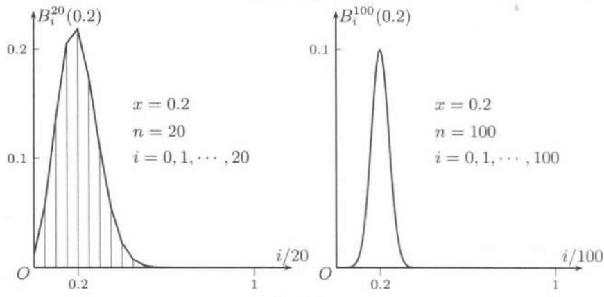
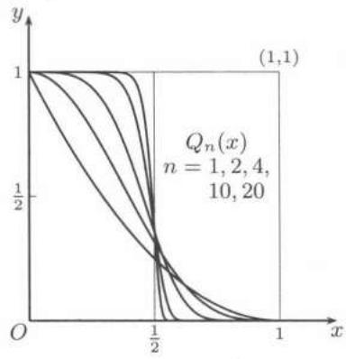

import Guide from '@/components/Guide.astro';
import Knowledge from '@/components/Knowledge.astro';
import Example from '@/components/Example.astro';
import Solution from '@/components/Solution.astro';
import Note from '@/components/Note.astro';
import Block from '@/components/Block.astro';
import Method from '@/components/Method.astro';

在一个区间上将一个函数展开为某种函数项级数是研究无穷级数的基本目的之一. 这样就有可能用比较简单的函数来逼近原来的函数. 因此, 这类函数项级数的通项应当尽可能简单. 幂级数的优点就在于此. 但是能够展开为幂级数的函数类太窄, 一个函数即使无限阶可微也还不能保证它能展开为幂级数, 而即使能展开的话, 收敛域也可能太小, 不能满足要求.

$Weierstrass$ 的连续函数逼近定理克服了所有这些困难. 这就是下面的 $Weierstrass$ 第一逼近定理和第二逼近定理.

<Knowledge title="命题 16.3.1 ($Weierstrass$ 多项式逼近定理)">
有界闭区间 $[a, b]$ 上的连续函数 $f$ 一定可以用多项式一致逼近到任意程度, 这就是说对于每个给定的 $\varepsilon > 0$ , 存在 $n = n(\varepsilon)$ 次多项式 $P_{n}$ , 使得 $|f(x) - P_{n}(x)| < \varepsilon$ 对于 $x \in [a, b]$ 同时成立.
</Knowledge>

<Knowledge title="命题 16.3.2 ($Weierstrass$ 三角多项式逼近定理)">
周期 $2\pi$ 的周期连续函数 $f$ 一定可以用三角多项式一致逼近到任意程度，这就是说对于每个给定的 $\varepsilon >0$ 存在三角多项式 $S_{n}(x) = a_{0} / 2 + \sum_{k = 1}^{n}(a_{k}\cos kx + b_{k}\sin kx)$ ，其中 $n = n(\varepsilon)$ ，使得 $|f(x) - S_n(x)| <   \varepsilon$ 对于一切 $x$ 成立.
</Knowledge>

<Note>
逼近定理的其他叙述方式可以是: 在第一逼近定理中, $f$ 是一致收敛的多项式序列的极限函数, 也是一致收敛的多项式级数的和函数; 在第二逼近定理中, $f$ 是一致收敛的三角多项式序列的极限函数, 也是一致收敛的三角多项式级数的和函数.
</Note>

毫无疑问, $Weierstrass$ 的逼近定理是数学分析中的头等重要的结果, 无论在理论上还是实际应用上都有重大的意义.

本节将对 $Weierstrass$ 逼近定理的证明方法作介绍, 然后以例题的形式举出它的几个应用.

## 16.3.1 核函数方法

在介绍 $Fourier$ 级数的第十五章中已经见到了 $Dirichlet$ 核与 $Fejér$ 核 (在其参考题中还有 $de la Vallée Poussin$ 核). 在 $Weierstrass$ 逼近定理的证明方法中, 很多都可以归入核函数方法之中.

<Knowledge title="定义">
设 $\Delta_{n}(x)$ 是在 $\mathbf{R}=(-\infty,+\infty)$ 上定义的以 $n$ 为参数的函数，且具有下列性质：

1. $\Delta_{n}(x)$ 为非负函数, 即 $\Delta_{n}(x) \geqslant 0, \forall x \in \mathbf{R};$

2. $\Delta_{n}(x)$ 在 $\mathbf{R}$ 上广义可积，且 $\int_{-\infty}^{+\infty}\Delta_n(x)\mathrm{d}x = 1;$

3. 对每个给定的 $\delta > 0$ ，成立 $\lim_{n \to \infty} \int_{-\delta}^{\delta} \Delta_n(x) \, \mathrm{d}x = 1$ ，这（在性质2成立时）等价于

$$
\lim _ {n \rightarrow \infty} \left(\int_ {- \infty} ^ {- \delta} + \int_ {\delta} ^ {+ \infty}\right) \Delta_ {n} (x) \mathrm{d} x = 0,
$$

则称 $\Delta_{n}(x)$ 为 (正) 核函数.

<Note>
由定义可见, 可以将核函数看成为一个函数列. 但我们经常将它看成是以 $n$ 为参数的函数 (或函数族). 实际上还可以定义带有连续参数的核函数. 在 $Fourier$ 级数一章中的 $Dirichlet$ 核与 $Fejér$ 核的性质与这里的条件有些差异. 首先, $Dirichlet$ 核不满足第一个条件, 即不是正核. 其次, 它们都是周期 $2\pi$ 的周期函数, 因此需要将后两个条件中的 $\mathbf{R}$ 改为长度为一个周期的闭区间 $[- \pi, \pi]$ .
</Note>

<Note>
这里需要强调指出，从15.2.1小节的 $Dirichlet$ 积分开始，所用的方法与第十四章中的对积分求极限的方法完全不同.实际上从 $Riemann$ 引理（上册313页）已经可以看到，当 $n$ （或其他参数)趋于无穷大时，在积分号下的表达式未必有极限, 然而积分作为 $n$ (或其他参数) 的函数仍可能存在极限. 这里当然不可能用交换极限顺序的方法来求极限.

对于核函数而言, 一般将 $n \to \infty$ 时核函数的极限函数称为 $Dirac$ (狄拉克) 的 $\delta$ -函数, 也就是广义函数. 从核函数的定义可知, 这里的极限过程与广义函数都不能按照极限和函数的通常意义来理解. 广义函数是泛函分析中的研究内容. 例如可参看 [54] 的第七章广义函数.
</Note>

<Note>
关于核函数方法(或奇异积分方法)在数学分析中的介绍可以参考[18]第三卷的740小节，[63]的卷2第17章§4和[13]的第5章等. 还可以参考[35]的第10章对于奇异积分的系统论述. 其中的记号和条件不尽相同.
</Note>
</Knowledge>

下面举出几个核函数的例子.

1. 定义阶梯函数 $\Delta_{n}(x)=\left\{\begin{aligned}&n,&-\frac{1}{2n}\leqslant x\leqslant\frac{1}{2n},\\ &0,& 其他 x,\end{aligned}\right.$ 则不难验证它满足核函数定义中的所有条件.

2. $Weierstrass$ 逼近定理的 $Landau$ 证明 (1908 年) 所用的核函数为

$$
\Delta_ {n} (x) = \left\{ \begin{array}{l l} \frac {1}{I _ {n}} (1 - x ^ {2}) ^ {n}, & | x | \leqslant 1, \\ 0, & | x | > 1, \end{array} \right.
$$

其中 $I_{n} = \int_{-1}^{1}(1 - x^{2})^{n}\mathrm{d}x.$ 这时核函数定义中的前两个条件显然满足.对于条件3，当 $0 < \delta < 1$ 时，从

$$
0 \leqslant \int_ {\delta} ^ {1} (1 - x ^ {2}) ^ {n} \mathrm{d} x \leqslant \int_ {\delta} ^ {1} (1 - \delta^ {2}) ^ {n} \mathrm{d} x = (1 - \delta^ {2}) ^ {n} (1 - \delta),
$$

以及对于 $I_{n}$ 的估计

$$
I _ {n} = \int_ {- 1} ^ {1} (1 - x ^ {2}) ^ {n} \mathrm{d} x > 2 \int_ {0} ^ {1} (1 - x) ^ {n} \mathrm{d} x = \frac {2}{n + 1},
$$

就知道

$$
0 \leqslant \left(\int_ {- \infty} ^ {- \delta} + \int_ {\delta} ^ {+ \infty}\right) \Delta_ {n} (x) \mathrm{d} x \leqslant (n + 1) (1 - \delta^ {2}) ^ {n} (1 - \delta),
$$

因此当 $n\to \infty$ 时极限为0.

3. 实际上构造核函数的一个很一般的方法是先在 $\mathbf{R}$ 上定义一个非负可积函数 $f(x)$ ，使它在某个区间 $[-a, a] (a > 0)$ 之外恒等于 0，但积分 $I = \int_{-a}^{a} f(x) \mathrm{d}x > 0$ ，然后令 $\Delta_n(x) = \frac{n}{I} f(nx)$ 即可.

核函数的作用在于它与另一个函数 $f$ 通过卷积运算得到的新的函数 $f * \Delta_{n}$ :

$$
(f * \Delta_ {n}) (x) = \int_ {- \infty} ^ {+ \infty} f (t) \Delta_ {n} (x - t) \mathrm{d} t = \int_ {- \infty} ^ {+ \infty} f (x - u) \Delta_ {n} (u) \mathrm{d} u.\tag{16.15}
$$

在数学文献中称这些积分为奇异积分.

对于上面的第一个例子的核函数, 这就是

$$
(f * \Delta_ {n}) (x) = n \int_ {x - 1 / 2 n} ^ {x + 1 / 2 n} f (t) \mathrm{d} t,
$$

也就是函数 $f$ 在区间 $[x - 1 / 2n, x + 1 / 2n]$ 上的积分平均值. 容易直接证明: 若 $f$ 于点 $x$ 连续, 则有

$$
\lim _ {n \rightarrow \infty} n \int_ {x - 1 / 2 n} ^ {x + 1 / 2 n} f (t) \mathrm{d} t = f (x).
$$

实际上这是下列命题的特例.

<Knowledge title="命题 16.3.3">
设 $f$ 是在 $\mathbf{R}$ 上定义而在某个区间 $[-a, a]$ 外恒等于 $0$ 的连续函数, $\Delta_{n}$ 是某个核函数, 则对于每个 $x$ 成立

$$
\lim _ {n \rightarrow \infty} (f * \Delta_ {n}) (x) = f (x),
$$

而且这个收敛过程在区间 $[-a, a]$ 上是一致的.

<Solution title="证明">
证 根据条件可知 $f$ 与 $\Delta_{n}$ 的卷积存在. 为方便起见记 $f * \Delta_{n} = f_{n}$ . 利用核函数定义中的条件2, 只需估计下列积分:

$$
f _ {n} (x) - f (x) = \int_ {- \infty} ^ {+ \infty} [ f (x - u) - f (x) ] \Delta_ {n} (u) \mathrm{d} u.
$$

对于每个给定的 $\varepsilon > 0$ ，在区间 $[-a - 1, a + 1]$ 上利用 $f$ 的一致连续性，存在 $0 < \delta < 1$ ，使得当 $x, x' \in [-a - 1, a + 1]$ ， $|x - x'| < \delta$ 时，有 $|f(x) - f(x')| < \varepsilon$ 。又设 $|f(x)| < M, \forall x \in \mathbf{R}$ 。于是从核函数条件1和3有

$$
\left| \int_ {- \infty} ^ {- \delta} + \int_ {\delta} ^ {+ \infty} [ f (x - u) - f (x) ] \Delta_ {n} (u) \mathrm{d} u \right| \leqslant 2 M \left| \int_ {- \infty} ^ {- \delta} + \int_ {\delta} ^ {+ \infty} \Delta_ {n} (u) \mathrm{d} u \right| = o (1),
$$

且与 $x$ 无关. 因此存在 $N$ , 使得当 $n > N$ 时左边的值小于 $\varepsilon$ .

在区间 $[- \delta, \delta]$ 上的估计如下：

$$
\begin{array}{r l} \left| \int_ {- \delta} ^ {\delta} [ f (x - u) - f (x) ] \Delta_ {n} (u) \mathrm{d} u \right| & \leqslant \int_ {- \delta} ^ {\delta} | f (x - u) - f (x) | \Delta_ {n} (u) \mathrm{d} u \\ & \leqslant \varepsilon \int_ {- \delta} ^ {\delta} \Delta_ {n} (u) \mathrm{d} u \leqslant \varepsilon . \end{array}
$$

注意这个估计对于 $x \in [-a, a]$ 一致. 于是当 $n > N$ 时就在 $[-a, a]$ 上一致成立所要的估计式:

$$
\left| f _ {n} (x) - f (x) \right| <   2 \varepsilon .
$$
</Solution>

<Note>
若取 $a = 1 / 2, \Delta_n$ 为 $Landau$ 的核函数，则 $f_{n}(x)$ 是次数不超过 $2n$ 的多项式，因此我们就已经对于命题中的连续函数证明了 $Weierstrass$ 第一逼近定理，即命题16.3.1.为了推广到定义在一般区间 $[a, b]$ 上的连续函数 $f$ ，则可以将 $f$ 先线性延拓到 $[a - 1, b + 1]$ ，使得 $f(a - 1) = f(b + 1) = 0$ ，然后作线性变换使区间$[a - 1, b + 1]$ 映射为某个区间 $[-c, c] (c > 0)$ , 这时 $f(-c) = f(c) = 0$ , 然后在该区间之外将 $f$ 作恒等于 $0$ 的延拓.
</Note>

<Note>
$Landau$ 证明在很多教科书中出现, 例如可以参看 [36, 57] 的不同论述.
</Note>
</Knowledge>

## 16.3.2 $Bernstein$ 证明的概率解释

目前许多教科书往往采取 $Bernstein$ 的方法来证明 $Weierstrass$ 逼近定理. 这个证明无疑具有一系列优点, 例如, 除了 $Cantor$ 的一致连续性定理之外, 可以不用微积分工具, 又能给出逼近多项式的显式表达式等等. 但是初学者往往难以明白它的思想从何而来. 因为 $Bernstein$ 是从概率论出发得到这个证明的 (1912). 下面我们不重复在许多教科书中关于 $Bernstein$ 证明的细节, 而是致力于用通俗的语言来阐明它的概率意义. 希望这些解释会对初学者有点启发作用.

首先，将证明的主要过程列出如下.

对于区间 $[0,1]$ 上的连续函数 $f$ 写出 $Bernstein$ 多项式

$$
B _ {n} (f) (x) = \sum_ {i = 0} ^ {n} f \left(\frac {i}{n}\right) \binom {n} {i} x ^ {i} (1 - x) ^ {n - i}, 0 \leqslant x \leqslant 1.\tag{16.16}
$$

这里可以将 $B_{n}$ 看成是带有参数 $n$ 的算子, 它作用于 $f$ 就得到一个多项式 $B_{n}(f)$ .

利用恒等式

$$
\sum_ {i = 0} ^ {n} \binom {n} {i} x ^ {i} (1 - x) ^ {n - i} = 1,\tag{16.17}
$$

就可以用拟合法得到:

$$
B _ {n} (f) (x) - f (x) = \sum_ {i = 0} ^ {n} \left[ f \left(\frac {i}{n}\right) - f (x) \right] \binom {n} {i} x ^ {i} (1 - x) ^ {n - i}.
$$

利用 $f$ 在 $[0,1]$ 上一致连续，对于每个给定的 $\varepsilon > 0$ ，存在 $\delta > 0$ ，使得当 $x, x' \in [0,1]$ ，且 $|x - x'| < \delta$ 时成立 $|f(x) - f(x')| < \varepsilon$ 。然后将上面的和式按照 $|x - i/n| < \delta$ 和 $|x - i/n| \geqslant \delta$ 分拆，即有

$$
\left| \sum_ {i = 0} ^ {n} \left[ f \left(\frac {i}{n}\right) - f (x) \right] \binom {n} {i} x ^ {i} (1 - x) ^ {n - i} \right| \leqslant \left| \sum_ {| x - \frac {i}{n} | <   \delta} \right| + \left| \sum_ {| x - \frac {i}{n} | \geqslant \delta} \right|.
$$

对于第一个和式利用一致连续性和(16.17)估计如下:

$$
\begin{array}{l} \left| \sum_ {| x - \frac {i}{n} | <   \delta} \left[ f \left(\frac {i}{n}\right) - f (x) \right] \binom {n} {i} x ^ {i} (1 - x) ^ {n - i} \right| \\ \leqslant \sum_ {| x - \frac {i}{n} | <   \delta} \left| f \left(\frac {i}{n}\right) - f (x) \right| \binom {n} {i} x ^ {i} (1 - x) ^ {n - i} \leqslant \varepsilon . \end{array}
$$

对第二个和式则需要用一个恒等式:

$$
\sum_ {i = 0} ^ {n} \left(\frac {i}{n} - x\right) ^ {2} \binom {n} {i} x ^ {i} (1 - x) ^ {n - i} = \frac {x (1 - x)}{n},\tag{16.18}
$$

又假设 $|f(x)| \leqslant M, \forall x \in [-1, 1]$ , 然后就不难证明存在 $N$ (这里的细节见收有这个证明的教科书), 使得当 $n > N$ 时第二个和式的绝对值也小于 $\varepsilon$ . 从而就在 $n > N$ 时得到所要的估计:

$$
\sup _ {x \in [ 0, 1 ]} \left\{\left| f (x) - B _ {n} (f) (x) \right| \right\} <   2 \varepsilon .
$$

现在我们从概率角度来解释以上过程。其中的有关知识可以在概率论的教科书中找到（例如[19]）。这里所用的概率模型是 $Bernoulli$ 的独立试验序列概型。其中设事件 $A$ 的概率为 $x \in [0,1]$ ，每一次试验只有两种结果，即 $A$ 出现，或者 $A$ 不出现。假设作 $n$ 次独立试验，于是其中事件 $A$ 出现 $i$ 次的概率就是

$$
B _ {i} ^ {n} (x) = \binom {n} {i} x ^ {i} (1 - x) ^ {n - i}.\tag{16.19}
$$

这里的组合数 $\binom{n}{i}$ 是在 $n$ 次试验中事件 $A$ 出现 $i$ 次的可能情况的个数.例如，在前 $i$ 次接连出现 $A$ 但以后就再不出现 $A$ 就是其中的可能情况之一.

这样就可以理解恒等式 (16.17) 是什么意思了. 它简单地说就是事件 $A$ 在 $n$ 次试验中出现 0 次, 1 次, 直到出现 $n$ 次的概率之和, 当然就等于 1.

下面的问题就是在估计 (16.16) 时为什么要将和式作分拆？又为什么要根据 $|x - i/n| < \delta$ 和 $|x - i/n| \geqslant \delta$ 来分拆？为此最好要观察概率 (16.19) 作为 $i$ 的函数的变化规律。在图 16.1 中取定 $x = 0.2$ 后对于 $n = 20$ 与 $n = 100$ 的两种情况作出示意图。在每张图中作出了坐标为 $(i/n, B_i^n(0.2)) (i = 0, 1, \cdots, n)$ 的 $n + 1$ 个点。

  
图16.1

从图上可以看出, 将点 $(i/n, B_{i}^{n}(0.2)) (i = 0, 1, \cdots, n)$ 相连得到的是一条单峰曲线, 它的最大值差不多就是 $i/n$ 与 $x = 0.2$ 最接近的地方. 这一点从概率角度是很直观的事实. 我们往往称 $i/n$ 为频率. 由于事件 $A$ 出现的概率是 $x = 0.2$, 平时我们就说成每 $5$ 次独立试验时事件 $A$ 出现 $1$ 次. 这当然不可能是完全准确的预言. 但是当试验次数 $n$ 越来越大时, 频率应当接近 $x = 0.2$. 这个直观的猜测在概率论中有理论上的证明, 这里从略.

对比图 16.1 的两种情况, 可以看出当 $n$ 从 $n = 20$ 增加到 $n = 100$ 时, 峰变得越来越窄. 这就是说当 $n$ 变大时, 频率 $i/n$ 越来越向概率值 $x = 0.2$ 靠拢. 这种现象在概率论中也有专门讨论.

此外, 还要注意恒等式 (16.18) 的概率意义是度量频率偏离概率的程度, 在概率论中称为方差. 这个恒等式可以用微分法或组合计算得到. 其右边的表达式表明当 $n$ 增大时方差是如何降低的.

最后, 将和式 (16.16) 分拆的处理表明, 在和式中第一个和式是提供接近 $f(x)$ 的主要部分, 原因就在于图 16.1 中的单峰现象. 而第二个和式则依赖于 (16.18) 来解决.

<Note>
虽然 $Bernstein$ 证明有着自己的特点，但从本质上说仍然可以归纳入核函数方法之内. 只不过代替卷积的是离散的和式(16.16). 核函数定义中的三个条件在这里都是满足的.
</Note>

<Note>
关于 $Bernstein$ 多项式在逼近理论中的地位, 以及由于 $Bézier$ (贝齐尔)方法的出现而得到新的发展等可以参看数学分析教科书[8]的第一册第5章. 此外, 对 $Weierstrass$ 逼近定理的 $Bernstein$ 证明并不一定要从概率角度来理解. $Korovkin$ (科罗夫金)的证明(1953)完全从函数论出发, 可以参考教科书[9].
</Note>

## 16.3.3 逼近定理的一个初等证明

这里所说的初等证明是指不必使用微积分工具, 同时其思路也比较简单.

这类证明已有多个. 这里介绍的是由 $H. Cohen$ (科恩) 给出的证明, 见 $Archiv der Mathematik$ (1964) 第 $15$ 卷 $316-317$ 页 (参见 [53]).

第一步是对于一个多项式序列的分析.

<Knowledge title="命题 16.3.4">
对于任意正数 $\delta \in \left(0, \frac{1}{2}\right)$ ，多项式序列 $Q_{n}(x) = (1 - x^{n})^{2^{n}} (n = 1, 2, \cdots)$ 在区间 $[0, \delta]$ 和 $[1 - \delta, 1]$ 上分别一致收敛于 $1$ 和 $0$.

<Solution title="证明">
证 在图 16.2 上作出了 $n = 1, 2, 4, 10, 20$ 的 $Q_{n}(x)$ 的图像. 容易证明

$$
\lim _ {n \to \infty} Q _ {n} \left(\frac {1}{2}\right) = \frac {1}{\mathrm{e}} \approx 0. 3 6 8.
$$

  
图16.2

以下的主要工具是 $Bernoulli$ 不等式(见上册第3页的命题1.3.1):

当 $h > -1, n \in \mathbf{N}_{+}$ 时，有

$$
(1 + h) ^ {n} \geqslant 1 + n h.
$$

容易看出 $Q_{n}(x)$ 在区间[0,1]上严格单调减少.在区间 $[0,\delta ]$ 上

$$
1 \geqslant Q _ {n} (x) \geqslant Q _ {n} (\delta) = (1 - \delta^ {n}) ^ {2 ^ {n}} \geqslant 1 - 2 ^ {n} \delta^ {n} = 1 - (2 \delta) ^ {n} \rightarrow 1.
$$

又记 $\eta = 1 - \delta > 1/2$ ，则在区间 $[\eta, 1]$ 上，有 $0 \leqslant Q_n(x) \leqslant Q_n(\eta)$ ，且有

$$
\frac {1}{Q _ {n} (\eta)} = \left(\frac {1}{1 - \eta^ {n}}\right) ^ {2 ^ {n}} = \left(1 + \frac {\eta^ {n}}{1 - \eta^ {n}}\right) ^ {2 ^ {n}} \geqslant 1 + \frac {2 ^ {n} \eta^ {n}}{1 - \eta^ {n}} > (2 \eta) ^ {n} \rightarrow + \infty .
$$

可见结论成立.
</Solution>
</Knowledge>

<Knowledge title="命题 16.3.5">
令 $P_{n}(x)=Q_{n}[(1-x)/2], n=1,2,\cdots$ ，则对于任意正数 $\delta\in(0,1)$ ，多项式序列 $\{P_{n}\}$ 在 $0<\delta\leqslant|x|\leqslant1$ 上一致收敛于单位跳跃函数（即 $Heaviside$ （赫维塞德）函数）

$$
H (x) = \left\{ \begin{array}{l l} 0, & x <   0, \\ 1, & x \geqslant 0. \end{array} \right.
$$
</Knowledge>

<Block title="第一逼近定理的证明">
设 $f \in C[0,1]$ ，且不妨设 $f(0) = 0$ 。对任意 $\varepsilon > 0$ ，利用关于一致连续性的 $Cantor$ 定理知，存在阶梯函数 $T(x)$ ，使得在区间 $[0,1]$ 上 $|f(x) - T(x)| < \varepsilon / 3$ 成立。利用上述 $Heaviside$ 函数，可以取 $T(x)$ 为

$$
T (x) = \sum_ {k = 1} ^ {n} s _ {k} H (x - x _ {k}),
$$

其中 $0 < x_{1} < \cdots < x_{n} < 1$ ，且 $|s_{k}| < \varepsilon/3, k = 1, 2, \cdots, n.$

现在取 $\delta > 0$ 充分小, 使得所有区间 $(x_{k} - \delta, x_{k} + \delta) (k = 1, 2, \cdots, n)$ 均不相交. 然后对于这个 $\delta > 0$ , 根据命题 16.3.5, 存在充分大的 $n$ , 使得成立

$$
\left| P _ {n} (x) - H (x) \right| <   \frac {\varepsilon}{3 s}, \forall 0 <   \delta \leqslant | x | \leqslant 1,
$$

其中 $s = \sum_{k=1}^{n}|s_k|$ . 此外还要注意 $P_n(x)$ 的取值范围必在 $0$ 和 $1$ 之间.

现在构造多项式

$$
P (x) = \sum_ {k = 1} ^ {n} s _ {k} P _ {n} (x - x _ {k}),
$$

则当 $x$ 属于某个区间 $(x_{i} - \delta ,x_{i} + \delta)$ （ $1\leqslant i\leqslant n$ ）时，就有

$$
\begin{array}{l} | T (x) - P (x) | \leqslant \sum_ {k \neq i} | s _ {k} | \cdot | H (x - x _ {k}) - P _ {n} (x - x _ {k}) | + | s _ {i} | \cdot | H (x - x _ {i}) - P _ {n} (x - x _ {i}) | \\ <   s \cdot \frac {\varepsilon}{3 s} + | s _ {i} | \cdot 1 <   \frac {2 \varepsilon}{3}; \end{array}
$$

而当 $x$ 不属于任何 $(x_{k}-\delta, x_{k}+\delta)$ $(k=1,2,\cdots,n)$ 时，则上述不等式右边只有一项，估计更为简单，即小于 $\varepsilon/3$ .

因此就得到

$$
| f (x) - P (x) | \leqslant | f (x) - T (x) | + | T (x) - P (x) | <   \varepsilon .
$$
</Block>

## 16.3.4 逼近定理的其他证明

$Weierstrass$ 逼近定理的证法很多, 在这里我们将浏览一下其他证明.

首先需要指出两个逼近定理是等价的, 即从其中之一可以推出另一个成立. 有兴趣的读者可以参考 [1, 35, 47] 等著作中关于等价性的证明, 这里从略.

在第十五章已经用两种方法证明了命题 16.3.2, 即第二逼近定理. 第一种方法是用 $Fejér$ 核 (见命题 15.2.4 的注 2), 第二种方法是用 $Fourier$ 级数的一致收敛定理 (见命题 15.2.8 的注). 此外, 还有在该章参考题 19 中的 $de la Vallée Poussin$ 的证明, 它也是一种核方法 (参见 [44] 卷 2).

此外, 虽然我们在前面强调了核函数方法的价值, 但是从上一小节的证明已经知道, 逼近定理有不用核函数方法的初等证明.

对于第一逼近定理, 这里较为常见的不用核函数的方法是由 $Lebesgue$ 给出的. 其基本思路非常直观. 先用分段线性函数来逼近连续函数, 然后证明可以将分段线性函数用函数 $f(x) = |x|$ 的平移和 $x$ 的线性组合得到. 从而最后问题归结为证明在任意区间 $[a, b]$ 上存在多项式一致逼近 $y = |x|$ . 这里我们见到的至少有三种方法. 第一种方法是利用在例题 14.1.9 介绍的 $Visser$ 定理, 它利用迭代方法得到了在 $[-1, 1]$ 上一致收敛于 $|x|$ 的多项式序列, 而无需微积分工具. 第二种方法是在 $(1 + x)^{1/2}$ 的 $Maclaurin$ 展开式中将 $x$ 用 $x^2 - 1$ 代替得到所要的多项式级数展开式. 读者可以在 [31, 34, 47] 找到详细的证明过程. 第三种方法是先证明函数列

$$
f _ {n} (x) = \frac {\int_ {0} ^ {x} (1 - t ^ {2}) ^ {n} \mathrm{d} t}{\int_ {0} ^ {1} (1 - t ^ {2}) ^ {n} \mathrm{d} t}, n = 1, 2, \dots\tag{16.20}
$$

对于每个给定的 $\varepsilon \in (0,1)$ ，在区间 $[-1, -\varepsilon]$ 上和 $[\varepsilon, 1]$ 上一致收敛于 $\operatorname{sgn} x$① ，然后不难证明函数列

$$
g _ {n} (x) = \int_ {0} ^ {x} f _ {n} (t) \mathrm{d} t, n = 1, 2, \dots
$$

在 $[-1,1]$ 上一致收敛于 $|x|$ (参见 [7]).

最后还应当指出, $Weierstrass$ 逼近定理有许多推广. $Weierstrass$ 本人已经得到高维空间的逼近定理. 最有意义的推广是 $Stone$ (斯通)-$Weierstrass$ 定理, 它包含了许多逼近定理为其特例, 已经成为现代分析的理论支柱之一. 读者可以参考在 [14, 47] 中的证明, 其中后者给出了 $Weierstrass$ 逼近定理的 $Stone$ 证明, 它可以几乎不加修改地用于证明 $Stone$ 定理.

## 16.3.5 逼近定理的应用举例

在举具体例题前需要指出 $Weierstrass$ 逼近定理对于一些基本问题的启示.

首先, 在闭区间上的每个连续函数都有用多项式级数或者三角多项式级数的解析表达式, 而不需要任何其他条件. 因此连续函数与我们过去已经熟悉的可以展开为幂级数的许多初等函数具有共同点: 即都可以展开为函数项级数, 而且不需要增加其他条件.

有了逼近定理, 又可以将连续函数与能够展开为幂级数的函数非常清楚地区分开来. 我们已经知道, 要将一个函数展开为幂级数, 至少要求该函数无限次可导, 而且这还不是充分的. 一般称这类函数为实解析函数.

如何求出逼近定理中的逼近多项式或三角多项式当然是很重要的问题. 这是函数逼近论的研究课题. $Weierstrass$ 逼近定理就是逼近论的最重要的起点.

下面只是逼近定理在数学分析中的几个应用, 希望起到抛砖引玉的作用.

<Example title="例题 16.3.1 ($Lebesgue$)">
证明: 区间上的连续函数必有原函数.

<Solution title="证明">
证 设 $f \in C[a, b]$ , 则根据逼近定理知, 存在多项式序列 $\{P_n\}$ 于区间 $[a, b]$ 上一致收敛于 $f$ .

对每个多项式 $P_{n}$ , 存在多项式 $Q_{n}$ , 使得在 $[a, b]$ 上满足 $Q_{n}^{\prime} = P_{n}$ . 同时总可以令 $Q_{n}(a) = 0$ 成立. 这样就得到多项式序列 $\{Q_{n}\}$ .

以下分两步, 先证明 $\{Q_n\}$ 在 $[a, b]$ 上一致收敛, 然后证明其极限函数的导函数就是 $f$ .

(1) 根据 $\{P_n\}$ 于 $[a, b]$ 上一致收敛, 由 $Cauchy$ 一致收敛准则 (的必要性) 知道, 对于每个 $\varepsilon > 0$ , 存在 $N$ , 使得对于每个 $n \geqslant N$ 和正整数 $p$ , 对每个 $x \in [a, b]$ 同时成立

$$
\left| P _ {n + p} (x) - P _ {n} (x) \right| <   \varepsilon .\tag{16.21}
$$

于是可以在区间 $[a, x]$ 上用 $Lagrange$ 微分中值定理得到

$$
\begin{array}{r l} | Q _ {n + p} (x) - Q _ {n} (x) | & = | [ Q _ {n + p} (x) - Q _ {n} (x) ] - [ Q _ {n + p} (a) - Q _ {n} (a) ] | \\ & = | P _ {n + p} (\xi) - P _ {n} (\xi) | <   \varepsilon . \end{array}
$$

由于这对于所有 $n \geqslant N$ 和正整数 $p$ 以及所有 $x \in [a, b]$ 都成立，再次使用 $Cauchy$ 一致收敛准则（的充分性），就知道 $\{Q_n\}$ 于 $[a, b]$ 一致收敛。记其极限函数为 $F$ 。它满足条件 $F(a) = 0$ 。

(2) 为了建立 $F' = f$ ，只需对于每个点 $x_0 \in [a, b]$ 和每个给定的 $\varepsilon > 0$ ，证明存在 $\delta > 0$ ，使得当 $0 < |h| < \delta$ 时，成立关于差商的不等式

$$
\left| \frac {F (x _ {0} + h) - F (x _ {0})}{h} - f (x _ {0}) \right| <   3 \varepsilon .\tag{16.22}
$$

这里当然假设 $x_0 + h \in [a, b]$ .

利用三分法可以将(16.22)的左边分拆成

$$
\begin{array}{l} \left| \frac {F (x _ {0} + h) - F (x _ {0})}{h} - f (x _ {0}) \right| \leqslant \left| \frac {Q _ {n} (x _ {0} + h) - Q _ {n} (x _ {0})}{h} - P _ {n} (x _ {0}) \right| \\ + | f (x _ {0}) - P _ {n} (x _ {0}) | + \left| \frac {F (x _ {0} + h) - Q _ {n} (x _ {0} + h) - F (x _ {0}) + Q _ {n} (x _ {0})}{h} \right|. \end{array}\tag{16.23}
$$

首先, 对于 $\varepsilon > 0$ , 存在 $N$ , 当 $n \geqslant N$ 时有 $|f(x_0) - P_n(x_0)| < \varepsilon$ . 又不妨 $N$ 已经足够大, 使得对 $n \geqslant N$ , 对每个正整数 $p$ 和每个 $x \in [a, b]$ , 不等式 (16.21) 也已经成立. 然后在 (16.23) 右边取定 $n = N$ .

对固定的 $n = N$ ，对于(16.23)右边的第一项用微分中值定理得到

$$
\left| \frac {Q _ {N} (x _ {0} + h) - Q _ {N} (x _ {0})}{h} - P _ {N} (x _ {0}) \right| = | P _ {N} (x _ {0} + \theta h) - P _ {N} (x _ {0}) |,
$$

其中 $0 < \theta < 1$ . 利用 $P_{N}(x)$ 在 $[a, b]$ 上的一致连续性, 存在 $\delta > 0$ , 使得当 $|h| < \delta$ 时, 上式右边小于 $\varepsilon/3$ .

为估计(16.23)右边的第三项, 先对下列不等式的分子用微分中值定理, 得到

$$
\begin{array}{l} \left| \frac {[ Q _ {N + p} (x _ {0} + h) - Q _ {N} (x _ {0} + h) ] - [ Q _ {N + p} (x _ {0}) - Q _ {N} (x _ {0}) ]}{h} \right| \\ \leqslant | P _ {N + p} (x + \theta h) - P _ {N} (x + \theta h) | <   \frac {\varepsilon}{3}, \end{array}
$$

其中 $p$ 为任意正整数, $0 < \theta < 1$ , 并利用在 $[a, b]$ 一致成立的不等式 (16.21). 最后, 在上式左边令 $p \to \infty$ , 就知道 (16.23) 右边第三项不超过 $\varepsilon$ , 因此所求证的不等式 (16.22) 成立. ☐
</Solution>

<Note>
这个证明的意义在于, 连续函数的原函数的存在性完全不需要定积分概念就可以建立. 以上证明是依据 [31] 中的叙述作了改写. (参见按照传统思路安排下的命题 10.3.3.)
</Note>
</Example>

在 $Fourier$ 级数的收敛性理论中最重要的工具是 $Riemann$ 引理（见例题10.2.6).由于在大多数教科书中均有该引理的证明，因此本书在前面对它未作证明.下面是用 $Weierstrass$ 逼近定理的一个证明

<Example title="例题 16.3.2 ($Riemann$ 引理)">
设 $f\in R[a,b]$ ，则

$$
\lim _ {p \rightarrow + \infty} \int_ {a} ^ {b} f (x) \sin p x \mathrm{d} x = 0, \quad \lim _ {p \rightarrow + \infty} \int_ {a} ^ {b} f (x) \cos p x \mathrm{d} x = 0.
$$

<Solution title="证明">
证 只证第一个即可. 对于可积函数 $f$ 与每个给定的 $\varepsilon > 0$ , 存在连续函数 $g \in C[a, b]$ , 使得

$$
\int_ {a} ^ {b} | f (x) - g (x) | \mathrm{d} x <   \varepsilon
$$

(见上册第十章第一组参考题 5).

根据逼近定理, 对于 $g$ 存在于 $[a, b]$ 上一致逼近 $g$ 的多项式 $P$ , 满足

$$
\int_ {a} ^ {b} | g (x) - P (x) | \mathrm{d} x <   \varepsilon .
$$

因此就有

$$
\int_ {a} ^ {b} | f (x) - P (x) | \mathrm{d} x \leqslant \int_ {a} ^ {b} | f (x) - g (x) | \mathrm{d} x + \int_ {a} ^ {b} | g (x) - P (x) | \mathrm{d} x <   2 \varepsilon .
$$

然后从

$$
\begin{array}{r l} \left| \int_ {a} ^ {b} f (x) \sin p x \mathrm{d} x \right| & \leqslant \left| \int_ {a} ^ {b} [ f (x) - P (x) ] \sin p x \mathrm{d} x \right| + \left| \int_ {a} ^ {b} P (x) \sin p x \mathrm{d} x \right| \\ & \leqslant \int_ {a} ^ {b} | f (x) - P (x) | \mathrm{d} x + \left| \int_ {a} ^ {b} P (x) \sin p x \mathrm{d} x \right| \end{array}
$$

可见, 只需要对于多项式证明引理的结论就够了. 然而对于连续可微函数的 $Riemann$ 引理的证明特别容易, 只需要用分部积分法即可, 以下从略. □
</Solution>
</Example>

## 16.3.6 练习题

1. 设 $f$ 在 $[a, b]$ 上有定义，且对每个 $\varepsilon > 0$ ，存在多项式 $P$ ，使得满足条件 $|f(x) - P(x)| < \varepsilon, \forall x \in [a, b]$ ，证明： $f \in C[a, b]$ .

2. 设 $f \in C[a, b]$ , 证明:

(1) $f$ 可以在 $[a, b]$ 上展开为一致收敛的多项式级数，且在级数中除第一项之外均为在 $[a, b]$ 上非负的多项式；

(2) $f$ 可以在 $[a, b]$ 上展开为绝对一致收敛的多项式级数;

(3) 对于给定的收敛正项级数 $\sum_{n=1}^{\infty}a_{n}$ ，其中有无限多项大于 $0$，存在于区间 $[a,b]$ 上一致收敛于 $f$ 的多项式级数 $\sum_{n=1}^{\infty}P_{n}(x)$ ，使满足条件 $\sup_{x\in[a,b]}\{|P_{n}(x)|\}\leqslant a_{n},\forall n=1,2,\cdots.$

3. 设 $f \in R[a, b]$ , 则对于每个 $\varepsilon > 0$ , 存在两个多项式 $p(x)$ 和 $P(x)$ , 使得满足条件: (1) $p(x) \leqslant f(x) \leqslant P(x), \forall x \in [a, b]$ ; (2) $\int_{a}^{b} [P(x) - p(x)] \mathrm{d}x < \varepsilon$ .

4. 设 $f \in C[a, b]$ ，且对每个非负整数 $n$ 满足条件 $\int_{a}^{b} x^{n} f(x) \, \mathrm{d}x = 0$ ，证明： $f$ 为恒等于 $0$ 的常值函数。又若条件改为对于大于某个正整数 $n_0$ 的所有 $n$ 成立，则也有相同结论。

5. (1) 设 $f \in C[-1, 1]$ , 且对每个非负整数 $n$ 满足条件 $\int_{-1}^{1} x^{2n} f(x) \, \mathrm{d}x = 0$ , 则 $f$ 必为奇函数;

(2) 设 $f \in C[-1,1]$ ，且对每个非负整数 $n$ 满足条件 $\int_{-1}^{1} x^{2n+1} f(x) \, \mathrm{d}x = 0$ ，则 $f$ 必为偶函数.

6. 设 $f \in C[0,1]$ ，证明：存在每项为奇次项的多项式序列在 $[0,1]$ 上一致收敛于 $f$ 的充分必要条件为 $f(0) = 0$ .

7. 设 $f \in R[a, b]$ ，且对每个非负整数 $n$ 满足条件 $\int_{a}^{b} x^{n} f(x) \, \mathrm{d}x = 0$ ，证明： $f$ 在每个连续点上等于 $0$.

8. 设函数 $f$ 在区间 $(- \infty, + \infty)$ 上可以展开为一致收敛的多项式级数，证明： $f$ 本身必是多项式。（这断定了 $Weierstrass$ 定理不可能不作改变而推广到无限区间上去。）
