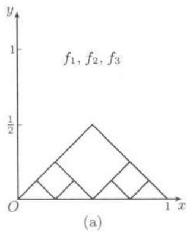
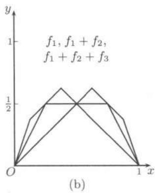
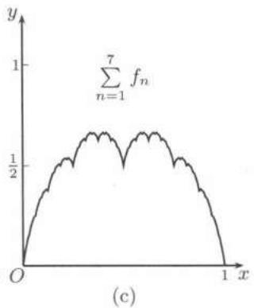

import Guide from '@/components/Guide.astro';
import Knowledge from '@/components/Knowledge.astro';
import Example from '@/components/Example.astro';
import Solution from '@/components/Solution.astro';
import Note from '@/components/Note.astro';
import Block from '@/components/Block.astro';
import Method from '@/components/Method.astro';

无穷级数不仅是研究函数的工具, 而且可以用于构造出具有各种特殊性质的函数, 其中有不少例子在数学发展史上起了重要的作用.

这里应当指出, 认为这些“病态”函数只是用作反例而没有其他意义的观点早已过时. 与 §5.6 介绍的混沌几乎同时发展起来的另一个新的非线性科学领域是“分形”(fractal), 其中的主要角色就是包括本节内容在内的各种“怪物”. 对此有兴趣的读者可以参考 [32, 20].

## 16.4.1 处处连续处处不可微的函数

在很长时间内人们对于连续性与可微性之间的关系不清楚, 许多人猜测连续函数只会在个别点或很少的点上不可微. 由于举出了处处连续处处不可微函数的例子, 这个问题得到了彻底解决.

这类例子最早出现在 $Bolzano$ 的 1830 年的手稿中, 但只有曲线, 并无解析表达式, 也没有证明 (见 [15]). 正式发表并有严格证明的第一个例子则属于 $Weierstrass$ (1872 年) (可参考 [15, 26, 29] 等).

$Weierstrass$ 函数是一个缺项 $Fourier$ 级数:

$$
F (x) = \sum_ {n = 1} ^ {\infty} a ^ {n} \sin (b ^ {n} \pi x),
$$

其中 $b$ 为奇数, $0 < a < 1$ , 且 $ab > 1 + \frac{3\pi}{2}$ . 由于右边的级数一致收敛, 因此函数 $F$ 的连续性是明显的. 关于 $F$ 处处不可微的证明可以在 [51, 29] 中找到.

目前教科书中在介绍处处连续处处不可微函数时一般均用 $van der Waerden$ (范德瓦尔登) 于 1930 年提出的例子. 它在几何上相当直观, 证明也比较简单. 下面的证明可能比 [18] 第二卷的 444 小节更简单一些. 主要工具是利用关于差商的一个简单命题①: 若函数 $f$ 于点 $x_0$ 可导, 且 $\{[a_n, b_n]\}$ 是以点 $x_0$ 为惟一公共点的闭

区间套，则就有

$$
\lim _ {n \rightarrow \infty} \frac {f (b _ {n}) - f (a _ {n})}{b _ {n} - a _ {n}} = f ^ {\prime} (x _ {0}).\tag{16.24}
$$

与 $Weierstrass$ 函数类似, $van der Waerden$ 函数是用无穷级数来构造的. 现在按照下列步骤定义这个无穷级数的通项 $\{f_n\}$ :

1. 将区间 $[-1,1]$ 上的函数 $f(x)=|x|$ 按周期 $2$ 延拓成为 $(-∞,+∞)$ 上的周期连续函数，仍记为 $f$.

2. 以 $f$ 为模板构造函数列 $\{f_{n}\}$ :

$$
f _ {n} (x) = \frac {1}{2 ^ {n}} f (2 ^ {n} x), n = 1, 2, \dots , x \in (- \infty , + \infty).\tag{16.25}
$$

可以看出 $f_{n}$ 为周期 $\frac{1}{2^{n-1}}$ 的连续周期函数, 且有 $0 \leqslant f_{n}(x) \leqslant \frac{1}{2^{n}}$ . 还可看出 $f_{n}$ 的极值点等距分布, 相邻极值点之间的距离也是 $\frac{1}{2^{n}}$ .

3. 重要的是 $f_{n}$ 与 $f_{n + 1}$ 之间有如下的关系：

(1) $f_{n}$ 的极值点必是 $f_{n + 1}$ 的零点，

(2) $f_{n + 1}$ 的任意两个相邻极值点必落在 $f_{n}$ 为线性的一个子区间内.

4. 对任意正整数 $n$ , 设 $a_{n}, b_{n}$ 为 $f_{n}$ 的任意两个相邻的极值点, 则

(1) $k > n$ 时, 由3.(1)知 $a_{n}, b_{n}$ 为 $f_{k}$ 的零点, 因此

$$
\frac {f _ {k} (a _ {n}) - f _ {k} (b _ {n})}{a _ {n} - b _ {n}} = 0.\tag{16.26}
$$

(2) $k \leqslant n$ 时, 由3.(2)知

$$
\frac {f _ {k} (a _ {n}) - f _ {k} (b _ {n})}{a _ {n} - b _ {n}} = 1 \text {或} - 1.\tag{16.27}
$$

以上关于 $\{f_n\}$ 的性质非常直观，读者可以对照图16.3(a)中对于 $f_{1}, f_{2}, f_{3}$ 在区间[0,1]上的曲线段来理解这些性质

现在定义 $van der Waerden$ 函数如下:

$$
W (x) = \sum_ {n = 1} ^ {\infty} f _ {n} (x), x \in (- \infty , + \infty).\tag{16.28}
$$

从 $|f_n(x)| \leqslant \frac{1}{2^n}$ 可知 $(16.28)$ 右边的函数项级数一致收敛, 因此和函数 $W(x)$ 在 $(- \infty, +\infty)$ 内处处连续. 最后, 我们来证明:

<Knowledge title="命题 16.4.1">
连续函数 $W$ 在 $(-\infty,+\infty)$ 内处处不可导.

<Solution title="证明">
证 对任意指定的点 $x_0$ ，由$(16.24)$可知，只要能找到以 $x_0$ 为惟一公共点的闭区间套 $\{[a_n, b_n]\}$ ，使得极限

$$
\lim _ {n \rightarrow \infty} \frac {W (b _ {n}) - W (a _ {n})}{b _ {n} - a _ {n}}
$$

不存在即可.

利用 $f_{n}$ 的极值点等距分布，且相邻极值点的距离为 $1 / 2^{n}$ ，取 $a_{n}$ 和 $b_{n}$ 为 $f_{n}$ 的两个极值点，满足条件：(1) $a_{n} \leqslant x_{0} \leqslant b_{n}$ ，(2) $b_{n} - a_{n} = \frac{1}{2^{n}}$ .

记 $d_{n}=\frac{W(b_{n})-W(a_{n})}{b_{n}-a_{n}},\quad n=1,2,\cdots,$ 则

$$
d _ {n} = \frac {1}{b _ {n} - a _ {n}} \left(\sum_ {k = 1} ^ {\infty} f _ {k} (b _ {n}) - \sum_ {k = 1} ^ {\infty} f _ {k} (a _ {n})\right) = \sum_ {k = 1} ^ {\infty} \frac {f _ {k} (b _ {n}) - f _ {k} (a _ {n})}{b _ {n} - a _ {n}}.
$$

由式$(16.26)$知上式右边和式中的项当k>n时均为0,因此有

$$
d _ {n} = \sum_ {k = 1} ^ {n} \frac {f _ {k} (b _ {n}) - f _ {k} (a _ {n})}{b _ {n} - a _ {n}}.
$$

由式$(16.27)$知上式右边和式的每一项为-1或1.因此当 $n$ 为偶数时 $d_{n}$ 为偶整数，而当 $n$ 为奇数时 $d_{n}$ 为奇整数．由此可见这样的数列 $\{d_n\}$ 一定发散，从而函数 $W$ 在点 $x_0$ 处不可导. □
</Solution>
</Knowledge>

  
图16.3

<Note>
注1 在图16.3(b),(c)中分别作出了$(16.28)$右边级数的前3个和第7个部分和函数,后者与 $W(x)$ 已很接近.读者可以结合证明来理解$van der Waerden$函数处处不可导的直观原因.在[18]等著作中一般是证明两个单侧导数都不存在,讨论比这里要更细致一点.此外,在定义 $f_{n}$ 的公式$(16.25)$中的比例因子 $2^{n}$ 改为 $4^{n}$ 或 $10^{n}$ 都是可以的.在[15]中的证明则完全不依赖于几何直观,也可供参考.
</Note>

<Note>
注 2 这方面的工作很多, 较近的成果见《美国数学月刊》(2002) 第 109 卷 378-380 页上的一文及其中的文献.
</Note>

## 16.4.2 填满正方形的连续曲线

$Cantor$ 首先证明: 直线上的所有点全体和平面上的所有点全体之间存在一一对应. 同样在区间 $[0,1]$ 内的所有点全体和单位正方形 $[0,1;0,1]$ 内的所有点全体之间也存在一一对应.

填满正方形的连续曲线就是将区间 $[0,1]$ 连续映射到单位正方形的满射. $Peano$在1890年第一次构造出了这样的例子. 此后人们经常将这类曲线称为

$Peano$ 曲线. 它使我们对于如何合理定义曲线的概念起了重要的推动作用 (参见 [5, 31]). 这里要注意, $Peano$ 曲线一定有自交点. 这是因为在 $[0, 1]$ 和 $[0, 1; 0, 1]$ 之间的一一映射不可能是连续的.

下面这个例子是 1938 年由 $Schoenberg$ (舍恩贝格) 作出的. 显然, 这样的曲线需要用参数方程

$$
x = x (t), y = y (t), x \in [ 0, 1 ]
$$

来表示. 定义

$$
\varphi (t) = \left\{ \begin{array}{l l} 0, & t \in [ 0, 1 / 3 ], \\ 3 t - 1, & t \in (1 / 3, 2 / 3 ], \\ 1, & t \in (2 / 3, 1 ]. \end{array} \right.
$$

按照

$$
\varphi (t) = \varphi (- t), \varphi (t + 2) = \varphi (t), t \in (- \infty , + \infty)
$$

将 $\varphi(t)$ 延拓到 $(- \infty, + \infty)$ 上，再令

$$
x (t) = \sum_ {n = 1} ^ {\infty} \frac {\varphi \left(3 ^ {2 n - 2} t\right)}{2 ^ {n}}, y (t) = \sum_ {n = 1} ^ {\infty} \frac {\varphi \left(3 ^ {2 n - 1} t\right)}{2 ^ {n}}, t \in [ 0, 1 ].
$$

这就是所要作的曲线. 将正方形 $[0,1;0,1]$ 中每个点的坐标 $(x,y)$ 用二进制展开就不难证明存在 $t\in [0,1]$ , 使得 $x(t) = x, y(t) = y$ (可以参看[8,15]等).
