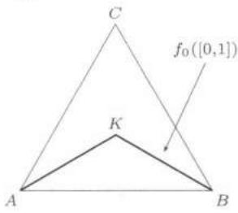
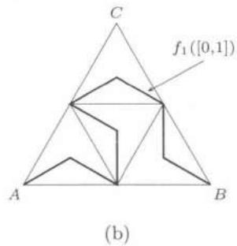
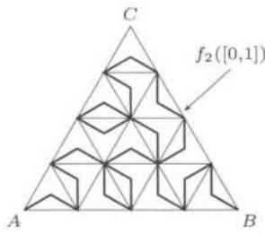

import Guide from '@/components/Guide.astro';
import Knowledge from '@/components/Knowledge.astro';
import Example from '@/components/Example.astro';
import Solution from '@/components/Solution.astro';
import Note from '@/components/Note.astro';
import Block from '@/components/Block.astro';
import Method from '@/components/Method.astro';

## $18.3.1$ 学习要点

$1$. 学生在学习多元函数极限与连续性时, 面临着两个任务: 一方面要复习, 巩固以前学到的 $\varepsilon - \delta$ 方法, 这是数学分析的基本功; 另一方面, 多元函数的情况更为复杂, 有许多新的问题产生, 如何对以前的方法进行调整, 有哪些新的注意事项, 都要一一弄清. 为此, 要十分注意习题课内容的条理性.

$2$. 例子在这一章的学习中有着十分重要的地位。学生首先是模仿，然后自己要能举出一些说明问题的反例。比如，针对重极限与累次极限的关系、多元函数连续与一元函数连续的相同点与不同点的一些例子。

$3$. 对习题课的建议

($1$) 关于求极限. 极坐标变换是讨论二元函数极限的有效手段, 学生们很喜欢用, 但在使用时必须小心. 例如

$$
f (x, y) = \frac {x ^ {2} y}{x ^ {4} + y ^ {2}}, \quad (x, y) \neq (0, 0)
$$

的极限 $\lim_{(x,y)\to (0,0)}f(x,y)$ 不存在，但如果用极坐标变换，则

$$
f (x, y) = \frac {r \cos^ {2} \theta \sin \theta}{r ^ {2} \cos^ {4} \theta + \sin^ {2} \theta} \to 0, \quad \text {如果}   \theta \neq 0, \pi ;
$$

而当 $\theta = 0, \pi$ 时， $y = 0$ ，故 $f(x, y) = 0$ ，因此容易误认为 $\lim_{(x, y) \to (0, 0)} f(x, y) = 0$ 。产生错误的原因在于忽视了用极坐标变换计算二元函数极限时，要求极限过程对 $\theta \in [0, 2\pi)$ 一致地成立。而上述计算中极限过程与 $\theta$ 有关。事实上，如果我们选择一条特殊的趋于原点的曲线

$$
L = \{(r, \theta) \mid \sin \theta = r \cos^ {2} \theta \},
$$

则

$$
f (x, y) | _ {L} = \frac {r \cos^ {2} \theta \sin \theta}{r ^ {2} \cos^ {4} \theta + \sin^ {2} \theta} \Big | _ {L} = \frac {1}{2},
$$

从而二元函数极限不存在.

($2$) 关于连续性. 在证明函数 $f(x, y)$ 在点 $(x_0, y_0)$ 连续时, 如果需要的话, 学生们都会将 $f(x, y) - f(x_0, y_0)$ 写为

$$
f (x, y) - f \left(x _ {0}, y _ {0}\right) = \left[ f (x, y) - f \left(x _ {0}, y\right) \right] + \left[ f \left(x _ {0}, y\right) - f \left(x _ {0}, y _ {0}\right) \right].
$$

但经常会犯的错误是，由 $f$ 对 $x$ 的连续性得出 $\forall \varepsilon > 0, \exists \delta > 0,$ 当 $|x - x_0| < \delta$ 时

$$
\left| f (x, y) - f \left(x _ {0}, y\right) \right| <   \frac {\varepsilon}{2}.
$$

要提醒他们, 对每一个 $y$ , $f(x,y)$ 是一个关于 $x$ 的一元函数, 但含有 $y$ . 因此 $f(x,y)$ 是一族含参数 $y$ 的关于 $x$ 的一元函数, 所以上述 $\delta$ 应该与 $y$ 有关. 这还不是我们在二元连续时需要的 $\delta$ .

可以要求学生总结一下: 如果一个二元函数对每个变元分别连续, 还须加何种条件才可保证二元函数连续 (结合例题 $18.2.2$). 这个问题可以作为习题课上进一步深入的一个内容.

## $18.3.2$ 参考题

<Block title="第一组参考题">

$1$. 设 $f(x, y)$ 关于 $x$ 在 $[a, b]$ 上连续，且关于 $y$ 单调增加。如果有

$$
\lim _ {y \rightarrow d ^ {-}} f (x, y) = f (x, d), x \in [ a, b ],
$$

证明：这一收敛关于 $x \in [a, b]$ 是一致的，即 $\forall \varepsilon > 0$ ，存在 $\delta > 0$ ，当 $0 < d - y < \delta$ 时，对所有的 $x \in [a, b]$ ，都有

$$
\left| f (x, y) - f (x, d) \right| <   \varepsilon .
$$

$2$. 设 $f$ 在 $[a, b] \times [a, b]$ 上连续, 定义

$$
\varphi (x) = \max _ {a \leqslant \xi \leqslant x} \left\{\max _ {a \leqslant y \leqslant \xi} \{f (\xi , y) \} \right\},
$$

证明： $\varphi(x)$ 在 $[a,b]$ 上连续.

$3$. 设 $D$ 是 $\mathbf{R}^n$ 的紧子集, $f$ 为定义在 $D$ 上的函数, 证明: $f$ 在 $D$ 上连续的充分必要条件是下列集合

$$
\{(x, y) \in \mathbf {R} ^ {n + 1} \mid y = f (x), x \in D \}
$$

是 $R^{n+1}$ 中的紧集.

$4$. 设 $f_{1}, f_{2}, \cdots, f_{n}$ 是 [0,1] 上的 n 个连续函数，称 $f_{1}, f_{2}, \cdots, f_{n}$ 在 [0,1] 上线性相关，若存在不全为零的常数 $c_{1}, c_{2}, \cdots, c_{n}$ ，使得

$$
\sum_ {j = 1} ^ {n} c _ {j} f _ {j} (x) \equiv 0, x \in [ 0, 1 ].
$$

证明： $f_{1},f_{2},\cdots,f_{n}$ 在 [0,1] 上线性相关的充分必要条件是

$$
\det \left(\left[ \int_ {0} ^ {1} f _ {i} (x) f _ {j} (x) \mathrm{d} x \right] _ {n \times n}\right) = 0,
$$

其中 $\det(A)$ 是 A 的行列式.

$5$. 设 $p_{1}, p_{2}, \cdots, p_{k}$ 是 $R^{2}$ 上的 k 个相异的点, 证明: 存在一个最小半径的圆盘 B, 把这 k 个点覆盖. 对于 $R^{n}$ 中的点, 也有类似的命题.

$6$. 设 $A$, $B$ 是两个 $n$ 阶的实对称方阵, 其中 $B$ 是正定矩阵. 设函数 $G(x) = (x^{\mathrm{T}}Bx)^{-1}(x^{\mathrm{T}}Ax)$ 定义在 $E = R^{n} \setminus \{0\}$ 上, 其中 $x^{T}$ 是 x 的转置. 证明:

($1$) $G(x)$ 可以在 $E$ 上取到最大值;

($2$) $G(x)$ 的最大值点是与 $A$, $B$ 有关的某个矩阵的特征向量. 请写出这个矩阵.

</Block>

<Block title="第二组参考题">

$1$. 设 $\mathcal{T}$ 是 $\mathbf{R}^n$ 到 $\mathbf{R}^n$ 的一个映射, 如果存在常数 $\theta$ , $0 \leqslant \theta < 1$ 以及正整数 $n_0$ , 使得

$$
\left| \mathcal {T} ^ {n _ {0}} \boldsymbol {x} - \mathcal {T} ^ {n _ {0}} \boldsymbol {y} \right| \leqslant \theta | \boldsymbol {x} - \boldsymbol {y} |, \forall \boldsymbol {x}, \boldsymbol {y} \in \mathbf {R} ^ {n},
$$

证明：映射 T 有惟一的不动点.

$2$. 设 $\Omega$ 是 $\mathbf{R}^n$ 中的有界闭集, $f$ 是 $\Omega$ 到 $\Omega$ 的一个映射, 满足

$$
| f (x) - f (y) | <   | x - y |, \forall x, y \in \Omega , x \neq y.
$$

证明：f 在 $\Omega$ 中存在惟一的不动点. 能否把命题中有界闭集的假设减弱为一般的有界集或无界的闭集?

$3$. 证明：连续映射将连通集映为连通集.

$4$. 设 $\Omega$ 是 $\mathbf{R}^n$ 中的区域, 函数 $f$ 定义在 $\Omega$ 上, 对于点 $x_0 \in \Omega$ , 如果 $\forall \varepsilon > 0$ , 存在 $\delta > 0$ , 使得当点 $x \in \Omega$ , 且 $|x - x_0| < \delta$ 时

$$
f (\pmb {x}) <   f (\pmb {x} _ {0}) + \varepsilon \quad (\text {或} f (\pmb {x}) > f (\pmb {x} _ {0}) - \varepsilon),
$$

则称 f 在点 $x_{0}$ 处上半连续 (或下半连续). 证明:

(1) f 在点 $x_{0}$ 处上半连续的充分必要条件是 f 在点 $x_{0}$ 的邻近有上界，且

$$
\varlimsup_ {\Omega \ni \boldsymbol {x} \rightarrow \boldsymbol {x} _ {0}} f (\boldsymbol {x}) \leqslant f (\boldsymbol {x} _ {0});
$$

(2) f 在点 $x_{0}$ 处下半连续的充分必要条件是 f 在点 $x_{0}$ 的邻近有下界, 且

$$
\varliminf_ {\Omega \ni x \to x _ {0}} f (x) \geqslant f (x _ {0}).
$$

$5$. 设 $\Omega$ 是 $R^{n}$ 中的紧集, f 是 $\Omega$ 上的上半连续函数 (下半连续函数), 则 f 在 $\Omega$ 上有上界并达到最大值 (有下界并达到最小值).

$6$. 设 $\{f_k\}$ 是 $\mathbf{R}^n$ 中紧集 $\Omega$ 上的连续函数列, 如果对每个点 $x \in \Omega$ , 均有

$$
\sup _ {k} \left\{f _ {k} (\boldsymbol {x}) \right\} <   + \infty ,
$$

证明：函数

$$
f (\boldsymbol {x}) = \sup _ {k} \left\{f _ {k} (\boldsymbol {x}) \right\}
$$

在 $\Omega$ 上达最小值.

$7$. ($Peano$ 曲线 ① ) 设 $\Delta$ 是 $R^{2}$ 中由 y = 0, $y = \sqrt{3}x$ 和 $y = -\sqrt{3}x + \sqrt{3}$ 所围成的正三角形闭区域. 映射 $f_{0} : [0,1] \to \Delta$ 定义为 $f_{0}(0) = (0,0)$ , $f_{0}\left(\frac{1}{2}\right) =$ $\left(\frac{1}{2}, \frac{\sqrt{3}}{6}\right)$ , $f_{0}(1) = (1,0)$ , 其余线性联结. 则 $f_{0}([0,1])$ 是 $\Delta$ 中从端点 $A$ 到重心 $K$ 再到端点 $B$ 的一条折线 $L$ (见图 $18.1$(a)).

然后将 $\Delta$ 等分成四个边长为 $\frac{1}{2}$ 的小正三角形区域 $\Delta_{i}, i = 1,2,3,4, L$ 等分成长度为 $\frac{\sqrt{3}}{6}$ 的四段 $L_{i}, i = 1,2,3,4$ . 设 $g_{0}: L \to \Delta$ 以类似于 $f_{0}$ 的方式依次把 $L_{i}, i = 1,2,3,4$ 映到 $\Delta_{i}, i = 1,2,3,4$ 中. 令 $f_{1} = g_{0} \circ f_{0}$ , 则 $f_{1}([0,1])$ 就是 $\Delta$ 中一条联结 $A, B$ 的折线, 由 $2 \times 4$ 段直线段连成 (见图 $18.1$(b)).

再设 $g_{1}$ 把 $f_{1}([0,1])$ 的每一段作类似于 $g_{0}$ 那样的变换. 令 $f_{2}=g_{1}\circ f_{1}$ ，则 $f_{2}([0,1])$ 就如图所示是一条由 $2\times4^{2}$ 段直线段连成的折线（见图 $18.1$(c)).

依类似的方式定义 $f_{k} = g_{k-1} \circ f_{k-1} : [0,1] \to \Delta, k = 3,4,\cdots$ ，使得 $f_{k}([0,1])$ 是一条由 $2 \times 4^{k}$ 段直线段连成的折线，每段直线分别位于边长为 $\frac{1}{2^{k}}$ 的小正三角形区域中，且 $g_{k-1}$ 保持 $f_{k-1}([0,1])$ 的点在它所在的小正三角形区域中.

  
(a)

  
图 $18.1$

  
(c)

(1) 证明: 任取 n > m, 有 $\left|f_{n}(t) - f_{m}(t)\right| \leqslant \frac{1}{2^{m}}$ , 从而 $f_{n}(t) (n = 1, 2, \cdots)$ 在 [0,1] 上一致收敛. 设其极限映射为 f, 证明 $f : [0,1] \to \Delta$ 连续;

(2) 证明: $f([0,1]) = \Delta$ , 即连续映射 $f$ 把一个区间 $[0,1]$ 映为 $\mathbf{R}^2$ 中的一个面积为 $\frac{\sqrt{3}}{4}$ 的区域 $\Delta$ .

$8$. ($Tietze$ (蒂策) 扩张定理) 设 $D \subset \mathbf{R}^n$ 为闭子集, $f: D \to \mathbf{R}$ 为连续函数, 且 $|f(\pmb{x})| \leqslant M$ , $\pmb{x} \in D$ . 设 $g_0(\pmb{x}) = 0$ , $g_k(\pmb{x})$ 归纳定义为

$$
g _ {k} (\boldsymbol {x}) = \frac {2 ^ {k - 1} d (\boldsymbol {x} , A _ {k})}{3 ^ {k} (d (\boldsymbol {x} , A _ {k}) + d (\boldsymbol {x} , B _ {k}))} - \frac {2 ^ {k - 1} d (\boldsymbol {x} , B _ {k})}{3 ^ {k} (d (\boldsymbol {x} , A _ {k}) + d (\boldsymbol {x} , B _ {k}))},
$$

其中

$$
A _ {k} = \Bigl \{\pmb {x} \in D \Bigm | \varphi_ {k} (\pmb {x}) \geqslant \frac {2 ^ {k - 1}}{3 ^ {k}} M \Bigr \},
$$

$$
B _ {k} = \left\{\boldsymbol {x} \in D \mid \varphi_ {k} (\boldsymbol {x}) \leqslant - \frac {2 ^ {k - 1}}{3 ^ {k}} M \right\},
$$

$$
\text { 而 } \varphi_ {k} (\pmb {x}) = f (\pmb {x}) - [ g _ {0} (\pmb {x}) + g _ {1} (\pmb {x}) + \dots + g _ {k - 1} (\pmb {x}) ], k = 1, 2, \dots .
$$

(1) 证明: $g_{k}(\pmb{x}) (k = 1,2,\dots)$ 连续, 级数 $\sum_{k=1}^{\infty} g_{k}(\pmb{x})$ 在 $\mathbf{R}^{n}$ 上一致收敛到 $\mathbf{R}^{n}$ 上的连续函数 $g(\pmb{x})$ , 并且当 $\pmb{x} \in D$ 时 $g(\pmb{x}) = f(\pmb{x})$ . 因此 $g$ 称为 $f$ 在 $\mathbf{R}^{n}$ 上的连续扩张, 也称连续开拓;

(2) 证明: (1) 的结论当 $f$ 并不有界时也成立.

(以上两题取自 [2], 又见 [3] 之 §$16.3$.)

$9$. 是否能把开集上的连续函数连续扩张到全空间？一致连续函数呢？考察 R 中的例子.

$10$. 证明: 可以把定义在 $\mathbf{R}^n$ 中有理点集上的一致连续函数惟一扩张到全空间.

</Block>

## 第十九章 偏导数与全微分

本章前两节分别讨论多元函数的偏导数与全微分. 在 §$19.3$ 介绍求多元函数偏导数的链式法则. §$19.4$ 是向量值函数的微分学定理. 最后一节是学习要点和参考题. 方向导数、梯度、Taylor 公式等将在第二十一章 (偏导数的应用) 中介绍.
