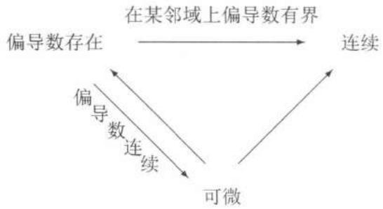

import Guide from '@/components/Guide.astro';
import Knowledge from '@/components/Knowledge.astro';
import Example from '@/components/Example.astro';
import Solution from '@/components/Solution.astro';
import Note from '@/components/Note.astro';
import Block from '@/components/Block.astro';
import Method from '@/components/Method.astro';

## $19.2.1$ 全微分的定义与基本性质

为方便起见，这里仅讨论二元函数。设 $z = f(x, y)$ 在点 $(x_0, y_0)$ 的某邻域上有定义。如果 $\Delta z = f(x_0 + \Delta x, y_0 + \Delta y) - f(x_0, y_0)$ 可以表示为

$$
\Delta z = A \Delta x + B \Delta y + o (r) (r \rightarrow 0),
$$

其中 $A, B$ 是两个仅与点 $(x_0, y_0)$ 有关而与 $\Delta x, \Delta y$ 无关的常数， $o(r)$ 是当 $r \to 0$ 时关于 $r$ 的高阶无穷小量， $r = \sqrt{(\Delta x)^2 + (\Delta y)^2}$ ，则称 $f$ 在点 $(x_0, y_0)$ 可微，且称 $A\Delta x + B\Delta y$ 是函数 $f$ 在点 $(x_0, y_0)$ 的全微分，记作

$$
\mathrm{d} z = A \Delta x + B \Delta y.
$$

习惯上，记 $\Delta x = \mathrm{d}x,\Delta y = \mathrm{d}y$ ，于是全微分 $\mathrm{dz}$ 又可以写为

$$
\mathrm{d} z = A \mathrm{d} x + B \mathrm{d} y.
$$

从全微分的定义可知，如果函数 $f$ 在点 $(x_{0}, y_{0})$ 可微，那么在点 $(x_{0}, y_{0})$ 附近有

$$
f (x _ {0} + \Delta x, y _ {0} + \Delta y) \approx f (x _ {0}, y _ {0}) + A \Delta x + B \Delta y.
$$

上式右端是一个线性函数，因此可微的意义在于在点 $(x_0, y_0)$ 附近函数可用关于 $\Delta x$ 与 $\Delta y$ 的一个线性函数近似代替.

全微分具有下列性质：

($1$) 如果 $f$ 在点 $(x_0, y_0)$ 可微，则

$$
A = \frac {\partial f}{\partial x} (x _ {0}, y _ {0}), B = \frac {\partial f}{\partial y} (x _ {0}, y _ {0});
$$

($2$) 若 $f$ 在点 $(x_0, y_0)$ 可微，则 $f$ 在点 $(x_0, y_0)$ 连续。

由性质($1$)知，如果 $f$ 在点 $(x_{0}, y_{0})$ 可微，则 $f$ 在点 $(x_{0}, y_{0})$ 的全微分是

$$
\mathrm{d} f = \frac {\partial f}{\partial x} (x _ {0}, y _ {0}) \mathrm{d} x + \frac {\partial f}{\partial y} (x _ {0}, y _ {0}) \mathrm{d} y.
$$

类似地可定义高阶全微分

$$
\mathrm{d} ^ {n} f = \mathrm{d} (\mathrm{d} ^ {n - 1} f) = \left(\mathrm{d} x \frac {\partial}{\partial x} + \mathrm{d} y \frac {\partial}{\partial y}\right) ^ {n} f,
$$

其中 $\left(\mathrm{d}x\frac{\partial}{\partial x}+\mathrm{d}y\frac{\partial}{\partial y}\right)^{n}$ 是将 $\mathrm{d}x$， $\mathrm{d}y$， $\frac{\partial}{\partial x}$ ， $\frac{\partial}{\partial y}$ 视为通常的量按照二项式定理展开而得到的对 $f$ 的一个形式记号，实际上是一个微分算子.

全微分的几何意义 设 $z = f(x, y)$ 是空间 $\mathbf{R}^3$ 中的曲面，如果 $f$ 可微，那么在点 $\pmb{p}_0(x_0, y_0, z_0)$ 附近，曲面可以用它在点 $\pmb{p}_0$ 的切平面近似代替. 其差是关于 $r = \sqrt{(x - x_0)^2 + (y - y_0)^2}$ 的一个高阶无穷小量，切平面由两个线性无关的切向量 $\tau_x, \tau_y$ 张成，其法向量为

$$
\boldsymbol {n} = \left(\frac {\partial f}{\partial x} (x _ {0}, y _ {0}), \frac {\partial f}{\partial y} (x _ {0}, y _ {0}), - 1\right).
$$

与一元函数的情况类似，全微分可用于近似计算与估计误差. 以二元函数为例，

$$
f (x _ {0} + \Delta x, y _ {0} + \Delta y) \approx f (x _ {0}, y _ {0}) + \frac {\partial f}{\partial x} (x _ {0}, y _ {0}) \Delta x + \frac {\partial f}{\partial y} (x _ {0}, y _ {0}) \Delta y
$$

就是 $(x_{0},y_{0})$ 附近的一个近似公式，

$$
\Delta z \approx \frac {\partial f}{\partial x} (x _ {0}, y _ {0}) \Delta x + \frac {\partial f}{\partial y} (x _ {0}, y _ {0}) \Delta y
$$

就是点 $(x_{0},y_{0})$ 附近的一个近似的误差估计式（参见上册 $6.3.2$ 小节中的例题）.

<Example title="例 $19.2.1$">
求 $A = \sqrt{1 - (1.004)^{2} + (1.994)^{2}}$ 的近似值.

<Solution title="解">
取 $z = f(x,y) = \sqrt{1 - x^2 + y^2}$ ， $x_0 = 1$ ， $y_0 = 2$ ， $\Delta x = 0.004$ ， $\Delta y = -0.006$ . 计算得

$$
\frac {\partial f}{\partial x} (1, 2) = - \frac {1}{2}, \quad \frac {\partial f}{\partial y} (1, 2) = 1.
$$

于是 $A = f(1.004, 1.994) \approx f(1, 2) - \frac{1}{2} \cdot (0.004) + 1 \cdot (-0.006) = 1.992$ .
</Solution>
</Example>

## $19.2.2$ 多元函数的连续性、偏导数存在性及可微性之间的关系

多元函数在一个点处的连续性、偏导数存在性及可微性之间有下列关系：

由此可得到证明一个函数 $f(x,y)$ 在点 $(x_{0},y_{0})$ 不可微的常用方法如下：

($1$) $f(x,y)$ 在 $(x_0,y_0)$ 点至少有一个偏导数不存在；

($2$) $f(x,y)$ 在 $(x_{0},y_{0})$ 点不连续；

($3$) 从定义出发证明 $\Delta f - f_{x}(x_{0}, y_{0})\Delta x - f_{y}(x_{0}, y_{0})\Delta y \neq o(r)$ .

<Example title="例 $19.2.2$">
设 $f(x,y)=\sqrt{|xy|}$ ，证明：

($1$) $f(x,y)$ 在 $(0,0)$ 点连续;

($2$) $\frac{\partial f}{\partial x}(0,0), \frac{\partial f}{\partial y}(0,0)$ 都存在;

($3$) $f(x,y)$ 在 $(0,0)$ 点不可微.

<Solution title="证">
($1$) 由于 $|\Delta f| = |\Delta x|^{1/2}|\Delta y|^{1/2}$ ，于是

$$
\lim _ {(\Delta x, \Delta y) \rightarrow (0, 0)} f (x, y) = \lim _ {(\Delta x, \Delta y) \rightarrow (0, 0)} [ f (0, 0) + \Delta f ] = 0 = f (0, 0).
$$

($2$) 直接按定义计算得

$$
\frac {\partial f}{\partial x} (0, 0) = \lim _ {\Delta x \rightarrow 0} \frac {f (\Delta x , 0) - f (0 , 0)}{\Delta x} = 0,
$$

$$
\frac {\partial f}{\partial y} (0, 0) = \lim _ {\Delta y \rightarrow 0} \frac {f (0 , \Delta y) - f (0 , 0)}{\Delta y} = 0.
$$

($3$) 由于

$$
\Delta f - f _ {x} (0, 0) \Delta x - f _ {y} (0, 0) \Delta y = | \Delta x | ^ {\frac {1}{2}} | \Delta y | ^ {\frac {1}{2}},
$$

取 $\Delta x = \Delta y\to 0$ ，则

$$
\frac {\Delta f - f _ {x} (0 , 0) \Delta x - f _ {y} (0 , 0) \Delta y}{r} = \frac {| \Delta x | ^ {\frac {1}{2}} | \Delta y | ^ {\frac {1}{2}}}{\sqrt {(\Delta x) ^ {2} + (\Delta y) ^ {2}}} \longrightarrow \frac {1}{\sqrt {2}} \neq 0,
$$

所以 $f(x,y)$ 在 $(0,0)$ 点不可微.
</Solution>
<Note>
$f(x,y)$ 在点 $(x_0,y_0)$ 处可微时，成立无穷小增量公式：

$$
f \left(x _ {0} + \Delta x, y _ {0} + \Delta y\right) = f \left(x _ {0}, y _ {0}\right) + f _ {x} \left(x _ {0}, y _ {0}\right) \Delta x + f _ {y} \left(x _ {0}, y _ {0}\right) \Delta y + o (| \Delta x | + | \Delta y |).
$$

上述例子说明仅有 $f_{x}(x_0,y_{0}),f_{y}(x_{0},y_{0})$ 存在还不足以保证二维无穷小增量公式成立.这与一维无穷小增量公式（上册 $159$ 页 $6.1$）成立的条件是不一样的，由此可以体会一元导数与多元偏导数的区别.
</Note>
</Example>

<Example title="例 $19.2.3$">
设 $f(x,y) = |x - y|\varphi (x,y)$ ，其中 $\varphi (x,y)$ 在点 $(0,0)$ 的一个邻域上有定义，要求给函数 $\varphi (x,y)$ 加上适当的条件，使得

($1$) $f(x,y)$ 在点 $(0,0)$ 连续;

($2$) $f(x,y)$ 在点 $(0,0)$ 存在偏导数;

($3$) $f(x,y)$ 在点 $(0,0)$ 可微.

<Solution title="解">
($1$) 由于 $f(0,0) = 0$ ，而在点 $(0,0)$ 附近

$$
| f (x, y) | \leqslant 2 \sqrt {x ^ {2} + y ^ {2}} | \varphi (x, y) |,
$$

于是当

$$
\lim _ {(x, y) \rightarrow (0, 0)} \sqrt {x ^ {2} + y ^ {2}} \varphi (x, y) = 0
$$

时， $f(x,y)$ 在 $(0,0)$ 点连续.

特别地，当 $\varphi(x,y)$ 在点 $(0,0)$ 附近有界时， $f(x,y)$ 在点 $(0,0)$ 连续.

($2$) 由于单侧导数

$$
\begin{array}{r l}\left(\frac {\partial f}{\partial x}\right) _ {\pm} (0, 0)&= \lim _ {x \rightarrow 0 ^ {\pm}} \frac {f (x , 0) - f (0 , 0)}{x}\\&= \lim _ {x \rightarrow 0 ^ {\pm}} \frac {\pm x \varphi (x , 0)}{x} = \pm \lim _ {x \rightarrow 0 ^ {\pm}} \varphi (x, 0),\end{array}
$$

从而当 $\lim_{x\to 0^{+}}\varphi (x,0) = -\lim_{x\to 0^{-}}\varphi (x,0)$ 时， $\frac{\partial f}{\partial x} (0,0) = \lim_{x\to 0^{+}}\varphi (x,0).$

同理当 $\lim_{y\to 0^{+}}\varphi (0,y) = -\lim_{y\to 0^{-}}\varphi (0,y)$ 时， $\frac{\partial f}{\partial y} (0,0) = \lim_{y\to 0^{+}}\varphi (0,y)$ . 特别地，当 $\lim_{(x,y)\to (0,0)}\varphi (x,y) = 0$ 时， $\frac{\partial f}{\partial x} (0,0) = \frac{\partial f}{\partial y} (0,0) = 0.$

($3$) 由于

$$
\begin{array}{r l} & {f (x, y) - \frac {\partial f}{\partial x} (0, 0) x - \frac {\partial f}{\partial y} (0, 0) y} \\ & {= | x - y |   \varphi (x, y) - [ \lim _ {x \to 0 ^ {+}} \varphi (x, 0) ] x - [ \lim _ {y \to 0 ^ {+}} \varphi (0, y) ] y} \\ & {= \left\{ \begin{array}{l l} {[ \varphi (x, y) - \lim _ {x \to 0 ^ {+}} \varphi (x, 0) ] x - [ \varphi (x, y) + \lim _ {y \to 0 ^ {+}} \varphi (0, y) ] y,} & {\text {若} x \geqslant y,} \\ {- [ \varphi (x, y) + \lim _ {x \to 0 ^ {+}} \varphi (x, 0) ] x + [ \varphi (x, y) - \lim _ {y \to 0 ^ {+}} \varphi (0, y) ] y,} & {\text {若} x <   y,} \end{array} \right.} \end{array}
$$

由此可以推出，当

$$
\lim _ {(x, y) \rightarrow (0, 0)} \varphi (x, y) = 0
$$

时， $\frac{\partial f}{\partial x}(0,0)=\frac{\partial f}{\partial y}(0,0)=0$ 且 $f(x,y)$ 在 $(0,0)$ 点可微.
</Solution>
</Example>

## $19.2.3$ 思考题

<Block title="思考题">

$1$. 为什么说 $f_{x}(x_0, y_0)$ 存在就能保证一元函数 $f(x, y_0)$ 在点 $x_0$ 连续？由此能否进一步断言：对充分接近 $y_0$ 的 $y_1$ ，一元函数 $f(x, y_1)$ 在点 $x_0$ 连续？

$2$. 证明全微分的性质 ($1$), ($2$).

$3$. 举例说明：

($1$) $f(x,y)$ 在某一点的邻域内存在偏导数，但在该点不一定连续，从而不一定可微；

($2$) $f(x,y)$ 在某一点连续，但在该点偏导数不一定存在，从而不一定可微；

($3$) $f(x,y)$ 在某一点可微，但在该点偏导数不一定连续.

$4$. 证明：若 $f_{x}(x, y)$ 在点 $(x_{0}, y_{0})$ 存在， $f_{y}(x, y)$ 在点 $(x_{0}, y_{0})$ 连续，则 $f(x, y)$ 在点 $(x_{0}, y_{0})$ 可微.

$5$. 设 $z = f(x, y)$ 在开集 $D = (a, b) \times (c, d)$ 上可微，且全微分 $\mathrm{d}z$ 恒为零。问 $f(x, y)$ 在 $D$ 上是否应取常数值？证明你的结论。

</Block>

## $19.2.4$ 练习题

<Block title="练习题">

$1$. 设 $f(x, y) = \begin{cases} \frac{\sqrt{|x - y|}}{x^2 + y^2} \sin (x^2 + y^2), & x^2 + y^2 \neq 0, \\ 0, & x^2 + y^2 = 0, \end{cases}$

讨论：

($1$) $f(x,y)$ 在点 $(0,0)$ 是否连续？

($2$) $f(x,y)$ 在点 $(0,0)$ 是否可微？

$2$. 设 $f(x, y) = \begin{cases} xy \sin \frac{1}{x^2 + y^2}, & x^2 + y^2 \neq 0, \\ 0, & x^2 + y^2 = 0. \end{cases}$

证明：

($1$) $f_{x}(0,0), f_{y}(0,0)$ 都存在；

($2$) $f_{x}(0,0), f_{y}(0,0)$ 在点 $(0,0)$ 不连续；

($3$) $f(x,y)$ 在点 $(0,0)$ 可微.

（本题也说明从可微不能推出偏导数连续.）

$3$. 设 $f(x, y, z)$ 在开集 $D$ 上有定义， $f_x(x, y, z)$ 与 $f_y(x, y, z)$ 在 $D$ 上有界，且对固定的 $(x, y)$， $f(x, y, z)$ 是 $z$ 的连续函数。证明： $f(x, y, z)$ 在 $D$ 上连续。

$4$. 求 $u = \ln (1 + x^2 + y^2)$ 在 $(x, y) = (1, 2)$ 处的全微分.

$5$. 已测得一圆柱体的底圆直径 $D_{0}=10.44$ ，高 $H_{0}=18.36$ ，且测量误差 $|\Delta D|\leqslant0.02,|\Delta H|\leqslant0.01$ 。试估计用体积公式 $V=\frac{1}{4}\pi D^{2}H$ 计算时的绝对误差 $\Delta V$ 与相对误差 $\Delta V/V$ 。

$6$. $f(x,y)$ 定义在矩形 $I = [a,b]\times [c,d]$ 上，且 $f_{y}$ 在 $I$ 上连续，证明： $f(x,y)$ 对 $y$ 满足一致 $Lipschitz$ 条件，即 $\exists L > 0$ ，使得 $\forall (x,y_1),(x,y_2)\in I$ ，都有

$$
\left| f (x, y _ {1}) - f (x, y _ {2}) \right| \leqslant L \left| y _ {1} - y _ {2} \right|,
$$

其中 $L$ 与 $x$ 无关.

$7$. 若函数 $f(x, y)$ 的偏导数 $f_x$ 和 $f_y$ 在区域 $D$ 内存在，且 $\forall (x, y) \in D, f_x(x, y) = f_y(x, y) = 0$ . 证明： $f(x, y)$ 在 $D$ 上为常值函数.

$8$. 设 $\Omega \in \mathbf{R}^2$ 是开区域， $u(x,y), v(x,y)$ 在 $\Omega$ 内满足

$$
\frac {\partial u}{\partial x} = \frac {\partial v}{\partial y}, \quad \frac {\partial u}{\partial y} = - \frac {\partial v}{\partial x}, \quad u ^ {2} + v ^ {2} = C,
$$

其中 $C$ 为常数，证明： $u(x,y$)， $v(x,y)$ 在 $\Omega$ 上均为常值函数.

$9$. 设 $f(x, y)$ 在 $G = \{(x, y) \mid x^2 + y^2 < 1\}$ 上有定义. 若 $f(x, 0)$ 在点 $x = 0$ 处连续，且 $f_y(x, y)$ 在 $G$ 上有界. 证明： $f(x, y)$ 在点 $(0, 0)$ 处连续.

</Block>
