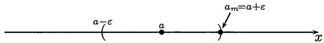
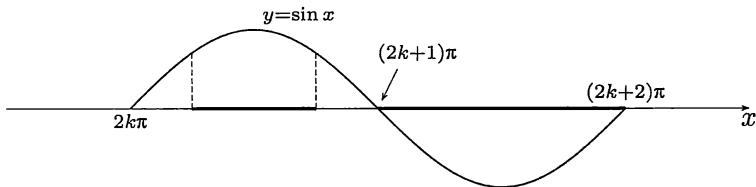

import Guide from '@/components/Guide.astro';
import Knowledge from '@/components/Knowledge.astro';
import Example from '@/components/Example.astro';
import Solution from '@/components/Solution.astro';
import Note from '@/components/Note.astro';
import Block from '@/components/Block.astro';
import Method from '@/components/Method.astro';

```mdx


关于收敛数列有下列基本性质和定理:

1. 收敛数列的极限是唯一的;

2. 收敛数列一定有界;

3. 收敛数列的比较定理, 包括保号性定理;

4. 收敛数列满足一定的四则运算规则;

5. 收敛数列的每一个子列一定收敛于同一极限.

对以上内容不仅要会用, 还应学习它们的证明, 因为其中的方法在数学分析中都是基本的, 学会了这些方法才能说真正懂得了数列收敛的定义和实质.

这里还应指出, 在数列敛散性的讨论中我们经常利用的一个基本事实, 这就是数列的收敛或发散与该数列的 (任意) 有限多项无关. 实际上, 从定义即可看出, 一个数列 $\{a_{n}\}$ 是否收敛, 在收敛时它的极限是什么, 当然和数列的第一项 $a_{1}$ 无关. 将这一个简单事实推而广之, 就得到一个很有用的结论, 即数列是否收敛 (以及在收敛时的极限是什么) 和数列中的有限多项无关. 例如, 对一个给定的数列, 改变它的前 $100$ 项, 或将它们统统去掉, 或在它们之前再增加若干项, 这样我们就得到了新的数列. 从极限的定义可知, 所有这些新的数列的敛散性与原来的数列完全相同. 若原数列收敛, 则所有新数列不但收敛, 而且还有相同的极限.

对于这一事实的用法举几个例子．实际上，在前面讲适当放大法时已经提到，不等式 $|a_{n} - a| < f(n)$ 并不一定要对所有正整数成立，只要对足够大的 $n$ 成立就可以了．在两个例题中我们都是这样做的．又如在今后的许多定理中，其中的条件均可以修改为在 $n$ 充分大时成立即可．以下面将多次使用的单调有界数列的收敛定理为例，一个给定的数列虽然并非单调，但从某项以后单调，就可以使用这个定理.

## $2.2.1$ 思考题

1. 设 $\{a_{n}\}$ 收敛而 $\{b_{n}\}$ 发散, 问: 数列 $\{a_{n} + b_{n}\}$ 和 $\{a_{n}b_{n}\}$ 的敛散性如何?

2. 设 $\{a_{n}\}$ 和 $\{b_{n}\}$ 都发散, 问: 数列 $\{a_{n} + b_{n}\}$ 和 $\{a_{n}b_{n}\}$ 的敛散性如何?

3. 设 $a_{n} \leqslant b_{n} \leqslant c_{n}, n \in \mathbf{N}_{+}$ , 已知 $\lim_{n \to \infty} (c_{n} - a_{n}) = 0$ , 问: 数列 $\{b_{n}\}$ 是否收敛?

4. 找出下列运算中的错误:

$$
\lim _ {n \rightarrow \infty} \left(\frac {1}{n + 1} + \dots + \frac {1}{2 n}\right) = \lim _ {n \rightarrow \infty} \frac {1}{n + 1} + \dots + \lim _ {n \rightarrow \infty} \frac {1}{2 n} = 0.
$$

5. 设已知 $\{a_{n}\}$ 收敛于 $a$ , 又对每个 $n$ 有 $b < a_{n} < c$ , 问: 是否成立 $b < a < c$ ?

6. 设已知 $\{a_{n}\}$ 收敛于 $a$ , 又有 $b \leqslant a \leqslant c$ , 问: 是否存在 $N$ , 使得当 $n > N$ 时成立 $b \leqslant a_{n} \leqslant c$ ?

7. 设已知 $\lim_{n\to\infty}a_{n}=0$ ，问：是否有 $\lim_{n\to\infty}(a_{1}a_{2}\cdots a_{n})=0$ ？又问：反之如何？

## $2.2.2$ 例题

<Example title="例 2.2.1">

下一个例题的结论很不平常, 它是收敛数列的一个特点, 它的证明方法与收敛数列的有界性定理的证明方法几乎相同. (请思考: 为什么说这个结论不平常?)

若数列 $\{a_{n}\}$ 收敛, 则在此数列中一定有最大数或最小数, 但不一定同时有最大数和最小数.

<Solution title="证明 1">

设此数列的极限为 $a$ . 若此数列的每一项等于 $a$ , 则不必再说. 否则, 设数列的某一项 $a_{m} \neq a$ . 若有 $a_{m} > a$ , 则可取 $\varepsilon = a_{m} - a$ . 从收敛数列的定义知道,存在 $N$ , 使得当 $n > N$ 时, $|a_{n} - a| < \varepsilon$ . 由于有 $a_{m} - a = \varepsilon$ , 显然 $m \leqslant N$ . 从图$2.1$可见, 在 $[a_{m}, +\infty)$ 中至少含有 $\{a_{n}\}$ 中的一项 $a_{m}$ , 但至多含有该数列中的 $N$ 项.



令 $M = \max\{a_{1}, a_{2}, \cdots, a_{N}\}$ ，则在 $n > N$ 时，有

$$
a _ {n} <   a + \varepsilon = a + (a _ {m} - a) = a _ {m} \leqslant M,
$$

可见 $M$ 是数列 $\{a_{n}\}$ 的最大数. 同样可证在 $a_{m} < a$ 时, 数列 $\{a_{n}\}$ 有最小数.

很容易举出不同时存在最大数和最小数的收敛数列的例子. 例如数列 $\left\{\frac{1}{n}\right\}$ 收敛于 $0$, 它有最大数, 但没有最小数. □

</Solution>

<Solution title="证明 2">

若 $\{a_{n}\}$ 不是常值数列, 则可从数列中取出不等的两项, 设为 $a_{s} < a_{t}$ , 然后用反证法如下. 设数列中既无最小数又无最大数, 则存在无穷多项小于 $a_{s}$ , 又存在无穷多项大于 $a_{t}$ . 因此, 所有大于 $a_{s}$ 或小于 $a_{t}$ 的实数都不可能是数列 $\{a_{n}\}$ 的极限. 于是 $\{a_{n}\}$ 没有极限, 与其收敛性矛盾.

</Solution>

</Example>

<Example title="例 2.2.2">

下面一个例题有很多解法. 这里举出两种不同解法.

若 $\lim_{n\to \infty}\frac{x_n - a}{x_n + a} = 0,$ 证明 $\lim_{n\to \infty}x_n = a.$

<Solution title="证明 1">

由题设可见 $a \neq 0$ . 由条件可知, $\forall \varepsilon > 0, \exists N$ , 当 $n > N$ 时, 成立

$$
\left| \frac {x _ {n} - a}{x _ {n} + a} \right| <   \varepsilon .
$$

由此可估计出 $|x_{n} - a| < \varepsilon |x_{n} + a| = \varepsilon |(x_{n} - a) + 2a| \leqslant \varepsilon (|x_{n} - a| + 2|a|)$ . 若限制 $\varepsilon < 1$ , 则可得出 $|x_{n} - a| < 2\varepsilon |a| / (1 - \varepsilon)$ . 又若限制 $\varepsilon < 1/2$ , 则又可得到

$$
| x _ {n} - a | <   \frac {2 \varepsilon | a |}{1 - \varepsilon} <   4 | a | \varepsilon .
$$

由于上式右边是 $\varepsilon$ 乘固定常数, 可见成立 $\lim_{n\to \infty}x_n = a$ .

</Solution>

<Solution title="证明 2">

作代换

$$
y _ {n} = \frac {x _ {n} - a}{x _ {n} + a},
$$

则从 $a \neq 0$ 可以看出对每个 $n$ 都有 $y_{n} \neq 1$ , 因此就可以将 $x_{n}$ 用 $y_{n}$ 表示出来:

$$
x _ {n} = a \cdot \frac {1 + y _ {n}}{1 - y _ {n}},
$$

然后根据 $\lim_{n\to \infty}y_n = 0$ 和极限运算法则就得到 $\lim_{n\to \infty}x_n = a.$

</Solution>

<Note title="注1">
与适当放大法的例题不同, 那里只是从数列收敛的定义出发, 但在这两个证明中我们已经用到了收敛数列的许多基本知识, 初学者要看到这个变化.
</Note>

<Note title="注2">
在证2中用了变量代换法. 这值得注意. 实际上, 若要证明 $\lim_{n\to \infty}x_n = a$ 就可以令 $y_{n} = x_{n} - a$ ，然后去证明 $\lim_{n\to \infty}y_n = 0$ . 这就是变量代换的最简单例子. 应当指出，即使是如此平凡的代换，对于考虑问题也是有帮助的.
</Note>

</Example>

如何证明数列收敛和计算收敛数列的极限是这一章中的主要问题. 一般说来, 除了少数情况外, 对于给定的一个数列 $\{a_{n}\}$ , 即使它是收敛的, 我们也不知道它的极限是什么. 这时在数列收敛定义中的 $a$ 不是一个已知量, 不可能用来验证数列 $\{a_{n}\}$ 收敛. 因此当然需要新的工具.

在研究数列收敛方面有两个工具是很基本的, 这就是

<Method title="夹逼定理">

夹逼定理 (也称为两面夹定理等): 对难以直接处理的数列表达式, 寻找两个较为简单的数列从两边夹住. 如果这两个数列收敛于同一极限, 则问题就解决了. 能否找到这样两个数列是成功应用夹逼定理的关键.

</Method>

<Method title="单调有界数列的收敛定理">

单调有界数列的收敛定理在理论上和应用上都非常重要, 是本章的重点学习内容, 我们将在下面 §$2.3$ 中专门讨论. 一个单调有界的数列一定收敛.

</Method>

<Example title="例 2.2.3">

下面是一个有代表性的例子, 且有许多推广 (参见例题 $10.2.5$).

设 $a > 0$, $b > 0$, 求极限 $\lim_{n \to \infty} (a^n + b^n)^{\frac{1}{n}}$ .

<Solution title="解">

不妨先假定 $a \leqslant b$ . 这时就有两面夹的不等式:

$$
b = (b ^ {n}) ^ {\frac {1}{n}} <   (a ^ {n} + b ^ {n}) ^ {\frac {1}{n}} \leqslant (2 b ^ {n}) ^ {\frac {1}{n}},
$$

也就是 $b < (a^n + b^n)^{\frac{1}{n}} \leqslant \sqrt[n]{2} b$ . 利用 $\lim_{n \to \infty} \sqrt[n]{2} = 1$ 和夹逼定理, 可见极限为 $b$ . 对 $a > b$ 可作类似讨论. 最后的答案是 $\max \{a, b\}$ .

</Solution>

</Example>

<Example title="例 2.2.4">

求数列 $\{a_{n}\}$ 的极限, 其中 $a_{n}=\frac{1!+2!+\cdots+n!}{n!}, n\in N_{+}$ .

<Solution title="解">

将分子 (设 $n > 2$ ) 中的前 $n - 2$ 项适当放大, 就有估计

$$
1! + 2! + \dots + n! \leqslant (n - 2) (n - 2)! + (n - 1)! + n! <   2 (n - 1)! + n!,
$$

因此知道在 $n > 2$ 时，有

$$
1 <   \frac {1 ! + 2 ! + \cdots + n !}{n !} <   \frac {2}{n} + 1,
$$

令 $n\to \infty$ 即可知极限为 $1$.

</Solution>

</Example>

## $2.2.3$ 判定数列发散的方法

这里的基本方法有

1. 无界数列一定发散.

2. 从数列收敛的定义出发, 用对偶法则就可得到 (参考 §$1.4$)

$\{a_{n}\}$ 发散 $\Longleftrightarrow \forall a, \exists \varepsilon_0 > 0, \forall N, \exists n > N$ ，使得 $|a_{n} - a| \geqslant \varepsilon_0$ .

3. 有一个发散子列的数列一定发散.

4. 如果发现有两个子列不可能收敛于相同极限, 则这个数列一定发散.

5. Cauchy 收敛准则也是判定数列发散的充分必要条件 (见下一章 §$3.4$).

<Example title="例 2.2.5">

在下面的例题中不但证明所给定的数列无界, 而且证明它是正无穷大量.

根据无穷大量的定义证明 $\lim_{n\to \infty}\frac{n^3 + n - 7}{n + 3} = +\infty .$

<Solution title="证明">

要对每个给定的 $G > 0$ , 证明有 $N$ , 当 $n > N$ 时, 有 $(n^3 + n - 7) / (n + 3) > G$ . 不妨令 $n > 3$ , 这样分母就可用 $2n$ 代替而使分式变小. 由于这时分子中的 $n^3 - 7 > \frac{1}{2} n^3$ , 又弃去分子中的 $n$ , 这样就可以估计出

$$
\frac {n ^ {3} + n - 7}{n + 3} > \frac {\frac {1}{2} n ^ {3}}{2 n} = \frac {1}{4} n ^ {2} > \frac {1}{4} n.
$$

为使最后一式大于 $G$ ，只要取 $N = \max \{3, [4G]\}$ 即可.

</Solution>

<Note title="注">
这里所用的方法与前面的“适当放大法”完全一样, 但或许应称为“适当缩小法”了. 容易看出, 本题的关键在于分子的最高次数高于分母的最高次数. 只要保持这一特点, 在简化时就可以慷慨地缩小, 最后得到 $N$ 的简单表达式.
</Note>

</Example>

<Example title="例 2.2.6">

接下来的例题是数学分析中的一个重要结果, 这里将给出 $3$ 个证明, 并在几个注解中作进一步的补充.

设 $S_{n}=1+\frac{1}{2}+\frac{1}{3}+\cdots+\frac{1}{n}, n\in\mathbf{N}_{+}$ ，证明数列 $\{S_{n}\}$ 发散.

数列 $\{S_n\}$ 发散是不容易猜出来的. 如果读者 (用计算器或计算机) 试算一下这个数列的前若干项, 就会发现这个数列增长得很慢. 从第一项 $S_1 = 1$ 开始, 到 $S_{83}$ 才第一次大于 $5$, 到 $S_{12367}$ 才刚超过 $10$. 今后在 $2.5.3$ 小节中学了有关 $Euler$ 常数的知识后我们就能够准确估计 $S_n$ 的近似值. 这里的精彩故事见数学通俗读物 [12] 的第八章.

历史上的证明最早是 $Oresme$ (奥雷姆, 约 1323—1382) 在 1360 年左右发表的 (见 [29]). 后来 $Bernoulli$ 兄弟, $Jacob Bernoulli$ (1655—1705) 和 $Johnann Bernoulli$ (1667—1748), 在 1689 年左右又给出了两个证明.

<Solution title="证明 1">

较为常见的证明就是 $Oresme$ 的方法, 其实质是利用不等式

$$
\frac {1}{n + 1} + \frac {1}{n + 2} + \dots + \frac {1}{2 n} > n \cdot \frac {1}{2 n} = \frac {1}{2}. \tag{2.3}
$$

这样就可以得到

$$
S _ {2} = 1 + \frac {1}{2}, \quad S _ {4} = S _ {2} + \frac {1}{3} + \frac {1}{4} > S _ {2} + 2 \left(\frac {1}{4}\right) = 2,
$$

$$
S _ {8} = S _ {4} + \frac {1}{5} + \frac {1}{6} + \frac {1}{7} + \frac {1}{8} > S _ {4} + 4 \left(\frac {1}{8}\right) > 1 + \frac {3}{2} = 2.5,
$$

不难用数学归纳法证明 (请读者完成): 对每一个 $n$ , 成立不等式

$$
S _ {2 ^ {n}} \geqslant 1 + \frac {n}{2}.
$$

可见数列 $\{S_n\}$ 无上界, 因此发散.

</Solution>

<Solution title="证明 2">

这是 $Jacob Bernoulli$ 的证明 (引自 [29]). 他发现对任意的正整数 $n$ , 有

$$
\frac {1}{n + 1} + \frac {1}{n + 2} + \dots + \frac {1}{n ^ {2}} > \frac {n ^ {2} - n}{n ^ {2}} = 1 - \frac {1}{n},
$$

因此得到不等式

$$
\frac {1}{n} + \frac {1}{n + 1} + \dots + \frac {1}{n ^ {2}} > 1. \tag{2.4}
$$

由于 $n$ 是任意的, 这样就知道

$$
S _ {4} = 1 + \frac {1}{2} + \frac {1}{3} + \frac {1}{4} > 2,
$$

$$
S _ {25} = S _ {4} + \frac {1}{5} + \dots + \frac {1}{25} > 3,
$$

依此类推, 可见数列 $\{S_n\}$ 不可能收敛.

</Solution>

<Solution title="证明 3">

用反证法. 若 $\{S_n\}$ 收敛, 记 $S = \lim_{n\to \infty}S_n$ .分拆 $S_{2n} = A_n + B_n$ ，其中

$$
A _ {n} = 1 + \frac {1}{3} + \frac {1}{5} + \dots + \frac {1}{2 n - 1},
$$

$$
B _ {n} = \frac {1}{2} + \frac {1}{4} + \frac {1}{6} + \dots + \frac {1}{2 n}.
$$

由于 $B_{n} = \frac{1}{2} S_{n}$ ，因此 $\lim_{n\to \infty}B_n = \frac{1}{2} S.$ 但由此又可以计算出

$$
\lim _ {n \to \infty} A _ {n} = \lim _ {n \to \infty} (S _ {2 n} - B _ {n}) = \frac {1}{2} S.
$$

比较 $A_{n}$ 和 $B_{n}$ , 对每个 $n$ 都有 $A_{n} - B_{n} > \frac{1}{2}$ , 因此 $\{A_{n}\}$ 和 $\{B_{n}\}$ 收敛于同一个极限值是不可能的.

</Solution>

由于 $\{S_n\}$ 是严格单调增加数列. 在前两个证明的基础上不难证明 $\{S_n\}$ 是正无穷大量. 此外, 例题 $2.2.6$ 还有许多其他解法. 在例题 $2.3.4$ 中将会证明数列 $\left\{\frac{1}{n+1} + \cdots + \frac{1}{2n}\right\}$ 收敛, 而且极限大于 $0$. 由于这个数列的通项就是 $S_{2n} - S_n$ , 如果数列 $\{S_n\}$ 收敛, 则 $\lim_{n \to \infty} (S_{2n} - S_n) = 0$ . 这与例题 $2.3.4$ 的结论矛盾, 可看成是本题的第 $4$ 个证明. 在例题 $3.4.2$ 中用 $Cauchy$ 收敛准则又对本题给出新证明.

</Example>

<Example title="例 2.2.7">

下一个例题将介绍如何用构造两个子列的方法来证明数列发散.

证明数列 $\{\sin n\}$ 发散.

<Solution title="证明 1 (几何方法)">

从正弦曲线 $y = \sin x$ 的图像(如图$2.2$)可以设法构造出两个子列.虽然我们并不知道它们是否收敛,但却有把握知道它们(如果收敛的话)决不可能收敛于同一极限.现在观察 $y = \sin x$ 在一个周期上的几何图像:



先看图$2.2$中介于 $2k\pi$ 和 $(2k + 1)\pi$ 之间的(加黑的)区间 $[2k\pi + (\pi / 4), 2k\pi + (3\pi / 4)]$ . 由于函数 $\sin x$ 在这个区间上的取值不小于 $\sin (\pi / 4) = \sqrt{2} / 2$ , 同时区间长度又大于 $1$, 因此在该区间中一定存在一个正整数, 记为 $n_k'$ . 对每个 $k$ 都这样做, 就得到一个子列 $\{\sin n_k'\}$ . 如果它收敛的话, 其极限一定不小于 $\sqrt{2} / 2$ .

类似地可以在图$2.2$上的区间 $[(2k + 1)\pi, (2k + 2)\pi]$ 中选出正整数 $n_k''$ ，得到第二个子列 $\{\sin n_k''\}$ . 它如果收敛的话，极限一定不会大于 $0$.

因为收敛数列的每个子列都收敛于同一极限, 而现在所构造出的两个子列即使都收敛, 也不可能收敛于同一极限, 从而就推知 $\{\sin n\}$ 是发散数列. □

</Solution>

<Solution title="证明 2 (反证法)">

用反证法. 设存在 $\lim_{n\to \infty}\sin n = a,$ 则就有 $\sin (n + 1) - \sin (n - 1)\rightarrow 0$. 由于 $\sin (n + 1) - \sin (n - 1) = 2\sin 1\cos n,$ 因此得到 $\cos n\to 0$ ，再利用 $\cos (n + 1) - \cos (n - 1) = -2\sin n\sin 1\to 0,$ 又得到 $\sin n\to 0.$ 这样就有

$$
\lim _ {n \rightarrow \infty} \sin n = \lim _ {n \rightarrow \infty} \cos n = 0.
$$

这与恒等式 $\sin^2 n + \cos^2 n = 1$ 相矛盾.

</Solution>

<Note title="注">
本例题的解法还有很多, 见下一章的例题 $3.4.3$.
</Note>

</Example>

<Example title="例 2.2.8">

下一例题的方法与上面完全不同. 在 §$2.6$ 将对这类“迭代”数列作专题讨论.

设 $x_{1} = \frac{c}{2}, x_{n + 1} = \frac{c}{2} +\frac{x_{n}^{2}}{2}, n\in \mathbf{N}_{+}$ ，证明：若 $c > 1$ ，则 $\{x_{n}\}$ 发散.

<Solution title="证明">

用反证法. 若数列 $\{x_{n}\}$ 收敛, 记其极限为 $A$ . 在递推公式

$$
x _ {n + 1} = \frac {c}{2} + \frac {x _ {n} ^ {2}}{2}
$$

两边令 $n \to \infty$ ，就得到

$$
A = \frac {c}{2} + \frac {A ^ {2}}{2}.
$$

这表明极限值 $A$ 应当满足二次方程 $A^2 - 2A + c = 0$ . 但由于这个二次方程的判别式 $\Delta = 4 - 4c < 0$ , 因此无实根. 这表明 $A$ 不存在, 因此数列 $\{x_n\}$ 发散.

</Solution>

显然, $\{x_{n}\}$ 在 $c > 0$ 时严格单调增加, 因此在 $c > 1$ 时是正无穷大量.

<Note title="注2">
这个例题是[14]的第一卷的第35小节中例6的一部分. 在那里对参数 $c$ 的其他情况作了详细研究. 但其中对于 $c < -3$ 时未作深入讨论就说数列 $\{x_{n}\}$ 发散, 这是不正确的. 在[24]的8—14页对此题作了完整的讨论, 其中证明存在可列个参数值 $c < -3$ 使得 $\{x_{n}\}$ 收敛. 由于此题的迭代方程在 $c \leqslant 1$ 时通过线性变换 $x = (1 + \sqrt{1 - c})(1 - 2y)$ 即可成为本章第二组参考题$19$(以及$2.6.3$小节中的题$3$)中的$logistic$映射$($逻辑斯谛映射$)$(抛物线映射)的迭代系统, 因此本书正文中不再讨论 $c \leqslant 1$ 的情况.
</Note>

</Example>

<Example title="例 2.2.9">

下一个例题的内容和证明都很简单, 但实际上是无穷级数收敛的一个必要条件. 这在无穷级数理论中是一个基本内容.

设有两个数列 $\{S_n\}$ 和 $\{a_n\}$ , 且有关系如下:

$$
S _ {n} = a _ {1} + a _ {2} + \dots + a _ {n}, \quad n \in \mathbf {N} _ {+}.
$$

若 $\{S_n\}$ 收敛, 则 $\{a_n\}$ 为无穷小量. 反之, 若 $\{a_n\}$ 不是无穷小量, 则 $\{S_n\}$ 发散.

<Solution title="证明">

从 $n \geqslant 2$ 起有 $a_{n} = S_{n} - S_{n-1}$ , 又当 $\{S_{n}\}$ 收敛时, $\{S_{n-1}\}_{n \geqslant 2}$ 也一定收敛, 而且收敛于同一极限, 在上式两边取 $n \to \infty$ , 就得到 $\lim_{n \to \infty} a_{n} = 0$ .

</Solution>

对于给定的数列 $\{a_{n}\}$ , 将记号

$$
\sum_ {n = 1} ^ {\infty} a _ {n} = a _ {1} + a _ {2} + \dots + a _ {n} + \dots
$$

称为以 $a_{n}$ 为通项的无穷级数. 从 $\{a_{n}\}$ 出发, 就可以如例题 $2.2.9$ 中的关系式那样定义数列 $\{S_{n}\}$ , 称为该无穷级数的部分和数列. 如果 $\{S_{n}\}$ 收敛, 并有

$$
\lim _ {n \to \infty} S _ {n} = S,
$$

则定义该无穷级数收敛, 且称 $S$ 为该无穷级数的和, 记为

$$
\sum_ {n = 1} ^ {\infty} a _ {n} = a _ {1} + a _ {2} + \dots + a _ {n} + \dots = S.
$$

否则就说该无穷级数发散.

无穷级数理论具有极其丰富的内容, 是本书下册的中心内容之一. 但由以上的简单介绍也已经可以看出, 无穷级数与数列有密切的联系. 实际上前面的例题 $2.2.6$ 的内容就是证明以 $1/n$ 为通项的无穷级数发散 (于正无穷大). 这个级数一般称为调和级数.

用无穷级数的语言来说, 例题 $2.2.9$ 的内容是: 无穷级数收敛的必要条件是它的通项 (所成的数列) 收敛于 $0$. 当然, 这并非是充分条件, 用例题 $2.2.6$ 就可以说明这一点.

</Example>

## $2.2.4$ 练习题

1. 证明： $\{a_{n}\}$ 收敛的充分必要条件是 $\{a_{2k}\}$ 和 $\{a_{2k-1}\}$ 收敛于同一极限.

2. 以下是可以应用夹逼定理的几个题:

(1) 给定 $p$ 个正数 $a_{1}, a_{2}, \cdots, a_{p}$ ，求 $\lim_{n \to \infty} \sqrt[n]{a_{1}^{n} + a_{2}^{n} + \cdots + a_{p}^{n}}$ ;

(2) 设 $x_{n} = \frac{1}{\sqrt{n^{2} + 1}} + \frac{1}{\sqrt{n^{2} + 2}} + \dots + \frac{1}{\sqrt{(n + 1)^{2}}}, n \in \mathbf{N}_{+}$ , 求 $\lim_{n \to \infty} x_{n}$ ;

(3) 设 $a_{n} = \left(1 + \frac{1}{2} + \dots + \frac{1}{n}\right)^{\frac{1}{n}}$ , $n \in \mathbf{N}_{+}$ , 求 $\lim_{n \to \infty} a_{n}$ ;

(4) 设 $\{a_{n}\}$ 为正数列, 并且已知它收敛于 $a > 0$ , 证明 $\lim_{n\to \infty}\sqrt[n]{a_n} = 1$ .

3. 求下列极限:

(1) $\lim_{n\to\infty}(1+x)(1+x^{2})\cdots(1+x^{2^{n}})$ ，其中 $|x|<1;$

(2) $\lim_{n\to\infty}\left(1-\frac{1}{2^{2}}\right)\left(1-\frac{1}{3^{2}}\right)\cdots\left(1-\frac{1}{n^{2}}\right);$

(3) $\lim_{n\to\infty}\left(1-\frac{1}{1+2}\right)\left(1-\frac{1}{1+2+3}\right)\cdots\left(1-\frac{1}{1+2+\cdots+n}\right);$

(4) $\lim_{n\to \infty}\left[\frac{1}{1\cdot 2\cdot 3} +\frac{1}{2\cdot 3\cdot 4} +\dots +\frac{1}{n(n + 1)(n + 2)}\right];$

(5) $\lim_{n\to \infty}\sum_{k = 1}^{n}\frac{1}{k(k + 1)\cdots(k + \nu)}$ (其中 $\nu$ 为正整数).

(最后两个题是 $\lim_{n\to\infty}\left[\frac{1}{1\cdot2}+\frac{1}{2\cdot3}+\cdots+\frac{1}{n(n+1)}\right]$ 的推广.)

4. 设 $s_{n}=a+3a^{2}+\cdots+(2n-1)a^{n},|a|<1,$ 求 $\{s_{n}\}$ 的极限.

(试计算 $s_{n}-as_{n}$ .)

5. 设正数列 $\{x_{n}\}$ 收敛, 极限大于 $0$, 证明: 这个数列有正下界, 但在数列中不一定有最小数.

6. 证明: 若有 $\lim_{n\to \infty}a_n = +\infty$ ，则在数列 $\{a_n\}$ 中一定有最小数.

7. 证明：无界数列至少有一个子列是确定符号的无穷大量.

8. 证明数列 $\{\tan n\}$ 发散.

9. 设数列 $\{S_n\}$ 的定义为

$$
S _ {n} = 1 + \frac {1}{2 ^ {p}} + \frac {1}{3 ^ {p}} + \dots + \frac {1}{n ^ {p}}, n \in \mathbf {N} _ {+}.
$$

证明 $\{S_n\}$ 在以下两种情况均发散: (1) $p \leqslant 0$ , (2) $0 < p < 1$ .
```
