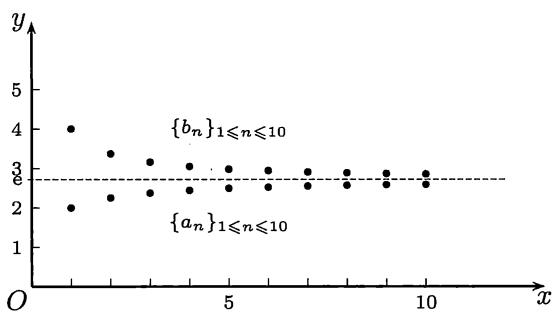

import Guide from '@/components/Guide.astro';
import Knowledge from '@/components/Knowledge.astro';
import Example from '@/components/Example.astro';
import Solution from '@/components/Solution.astro';
import Note from '@/components/Note.astro';
import Block from '@/components/Block.astro';
import Method from '@/components/Method.astro';

在数学分析中数 $e$ 是通过数列极限而引进的一个常数，近似值为 $e \approx 2.718\ 28$。数 $e$ 在数学以及一般科学中的重要性决不亚于圆周率 $\pi$。

## 2.5.1 与数 $\mathbf{e}$ 有关的两个问题

虽然数 $e$ 不如圆周率 $\pi$ 那样容易理解，但仍然有与 $e$ 密切有关的简单例子。

<Example title="例 2.5.1">
如果一笔钱在银行里存入时间 $T$ 后增值一倍，存入时间 $T/2$ 后增值 $50\%$，那么顾客就可以采取以下策略：将同样的钱先存入时间 $T/2$，然后取出，再存入时间 $T/2$，最后得到的钱是原来的 $1.5^{2} = 2.25$ 倍，即增值 $125\%$。现在将条件进一步理想化，设银行利率不随存入时间长短而改变，即存入时间 $T/3$ 后增值 $33.33\%$，存入时间 $T/4$ 后增值 $25\%$，依此类推。问：用以上缩短存入时间并多次重复的方法能在时间 $T$ 后得到的最大增值是多少？

不妨令 $T = 1$ 为单位时间。设存取 $n$ 次，每次存入时间分别为 $x_{1}, x_{2}, \cdots, x_{n}$，满足条件 $\sum_{i=1}^{n} x_{i} = 1$（即时间总和为 $T$）。从平均值不等式有

$$
(1 + x_{1})(1 + x_{2}) \dots (1 + x_{n}) \leqslant \left(\frac{n + x_{1} + \cdots + x_{n}}{n}\right)^{n} = \left(1 + \frac{1}{n}\right)^{n},
$$

且当 $x_{1} = \cdots = x_{n}$ 时成立等号。这表明在固定次数存取的前提下以等时间安排最为有利。于是问题归结为研究数列

$$
\left\{\left(1 + \frac{1}{n}\right)^{n}\right\}
$$

的性质。这个问题直接引向本节的主题 $e$。从下面的分析和数 $e \approx 2.718\ 28$ 可知，最大增值不会超过原有钱数的 $171.83\%$。
</Example>

<Example title="例 2.5.2">
已知正数 $a$，把它分成若干部分，如果要使它们的乘积达到最大，应该怎样分法？容易知道，将 $a$ 分成相等的若干部分最为有利，这是平均值不等式的又一次应用。但平均值不等式并不能告诉我们应该将数 $a$ 分成几部分最好？以 $a = 10$ 为例，可以试算出以下几个结果：

$$
\left(\frac{10}{2}\right)^{2} = 25, \quad \left(\frac{10}{3}\right)^{3} \approx 37.037, \quad \left(\frac{10}{4}\right)^{4} = 39.0625, \quad \left(\frac{10}{5}\right)^{5} = 32.
$$

今后可以证明：当等分而成的每一部分的值与数 $e$ 最接近的时候，它们的乘积最大。对 $a = 10$ 来说，就是将它等分成四部分时所得到的乘积最大。

<Note>
以上的第二个例子取自著名的中学生课外读物 [3]。我们将在例题 8.3.3 中证明以上结论。在那里的注 1 中还解决了与此密切相关的另一个问题，即如果对 $a$ 以及所分的每一部分都限制为正整数时，应当怎样分才能使乘积最大？
</Note>
</Example>

## 2.5.2 关于数 $\mathbf{e}$ 的基本结果

<Knowledge title="命题 2.5.1">
设 $a_{n} = \left(1 + \frac{1}{n}\right)^{n}, n\in \mathbf{N}_{+}$，则 $\{a_n\}$ 严格单调增加且收敛。

<Solution title="证1">
数列 $\{a_{n}\}$ 的通项就是一个数自乘 $n$ 次，如再乘上 $1$，就可看成为 $n+1$ 个数的乘积。利用平均值不等式，就有

$$
a_{n} = 1 \cdot \left(1 + \frac{1}{n}\right)^{n} < \left[\frac{n\left(1+\frac{1}{n}\right)+1}{n+1}\right]^{n+1} = \left(\frac{n+2}{n+1}\right)^{n+1} = a_{n+1}.
$$

因此数列 $\{a_{n}\}$ 严格单调增加。

引入第二个数列 $b_{n} = \left(1 + \frac{1}{n}\right)^{n+1}, n\in \mathbf{N}_{+}$，再用平均值不等式，得到

$$
\frac{1}{b_{n}} = 1 \cdot \left(\frac{n}{n+1}\right)^{n+1} < \left[\frac{(n+1)\left(\frac{n}{n+1}\right)+1}{n+2}\right]^{n+2} = \left(\frac{n+1}{n+2}\right)^{n+2} = \frac{1}{b_{n+1}}.
$$

又由于对每个 $n$ 有不等式 $a_{n} < b_{n}$，可见 $\{a_{n}\}$ 严格单调增加，且以每一个 $b_{n}$ 为上界；同时 $\{b_{n}\}$ 严格单调减少，且以每一个 $a_{n}$ 为下界，因此两个数列都收敛。利用 $a_{n}(1+1/n)=b_{n}$，可见它们的极限相同。

在图2.3中将 $\{a_{n}\}$ 和 $\{b_{n}\}$ 的表达式看成是 $n$ 的函数，分别用小圆点作出它们的前10项。它们的极限就是 $\mathbf{e}$，在图中用水平虚线的高度表示。

  
图2.3
</Solution>

<Solution title="证2">
将数列的通项 $a_{n}$ 用二项式展开，得到

$$
\begin{array}{l} a_{n} = 1 + \sum_{k=1}^{n} \binom{n}{k} \frac{1}{n^{k}} \\ \qquad = 1 + 1 + \frac{1}{2!}\left(1-\frac{1}{n}\right) + \frac{1}{3!}\left(1-\frac{1}{n}\right)\left(1-\frac{2}{n}\right) + \dots \\ \qquad + \frac{1}{n!}\left(1-\frac{1}{n}\right)\left(1-\frac{2}{n}\right)\dots\left(1-\frac{n-1}{n}\right). \end{array}
$$

比较 $a_{n}$ 和 $a_{n+1}$ 的类似展开式，可以看出前两项相同，而从第三项起，$a_{n+1}$ 的展开式中的每一项都比 $a_{n}$ 的展开式中的相应项来得大，而且最后还要多出一个正项，因此 $\{a_{n}\}$ 是严格单调增加数列。又可以用上述展开式作如下估计：

$$
a_{n} < 1 + \frac{1}{1!} + \frac{1}{2!} + \frac{1}{3!} + \dots + \frac{1}{n!} < 1 + 1 + \frac{1}{2} + \frac{1}{2^{2}} + \dots + \frac{1}{2^{n-1}} < 3,
$$

因此 $\{a_{n}\}$ 有上界，从而收敛。
</Solution>

<Note>
同时考虑两个数列的方法有一个优点，即可以得到后面的不等式 $(2.16)$。若只要证 $\{a_{n}\}$ 有上界，则有很多其他方法。例如，下面的构思见 [41]：由于

$$
\left(1 + \frac{1}{n}\right)^{n} \cdot \frac{1}{2} \cdot \frac{1}{2} < \left[\frac{n\left(1+\frac{1}{n}\right)+2\cdot\frac{1}{2}}{n+2}\right]^{n+2} = 1,
$$

可知 $\{a_{n}\}$ 以 $4$ 为上界。（用此法还可证明 $\{a_{n}\}$ 以 $\{b_{n}\}$ 的每一项为上界，其中即有 $b_{1}=4$。）
</Note>
</Knowledge>

将上一命题中确定的极限记为 $e$，它的近似值是 $2.718281828\ldots$。在 $1728$ 年大数学家 $Euler$ 引入 $e$ 作为自然对数的底（见 [29]）。在本书中将自然对数 $\log_{e} x$ 记为 $\ln x$，在其他文献中也有记为 $\log x$ 的。从以后的学习中可以看到，虽然在日常计算中一般用常用对数，但在数学中用自然对数更为“自然”和方便得多。

下一命题表明数 $e$ 又是另一个数列的极限，它也称为 $e$ 的无穷级数展开式。

<Knowledge title="命题 2.5.2">
证明数

$$
\mathrm{e} = \sum_{n=0}^{\infty} \frac{1}{n!} = 1 + 1 + \frac{1}{2!} + \frac{1}{3!} + \dots + \frac{1}{n!} + \dots .
$$

（记号 $\sum_{n=0}^{\infty}\frac{1}{n!}$ 是以 $\frac{1}{n!}$ 为通项的无穷级数，其中 $0! = 1$。级数的和定义为部分和数列 $\{s_{n}\}$ 的极限，其中 $s_{n}=1+\frac{1}{1!}+\frac{1}{2!}+\cdots+\frac{1}{n!}$。参见例题 2.2.9 的注。）

<Solution title="证明">
从上一命题中已知 $\{s_n\}$ 以 $3$ 为上界，又因 $\{s_n\}$ 严格单调增加，因此收敛。记其极限为 $s$，则从 $a_n < s_n$ 得到 $\mathbf{e} \leqslant s$。固定正整数 $m$，并令 $n > m$，就有

$$
\begin{array}{l} a_{n} = 1 + 1 + \frac{1}{2!}\left(1-\frac{1}{n}\right) + \dots + \frac{1}{n!}\left(1-\frac{1}{n}\right)\left(1-\frac{2}{n}\right)\dots\left(1-\frac{n-1}{n}\right) \\ > 1 + 1 + \frac{1}{2!}\left(1-\frac{1}{n}\right) + \dots + \frac{1}{m!}\left(1-\frac{1}{n}\right)\left(1-\frac{2}{n}\right)\dots\left(1-\frac{m-1}{n}\right). \end{array}
$$

其中不等号右边的和式是从 $a_{n}$ 的表达式中去掉后 $n-m$ 个正项得到的。令 $n\to\infty$，就有

$$
\mathrm{e} \geqslant 1 + 1 + \frac{1}{2!} + \frac{1}{3!} + \dots + \frac{1}{m!} = s_{m}.
$$

再令 $m\to\infty$，得到 $\mathbf{e} \geqslant s$。因此有 $s = \mathbf{e}$。
</Solution>
</Knowledge>

<Knowledge title="命题 2.5.3">
记 $\varepsilon_{n}=\mathrm{e}-\left(1+1+\frac{1}{2!}+\cdots+\frac{1}{n!}\right)$，则有 $\displaystyle\lim_{n\to\infty}\varepsilon_{n}(n+1)!=1$。

<Solution title="证明">
写出

$$
\lim_{n\to\infty} \varepsilon_{n}(n+1)! = \lim_{n\to\infty} \frac{\varepsilon_{n}}{\frac{1}{(n+1)!}},
$$

然后用 $\frac{0}{0}$ 型的 $Stolz$ 定理（即命题 $2.4.2$），这时

$$
\varepsilon_{n+1} - \varepsilon_{n} = -\frac{1}{(n+1)!}, \quad \frac{1}{(n+2)!} - \frac{1}{(n+1)!} = -\frac{1}{n!(n+2)},
$$

可见所求的极限为 $1$。
</Solution>
</Knowledge>

这个结果也可以从下面更为精细的估计得出。

<Knowledge title="命题 2.5.4">
对于上述 $\varepsilon_{n}$ 成立不等式 $\frac{1}{(n+1)!} < \varepsilon_{n} < \frac{1}{n!n}$。

<Solution title="证明">
从 $\varepsilon_{n} = \sum_{k=n+1}^{\infty} \frac{1}{k!}$ 可见 $\varepsilon_{n} > \frac{1}{(n+1)!}$ 成立。对任意的 $m > n$，估计

$$
\begin{array}{r l} \frac{1}{(n+1)!} + \frac{1}{(n+2)!} + \dots + \frac{1}{m!} &< \frac{1}{(n+1)!} \left(1 + \frac{1}{n+2} + \dots + \frac{1}{(n+2)^k} + \dots\right) \\ & = \frac{1}{(n+1)!} \left(\frac{1}{1-\frac{1}{n+2}}\right) \\ & = \frac{n+2}{(n+1)!(n+1)} < \frac{1}{n!n}, \end{array}
$$

再令 $m\to\infty$，就得到所求的第二个不等式。
</Solution>
</Knowledge>

现在证明关于数 $e$ 的一个基本结果，它也是 $Euler$ 首先得到的。

<Knowledge title="命题 2.5.5">
自然对数的底 $e$ 是无理数。

<Solution title="证明">
用反证法。如果 $\mathbf{e}$ 是有理数，则可写为 $\mathrm{e}=p/q$，这里 $p$ 和 $q$ 是正整数。从上两个命题知道，对于正整数 $q$，可以将 $\mathbf{e}$ 的无穷级数展开式写成为两项之和，即从级数的第一项到 $1/q!$ 为第一部分，余下的 $\varepsilon_q$ 为第二部分：

$$
\mathrm{e} = \frac{p}{q} = \left(1 + \frac{1}{1!} + \frac{1}{2!} + \frac{1}{3!} + \dots + \frac{1}{q!}\right) + \varepsilon_{q}. \tag{2.14}
$$

由此可见，$\varepsilon_{q}$ 一定是 $1/q!$ 的整数倍。但从上一个例题对 $\varepsilon_{q}$ 的估计知道，有

$$
0 < \varepsilon_{q} < \frac{1}{q!q},
$$

因此这是不可能的。
</Solution>

<Note>
换一个写法，对不等式

$$
0 < \frac{p}{q} - \left(1 + \frac{1}{1!} + \frac{1}{2!} + \dots + \frac{1}{q!}\right) < \frac{1}{q!q}
$$

的两边同乘 $q!q$，则可见在中间的一个整数的值介于 $0$ 和 $1$ 之间，引出矛盾。
</Note>

<Note>
在 $1873$ 年数学家 $Hermite$（埃尔米特）进一步证明 $e$ 是超越数，也就是说 $e$ 不是任何一个整系数代数方程的根。这个证明可以在 [53, 55] 中找到。
</Note>
</Knowledge>

本小节的前两个命题给出了以 $\mathbf{e}$ 为极限的两个数列。在计算 $\mathbf{e}$ 的近似值时用它的无穷级数展开式的前有限项之和有很多优点：计算方便，收敛快，又有很好的误差估计。如果用 $a_{n} = \left(1 + \frac{1}{n}\right)^{n}$ 来计算 $\mathbf{e}$，情况很不一样。若令

$$
\delta_{n} = \mathrm{e} - \left(1 + \frac{1}{n}\right)^{n},
$$

那么从本小节的命题2.5.1的证1可知

$$
\delta_{n} < \left(1 + \frac{1}{n}\right)^{n+1} - \left(1 + \frac{1}{n}\right)^{n} = \left(1 + \frac{1}{n}\right)^{n} \cdot \frac{1}{n} < \frac{\mathrm{e}}{n} < \frac{3}{n}.
$$

进一步还可以得到

$$
\lim_{n\to\infty} \frac{2n\delta_{n}}{\mathrm{e}} = 1,
$$

也就是说有

$$
\delta_{n} \sim \frac{\mathrm{e}}{2n}, \tag{2.15}
$$

其证明见例题8.1.4。

用 $\{a_{n}\}$ 计算 $\mathbf{e}$ 的近似值的实际例子：在取 $n=100$ 时，$a_{100}=2.70\cdots$，只有两位数字是正确的。又取 $n=10^{4}$，则有 $a_{10^{4}}=2.71814\cdots$，也只有四位数字是正确的。这里的误差与公式 $(2.15)$ 的估计是一致的。另一方面，若用

$$
s_{n} = 1 + \frac{1}{1!} + \frac{1}{2!} + \frac{1}{3!} + \dots + \frac{1}{n!}
$$

来求 $\mathbf{e}$ 的近似值，则在取 $n=10$ 时就有 $s_{10}=2.7182818\cdots$，所写出的八位数字都是正确的。这与命题2.5.4给出的误差估计也是一致的。关于收敛的速度和计算效率的研究将会在计算方法课程中学习。数学分析为此提供了基础。

小结 数 $\mathbf{e}$ 的引进和研究是一个重要范例。这表明通过极限理论可以发现新的数。应当指出，由于这些数是通过极限来定义的，对它们的研究就很不容易。在这方面还有许多我们所不了解的东西，有待今后的研究。例如，虽然已经证明了 $\mathbf{e}$ 和 $\pi$ 都是无理数和超越数，但迄今为止还没有人能证明 $\mathbf{e}+\pi$ 是无理数。

## 2.5.3 $Euler$ 常数 $\gamma$

<Knowledge title="命题 2.5.6">
数列 $\{c_{n}\}$ 收敛，其中 $c_{n}=1+\frac{1}{2}+\cdots+\frac{1}{n}-\ln n, n\in N_{+}$。

<Solution title="证明">
这里需要用不等式

$$
\frac{1}{n+1} < \ln\left(1+\frac{1}{n}\right) < \frac{1}{n}, \tag{2.16}
$$

这可从命题2.5.1中建立的 $\left(1+\frac{1}{n}\right)^n < \mathrm{e} < \left(1+\frac{1}{n}\right)^{n+1}$ 取自然对数得到。

现在研究数列 $\{c_n\}$ 的前后两项之差。由 $(2.16)$ 的第一个不等式可见

$$
c_{n+1} - c_{n} = \frac{1}{n+1} - \ln(n+1) + \ln n = \frac{1}{n+1} - \ln\left(1+\frac{1}{n}\right) < 0,
$$

因此 $\{c_n\}$ 是严格单调减少数列。以下只要证明这个数列有下界即可。

在 $(2.16)$ 的右边的不等式中将 $n$ 用 $1,2,\cdots,n$ 代入，然后将这些不等式相加，就得到

$$
1 + \frac{1}{2} + \dots + \frac{1}{n} > \ln(n+1) = \ln n + \ln\left(1+\frac{1}{n}\right) > \ln n + \frac{1}{n+1}.
$$

因此有

$$
c_{n} = 1 + \frac{1}{2} + \dots + \frac{1}{n} - \ln n > \frac{1}{n+1} > 0,
$$

可见数列 $\{c_n\}$ 为正数列，因此收敛。
</Solution>

<Note>
在确立了数列 $\{c_{n}\}$ 单调减少之后，也可以如同命题 2.5.1 的证 1 那样，引入第二个数列 $\{d_{n}\}$，其中 $d_{n}=1+\frac{1}{2}+\cdots+\frac{1}{n}-\ln(n+1), n\in\mathbf{N}_{+}$。这时有 $d_{n}<c_{n}, \forall n\in\mathbf{N}_{+}$，且由 $(2.16)$ 知 $c_{n}-d_{n}\rightarrow0$。同样可由 $(2.16)$ 得到

$$
d_{n+1} - d_{n} = \frac{1}{n+1} - \ln(n+2) + \ln(n+1) = \frac{1}{n+1} - \ln\left(1+\frac{1}{n+1}\right) > 0.
$$

因此 $\{d_{n}\}$ 是严格单调增加数列，且有 $d_{1}<\cdots<d_{n}<c_{n}<\cdots<c_{1},\forall n\in N_{+}$。因此数列 $\{c_{n}\}$ 以每个 $d_{n}$ 为下界，且和 $\{d_{n}\}$ 收敛于同一极限。
</Note>
</Knowledge>

称以上数列 $\{c_n\}$ 的极限为 $Euler$ 常数（或 $Euler$-$Mascheroni$（马斯凯罗尼）常数），记为

$$
\gamma = \lim_{n\to\infty} \left(1 + \frac{1}{2} + \dots + \frac{1}{n} - \ln n\right) \approx 0.577215664.
$$

由上述命题，我们得到

$$
1 + \frac{1}{2} + \dots + \frac{1}{n} = \ln n + \gamma + o(1).
$$

用这个公式和 $Euler$ 常数的近似值就可以近似估计例题 2.2.6 中的发散数列 $\{S_n\}$ 当 $n$ 很大时的值。例如，在 $n = 10^6$ 时，从

$$
S_{10^{6}} = \sum_{k=1}^{10^{6}} \frac{1}{k} \approx 6\ln 10 + \gamma,
$$

就得到 $S_{10^{6}} \approx 14.392726$。用 $Mathematica$ 软件验算，知道这 $8$ 位数字都是准确的。实际上如用近似公式

$$
1 + \frac{1}{2} + \dots + \frac{1}{n} \approx \ln n + \gamma + \frac{1}{2n},
$$

则效果还要好得多。关于这方面的材料可以参考 [66]。

一个尚未解决的问题是：$Euler$ 常数 $\gamma$ 是否是无理数？类似的问题在数学中还有很多。有人称 $Euler$ 常数是其中“最大的谜”（见 [9] 中的 $260$ 和 $262$ 页）。

## 2.5.4 例题

<Example title="例 2.5.3">
证明 $\displaystyle\lim_{n\to\infty}\frac{n}{\sqrt[n]{n!}} = \mathrm{e}.$

<Solution title="证1">
将 $\frac{n}{\sqrt[n]{n!}}$ 取对数，则只需证明其极限等于 $1$。经整理后得到

$$
\ln\frac{n}{\sqrt[n]{n!}} = \frac{n\ln n - (\ln 2 + \ln 3 + \cdots + \ln n)}{n} = \frac{b_{n}}{n}.
$$

用 $Cauchy$ 命题即知（也就是 2.4.3 小节的题 $4$）：

$$
\lim_{n\to\infty} (b_{n+1} - b_{n}) = l \Longrightarrow \lim_{n\to\infty} \frac{b_{n}}{n} = l,
$$

计算得到 $b_{n+1} - b_n = n\ln\left(1+\frac{1}{n}\right) = \ln\left(1+\frac{1}{n}\right)^n$，可见极限为 $1$。
</Solution>

<Solution title="证2">
将 $\frac{n}{\sqrt[n]{n!}}$ 改写为 $\sqrt[n]{\frac{n^n}{n!}}$，就可以用 2.4.3 小节题 $6$ 中的方法来做。这时记 $a_{n} = \frac{n^{n}}{n!}$，因此只需计算后项与前项之比的极限：

$$
\lim_{n\to\infty} \frac{a_{n+1}}{a_{n}} = \lim_{n\to\infty} \frac{(n+1)^{n+1}}{(n+1)!} \cdot \frac{n!}{n^{n}} = \lim_{n\to\infty} \left(1+\frac{1}{n}\right)^{n} = \mathrm{e}.
$$
</Solution>

<Note>
利用下一小节题 $7$ 中的不等式可以得到本题的又一个解法。此外，本题还有积分学解法（例题 11.4.2）。
</Note>
</Example>

<Example title="例 2.5.4">
计算极限 $\displaystyle\lim_{n\to\infty}\left(\frac{1}{n+1}+\frac{1}{n+2}+\cdots+\frac{1}{2n}\right)$。

<Solution title="解">
从 $Euler$ 常数的讨论知道，以

$$
c_{n} = 1 + \frac{1}{2} + \dots + \frac{1}{n} - \ln n
$$

为通项的数列收敛。因此就知道 $\displaystyle\lim_{n\to\infty}(c_{2n} - c_n) = 0$，又有

$$
c_{2n} - c_{n} = \frac{1}{n+1} + \frac{1}{n+2} + \dots + \frac{1}{2n} - \ln 2,
$$

因此就求出

$$
\lim_{n\to\infty} \left(\frac{1}{n+1} + \frac{1}{n+2} + \dots + \frac{1}{2n}\right) = \lim_{n\to\infty} (c_{2n} - c_{n}) + \ln 2 = \ln 2.
$$
</Solution>

<Note>
此题的另一巧妙解法见 2.8.3 小节中的例题 $4$。此外本题在学了积分学后就只是一个常规练习题（参见例题 11.4.1）。
</Note>
</Example>

## 2.5.5 练习题

1. 计算下列极限：

(1) $\displaystyle\lim_{n\to\infty}\left(1 - \frac{1}{n}\right)^n;$

(2) $\displaystyle\lim_{n\to\infty}\left(1 + \frac{1}{2n}\right)^n;$

(3) $\displaystyle\lim_{n\to\infty}\left(1 + \frac{2}{n}\right)^n;$

(4) $\displaystyle\lim_{n\to\infty}\left(1 + \frac{1}{n}\right)^{n^2};$

(5) $\displaystyle\lim_{n\to\infty}\left(1 + \frac{1}{n^2}\right)^n;$

(6) $\displaystyle\lim_{n\to\infty}\left(1 + \frac{1}{n} +\frac{1}{n^2}\right)^n.$

注 在计算中可以应用 2.1.5 小节题 $4$ 中有关连续性的结果。但是要请读者注意，在现阶段如下的做法是缺乏根据的（以题 (3) 为例）：

$$
\lim_{n\to\infty} \left(1 + \frac{2}{n}\right)^{n} = \lim_{n\to\infty} \left[\left(1 + \frac{2}{n}\right)^{\frac{n}{2}}\right]^{2} = \mathrm{e}^{2}.
$$

2. 设 $k \in \mathbf{N}_{+}$，证明：$\displaystyle\frac{k}{n+k} < \ln\left(1 + \frac{k}{n}\right) < \frac{k}{n}$。

3. 求 $\displaystyle\lim_{n\to\infty}\left(1 + \frac{1}{n^2}\right)\left(1 + \frac{2}{n^2}\right)\dots\left(1 + \frac{n}{n^2}\right)$。

4. 设 $\{p_n\}$ 是正数列，且 $p_n \to +\infty$，计算 $\displaystyle\lim_{n \to \infty} \left(1 + \frac{1}{p_n}\right)^{p_n}$。

5. 求 $\displaystyle\lim_{n\to\infty}\frac{n!2^n}{n^n}$。

6. 求极限 $\displaystyle\lim_{n\to\infty}\frac{\ln n}{1+\frac{1}{2}+\cdots+\frac{1}{n}}$。

7. 证明：$\displaystyle\left(\frac{n+1}{\mathrm{e}}\right)^n < n! < \mathrm{e}\left(\frac{n+1}{\mathrm{e}}\right)^{n+1}$。

（由此又可得到 $\displaystyle\lim_{n\to\infty}\frac{n}{\sqrt[n]{n!}}=e.$）

8. 设 $S_{n}=1+2^{2}+3^{3}+\cdots+n^{n}, n\in N_{+}$。证明：对 $n\geqslant2$，成立不等式

$$
n^{n}\left[1+\frac{1}{4(n-1)}\right] \leqslant S_{n} < n^{n}\left[1+\frac{2}{\mathrm{e}(n-1)}\right].
$$

9. 设有 $a_{1}=1, a_{n}=n(a_{n-1}+1), n=2,3,\cdots$，又设 $x_{n}=\prod_{k=1}^{n}\left(1+\frac{1}{a_{k}}\right), n\in\mathbf{N}_{+}$，求数列 $\{x_{n}\}$ 的极限。
