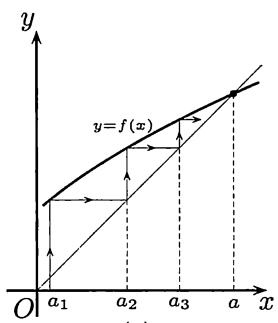
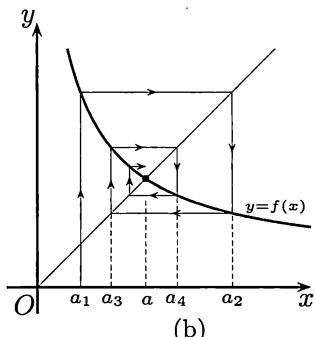

import Guide from '@/components/Guide.astro';
import Knowledge from '@/components/Knowledge.astro';
import Example from '@/components/Example.astro';
import Solution from '@/components/Solution.astro';
import Note from '@/components/Note.astro';
import Block from '@/components/Block.astro';
import Method from '@/components/Method.astro';

这里所说的“由迭代生成的数列”是指在给出数列的第一项 $a_1$ 后，用递推公式 $a_{n + 1} = f(a_n)(n\in \mathbf{N}_+)$ 通过迭代生成的数列。这里只讨论函数 $f$ 与 $n$ 无关的情况。这样的数列在数学和其他领域中经常出现，有很强的理论和实用价值。例如，大量的近似计算方法都是用迭代方式来实现的（一个具体例子就是本书 §$8.7$ 的方程求根算法）。同时这类数列有很强的共同规律，又与20世纪70年代中期发展起来的混沌研究直接有关。本节将对此作一个基本介绍，重点是几何方法

在下一章学了 $Cauchy$ 收敛准则后, 将进一步介绍处理迭代生成数列的另一种方法——压缩映射原理, 并且用这个原理对下一小节中的两个例题给出新的解法。此外, 在那里还会看到, 上、下极限也是处理迭代生成数列的有用工具。

## $2.6.1$ 例题

<Example title="例题2.6.1">
设 $a_1 = \sqrt{2}, a_{n+1} = \sqrt{2 + a_n}, n \in \mathbf{N}_+$ . 讨论数列 $\{a_n\}$ 的敛散性, 若收敛则求出其极限.

（本题的另一种形式是求极限 $\lim_{n\to\infty}\underbrace{\sqrt{2+\sqrt{2+\cdots+\sqrt{2}}}}_{n重}$ ，这时的第一步就是将数列写成递推形式。）

<Solution title="解">
可以归纳地证明这个数列是严格单调增加的, 并且以 $2$ 为上界。实际上, 从递推公式和初始值为正就可推知数列的每一项为正。从

$$
a _ {1} = \sqrt {2} <   \sqrt {2 + \sqrt {2}} = a _ {2},
$$

以及

$$
a _ {n - 1} <   a _ {n} \Longrightarrow a _ {n} = \sqrt {2 + a _ {n - 1}} <   \sqrt {2 + a _ {n}} = a _ {n + 1},
$$

可见数列是单调增加的。又从 $a_1 < 2$ 和

$$
a _ {n} <   2 \Longrightarrow a _ {n + 1} = \sqrt {2 + a _ {n}} <   \sqrt {2 + 2} = 2,
$$

可见数列以 $2$ 为上界。因此它是收敛数列。记极限是 $a$ 。在递推公式 $a_{n + 1} = \sqrt{2 + a_n}$ 的两边令 $n\to \infty$ ，就得到关于 $a$ 的方程

$$
a = \sqrt {2 + a}.
$$

因 $a > 0$ ，该方程只有一个正解 $a = 2$ ，这就是所要求的极限。
</Solution>

<Note>
注 这里介绍证明 $\{a_{n}\}$ 有上界的另一个方法。它在处理 $a_{n}$ 中出现 $n$ 重根式的类似问题时可能有用。利用

$$
\sqrt {2 + \sqrt {2}} <   \sqrt {2 + 2} = 2,
$$

就可以在 $a_{n}$ 的表达式 $\sqrt{2 + \sqrt{2 + \cdots + \sqrt{2}}}$ 中从最里面开始，从内到外将根号逐个脱去，得到 $a_{n} < 2$ .
</Note>

<Block title="问题">
问题 在上述简单例题中是否包含了迭代生成数列所共有的某些普遍规律？例如，这样的数列是否都是单调的？上界 $2$ 与答案相同是否偶然？求极限的方法是否都是如此？总而言之，迭代生成数列的收敛与求其极限是否有普遍适用的方法？在下一小节我们将要回答这些问题。在此之前，再看一个例题。它说明迭代生成的数列不一定是单调的。但这里仍然有规律。
</Block>
</Example>

<Example title="例题2.6.2">
数列 $\{b_n\}$ 由 $b_{1} = 1$ 和 $b_{n + 1} = 1 + \frac{1}{b_n}$ （ $n\in \mathbf{N}_+$ ）生成。讨论 $\{b_n\}$ 的敛散性, 若收敛则求出其极限。

<Solution title="解">
先假定数列 $\{b_n\}$ 收敛, 记极限为 $b$ 。从迭代所用的递推公式中令 $n \to \infty$ , 就得到 $b^2 - b - 1 = 0$ 。它有两个根: $(1 \pm \sqrt{5}) / 2$ 。由于容易归纳地看出所有的 $b_n > 0$ , 因此如果存在极限, 则只能是 $b = (1 + \sqrt{5}) / 2 \approx 1.618$ 。

考虑数列 $\{b_n\}$ 中的项 $b_{n}$ 和 $b_{n + 2}$ 的关系。可以从递推公式导出 $b_{n + 2} = 2 - 1 / (b_n + 1)$ 。由于上面求出的 $b$ 也满足等式 $b = 2 - 1 / (b + 1)$ , 就有

$$
b _ {n + 2} - b = \frac {b _ {n} - b}{(b _ {n} + 1) (b + 1)}.\tag{2.17}
$$

可见 $b_{n} - b$ 和 $b_{n + 2} - b$ 总是同号的。利用 $b$ 的近似值 $1.618$ 和 $b_{1} = 1, b_{2} = 2,$ 就知道对每个 $k$ 成立 $b_{2k - 1} < b < b_{2k}$ 。直接研究差值

$$
b _ {n + 2} - b _ {n} = \frac {b _ {n} - b _ {n - 2}}{(b _ {n} + 1) (b _ {n - 2} + 1)},
$$

并计算出数列的前几项 $b_{1}=1, b_{2}=2, b_{3}=1.5, b_{4}=1.666\cdots$ ，可见 $\{b_{2k-1}\}$ 严格单调增加， $\{b_{2k}\}$ 严格单调减少，而且有

$$
b _ {1} <   b _ {3} <   \dots <   b <   \dots <   b _ {4} <   b _ {2},
$$

因此它们都是收敛数列。在它们共同的递推公式 $b_{n+2} = 2 - \frac{1}{b_n + 1}$ 中令 $n \to \infty$ , 可见它们的极限都是 $b$ 。因此数列 $\{b_n\}$ 收敛于 $b$ 。
</Solution>

<Note>
注 顺便指出本题与 $Fibonacci$ （斐波那契）数列有关。所谓 $Fibonacci$ 数列, 即是由

$$
F _ {1} = 1, F _ {2} = 1, F _ {n + 2} = F _ {n + 1} + F _ {n}, n \in \mathbf {N} _ {+}
$$

确定的数列 $\{F_n\}$ 。它的前12项是 $1,1,2,3,5,8,13,21,34,55,89,144$ 。如果要求其中相继两项的增长率的极限, 即 $\lim_{n\to \infty}(F_{n + 1} / F_n)$ , 则从

$$
\frac {F _ {n + 1}}{F _ {n}} = \frac {F _ {n} + F _ {n - 1}}{F _ {n}} = 1 + \frac {1}{\frac {F _ {n}}{F _ {n - 1}}}
$$

可见, 这个极限就是上一个例题中求出的答案: $\frac{\sqrt{5} + 1}{2} \approx 1.618$ 。
</Note>

<Block title="思维过程">
很自然会产生这样的问题: 例题 $2.6.2$ 的解法是怎样想出来的? 为什么会去研究 $b_{n+2}$ 和 $b_{n}$ 的关系?

实际上与很多其他例题一样, 写在书本上的解答与实际的思维过程可能完全不同。对本题的一般思维过程是先计算数列 $\{b_n\}$ 的前几项, 发现它们有 (例如) 以下的大小关系:

$$
b _ {1} <   b _ {3} <   b _ {5} <   \dots <   b _ {6} <   b _ {4} <   b _ {2},
$$

然后 （可能会提出） 猜测: $\{b_{2k-1}\}$ 可能单调增加, $\{b_{2k}\}$ 可能单调减少。又假定数列收敛, 求出 $b$ , 由此想到去研究 $b_{n+2} - b$ 和 $b_{n+2} - b_n$ 。注意, 这里由几个特例作出猜测的方法是在科学研究中 (不仅仅在数学中) 普遍采用的归纳法。但这不是数学归纳法。数学归纳法是用来证明与正整数有关的命题 $P(n)$ 成立的严格的数学方法, 也称为完全归纳法。一旦证明成功, 命题就成立了。但上面所说的归纳法并非如此, 它更接近于科学研究中的一般思维方法。从几个特例总结出来的命题可能对, 也可能错, 因此有时也称为不完全归纳法。在这一点上说, 它似乎不如数学归纳法。但实际上数学归纳法只是证明命题的一种严格的数学方法, 至于这个命题从何处得来, （在证明成功之前） 命题成立的可能性如何, 数学归纳法对此是无能为力的。从不完全归纳法提出的猜测也被称为似然猜想, 在 $Pólya$ 的 [46] 中有系统的论述。该书和 [45, 47] 一起, 是有关数学思维和数学教育方面的名著。在这方面还可以参考 [49]。

实际上, 上面两个例题中的确包含了许多迭代生成数列的共同规律。如果掌握了这些规律, 就有可能更有效地处理同样类型的问题。
</Block>
</Example>

## $2.6.2$ 单调性与几何方法

关于迭代生成数列的第一个规律可概括在下列命题中。

<Knowledge title="命题2.6.1（第一律）">
设数列 $\{x_{n}\}$ 满足递推公式 $x_{n + 1} = f(x_n), n\in \mathbf{N}_+$ 若有 $\lim_{n\to \infty}x_n = \xi$ ，同时又成立

$$
\lim _ {n \to \infty} f (x _ {n}) = f (\xi),\tag{2.18}
$$

则极限 $\xi$ 一定是方程 $f(x)=x$ 的根 （这时称 $\xi$ 为函数 f 的不动点）。

<Note>
注 这个命题的证明是简单的, 只不过是在递推公式 $x_{n+1} = f(x_n)$ 的两边令 $n \to \infty$ 而已。这在上面两个例题中都已这样做过。命题中的条件 (2.18) 在今后学了函数的连续性概念后可替换为 $f$ 在点 $\xi$ 处连续或在更大的范围上连续等条件。（从第五章连续函数中的 $Heine$ （海涅）归结原理知道, 函数 $f$ 在点 $a$ 处连续的充分必要条件就是对每个收敛于 $a$ 的数列 $\{a_n\}$ , 成立 $\lim_{n \to \infty} f(a_n) = f(a)$ 。
</Note>

这个命题的用处是明显的。它使我们在还不知道数列的收敛情况之前, 就可以先去求解方程 $f(x) = x$ 。求出方程的根对判定原数列的收敛性往往会是有帮助的。例如, 如果方程 $f(x) = x$ 在实数范围中无根, 则无须再作任何研究就可以断定: 这个迭代生成数列一定发散 （见前面的例题 $2.2.8$ ）。又如在上面的例题 $2.6.2$ 中, 一开始就求出 $b$ , 到最后才证明它是极限。我们已经看到在该题的求解中 $b$ 所起的作用。
</Knowledge>

关于迭代生成数列的第二个规律是它的单调性。如果假定在递推公式中的函数 $f$ 为单调函数, 则很容易证明只有两种可能情况: (1) 这个数列是单调的, (2) 这个数列的奇数项子列和偶数项子列分别是单调的, 而且具有相反的单调性。事实上, 在数学分析课程中见到的这类数列的绝大多数都合乎这个规律。这就是下一个命题。请注意其中既不要求数列收敛, 也不要求它有界 （区间 $I$ 可以无界）。

<Knowledge title="命题2.6.2（第二律）">
设 $\{x_{n}\}$ 满足关系 $x_{n + 1} = f(x_n), n\in \mathbf{N}_+$ ，其中的函数 $f$ 在区间 $I$ 上单调，同时数列 $\{x_{n}\}$ 的每一项都在区间 $I$ 中，则只有两种可能：(1)当 $f$ 单调增加时， $\{x_{n}\}$ 为单调数列；(2)当 $f$ 单调减少时， $\{x_{n}\}$ 的两个子列 $\{x_{2k - 1}\}$ 和 $\{x_{2k}\}$ 分别为单调数列，且具有相反的单调性。

<Solution title="证">
分别讨论命题中的两种情况。

(1) 设 $f(x)$ 在区间 $I$ 上单调增加。根据条件, 有 $x_{n} \in I, n \in \mathbf{N}_{+}$ 。观察数列的前两项。如有 $x_{1} \leqslant x_{2} = f(x_{1})$ , 则就有 $x_{2} = f(x_{1}) \leqslant f(x_{2}) = x_{3}$ 。用数学归纳法可知, 数列 $\{x_{n}\}$ 单调增加。完全类似地可以证明, 在 $x_{1} \geqslant x_{2}$ 时, 数列 $\{x_{n}\}$ 单调减少。

(2) 设 $f(x)$ 在区间 $I$ 上单调减少。注意: 复合函数 $f(f(x))$ 却是单调增加的。严格地说, 只要 $a, b \in I, a < b$ , 而且 $f(a), f(b) \in I$ , 就成立 $f(f(a)) \leqslant f(f(b))$ 。

观察 $x_{1}$ 与 $x_{3}$ 。如果 $x_{1} = x_{3}$ , 则子列 $\{x_{2k-1}\}$ 为常值数列。如成立 $x_{1} < x_{3}$ , 从 $f$ 单调减少就有 $x_{2} \geqslant x_{4}$ , 然后推出 $x_{3} \leqslant x_{5}$ 。以下的讨论已无困难。用数学归纳法即可证明这时子列 $\{x_{2k-1}\}$ 单调增加。由于函数 $f$ 单调减少, 从 $x_{2k} = f(x_{2k-1}), k \in \mathbf{N}_{+}$ , 可知子列 $\{x_{2k}\}$ 单调减少。对于 $x_{1} > x_{3}$ 的讨论完全类似, 从略。
</Solution>

<Note>
注 从证明中不难看出, 以上的单调性还具有一个特点。举例来说, 在(1) 中的 $\{x_{n}\}$ 为单调增加的情况, 只有两种可能性: 或者是从某项之后为常值数列, 或者是严格单调增加数列。
</Note>
</Knowledge>

现在问题已经很清楚, 如果迭代生成数列 $\{x_{n}\}$ 在函数 $f$ 的单调区间内而且有界的话 （区间 $I$ 可以无界）, 则在情况 (1) 时数列必收敛, 而在情况 (2) 时数列可能收敛, 也可能发散, 但两个子列 $\{x_{2k-1}\}$ 和 $\{x_{2k}\}$ 则一定收敛。因此问题取决于这两个子列的极限是否相等。对于数列无界的情况可以作出类似的讨论。

对于具体问题来说, 应用以上两个规律的最简便方法就是作图。首先在坐标平面上作出函数 $y = f(x)$ 的图像。在命题 $2.6.1$ 中的不动点就是曲线 $y = f(x)$ 和直线 $y = x$ 的交点。对于很多简单函数, 不难确定它的单调区间。为了知道迭代生成数列的具体情况, 往往不需要作很多计算, 而只要用我们在下面介绍的作图法即可。它有一个很形象化的名称——蛛网 (cobweb) 工作法。

  
(a)

  
图2.4  
(b)

先看图2.4(a)。在其中的曲线代表函数 $y = f(x)$ 。它同直线 $y = x$ 的交点的横坐标 $a$ 就是 $f$ 的不动点。从图中的 $x$ 轴上代表初始值 $a_1$ 的点出发作平行于 $y$ 轴的直线, 它与曲线 $y = f(x)$ 的交点的纵坐标就是 $a_2 = f(a_1)$ 。在这里的一个技巧是从上述交点作平行于 $x$ 轴的直线与直线 $y = x$ 相交, 这个交点的横坐标当然也是 $a_2$ 。在图中从这个交点作一条虚线与纵轴平行, 并将它与 $x$ 轴的交点标为 $a_2$ 。这就完成了蛛网工作法的第一步。

在图 2.4(a) 上将这个方法继续做几步, 可以看出, 所得的数列是单调增加的。这与命题 $2.6.2$ 一致, 它可能以 a 为极限。当然要严格建立这些结论的话还要进行分析证明。但以上的几何观察在发现规律和提供思路上是很有用的。

将图 2.4(a) 中的想法严格化, 就可以建立下面的命题。在这个命题中, 对于 f 在点 a 的连续性条件, 按照命题 $2.6.1$ 的注解来理解。

<Knowledge title="命题2.6.3">
设 $a$ 是 $f(x)$ 的不动点，函数 $f$ 在 $a$ 处连续，在点 $a$ 的邻域 $(a - r, a + r)$ 上严格单调增加，并且在区间 $(a - r, a)$ 上有 $f(x) > x$ ，而在区间 $(a, a + r)$ 上有 $f(x) < x$ ，那么迭代生成数列只要第一项在 $(a - r, a + r)$ 内，且不等于 $a$ ，则以后就不会越出这个区间，而且是以 $a$ 为极限的严格单调数列。

<Solution title="证">
从条件可知, $f$ 在点 $a$ 的两侧均有 $f(x) \neq x$ , 因此 $f$ 在区间 $(a - r, a + r)$ 内只可能有唯一的不动点 $a$ 。不妨设初始值 $a_1 \in (a - r, a)$ 。从 $f$ 的严格单调性和 $a_1 < a$ 得到 $a_2 = f(a_1) < f(a) = a$ 。又因为在区间 $(a - r, a)$ 上满足条件 $f(x) > x$ , 就有 $a_2 = f(a_1) > a_1$ 。合并起来就有 $a_1 < a_2 < a$ 。

用数学归纳法可以证明数列 $\{a_{n}\}$ 完全落在区间 $(a - r, a)$ 内，且严格单调增加。由于它以 $a$ 为上界，因此收敛。它的极限应当在区间 $[a_{1}, a] \subset (a - r, a]$ 内。由于在这里 $a$ 是唯一的不动点，因此极限就是 $a$ 。又类似地可以证明，在初始值 $a_{1} \in (a, a + r)$ 时，数列 $\{a_{n}\}$ 是以 $a$ 为极限的严格单调减少数列。 $\square$
</Solution>
</Knowledge>

一方面, 如果将在区间 $(a - r, a)$ 上 “ $f(x) > x$ ” 的条件改为 “ $f(x) < x$ ”, 而保持其他条件不动, 则当初始值 $a_1 \in (a - r, a)$ 时, 就有 $a_2 = f(a_1) < a_1$ 。这样一来, 在几次迭代之后就可能会越出 $(a - r, a)$ , 但在这之前是严格单调减少的。

另一方面, 当函数 $f$ 在点 $a$ 附近为单调减少时, 就可能出现第二种情况, 它同样有明显的几何意义。这就是图2.4(b)中所表示的情况。这里数列 $\{a_{n}\}$ 的奇数项子列严格单调增加, 而偶数项子列严格单调减少。当然为了迭代生成数列不越出 $f$ 的单调区间并收敛于不动点 $a$ , 这时对函数 $f$ 也需要加一定的条件才行 （读者可自己写出具体的条件并加以分析论证）。

现在可以回答上一小节末提出的问题。我们解例题 $2.6.2$ 的方法是先作一个类似于图 2.4(b) 那样的草图, 其中的 $f(x) = 1 + \frac{1}{x}$ 。然后在图上使用蛛网工作法。这样就在写分析论证之前可以看出此题的迭代生成数列一定是第二律中的情况 (2)。剩下的就是通过细心的运算来写出证明而已。这个求解的书写恰如用数学归纳法一样, 所要证明的结论是在证明之前用其他方法得到的。

以上所介绍的关于迭代生成数列的一些简单规律是许多科学家早就知道的，并在生态学等领域有实际应用。长期以来，没有人去考虑在这些规律性之外还会有什么值得研究。在20世纪70年代中期，开始有人对迭代生成数列进行大范围的研究，这是混沌科学开始发展的几个源头之一。在这里要指出，当函数 $y = f(x)$ 在定义域上并非单调时，在迭代过程中离开某个不动点的点完全可能再回到这个不动点附近，甚至直接落到这个或另一个不动点上，从而会出现极其复杂的行为。有兴趣的读者可以阅读生态学家R. M. May (梅)的科普文章[39]。该文强调了迭代生成数列在生物学、经济学和社会科学中的重要性，同时还呼吁将其中的最新发现放到初等数学的课程中去。此文在推动混沌学的发展上起过重要的作用。(参看本书的 §$5.6$。)

## $2.6.3$ 练习题

在以下各题中均可试用几何方法, 或作出几何解释。

1. (1) 设 $a > 0, x_{1} = \sqrt{a}, x_{n+1} = \sqrt{a + x_{n}}, n \in \mathbf{N}_{+}$ , 求 $\lim_{n \to \infty} x_{n}$ ;
   (2) 设 $a > 0, x_1 = \sqrt{a}, x_{n+1} = \sqrt{ax_n}, n \in \mathbf{N}_+$ , 求 $\lim_{n \to \infty} x_n$ .
   （这两题外形相似, 都可用本节方法解决。但题 (2) 有更简单的直接解法。）

2. 设 $A > 0, 0 < b_0 < A^{-1}, b_{n+1} = b_n(2 - Ab_n), n \in \mathbf{N}_+$ 。证明： $\lim_{n \to \infty} b_n = A^{-1}$ 。

3. 设参数 $b > 4$ , $x_{1} = \frac{1}{2}$ , $x_{n + 1} = bx_{n}(1 - x_{n}), n \in \mathbf{N}_{+}$ 。证明： $\{x_{n}\}$ 发散。

4. 设 $x_{1} = b, x_{n + 1} = \frac{1}{2} (x_{n}^{2} + 1)$ 。问： $b$ 取何值时数列 $\{x_{n}\}$ 收敛, 并求其极限。

5. 设 $x_0 = a, x_n = 1 + bx_{n-1}, n \in \mathbf{N}_+$ 。试求出使该数列收敛的 $a, b$ 的所有值。
   （本题为线性迭代, 解法很多。）

6. （对于线性迭代的全面讨论） 设给定初始值 $x_{1}$ , 然后用线性函数 $f(x) = ax + b$ 迭代生成数列 $\{x_{n}\}$ , 即 $x_{n+1} = ax_{n} + b$ 。试回答以下问题:
   (1) 是否存在线性函数, 使对于任何初始值 $x_{1}, \{x_{n}\}$ 总是收敛的?
   (2) 是否存在线性函数, 使对于任何初始值 $x_{1}, \{x_{n}\}$ 总是发散的?
   (3) 是否存在线性函数, 使对于不同的初始值 $x_{1}, \{x_{n}\}$ 收敛到不同极限?
   (4) 是否存在线性函数, 使对于某些初始值 $x_{1}, \{x_{n}\}$ 收敛, 而对于其他初始值 $x_{1}, \{x_{n}\}$ 发散?

7. 设 $\{x_{n}\}$ 为正数列, 且满足 $x_{n+1} + \frac{1}{x_n} < 2, n \in \mathbf{N}_+$ 。证明 $\{x_{n}\}$ 收敛, 并求其极限。

8. 设 $A > 0, x_1 > 0, x_{n+1} = \frac{1}{2}\left(x_n + \frac{A}{x_n}\right), n \in \mathbf{N}_+$ , 证明： $\lim_{n \to \infty} x_n = \sqrt{A}$ 。
   （这是求平方根的快速算法。实际上可以得到对于收敛速度的估计：
   $$
   x _ {n + 1} - \sqrt {A} = \frac {1}{x _ {n}} (x _ {n} - \sqrt {A}) ^ {2} \leqslant \frac {1}{\sqrt {A}} (x _ {n} - \sqrt {A}) ^ {2},
   $$
   因此若记 $|x_{n} - \sqrt{A}| = \varepsilon_{n}$ 为第 $n$ 次误差, 则在 $n$ 充分大时有 $\varepsilon_{n + 1} \approx \frac{1}{\sqrt{A}} \varepsilon_{n}^{2}$ 。每迭代一次, 有效位数几乎增加一倍。）

9. 设 $A > 0, x_{1} > 0, x_{n + 1} = \frac{x_{n}(x_{n}^{2} + 3A)}{3x_{n}^{2} + A}, n \in \mathbf{N}_{+}$ , 证明： $\{x_{n}\}$ 收敛于 $\sqrt{A}$ 。
   （这是求平方根的另一个快速算法。请读者对收敛速度作估计。）
