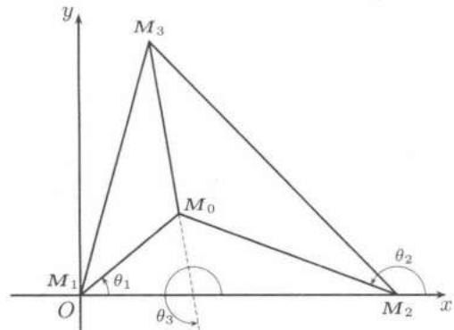

import Guide from '@/components/Guide.astro';
import Knowledge from '@/components/Knowledge.astro';
import Example from '@/components/Example.astro';
import Solution from '@/components/Solution.astro';
import Note from '@/components/Note.astro';
import Block from '@/components/Block.astro';
import Method from '@/components/Method.astro';

## $21.3.1$ $Taylor$公式

在一元微分学中 (上册 §$7.2$), 我们对 $Taylor$ 公式及其应用给予了足够的重视, 介绍了带有 $Peano$ 余项和 $Lagrange$ 余项的 $Taylor$ 公式, 它们分别是对于一元函数的带有渐近误差估计和大范围误差估计的多项式逼近. 在多元函数中, 我们仍然有相应的 $Taylor$ 公式. 为叙述方便起见, 仅讨论二元函数的情形.

<Knowledge title="$Taylor$ 公式">
设函数 $f(x, y)$ 在开圆盘 $D = \{(x, y) \mid (x - x_0)^2 + (y - y_0)^2 < a^2\}$ 上有关于 $x, y$ 的各个 $m+1$ 阶连续偏导数。对 $D$ 内任意一点 $(x, y)$ ，记 $\Delta x = x - x_0, \Delta y = y - y_0$ ，则

$$
\begin{array}{r l} f (x, y) & = f (x _ {0}, y _ {0}) + \frac {\partial f}{\partial x} (x _ {0}, y _ {0}) \Delta x + \frac {\partial f}{\partial y} (x _ {0}, y _ {0}) \Delta y \\ & \quad + \frac {1}{2 !} \left(\Delta x \frac {\partial}{\partial x} + \Delta y \frac {\partial}{\partial y}\right) ^ {2} f (x _ {0}, y _ {0}) + \dots \\ & \quad + \frac {1}{m !} \left(\Delta x \frac {\partial}{\partial x} + \Delta y \frac {\partial}{\partial y}\right) ^ {m} f (x _ {0}, y _ {0}) + R _ {m} (x, y), \end{array}
$$

其中

$$
R _ {m} (x, y) = \frac {1}{(m + 1) !} \left(\Delta x \frac {\partial}{\partial x} + \Delta y \frac {\partial}{\partial y}\right) ^ {m + 1} f (x _ {0} + \theta \Delta x, y _ {0} + \theta \Delta y),
$$

$0<\theta<1$ ，称为$Lagrange$余项.

在所述条件下（甚至条件可减弱为 $f(x,y)$ 在 $(x_0,y_0)$ 处有关于 $x,y$ 的各个 $m$ 阶连续偏导数)，也可取$Peano$余项 $R_{m}(x,y) = o(r^{m}),r\to 0,$ 其中 $r = \sqrt{(\Delta x)^2 + (\Delta y)^2}$
</Knowledge>

上述两个公式的证明均可化归为一元函数来证明。其中在$Lagrange$余项的证明中，令 $\varphi (t) = f(x_0 + t\Delta x,y_0 + t\Delta y)$ ；在$Peano$余项的证明中可先把 $f(x,y) = f(x_0 + \Delta x,y_0 + \Delta y)$ 作为 $\Delta x$ 的一元函数进行带$Peano$余项的一元$Taylor$公式展开，再对各阶偏导函数作 $\Delta y$ 的一元函数展开，然后整理.

<Knowledge title="命题 $21.3.1$ ($Taylor$ 公式的惟一性)">
设 $f(x,y)$ 具有 $m+1$ 阶连续偏导数, 若用某种方法得到展开式

$$
f (x, y) = \sum_ {i + j = 0} ^ {m} A _ {i j} (x - x _ {0}) ^ {i} (y - y _ {0}) ^ {j} + o (\rho^ {m}) (\rho \rightarrow 0),
$$

其中 $\rho = \sqrt{(x - x_0)^2 + (y - y_0)^2}$ , 则必有

$$
A _ {i j} = \frac {1}{i ! j !} \cdot \frac {\partial^ {i + j}}{\partial x ^ {i} \partial y ^ {j}} f (x _ {0}, y _ {0}).
$$

证明留作习题.
</Knowledge>

<Example title="例题$21.3.1$">
设

$$
f (x, y) = \left\{ \begin{array}{l l} \frac {1 - \mathrm{e} ^ {x (x ^ {2} + y ^ {2})}}{x ^ {2} + y ^ {2}}, & (x, y) \neq (0, 0), \\ 0, & (x, y) = (0, 0). \end{array} \right.
$$

求 $f(x,y)$ 在 $(0,0)$ 的$4$阶$Taylor$多项式，并求出 $\frac{\partial^2f}{\partial x\partial y}(0,0),\frac{\partial^4f}{\partial x^4} (0,0).$

<Solution title="解">
由于

$$
\mathrm{e} ^ {x (x ^ {2} + y ^ {2})} = 1 + x (x ^ {2} + y ^ {2}) + \frac {1}{2} x ^ {2} (x ^ {2} + y ^ {2}) ^ {2} + o ([ x (x ^ {2} + y ^ {2}) ] ^ {2}),
$$

于是

$$
\frac {1 - \mathrm{e} ^ {x (x ^ {2} + y ^ {2})}}{x ^ {2} + y ^ {2}} = - x - \frac {1}{2} x ^ {2} (x ^ {2} + y ^ {2}) + o (x ^ {2} (x ^ {2} + y ^ {2})).
$$

由 $Taylor$ 展式的惟一性知 $f(x,y)$ 的 $4$ 阶 $Taylor$ 展开式为

$$
- x - \frac {1}{2} x ^ {4} - \frac {1}{2} x ^ {2} y ^ {2}.
$$

由此得

$$
\frac {\partial^ {2} f}{\partial x \partial y} (0, 0) = 0, \quad \frac {\partial^ {4} f}{\partial x ^ {4}} (0, 0) = 4! (- \frac {1}{2}) = - 1 2.
$$
</Solution>
</Example>

$Taylor$ 公式有许多重要而有趣的应用, 下面举出几例. 我们先用向量与矩阵形式来重新表达 $Taylor$ 公式, 这样的表达式简单明了. 特别是它的前三项, 与线性代数的知识紧密联系在一起. 建议读者要熟悉.

考虑定义在一个开区域 $D \subset R^{n}$ 上的 $n$ 元二次连续可微函数 $f(x_{1}, x_{2}, \cdots, x_{n})$ . 设点 $\boldsymbol{p}_{0} = (x_{1}^{0}, x_{2}^{0}, \cdots, x_{n}^{0}) \in D$ . 带 $Peano$ 余项的二阶 $Taylor$ 展式可写为

$$
f \left(\boldsymbol {p} _ {0} + \Delta \boldsymbol {x}\right) = f \left(\boldsymbol {p} _ {0}\right) + \nabla f \left(\boldsymbol {p} _ {0}\right) \cdot \Delta \boldsymbol {x} ^ {\mathrm{T}} + \frac {1}{2 !} \Delta \boldsymbol {x} \boldsymbol {Q} \Delta \boldsymbol {x} ^ {\mathrm{T}} + o \left(r ^ {2}\right),
$$

其中 $\Delta x = (\Delta x_{1}, \Delta x_{2}, \cdots, \Delta x_{n}) = (x_{1} - x_{1}^{0}, x_{2} - x_{2}^{0}, \cdots, x_{n} - x_{n}^{0})$ ， $\nabla f(p_{0})$ 是 $f(x)$ 在 $p_{0}$ 处的梯度， $Q = \left(\frac{\partial^{2}f}{\partial x_{i}\partial x_{j}}\right)\bigg|_{x=p_{0}}$ 称为 $Hesse$（黑塞）矩阵.

记函数的增量 $\Delta f = f(p_0 + \Delta x) - f(p_0)$ . 易知当 $\nabla f(p_0) \neq 0$ 时可取不同的 $\Delta x$ , 使 $\Delta f$ 取到正值与负值, 因此当 $p_0$ 是可微函数 $f$ 的一个极值点时, $p_0$ 必是 $f$ 的驻点 (又称临界点), 即有①

$$
\nabla f (\boldsymbol {p} _ {0}) = \mathbf {0}.
$$

又当 $\nabla f(p_0) \neq 0$ ，且 $|\Delta x|$ 为定值时，在 $\Delta x$ 与 $\nabla f(p_0)$ 同向时 $\Delta f$ 取最大。因此梯度方向是函数增长最快的方向。当 $\nabla f(p_0) = 0$ 时，可根据 $Q$ 的情况来讨论函数增长最快的方向。

<Example title="例题$21.3.2$">
设 $u = \frac{x^2}{a^2} +\frac{y^2}{b^2} +\frac{z^2}{c^2}$ ，其中 $a > b > c > 0$ 求在 $(0,0,0)$ 处函数增长最快的方向.

<Solution title="解">
由于 $\nabla u(0,0,0)$ 为零向量, 故不能应用梯度方向是函数增长最快的方向的性质, 需另想办法. 考虑沿某单位方向 $l = (\alpha, \beta, \gamma)$ 函数 $u$ 的变化

$u(t\alpha,t\beta,t\gamma)-u(0,0,0)$ ，其中t是参数.

令 $\varphi(t) = u(t\alpha, t\beta, t\gamma)$ . 由 $Taylor$ 展式

$$
\begin{array}{l} \varphi (t) - \varphi (0) = \varphi^ {\prime} (0) t + \frac {\varphi^ {\prime \prime} (0)}{2} t ^ {2} + o (t ^ {2}) \\ \quad = \frac {1}{2} \left(\frac {\partial^ {2} u}{\partial x ^ {2}} (0, 0, 0) \alpha^ {2} + \frac {\partial^ {2} u}{\partial y ^ {2}} (0, 0, 0) \beta^ {2} + \frac {\partial^ {2} u}{\partial z ^ {2}} (0, 0, 0) \gamma^ {2}\right) t ^ {2} + o (t ^ {2}) \\ \quad = \left(\frac {\alpha^ {2}}{a ^ {2}} + \frac {\beta^ {2}}{b ^ {2}} + \frac {\gamma^ {2}}{c ^ {2}}\right) t ^ {2} + o (t ^ {2}). \end{array}
$$

由于 $a > b > c$ 及 $\alpha^2 +\beta^2 +\gamma^2 = 1$ ，当 $t > 0$ 充分小时，沿方向 $l = (0,0,\pm 1)$ $\varphi (t) - \varphi (0)$ 最大，即函数 $u$ 增加最快. □

</Solution>
</Example>

设二次连续可微函数 $f$ 在点 $p_{0}$ 处的梯度为零向量, 但 $Hesse$ 矩阵 $Q$ 是非零矩阵, 则 $f$ 增长最快的可能方向在 $Q$ 的最大特征值对应的特征子空间中. 如最大特征值对应的特征子空间为一维空间, 则相应的方向就是 $f$ 增长最快的方向 (第二组参考题 $1$).

<Example title="例题$21.3.3$">
设 $f(x, y)$ 在单位圆盘 $D = \{(x, y) \mid x^2 + y^2 \leqslant 1\}$ 上具有连续的一阶偏导数，且满足 $|f(x, y)| \leqslant 1, \forall (x, y) \in D$ 。证明：存在点

$$
(x _ {0}, y _ {0}) \in \operatorname{int} D = \{(x, y) \mid x ^ {2} + y ^ {2} <   1 \},
$$

使得在点 $(x_{0},y_{0})$ 处有不等式 $f_{x}^{2}+f_{y}^{2}\leqslant16.$

<Solution title="证明">
设 $g(x,y) = f(x,y) + 2(x^2 +y^2)$ .在单位圆周上显然有 $g(x,y)\geqslant 1$ ，而在原点 $g(0,0)\leqslant 1$ .所以或者 $g$ 在 $D$ 上恒等于1，或者 $g(x,y)$ 必在 $D$ 的某个内点 $(x_0,y_0)$ 处取到极小值.因此总存在 $(x_0,y_0)\in \mathrm{int}D,$ 使得

$$
\left. \frac {\partial g}{\partial x} \right| _ {(x _ {0}, y _ {0})} = \left. \frac {\partial g}{\partial y} \right| _ {(x _ {0}, y _ {0})} = 0,
$$

于是就有

$$
\left. (f _ {x} ^ {2} + f _ {y} ^ {2}) \right| _ {(x _ {0}, y _ {0})} \leqslant 1 6.
$$
</Solution>
</Example>

<Example title="例题$21.3.4$">
证明: 当 $|x|$ 和 $|y|$ 充分小时, 有近似式

$$
\frac {\cos x}{\cos y} \approx 1 - \frac {1}{2} x ^ {2} + \frac {1}{2} y ^ {2}.\tag{21.4}
$$

<Solution title="证明">
设 $f(x, y) = \frac{\cos x}{\cos y}$ ，则 $f(x, y)$ 在原点附近无穷次可微，且

$$
f (0, 0) = 1, \quad f _ {x} (0, 0) = 0, \quad f _ {y} (0, 0) = 0,
$$

$$
f _ {x x} (0, 0) = - 1, \quad f _ {y y} (0, 0) = 1, \quad f _ {x y} (0, 0) = 0.
$$

由 $Taylor$ 公式, 当 $|x|$ 和 $|y|$ 充分小时, 有

$$
\frac {\cos x}{\cos y} = 1 - \frac {1}{2} x ^ {2} + \frac {1}{2} y ^ {2} + o (| x | ^ {2} + | y | ^ {2}),
$$

此即 (21.4).
</Solution>
</Example>

## $21.3.2$ 极值问题

考虑定义在一个开区域 $D \subset R^{n}$ 上的 $n$ 元二次连续可微函数 $f(x_{1}, x_{2}, \cdots, x_{n})$ . 设 $\boldsymbol{p}_{0} = (x_{1}^{0}, x_{2}^{0}, \cdots, x_{n}^{0}) \in D$ 是 $f$ 的一个极值点, 那么 $\nabla f(\boldsymbol{p}_{0}) = \mathbf{0}$ . 由二阶 $Taylor$ 展式得

$$
f (\boldsymbol {p} _ {0} + \Delta \boldsymbol {x}) = f (\boldsymbol {p} _ {0}) + \frac {1}{2 !} \Delta \boldsymbol {x} \boldsymbol {Q} \Delta \boldsymbol {x} ^ {\mathrm{T}} + o (r ^ {2}),
$$

因而可以根据二次型 $\Delta xQ\Delta x^{T}$ 的符号来确定 $f(x)$ 能否在 $p_{0}$ 处取到极值，即有如下的极值的充分条件：

设函数 $f$ 在驻点 $p_{0}$ 的某邻域上有二阶连续偏导数，则

$(1)$ 若 $Q$ 是正定的, 则 $f(p_{0})$ 是极小值;

$(2)$ 若 $Q$ 是负定的, 则 $f(p_{0})$ 是极大值;

$(3)$ 若 $Q$ 是不定的 (即既有正的特征值, 也有负的特征值), 则 $p_{0}$ 点不是极值点;

$(4)$ 若 $Q$ 是半定的 (即所有特征值同号, 但有零特征值), 则需进一步判别.

$Hesse$ 矩阵 $Q$ 是否是正定、负定可以根据高等代数中学到的 $Sylvester$ (西尔维斯特) 准则来判断, 即考虑 $Q$ 的各阶主子式的符号. 特别有:

设 $f$ 是二元函数 $f(x,y)$ 。如果 $f(x,y)$ 在驻点 $(x_0,y_0)$ 的某个邻域上有二阶连续偏导数，并设 $A = f_{xx}(x_0,y_0)$ ， $B = f_{xy}(x_0,y_0)$ ， $C = f_{yy}(x_0,y_0)$ 以及 $\Delta = AC - B^2$ ，则

$(1)$ 若 $\Delta > 0, A > 0$ , 则 $f$ 在点 $(x_0, y_0)$ 有极小值;

$(2)$ 若 $\Delta > 0, A < 0$ , 则 $f$ 在点 $(x_0, y_0)$ 有极大值;

$(3)$ 若 $\Delta < 0$ ，则 $f$ 在点 $(x_{0}, y_{0})$ 没有极值；

$(4)$ 若 $\Delta = 0$ ，则需进一步判别.

<Method title="求多元函数极值的步骤">
求多元函数 $z = f(x_{1}, x_{2}, \cdots, x_{n})$ 的极值的步骤可归结如下:

1. 通过解方程组 $f_{x_{i}}=0, i=1,2,\cdots,n$ ，求出驻点 $\boldsymbol{p}_{0}=(x_{1}^{0},x_{2}^{0},\cdots,x_{n}^{0})$ ;

2. 如果函数 $f$ 在驻点 $\pmb{p}_0$ 的某邻域上有二阶连续偏导数，则考查 $Hesse$ 矩阵 $Q = \left(\frac{\partial^2f}{\partial x_i\partial x_j}\right)\bigg|_{\pmb{x} = \pmb{p}_0}$ ，利用上述的充分条件；

3. 考查 $f_{x_{i}}, i = 1, 2, \cdots, n,$ 不存在的点是否为极值点;

4. 考查没有二阶连续偏导数的驻点是否为极值点.
</Method>

<Example title="例题$21.3.5$">
求 $z = \frac{1}{2} x^2 + xy + \frac{1}{2} y^2 - 2x - 2y + 5$ 的全部极值点与极值.

<Solution title="解">
由于 $z_{x} = z_{y} = x + y - 2$ ，则直线 $x + y - 2 = 0$ 上的点都是驻点。又 $A = f_{xx} = 1$ ， $B = f_{xy} = 1$ ， $C = f_{yy} = 1$ ，于是 $\Delta = AC - B^2 = 0$ 。故不能用法则来判别这些驻点是否为极值点。从函数本身来看

$$
z = \frac {1}{2} (x + y) ^ {2} - 2 (x + y) + 5 = \frac {1}{2} [ (x + y) - 2 ] ^ {2} + 3,
$$

故 $x + y = 2$ 上的全部点均为 $z$ 的极小值点, 极小值为 $3$.

由于 $z$ 在 $\mathbf{R}^{2}$ 上可微, 故无其他极值点.
</Solution>
本题表明, 对于二元函数, 即使它不是常值函数, 其驻点仍可以有无穷多个, 且可以构成曲线.
</Example>

<Example title="例题$21.3.6$">
设 $f(x,y) = (y - x^2)(y - 2x^2)$ .证明：沿着经过点 $(0,0)$ 的每一条直线，点 $(0,0)$ 均是 $f(x,y)$ 在该直线上的极小值点.但点 $(0,0)$ 不是 $f(x,y)$ 在整体上的极小值点.

<Solution title="证明">
在 $xOy$ 平面上画出 $S_{1}: y = x^{2}$ 和 $S_{2}: y = 2x^{2}$ 表示的两条抛物线, 可见 $S_{1}$ 和 $S_{2}$ 把平面分成四个区域. 在每个区域 $f$ 取确定的符号, 而过 $(0,0)$ 的每一条直线在 $(0,0)$ 附近都位于 $f$ 取“+”的区域内, $f(0,0) = 0$ , 所以 $(0,0)$ 是 $f$ 在该直线上取到极小值的点. 另一方面, $(0,0)$ 在 $\mathbf{R}^2$ 中的任一小邻域内都包含着上述四个小区域, 即 $f$ 可在这个小邻域取到正值, 也可以取到负值. 故 $f$ 在 $(0,0)$ 处不可能取到极值.
</Solution>
根据需要在不同的区域取不同的值是构造二元函数反例的常用手法.
</Example>

## $21.3.3$ 最大最小值问题

<Method title="求最大最小值的方法">
与一元函数相仿 (参见上册 §$8.3$), 可以通过求驻点的办法求函数的最大、最小值. 以二元函数为例叙述如下:

1. 如果 $f(x,y)$ 定义在有界闭区域上，则先求出 $D$ 内部的全部驻点、不可导点及相应的函数值，然后求出 $f$ 在 $\partial D$ 上的最值（可将边界曲线代入 $f(x,y)$ ，化为求一元函数的最值问题），最后在所有这些函数值中取其最大者为最大值，最小者为最小值；

2. 如果 $f(x,y)$ 定义在无界区域上，则去掉明显取不到最值的某个无界子区域部分，使之成为有界区域上的最值问题；

3. 利用

$$
\max f = \max _ {x} \max _ {y} f (\text {或} \max _ {y} \max _ {x} f),
$$

对 $x, y$ 累次求最值;

4. 如果 $f(x,y)$ 定义在有界开区域 $D$ 上, 有时需要先将 $f(x,y)$ 的定义域连续延拓到 $\overline{D}$ 上, 然后求有界闭区域上的最大、最小值, 最后求出所要的结果.
</Method>

<Example title="例题$21.3.7$">
求 $f(x,y)=x^{2}-xy+y^{2}-2x+y$ 的全平面上的最大、最小值.

<Solution title="解1">
令 $f_{x} = 2x - y - 2 = 0$ , $f_{y} = -x + 2y + 1 = 0$ 得驻点$(1,0)$. $A = f_{xx}(1,0) = 2 > 0$ , $B = f_{xy}(1,0) = -1$ , $C = f_{yy}(1,0) = 2$ , $\Delta = AC - B^2 > 0$ . 故$(1,0)$是极小值点, 极小值为 $f(1,0) = -1$ . 又有

$$
\begin{array}{r l}f (\rho \cos \theta , \rho \sin \theta)&= \rho^ {2} (1 - \sin \theta \cos \theta) - \rho (2 \cos \theta - \sin \theta)\\&\geqslant \frac {1}{2} \rho^ {2} - 3 \rho \rightarrow + \infty (\rho \rightarrow + \infty),\end{array}
$$

可见 $f(x,y)$ 在全平面上无最大值. 又可知存在 $\rho_0$ ，当 $\rho \geqslant \rho_0$ 时， $f > -1$ . 于是在 $x^2 + y^2 \geqslant \rho_0^2$ 内， $f$ 不可能取最小值，即 $f$ 在 $\mathbf{R}^2$ 上最小值与 $f$ 在 $D = \{x^2 + y^2 \leqslant \rho_0^2\}$ 上最小值相同，又 $f(x,y)$ 在 $D$ 内无不可导点，于是

$$
\min _ {\mathbf {R} ^ {2}} f = \min _ {D} f = \min \{f (1, 0), f | _ {\partial D} \} = - 1.
$$
</Solution>

<Solution title="解2">
由 $f(x,y) = y^{2} + (1 - x)y + (x^{2} - 2x)$ ，先固定 $x$ ，求 $\min_{y\in \mathbf{R}}\{f(x,y)\}$ . 将 $f(x,y)$ 改写为

$$
f (x, y) = \left(y + \frac {1 - x}{2}\right) ^ {2} + \left(\frac {3}{4} x ^ {2} - \frac {3}{2} x - \frac {1}{4}\right),
$$

于是

$$
\min _ {y \in \mathbf {R}} \{f (x, y) \} = \frac {3}{4} x ^ {2} - \frac {3}{2} x - \frac {1}{4} = \frac {3}{4} (x - 1) ^ {2} - 1,
$$

从而

$$
\min _ {x \in \mathbf {R}} \left\{\min _ {y \in \mathbf {R}} \{f (x, y) \} \right\} = \min _ {x \in \mathbf {R}} \left\{\frac {3}{4} (x - 1) ^ {2} - 1 \right\} = - 1,
$$

所以

$$
\min _ {\mathbf {R} ^ {2}} \{f (x, y) \} = - 1.
$$

又 $f(0,y)=y^{2}+y$ 无最大值，因此 $f(x,y)$ 也无最大值.
</Solution>

<Solution title="解3">
$f(x,y)=\left(x-\frac{y}{2}-1\right)^{2}+\frac{3}{4}y^{2}-1\geqslant-1$ 且 $f(1,0)=-1$ ，于是 $f(x,y)$ 在 $(1,0)$ 点取得最小值 $-1$，无最大值.
</Solution>

在上例的解1中, 能否像一元函数那样 (上册$242$页练习题$1$), 根据 $f(x, y)$ 在 $\mathbf{R}^2$ 上只有惟一的极值点, 就断言该极值点是最值点呢? 回答是否定的, 考虑 $f(x, y) = x^3 - 4x^2 + 2xy - y^2$ 在 $\mathbf{R}^2$ 上的情况 (见下一小节的练习题$5$).
</Example>

<Example title="例题$21.3.8$">
设 $D$ 为有界闭区域， $u(x,y)$ 在 $D$ 上连续，存在偏导数，且 $\frac{\partial u}{\partial x} + \frac{\partial u}{\partial y} = u,u|_{\partial D} = 0,$ 则 $u$ 在 $D$ 上恒为零.

<Solution title="证明">
用反证法. 假设 $u$ 在 $D$ 上有正的最大值或负的最小值. 由条件 $u|_{\partial D} = 0$ 知这样的最大值或最小值只能在 $D$ 的内部达到. 不妨设 $(x_0, y_0) \in \mathrm{int}D$ , 且满足

$$
u (x _ {0}, y _ {0}) > 0, \quad u (x _ {0}, y _ {0}) \geqslant u (x, y), \forall (x, y) \in D.\tag{21.5}
$$

于是 $(x_0, y_0)$ 也是极大值点，从而

$$
\frac {\partial u}{\partial x} (x _ {0}, y _ {0}) = \frac {\partial u}{\partial y} (x _ {0}, y _ {0}) = 0.\tag{21.6}
$$

另一方面，由已知条件

$$
\frac {\partial u}{\partial x} (x _ {0}, y _ {0}) + \frac {\partial u}{\partial y} (x _ {0}, y _ {0}) = u (x _ {0}, y _ {0}),
$$

此与(21.5)，(21.6)矛盾，从而 $u \equiv 0$
</Solution>
</Example>

<Example title="例题$21.3.9$ ($Fermat$三村问题)">
在平面上给定不在同一直线上的三点 $M_{i}(a_{i},b_{i}),i = 1,2,3.$ 求平面内的一点，使它到三定点的距离之和为最小.

<Solution title="解">
任取点 $M(x,y)$ ，令

$$
\rho_ {i} = \sqrt {(x - a _ {i}) ^ {2} + (y - b _ {i}) ^ {2}}, \quad i = 1, 2, 3.
$$

于是所给问题为研究函数

$$
u (x, y) = \sum_ {i = 1} ^ {3} \rho_ {i} = \sum_ {i = 1} ^ {3} \sqrt {(x - a _ {i}) ^ {2} + (y - b _ {i}) ^ {2}}
$$

的最小值. 除了在三个给定点以外, 它处处存在着偏导数

$$
\frac {\partial u}{\partial x} = \sum_ {i = 1} ^ {3} \frac {x - a _ {i}}{\rho_ {i}} = \sum_ {i = 1} ^ {3} \cos \theta_ {i},
$$

$$
\frac {\partial u}{\partial y} = \sum_ {i = 1} ^ {3} \frac {y - a _ {i}}{\rho_ {i}} = \sum_ {i = 1} ^ {3} \sin \theta_ {i},
$$

其中 $\theta_{i}$ 表示 $x$ 轴正向与以 $M_{i}$ 为起点的射线 $M_{i}M$ 的夹角（见图 $21.1$）.

首先找驻点 $M_0$ ，令两个偏导数为 $0$ 得

$$
\begin{array}{l} \cos \theta_ {1} + \cos \theta_ {2} + \cos \theta_ {3} = 0, \\ \sin \theta_ {1} + \sin \theta_ {2} + \sin \theta_ {3} = 0. \end{array}
$$

第一式乘以 $\sin\theta_{2}$ ，第二式乘以 $\cos\theta_{2}$ ，相减得

$$
\sin (\theta_ {2} - \theta_ {1}) = \sin (\theta_ {3} - \theta_ {2}).\tag{21.7}
$$

同样可得

$$
\sin (\theta_ {3} - \theta_ {2}) = \sin (\theta_ {1} - \theta_ {3}).\tag{21.8}
$$

由图 $21.1$ 可以算出 $\angle M_1M_0M_2 = \theta_2 - \theta_1,\angle M_2M_0M_3 = \theta_3 - \theta_2,$

$\angle M_{3}M_{0}M_{1} = \theta_{1} - \theta_{3} + 2\pi .$ 由(21.7)，(21.8)得

$$
\sin \angle M _ {1} M _ {0} M _ {2} = \sin \angle M _ {2} M _ {0} M _ {3} = \sin \angle M _ {3} M _ {0} M _ {1}.
$$

由于三个角都在 $0$ 与 $2\pi$ 之间，且三个角之和为 $2\pi$ ，于是

$$
\angle M _ {1} M _ {0} M _ {2} = \angle M _ {2} M _ {0} M _ {3} = \angle M _ {3} M _ {0} M _ {1} = \frac {2}{3} \pi .
$$

于是点 $M_{0}$ 可由下列方法求得：在三角形 $M_{1}M_{2}M_{3}$ 的三边上各作一含圆周角为 $\frac{2}{3}\pi$ 的弧，三弧的公共点为 $M_{0}$ (称为 $Fermat$ 点).

若三角形没有大于或等于 $\frac{2\pi}{3}$ 的内角，则此弧确能在三角形之内相交而确定 $M_0$ ，这时，各边显然都对着顶点在 $M_0$ 的等于 $\frac{2\pi}{3}$ 的角(见图 $21.1$)，在这种情形，就必须比较 $u(x,y)$ 在 $M_0,M_1,M_2,M_3$ 这四个点的值．我们将证明，在驻点 $M_0$ 处的 $u(x,y)$ 的数值必小于其他三个数值．实际上由余弦定理以及 $\angle M_{1}M_{0}M_{2} = \frac{2}{3}\pi ,$ 有

<figure class="vp-figure">
  
  <figcaption>图21.1</figcaption>
</figure>

$$
\begin{array}{r l} & {(M _ {1} M _ {2}) ^ {2} = (M _ {0} M _ {2}) ^ {2} + (M _ {0} M _ {1}) ^ {2} + M _ {0} M _ {2} \cdot M _ {0} M _ {1}} \\ & {\qquad > \left(M _ {0} M _ {2} + \frac {1}{2} M _ {0} M _ {1}\right) ^ {2},} \end{array}
$$

于是 $M_{1}M_{2} > M_{0}M_{2} + \frac{1}{2} M_{0}M_{1}$ ，同理 $M_{1}M_{3} > M_{0}M_{3} + \frac{1}{2} M_{0}M_{1}$ ，两式相加得

$$
M _ {1} M _ {2} + M _ {1} M _ {3} > M _ {0} M _ {1} + M _ {0} M _ {2} + M _ {0} M _ {3},
$$

即 $u(M_{1}) > u(M_{0})$ . 显然此处的 $M_{1}$ 可以换成 $M_{2}$ 或 $M_{3}$ .

若三角形 $M_{1}M_{2}M_{3}$ 有一个内角大于或等于 $\frac{2\pi}{3}$ 时，情形就不同了，这时三条圆弧没有公共点，驻点也就不存在了。而函数 $f(x,y)$ 在 $M_{1}, M_{2}, M_{3}$ 中之一处，也就是在钝角的顶点处达到其最小值。

</Solution>
这一问题再一次说明, 在探求函数的最大最小值时, 除了驻点以外, 导数不存在的点也必须考虑在内.
</Example>

<Example title="例题$21.3.10$ (最小二乘法)">
设通过观测或实验得到一列数据 $(x_{i}, y_{i}), i = 1, 2, \cdots, n.$ 它们大体上满足线性关系, 即大体上可以用直线方程来反映变量 $x$ 与变量 $y$ 之间的对应关系. 确定直线方程使这些数据代入后的偏差的平方和最小.

<Solution title="解">
不妨设 $x_{i} (i = 1, 2, \cdots, n)$ 不全相等，即直线是非垂直的，设方程为 $y = ax + b$ 。偏差的平方和为

$$
f (a, b) = \sum_ {i = 1} ^ {n} (a x _ {i} + b - y _ {i}) ^ {2}.
$$

现要确定 $a, b$ ，使得 $f(a, b)$ 为最小。为此，令

$$
f _ {a} = 2 \sum_ {i = 1} ^ {n} x _ {i} (a x _ {i} + b - y _ {i}) = 0, \quad f _ {b} = 2 \sum_ {i = 1} ^ {n} (a x _ {i} + b - y _ {i}) = 0,
$$

按 $a, b$ 合并整理得

$$
a \sum_ {i = 1} ^ {n} x _ {i} ^ {2} + b \sum_ {i = 1} ^ {n} x _ {i} = \sum_ {i = 1} ^ {n} x _ {i} y _ {i}, \quad a \sum_ {i = 1} ^ {n} x _ {i} + b n = \sum_ {i = 1} ^ {n} y _ {i}.
$$

解此方程组得惟一的驻点 $(a = \bar{a}, b = \bar{b})$ 。为进一步确定该点是否取到极小值，我们计算得到

$$
A = f _ {a a} = 2 \sum_ {i = 1} ^ {n} x _ {i} ^ {2}, \quad B = f _ {a b} = 2 \sum_ {i = 1} ^ {n} x _ {i}, \quad C = f _ {b b} = 2 n,
$$

$$
D = A C - B ^ {2} = 4 n \sum_ {i = 1} ^ {n} x _ {i} ^ {2} - 4 \left(\sum_ {i = 1} ^ {n} x _ {i}\right) ^ {2} > 0.
$$

由前述定理 $f(a,b)$ 在点 $(\bar{a},\bar{b})$ 取到惟一极小值，并且由 $x_{i}(i=1,2,\cdots,n)$ 不全相等的假定知道对任意 $(a,b)$ 有

$$
\max _ {1 \leqslant i \leqslant n} \left\{\left| a x _ {i} + b \right| \right\} > 0.
$$

从而

$$
\min _ {a ^ {2} + b ^ {2} = 1} \left\{\max _ {1 \leqslant i \leqslant n} \{| a x _ {i} + b | \} \right\} \geqslant \delta > 0,
$$

由此得到

$$
\begin{array}{r l}\lim _ {| a | + | b | \rightarrow + \infty} f (a, b)&= \lim _ {| a | + | b | \rightarrow + \infty} (a ^ {2} + b ^ {2}) \sum_ {i = 1} ^ {n} \left(\frac {a x _ {i} + b - y _ {i}}{\sqrt {a ^ {2} + b ^ {2}}}\right) ^ {2}\\&\geqslant (a ^ {2} + b ^ {2}) \left[ \delta^ {2} - o \left(\frac {1}{a ^ {2} + b ^ {2}}\right)\right]\rightarrow + \infty .\end{array}
$$

因此 $f$ 的最小值在有界闭区域上取到. 故所得的惟一极小值就是最小值. $\square$

</Solution>
**注1** 在具体问题中 (主要指应用问题), 如果问题确有最值, 而边界值明显不是最值, 在区域内部驻点又惟一, 则此驻点必是最值点.
**注2** 如例题$21.3.7$的注所指出的, 多元函数的惟一极值点并不一定是最值点. 但如果 $f$ 是二次函数, 则 $f$ 的极值点一定是最值点. 证明如下: 设 $\pmb{p}_0$ 是 $f$ 的极值点, 则 $\pmb{p}_0$ 是 $f$ 的驻点. 在 $\pmb{p}_0$ 处作 $Taylor$ 展开, 有

$$
f (\boldsymbol {x}) = f \left(\boldsymbol {p} _ {0}\right) + \frac {1}{2} \left(\boldsymbol {x} - \boldsymbol {p} _ {0}\right) ^ {\mathrm{T}} \boldsymbol {Q} \left(\boldsymbol {x} - \boldsymbol {p} _ {0}\right).
$$

由于 $f$ 是二次函数, 故 $\pmb{Q}$ 是常值矩阵. 并且 $f$ 在 $\pmb{p}_0$ 附近取到极值, 因此 $\pmb{Q}$ 是半正定或半负定矩阵. 如果 $\pmb{Q}$ 是半正定矩阵, 则 $f(\pmb{x}) - f(\pmb{p}_0) \geqslant 0, \forall \pmb{x}$ . 所以 $f(\pmb{p}_0)$ 是最小值. 如果 $\pmb{Q}$ 是半负定矩阵, 则 $f(\pmb{x}) - f(\pmb{p}_0) \leqslant 0, \forall \pmb{x}$ , 所以 $f(\pmb{p}_0)$ 是最大值. 由此也得到了最小二乘法中惟一极小值就是最小值的另一种证明.
</Example>

## $21.3.4$ 练习题

1. 设 $u(x, y)$ 在 $(x_0, y_0)$ 的邻域上具有连续的二阶偏导数，证明：当 $h \to 0$ 时有

$$
\begin{array}{r l} \frac {\partial^ {2} u}{\partial x ^ {2}} (x _ {0}, y _ {0}) + \frac {\partial^ {2} u}{\partial y ^ {2}} (x _ {0}, y _ {0}) & = \frac {1}{h ^ {2}} [ u (x _ {0} + h, y _ {0}) + u (x _ {0} - h, y _ {0}) \\ & + u (x _ {0}, y _ {0} + h) + u (x _ {0}, y _ {0} - h) - 4 u (x _ {0}, y _ {0}) ] + o (1). \end{array}
$$

2. 对于下列函数, 点 $(0,0)$ 是否为驻点? 是否为极值点?

(1) $f(x,y)=x^{2}-4xy+5y^{2}-1;$

(2) $f(x,y) = \sqrt{x^2 + y^2};$

(3) $f(x,y)=(x+y)^{2}-y^{2}.$

3. 求下列函数的极值点及相应的极值:

(1) $u(x,y)=x^{2}(y-1)^{2};$

(2) $u(x,y) = 3x^{2}y - x^{4} - 2y^{2};$

(3) $u(x,y)=(1+\mathrm{e}^{y})\cos x-y\mathrm{e}^{y}.$

4. 求 $f(x,y)=\sin x \sin y \sin(x+y)$ 在 $D=\{(x,y) \mid x \geqslant 0, y \geqslant 0, x+y \leqslant \pi\}$ 上的最大、最小值.

5. 证明：函数 $f(x, y) = x^3 - 4x^2 + 2xy - y^2$ 在 $\mathbf{R}^2$ 上有惟一的极大值点，但该极大值点不是最大值点.
