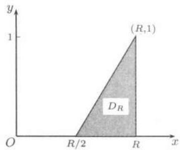

import Guide from '@/components/Guide.astro';
import Knowledge from '@/components/Knowledge.astro';
import Example from '@/components/Example.astro';
import Solution from '@/components/Solution.astro';
import Note from '@/components/Note.astro';
import Block from '@/components/Block.astro';
import Method from '@/components/Method.astro';

## 22.1.1 二重积分的定义

在形式上与一元函数的定积分类似, 可对二元函数的重积分定义如下:

设二元函数 $f$ 在可求面积的有界区域 $D \subset \mathbf{R}^2$ 上定义, 如果存在极限

$$
\lim _ {\| T \| \rightarrow 0} \sum f (\xi_ {i}, \eta_ {i}) \Delta \sigma_ {i},\tag{22.1}
$$

则称 $f$ 在 $D$ 上可积, 并称其极限值为 $f$ 在 $D$ 上的二重积分, 记为

$$
\iint_ {D} f (x, y) \mathrm{d} x \mathrm{d} y.
$$

在$(22.1)$中， $T$ 是 $D$ 的任一分划， $\| T\|$ 为子区域的最大直径， $\sigma_{i}$ 为第 $i$ 个可求面积的子区域， $\Delta \sigma_{i}$ 为 $\sigma_{i}$ 的面积， $(\xi_i,\eta_i)$ 是 $\sigma_{i}$ 中任一点.

在上述定义中有两点是要加以特别说明的. 第一, 怎样定义可求面积的区域? 如何定义分划 $T$ 使子区域均可求面积? 第二, 为什么要用子区域的最大直径来刻画分划的模 $\| T\|$ ? 对于第二点比较容易理解. 因为如果用子区域的最大面积来刻画分划的模的话, 即使子区域的面积很小, 但在同一子区域的点可能相距很远. 因此“以直代曲”就不可能在一个小范围内实现. 对于第一点, 现行教科书中有两类解决的方案. 在一些教科书上是先考虑在矩形区域上的二重积分 (见 [36, 8] 等), 因而分划 $T$ 自然是用直线网来实现. 把 $D$ 分成有限个小矩形, $(22.1)$ 式的含义也是很清楚的. 对于一般的区域 $D$ 上函数 $f$ 的二重积分, 通过 $f$ 对 $D$ 的特征函数

$$
f _ {D} (x, y) = \left\{ \begin{array}{l l} f (x, y), & \text {当} (x, y) \in D \text {时}, \\ 0, & \text {其他} \end{array} \right.
$$

来过渡. 第二类方案 (见 [24, 11, 28, 9] 等) 是先定义平面区域的面积. 一个平面区域 $D$ 可求面积是指 $\forall \varepsilon > 0$ , 存在有限个矩形组成的多边形 $\Sigma_1, \Sigma_2$ , 使 $\Sigma_1 \subset D \subset \Sigma_2$ , 且使得 $\Sigma_2$ 的面积 - $\Sigma_1$ 的面积 $< \varepsilon$ . 又如果一条曲线可用有限个面积任意小的矩形覆盖, 则称这条曲线是零面积的. 平面区域 $D$ 可求面积的充分必要条件为边界 $\partial D$ 是零面积的. 因此分划 $T$ 是用有限条零面积的曲线网来实现的. 读者可参考相应的教科书对这个定义作进一步的理解.

## 22.1.2 可积函数类

先引进平面 $\mathbf{R}^2$ 内的零测度集 (参见上册 $304$ 页关于一维零测度集的定义). 设 $S$ 是 $\mathbf{R}^2$ 内的一个点集, 如果 $\forall \varepsilon > 0$ , 存在可列个矩形 $\Delta_{1}, \Delta_{2}, \cdots, \Delta_{n}, \cdots$ , 使得

(1) $\sum_{n=1}^{\infty} \Delta_n \supset S$ , 即矩形集 $\{\Delta_n\}$ 覆盖了 $S$ ,

(2) $\sum_{n=1}^{\infty} |\Delta_n| < \varepsilon$ , 其中 $|\Delta_n|$ 为 $\Delta_n$ 的面积,

则称 $S$ 是 $\mathbf{R}^2$ 内的一个零测度集. 注意零面积集必是零测度集, 但零测度集不一定是零面积集. 例如 $\mathbf{R}^2$ 中有理点全体组成的集是零测度集, 但不是零面积集.

与一元函数的定积分类似, 我们有如下的可积充分必要条件 (参见上册 $304$ 页的 $Lebesgue$ 定理).

<Knowledge title="命题22.1.1">
设 $D$ 为可求面积的有界闭区域，$f$ 是定义在 $D$ 上的有界函数，则 $f$ 在 $D$ 上可积的充分必要条件是 $f$ 在 $D$ 上的所有不连续点的集合是零测度集。
</Knowledge>

命题22.1.1的证明可参见[28]等. 由命题22.1.1立得: $D$ 上的连续函数是可积的; 只有至多可列个不连续点的有界函数是可积的; 甚至若有界函数 $f$ 的所有不连续点组成 $D$ 的有限条零测度的曲线, 则 $f$ 也是可积的.

二重积分的性质与一元函数的定积分完全类似, 这里不再重复. 如不作特殊申明, 以下均假设 $D$ 为可求面积的有界闭区域.

<Example title="例题22.1.1">
设曲线 $l: x = \varphi(t), y = \psi(t), \alpha \leqslant t \leqslant \beta$ ，其中 $\varphi, \psi$ 连续，且至少其中之一有连续导数，则曲线 $l$ 的面积为零。

<Solution title="证明">
不妨设 $\varphi(t)$ 在闭区间 $[\alpha,\beta]$ 上连续, $\psi(t)$ 有连续导函数. $\forall\varepsilon>0$ , 可作分割 $\alpha=t_{0}<t_{1}<\cdots<t_{n}=\beta$ , 使当 $s,t\in[t_{j-1},t_{j}], j=1,2,\cdots,n$ 时有

$$
| \varphi (s) - \varphi (t) | <   \varepsilon .
$$

令

$$
a _ {j} = \min _ {t _ {j - 1} \leqslant t \leqslant t _ {j}} \{\varphi (t) \}, \quad b _ {j} = \max _ {t _ {j - 1} \leqslant t \leqslant t _ {j}} \{\varphi (t) \},
$$

则有

$$
b _ {j} - a _ {j} \leqslant \varepsilon , j = 1, 2, \dots , n,
$$

又令

$$
c _ {j} = \min _ {t _ {j - 1} \leqslant t \leqslant t _ {j}} \{\psi (t) \}, d _ {j} = \max _ {t _ {j - 1} \leqslant t \leqslant t _ {j}} \{\psi (t) \}, I _ {j} = [ a _ {j}, b _ {j} ] \times [ c _ {j}, d _ {j} ],
$$

于是当 $t \in [t_{j-1}, t_j]$ 时 $(\varphi(t), \psi(t)) \in I_j$ ，故曲线 $l \subset \bigcup_{j=1}^{n} I_j$ 。由于 $\psi'(t)$ 在闭区间 $[\alpha, \beta]$ 上连续，所以

$$
| \psi^ {\prime} (t) | <   M, \quad \alpha \leqslant t \leqslant \beta .
$$

由微分中值定理得

$$
d _ {j} - c _ {j} \leqslant M (t _ {j} - t _ {j - 1}), j = 1, 2, \dots , n,
$$

因而

$$
\sum_ {j = 1} ^ {n} | I _ {j} | \leqslant \sum_ {j = 1} ^ {n} \varepsilon M (t _ {j} - t _ {j - 1}) = \varepsilon M (\beta - \alpha),
$$

其中 $|I_j|$ 表示矩形 $I_{j}$ 的面积. 因为 $\varepsilon$ 是任意的, 故曲线 $l$ 的面积为零.
</Solution>

在后面我们将要遇到的大多数区域 (如 $x$ 型区域、 $y$ 型区域) 都是由有限条满足上例条件的曲线段所围成的, 因此这样的区域都是可求面积的.
</Example>

<Example title="例题22.1.2">
设有界非负函数 $f$ 在区域 $D$ 上可积, 证明: 积分

$$
\iint_ {D} f (x, y) \mathrm{d} x \mathrm{d} y = 0\tag{22.2}
$$

的充分必要条件是 $f$ 在其连续点处的值均为零 (参见上册 $333$ 页题 $9$).

<Solution title="证明">
先证必要性. 用反证法. 若不然, 存在 $p_0(x_0, y_0) \in D$ , $f$ 在点 $p_0$ 连续, 且 $f(x_0, y_0) > 0$ . 由连续函数的局部保号性定理知存在 $\delta > 0$ , 使得

$$
f (x, y) > \frac {1}{2} f (x _ {0}, y _ {0}), \forall (x, y) \in O _ {\delta} (\boldsymbol {p} _ {0}) \subset D.
$$

于是

$$
\iint_ {D} f (x, y) \mathrm{d} x \mathrm{d} y \geqslant \iint_ {O _ {\delta} (\boldsymbol {p} _ {0})} \frac {1}{2} f (x _ {0}, y _ {0}) \mathrm{d} x \mathrm{d} y = \frac {\pi}{2} \delta^ {2} f (x _ {0}, y _ {0}) > 0,
$$

与$(22.2)$矛盾.

再证充分性. 设 $f(x, y)$ 在其连续点处的函数值为 $0$. 对任意分划 $T$ 中可求面积的小区域 $\sigma_i$ , 如 $\Delta \sigma_i > 0$ , 则 $\sigma_i$ 不是零测度集. 由可积充分必要条件知在每一个 $\sigma_i$ 内至少有 $f$ 的一个连续点, 记之为 $(\xi_i, \eta_i)$ , 作和数 $\sum_{i=1}^{n} f(\xi_i, \eta_i) \Delta \sigma_i$ , 则

$$
\sum_ {i = 1} ^ {n} f (\xi_ {i}, \eta_ {i}) \Delta \sigma_ {i} = 0.
$$

于是

$$
\iint_ {D} f (x, y) \mathrm{d} x \mathrm{d} y = \lim _ {\| T \| \rightarrow 0} \sum_ {i = 1} ^ {n} f (\xi_ {i}, \eta_ {i}) \Delta \sigma_ {i} = 0.
$$
</Solution>
</Example>

<Example title="例题22.1.3">
设 $D_{R}$ 是由 $x = R$, $y = 0$, $y = \frac{2}{R}x - 1$ 围成, 求

$$
\lim _ {R \rightarrow + \infty} \iint_ {D _ {R}} \mathrm{e} ^ {- x} \arctan \frac {y}{x} \mathrm{d} x \mathrm{d} y.
$$

<Solution title="解">
在图 $22.1$ 中作出了区域 $D_{R}$ 的图形. 由于函数 $e^{-x}\arctan\frac{y}{x}$ 在 $D_{R}$ 上连续, 由积分中值定理, 存在 $(\xi,\eta)\in D_{R}$ , 使得

$$
\begin{array}{r l} \iint_ {D _ {R}} \mathrm{e} ^ {- x} \arctan \frac {y}{x} \mathrm{d} x \mathrm{d} y & = \mathrm{e} ^ {- \xi} \arctan \frac {\eta}{\xi} \cdot | D _ {R} | \\ & = \frac {R}{4} \mathrm{e} ^ {- \xi} \arctan \frac {\eta}{\xi}, \end{array}
$$

其中 $\frac{R}{2} \leqslant \xi \leqslant R, 0 \leqslant \eta \leqslant 1$ . 于是当 $R \to +\infty$ 时

图22.1

$$
\left| \iint_ {D _ {R}} \mathrm{e} ^ {- x} \arctan \frac {y}{x} \mathrm{d} x \mathrm{d} y \right| \leqslant \frac {R}{4} \mathrm{e} ^ {- \frac {R}{2}} \arctan \frac {\eta}{\xi} \longrightarrow 0.
$$
</Solution>
</Example>

## 22.1.3 思考题

1. 设 $f(x, y)$ , $g(x, y)$ 在 $D$ 上可积, 证明: $f(x, y) \cdot g(x, y)$ 也在 $D$ 上可积. 设 $f(x, y)$ 在 $D$ 上可积, 且 $f(x, y) \neq 0$ , 证明: $\frac{1}{f(x, y)}$ 也在 $D$ 上可积.

2. 设 $u = u(x, y)$ 在 $D$ 上可积, $f(u)$ 是 $u$ 的连续函数, 证明: $f(u(x, y))$ 在 $D$ 上可积. 如果 $f(u)$ 仅仅是 $u$ 的可积函数, $f(u(x, y))$ 是否一定在 $D$ 上可积?

3. 设 $f(x, y), g(x, y)$ 在 $D$ 上有界，且在 $D$ 上除了一个零面积集外处处相等，证明： $f(x, y)$ 与 $g(x, y)$ 在 $D$ 上有相同的可积性，可积时有相同的积分值。如果 $f(x, y)$ 与 $g(x, y)$ 在 $D$ 上除了一个零测度集外处处相等，情况又如何？

4. 如果 $f(x, y)$ 在 $\widetilde{D} \subset D$ 上有界可积，且 $D \setminus \widetilde{D}$ 为零面积集。我们可以认为 $f(x, y)$ 在 $D$ 上可积，且其积分值就取 $f(x, y)$ 在 $\widetilde{D}$ 上的积分值。讨论：

(1) $f(x,y) = \sin \frac{1}{(x^2 - 1)^2 + (y^2 - 1)^2}$ 在 $[-1,1] \times [-1,1]$ 上;

(2) $f(x,y) = \arctan{\frac{1}{y - x^2}}$ 在 $[0,1]\times [0,1]$ 上

的可积性.

## 22.1.4 练习题

1. 设 $f(x,y)$ , $g(x,y)$ 都是 $D$ 上的可积函数, 证明:

$$
h (x, y) = \max \{f (x, y), g (x, y) \}
$$

也是 $D$ 上的可积函数.

2. 设 $f(x,y)$ 在点 $\boldsymbol{p}_{0}(x_{0},y_{0})$ 的某邻域中连续, 求

$$
\lim _ {\rho \rightarrow 0} \frac {1}{\pi \rho^ {2}} \iint_ {(x - x _ {0}) ^ {2} + (y - y _ {0}) ^ {2} \leqslant \rho^ {2}} f (x, y) \mathrm{d} x \mathrm{d} y.
$$

3. 证明：

$$
\iint_ {| x | + | y | \leqslant 1} f (x + y) \mathrm{d} x \mathrm{d} y = \int_ {- 1} ^ {1} f (u) \mathrm{d} u.
$$

4. 证明：

$$
\iint_ {D} f (x y) \mathrm{d} x \mathrm{d} y = \ln 2 \int_ {1} ^ {2} f (u) \mathrm{d} u,
$$

其中 $D$ 为 $xy = 1$, $xy = 2$, $y = x$, $y = 4x$ 在第一象限所围成的区域.
