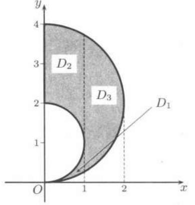
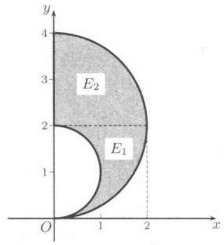
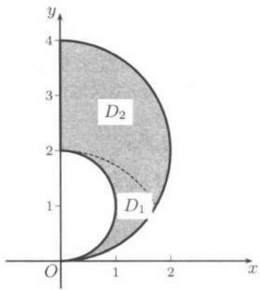
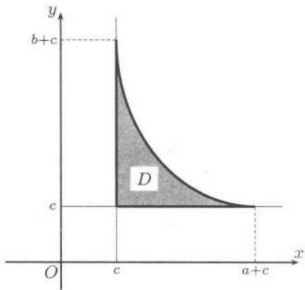
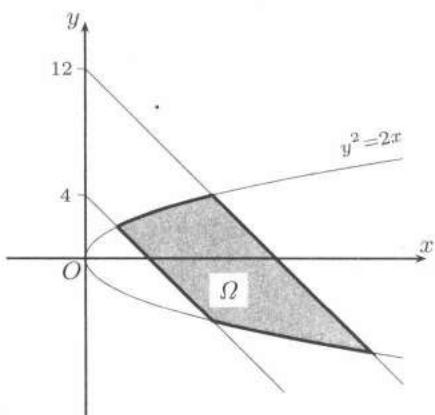

import Guide from '@/components/Guide.astro';
import Knowledge from '@/components/Knowledge.astro';
import Example from '@/components/Example.astro';
import Solution from '@/components/Solution.astro';
import Note from '@/components/Note.astro';
import Block from '@/components/Block.astro';
import Method from '@/components/Method.astro';

## $22.2.1$ 矩形区域上的二重积分

矩形上的二重积分在一定条件下可以化为二次积分进行计算.

设 $f(x,y)$ 在矩形 $A = [a,b]\times [c,d]$ 上可积，且对每个固定的 $x\in [a,b]$ ，积分

$$
\varphi (x) = \int_ {c} ^ {d} f (x, y) \mathrm{d} y
$$

存在, 则 $\varphi(x)$ 在 $[a, b]$ 上可积, 并且

$$
\iint_ {A} f (x, y) \mathrm{d} x \mathrm{d} y = \int_ {a} ^ {b} \mathrm{d} x \int_ {c} ^ {d} f (x, y) \mathrm{d} y.
$$

由此可以看出, 若 $f(x,y)$ 在 $A$ 上连续, 则两个二次积分是相等的 (都等于二重积分), 积分值与积分顺序无关. 但积分顺序不同时, 积分的难度可能相差很大. 请看下面的例子.

<Example title="例题 $22.2.1$">

设 $A = [0,1]\times [0,1]$ ，求

$$
I = \iint_ {A} \frac {y \mathrm{d} x \mathrm{d} y}{(1 + x ^ {2} + y ^ {2}) ^ {3 / 2}}.
$$

<Solution title="解">

先对 $y$ 后对 $x$ 积分, 得到

$$
\begin{array}{r l} I & = \int_ {0} ^ {1} \mathrm{d} x \int_ {0} ^ {1} \frac {y \mathrm{d} y}{(1 + x ^ {2} + y ^ {2}) ^ {3 / 2}} \\ & = \int_ {0} ^ {1} \left(\frac {1}{\sqrt {x ^ {2} + 1}} - \frac {1}{\sqrt {x ^ {2} + 2}}\right) \mathrm{d} x = \ln \frac {2 + \sqrt {2}}{1 + \sqrt {3}}. \end{array}
$$

先对 $x$ 后对 $y$ 积分，则得到

$$
\begin{array}{r l} I & = \int_ {0} ^ {1} y \mathrm{d} y \int_ {0} ^ {1} \frac {\mathrm{d} x}{(1 + x ^ {2} + y ^ {2}) ^ {3 / 2}} \\ & = \int_ {0} ^ {1} y \left[ \frac {1}{1 + y ^ {2}} \cdot \frac {x}{(1 + x ^ {2} + y ^ {2}) ^ {1 / 2}} \Big | _ {x = 0} ^ {x = 1} \right] \mathrm{d} y \\ & = \int_ {0} ^ {1} \frac {y \mathrm{d} y}{(1 + y ^ {2}) (2 + y ^ {2}) ^ {1 / 2}} (\sqrt {2 + y ^ {2}} = t) \\ & = \int_ {\sqrt {2}} ^ {\sqrt {3}} \frac {\mathrm{d} t}{t ^ {2} - 1} = \frac {1}{2} \ln \frac {t - 1}{t + 1} \Big | _ {\sqrt {2}} ^ {\sqrt {3}} = \frac {1}{2} \ln \frac {(\sqrt {3} - 1) (\sqrt {2} + 1)}{(\sqrt {3} + 1) (\sqrt {2} - 1)} \\ & = \frac {1}{2} \ln \frac {2 (\sqrt {2} + 1) ^ {2}}{(\sqrt {3} + 1) ^ {2}} = \ln \frac {2 + \sqrt {2}}{1 + \sqrt {3}}. \end{array}
$$

</Solution>

</Example>

在 $f$ 不满足可积或累次可积的条件时, 情况就比较复杂, 请看下面反例.

<Example title="例题 $22.2.2$">

设函数 $f$ 定义在 $A = [0,1] \times [0,1]$ 上，

$$
f (x, y) = \left\{ \begin{array}{l l} 1, & \text {当} x \text {是无理数}, \\ 2 y, & \text {当} x \text {是有理数}, \end{array} \right.
$$

则 (1) $f$ 在 $A$ 上不可积;

(2) $\int_{0}^{1}\mathrm{d}x\int_{0}^{1}f(x,y)\mathrm{d}y$ 存在, $\int_{0}^{1}\mathrm{d}y\int_{0}^{1}f(x,y)\mathrm{d}x$ 不存在.

<Solution title="证明">

(1) $\forall y \in [0,1]$ , $y \neq \frac{1}{2}$ , $f(x,y)$ 作为 $x$ 的函数在 $[0,1]$ 内处处不连续, 所以 $f(x,y)$ 在 $A$ 上的 $y \neq \frac{1}{2}$ 的每点处都不连续. 于是 $f$ 在 $A$ 上不可积.

(2) 由于

$$
\int_ {0} ^ {1} f (x, y)   \mathrm{d} y = \left\{ \begin{array}{l l}  \int_ {0} ^ {1} \mathrm{d} y = 1, & \text {当} x \text {为无理数}, \\  \int_ {0} ^ {1} 2 y   \mathrm{d} y = 1, & \text {当} x \text {为有理数}, \end{array} \right.
$$

所以

$$
\int_ {0} ^ {1} \mathrm{d} x \int_ {0} ^ {1} f (x, y) \mathrm{d} y = \int_ {0} ^ {1} \mathrm{d} x = 1.
$$

另一方面， $\forall y \in [0,1], y \neq \frac{1}{2}, f(x,y)$ 作为 $x$ 的一元函数，在 $[0,1]$ 内每一点处都不连续，于是 $\int_0^1 f(x,y) \mathrm{d}x$ 对每个 $y \neq \frac{1}{2}$ 都不存在，从而

$$
\int_ {0} ^ {1} \mathrm{d} y \int_ {0} ^ {1} f (x, y) \mathrm{d} x
$$

不存在.

</Solution>

</Example>

类似地, 也有二重积分存在, 但两个二次积分不存在以及两个二次积分存在且相等, 但二重积分不存在的例子.

## $22.2.2$ 一般区域上的二重积分

设 $f$ 是区域 $D$ 上的可积函数, 又设 $D$ 可以表示为 $x$ 型区域:

$$
D = \{(x, y) \mid y _ {1} (x) \leqslant y \leqslant y _ {2} (x), a \leqslant x \leqslant b \},
$$

其中 $y_{1}(x)$ , $y_{2}(x)$ 为 $x$ 的函数, 且对每一个固定的 $x \in [a, b]$ , 积分

$$
\varphi (x) = \int_ {y _ {1} (x)} ^ {y _ {2} (x)} f (x, y) \mathrm{d} y
$$

存在, 则 $\varphi(x)$ 在 $[a, b]$ 上可积, 且 $f$ 在 $D$ 上的二重积分可化为先对 $y$ 后对 $x$ 的积分

$$
\iint_ {D} f (x, y) \mathrm{d} x \mathrm{d} y = \int_ {a} ^ {b} \mathrm{d} x \int_ {y _ {1} (x)} ^ {y _ {2} (x)} f (x, y) \mathrm{d} y.
$$

同样地, 如果区域 $D$ 可以表示为 $y$ 型区域

$$
D = \{(x, y) \mid x _ {1} (y) \leqslant x \leqslant x _ {2} (y), c \leqslant y \leqslant d \},
$$

其中 $x_{1}(y)$ , $x_{2}(y)$ 为 $y$ 的函数, 且对每一个固定的 $y \in [a, b]$ , 积分

$$
\psi (y) = \int_ {x _ {1} (y)} ^ {x _ {2} (y)} f (x, y) \mathrm{d} x
$$

存在, 则 $\psi(y)$ 在 $[c,d]$ 上可积, 且有

$$
\iint_ {D} f (x, y) \mathrm{d} x \mathrm{d} y = \int_ {c} ^ {d} \mathrm{d} y \int_ {x _ {1} (y)} ^ {x _ {2} (y)} f (x, y) \mathrm{d} x.
$$

对于一般区域, 如区域可分成若干个不相交的 $x$ 型区域和 $y$ 型区域的并, 则可先分别计算这些区域上积分的值, 然后通过积分的区域可加性求原积分的值.

在具体计算时, 应根据积分区域和被积函数的情况, 以方便计算为原则, 权衡利弊, 决定采用哪种积分区域的分解与积分顺序. 画出积分区域的草图往往有助于做出正确的选择.

<Example title="例题 $22.2.3$">

设区域 $D = \{(x,y)\mid 2y\leqslant x^2 +y^2\leqslant 4y,x\geqslant 0\}$ .分别将 $D$ 表示为 $x$ 型区域和 $y$ 型区域.

解 (1) 表示为 $x$ 型区域, $D$ 可分为三块 (见图$22.2$), 其中

$$
D _ {1} = \left\{ \begin{array}{l} 0 \leqslant x \leqslant 1, \\ 2 - \sqrt {4 - x ^ {2}} \leqslant y \leqslant 1 - \sqrt {1 - x ^ {2}}, \end{array} \right.
$$

$$
D _ {2} = \left\{ \begin{array}{l} 0 \leqslant x \leqslant 1, \\ 1 + \sqrt {1 - x ^ {2}} \leqslant y \leqslant 2 + \sqrt {4 - x ^ {2}}, \end{array} \right.
$$

$$
D _ {3} = \left\{ \begin{array}{l l} 1 \leqslant x \leqslant 2, \\ 2 - \sqrt {4 - x ^ {2}} \leqslant y \leqslant 2 + \sqrt {4 - x ^ {2}}. \end{array} \right.
$$

(2) 表示为 $y$ 型区域, $D$ 可分为两块 (见图 $22.3$), 其中

$$
E _ {1} = \left\{ \begin{array}{l l} 0 \leqslant y \leqslant 2, \\ \sqrt {2 y - y ^ {2}} \leqslant x \leqslant \sqrt {4 y - y ^ {2}}, \end{array} \right. E _ {2} = \left\{ \begin{array}{l l} 2 \leqslant y \leqslant 4, \\ 0 \leqslant x \leqslant \sqrt {4 y - y ^ {2}}. \end{array} \right.
$$

  
图$22.2$

  
图$22.3$

</Example>

当 $f(x,y)$ 中含有 $x^{2} + y^{2}$ 项或 $D$ 的边界表达式中有 $x^{2} + y^{2}$ 项，则可利用

$$
\iint_ {D} f (x, y) \mathrm{d} x \mathrm{d} y = \iint_ {D} f (r \cos \theta , r \sin \theta) r \mathrm{d} r \mathrm{d} \theta\tag{22.3}
$$

先化为极坐标下的二重积分, 然后化为关于 $r$ 和 $\theta$ 的二次积分去求解.

<Example title="例题 $22.2.4$">

将例题 $22.2.3$ 中的区域 $D$ 分解为 $\theta$ 型区域与 $r$ 型区域.

解 在极坐标系中, $D$ 的边界

$$
x ^ {2} + y ^ {2} = 2 y, x ^ {2} + y ^ {2} = 4 y, x = 0
$$

分别为

$$
r = 2 \sin \theta , r = 4 \sin \theta , \theta = \frac {\pi}{2}.
$$

于是表示为 $\theta$ 型区域是

$$
0 \leqslant \theta \leqslant \frac {\pi}{2}, \quad 2 \sin \theta \leqslant r \leqslant 4 \sin \theta ;
$$

表示为 $r$ 型区域为 (见图 $22.4$):

$$
D _ {1} = \left\{ \begin{array}{l l} 0 \leqslant r \leqslant 2, \\ \arcsin \frac {r}{4} \leqslant \theta \leqslant \arcsin \frac {r}{2}, \end{array} \right.
$$

$$
D _ {2} = \left\{ \begin{array}{l l} 2 \leqslant r \leqslant 4, \\ \arcsin \frac {r}{4} \leqslant \theta \leqslant \frac {\pi}{2}. \end{array} \right.
$$

  
图$22.4$

</Example>

<Example title="例题 $22.2.5$">

求 $\lim_{R\to +\infty}\iint \limits_{\substack{|x|\leqslant R\\ |y|\leqslant R}}(x^2 +y^2)\mathrm{e}^{-(x^2 +y^2)}\mathrm{d}x\mathrm{d}y.$

<Solution title="解">

记

$$
I _ {R} = \iint_ {\substack {| x | \leqslant R \\ | y | \leqslant R}} (x ^ {2} + y ^ {2}) \mathrm{e} ^ {- (x ^ {2} + y ^ {2})} \mathrm{d} x \mathrm{d} y,
$$

$$
C _ {R} = \iint_ {x ^ {2} + y ^ {2} \leqslant R ^ {2}} (x ^ {2} + y ^ {2}) \mathrm{e} ^ {- (x ^ {2} + y ^ {2})} \mathrm{d} x \mathrm{d} y,
$$

则 $C_R \leqslant I_R \leqslant C_{2R}$ , 且

$$
\begin{array}{r l}C _ {R}&= \int_ {0} ^ {2 \pi} \mathrm{d} \theta \int_ {0} ^ {R} r ^ {3} \mathrm{e} ^ {- r ^ {2}} \mathrm{d} r = \pi \int_ {0} ^ {R ^ {2}} t \mathrm{e} ^ {- t} \mathrm{d} t\\&= \pi (1 - \mathrm{e} ^ {- R ^ {2}} - R ^ {2} \mathrm{e} ^ {- R ^ {2}}) \longrightarrow \pi \quad (R \rightarrow + \infty).\end{array}
$$

同理可证 $C_{2R}\to \pi (R\to +\infty)$ .于是

$$
\lim _ {R \rightarrow + \infty} I _ {R} = \pi .
$$

</Solution>

</Example>

<Example title="例题 $22.2.6$">

作极坐标变换, 将二重积分

$$
\iint_ {D} f \left(\sqrt {x ^ {2} + y ^ {2}}\right) \mathrm{d} x \mathrm{d} y
$$

化为定积分, 其中 $D=\{(x,y)\mid0\leqslant y\leqslant x\leqslant1\}$ .

<Solution title="解">

令 $x = r\cos \varphi, y = r\sin \varphi,$ 则

$$
\begin{array}{r l} & \iint_ {D} f (\sqrt {x ^ {2} + y ^ {2}}) \mathrm{d} x \mathrm{d} y = \iint_ {D} f (r) r \mathrm{d} r \mathrm{d} \varphi \\ & = \int_ {0} ^ {1} \mathrm{d} r \int_ {0} ^ {\pi / 4} f (r) r \mathrm{d} \varphi + \int_ {1} ^ {\sqrt {2}} \mathrm{d} r \int_ {\arccos (1 / r)} ^ {\pi / 4} f (r) r \mathrm{d} \varphi \\ & = \frac {\pi}{4} \int_ {0} ^ {1} f (r) r \mathrm{d} r + \int_ {1} ^ {\sqrt {2}} \left(\frac {\pi}{4} - \arccos \frac {1}{r}\right) f (r) r \mathrm{d} r \\ & = \frac {\pi}{4} \int_ {0} ^ {\sqrt {2}} f (r) r \mathrm{d} r - \int_ {1} ^ {\sqrt {2}} \arccos \frac {1}{r} f (r) r \mathrm{d} r. \end{array}
$$

</Solution>

</Example>

## $22.2.3$ 二重积分的变量替换

极坐标变换 (见 ($22.3$) 式) 是一种特殊的变量替换, 下面是一般的变量替换定理. 设

$$
x = x (u, v), \quad y = y (u, v), \quad (u, v) \in D ^ {\prime},
$$

这一代换满足：

(1) 建立了 $D$ 与 $D'$ 之间的一一对应;

(2) $x, y$ 在 $D'$ 上具有关于各个变元的连续偏导数，并且其逆变换 $u = u(x, y)$ ， $v = v(x, y)$ 在 $D$ 上也具有关于各个变元的连续偏导数；

(3) 代换的 Jacobi 行列式 $J = \frac{\partial(x, y)}{\partial(u, v)}$ 在 $D'$ 内无零点 (称这代换为正则), 则

$$
\iint_ {D} f (x, y) \mathrm{d} x \mathrm{d} y = \iint_ {D ^ {\prime}} f (x (u, v), y (u, v)) \left| \frac {\partial (x , y)}{\partial (u , v)} \right| \mathrm{d} u \mathrm{d} v.\tag{22.4}
$$

回忆一下 (一元) 定积分的变量替换公式, 容易看出公式 ($22.4$) 是定积分的变量替换公式的推广. 定理的证明要比一元情况复杂得多, 请参考相应的教科书.

<Example title="例题 $22.2.7$">

求由曲线 $\left(\frac{x^2}{a^2} + \frac{y^2}{b^2}\right)^2 = \frac{x^2}{a^2} - \frac{y^2}{b^2}$ 所围的面积.

<Solution title="解">

应用广义极坐标变换

$$
x = a \rho \cos \theta , \quad y = b \rho \sin \theta ,
$$

则 $J = \left|\frac{\partial(x,y)}{\partial(u,v)}\right| = ab\rho ,$ 所围成积分区域的曲线变为 $\rho^2 = \cos 2\theta$ （双纽线），于是所求的面积

$$
S = \iint_ {D} \mathrm{d} x \mathrm{d} y = 4 \int_ {0} ^ {\pi / 4} \mathrm{d} \theta \int_ {0} ^ {\sqrt {\cos 2 \theta}} a b \rho \mathrm{d} \rho = a b.
$$

</Solution>

</Example>

<Example title="例题 $22.2.8$">

求 $\iint_{D} \left( \sqrt{\frac{x - c}{a}} + \sqrt{\frac{y - c}{b}} \right) \mathrm{d}x \mathrm{d}y$ ，其中 $D$ 由曲线 $\sqrt{\frac{x - c}{a}} + \sqrt{\frac{y - c}{b}} = 1$ 和 $x = c, y = c$ 所围成，并且 $a, b, c > 0$ .

<Solution title="解">

见图 $22.5$, 被积函数与积分区域的部分边界具有相同的形式, 因此要设法把被积函数表达式化成简单的形式.

$$
\begin{array}{r l} & {\text {令}} \\ & {x = c + a \rho \cos^ {4} \theta , \quad y = c + b \rho \sin^ {4} \theta ,} \\ & {\text {则}} \end{array}
$$

$$
J = \left| \frac {\partial (x , y)}{\partial (\rho , \theta)} \right| = 4 a b \rho \cos^ {3} \theta \sin^ {3} \theta .
$$

而积分区域变为 $\{0 \leqslant \theta \leqslant \frac{\pi}{2}, 0 \leqslant \rho \leqslant 1\}$ ,
于是

  
图$22.5$

$$
\iint_ {D} \left(\sqrt {\frac {x - c}{a}} + \sqrt {\frac {y - c}{b}}\right) \mathrm{d} x \mathrm{d} y = \int_ {0} ^ {\pi / 2} \mathrm{d} \theta \int_ {0} ^ {1} 4 a b \rho \cos^ {3} \theta \sin^ {3} \theta \sqrt {\rho} \mathrm{d} \rho = \frac {2 a b}{1 5}.
$$

</Solution>

<Note>

注 一般而言, 广义极坐标变换

$$
x = \frac {1}{a} \left(c + r ^ {\frac {1}{p}} \cos^ {\frac {2}{p}} \theta\right), \quad y = \frac {1}{b} \left(d + r ^ {\frac {1}{p}} \sin^ {\frac {2}{p}} \theta\right),
$$

能把 $(ax - c)^p + (by - d)^p$ 变为 $r$ , 但其中的 $r, \theta$ 一般不再具有通常的极径, 极角的意义.

</Note>

</Example>

<Example title="例题 $22.2.9$">

求 $I=\iint_{\Omega}(x+y)\,\mathrm{d}x\,\mathrm{d}y$ ，其中 $\Omega$ 是由 $y^{2}=2x, x+y=4, x+y=12$ 围成.

<Solution title="解">

积分区域如图 $22.6$, 作变换

$$
u = x + y, \quad v = y,
$$

则变换后的积分区域为

$$
\begin{array}{c} {4 \leqslant u \leqslant 1 2,} \\ {- 1 - \sqrt {2 u + 1} \leqslant v \leqslant - 1 + \sqrt {2 u + 1},} \end{array}
$$

且 $J = \left|\frac{\partial(x,y)}{\partial(u,v)}\right| = 1.$ 于是

$$
\begin{array}{r l} I & = \int_ {4} ^ {1 2} u \mathrm{d} u \int_ {- 1 - \sqrt {2 u + 1}} ^ {- 1 + \sqrt {2 u + 1}} \mathrm{d} v \\ & = \int_ {4} ^ {1 2} 2 u \sqrt {2 u + 1} \mathrm{d} u \quad (\sqrt {2 u + 1} = t) \\ & = \int_ {3} ^ {5} (t ^ {2} - 1) t ^ {2} \mathrm{d} t = \frac {8 1 5 6}{1 5}. \end{array}
$$

  
图$22.6$

</Solution>

</Example>

<Method title="利用对称性与奇偶性简化二重积分">

函数的奇偶性和积分区域的对称性常可用来简化积分的计算，如

1. 积分区域 $D$ 关于 $x$ 轴对称, 且有: (1) $f(x,y) = -f(x,-y)$ , 则 $\iint_{D} f(x,y) \, dx \, dy = 0$ ; (2) $f(x,y) = f(x,-y)$ , 则 $\iint_{D} f(x,y) \, dx \, dy = 2 \iint_{D \cap \{y \geqslant 0\}} f(x,y) \, dx \, dy$ .

2. 积分区域 $D$ 关于 $y$ 轴对称, 且有: (1) $f(x,y) = -f(-x,y)$ , 则 $\iint_{D} f(x,y) \mathrm{d}x \mathrm{d}y = 0$ ; (2) $f(x,y) = f(-x,y)$ , 则 $\iint_{D} f(x,y) \mathrm{d}x \mathrm{d}y = 2 \iint_{D \cap \{x \geqslant 0\}} f(x,y) \mathrm{d}x \mathrm{d}y$ .

3. 若 $D$ 关于原点对称, 且有: (1) $f(x,y) = -f(-x, -y)$ , 则 $\iint_{0} f(x,y) \, \mathrm{d}x \, \mathrm{d}y = 0$ ;

(2) $f(x,y)=f(-x,-y)$ ，则 $\iint_{D}f(x,y)\mathrm{d}x\mathrm{d}y=2\iint_{D_{1}}f(x,y)\mathrm{d}x\mathrm{d}y$ ，其中 $D_{1}$ 是区域 $D$ 的一半.

</Method>

## $22.2.4$ 练习题

<Block title="$22.2.4$ 练习题">

1. 试把累次积分

$$
I = \int_ {0} ^ {R / \sqrt {1 + R ^ {2}}} \mathrm{d} x \int_ {0} ^ {R x} f (x, y) \mathrm{d} y + \int_ {R / \sqrt {1 + R ^ {2}}} ^ {R} \mathrm{d} x \int_ {0} ^ {\sqrt {R ^ {2} - x ^ {2}}} f (x, y) \mathrm{d} y
$$

改写为先对 $x$ 后对 $y$ 的累次积分形式.

2. 设 $f(x)$ 在 $[0,1]$ 上连续, 证明:

$$
\int_ {0} ^ {1} \mathrm{d} x \int_ {x} ^ {1} f (t) \mathrm{d} t = \int_ {0} ^ {1} t f (t) \mathrm{d} t.
$$

3. $D$ 由 $y = \pi - x, x = \pi, y = \pi$ 围成，求 $\iint_{D} \frac{\sin x}{x} \, \mathrm{d}x \, \mathrm{d}y.$

4. $D$ 由 $y = 0, y = x^{2}, x + y = 2$ 围成的第一象限的部分，求 $\iint_{D} (x^{2} + y^{2}) \, dx \, dy$ .

5. 求由 $(x^{2} + y^{2})^{2} = a^{2}(x^{2} - y^{2}), z = x^{2} - y^{2}, z = 0$ 围成之立体的体积.

6. 设 $D$ 是由 $x^{2}=ay, x^{2}=by, y^{2}=px, y^{2}=qx$ 所围成的区域, 其中 $0<a<b$, $0<p<q$, 求 $\iint_{D}\frac{x^{2}\sin xy}{y}dx dy$ .

7. 证明: $\int_{a}^{b} \mathrm{d}y \int_{a}^{y} (y - x)^{n} f(x) \, \mathrm{d}x = \frac{1}{n + 1} \int_{a}^{b} (b - x)^{n + 1} f(x) \, \mathrm{d}x$ .

8. 设 $D$ 是第一象限内由 $y$ 轴及两个圆 $x^{2} + y^{2} = a^{2}, x^{2} - 2ax + y^{2} = 0$ 所围成的区域, 求 $\iint_{D} \sqrt{x^{2} + y^{2}} \, dx \, dy$ .

9. 求由四条直线 $x + y = p, x + y = q, y = ax, y = bx$ ($0 < p < q, 0 < a < b$) 所围成的图形的面积.

10. 求由曲线 $\sqrt[4]{\frac{x}{a}} + \sqrt[4]{\frac{y}{b}} = 1$ 与直线 $x = 0, y = 0$ 所围成图形的面积.

11. 求 $\iint_{D} f(\sqrt{x^2 + y^2}) \, \mathrm{d}x \, \mathrm{d}y$ , 其中 $D = \{(x, y) \mid |y| < |x| \leqslant 1\}$ .

12. 求 $\iint_{D} x \, dx \, dy$ ，其中 $D$ 由 $xy = 1, x^{2} + y^{2} = 4$ 围成.

13. 给定积分 $I = \iint_{D} \left[ \left( \frac{\partial f}{\partial x} \right)^2 + \left( \frac{\partial f}{\partial y} \right)^2 \right] \mathrm{d}x \mathrm{~d}y,$ 作正则变换 $x = x(u,v), y = y(u,v)$ , 区域 $D$ 变为 $\Omega$ , 如果变换满足

$$
\frac {\partial x}{\partial u} = \frac {\partial y}{\partial v}, \quad \frac {\partial x}{\partial v} = - \frac {\partial y}{\partial u},
$$

证明：

$$
I = \iint_ {\Omega} \left[ \left(\frac {\partial f}{\partial u}\right) ^ {2} + \left(\frac {\partial f}{\partial v}\right) ^ {2} \right] \mathrm{d} u \mathrm{d} v.
$$

14. 求积分

$$
\int_ {0} ^ {\sqrt {2}} \mathrm{d} y \int_ {y} ^ {\sqrt {4 - y ^ {2}}} \frac {1}{\sqrt {1 + x ^ {2} + y ^ {2}}} \mathrm{d} x.
$$

15. 证明：

$$
\iint_ {| x | + | y | \leqslant 1} \left(\sqrt {| x y |} + | x y |\right) \mathrm{d} x \mathrm{d} y \leqslant \frac {3}{2}.
$$

16. 计算二重积分

$$
I = \iint_ {D} | x - y ^ {2} | \mathrm{d} x \mathrm{d} y,
$$

其中 $D=\{(x,y)\mid0\leqslant x\leqslant1,-1\leqslant y\leqslant1\}$ .

17. 求 $\iint_{D}\ln\frac{x}{y^{2}}dx dy,$ 其中 $D$ 是由 $y=x, y=1, x=2$ 围成的三角形.

</Block>
