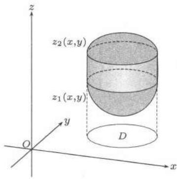
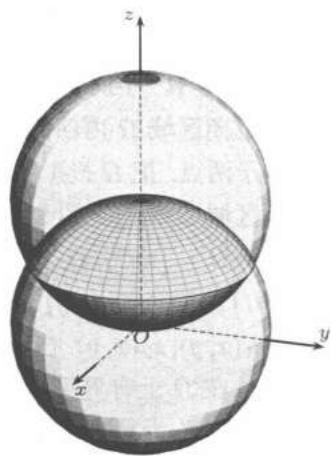
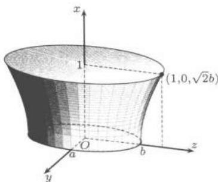

import Guide from '@/components/Guide.astro';
import Knowledge from '@/components/Knowledge.astro';
import Example from '@/components/Example.astro';
import Solution from '@/components/Solution.astro';
import Note from '@/components/Note.astro';
import Block from '@/components/Block.astro';
import Method from '@/components/Method.astro';

三重积分的定义与二重积分类似, 这里不再重复.

## $22.3.1$ 三重积分在直角坐标系中的计算

<Method title="先一后二">
即先做一次关于某个变量的单积分，然后做关于另外两个变量的二重积分.

设 $\Omega$ 是 $\mathbf{R}^{3}$ 中的有界区域, 假设平行于 $z$ 轴且穿过闭区域 $\Omega$ 内部的直线与 $\Omega$ 的边界相交不多于两点. 把 $\Omega$ 投影到 $xOy$ 平面上, 得一平面闭区域 $D$ , 即 (见图 $22.7$):

$$
\begin{array}{c} \Omega = \{(x, y, z) \mid (x, y) \in D, \\ z _ {1} (x, y) \leqslant z \leqslant z _ {2} (x, y) \}, \end{array}
$$

其中 $z_{1}(x,y), z_{2}(x,y)$ 在 $D$ 上连续. 如果 $f(x,y,z)$ 在 $\Omega$ 上有界可积, 且对任意 $(x,y)\in D$, $f(x,y,z)$ 作为 $z$ 的函数在 $[z_1(x,y), z_2(x,y)]$ 上可积, 则

  
图 $22.7$

$$
\iiint_ {D} f (x, y, z) \mathrm{d} x \mathrm{d} y \mathrm{d} z = \iint_ {D} \mathrm{d} x \mathrm{d} y \int_ {z _ {1} (x, y)} ^ {z _ {2} (x, y)} f (x, y, z) \mathrm{d} z.
$$

此种积分方法称为“先一后二”.
</Method>

<Method title="先二后一">
即先作关于某两个变量的二重积分, 然后做关于另一个变量的单积分. 这种积分方法对区域没有任何特殊要求. 设

$$
\Omega = \{(x, y, z) \mid a \leqslant z \leqslant b, (x, y) \in D (z) \},
$$

其中 $D(z)$ 是 $xOy$ 平面上随 $z$ 连续变化的有界闭区域. 如果 $f(x,y,z)$ 在 $\Omega$ 上有界可积, 对任意 $z \in [a,b]$, $f(x,y,z)$ 作为 $x,y$ 的函数在 $D(z)$ 上可积, 则

$$
\iiint_ {D} f (x, y, z) \mathrm{d} x \mathrm{d} y \mathrm{d} z = \int_ {a} ^ {b} \mathrm{d} z \iint_ {D (z)} f (x, y, z) \mathrm{d} x \mathrm{d} y.
$$

对这个公式可这样来理解：把 $\Omega$ 看作是一个物质立体, $f(x, y, z)$ 为物质在 $\Omega$ 上的分布密度, 那么上式左端的三重积分就是物质立体的质量. 而上式右端则表明先把立体切成薄片, 再把所有薄片的质量积累起来.

当然, 我们不一定非固定 $z$ 而先计算关于 $x, y$ 的二重积分不可, 也可根据被积函数的具体情况和积分域的构成, 把 $y$ (或 $x$ ) 固定而先计算关于 $z, x$ (或 $y, z$ ) 的二重积分.
</Method>

<Example title="例题 $22.3.1$">
求积分

$$
I = \iiint_ {\Omega} z ^ {2} \mathrm{d} x \mathrm{d} y \mathrm{d} z,
$$

其中 $\Omega$ 为两个球 $x^{2} + y^{2} + z^{2}\leqslant R^{2}, x^{2} + y^{2} + z^{2}\leqslant 2Rz$ 的公共部分.

<Solution title="解">

先画出积分区域, 如图 $22.8$.

综合被积函数和积分区域, 可把积分视成在 $z \in [0, R]$ 上一系列带权 $z^{2}$ 的小薄片的求和. 根据积分区域 $\Omega$ 的构成情况, 可将 $\Omega$ 分成两个子区域 $\Omega_{1}$ 与 $\Omega_{2}$ .

$$
\Omega_ {1}: \left\{ \begin{array}{l} x ^ {2} + y ^ {2} + z ^ {2} \leqslant 2 R z, \\ 0 \leqslant z \leqslant \frac {R}{2}, \end{array} \right.
$$

$$
\Omega_ {2}: \left\{ \begin{array}{l} x ^ {2} + y ^ {2} + z ^ {2} \leqslant R ^ {2}, \\ \frac {R}{2} \leqslant z \leqslant R. \end{array} \right.
$$

当 $z \in \left[0, \frac{R}{2}\right]$ 时, 由 $x^{2} + y^{2} + z^{2} \leqslant 2Rz$ 可得到薄片面积为 $\pi(2Rz - z^2)$ .

  
图 $22.8$

当 $z \in \left[\frac{R}{2}, R\right]$ 时, 由 $x^{2} + y^{2} + z^{2} \leqslant R^{2}$ 可得到薄片面积为 $\pi(R^{2} - z^{2})$ 。所以

$$
\begin{array}{r l} I & = \int_ {0} ^ {R / 2} \pi z ^ {2} (2 R z - z ^ {2}) \mathrm{d} z + \int_ {R / 2} ^ {R} \pi z ^ {2} (R ^ {2} - z ^ {2}) \mathrm{d} z \\ & = \left(\frac {1}{2} \pi R z ^ {4} - \frac {1}{5} \pi z ^ {5}\right) \Big | _ {0} ^ {R / 2} + \left(\frac {1}{3} \pi R ^ {2} z ^ {3} - \frac {1}{5} \pi z ^ {5}\right) \Big | _ {R / 2} ^ {R} = \frac {5 9}{4 8 0} \pi R ^ {5}. \end{array}
$$

</Solution>
</Example>

## $22.3.2$ 三重积分的变量替换

类似于二重积分的变量替换, 有如下三重积分变量替换定理.

<Knowledge title="三重积分变量替换定理">
设

$$
x = x (u, v, w), \quad y = y (u, v, w), \quad z = z (u, v, w), \quad (u, v, w) \in \Omega^ {\prime}.
$$

这一代换满足：

(1) 建立了 $\Omega$ 与 $\Omega'$ 之间的一一对应;

(2) $x, y, z$ 在 $\Omega'$ 上关于各个变元有连续偏导数, 并且逆变换 $u = u(x, y, z)$ , $v = v(x, y, z)$ , $w = w(x, y, z)$ 在 $\Omega$ 上也关于各个变元有连续偏导数;

(3) 代换的 $Jacobi$ 行列式 $J = \frac{\partial(x, y, z)}{\partial(u, v, w)}$ 在 $\Omega'$ 内没有零点, 则

$$
\iiint_ {\Omega} f (x, y, z) \mathrm{d} x \mathrm{d} y \mathrm{d} z = \iiint_ {\Omega^ {\prime}} f (x (u, v, w), y (u, v, w), z (u, v, w)) \left| \frac {\partial (x , y , z)}{\partial (u , v , w)} \right| \mathrm{d} u \mathrm{d} v \mathrm{d} w.
$$
</Knowledge>

常用的三重积分变换有下列两个.

<Method title="柱坐标变换">

$$
\begin{array}{c} {x = \rho \cos \theta , y = \rho \sin \theta , z = z,} \\ {0 \leqslant \rho <   + \infty , 0 \leqslant \theta <   2 \pi , - \infty <   z <   + \infty .} \end{array}
$$

空间直角坐标系下的三重积分与柱坐标系下的三重积分的关系是

$$
\iiint_ {\Omega} f (x, y, z) \mathrm{d} x \mathrm{d} y \mathrm{d} z = \iiint_ {\Omega^ {\prime}} f (\rho \cos \theta , \rho \sin \theta , z) \rho \mathrm{d} \rho \mathrm{d} \theta \mathrm{d} z.
$$

如果积分区域为柱形或被积函数中含有 $x^{2} + y^{2}$ 项, 则往往将积分在柱坐标系中计算. 在计算时, 常常是把三重积分化为对 $z$ 的单积分与关于 $\rho ,\theta$ 的二重积分来计算, 至于是“先一后二”, 还是“先二后一”, 那要看具体情况.

我们可以看出, 柱坐标变换就是 $z$ 不变, 而将 $x, y$ 用极坐标变换. 在二重积分中我们曾提到广义极坐标变换, 因此对应过来也有广义柱坐标变换.
</Method>

<Method title="球坐标变换">

$$
\begin{array}{r l} & x = \rho \sin \varphi \cos \theta , y = \rho \sin \varphi \sin \theta , z = \rho \cos \varphi , \\ & 0 \leqslant \rho <   + \infty , 0 \leqslant \theta <   2 \pi , 0 \leqslant \varphi \leqslant \pi . \end{array}
$$

空间直角坐标系下的三重积分与球坐标系下的三重积分的关系是

$$
\iiint_ {\Omega} f (x, y, z) \mathrm{d} x \mathrm{d} y \mathrm{d} z = \iiint_ {\Omega^ {\prime}} f (\rho \sin \varphi \cos \theta , \rho \sin \varphi \sin \theta , \rho \cos \varphi) \rho^ {2} \sin \varphi \mathrm{d} \rho \mathrm{d} \theta \mathrm{d} \varphi .
$$
</Method>

<Note>
利用球坐标系计算三重积分, 一般说来适用于积分区域是球心在原点或过原点而球心在坐标轴上的球体, 顶点在原点以坐标轴为旋转轴的圆锥体以及被积函数中出现 $x^{2} + y^{2} + z^{2}$ 的三重积分.

使用球坐标时对 $\rho, \theta, \varphi$ 的几何意义要十分清楚. 比如在我们上面给出的球坐标变换下, $\rho$ 是球半径 $(0 \leqslant \rho \leqslant +\infty)$, $\theta$ 是转动角 $(0 \leqslant \theta \leqslant 2\pi)$, $\varphi$ 是仰角 (与 $z$ 轴正向的夹角, $0 \leqslant \varphi \leqslant \pi$). 在有的教科书上给出了几种不相同的球坐标系, 建议只取一种记忆, 以免混淆. 此外对应于二重积分的广义极坐标变换, 也有广义球坐标变换.
</Note>

## $22.3.3$ 例题

<Example title="例题 $22.3.2$">

求 $I = \iiint_{\Omega} (x + y) \, \mathrm{d}x \, \mathrm{d}y \, \mathrm{d}z$ ，其中 $\Omega$ 为由 $x = 0, x = 1, x^2 + 1 = \frac{y^2}{a^2} + \frac{z^2}{b^2}$ 所围成.

<Solution title="解">

由积分区域 (见图 $22.9$) 的构成宜采用“先二后一”的积分次序.

$$
I = \int_ {0} ^ {1} \mathrm{d} x \iint_ {D (x)} (x + y) \mathrm{d} y \mathrm{d} z,
$$

其中 $D(x) = \{(x,y,z)\mid \frac{y^2}{a^2} +\frac{z^2}{b^2}\leqslant 1 + x^2\}.$ 对于二重积分 $\iint_{D(x)}y\mathrm{d}y\mathrm{d}z$, 由于 $D(x)$ 在 $yOz$ 平面上的投影关于原点对称, 且 $f(y,z) = y = -f(-y, - z)$. 由 $22.2.3$ 小节中最后一部分关于简化积分的说明知 $\iint_{D(x)}y\mathrm{d}y\mathrm{d}z = 0$, 而

  
图 $22.9$

$$
\iint_ {D (x)} x \mathrm{d} y \mathrm{d} z = \pi a b x (1 + x ^ {2}).
$$

于是

$$
I = \pi a b \int_ {0} ^ {1} x (1 + x ^ {2}) \mathrm{d} x = \frac {3}{4} \pi a b.
$$

</Solution>
</Example>

<Example title="例题 $22.3.3$">

计算积分

$$
H = \iiint \limits_{\substack{x,y,z\geqslant 0\\ x^{2} + y^{2} + z^{2}\leqslant R^{2}}}\frac{xyz\mathrm{d}x\mathrm{d}y\mathrm{d}z}{\sqrt{a^{2}x^{2} + b^{2}y^{2} + c^{2}z^{2}}},\quad \text{其中} a > b > c > 0.
$$

<Solution title="解">

在球坐标下

$$
H = \int_ {0} ^ {\pi / 2} \int_ {0} ^ {\pi / 2} \int_ {0} ^ {R} \frac {r ^ {4} \sin^ {3} \varphi \cos \varphi \sin \theta \cos \theta \mathrm{d} r \mathrm{d} \varphi \mathrm{d} \theta}{\sqrt {a ^ {2} \sin^ {2} \varphi \cos^ {2} \theta + b ^ {2} \sin^ {2} \varphi \sin^ {2} \theta + c ^ {2} \cos^ {2} \varphi}}.
$$

令 $\sin^2\varphi = u,\sin^2\theta = v$ ，则

$$
\begin{array}{l} H = \frac {1}{4} \int_ {0} ^ {1} \int_ {0} ^ {1} \int_ {0} ^ {R} r ^ {4} \frac {u \mathrm{d} r \mathrm{d} u \mathrm{d} v}{\sqrt {a ^ {2} u (1 - v) + b ^ {2} u v + c ^ {2} (1 - u)}} \\ = \frac {1}{2 0} R ^ {5} \int_ {0} ^ {1} u \mathrm{d} u \int_ {0} ^ {1} \frac {\mathrm{d} v}{\sqrt {[ c ^ {2} + (a ^ {2} - c ^ {2}) u ] + (b ^ {2} - a ^ {2}) u v}} \\ = \frac {1}{2 0} R ^ {5} \int_ {0} ^ {1} \left\{\frac {2}{(b ^ {2} - a ^ {2}) u} \sqrt {[ c ^ {2} + (a ^ {2} - c ^ {2}) u ] + (b ^ {2} - a ^ {2}) u v} \right\} \Big | _ {v = 0} ^ {v = 1} u \mathrm{d} u \\ = \frac {R ^ {5}}{1 0 (b ^ {2} - a ^ {2})} \int_ {0} ^ {1} \left\{\sqrt {[ c ^ {2} + (a ^ {2} - c ^ {2}) u ] + (b ^ {2} - a ^ {2}) u} - \sqrt {c ^ {2} + (a ^ {2} - c ^ {2}) u} \right\} \mathrm{d} u \\ = \frac {R ^ {5}}{1 0 (b ^ {2} - a ^ {2})} \left\{\frac {2}{3 (b ^ {2} - c ^ {2})} [ c ^ {2} + (b ^ {2} - c ^ {2}) u ] ^ {\frac {3}{2}} - \frac {2}{3 (a ^ {2} - c ^ {2})} [ c ^ {2} + (a ^ {2} - c ^ {2}) u ] ^ {\frac {3}{2}} \right\} \Big | _ {0} ^ {1} \\ = \frac {R ^ {5}}{1 0 (b ^ {2} - a ^ {2})} \left[ \frac {2}{3 (b ^ {2} - c ^ {2})} (b ^ {3} - c ^ {3}) - \frac {2}{3 (a ^ {2} - c ^ {2})} (a ^ {3} - c ^ {3}) \right] \\ = \frac {R ^ {5}}{1 5} \cdot \frac {1}{b ^ {2} - a ^ {2}} \left(\frac {b ^ {2} + b c + c ^ {2}}{b + c} - \frac {a ^ {2} + a c + c ^ {2}}{a + c}\right) \\ = \frac {R ^ {5}}{1 5} \cdot \frac {a b + b c + c a}{(a + b) (b + c) (c + a)}. \end{array}
$$

□

</Solution>
</Example>

<Example title="例题 $22.3.4$">

设 $H(\boldsymbol{x}) = \sum_{i,j = 1}^{3}a_{ij}x_{i}x_{j}$, $\boldsymbol{A} = (a_{ij})$ 是 $3$ 阶正定对称阵. 求

$$
I = \iiint_ {H (\boldsymbol{x}) \leqslant 1} \mathrm{e} ^ {\sqrt {H (\boldsymbol{x})}} \mathrm{d} x _ {1} \mathrm{d} x _ {2} \mathrm{d} x _ {3}.
$$

<Solution title="解">

存在 $3$ 阶正交矩阵 $\boldsymbol{P}$, 使得

$$
\boldsymbol {P} ^ {\mathrm{T}} \boldsymbol {A} \boldsymbol {P} = \left( \begin{array}{c c c} \lambda_ {1} & 0 & 0 \\ 0 & \lambda_ {2} & 0 \\ 0 & 0 & \lambda_ {3} \end{array} \right),
$$

其中 $\lambda_{i} > 0$, $i = 1,2,3$ . 作正交变换 $\boldsymbol{x} = \boldsymbol{P} \boldsymbol{y}$ , 这里 $\boldsymbol{x}, \boldsymbol{y} \in \mathbf{R}^{3}$ , 则

$$
H (\boldsymbol{x}) = H (\boldsymbol{P} \boldsymbol{y}) = \lambda_ {1} y _ {1} ^ {2} + \lambda_ {2} y _ {2} ^ {2} + \lambda_ {3} y _ {3} ^ {2},
$$

且变换的 $Jacobi$ 行列式 $\operatorname{det}\boldsymbol{P}\equiv 1$ ，从而

$$
I = \iiint_ {\lambda_ {1} y _ {1} ^ {2} + \lambda_ {2} y _ {2} ^ {2} + \lambda_ {3} y _ {3} ^ {2} \leqslant 1} \mathrm{e} ^ {\sqrt {\lambda_ {1} y _ {1} ^ {2} + \lambda_ {2} y _ {2} ^ {2} + \lambda_ {3} y _ {3} ^ {2}}} \mathrm{d} y _ {1} \mathrm{d} y _ {2} \mathrm{d} y _ {3}.
$$

令

$$
\begin{array}{l} {y _ {1} = \frac {1}{\sqrt {\lambda_ {1}}} r \sin \varphi \cos \theta , y _ {2} = \frac {1}{\sqrt {\lambda_ {2}}} r \sin \varphi \sin \theta ,} \\ {y _ {3} = \frac {1}{\sqrt {\lambda_ {3}}} r \cos \varphi ,} \end{array}
$$

则

$$
\begin{array}{r l} I & = \frac {1}{\sqrt {\lambda_ {1} \lambda_ {2} \lambda_ {3}}} \int_ {0} ^ {2 \pi} \mathrm{d} \theta \int_ {0} ^ {\pi} \mathrm{d} \varphi \int_ {0} ^ {1} r ^ {2} \mathrm{e} ^ {r} \sin \varphi \mathrm{d} r \\ & = \frac {4 \pi}{\sqrt {\lambda_ {1} \lambda_ {2} \lambda_ {3}}} \int_ {0} ^ {1} r ^ {2} \mathrm{e} ^ {r} \mathrm{d} r = \frac {4 \pi}{\sqrt {\lambda_ {1} \lambda_ {2} \lambda_ {3}}} (\mathrm{e-2}). \end{array}
$$

由于 $\boldsymbol{A}$ 的行列式 $\det \boldsymbol{A} = \lambda_{1} \lambda_{2} \lambda_{3}$ ，所以

$$
I = \frac {4 \pi}{\sqrt {\det \boldsymbol{A}}} (\mathrm{e} - 2).
$$

</Solution>

<Note>
正交变换是一种很有用的坐标变换. 它的特点是刚体变换, 仅仅旋转坐标轴, 保持区域体积不变. 特别是保持单位球不变.
</Note>
</Example>

## $22.3.4$ $n$ 重积分

以四重积分为例, 按照三重积分的思路, 可以采用“先一后三”或者“先三后一”或者“先二后二”的积分次序, 而对于其中的“三”或者“二”, 则采用三重积分或者二重积分化累次积分的方法. 也可以用四维的变量替换.

<Example title="例题 $22.3.5$">

求四维空间中的单位球

$$
x ^ {2} + y ^ {2} + z ^ {2} + t ^ {2} \leqslant a ^ {2}
$$

的体积 $V$.

<Solution title="解">

用四维空间中的球坐标变换

$$
\begin{array}{l l} x = r \sin \varphi_ {1} \sin \varphi_ {2} \cos \theta , & y = r \sin \varphi_ {1} \sin \varphi_ {2} \sin \theta , \\ z = r \sin \varphi_ {1} \cos \varphi_ {2}, & t = r \cos \varphi_ {1}, \end{array}\tag{22.5}
$$

$$
\tag{22.6}
$$

其中 $0 \leqslant r \leqslant a, 0 \leqslant \theta < 2\pi, 0 \leqslant \varphi_1, \varphi_2 \leqslant \pi$ ，则

$$
\left| \frac {\partial (x , y , z , t)}{\partial (r , \varphi_ {1} , \varphi_ {2} , \theta)} \right| = r ^ {3} \sin^ {2} \varphi_ {1} \sin \varphi_ {2}.
$$

于是

$$
\begin{array}{l} V = \iiint_ {x ^ {2} + y ^ {2} + z ^ {2} + t ^ {2} \leqslant a ^ {2}} \mathrm{d} x \mathrm{d} y \mathrm{d} z \mathrm{d} t \\ = \int_ {0} ^ {2 \pi} \mathrm{d} \theta \int_ {0} ^ {\pi} \mathrm{d} \varphi_ {1} \int_ {0} ^ {\pi} \mathrm{d} \varphi_ {2} \int_ {0} ^ {a} r ^ {3} \sin^ {2} \varphi_ {1} \sin \varphi_ {2} \mathrm{d} r \\ = \frac {\pi a ^ {4}}{2} \int_ {0} ^ {\pi} \sin^ {2} \varphi_ {1} \mathrm{d} \varphi_ {1} \int_ {0} ^ {\pi} \sin \varphi_ {2} \mathrm{d} \varphi_ {2} = \frac {\pi^ {2} a ^ {4}}{2}. \end{array}
$$

</Solution>
</Example>

## $22.3.5$ 练习题

<Block title="练习题">

1. 计算积分

$$
\int_ {0} ^ {1} \mathrm{d} x \int_ {0} ^ {1 - x} \mathrm{d} z \int_ {0} ^ {1 - z - x} (1 - y) \mathrm{e} ^ {- (1 - y - z) ^ {2}} \mathrm{d} y.
$$

2. 将累次积分

$$
\int_ {0} ^ {2} \mathrm{d} x \int_ {- \sqrt {2 x - x ^ {2}}} ^ {0} \mathrm{d} y \int_ {0} ^ {x} f (x, y, z) \mathrm{d} z
$$

化为在柱坐标系下的累次积分.

3. 求 $\iiint_{\Omega}(x^{2}+y^{2})\mathrm{d}x\mathrm{d}y\mathrm{d}z,$ 其中 $\Omega$ 是由曲线 $y^{2}=2z, x=0$ 绕 $z$ 轴旋转而成的曲面，平面 $z=2$ 与平面 $z=8$ 所围成的区域.

4. 求 $\iiint_{\Omega} xyz \, dx \, dy \, dz$ ，其中 $\Omega$ 为 $x^{2} + y^{2} + z^{2} \leqslant 4$ 与 $x^{2} + y^{2} + (z - 2)^{2} \leqslant 4$ 的公共部分，且 $x \geqslant 0, y \geqslant 0$.

5. 求 $\iiint_{\Omega}\frac{dx\,dy\,dz}{r}$ ，其中 $\Omega$ 为一半径为 $R$ 的球，$r$ 为球外一固定点到球域内任一点的距离.

6. 计算积分 $I = \iiint_{\Omega} \frac{xyz}{x^{2} + y^{2}} \, dx \, dy \, dz$ ，其中 $\Omega$ 由曲面 $(x^{2} + y^{2} + z^{2})^{2} = a^{2}xy$ 与平面 $z = 0$ 所围成，曲面在上方，平面在下方.

7. 求

$$
\iiint \limits_{\substack{x,y,z,u\geqslant 0\\ x^{2} + y^{2} + z^{2} + u^{2}\leqslant 1}}\sqrt{\frac{1 - x^{2} - y^{2} - z^{2} - u^{2}}{1 + x^{2} + y^{2} + z^{2} + u^{2}}}\mathrm{d}x\mathrm{d}y\mathrm{d}z\mathrm{d}u.
$$

8. 设

$$
F (t) = \iiint_ {x ^ {2} + y ^ {2} + z ^ {2} \leqslant t ^ {2}} f (x ^ {2} + y ^ {2} + z ^ {2}) \mathrm{d} x \mathrm{d} y \mathrm{d} z,
$$

其中 $f$ 为连续函数, $f(1)=1$. 证明: $F'(1)=4\pi$.

9. 设 $f(x, y, z) = \sqrt{x^2 + y^2 + z^2}$ , 区域 $\Omega \subset \mathbf{R}^3$ 由 $z \geqslant \sqrt{x^2 + y^2}$ 和 $4 \leqslant x^2 + y^2 + z^2 \leqslant 16$ 所确定, 试计算函数 $f$ 关于 $\Omega$ 的积分平均值

$$
\frac {1}{| \Omega |} \iiint_ {\Omega} f (x, y, z) \mathrm{d} x \mathrm{d} y \mathrm{d} z,
$$

其中 $|\Omega|$ 是 $\Omega$ 的体积.

10. 设区域 $\Omega$ 由 $z = x^{2} + y^{2}, z = 0, xy = 1, xy = 2, y = 3x, y = 4x$ 所围成，求积分

$$
I = \iiint_ {\Omega} x ^ {2} y ^ {2} z \mathrm{d} x \mathrm{d} y \mathrm{d} z.
$$

11. 利用正交变换计算三重积分 $\iiint_{V} \cos(ax + by + cz) \, \mathrm{d}x \, \mathrm{d}y \, \mathrm{d}z$ . 其中 $V: x^2 + y^2 + z^2 \leqslant 1$, $a, b, c$ 是不全为零的常数.

</Block>
