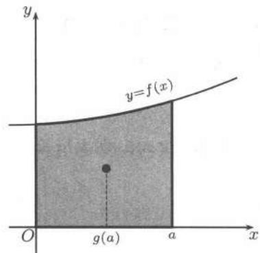

import Guide from '@/components/Guide.astro';
import Knowledge from '@/components/Knowledge.astro';
import Example from '@/components/Example.astro';
import Solution from '@/components/Solution.astro';
import Note from '@/components/Note.astro';
import Block from '@/components/Block.astro';
import Method from '@/components/Method.astro';

除前面提到的用重积分计算曲面所围的空间几何体的体积和物体的质量外，重积分还有许多其他应用。本节再举一些例子。

## $22.5.1$ 几何应用

类似于上册 §$11.1$ 所介绍的，几何、物理上计算重积分时也经常采用比较简捷的产生积分的方法——微元法。即根据计算的目的把问题归结到一系列很小的面积元素或体积元素（微元）上，然后对这些微元进行相应的几何或是物理量的分析，分析完后把得到的对每个特定的微元的结果看成为带“权”的微元（当然此时的“权”与位置有关），然后按面积或体积求和。比如前面 $22.3.1$ 小节中介绍的先一后二的计算三重积分的方法可看成在给定区域 $D$ 上每一个带“权”的“小竖条”

$$
\left(\int_{z_{1}(x,y)}^{z_{2}(x,y)} f(x,y) \mathrm{d} z\right) \mathrm{d} x \mathrm{d} y
$$

的求和。上式括号中的积分可看成“高度”，$\mathrm{d}x\mathrm{d}y$ 表示微元的底面积。先二后一的计算方法则是在区间上具有带“权”面积的“小薄片”

$$
\left(\iint_{D(z)} f(x,y,z) \mathrm{d} x \mathrm{d} y\right) \mathrm{d} z
$$

的求和。上式括号中的积分可视为“面积”，$\mathrm{d}z$ 是微元的厚度。在引力计算中，就要考虑每个引力微元，它是体积微元所受到的引力。微元法思维对准确、快速计算重积分十分有用。下面先介绍微元法在几何应用中的一些具体例子。

### 旋转体的体积

<Example title="例题22.5.1">
设 $V$ 是由曲线 $x = \varphi(z)$, $a \leqslant z \leqslant b$, 绕 $z$ 轴旋转而围成的体积，这里曲线不与 $z$ 轴相交且旋转体被 $z = a$ 和 $z = b$ 所围住。证明公式

$$
V = \pi \int_{a}^{b} \varphi^{2}(z) \mathrm{d} z.
$$

<Solution title="证明">
把 $V$ 视为一个由一系列垂直于 $z$ 轴的小薄片（小圆盘）所组成的体积，则在 $z$ 处，圆盘面积为 $\pi \varphi^{2}(z)$，厚度为 $\mathrm{d}z$，薄片体积微元为 $\mathrm{d}V = \pi \varphi^{2}(z)$，因而

$$
V = \pi \int_{a}^{b} \varphi^{2}(z) \mathrm{d} z.
$$
</Solution>
</Example>

### 曲面的面积

曲面面积的定义需小心对待，见相应的教科书或 $25.1.1$ 小节。我们这里用微元法给出一些曲面面积的计算公式，其中假定曲面面积是存在的。

先设曲面 $S$ 由方程

$$
z = f(x,y), \quad (x,y) \in D
$$

表示，其中 $D$ 是平面上可求面积的有界区域，$f(x,y)$ 是连续可微函数。给定平面上一个小的可求面积区域 $\Delta D$，我们用“以平代曲”的方法计算其对应的曲面微元 $\Delta S$，即计算 $S$ 对应于 $\Delta D$ 那部分的切平面面积，以之取作 $\Delta S$ 的近似值。为此取 $(\xi, \eta) \in \Delta D$。设 $S$ 在点 $(\xi, \eta, f(\xi, \eta))$ 处的法向量为

$$
\boldsymbol{n} = (\cos \alpha, \cos \beta, \cos \gamma).
$$

再记对应于 $\Delta D$ 那部分的切平面面积为 $\Delta \sigma$，则由投影定理有

$$
\Delta \sigma = \frac{\Delta D}{|\cos \gamma|}.
$$

根据法向量的表达，有

$$
\boldsymbol{n} = (f_{x}(\xi, \eta), f_{y}(\xi, \eta), \pm 1).
$$

因此

$$
\cos \gamma = \frac{\pm 1}{\sqrt{1 + f_{x}^{2}(\xi, \eta) + f_{y}^{2}(\xi, \eta)}}.
$$

即

$$
\Delta S \approx \Delta \sigma = \sqrt{1 + f_{x}^{2}(\xi, \eta) + f_{y}^{2}(\xi, \eta)} \Delta D.
$$

这样我们就得到了面积微分

$$
\mathrm{d} S = \sqrt{1 + f_{x}^{2}(x,y) + f_{y}^{2}(x,y)} \mathrm{d} x \mathrm{d} y.
$$

曲面面积即为

$$
S = \iint_{D} \sqrt{1 + f_{x}^{2}(x,y) + f_{y}^{2}(x,y)} \mathrm{d} x \mathrm{d} y.
$$

如果曲面 $S$ 由参数方程

$$
x = x(u,v), \quad y = y(u,v), \quad z = z(u,v), \quad (u,v) \in D
$$

表示，其中 $D$ 是参数平面上可求面积的区域，$x(u,v)$，$y(u,v)$，$z(u,v)$ 在 $D$ 上有连续偏导数，则

$$
\mathrm{d} S = \sqrt{EG - F^{2}} \mathrm{d} u \mathrm{d} v,
$$

其中

$$
\begin{array}{l}
E = x_{u}^{2} + y_{u}^{2} + z_{u}^{2},\\
F = x_{u} x_{v} + y_{u} y_{v} + z_{u} z_{v},\\
G = x_{v}^{2} + y_{v}^{2} + z_{v}^{2}.
\end{array}
$$

因而

$$
S = \iint_{D} \sqrt{EG - F^{2}} \mathrm{d} u \mathrm{d} v.
$$

<Example title="例题22.5.2">
设连续曲线 $z = \varphi(x)$, $a \leqslant x \leqslant b$, 绕 $z$ 轴旋转所得曲面为 $\Sigma$。求 $\Sigma$ 的面积 $S$。

<Solution title="解">
用柱坐标把 $\Sigma$ 参数化，有

$$
\begin{array}{c}
x = r \cos \theta, \quad y = r \sin \theta, \quad z = \varphi(r),\\
a \leqslant r \leqslant b, \quad 0 \leqslant \theta \leqslant 2\pi.
\end{array}
$$

故

$$
\begin{array}{c}
E = 1 + (\varphi'(r))^{2}, \quad F = 0, \quad G = r^{2},\\
S = \int_{0}^{2\pi} \mathrm{d} \theta \int_{a}^{b} r \sqrt{1 + (\varphi'(r))^{2}} \mathrm{d} r = 2\pi \int_{a}^{b} r \sqrt{1 + (\varphi'(r))^{2}} \mathrm{d} r.
\end{array}
$$
</Solution>
</Example>

如果以 $z = \varphi(x)$ 的曲线弧长 $s$ 为参数，而以 $u(s)$ 表示 $s$ 处曲线到 $z$ 轴的距离，$u'(s) \geqslant 0$, $0 \leqslant s \leqslant l$。设 $u(0) = a$, $u(l) = b$，则 $\Sigma$ 的参数方程为

$$
x = u(s) \cos \theta, \quad y = u(s) \sin \theta, \quad z = \varphi(u(s)),
$$

$$
0 \leqslant s \leqslant l, \quad 0 \leqslant \theta \leqslant 2\pi.
$$

故

$$
S = 2\pi \int_{0}^{l} \sqrt{1 + (\varphi'(u(s)))^{2}} \cdot u'(s) u(s) \mathrm{d} s,
$$

其中 $l$ 为曲线的弧长。平面曲线 $z = \varphi(x)$ 在弧长参数下质心的 $x$ 坐标

$$
X_{c} = \frac{1}{l} \int_{0}^{l} \sqrt{1 + (\varphi'(u(s)))^{2}} \cdot u'(s) u(s) \mathrm{d} s.
$$

因此我们重新得到了 $Guldin$ 第一定理（见上册 $342$ 页命题 $11.1.2$）

$$
S = 2\pi X_{c} \cdot l.
$$

如果曲面 $S$ 的密度函数为 $f(x,y,z)$，则其质量为

$$
\iint_{S} f(x,y,z) \mathrm{d} S.
$$

### 移动曲面扫过的体积

下面考虑一个稍微复杂一点的几何问题。

<Example title="例题22.5.3">
设 $V$ 是这样的几何体，它是由参数曲面 $\Sigma_{t}: \varphi(x,y,z) = t$ 自 $t$ 从 $a$ 到 $b$ 所扫成的，证明：$V$ 的体积

$$
|V| = \int_{a}^{b} \left(\iint_{S_{t}} \frac{1}{\sqrt{\varphi_{x}^{2} + \varphi_{y}^{2} + \varphi_{z}^{2}}} \mathrm{d} S\right) \mathrm{d} t,\tag{22.7}
$$

其中 $S_{t}$ 表示曲面 $\Sigma_{t}$ 所对应的曲面区域，$\mathrm{d}S$ 表示曲面 $\Sigma_{t}$ 的面积微分。

<Solution title="证">
关键是考虑 $t$ 到 $t + \Delta t$ 时沿 $\varphi(x,y,z) = t$ 的法向距离的移动。注意到此时的曲面 $\Sigma_{t}$ 在 $(x,y,z)$ 处的法向量为

$$
\boldsymbol{n} = (\varphi_{x}, \varphi_{y}, \varphi_{z}).
$$

考虑曲面随参数 $t$ 的变化的性质。设 $x = x(t), y = y(t), z = z(t)$ 表示了 $\Sigma_{t}$ 中一串连续可微变化的质点，则质点速度为 $(x'(t), y'(t), z'(t))$。注意到质点总满足 $\varphi(x(t), y(t), z(t)) = t$，因而又有

$$
1 = \varphi_{x} x'(t) + \varphi_{y} y'(t) + \varphi_{z} z'(t).
$$

所以从运动角度看，点 $(x,y,z)$ 处的法向速度（即速度在法向上的投影）为

$$
C = \frac{\varphi_{x} x'(t) + \varphi_{y} y'(t) + \varphi_{z} z'(t)}{\sqrt{\varphi_{x}^{2} + \varphi_{y}^{2} + \varphi_{z}^{2}}} = \frac{1}{\sqrt{\varphi_{x}^{2} + \varphi_{y}^{2} + \varphi_{z}^{2}}}.
$$

按微元法，在 $\Delta t$ 时间内 $\Sigma_{t}$ 所移厚度为 $\Sigma_{t}$ 的面积 $\iint_{S_{t}} \mathrm{d}S$ 乘以 $\Delta t$ 的法向分量 $C\Delta t$。从而

$$
|V| = \int_{a}^{b} \left(\iint_{S_{t}} C \mathrm{d} S\right) \mathrm{d} t.
$$
</Solution>
</Example>

$(22.7)$ 是一个一般的公式，它有许多具体的应用。比如，设 $\Sigma_{t}$ 是一个平面图形，则曲面为

$$
\xi(t) x + \eta(t) y + \zeta(t) z = p(t),
$$

其中 $(\xi(t), \eta(t), \zeta(t))$ 为单位法向。设 $\Sigma_{t}$ 上点 $(x(t), y(t), z(t))$ 随 $t$ 连续可微变化。按隐函数求导法则及注意到 $\xi^{2}(t) + \eta^{2}(t) + \zeta^{2}(t) \equiv 1$，我们有

$$
C = - [ \xi'(t) x + \eta'(t) y + \zeta'(t) z - p'(t) ],
$$

因而

$$
- \iint_{S_{t}} C \mathrm{d} S = \xi'(t) \iint_{S_{t}} x \mathrm{d} S + \eta'(t) \iint_{S_{t}} y \mathrm{d} S + \zeta'(t) \iint_{S_{t}} z \mathrm{d} S - p'(t) \iint_{S_{t}} \mathrm{d} S.
$$

设 $(X(t), Y(t), Z(t))$ 是 $\Sigma_{t}$ 的形心坐标，就有

$$
X(t) = \frac{\iint_{S_{t}} x \mathrm{d} S}{\iint_{S_{t}} \mathrm{d} S}, \quad Y(t) = \frac{\iint_{S_{t}} y \mathrm{d} S}{\iint_{S_{t}} \mathrm{d} S}, \quad Z(t) = \frac{\iint_{S_{t}} z \mathrm{d} S}{\iint_{S_{t}} \mathrm{d} S}.
$$

从而

$$
\iint_{S_{t}} C \mathrm{d} S = - [ X(t) \xi'(t) + Y(t) \eta'(t) + Z(t) \zeta'(t) - p'(t) ] \cdot \sigma_{t},\tag{22.8}
$$

其中 $\sigma_{t}$ 是 $\Sigma_{t}$ 的面积。

同时，形心也位于 $\Sigma_{t}$ 上，故有

$$
X(t) \xi(t) + Y(t) \eta(t) + Z(t) \zeta(t) = p(t).
$$

求导并结合 $(22.8)$ 得

$$
\iint_{S_{t}} C \mathrm{d} S = \left[ X'(t) \xi(t) + Y'(t) \eta(t) + Z'(t) \zeta(t) \right] \cdot \sigma_{t}.
$$

注意到上式右端第一个因子正是形心关于 $t$ 的速度在法向上的投影，因此

$$
\int_{a}^{b} \left[ X'(t) \xi(t) + Y'(t) \eta(t) + Z'(t) \zeta(t) \right] \mathrm{d} t = l,
$$

其中 $l$ 为形心所经过的路径长度。特别地，如果 $S_{t}$ 的面积为常值 $A$，应用 $(22.7)$ 式得到

$$
V = A \cdot l.\tag{22.9}
$$

对于由平面图形 $S$ 所成的旋转体，设其形心到旋转轴垂直距离为 $d$，则

$$
V = A \cdot 2\pi d,
$$

这是 $Guldin$ 第二定理（见上册命题 $11.1.3$），因而 $(22.9)$ 称为广义的 $Guldin$ 公式。

## $22.5.2$ 物理应用

### 矩

力学中的某些量常常与物体的密度函数的各阶矩有关。下面讨论三维的情形，二维的情形是类似的。

设 $V$ 是由分片光滑的连续曲面围成的区域。$\mu(x,y,z)$ 在 $V$ 上连续，分别称

$$
M_{x}(k) = \iiint_{V} x^{k} \mu(x,y,z) \mathrm{d} x \mathrm{d} y \mathrm{d} z,
$$

$$
M_{y}(k) = \iiint_{V} y^{k} \mu(x,y,z) \mathrm{d} x \mathrm{d} y \mathrm{d} z,
$$

$$
M_{z}(k) = \iiint_{V} z^{k} \mu(x,y,z) \mathrm{d} x \mathrm{d} y \mathrm{d} z
$$

为密度函数 $\mu$ 关于 $x, y, z$ 的 $k$ 阶矩。利用微元法容易得到

$1.$ 质量 $m = M_{x}(0) = M_{y}(0) = M_{z}(0) = M(0) = \iiint_{V} \mu(x,y,z) \, \mathrm{d} x \, \mathrm{d} y \, \mathrm{d} z.$ 

$2.$ 质心 $(X_{c}, Y_{c}, Z_{c})$，其中

$$
X_{c} = \frac{M_{x}(1)}{M(0)} = \frac{1}{m} \iiint_{V} x \mu(x,y,z) \mathrm{d} x \mathrm{d} y \mathrm{d} z,
$$

$$
Y_{c} = \frac{M_{y}(1)}{M(0)} = \frac{1}{m} \iiint_{V} y \mu(x,y,z) \mathrm{d} x \mathrm{d} y \mathrm{d} z,
$$

$$
Z_{c} = \frac{M_{z}(1)}{M(0)} = \frac{1}{m} \iiint_{V} z \mu(x,y,z) \mathrm{d} x \mathrm{d} y \mathrm{d} z.
$$

$3.$ 转动惯量为

$$
\begin{array}{c}
I_{x} = M_{y}(2) + M_{z}(2), \quad I_{y} = M_{z}(2) + M_{x}(2), \quad I_{z} = M_{x}(2) + M_{y}(2),\\
I_{yz} = M_{x}(2), \quad I_{zx} = M_{y}(2), \quad I_{xy} = M_{z}(2).
\end{array}
$$

<Example title="例题22.5.4">
若直线 $x = 0, x = a, y = 0$ 与正连续曲线 $y = f(x)$ 围成的区域的质心的 $x$ 坐标是 $g(a)$，证明：

$$
f(x) = \frac{A g'(x)}{[x - g(x)]^{2}} \exp\left(\int \frac{\mathrm{d} x}{x - g(x)}\right),
$$

其中 $A$ 为正常数，$a$ 是参数。

<Solution title="证">
见图 $22.10$,

$$
g(a) = \frac{M_{x}(1)}{M(0)} = \frac{\int_{0}^{a} x f(x) \mathrm{d} x}{\int_{0}^{a} f(x) \mathrm{d} x},
$$

即

$$
g(a) \int_{0}^{a} f(x) \mathrm{d} x = \int_{0}^{a} x f(x) \mathrm{d} x.
$$

两边对 $a$ 求导得

$$
g(a) f(a) + g'(a) \int_{0}^{a} f(x) \mathrm{d} x = a f(a).
$$

令 $F(a) = \int_{0}^{a} f(x) \mathrm{d} x$，注意到 $a - g(a) \neq 0$，则

图 $22.10$

$$
\frac{F'(a)}{F(a)} = \frac{g'(a)}{a - g(a)}.
$$

两边对 $a$ 积分，得

$$
\ln F(a) = \int \frac{g'(a)}{a - g(a)} \mathrm{d} a + C.
$$

所以

$$
\int_{0}^{a} f(x) \mathrm{d} x = F(a) = A \exp\left(\int \frac{g'(a)}{a - g(a)} \mathrm{d} a\right).
$$

两边对 $a$ 求导得

$$
f(a) = \frac{A g'(a)}{a - g(a)} \exp\left(\int \frac{g'(a)}{a - g(a)} \mathrm{d} a\right).
$$

考虑到

$$
\begin{array}{r l}
\int \frac{g'(a)}{a - g(a)} \mathrm{d} a & = \int \frac{g'(a) - 1}{a - g(a)} \mathrm{d} a + \int \frac{\mathrm{d} a}{a - g(a)}\\
& = - \ln(a - g(a)) + \int \frac{\mathrm{d} a}{a - g(a)},
\end{array}
$$

则

$$
f(a) = \frac{A g'(a)}{[a - g(a)]^{2}} \exp\left(\int \frac{\mathrm{d} a}{a - g(a)}\right).
$$
</Solution>
</Example>

### 引力

考虑体密度函数为 $\mu(x,y,z)$ 的立体 $V$ 对具有质量 $m$ 的点 $\boldsymbol{p}_{0}(x_{0},y_{0},z_{0})$ 的引力 $\boldsymbol{F}$。由引力定律及微元法得 $\boldsymbol{F} = (F_{x}, F_{y}, F_{z})$，其中

$$
F_{x} = \iiint_{V} \frac{G m \mu(x,y,z) (x - x_{0})}{r^{3}} \mathrm{d} x \mathrm{d} y \mathrm{d} z,
$$

$$
F_{y} = \iiint_{V} \frac{G m \mu(x,y,z) (y - y_{0})}{r^{3}} \mathrm{d} x \mathrm{d} y \mathrm{d} z,
$$

$$
F_{z} = \iiint_{V} \frac{G m \mu(x,y,z) (z - z_{0})}{r^{3}} \mathrm{d} x \mathrm{d} y \mathrm{d} z,
$$

其中 $G$ 为引力常量，$r = \left[(x - x_{0})^{2} + (y - y_{0})^{2} + (z - z_{0})^{2}\right]^{1/2}$。

## $22.5.3$ 重积分与不等式

本段介绍重积分在不等式中的一些应用。先介绍如何用重积分的技巧证明一元的积分不等式。

<Example title="例题22.5.5">
设 $f$ 在 $[0,1]$ 上为正连续函数，证明：

$$
1 \leqslant \int_{0}^{1} \frac{\mathrm{d} x}{f(x)} \int_{0}^{1} f(x) \mathrm{d} x \leqslant \frac{(m + M)^{2}}{4 m M},\tag{22.10}
$$

其中 $m$, $M$ 分别为 $f(x)$ 在 $[0,1]$ 上的最小值和最大值（参见上册 $374$ 页题 $11$）。

<Solution title="证">
设

$$
I = \int_{0}^{1} \frac{\mathrm{d} x}{f(x)} \int_{0}^{1} f(x) \mathrm{d} x = \int_{0}^{1} \frac{\mathrm{d} x}{f(x)} \int_{0}^{1} f(y) \mathrm{d} y = \int_{0}^{1} \int_{0}^{1} \frac{f(y)}{f(x)} \mathrm{d} x \mathrm{d} y.
$$

由对称性

$$
I = \frac{1}{2} \int_{0}^{1} \int_{0}^{1} \left(\frac{f(y)}{f(x)} + \frac{f(x)}{f(y)}\right) \mathrm{d} x \mathrm{d} y.
$$

令 $F(z) = z + \frac{1}{z}$, $z > 0$，则 $F(z) \geqslant 2$, $F''(z) > 0$，故 $F(z)$ 是凸函数。当 $F(\alpha) = F(\beta)$ 时，对 $z \in [\alpha, \beta]$ 有 $F(z) \leqslant F(\alpha) = F(\beta)$。取 $z = \frac{f(y)}{f(x)}$, $\alpha = \frac{m}{M}$, $\beta = \frac{M}{m}$，得

$$
2 \leqslant \frac{f(y)}{f(x)} + \frac{f(x)}{f(y)} \leqslant \frac{m}{M} + \frac{M}{m},
$$

从而

$$
1 \leqslant I \leqslant \frac{m^{2} + M^{2}}{2 m M}.
$$

但这与不等式 $(22.10)$ 相比还不够精确。为此分析 $(22.10)$，由右端的平方启发用算术平均值-几何平均值不等式（上册第 $4$ 页）得

$$
I = \int_{0}^{1} \frac{\mathrm{d} x}{f(x)} \cdot \int_{0}^{1} f(x) \mathrm{d} x \leqslant \frac{1}{4} \left[ \int_{0}^{1} \left(f(x) + \frac{1}{f(x)}\right) \mathrm{d} x \right]^{2}.\tag{22.11}
$$

但当 $m \leqslant f(x) \leqslant M$ 时不能充分利用 $z + \frac{1}{z}$ 的凸性来估计 $f(x) + \frac{1}{f(x)}$。观察 $I$ 的特点，用 $\frac{f(x)}{\sqrt{mM}}$ 替代 $f(x)$ 得

$$
I = \int_{0}^{1} \frac{\sqrt{mM}}{f(x)} \mathrm{d} x \cdot \int_{0}^{1} \frac{f(x)}{\sqrt{mM}} \mathrm{d} x \leqslant \frac{1}{4} \left[ \int_{0}^{1} \left(\frac{f(x)}{\sqrt{mM}} + \frac{\sqrt{mM}}{f(x)}\right) \mathrm{d} x \right]^{2}.
$$

再取 $z = \frac{f(x)}{\sqrt{mM}}$, $\alpha = \sqrt{\frac{m}{M}}$, $\beta = \sqrt{\frac{M}{m}}$，由 $z + \frac{1}{z}$ 的凸性得

$$
I \leqslant \frac{1}{4} \left(\sqrt{\frac{m}{M}} + \sqrt{\frac{M}{m}}\right)^{2} \leqslant \frac{(m + M)^{2}}{4 m M}.
$$

不等式 $(22.10)$ 得证。
</Solution>
</Example>

从上述证明过程可见，对学到的各种方法要善于比较，综合运用（本题还可参见上册 $415$ 页的提示）。下面再举一个通过交换积分次序证明不等式的例子。

<Example title="例题22.5.6">
设 $f$, $\frac{\partial f}{\partial x}$, $\frac{\partial f}{\partial t}$, $\frac{\partial^{2} f}{\partial x^{2}}$ 均为 $[0,1] \times [0,1]$ 中的连续函数，且在 $[0,1] \times [0,1]$ 中成立 $\frac{\partial f}{\partial t} = \frac{\partial^{2} f}{\partial x^{2}}$ 和 $\left|\frac{\partial f}{\partial x}\right| \leqslant 1$.

$(1)$ 证明：对任何 $(x, t_{1}), (x, t_{2}) \in [0, 1] \times [0, 1]$，存在 $\xi \in [0, 1]$，使得 $|\xi - x| \leqslant \frac{1}{2} |t_{1} - t_{2}|$ 且 $|f(\xi, t_{1}) - f(\xi, t_{2})| \leqslant 4|t_{1} - t_{2}|^{\frac{1}{2}}$；

$(2)$ 由 $(1)$ 的结论证明：对任何 $(x, t_{1}), (x, t_{2}) \in [0, 1] \times [0, 1]$ 成立

$$
\left| f(x, t_{1}) - f(x, t_{2}) \right| \leqslant 5 \left| t_{1} - t_{2} \right|^{\frac{1}{2}}.
$$

分析 题目给出了 $f(x,t)$ 在 $x$ 方向上的性质：$\left|\frac{\partial f}{\partial x}\right| \leqslant 1$。由此证明在 $t$ 方向上的性质。可用的条件是 $f$ 在 $x$ 方向和 $t$ 方向之间的关系：$\frac{\partial f}{\partial t} = \frac{\partial^{2} f}{\partial x^{2}}$。我们通过交换累次积分次序来转换。

<Solution title="证">
$(1)$ 由题设

$$
f(x, t_{1}) - f(x, t_{2}) = \int_{t_{1}}^{t_{2}} \frac{\partial f}{\partial t}(x, t) \mathrm{d} t = \int_{t_{1}}^{t_{2}} \frac{\partial^{2} f}{\partial x^{2}}(x, t) \mathrm{d} t.
$$

从而，对任何 $\overline{x} \in [0,1]$，由累次积分次序可交换，成立

$$
\begin{array}{l}
\int_{x}^{\overline{x}} [ f(x, t_{1}) - f(x, t_{2}) ] \mathrm{d} x = \int_{x}^{\overline{x}} \left(\int_{t_{1}}^{t_{2}} \frac{\partial^{2} f}{\partial x^{2}}(x, t) \mathrm{d} t\right) \mathrm{d} x \\
= \int_{t_{1}}^{t_{2}} \left(\int_{x}^{\overline{x}} \frac{\partial^{2} f}{\partial x^{2}}(x, t) \mathrm{d} x\right) \mathrm{d} t = \int_{t_{1}}^{t_{2}} \left(\frac{\partial f}{\partial x}(t, \overline{x}) - \frac{\partial f}{\partial x}(x, t)\right) \mathrm{d} t.
\end{array}
$$

对上式左端应用积分中值定理，右端利用已知条件 $\left|\frac{\partial f}{\partial x}\right| \leqslant 1$，得

$$
\left| f(\xi, t_{1}) - f(\xi, t_{2}) \right| \cdot |x - \bar{x}| \leqslant 2 \left| t_{1} - t_{2} \right|,
$$

其中 $\xi$ 在 $x$ 和 $\overline{x}$ 之间。对任何 $x$, $t_{1}$ 和 $t_{2} \in [0,1]$ 总可找到某个 $\overline{x} \in [0,1]$，使得

$$
\left| x - \overline{x} \right| = \frac{1}{2} \left| t_{1} - t_{2} \right|^{\frac{1}{2}},
$$

代入前式即得

$$
\left| f(\xi, t_{1}) - f(\xi, t_{2}) \right| \leqslant 4 \left| t_{1} - t_{2} \right|^{\frac{1}{2}}.
$$

$(2)$ 利用 $(1)$ 得

$$
\begin{array}{r l}
& | f(x, t_{1}) - f(x, t_{2}) | \leqslant | f(x, t_{1}) - f(\xi, t_{1}) | + | f(\xi, t_{1}) - f(\xi, t_{2}) | + | f(x, t_{2}) - f(\xi, t_{2}) |\\
& \quad \leqslant 1 \cdot | x - \xi | + 4 | t_{1} - t_{2} |^{\frac{1}{2}} + 1 \cdot | x - \xi |\\
& \quad \leqslant | x - \overline{x} | + 4 | t_{1} - t_{2} |^{\frac{1}{2}} + | x - \overline{x} | = 5 | t_{1} - t_{2} |^{\frac{1}{2}}.
\end{array}
$$
</Solution>
</Example>

最后，我们证明重积分形式的 $Hölder$ 不等式，并由此推出一些有用的估计。

设 $\Omega$ 是 $\mathbf{R}^{2}$ 中可求面积的有界区域，函数 $f$ 定义在 $\Omega$ 上，如果 $|f|^{p} (p > 0)$ 在 $\Omega$ 上广义可积，则称 $f$ 是在 $\Omega$ 上 $p$ 次（广义）可积。$\Omega$ 上的 $p$ 次可积函数的全体记为 $L^{p}(\Omega)$，且记

$$
\| f \|_{p} = \left(\iint_{\Omega} | f(x,y) |^{p} \mathrm{d} x \mathrm{d} y\right)^{\frac{1}{p}}.
$$

<Example title="例题22.5.7（$Hölder$不等式）">
设 $u \in L^{p}(\Omega)$, $v \in L^{q}(\Omega)$, $p,q > 1$, 且 $\frac{1}{p} + \frac{1}{q} = 1$，则

$$
\| u v \|_{1} \leqslant \| u \|_{p} \| v \|_{q}.
$$

<Solution title="证">
不妨设 $\| u \|_{p} > 0$, $\| v \|_{q} > 0$。令

$$
a = \frac{|u|}{\| u \|_{p}}, \quad b = \frac{|v|}{\| v \|_{q}}.
$$

由 $Young$ 不等式（上册 $259$ 页题 $10$）：

$$
ab \leqslant \frac{a^{p}}{p} + \frac{b^{q}}{q},
$$

其中 $p,q > 1$, $\frac{1}{p} + \frac{1}{q} = 1$, $a,b \geqslant 0$，得到

$$
\frac{|u| \cdot |v|}{\| u \|_{p} \| v \|_{q}} \leqslant \frac{|u|^{p}}{p \| u \|_{p}^{p}} + \frac{|v|^{q}}{q \| v \|_{q}^{q}}.
$$

两边在 $\Omega$ 上积分得

$$
\frac{\iint_{\Omega} |u| \cdot |v| \mathrm{d} x \mathrm{d} y}{\| u \|_{p} \| v \|_{q}} \leqslant \frac{1}{p} + \frac{1}{q} = 1.
$$

由此得出所要证明的不等式（参见上册 $349$-$350$ 页）。
</Solution>
</Example>

<Example title="例题22.5.8">
设 $u \in L^{q}(\Omega)$, $0 < p \leqslant q$，则

$$
| \Omega |^{- \frac{1}{p}} \| u \|_{p} \leqslant | \Omega |^{- \frac{1}{q}} \| u \|_{q}.
$$

其中 $|\Omega|$ 表示 $\Omega$ 的体积。

<Solution title="证">
由 $Hölder$ 不等式

$$
\begin{array}{r l}
\| u \|_{p}^{p} & = \iint_{\Omega} |u|^{p} \mathrm{d} x \mathrm{d} y \leqslant \left[ \iint_{\Omega} (|u|^{p})^{\frac{q}{p}} \mathrm{d} x \mathrm{d} y \right]^{\frac{p}{q}} \left[ \iint_{\Omega} 1^{\frac{q}{q-p}} \mathrm{d} x \mathrm{d} y \right]^{\frac{q-p}{q}}\\
& = | \Omega |^{\frac{q-p}{q}} \| u \|_{q}^{p},
\end{array}
$$

两边开 $p$ 次方，则

$$
\| u \|_{p} \leqslant | \Omega |^{\frac{1}{p} - \frac{1}{q}} \| u \|_{q}.
$$
</Solution>
</Example>

由上例的结论知对任意 $0 < p \leqslant q$, $L^{q}(\Omega) \subset L^{p}(\Omega)$。

<Example title="例题22.5.9">
设 $u \in L^{r}(\Omega)$, $0 < p \leqslant q \leqslant r$，则

$$
\| u \|_{q} \leqslant \| u \|_{p}^{\lambda} \| u \|_{r}^{1 - \lambda},
$$

其中 $\lambda$ 满足 $\frac{1}{q} = \frac{\lambda}{p} + \frac{1 - \lambda}{r}$。

<Solution title="证">
由 $Hölder$ 不等式

$$
\begin{array}{l}
\| u \|_{q}^{q} = \iint_{\Omega} |u|^{q} \mathrm{d} x \mathrm{d} y = \iint_{\Omega} |u|^{\lambda q} |u|^{(1 - \lambda) q} \mathrm{d} x \mathrm{d} y \\
\leqslant \left[ \iint_{\Omega} (|u|^{\lambda q})^{\frac{p}{\lambda q}} \mathrm{d} x \mathrm{d} y \right]^{\frac{\lambda q}{p}} \left[ \iint_{\Omega} (|u|^{(1 - \lambda) q})^{\frac{r}{(1 - \lambda) q}} \right]^{\frac{(1 - \lambda) q}{r}} \\
= \| u \|_{p}^{\lambda q} \| u \|_{r}^{(1 - \lambda) q},
\end{array}
$$

两边开 $q$ 次方即为所求。
</Solution>
</Example>

<Example title="例题22.5.10">
设 $u$, $u_{x}$, $u_{y}$ 在有界区域 $\Omega \subset \mathbf{R}^{2}$ 上连续，且在 $\Omega$ 的边界 $\partial \Omega$ 上 $u = u_{x} = u_{y} = 0$，则对于 $1 \leqslant p < 2$ 有

$$
\left\| u \right\|_{\frac{2p}{2-p}} \leqslant C \big( \left\| u_{x} \right\|_{p} + \left\| u_{y} \right\|_{p} \big),
$$

其中 $C$ 只与 $p$ 有关，与 $u$ 无关。

<Solution title="证">
先设 $p = 1$。当 $(x,y) \in \mathbf{R}^{2} \setminus \Omega$ 时，定义 $u(x,y) = 0$，则

$$
u(x,y) = \int_{-\infty}^{x} u_{x}(x,y) \mathrm{d} x, \quad \text{且} \quad u(x,y) = \int_{-\infty}^{y} u_{y}(x,y) \mathrm{d} y.
$$

从而

$$
|u(x,y)| \leqslant \int_{-\infty}^{x} |u_{x}| \mathrm{d} x, \quad \text{且} \quad |u(x,y)| \leqslant \int_{-\infty}^{y} |u_{y}| \mathrm{d} y.
$$

由此得

$$
|u(x,y)|^{2} \leqslant \int_{-\infty}^{+\infty} |u_{x}(x,y)| \mathrm{d} x \int_{-\infty}^{+\infty} |u_{y}(x,y)| \mathrm{d} y.
$$

两边在 $\mathbf{R}^{2}$ 上积分得到

$$
\iint_{\Omega} |u(x,y)|^{2} \mathrm{d} x \mathrm{d} y \leqslant \iint_{\Omega} |u_{x}| \mathrm{d} x \mathrm{d} y \iint_{\Omega} |u_{y}| \mathrm{d} x \mathrm{d} y.
$$

两边开平方，得

$$
\| u \|_{2} \leqslant \| u_{x} \|_{1}^{\frac{1}{2}} \| u_{y} \|_{1}^{\frac{1}{2}}.
$$

利用 $\sqrt{a}\sqrt{b} \leqslant \frac{1}{2}(a + b)$，就有

$$
\| u \|_{2} \leqslant \frac{1}{2} (\| u_{x} \|_{1} + \| u_{y} \|_{1}).\tag{22.12}
$$

这就证明了 $p = 1$ 时的结论。

当 $1 < p < 2$ 时，令 $\gamma = \frac{p}{2-p}$，在 $(22.12)$ 中用 $u^{\gamma}$ 代替 $u$，则

$$
\begin{array}{r l}
\| u^{\gamma} \|_{2} & \leqslant \frac{1}{2} (\| \gamma u^{\gamma-1} u_{x} \|_{1} + \| \gamma u^{\gamma-1} u_{y} \|_{1}) \\
& \leqslant \frac{\gamma}{2} (\| u^{\gamma-1} \|_{q} \| u_{x} \|_{p} + \| u^{\gamma-1} \|_{q} \| u_{y} \|_{p}), 
\end{array}\tag{22.13}
$$

其中 $q$ 满足 $\frac{1}{p} + \frac{1}{q} = 1$，即 $q = \frac{p}{p-1}$。由于

$$
\| u^{\gamma} \|_{2} = \| u \|_{2\gamma}^{\gamma} = \| u \|_{\frac{2p}{2-p}}^{\gamma},
$$

$$
\| u^{\gamma-1} \|_{q} = \| u \|_{(\gamma-1)q}^{\gamma-1} = \| u \|_{\frac{2p}{2-p}}^{\gamma-1},
$$

由 $(22.13)$ 得

$$
\| u \|_{\frac{2p}{2-p}} \leqslant \frac{\gamma}{2} \left( \| u_{x} \|_{p} + \| u_{y} \|_{p} \right).
$$
</Solution>
</Example>

## $22.5.4$ 练习题

$1.$ 计算由下列曲面围成的立体体积：

(1) $a_{i}x + b_{i}y + c_{i}z = \pm h_{i}, i = 1,2,3,$ 其中三个平面的法向线性无关；

(2) $(x^{2} + y^{2} + z^{2})^{2} = a^{3}z$，其中 $a > 0$；

(3) $\left(\frac{x^{2}}{a^{2}} + \frac{y^{2}}{b^{2}} + \frac{z^{2}}{c^{2}}\right)^{2} = \frac{x^{2}}{a^{2}} + \frac{y^{2}}{b^{2}}$；

(4) $(x^{2} + y^{2})^{2} + z^{4} = z$。

$2.$ 计算下列曲面的面积：

(1) $(x^{2} + y^{2} + z^{2})^{2} = x^{2} - y^{2}$；

(2) $(x^{2} + y^{2} + z^{2})^{2} = z^{3}$；

(3) 连续曲线 $y = f(x) (\geqslant 0)$, $x \in [a, b]$，绕 $x$ 轴旋转所得曲面。

$3.$ 设抛物面壳 $z = \frac{1}{2}(x^{2} + y^{2})$ $(0 \leqslant z \leqslant 1)$ 的面密度 $\rho = z$，求质量。

$4.$ 半径为 $R$ 的均匀圆盘，其密度为 $\mu$。过圆心且与圆垂直的直线上有一密度为 $\rho$ 的均匀细棒，棒长为 $l$，其近圆盘的一端与圆心相距为 $a$。求圆盘对细棒的引力。

$5.$ 半径为 $a$ 的圆盘，其各点的密度等于该点到圆心的距离。今从圆盘上挖去一个半径为 $\frac{a}{2}$ 而其圆心离圆盘中心为 $\frac{a}{2}$ 的小圆盘。求剩下几何图形的重心坐标。

$6.$ 假定物体有连续的密度函数，证明：凸形物体的重心必在其体内。

$7.$ 设 $u_{i} \in L^{p_{i}}(\Omega)$, $p_{i} > 0$, $i = 1, 2, \cdots, m$，且 $\sum_{i=1}^{m} \frac{1}{p_{i}} = 1$。证明：

$$
\iint_{\Omega} u_{1} u_{2} \dots u_{m} \mathrm{d} x \mathrm{d} y \leqslant \| u_{1} \|_{p_{1}} \| u_{2} \|_{p_{2}} \dots \| u_{m} \|_{p_{m}}.
$$

$8.$ 证明：

$$
\left\{ \int_{a}^{b} \mathrm{d} x \left[ \int_{c}^{d} f(x,y) \mathrm{d} y \right]^{2} \right\}^{1/2} \leqslant \int_{c}^{d} \mathrm{d} y \left[ \int_{a}^{b} f^{2}(x,y) \mathrm{d} x \right]^{1/2},
$$

其中 $f$ 是连续函数。
