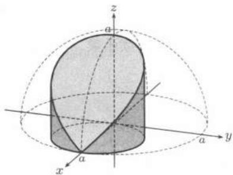

import Guide from '@/components/Guide.astro';
import Knowledge from '@/components/Knowledge.astro';
import Example from '@/components/Example.astro';
import Solution from '@/components/Solution.astro';
import Note from '@/components/Note.astro';
import Block from '@/components/Block.astro';
import Method from '@/components/Method.astro';

## 22.6.1 学习要点

1. 如何快速准确计算出重积分的值是本章的重点之一. 为此有三点是至关重要的: 一是选择坐标变换, 二是选择积分顺序, 三是要优先利用对称性, 即积分区域的对称性与被积函数的奇偶性.

2. 计算重积分的过程中, 画出积分区域的示意图是很重要的一个步骤. 示意图的要点是区域所处的象限 (或卦限)、曲线的交点 (曲面的交线). 用球坐标时尤其要准确标出交线. 即使画不出图, 也要作必要的几何分析. 例如对 $(x^{2} + y^{2})^{2} + z^{4} = z$ 所围立体, 首先从方程看出立体位于平面 $z = 0$ 和 $z = 1$ 之间, 其次可看出这是一个旋转面, 令 $y = 0$ 得母线 $x^{4} = z - z^{4}$ .

3. 要充分重视重积分的应用部分的教学。这里微元法是个重点。要注意微元法的“求和”并不是简单的相加。在“曲”的坐标下考虑的是求和方向上的分量相加。比如求移动曲面扫过的体积，我们必须考虑移动的法向速度方向上的求和。

4. 重积分的计算是熟能生巧, 需要做大量的习题. 限于篇幅, 我们仅仅列举一些有特点的例子. 在一般的教科书上 (如 [24]) 都给出了足够丰富的例题与习题. 请读者自己把握. 还可以参考 [25, 55] 第八章的前 10 节.

5. 对习题课的建议 应该根据实际需要选择坐标变换, 不能只会一种. 任何一种坐标变换都不是万能的. 球坐标变换很重要, 但并不是积分区域与球有关就要用球坐标. 如例题 $22.3.1$, 用球坐标就不简单.

关于积分顺序, 应该观察被积函数与积分区域两者的特点, 尽可能使积分变得简单. 仍考察例题 $22.3.1$, 被积函数中有 $z$ , 当然应该选择“先二后一”的顺序, 而且是先对 $x, y$ , 后对 $z$ , 这样对 $x, y$ 作二重积分时, 被积函数是常数, 因而可以提到积分号之外.

对称性的使用不仅可以简化计算, 还有助于避免错误. 下面的例子可以很清楚地说明这一点.

<Example title="例题22.6.1">
求球体 $x^{2} + y^{2} + z^{2} \leqslant a^{2}$ 和圆柱体 $x^{2} + y^{2} \leqslant ax (a > 0)$ 的公共部分所成的空间区域 ($Viviani$ 体) 的体积 $V$ .

<Solution title="解">
如图 22.11 (半个 $Viviani$ 体) 所示,

$$
\begin{array}{l} V = 2 \iint_ {x ^ {2} + y ^ {2} \leqslant a x} \sqrt {a ^ {2} - x ^ {2} - y ^ {2}} \mathrm{d} x \mathrm{d} y \\ = 2 \int_ {- \pi / 2} ^ {\pi / 2} \mathrm{d} \theta \int_ {0} ^ {a \cos \theta} r \sqrt {a ^ {2} - r ^ {2}} \mathrm{d} r \\ = \int_ {- \pi / 2} ^ {\pi / 2} - \frac {2}{3} (a ^ {2} - r ^ {2}) ^ {3 / 2} \Big | _ {0} ^ {a \cos \theta} \mathrm{d} \theta \\ = - \frac {2}{3} \int_ {- \pi / 2} ^ {\pi / 2} \left[ (a ^ {2} \sin^ {2} \theta) ^ {3 / 2} - a ^ {3} \right] \mathrm{d} \theta . \end{array}
$$

<figure class="vp-figure">
  
  <figcaption>图22.11</figcaption>
</figure>

再往下作就有两种可能了，一种是

$$
(\sin^ {2} \theta) ^ {3 / 2} = \sin^ {3} \theta \quad (\text { 这是错的! }),
$$

应该是

$$
(\sin^ {2} \theta) ^ {3 / 2} = | \sin \theta | ^ {3}.
$$

但如果一开始就利用对称性, 得

$$
V = 4 \iint_ {x ^ {2} + y ^ {2} \leqslant a x, y \geqslant 0} \sqrt {a ^ {2} - x ^ {2} - y ^ {2}} \mathrm{d} x \mathrm{d} y,
$$

不但使运算简便, 而且无形中避免了上述错误的发生.

</Solution>
</Example>

## 22.6.2 参考题

## 第一组参考题

1. 设 $f(x, y)$ 在 $D = \{(x, y) \mid 0 \leqslant x \leqslant 1, 0 \leqslant y \leqslant 1\}$ 上有如下定义：

$$
f (x, y) = \left\{ \begin{array}{l l} { \frac {1}{q _ {x}},} & {\text {当} x =  \frac {p _ {x}}{q _ {x}}, y \text {是无理数时},} \\ { \frac {1}{q _ {y}},} & {\text {当} y =  \frac {p _ {y}}{q _ {y}}, x \text {是无理数时},} \\ {0,} & {\text {其他情况},} \end{array} \right.
$$

其中 $q_{x}, q_{y}$ 分别表示有理数 $x, y$ 写成既约分数后的分母. 则 $f(x, y)$ 在 $D$ 上可积, 但两个二次积分不存在.

2. 设 $f(x, y)$ 定义在 $D = \{(x, y) \mid 0 \leqslant x \leqslant 1, 0 \leqslant y \leqslant 1\}$ 上，

$$
f(x,y)=\left\{\begin{aligned}&1,& 当 x 和 y 都是非零有理数,\\&0,& 其他情况,\end{aligned}\right.
$$

其中 $q_{x}, q_{y}$ 表示有理数 $x, y$ 写成既约分数后的分母. 证明 $f(x, y)$ 在 $D$ 上不可积, 但两个二次积分存在且相等.

3. (1) 计算积分 $A = \int_{0}^{1} \int_{0}^{1} |xy - \frac{1}{4}| \, \mathrm{d}x \, \mathrm{d}y$ ;

(2) 设 $z = f(x, y)$ 在闭正方形 $D = \{(x, y) \mid 0 \leqslant x \leqslant 1, 0 \leqslant y \leqslant 1\}$ 上连续，且满足下列条件：

$$
\iint_ {D} f (x, y) \mathrm{d} x \mathrm{d} y = 0, \quad \iint_ {D} x y f (x, y) \mathrm{d} x \mathrm{d} y = 1.
$$

求证: $\exists(\xi,\eta)\in D$ 使得 $|f(\xi,\eta)|\geqslant\frac{1}{A}$ .

4. 证明：

$$
1.96 <   \iint_ {| x | + | y | \leqslant 1 0} \frac {1}{100 + \cos^ {2} x + \cos^ {2} y} \mathrm{d} x \mathrm{d} y <   2.
$$

5. 设 $f$ 是连续函数, 证明:

$$
\iiint_ {x ^ {2} + y ^ {2} + z ^ {2} \leqslant 1} f (a x + b y + c z) \mathrm{d} x \mathrm{d} y \mathrm{d} z = \pi \int_ {- 1} ^ {1} (1 - u ^ {2}) f (k u) \mathrm{d} u,
$$

其中 $k = \sqrt{a^2 + b^2 + c^2}$ .

6. 证明 $Poincaré$ (彭加勒) 不等式: 设函数 $f(x, y), \frac{\partial f}{\partial y} (x, y)$ 在闭区域

$$
D = \{(x, y) \mid a \leqslant x \leqslant b, \varphi (x) \leqslant y \leqslant \psi (x) \}
$$

上连续, 其中 $\varphi, \psi$ 在 $[a, b]$ 上连续. $f(x, \varphi(x)) = 0$ , 则存在常数 $K > 0$ , 使得

$$
\iint_ {D} f ^ {2} (x, y) \mathrm{d} x \mathrm{d} y \leqslant K \iint_ {D} \left(\frac {\partial f}{\partial y}\right) ^ {2} \mathrm{d} x \mathrm{d} y.
$$

($Poincaré$ 不等式可看成是 $Wirtinger$ 不等式 (见第十五章参考题 8) 在高维空间的推广, 见 [27] 及其中所引文献.)

7. 设 $u, v \in L^{p}(\Omega), p \geqslant 1$ . 利用 $Hölder$ 不等式证明 $Minkowski$ 不等式

$$
\| u + v \| _ {p} \leqslant \| u \| _ {p} + \| v \| _ {p}.
$$

讨论 $Hölder$ 不等式和 $Minkowski$ 不等式取等号的条件.

8. 设函数 $f(x, y)$ 在区域 $D = [0, 1] \times [0, 1]$ 上四次连续可微，在其边界上取零，并且

$$
\left| \frac {\partial^ {4} f}{\partial x ^ {2} \partial y ^ {2}} (x, y) \right| \leqslant B, \quad (x, y) \in D.
$$

证明：

$$
\left| \iint_ {D} f (x, y) \mathrm{d} x \mathrm{d} y \right| \leqslant \frac {B}{144}.
$$

9. 设二重积分 $\iint_{D} f(x,y) \, dx \, dy > 0$ . 证明: 存在 $D$ 的闭子区域 $U$, 使当 $(x,y) \in U$ 时, 有 $f(x,y) > 0$ .

10. 证明多重积分的中值定理: 设 $f(x_{1}, x_{2}, \cdots, x_{n})$ 在有界闭区域 $\Omega \subset \mathbf{R}^{n}$ 上连续, 则 $\exists \pmb{\xi} \in \Omega$ , 使

$$
\int \int_ {\Omega} \dots \int f (x _ {1}, x _ {2}, \ldots , x _ {n})   \mathrm{d} x _ {1} \mathrm{d} x _ {2} \dots   \mathrm{d} x _ {n} = f (\pmb {\xi}) \cdot (\varOmega   \text {的体积}).
$$

11. 设函数 $p$ 在 $[a, b]$ 上非负连续， $f, g$ 在 $[a, b]$ 上连续单调增加，则

$$
\left(\int_ {a} ^ {b} p (x) f (x) \mathrm{d} x\right) \left(\int_ {a} ^ {b} p (x) g (x) \mathrm{d} x\right) \leqslant \left(\int_ {a} ^ {b} p (x) \mathrm{d} x\right) \left(\int_ {a} ^ {b} p (x) f (x) g (x) \mathrm{d} x\right).
$$

12. 设 $f$ 在 $[0,1]$ 上连续、单调减少且恒取正值，则

$$
\frac {\int_ {0} ^ {1} x f ^ {2} (x) \mathrm{d} x}{\int_ {0} ^ {1} x f (x) \mathrm{d} x} \leqslant \frac {\int_ {0} ^ {1} f ^ {2} (x) \mathrm{d} x}{\int_ {0} ^ {1} f (x) \mathrm{d} x}.
$$

13. 设

$$
I = \iiint_ {x ^ {2} + y ^ {2} + z ^ {2} \leqslant R ^ {2}} \frac {\mathrm{d} x \mathrm{d} y \mathrm{d} z}{\sqrt {(x - a) ^ {2} + (y - b) ^ {2} + (z - c) ^ {2}}},
$$

其中 $A = \sqrt{a^2 + b^2 + c^2} > R > 0$ ，则

$$
\frac {4 \pi}{3} \frac {R ^ {3}}{A + R} \leqslant I \leqslant \frac {4 \pi}{3} \frac {R ^ {3}}{A - R}.
$$

14. 设 $f(t)$ 是连续函数, 令

$$
F (t) = \iiint_ {D} f (x y z) \mathrm{d} x \mathrm{d} y \mathrm{d} z,
$$

其中 $D = \{(x,y,z)\mid 0\leqslant x\leqslant t,0\leqslant y\leqslant t,0\leqslant z\leqslant t\}$ .证明：

$$
F ^ {\prime} (t) = \frac {3}{t} \int_ {0} ^ {t ^ {3}} \frac {g (u)}{u} \mathrm{d} u,
$$

其中 $g(u)=\int_{0}^{u}f(s)\mathrm{d}s.$

15. 设坐标平面上有一周长为 $2\pi l$ 的椭圆 $\Gamma$ , 在其上选定一点作为计算弧长 $s$ 的起点, 以逆时针方向作为计算弧长的方向, 这时 $\Gamma$ 有参数方程

$$
x = f (s), y = \varphi (s), \quad 0 \leqslant s \leqslant 2 \pi l.
$$

$x$ 轴的正半轴绕原点作逆时针旋转, 首次转到与点 $(f(s), \varphi(s))$ 处切线正向一致时的倾角为 $\theta(s)$ . 记 $D$ 为 $\Gamma$ 的外部区域内与 $\Gamma$ 的距离小于 $l$ 的所有点构成的区域.

(1) 如果用 $t$ 表示 $D$ 内一点 $(x, y)$ 到 $\Gamma$ 的距离, 试将 $x, y$ 表示成 $s, t$ 的函数

$$
x = x (s, t), \quad y = y (s, t), \quad 0 \leqslant s \leqslant 2 \pi l, 0 <   t <   l;
$$

(2) 用计算验证区域 $D$ 的面积为 $3\pi l^{2}$ .

<Note title="注">
题 6 即 [25] 的习题 $3983$, 它代表了重积分计算中的 $Catalan$ 方法. 这种方法在一定的条件下可以将多重积分 (直接) 转化为单重积分. 较详细的介绍见 [55] 第三册 $8.1.6$ 小节中的命题 $8.1$、$8.2$ 与例题, 以及它们在 §$8.6$ (三重积分计算) 和 §$8.10$ ($n$ 重积分计算) 中的一系列应用. $Catalan$ 方法也可用于求解本章中的若干积分计算题, 例如 $22.3.5$ 小节的练习题 $7$、$8$ 和第一组参考题 $5$ 等.
</Note>

## 第二组参考题

1. 证明：对任意 $\varepsilon > 0$

$$
a b \leqslant \frac {\varepsilon a ^{p}}{p} + \frac {\varepsilon ^ {- q / p} b ^{q}}{q} \leqslant \varepsilon a ^{p} + \varepsilon ^ {- q / p} b ^{q},
$$

其中 $a \geqslant 0, b \geqslant 0, p, q > 0, \frac{1}{p} + \frac{1}{q} = 1.$

2. 利用上题以及例题 $22.5.9$ 的结论证明内插不等式:

$$
\| u \| _ {q} \leqslant \varepsilon \| u \| _ {r} + \varepsilon^ {- \mu} \| u \| _ {p},
$$

其中 $\mu=\left(\frac{1}{p}-\frac{1}{q}\right)/\left(\frac{1}{q}-\frac{1}{r}\right)$ ，$0<p<q<r$, $\varepsilon>0$ .

3. 设 $\Omega$ 是 $\mathbf{R}^2$ 中有界闭区域, $u(x,y)$ 在 $\Omega$ 上连续且恒取正值, 定义

$$
\Phi_ {p} (u) = \left(\frac {1}{| \Omega |} \iint_ {\Omega} u ^{p} \mathrm{d} x \mathrm{d} y\right) ^ {\frac {1}{p}},
$$

其中 $|\Omega|$ 是 $\Omega$ 的面积, 证明:

(1) $\lim_{p\to+\infty}\Phi_{p}(u)=\max_{(x,y)\in\Omega}\{u(x,y)\};$

(2) $\lim_{p\to-\infty}\Phi_{p}(u)=\min_{(x,y)\in\Omega}\{u(x,y)\};$

$$
\lim _ {p \rightarrow 0} \Phi_ {p} (u) = \exp \left\{\frac {1}{| \Omega |} \iint_ {\Omega} \ln u d x d y \right\}.
$$

4. 设 $P_{0}$ 为半径等于 $R$ 的球内的一定点，从点 $P_{0}$ 向球面上任意一点 $Q$ 处的切平面作垂线，垂足为点 $P$。当点 $Q$ 在球面上变动时，点 $P$ 的轨迹形成一封闭曲面。

(1) 求此曲面所围成的立体的体积;

(2) 问当点 $P_{0}$ 沿什么方向变化时, 上述体积的变化率最大?

5. 证明不等式

$$
\frac {\sqrt {\pi}}{2} \left(1 - \mathrm{e} ^ {- a ^{2}}\right) ^ {\frac {1}{2}} <   \int_ {0} ^{a} \mathrm{e} ^ {- x ^{2}} \mathrm{d} x <   \frac {\sqrt {\pi}}{2} \left(1 - \mathrm{e} ^ {- \frac {4 a ^{2}}{\pi}}\right) ^ {\frac {1}{2}}.
$$

6. 设连续函数 $f(x, y)$ 的等位线是简单封闭曲线， $S(v_1, v_2)$ 是由曲线 $f(x, y) = v_1, f(x, y) = v_2$ 所围成的域。证明 $Catalan$ 公式

$$
\iint_ {S (v _ {1}, v _ {2})} f (x, y) \mathrm{d} x \mathrm{d} y = \int_ {v _ {1}} ^ {v _ {2}} v F ^ {\prime} (v) \mathrm{d} v,
$$

其中 $F(v)$ 为由曲线 $f(x,y)=v_{1}, f(x,y)=v$ 所包围的面积, 还假设 $F(v)$ 可微且导函数 $F'(v)$ 可积.

## 第二十三章 含参变量积分

在 §$23.1$ 和 §$23.2$ 两节中考虑含参变量积分的一般性质, 其中包括含参变量常义积分和含参变量广义积分. 对后者而言, 其分析性质的研究首先涉及这些广义积分的收敛性是否关于参变量一致. 然后给出许多具体计算的例子. 在 §$23.3$ 中介绍两个重要的特殊函数: $B$ 函数和 $\Gamma$ 函数. 最后一节是学习要点和参考题.
