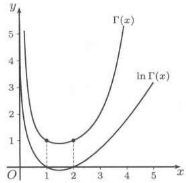

import Guide from '@/components/Guide.astro';
import Knowledge from '@/components/Knowledge.astro';
import Example from '@/components/Example.astro';
import Solution from '@/components/Solution.astro';
import Note from '@/components/Note.astro';
import Block from '@/components/Block.astro';
import Method from '@/components/Method.astro';

在计算积分或者解常微分方程时，常常遇到其解不能表示为初等函数的问题。解决这个问题的方法之一是引进一些新的函数，它们可能是函数项级数的和函数，或者是用含参变量积分表示的函数，然后研究它们的性质，甚至做出函数值表。这类函数一般称为特殊函数。这一节介绍的 $Beta$ 函数（记为 $B$ 函数）与 $Gamma$ 函数（记为 $\Gamma$ 函数）就属于最重要特殊函数之列。它们在数学的很多分支中都有应用。有不少重要的定积分值可以用它们表示出来。此外，$Gamma$ 函数的一些性质的证明也是数学分析中很好的训练，在 $23.3.4$ 小节中的部分内容可作为习题课的补充材料。这方面还可参考 [25, 55] 的 §$7.4$ 中的内容。

## $23.3.1$ $B$ 函数

$B$ 函数也称为第一类 $Euler$ 积分。$B$ 函数是一个二元函数，它的定义是

$$
\mathrm{B} (p, q) = \int_ {0} ^ {1} x ^ {p - 1} (1 - x) ^ {q - 1} \mathrm{d} x, \quad p, q > 0.\tag{23.9}
$$

它还有下列等价的积分表示

$$
\begin{array}{r l} \mathrm{B} (p, q) & = \int_ {0} ^ {+ \infty} \frac {y ^ {p - 1}}{(1 + y) ^ {p + q}} \mathrm{d} y = \int_ {0} ^ {+ \infty} \frac {y ^ {q - 1}}{(1 + y) ^ {p + q}} \mathrm{d} y \\ & = \frac {1}{2} \int_ {0} ^ {+ \infty} \frac {y ^ {p - 1} + y ^ {q - 1}}{(1 + y) ^ {p + q}} \mathrm{d} y, \end{array}
$$

$$
\mathrm{B} (p, q) = 2 \int_ {0} ^ {\pi / 2} \cos^ {2 p - 1} \theta \sin^ {2 q - 1} \theta \mathrm{d} \theta .
$$

$B$ 函数的主要性质如下:

1. 对称性: $\mathrm{B}(p,q)=\mathrm{B}(q,p)$ ;

2. $B(p, q)$ 在其定义域上连续，且有任意阶连续偏导数；

3. 递推公式:

$$
\mathrm{B} (p, q + 1) = \frac {q}{p + q} \mathrm{B} (p, q), \quad \mathrm{B} (p + 1, q) = \frac {p}{p + q} \mathrm{B} (p, q).
$$

如果 $m, n$ 都是正整数，则

$$
\mathrm{B} (m, n) = \frac {(m - 1) ! (n - 1) !}{(m + n - 1) !} \quad (\text {参见上册326页例题$10.4.10$}).
$$

## $23.3.2$ $\Gamma$ 函数

$\Gamma$ 函数也称为第二类 $Euler$ 积分。它是一元函数，其含参积分定义为

$$
\Gamma (x) = \int_ {0} ^ {+ \infty} t ^ {x - 1} \mathrm{e} ^ {- t} \mathrm{d} t, x > 0.\tag{23.10}
$$

它有如下的 $Gauss$ 无穷乘积分解（也称为 $Euler-Gauss$ 公式） ①

$$
\Gamma (x) = \lim _ {n \rightarrow \infty} \frac {n ! n ^ {x}}{x (x + 1) \cdots (x + n)}.\tag{23.11}
$$

$\Gamma$ 函数的主要性质如下：

1. $\Gamma$ 函数与$B$函数的关系

$$
\mathrm{B} (p, q) = \frac {\Gamma (p) \cdot \Gamma (q)}{\Gamma (p + q)}, \quad p > 0, q > 0;
$$

2. $\Gamma(x)$ 在 $(0, +\infty)$ 上为严格下凸函数，它及其任意阶导数都连续，且

$$
\Gamma^ {(n)} (x) = \int_ {0} ^ {+ \infty} t ^ {x - 1} (\ln t) ^ {n} \mathrm{e} ^ {- t} \mathrm{d} t;
$$

3. 递推公式（由此从 $\Gamma(1) = 1$ 出发得到 $\Gamma(n+1) = n!, \forall n \in \mathbf{N}_{+}$ )

$$
\Gamma (x + 1) = x \Gamma (x), \quad x > 0;\tag{23.12}
$$

4. $\ln\Gamma(x)$ 在 $(0,+\infty)$ 上为严格下凸函数;

5. $Legendre$ 加倍公式: 对于 $x > 0$ 有

$$
\Gamma (2 x) = \frac {2 ^ {2 x - 1}}{\sqrt {\pi}} \Gamma (x) \Gamma \left(x + \frac {1}{2}\right);
$$

6. 余元公式: 对于 $0 < x < 1$ 有

图$23.1$

<Note>
注1 从积分定义$(23.10)$出发，利用递推公式$(23.12)$可以将 $\Gamma$ 函数的定义域开拓如下。将$(23.12)$变形为

$$
\Gamma (x) = \frac {\Gamma (x + 1)}{x}.\tag{23.13}
$$

注意到右边当 $-1 < x < 0$ 时也有定义，于是我们用$(23.13)$的右边来定义 $-1 < x < 0$ 时的 $\Gamma$ 函数的值，以此类推， $\Gamma$ 函数的定义域可以开拓到除去 $0$ 和负整数的一切实数。当然这样的开拓结果与$(13.37)$的无穷乘积定义完全一致。
</Note>

<Note>
注2 在所列举的 $\Gamma$ 函数的性质中，前三个在一般教科书中都有。为证明 $\ln \Gamma(x)$ 下凸，从 §$8.4$ 中的下凸函数的定义出发，用无穷限积分的 $Hölder$ 不等式即可得到。最后两个性质的证明比较困难，见下面的 $23.3.4$ 小节。
</Note>

<Note>
注3 在本章末的图$23.2$显示了延拓后的 $\Gamma$ 函数在区间[$-5$, $4.1$]上的图像。
</Note>

## $23.3.3$ 例题

<Example title="例 23.3.1">
设平面 $x = 0$, $y = 0$, $z = 0$ 与 $x + y + z = 1$ 围成四面体 $V$，证明：

$$
\iiint_ {V} x ^ {a - 1} y ^ {b - 1} z ^ {c - 1} \mathrm{d} x \mathrm{d} y \mathrm{d} z = \frac {\Gamma (a) \Gamma (b) \Gamma (c)}{(a + b + c) \Gamma (a + b + c)} (a, b, c > 0).
$$

<Solution title="证明">
作以下计算即可:

$$
\begin{array}{l} I = \iiint_ {V} x ^ {a - 1} y ^ {b - 1} z ^ {c - 1} \mathrm{d} x \mathrm{d} y \mathrm{d} z = \int_ {0} ^ {1} \mathrm{d} x \int_ {0} ^ {1 - x} \mathrm{d} y \int_ {0} ^ {1 - x - y} x ^ {a - 1} y ^ {b - 1} z ^ {c - 1} \mathrm{d} z \\ = \int_ {0} ^ {1} x ^ {a - 1} \mathrm{d} x \int_ {0} ^ {1 - x} \left(y ^ {b - 1} \frac {1}{c} z ^ {c}\right) \Big | _ {0} ^ {1 - x - y} \mathrm{d} y \\ = \frac {1}{c} \int_ {0} ^ {1} x ^ {a - 1} \mathrm{d} x \int_ {0} ^ {1 - x} y ^ {b - 1} (1 - x - y) ^ {c} \mathrm{d} y. \end{array}
$$

再令 $y = (1 - x)t$ ，则

$$
\begin{array}{l} I = \frac {1}{c} \int_ {0} ^ {1} x ^ {a - 1} \mathrm{d} x \int_ {0} ^ {1} (1 - x) ^ {b - 1} t ^ {b - 1} (1 - x) ^ {c} (1 - t) ^ {c} (1 - x) \mathrm{d} t \\ = \frac {1}{c} \int_ {0} ^ {1} x ^ {a - 1} (1 - x) ^ {b + c} \mathrm{d} x \int_ {0} ^ {1} t ^ {b - 1} (1 - t) ^ {c} \mathrm{d} t \\ = \frac {1}{c} \mathrm{B} (a, b + c + 1) \mathrm{B} (b, c + 1) \\ = \frac {1}{c} \frac {\Gamma (a) \Gamma (b + c + 1)}{\Gamma (a + b + c + 1)} \cdot \frac {\Gamma (b) \Gamma (c + 1)}{\Gamma (b + c + 1)} \\ = \frac {\Gamma (a) \Gamma (b) \Gamma (c)}{(a + b + c) \Gamma (a + b + c)}. \end{array}
$$
</Solution>
</Example>

<Example title="例 23.3.2">
确定 $\alpha, \beta, \gamma,$ 使

$$
I = \iiint_ {D} \frac {\mathrm{d} x \mathrm{d} y \mathrm{d} z}{1 + x ^ {\alpha} + y ^ {\beta} + z ^ {\gamma}} <   + \infty ,
$$

并求 $I$ 的值，其中 $D=\{(x,y,z)\mid x\geqslant0,y\geqslant0,z\geqslant0\}$。

<Solution title="解">
首先应该有 $\alpha > 0, \beta > 0, \gamma > 0$。至于进一步的条件，我们将在计算中得到。令 $x = u^{2 / \alpha}, y = v^{2 / \beta}, z = w^{2 / \gamma}$，则

$$
I = \frac {8}{\alpha \beta \gamma} \iiint_ {\Omega} \frac {u ^ {2 / \alpha - 1} v ^ {2 / \beta - 1} w ^ {2 / \gamma - 1}}{1 + u ^ {2} + v ^ {2} + w ^ {2}} \mathrm{d} u \mathrm{d} v \mathrm{d} w,
$$

其中 $\Omega = \{(u,v,w) \mid u \geqslant 0, v \geqslant 0, w \geqslant 0\}$。再作球坐标变换

$$
u = \rho \sin \varphi \cos \theta , v = \rho \sin \varphi \sin \theta , w = \rho \cos \varphi ,
$$

$$
\rho \geqslant 0, 0 \leqslant \varphi \leqslant \frac {\pi}{2}, 0 \leqslant \theta \leqslant \frac {\pi}{2},
$$

则

$$
\begin{array}{l} I = \frac {8}{\alpha \beta \gamma} \int_ {0} ^ {\pi / 2} \cos^ {2 / \alpha - 1} \theta \sin^ {2 / \beta - 1} \theta d \theta \cdot \int_ {0} ^ {\pi / 2} \sin^ {2 (\frac {1}{\alpha} + \frac {1}{\beta}) - 1} \varphi \cos^ {2 / \gamma - 1} \varphi d \varphi \\ \times \int_ {0} ^ {+ \infty} \frac {\rho^ {2 (\frac {1}{\alpha} + \frac {1}{\beta} + \frac {1}{\gamma}) - 1}}{1 + \rho^ {2}} d \rho \\ = \frac {1}{\alpha \beta \gamma} B \left(\frac {1}{\alpha}, \frac {1}{\beta}\right) B \left(\frac {1}{\alpha} + \frac {1}{\beta}, \frac {1}{\gamma}\right) \int_ {0} ^ {+ \infty} \frac {t ^ {\frac {1}{\alpha} + \frac {1}{\beta} + \frac {1}{\gamma} - 1}}{1 + t} d t. \end{array}
$$

可见当且仅当 $\frac{1}{\alpha} +\frac{1}{\beta} +\frac{1}{\gamma} <  1$ 时后一个积分收敛，并且有

$$
\int_ {0} ^ {+ \infty} \frac {t ^ {\frac {1}{\alpha} + \frac {1}{\beta} + \frac {1}{\gamma} - 1}}{1 + t} d t = B \left(\frac {1}{\alpha} + \frac {1}{\beta} + \frac {1}{\gamma}, 1 - \left(\frac {1}{\alpha} + \frac {1}{\beta} + \frac {1}{\gamma}\right)\right),
$$

这样便得到

$$
I = \frac {1}{\alpha \beta \gamma} \Gamma \left(\frac {1}{\alpha}\right) \Gamma \left(\frac {1}{\beta}\right) \Gamma \left(\frac {1}{\gamma}\right) \Gamma \left(1 - \left(\frac {1}{\alpha} + \frac {1}{\beta} + \frac {1}{\gamma}\right)\right).
$$
</Solution>
</Example>

<Example title="例 23.3.3">
求积分（见上册 $395$ 页练习题 $6(2)$）

$$
I (t) = \int_ {0} ^ {+ \infty} \mathrm{e} ^ {- \left(x ^ {2} + \frac {t ^ {2}}{x ^ {2}}\right)} \mathrm{d} x, \quad t > 0.
$$

<Solution title="解 1">
由 $M$‑判别法，$I(t)$ 关于 $t > 0$ 是一致收敛的，形式上求导得

$$
I ^ {\prime} (t) = \int_ {0} ^ {+ \infty} \mathrm{e} ^ {- \left(x ^ {2} + \frac {t ^ {2}}{x ^ {2}}\right)} \left(- \frac {2 t}{x ^ {2}}\right) \mathrm{d} x.
$$

$\forall t_0 > 0$，上述积分在 $t_0$ 的邻域上一致收敛，所以上面的求导可行。令 $x = \frac{1}{y}$，则

$$
I ^ {\prime} (t) = \int_ {+ \infty} ^ {0} \mathrm{e} ^ {- \left(\frac {1}{y ^ {2}} + y ^ {2} t ^ {2}\right)} 2 t \mathrm{d} y.
$$

再令 $yt = z$，则

$$
I ^ {\prime} (t) = - 2 \int_ {0} ^ {+ \infty} \mathrm{e} ^ {- \left(z ^ {2} + \frac {t ^ {2}}{z ^ {2}}\right)} \mathrm{d} z = - 2 I (t).
$$

所以

$$
\begin{array}{c} \ln I (t) = - 2 t + C, \\ I (t) = C \mathrm{e} ^ {- 2 t}. \end{array}
$$

考虑到 $I(0)=\int_{0}^{+\infty}\mathrm{e}^{-x^{2}}\mathrm{d}x=\frac{\sqrt{\pi}}{2}$，所以

$$
I (t) = \frac {\sqrt {\pi}}{2} \mathrm{e} ^ {- 2 t}.
$$
</Solution>

<Solution title="解 2">
下面的方法需要的工具不多，但不容易想到: 令 $y = \frac{t}{x}$，则

$$
I (t) = \int_ {0} ^ {+ \infty} \mathrm{e} ^ {- \left(\frac {t ^ {2}}{y ^ {2}} + y ^ {2}\right)} \frac {t}{y ^ {2}} \mathrm{d} y.
$$

与原表达式相加得

$$
\begin{array}{r l} 2 I (t) & = \int_ {0} ^ {+ \infty} \mathrm{e} ^ {- \left(x ^ {2} + \frac {t ^ {2}}{x ^ {2}}\right)} \left(1 + \frac {t}{x ^ {2}}\right) \mathrm{d} x = \mathrm{e} ^ {- 2 t} \int_ {0} ^ {+ \infty} \mathrm{e} ^ {- \left(x - \frac {t}{x}\right) ^ {2}} \mathrm{d} \left(x - \frac {t}{x}\right) \\ & = \mathrm{e} ^ {- 2 t} \int_ {- \infty} ^ {+ \infty} \mathrm{e} ^ {- u ^ {2}} \mathrm{d} u = \sqrt {\pi} \mathrm{e} ^ {- 2 t}. \end{array}
$$
</Solution>
</Example>

<Example title="例 23.3.4">
证明 $Riemann$ 的 zeta 函数的积分形式

$$
\zeta (s) = \sum_ {n = 1} ^ {\infty} \frac {1}{n ^ {s}} = \frac {1}{\Gamma (s)} \int_ {0} ^ {+ \infty} \frac {x ^ {s - 1}}{\mathrm{e} ^ {x} - 1} \mathrm{d} x, \quad s > 1.
$$

<Solution title="证明">
对于 $x > 0$ 有展开式

$$
\begin{array}{r l} \frac {1}{\mathrm{e} ^ {x} - 1} & = \frac {\mathrm{e} ^ {- x}}{1 - \mathrm{e} ^ {- x}} \\ & = \mathrm{e} ^ {- x} (1 + \mathrm{e} ^ {- x} + \mathrm{e} ^ {- 2 x} + \dots) = \sum_ {n = 1} ^ {\infty} \mathrm{e} ^ {- n x}. \end{array}
$$

于是 $\forall A > 0$ 有

$$
\int_ {0} ^ {A} \frac {x ^ {s - 1}}{\mathrm{e} ^ {x} - 1} \mathrm{d} x = \int_ {0} ^ {A} x ^ {s - 1} \left(\sum_ {n = 1} ^ {\infty} \mathrm{e} ^ {- n x}\right) \mathrm{d} x.
$$

对于固定的 $s > 1$，级数 $\sum_{n = 1}^{\infty}x^{s - 1}\mathrm{e}^{-nx}$ 关于 $x\in [0, + \infty)$ 是一致收敛的，所以

$$
\begin{array}{r l} \int_ {0} ^ {A} \frac {x ^ {s - 1}}{\mathrm{e} ^ {x} - 1} \mathrm{d} x & = \sum_ {n = 1} ^ {\infty} \int_ {0} ^ {A} x ^ {s - 1} \mathrm{e} ^ {- n x} \mathrm{d} x = \sum_ {n = 1} ^ {\infty} \int_ {0} ^ {n A} \left(\frac {y}{n}\right) ^ {s - 1} \left(\frac {\mathrm{e} ^ {- y}}{n}\right) \mathrm{d} y \\ & = \sum_ {n = 1} ^ {\infty} \frac {1}{n ^ {s}} \int_ {0} ^ {n A} y ^ {s - 1} \mathrm{e} ^ {- y} \mathrm{d} y. \end{array}
$$

这个级数对于 $A \in [0, +\infty)$ 是一致收敛的，于是令 $A \to +\infty$，得

$$
\int_ {0} ^ {+ \infty} \frac {x ^ {s - 1}}{\mathrm{e} ^ {x} - 1} \mathrm{d} x = \Gamma (s) \sum_ {n = 1} ^ {\infty} \frac {1}{n ^ {s}}.
$$
</Solution>
</Example>

<Example title="例 23.3.5">
求 $\int_0^1\frac{\ln x}{1 - x}\mathrm{d}x.$

<Solution title="解">
令 $x = \mathrm{e}^{-t}$，则

$$
\int_ {0} ^ {1} \frac {\ln x}{1 - x} \mathrm{d} x = \int_ {+ \infty} ^ {0} \frac {- t}{1 - \mathrm{e} ^ {- t}} \mathrm{e} ^ {- t} (- \mathrm{d} t) = - \int_ {0} ^ {+ \infty} \frac {t}{\mathrm{e} ^ {t} - 1} \mathrm{d} t.
$$

在上题的结论中取 $s = 2$，则

$$
\int_ {0} ^ {1} \frac {\ln x}{1 - x} \mathrm{d} x = - \Gamma (2) \sum_ {n = 1} ^ {\infty} \frac {1}{n ^ {2}} = - \frac {\pi^ {2}}{6}.
$$
</Solution>
</Example>

<Example title="例 23.3.6">
求 $I = \iiint_{\Omega} \left(\sqrt{a^2 - x^2 - y^2}\right)^p \, \mathrm{d}x \, \mathrm{d}y \, \mathrm{d}z,$ 其中 $a > 0$, $p \geqslant 0$, $\Omega$ 是球体 $x^2 + y^2 + z^2 \leqslant a^2$ 被圆柱面 $x^2 + y^2 = ay$ 割下的区域（即 $Viviani$ 体）。

<Solution title="解">
见图 $22.11$（现在 $x$, $y$ 轴的位置有变化）。用柱坐标系，则

$$
\Omega = \{(r, \theta , z) \mid 0 \leqslant \theta \leqslant \pi , 0 \leqslant r \leqslant a \sin \theta , - \sqrt {a ^ {2} - r ^ {2}} \leqslant z \leqslant \sqrt {a ^ {2} - r ^ {2}} \}.
$$

于是

$$
\begin{array}{l} I = \int_ {0} ^ {\pi} \mathrm{d} \theta \int_ {0} ^ {a \sin \theta} \mathrm{d} r \int_ {- \sqrt {a ^ {2} - r ^ {2}}} ^ {\sqrt {a ^ {2} - r ^ {2}}} \left(\sqrt {a ^ {2} - r ^ {2}}\right) ^ {p} r \mathrm{d} z = \int_ {0} ^ {\pi} \mathrm{d} \theta \int_ {0} ^ {a \sin \theta} 2 r (a ^ {2} - r ^ {2}) ^ {\frac {p + 1}{2}} \mathrm{d} r \\ = - \int_ {0} ^ {\pi} \left(\frac {2}{p + 3} (a ^ {2} - r ^ {2}) ^ {\frac {p + 3}{2}}\right) \Bigg | _ {0} ^ {a \sin \theta} \mathrm{d} \theta = \frac {4 a ^ {p + 3}}{p + 3} \int_ {0} ^ {\pi / 2} (1 - \cos^ {p + 3} \theta) \mathrm{d} \theta \\ = \frac {4 a ^ {p + 3}}{p + 3} \left(\frac {\pi}{2} - \frac {\Gamma \left(\frac {p + 4}{2}\right) \Gamma \left(\frac {1}{2}\right)}{2 \Gamma \left(\frac {p + 5}{2}\right)}\right). \end{array}
$$
</Solution>
</Example>

## $23.3.4$ $\Gamma$ 函数的特征刻画和几个重要公式的证明

前面已介绍过 $\Gamma$ 函数满足如下三条性质:

1. 当 $x > 0$ 时，$\Gamma(x) > 0$，且 $\Gamma(1) = 1$；

2. $\Gamma(x+1)=x\Gamma(x);$

3. $\ln\Gamma(x)$ 在 $(0,+\infty)$ 上为下凸函数.

关于 $\Gamma$ 函数的一个非常漂亮的结果是 $Bohr$ 与 $Mollerup$ 定理（$1922$ 年），即上面的三条性质完全刻画了 $\Gamma$ 函数.

<Knowledge title="命题 23.3.1 ($Bohr-Mollerup$ 定理)">
如果定义在 $(0, +\infty)$ 上的函数 $f$ 满足下列三个条件:

(1) $f(x)>0$，且 $f(1)=1$，

(2) $f(x+1)=xf(x)$，

(3) $\ln f(x)$ 是 $(0,+\infty)$ 上的下凸函数，

则 $f(x) \equiv \Gamma(x)$，$x \in (0, +\infty)$。

<Solution title="证明">
已知 $\Gamma$ 函数满足上述三条，故只要证明 $f$ 是由 (1)，(2)，(3) 惟一确定的函数就可以了。而由 (2) 只要对 $x \in (0,1)$ 进行证明。令 $\varphi(x) = \ln f(x)$，则

$$
\varphi (x + 1) = \varphi (x) + \ln x, \quad 0 <   x <   + \infty ,\tag{23.14}
$$

$\varphi (1) = 0$，且 $\varphi$ 是下凸函数。设 $0 <   x <   1$，考虑 $\varphi$ 在

$$
[ n, n + 1 ], \quad [ n + 1, n + 1 + x ], \quad [ n + 1, n + 2 ]
$$

三个闭区间上的差商，有

$$
\begin{array}{r l} \ln n & = \varphi (n + 1) - \varphi (n) \leqslant \frac {\varphi (n + 1 + x) - \varphi (n + 1)}{x} \\ & \leqslant \varphi (n + 2) - \varphi (n + 1) = \ln (n + 1). \end{array}\tag{23.15}
$$

另一方面，重复(23.14)可得

$$
\varphi (n + 1 + x) = \varphi (x) + \ln [ x (x + 1) \dots (x + n) ].
$$

代入 (23.15) 并整理得

$$
0 \leqslant \varphi (x) - \ln \left(\frac {n ! n ^ {x}}{x (x + 1) \cdots (x + n)}\right) \leqslant x \ln \left(1 + \frac {1}{n}\right).
$$

由对数函数的连续性，令 $n \to \infty$，得

$$
\varphi (x) = \ln \left(\lim _ {n \rightarrow \infty} \frac {n ! n ^ {x}}{x (x + 1) \cdots (x + n)}\right).
$$

因此

$$
f (x) = \lim _ {n \rightarrow \infty} \frac {n ! n ^ {x}}{x (x + 1) \cdots (x + n)}.
$$

利用例题 $16.1.4$ 的结论知 $f(x)=\Gamma(x)$.
</Solution>
</Knowledge>

<Knowledge title="命题23.3.2 ($Legendre$ 加倍公式)">
对于 $x > 0$ 成立

$$
\Gamma (2 x) = \frac {2 ^ {2 x - 1}}{\sqrt {\pi}} \Gamma (x) \Gamma \left(x + \frac {1}{2}\right).
$$

<Solution title="证明">
设 $g(x) = \frac{2^{x - 1}}{\sqrt{\pi}}\Gamma \left(\frac{x}{2}\right)\Gamma \left(\frac{x + 1}{2}\right)$，利用 $\Gamma \left(\frac{1}{2}\right) = \sqrt{\pi}$，容易检验 $g(x)$ 满足 $Bohr$-$Mollerup$ 定理中的条件 (1)-(3)，可见有

$$
\Gamma (x) = \frac {2 ^ {x - 1}}{\sqrt {\pi}} \Gamma \left(\frac {x}{2}\right) \Gamma \left(\frac {x + 1}{2}\right),
$$

将其中 $x$ 换为 $2x$ 就得到所要的加倍公式。
</Solution>
</Knowledge>

<Knowledge title="命题23.3.3（余元公式）">
对于 $0 < x < 1$ 成立

$$
\Gamma (x) \Gamma (1 - x) = \frac {\pi}{\sin \pi x}.
$$

<Solution title="证1">
利用 $\Gamma$ 函数的 $Euler$-$Gauss$ 无穷乘积表达式$(23.11)$（即$(13.38)$）与正弦函数的无穷乘积表达式$(13.30)$。具体细节见例题$13.4.4$以及$(13.40)$。
</Solution>

<Solution title="证2">
首先利用 $\Gamma$ 函数与 $B$ 函数的关系得到

$$
\Gamma (x) \Gamma (1 - x) = \mathrm{B} (x, 1 - x) = \int_ {0} ^ {+ \infty} \frac {1}{y ^ {x} (1 + y)} \mathrm{d} y,
$$

然后利用例题 $16.1.3$ 的 $Euler$ 积分公式。
</Solution>

<Solution title="证3">
利用上册 $402$ 页参考题 $8(2)$ 的结果：当 $2m + 1 < 2n$ 时，有

$$
\int_ {- \infty} ^ {+ \infty} \frac {x ^ {2 m}}{1 + x ^ {2 n}} \mathrm{d} x = \frac {\pi}{n} \csc \frac {(2 m + 1) \pi}{2 n},
$$

于是有

$$
\begin{array}{r l} \Gamma \left(\frac {2 m + 1}{2 n}\right) \Gamma \left(1 - \frac {2 m + 1}{2 n}\right) & = \mathrm{B} \left(\frac {2 m + 1}{2 n}, 1 - \frac {2 m + 1}{2 n}\right) \\ & = \int_ {0} ^ {+ \infty} \frac {y ^ {\frac {2 m + 1}{2 n} - 1}}{1 + y} \mathrm{d} y \\ & = 2 n \int_ {0} ^ {+ \infty} \frac {x ^ {2 m}}{1 + x ^ {2 n}} \mathrm{d} x \\ & = \pi \csc \frac {(2 m + 1) \pi}{2 n}, \end{array}
$$

当 $x$ 为无理数时，通过形如 $\frac{2m + 1}{2n}$ 的有理数取极限。
</Solution>
</Knowledge>

<Knowledge title="命题23.3.4 ($\Gamma$ 函数的 $Stirling$ 公式)">
关于 $\Gamma$ 函数有渐近公式 ①:

$$
\Gamma (x + 1) \sim \sqrt {2 \pi x} \left(\frac {x}{\mathrm{e}}\right) ^ {x} (x \rightarrow + \infty).\tag{23.16}
$$

<Solution title="证明（此证明取自[46]）">
在 $\Gamma (x) = \int_0^{+\infty}t^{x - 1}\mathrm{e}^{-t}\mathrm{d}t$ 中令 $t = x(1 + u)$，得到

$$
\Gamma (x + 1) = x ^ {x + 1} \mathrm{e} ^ {- x} \int_ {- 1} ^ {+ \infty} [ (1 + u) \mathrm{e} ^ {- u} ] ^ {x} \mathrm{d} u.\tag{23.17}
$$

令

$$
h (u) = \left\{ \begin{array}{l l} \frac {2}{u ^ {2}} [ u - \ln (1 + u) ], & - 1 <   u <   + \infty , \quad u \neq 0, \\ 1, & u = 0, \end{array} \right.
$$

则 $h$ 在 $(-1, +\infty)$ 上为单调减少的连续函数，并满足

$$
(1 + u) \mathrm{e} ^ {- u} = \exp \left(- \frac {u ^ {2}}{2} h (u)\right).
$$

于是，对 (23.17) 作代换 $u = s\sqrt{\frac{2}{x}}$，得

$$
\Gamma (x + 1) = x ^ {x} \mathrm{e} ^ {- x} \sqrt {2 x} \int_ {- \infty} ^ {+ \infty} \psi_ {x} (s) \mathrm{d} s,
$$

其中

$$
\psi_ {x} (s) = \left\{ \begin{array}{l l} \exp \left[ - s ^ {2} h \left(s \sqrt {\frac {2}{x}}\right) \right], & - \sqrt {\frac {x}{2}} <   s <   + \infty , \\ 0, & s \leqslant - \sqrt {\frac {x}{2}}. \end{array} \right.
$$

可以验证:

(1) 对每个 $s$ 而言，当 $x \to +\infty$ 时，$\psi_x(s) \to \mathrm{e}^{-s^2}$;

(2) 当 $x \geqslant 1$ 时，对 $s > 0$，有 $0 < \psi_x(s) < \psi_1(s)$;

(3) 对 $s < 0$，有 $0 < \psi_x(s) < \mathrm{e}^{-s^2}$;

(4) 对任意 $A > 0$，含参变量 $x$ 的广义积分 $\int_{-\infty}^{+\infty}\psi_{x}(s)\,\mathrm{d}s$ 在闭区间 $[-A,A]$ 上一致收敛;

(5) $\int_{0}^{+\infty}\psi_{1}(s)\mathrm{d}s$ 收敛.

因而，就可以得到

$$
\lim _ {x \rightarrow + \infty} \int_ {- \infty} ^ {+ \infty} \psi_ {x} (s) \mathrm{d} s = \int_ {- \infty} ^ {+ \infty} \mathrm{e} ^ {- s ^ {2}} \mathrm{d} s = \sqrt {\pi},
$$

即

$$
\lim _ {x \rightarrow + \infty} \frac {\Gamma (x + 1)}{\sqrt {2 \pi x} x ^ {x} \mathrm{e} ^ {- x}} = 1,
$$

这就是关于 $\Gamma$ 函数的 $Stirling$ 公式 $(23.16)$.
</Solution>

<Note>
注 这只是关于 $\Gamma$ 函数的 $Stirling$ 公式的最简单形式。与上册 $363$ 页$(11.31)$类似的关于 $\Gamma$ 函数的一般 $Stirling$ 公式见[18]（第二卷的 $540$ 小节）等参考书。
</Note>
</Knowledge>

## $23.3.5$ 练习题

1. 计算

(1) $\int_{0}^{1}\frac{\mathrm{d}x}{\sqrt{x\ln\frac{1}{x}}};\quad(2)\int_{0}^{+\infty}\frac{\sqrt[4]{x}}{(1+x)^{2}}\mathrm{d}x.$

2. 试用 $\Gamma$ 函数或 $B$ 函数表示

$$
\int_ {0} ^ {\pi / 2} \tan^ {\alpha} x \mathrm{d} x (| \alpha | <   1); \tag {1}
$$

$$
(2) \int_ {- 1} ^ {1} (1 + x) ^ {a} (1 - x) ^ {b} \mathrm{d} x (a, b > 0).
$$

3. $n$ 为正整数，$p > 0$，证明:

$$
\mathrm{B} (p, n) = \frac {(n - 1) !}{p (p + 1) \cdots (p + n - 1)}.
$$

4. 证明: $\ln \Gamma(x)$ 是下凸函数.

5. 按照下列步骤证明公式 $\mathrm{B}(p,q)=\frac{\Gamma(p)\Gamma(q)}{\Gamma(p+q)}$.

(1) $\Gamma(p) = 2\int_{0}^{+\infty}u^{2p - 1}\mathrm{e}^{-u^2}\mathrm{d}u;$

$$
\begin{array}{c} {{\Gamma (p)   \Gamma (q) =  \lim _ {A \to + \infty} 4    \iint_ {G (A)} f (u, v)   \mathrm{d} u   \mathrm{d} v,   \text {其中}}} \\ {{f (u, v) = u ^ {2 p - 1} v ^ {2 q - 1} \mathrm{e} ^ {- (u ^ {2} + v ^ {2})},}} \\ {{G (A) = \{(u, v)   |   0 \leqslant u \leqslant A,   0 \leqslant v \leqslant A \};}} \end{array}\tag{2}
$$

$$
\begin{array}{r l} {(3) \text {令} D (R) = \Big \{(r, \theta) \Big | 0 \leqslant r \leqslant R,   0 \leqslant \theta \leqslant \frac {\pi}{2} \Big \}, \text {则}} \\ & {\quad \lim _ {A \to + \infty} \iint_ {D (A)} f (u, v)   \mathrm{d} u   \mathrm{d} v = \frac {1}{4} \mathrm{B} (p, q)   \Gamma (p + q),} \\ & {\quad \lim _ {A \to + \infty} \iint_ {D (\sqrt {2} A)} f (u, v)   \mathrm{d} u   \mathrm{d} v = \frac {1}{4} \mathrm{B} (p, q)   \Gamma (p + q);} \end{array}
$$

(4) $\mathrm{B}(p, q) = \frac{\Gamma(p) \Gamma(q)}{\Gamma(p + q)}.$
