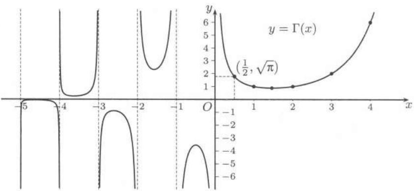

import Guide from '@/components/Guide.astro';
import Knowledge from '@/components/Knowledge.astro';
import Example from '@/components/Example.astro';
import Solution from '@/components/Solution.astro';
import Note from '@/components/Note.astro';
import Block from '@/components/Block.astro';
import Method from '@/components/Method.astro';

## $23.4.1$ 学习要点

<Block title="学习要点">

1. 含参变量积分是我们遇到的又一种新的函数表示方式。对于它的分析性质的研究，如连续性、可微性和可积性等，涉及积分运算和其他分析运算的运算次序的交换性。一致收敛性给出了保证交换运算次序的重要条件。在很多情况下，可以用 $M$ -判别法判断一致收敛性，这是应该熟练掌握的。

2. 用嵌入法计算广义积分的值体现了数学中的“嵌入”思想。假设要考虑一个 $1$ 维的问题（比如计算一个定积分）。我们不妨把这个问题放到更高维的框架中，例如再引入一个参变量，把这个积分作为含参变量积分的特例。由于在引入的高维框架中，我们可以有更多的可施展数学工具（如积分、微分等）的天地，就有可能从另一个角度（而这一个角度是我们引入高维框架后带来的）把我们的问题简化，从而达到解决原有问题的目的。在具体计算过程中，要作一些分析。在什么地方引入参变量比较合适，用微分法还是用积分法，都是有讲究的。比如计算 $Dirichlet$ 积分 $\int_0^{+\infty} \frac{\sin x}{x} \, \mathrm{d}x$ 。把它看成是含参变量积分 $\varphi(\alpha) = \int_0^{+\infty} \mathrm{e}^{-\alpha x} \frac{\sin x}{x} \, \mathrm{d}x$ 当 $\alpha = 0$ 时的值。引入因子 $\mathrm{e}^{-\alpha x}$ 有两个作用，对 $\alpha$ 求导可消去导致不可积的因子 $\frac{1}{x}$ ，同时 $\mathrm{e}^{-\alpha x}$ 又是收敛因子，保证了在 $\alpha > 0$ 时积分 $\int_0^{+\infty} \left( \mathrm{e}^{-\alpha x} \frac{\sin x}{x} \right)'_{\alpha} \, \mathrm{d}x$ 的内闭一致收敛性。故可在积分号下求导，则有

$$
\varphi^ {\prime} (\alpha) = - \int_ {0} ^ {+ \infty} \mathrm{e} ^ {- \alpha x} \sin x \mathrm{d} x = - \frac {1}{1 + \alpha^ {2}}.
$$

再积分就有 $\varphi (\alpha) = \frac{\pi}{2} -\arctan \alpha ,\alpha >0.$ 如果 $\varphi (\alpha)$ 在 $[0, + \infty)$ 上连续，则

$$
\int_ {0} ^ {+ \infty} \frac {\sin x}{x} \mathrm{d} x = \varphi (0) = \lim _ {\alpha \rightarrow 0 ^ {+}} \varphi (\alpha) = \frac {\pi}{2}.
$$

3. 含参变量积分的一致收敛性的判别与函数项级数有许多类似之处，同时也要注意到利用积分自身的特点，如变量代换、分部积分等。以 $\int_{1}^{+\infty}\frac{\cos x^{2}}{x^{p}}dx$ 为例，作变换 $x^{2}=t$ ，就化为 $\int_{1}^{+\infty}\frac{\cos t}{2t^{(p+1)/2}}dt$ ，成为我们熟悉的类型。

4. $B$ 函数的三个积分表达式，各有各的长处，应加以记忆。这样，遇到相应的积分，就可写成特殊的 $B$ 值，再利用余元公式等得到积分值。

5. 对习题课的建议 许多学生对讨论含参变量广义积分的一致收敛性有畏难情绪，习题课上要由浅入深地进行引导，分析难点，找出办法。大多数题目只需使用 $M$ -判别法。在用嵌入法计算一些特殊的广义积分的值时，如果觉得证明计算合理性 (如检验一致收敛性等) 的过程较长，可以在解题时先进行形式运算，算出积分值后再给出运算合理性的证明。

本章的内容综合性强，计算题大多具有一定的技巧性。因此应在习题课上作比较系统的示范和总结。

</Block>

## $23.4.2$ 参考题

<Block title="参考题">

1. 设 $f(x,t), f_x(x,t)$ 连续，记 $u(x,t) = \frac{1}{2a} \int_0^t \mathrm{d}\tau \int_{x-a(t-\tau)}^{x+a(t-\tau)} f(\xi,\tau) \mathrm{d}\xi$ ，其中 $a$ 为正常数，证明： $u(x,t)$ 满足

$$
\frac {\partial^ {2} u}{\partial t ^ {2}} = a ^ {2} \frac {\partial^ {2} u}{\partial x ^ {2}} + f (x, t).
$$

2. 设 $n$ 为正整数，证明： $Bessel$ 函数

$$
J _ {n} (x) = \frac {1}{\pi} \int_ {0} ^ {\pi} \cos (n \varphi - x \sin \varphi) \mathrm{d} \varphi
$$

满足

$$
x ^ {2} J _ {n} ^ {\prime \prime} (x) + x J _ {n} ^ {\prime} (x) + (x ^ {2} - n ^ {2}) J _ {n} (x) = 0.
$$

3. 设 $f(x)$ 在 $[0,1]$ 上连续可微，且 $f(0)=0$ ，定义

$$
\varphi (x) = \int_ {0} ^ {x} \frac {f (t)}{\sqrt {x - t}} \mathrm{d} t, 0 <   x \leqslant 1, \varphi (0) = 0.
$$

证明：

(1) $\varphi(x)$ 在 $[0,1]$ 上一阶连续可导，且

$$
\varphi^ {\prime} (x) = \int_ {0} ^ {x} \frac {f ^ {\prime} (t)}{\sqrt {x - t}} \mathrm{d} t, 0 <   x \leqslant 1, \varphi^ {\prime} (0) = 0;
$$

(2) $f(x) = \frac{1}{\pi} \int_{0}^{x} \frac{\varphi'(t)}{\sqrt{x - t}} \, \mathrm{d}t, \quad 0 < x \leqslant 1.$

4. 设 $f(x)$ 在 $[0, A]$ 上单调 $(A > 0)$ ，证明：

$$
\lim _ {\alpha \rightarrow + \infty} \int_ {0} ^ {A} f (x) \frac {\sin \alpha x}{x} \mathrm{d} x = \frac {\pi}{2} f (0 ^ {+}).
$$

5. 设 $F(t) = t \int_{0}^{+\infty} \mathrm{e}^{-tx} f(x) \, \mathrm{d}x$ ，其中 $f(x)$ 在 $[0, b]$ 上有界可积 ( $\forall b > 0$ )，且 $\lim_{x \to +\infty} f(x) = \alpha$ ，证明： $\lim_{t \to 0^+} F(t) = \alpha$ .

6. 设 $f(x)$ 连续，且 $\int_{-\infty}^{+\infty} f^2(x) \mathrm{d}x$ 收敛，证明：

(1) $g(t) = \int_{-\infty}^{+\infty} f(t + u) f(u) \, \mathrm{d}u$ 在 $(- \infty, +\infty)$ 上连续且有界；

$$
\lim _ {\varepsilon \rightarrow 0 ^ {+}} \frac {1}{2 \sqrt {\varepsilon \pi}} \int_ {- \infty} ^ {+ \infty} \mathrm{e} ^ {- t ^ {2} / (4 \varepsilon)} g (t) \mathrm{d} t = \int_ {- \infty} ^ {+ \infty} f ^ {2} (x) \mathrm{d} x. \tag {2}
$$

7. 讨论下列函数在 $(0,1)$ 上的连续性：

$$
f (\alpha) = \int_ {0} ^ {+ \infty} \frac {\mathrm{e} ^ {- t}}{| \sin t | ^ {\alpha}} \mathrm{d} t; \tag {1}
$$

(2) $g(\alpha) = \int_{0}^{1}\frac{f(t)}{\sqrt{|t - \alpha|}}\mathrm{d}t,$ 其中 $f(t)$ 是 $[0,1]$ 上的有界可积函数.

8. 求曲面 $(x^{2} + y^{2})^{2} + z^{4} = y$ 所围立体的体积.

9. 求立体

$$
\left(\frac {x}{a}\right) ^ {\frac {1}{n}} + \left(\frac {y}{b}\right) ^ {\frac {1}{n}} + \left(\frac {z}{c}\right) ^ {\frac {1}{n}} \leqslant 1, x, y, z \geqslant 0
$$

的质心的 $x$ 坐标.

10. 求星形线 $x^{\frac{2}{3}} + y^{\frac{2}{3}} = R^{\frac{2}{3}}$ 所包围的面积对 $x$ 轴的惯性矩.

11. 设 $f(x)$ 在 $[0,1]$ 中连续，证明：

$$
\lim _ {t \rightarrow + \infty} \int_ {0} ^ {1} t \mathrm{e} ^ {- t ^ {2} x ^ {2}} f (x) \mathrm{d} x = \frac {\sqrt {\pi}}{2} f (0).
$$

12. 设 $\int_{0}^{+\infty} f(x) \, dx$ 收敛，证明：

$$
\lim _ {y \rightarrow 0 ^ {+}} \int_ {0} ^ {+ \infty} \mathrm{e} ^ {- x y} f (x) \mathrm{d} x = \int_ {0} ^ {+ \infty} f (x) \mathrm{d} x.
$$

13. 求 $\int_0^{+\infty}\cos x^p\mathrm{d}x$ ，其中 $p > 1$

14. 求 $\int_{0}^{1}\ln\Gamma(x)\mathrm{d}x.$

15. 求 $Laplace$ (拉普拉斯) 积分

$$
I _ {k} = \int_ {0} ^ {+ \infty} \frac {\cos b x}{(a ^ {2} + x ^ {2}) ^ {k}} \mathrm{d} x, J _ {k} = \int_ {0} ^ {+ \infty} \frac {x \sin b x}{(a ^ {2} + x ^ {2}) ^ {k}} \mathrm{d} x, a, b > 0, k \in \mathbf {N} _ {+}.
$$

16. 应用 $\Gamma$ 函数的 $Gauss$ 乘积分解公式 ($13.38$) 证明： $Euler$ 常数

$$
\gamma = \lim _ {n \rightarrow \infty} \left(1 + \frac {1}{2} + \dots + \frac {1}{n} - \ln n\right) = - \Gamma^ {\prime} (1).
$$

17. (1) 利用 $n$ 次单位根分解式证明：

$$
1 + x + \dots + x ^ {n - 1} = \prod_ {k = 1} ^ {n - 1} \left(x - \mathrm{e} ^ {\frac {2 k \pi \mathrm{i}}{n}}\right);
$$

(2) 利用 (1) 证明：

$$
\prod_ {k = 1} ^ {n - 1} \sin \frac {k \pi}{n} = \frac {n}{2 ^ {n - 1}};
$$

(3) 证明： $Euler$ 乘积

$$
\Gamma \left(\frac {1}{n}\right) \Gamma \left(\frac {2}{n}\right) \dots \Gamma \left(\frac {n - 1}{n}\right) = \frac {(2 \pi) ^ {\frac {n - 1}{2}}}{\sqrt {n}}.
$$

  
图$23.2$

</Block>

## 第二十四章 曲线积分

本章在 §$24.1$ 和 §$24.2$ 两节中分别介绍第一型和第二型曲线积分的定义、计算、应用以及这两类曲线积分之间的关系。§$24.3$ 介绍重要的 $Green$ 公式、平面上曲线积分与路径无关的条件以及等周定理。在 §$24.4$ 中介绍连续向量场的旋转度并用于证明 $Brouwer$ 不动点定理和代数基本定理。最后一节是学习要点和两组参考题。
