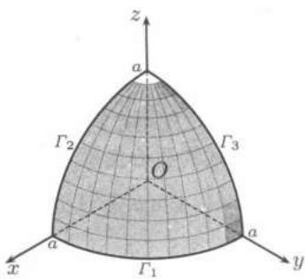

import Guide from '@/components/Guide.astro';
import Knowledge from '@/components/Knowledge.astro';
import Example from '@/components/Example.astro';
import Solution from '@/components/Solution.astro';
import Note from '@/components/Note.astro';
import Block from '@/components/Block.astro';
import Method from '@/components/Method.astro';

```mdx


## 24.1.1 第一型曲线积分的定义与计算

$R^{n}$ 中以点 $A$ 为始点，点 $B$ 为终点的连续不自交的曲线段 $\Gamma = AB$ 称为 $R^{n}$ 中的一条简单曲线。如果 $A = B$，则称 $\Gamma$ 为封闭曲线或闭曲线，否则为不封闭曲线。在 $\Gamma$ 上从 $A$ 到 $B$ 依次取有限个点 $A = A_{0}, A_{1}, \cdots, A_{k} = B$ ，它们确定了 $\Gamma$ 的一个分割 $T$。依次联结 $A_{0}, A_{1}, \cdots, A_{k}$ 的线段组成一条折线，称为 $\Gamma$ 的内接折线，其长度记为 $l(\Gamma, T)$ 。如果

$$
\sup _ {T} \{l (\Gamma , T) \} <   + \infty ,
$$

则称 $\Gamma$ 为可求长曲线, 而且 $l(\Gamma) = \sup_{T} \{l(\Gamma, T)\}$ 称为 $\Gamma$ 的弧长.

下面定义在简单可求长曲线上的第一型曲线积分. 设函数 $f$ 定义在 $\Gamma$ 上, 对于 $\Gamma$ 的任一分割 $T: A = A_{0}, A_{1}, A_{2}, \cdots, A_{k} = B$ , 记 $\Delta S_{i}$ 为从 $A_{i-1}$ 到 $A_{i}$ 的曲线段 $\widetilde{A_{i-1}A_{i}}$ 的弧长, $d(T) = \max_{1 \leq i \leq k} \{\Delta S_{i}\}$ . 任取 $\xi_{i} \in \widetilde{A_{i-1}A_{i}}$ , 如果

$$
\lim _ {d (T) \rightarrow 0} \sum_ {i = 1} ^ {k} f (\boldsymbol {\xi} _ {i}) \Delta S _ {i}
$$

收敛, 且极限与 $\Gamma$ 的具体分法无关, 则称函数 $f$ 在 $\Gamma$ 上的第一型 (或第一类) 曲线积分存在, 其极限值 $I$ 称为 $f$ 在 $\Gamma$ 上的第一型曲线积分. 记为

$$
I = \int_ {\Gamma} f (\boldsymbol {x}) \mathrm{d} s = \int_ {\widetilde {A B}} f (\boldsymbol {x}) \mathrm{d} s.
$$

第一型曲线积分也称为对弧长的积分, 它与曲线的方向选取无关. 对于同一条简单可求长曲线 $\Gamma = \widetilde{AB}$ , 也可选定 $B$ 为始点, $A$ 为终点, 记为 $\Gamma = \widetilde{BA}$ , 则

$$
\int_ {\widetilde {A B}} f (\boldsymbol {x}) \mathrm{d} s = \int_ {\widetilde {B A}} f (\boldsymbol {x}) \mathrm{d} s.
$$

若 $\Gamma$ 是 $\mathbf{R}^n$ 中简单可求长曲线, $f$ 在 $\Gamma$ 上连续, 则 $f$ 在 $\Gamma$ 上的第一型曲线积分存在.

若 $\Gamma$ 是 $R^{n}$ 中逐段光滑的简单曲线, 且有参数表示

$$
\Gamma : \boldsymbol {x} = \boldsymbol {x} (t) \in \mathbf {R} ^ {n}, \quad a \leqslant t \leqslant b,
$$

则弧长微分

$$
\mathrm{d} s = | \pmb {x} ^ {\prime} (t) | \mathrm{d} t = \left[ \sum_ {i = 1} ^ {n} (x _ {i} ^ {\prime} (t)) ^ {2} \right] ^ {\frac {1}{2}} \mathrm{d} t.
$$

从而

$$
\int_ {\Gamma} f (\boldsymbol {x}) \mathrm{d} s = \int_ {a} ^ {b} f (\boldsymbol {x} (t)) | \boldsymbol {x} ^ {\prime} (t) | \mathrm{d} t.\tag{24.1}
$$

<Example title="例 24.1.1">

求 $I = \oint_{C} x^{2} \, \mathrm{d}s$ , 其中 $C$ 为

$$
\left\{ \begin{array}{l} x ^ {2} + y ^ {2} + z ^ {2} = R ^ {2}, \\ x + y + z = 0. \end{array} \right.
$$

<Solution title="解法1：常规方法">

先写出曲线 $C$ 的参数表达式.由于 $C$ 是球面 $x^{2} + y^{2} + z^{2} = R^{2}$ 与经过球心的平面 $x + y + z = 0$ 的交线，因此是空间的一个圆周．它在 $xOy$ 平面上的投影为一个椭圆，这个椭圆方程可从两个曲面方程中消去 $z$ 得到.即以 $z = -(x + y)$ 代入 $x^{2} + y^{2} + z^{2} = R^{2}$ 中，得

$$
x ^ {2} + x y + y ^ {2} = \frac {R ^ {2}}{2}.
$$

将左边配方成平方和

$$
\left(\frac {\sqrt {3}}{2} x\right) ^ {2} + \left(\frac {x}{2} + y\right) ^ {2} = \frac {R ^ {2}}{2}.
$$

令

$$
\frac {\sqrt {3}}{2} x = \frac {R}{\sqrt {2}} \cos t, \quad \frac {x}{2} + y = \frac {R}{\sqrt {2}} \sin t, \quad t \in [ 0, 2 \pi ].
$$

即得到参数表示

$$
x = \sqrt {\frac {2}{3}} R \cos t, \quad y = \frac {R}{\sqrt {2}} \sin t - \frac {R}{\sqrt {6}} \cos t, \quad t \in [ 0, 2 \pi ].
$$

代入 $z = -(x + y)$ 中，得

$$
z = - \frac {R}{\sqrt {6}} \cos t - \frac {R}{\sqrt {2}} \sin t, \quad t \in [ 0, 2 \pi ].
$$

由此得

$$
\begin{array}{r l} \mathrm{d} s & = \sqrt {[ x ^ {\prime} (t) ] ^ {2} + [ y ^ {\prime} (t) ] ^ {2} + [ z ^ {\prime} (t) ] ^ {2}} \mathrm{d} t \\ & = R \sqrt {\frac {2}{3} \sin^ {2} t + \left(\frac {\cos t}{\sqrt {2}} + \frac {\sin t}{\sqrt {6}}\right) ^ {2} + \left(\frac {\sin t}{\sqrt {6}} - \frac {\cos t}{\sqrt {2}}\right) ^ {2}} \mathrm{d} t \\ & = R \mathrm{d} t. \end{array}
$$

故有

$$
\int_ {C} x ^ {2} \mathrm{d} s = \int_ {0} ^ {2 \pi} \frac {2}{3} R ^ {3} \cos^ {2} t \mathrm{d} t = \frac {2}{3} \pi R ^ {3}.
$$

</Solution>

<Solution title="解法2：利用对称性">

由对称性有

$$
\int_ {C} x ^ {2} \mathrm{d} s = \int_ {C} y ^ {2} \mathrm{d} s = \int_ {C} z ^ {2} \mathrm{d} s,
$$

则

$$
\int_ {C} x ^ {2} \mathrm{d} s = \frac {1}{3} \int_ {C} (x ^ {2} + y ^ {2} + z ^ {2}) \mathrm{d} s = \frac {1}{3} R ^ {2} \int_ {C} \mathrm{d} s = \frac {2}{3} \pi R ^ {3}.
$$

</Solution>

</Example>

## 24.1.2 第一型曲线积分的应用

为方便起见, 在 $R^{3}$ 中考虑以下问题.

求弧长 在$(24.1)$中令 $f\equiv1$ ，则得到弧长公式

$$
l = \int_ {\Gamma} \mathrm{d} s = \int_ {a} ^ {b} \sqrt {[ x ^ {\prime} (t) ] ^ {2} + [ y ^ {\prime} (t) ] ^ {2} + [ z ^ {\prime} (t) ] ^ {2}} \mathrm{d} t.
$$

求曲线的质量 设曲线 $\Gamma$ 的线密度为 $\rho(x,y,z)$ ，则曲线 $\Gamma$ 的质量

$$
\begin{array}{l} m = \int_ {\Gamma} \rho (x, y, z) \mathrm{d} s \\ = \int_ {a} ^ {b} \rho (x (t), y (t), z (t)) \sqrt {[ x ^ {\prime} (t) ] ^ {2} + [ y ^ {\prime} (t) ] ^ {2} + [ z ^ {\prime} (t) ] ^ {2}} \mathrm{d} t. \end{array}
$$

求曲线的质心坐标 曲线 $\Gamma$ 的质心坐标 $(x_{0}, y_{0}, z_{0})$ 由下面的公式确定：

$$
x _ {0} = \frac {1}{m} \int_ {\Gamma} x \rho (x, y, z) \mathrm{d} s, y _ {0} = \frac {1}{m} \int_ {\Gamma} y \rho (x, y, z) \mathrm{d} s, z _ {0} = \frac {1}{m} \int_ {\Gamma} z \rho (x, y, z) \mathrm{d} s,
$$

其中 $m=\int_{\Gamma}\rho(x,y,z)\mathrm{d}s$ 为曲线的质量.

<Example title="例 24.1.2">

求曲线 $\Gamma$

$$
\left\{ \begin{array}{l} (x - y) ^ {2} = a (x + y), \\ x ^ {2} - y ^ {2} = \frac {9}{8} z ^ {2} \end{array} \right.
$$

从 $O(0,0,0)$ 到 $A(x_{0},y_{0},z_{0})$ 的弧长, 其中 $a>0$, $x_{0}>0$ .

<Solution title="解">

在曲线方程第一式两边乘 $(x - y)$ ，并利用第二式得

$$
(x - y) ^ {3} = a (x ^ {2} - y ^ {2}) = \frac {9 a}{8} z ^ {2},
$$

即

$$
x - y = \frac {\sqrt [ 3 ]{9 a}}{2} z ^ {2 / 3}.\tag{24.2}
$$

将$(24.2)$代入第一式得

$$
x + y = \frac {3}{4} \sqrt [ 3 ]{\frac {3}{a}} z ^ {4 / 3}.\tag{24.3}
$$

由$(24.2)$，$(24.3)$把 $z$ 看成参数，得

$$
x = \frac {1}{2} \left(\frac {3}{4} \sqrt [ 3 ]{\frac {3}{a}} z ^ {4 / 3} + \frac {\sqrt [ 3 ]{9 a}}{2} z ^ {2 / 3}\right), \quad y = \frac {1}{2} \left(\frac {3}{4} \sqrt [ 3 ]{\frac {3}{a}} z ^ {4 / 3} - \frac {\sqrt [ 3 ]{9 a}}{2} z ^ {2 / 3}\right).
$$

微分后得到

$$
\mathrm{d} x = \frac {1}{2} \left(\sqrt [ 3 ]{\frac {3}{a}} z ^ {1 / 3} + \sqrt [ 3 ]{\frac {a}{3}} z ^ {- 1 / 3}\right) \mathrm{d} z, \quad \mathrm{d} y = \frac {1}{2} \left(\sqrt [ 3 ]{\frac {3}{a}} z ^ {1 / 3} - \sqrt [ 3 ]{\frac {a}{3}} z ^ {- 1 / 3}\right) \mathrm{d} z.
$$

于是

$$
\mathrm{d} s = \sqrt {\mathrm{d} x ^ {2} + \mathrm{d} y ^ {2} + \mathrm{d} z ^ {2}} = \frac {\sqrt {2}}{2} \left(\sqrt [ 3 ]{\frac {3}{a}} z ^ {1 / 3} + \sqrt [ 3 ]{\frac {a}{3}} z ^ {- 1 / 3}\right) \mathrm{d} z = \sqrt {2} \mathrm{d} x,
$$

所以弧长

$$
\int_ {\Gamma} \mathrm{d} s = \int_ {0} ^ {x _ {0}} \sqrt {2} \mathrm{d} x = \sqrt {2} x _ {0}.
$$

</Solution>

</Example>

<Example title="例 24.1.3">

计算球面 $x^{2} + y^{2} + z^{2} = a^{2}$ 在第一卦限部分的边界的质心坐标 $(x_0, y_0, z_0)$ .

<Solution title="解">

应用质心坐标公式, 其中 $\rho \equiv 1$ , $m = \frac{3}{2}\pi a$ . 如图 $24.1$ 所示, 在 $\Gamma_{1}$ 上用极坐标系 $x = a\cos\theta, y = a\sin\theta$ , 则 $\mathrm{d}s = a\,\mathrm{d}\theta$ , 且

$$
\int_ {\Gamma_ {1}} x \mathrm{d} s = \int_ {0} ^ {\pi / 2} a \cos \theta a \mathrm{d} \theta = a ^ {2}.
$$

由对称性 $\int_{\Gamma_2} x \, \mathrm{d}s = a^2$ ，且

$$
\int_ {\Gamma_ {3}} x \mathrm{d} s = 0.
$$



于是

$$
x _ {0} = \frac {2}{3 \pi a} \left(\int_ {\Gamma_ {1}} x \mathrm{d} s + \int_ {\Gamma_ {2}} x \mathrm{d} s\right) = \frac {4 a}{3 \pi}.
$$

图$24.1$

再用对称性得

$$
y _ {0} = z _ {0} = \frac {4 a}{3 \pi}.
$$

</Solution>

</Example>

## 24.1.3 练习题

1. 计算下列第一型曲线积分:

   (1) $\int_{C} (x^{4/3} + y^{4/3}) \, \mathrm{d}s$ , 其中 $C$ 为星形线 $x^{2/3} + y^{2/3} = a^{2/3}$ ;

   (2) $\int_{C} e^{\sqrt{x^{2}+y^{2}}} \mathrm{d}s$ ，其中 $C$ 为由曲线 $r=a$, $\varphi=0$ , $\varphi=\frac{\pi}{4}$ ($r$ 和 $\varphi$ 为极坐标)所界的凸围线;

   (3) $\int_{C} |y| \mathrm{d}s$ , 其中 $C$ 为双纽线 $(x^{2} + y^{2})^{2} = a^{2}(x^{2} - y^{2})$ ;

   (4) $\int_{C} \frac{\mathrm{d}s}{y^2}$ , 其中 $C$ 为悬链线 $y = a \operatorname{ch} \frac{x}{a}$ ;

   (5) $\int_{C} z \, \mathrm{d}s$ , 其中 $C$ 为曲线 $x^{2} + y^{2} = z^{2}, y^{2} = ax$ 从 $(0,0,0)$ 到 $(a, a, \sqrt{2} a)$ 的弧.

2. 求下列空间曲线的弧长:

   (1) $y = a \arcsin \frac{x}{a}, z = \frac{a}{4} \ln \frac{a - x}{a + x}$ 从 $(0,0,0)$ 到 $(x_0, y_0, z_0)$ ;

   $$
   x ^ {2} + y ^ {2} + z ^ {2} = a ^ {2}, \sqrt {x ^ {2} + y ^ {2}} \operatorname{ch} \Big (\arctan {\frac {y}{x}} \Big) = a   \text { 从 } (a, 0, 0)   \text { 到 } (x, y, z). \tag {2}
   $$

3. 计算均匀的曲线 $y = a \operatorname{ch} \frac{x}{a}$ 从 $(0, a)$ 到 $(b, h)$ 的弧的质心坐标.

4. 设 $\Gamma = \widetilde{AB}$ 是 $R^{n}$ 中的简单可求长曲线, $\Gamma$ 的弧长记为 $L$. 对每一个 $s \in [0, L]$ , 存在惟一的 $x \in \Gamma$ , $\boldsymbol{x} = (x_{1}, x_{2}, \cdots, x_{n})$ , 使得 $\Gamma$ 上从 $A$ 到 $x$ 的曲线段 $\widetilde{Ax}$ 的弧长等于 $s$, 由此定义了一个 $[0, L]$ 上的函数

   $$
   \boldsymbol {x} = \boldsymbol {x} (s), \quad 0 \leqslant s \leqslant L.\tag{24.4}
   $$

   即曲线 $\Gamma$ 以弧长 $s$ 为参数的参数方程为 $(24.4)$. 设 $f$ 是定义在 $\Gamma$ 上的函数, 如果 $f$ 在 $\Gamma$ 上的第一型曲线积分存在, 则

   $$
   \int_ {\Gamma} f (\boldsymbol {x}) \mathrm{d} s = \int_ {0} ^ {L} f (\boldsymbol {x} (s)) \mathrm{d} s.
   $$

```
