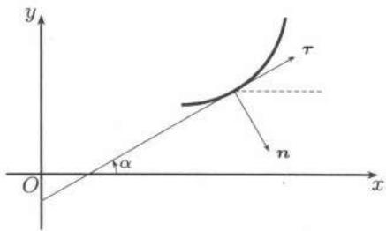

import Guide from '@/components/Guide.astro';
import Knowledge from '@/components/Knowledge.astro';
import Example from '@/components/Example.astro';
import Solution from '@/components/Solution.astro';
import Note from '@/components/Note.astro';
import Block from '@/components/Block.astro';
import Method from '@/components/Method.astro';

## 24.2.1 第二型曲线积分的定义和计算

第二型曲线积分的物理背景之一是质点受力沿曲线运动所做的功. 因此我们给定了曲线的起点和终点. 这样的曲线称为有向曲线. 下面以 $\mathbf{R}^3$ 为例定义第二型曲线积分. 设 $\Gamma = \widetilde{AB}$ 是 $\mathbf{R}^3$ 中一条简单可求长的有向曲线

$$
\boldsymbol {F} = \boldsymbol {F} (x, y, z) = P (x, y, z) \boldsymbol {i} + Q (x, y, z) \boldsymbol {j} + R (x, y, z) \boldsymbol {k}
$$

为定义在 $\Gamma$ 上的向量值函数. 对于与 $\Gamma$ 方向一致的任意分割 $T$,

$$
T: A = A _ {0}, A _ {1}, A _ {2}, \dots , A _ {m} = B,
$$

记 $A_{i} = (x_{i},y_{i},z_{i})$, $\Delta x_{i} = x_{i} - x_{i - 1}$, $\Delta y_{i} = y_{i} - y_{i - 1}$, $\Delta z_{i} = z_{i} - z_{i - 1}$, $\Delta S_{i}$ 为曲线段 $\widetilde{A_{i - 1}A_i}$ 的弧长， $d(T) = \max_{1\leqslant i\leqslant m}\{\Delta S_i\}$ .任取 $(\xi_i,\eta_i,\zeta_i)\in \widetilde{A_{i - 1}A_i}$ ，如果极限

$$
\lim _ {d (T) \rightarrow 0} \sum_ {i} \left[ P (\xi_ {i}, \eta_ {i}, \zeta_ {i}) \Delta x _ {i} + Q (\xi_ {i}, \eta_ {i}, \zeta_ {i}) \Delta y _ {i} + R (\xi_ {i}, \eta_ {i}, \zeta_ {i}) \Delta z _ {i} \right]
$$

存在且极限与 $\Gamma$ 的具体分法以及 $(\xi_i, \eta_i, \zeta_i)$ 的具体取法无关，则称 $F$ 沿 $\Gamma$ 的第二型曲线积分存在，极限值称为 $F$ 沿 $\Gamma$ 的第二型曲线积分，记为

$$
I = \int_ {\Gamma} P (x, y, z) \mathrm{d} x + Q (x, y, z) \mathrm{d} y + R (x, y, z) \mathrm{d} z
$$

或

$$
I = \int_ {\Gamma} \boldsymbol {F} (x, y, z) \cdot \mathrm{d} \boldsymbol {r}.
$$

第二型曲线积分又称为对坐标的积分.

若逐段光滑的有向曲线 $\Gamma$ 有参数表示

$$
x = x (t), \quad y = y (t), \quad z = z (t), \quad a \leqslant t \leqslant b,
$$

其中 $[a, b]$ 是实轴上的有向区间，参数 $t$ 从 $a$ 变到 $b$ 与 $\Gamma$ 的定向一致，设 $P(x, y, z)$ ， $Q(x, y, z)$ ， $R(x, y, z)$ 在 $\Gamma$ 上连续，则

$$
\begin{array}{l} \int_ {\Gamma} P (x, y, z) \mathrm{d} x + Q (x, y, z) \mathrm{d} y + R (x, y, z) \mathrm{d} z \\ = \int_ {a} ^ {b} [ P (x (t), y (t), z (t)) x ^ {\prime} (t) + Q (x (t), y (t), z (t)) y ^ {\prime} (t) + R (x (t), y (t), z (t)) z ^ {\prime} (t) ] \mathrm{d} t. \end{array}
$$

<Example title="例24.2.1">

计算积分

$$
I = \int_ {C} (x ^ {2} + 2 x y) \mathrm{d} y,
$$

其中 $C$ 表示逆时针方向的上半椭圆 $\frac{x^{2}}{a^{2}} + \frac{y^{2}}{b^{2}} = 1$ .

<Solution title="解">

利用椭圆的参数表达式

$$
x = a \cos t, \quad y = b \sin t,
$$

按给定方向 $t$ 由 $0$ 变到 $\pi$ ，将 $x$, $y$ 用 $t$ 的表达式代入并用 $b \cos t \, \mathrm{d}t$ 来代替 $\mathrm{d}y$，得

$$
\begin{array}{r l} I & = \int_ {0} ^ {\pi} (a ^ {2} \cos^ {2} t + 2 a b \cos t \sin t) b \cos t \mathrm{d} t \\ & = a ^ {2} b \int_ {0} ^ {\pi} \cos^ {3} t \mathrm{d} t + 2 a b ^ {2} \int_ {0} ^ {\pi} \cos^ {2} t \sin t \mathrm{d} t = \frac {4}{3} a b ^ {2}. \end{array}
$$

</Solution>

</Example>

<Example title="例24.2.2">

求 $I = \int_{\Gamma} y^{2} \, \mathrm{d}x + z^{2} \, \mathrm{d}y + x^{2} \, \mathrm{d}z,$ 其中 $\Gamma$ 为曲线

$$
\left\{ \begin{array}{l} x ^ {2} + y ^ {2} + z ^ {2} = a ^ {2}, \\ x ^ {2} + y ^ {2} = a x (a > 0) \end{array} \right.
$$

上 $z \geqslant 0$ 的部分 (即 $Viviani$ 体的顶部曲线), 且从 $x$ 轴正向看 $\Gamma$ 是逆时针方向.

<Solution title="解">

参见图 $22.11$. 先求曲线 $\Gamma$ 的参数表达式. 若以 $x$, $y$, $z$ 之一为参数, 则要涉及开方运算, 出现分支, 很不方便. 从第二个方程易见引入柱坐标

$$
x = r \cos \theta , \quad y = r \sin \theta , \quad z = z,
$$

于是 $\Gamma$ 的参数方程为

$$
\begin{array}{l} {x = a \cos^ {2} \theta , \quad y = a \cos \theta \sin \theta ,} \\ {z = \sqrt {a ^ {2} - r ^ {2}} = a | \sin \theta |, \quad - \frac {\pi}{2} \leqslant \theta \leqslant \frac {\pi}{2}.} \end{array}
$$

根据曲线定向, 有

$$
\begin{array}{r l} I = & \int_ {- \pi / 2} ^ {\pi / 2} \left[ a ^ {2} \cos^ {2} \theta \sin^ {2} \theta \cdot 2 a \cos \theta (- \sin \theta) \right. \\ & \left. + a ^ {2} \sin^ {2} \theta \cdot a (\cos^ {2} \theta - \sin^ {2} \theta) + a ^ {2} \cos^ {4} \theta \cdot z ^ {\prime} (\theta) \right] d \theta . \end{array}
$$

第一项是奇函数, 且因子 $z(\theta)$ 是偶函数, 所以 $z'(\theta)$ 是奇函数, 故第三项也是奇函数, 于是

$$
\begin{array}{r l} I & = \int_ {- \pi / 2} ^ {\pi / 2} a ^ {3} \sin^ {2} \theta (\cos^ {2} \theta - \sin^ {2} \theta) \mathrm{d} \theta \\ & = 2 a ^ {3} \int_ {0} ^ {\pi / 2} (\sin^ {2} \theta - 2 \sin^ {4} \theta) \mathrm{d} \theta = - \frac {\pi}{4} a ^ {3}. \end{array}
$$

</Solution>

</Example>

有的时候空间曲线的参数方程不容易写出或写出来比较复杂, 我们可以借助下列命题把问题转化为平面曲线的曲线积分.

<Knowledge title="命题24.2.1">

设逐段光滑曲线 $\Gamma$ 在光滑曲面 $z = f(x,y)$ 上，曲线 $\Gamma$ 在 $xOy$ 平面上的投影曲线为 $\gamma$ ，函数 $P(x,y,z)$ 在 $\Gamma$ 上连续，则

$$
\oint_ {\Gamma} P (x, y, z) \mathrm{d} x = \oint_ {\gamma} P (x, y, f (x, y)) \mathrm{d} x,
$$

其中 $\gamma$ 的定向与 $\Gamma$ 的定向一致.

<Solution title="证明">

设 $\gamma$ 的参数方程为

$$
x = \varphi (t), \quad y = \psi (t), \quad a \leqslant t \leqslant b,
$$

则空间曲线 $\Gamma$ 的方程为

$$
x = \varphi (t), \quad y = \psi (t), \quad z = f (\varphi (t), \psi (t)).
$$

于是

$$
\begin{array}{r l} \oint_ {\Gamma} P (x, y, z) \mathrm{d} x & = \int_ {a} ^ {b} P [ \varphi (t), \psi (t), f (\varphi (t), \psi (t)) ] \varphi^ {\prime} (t) \mathrm{d} t \\ & = \oint_ {\gamma} P (x, y, f (x, y)) \mathrm{d} x. \end{array}
$$

</Solution>

</Knowledge>

## 24.2.2 两类曲线积分的关系

坐标微元 $\mathrm{d}\pmb {r} = \pmb{\tau}\mathrm{d}s,$ 其中 $\pmb{\tau}$ 为曲线沿指定方向的单位切向.因而就有

$$
\int_ {\Gamma} \boldsymbol {F} (\boldsymbol {x}) \cdot \mathrm{d} \boldsymbol {r} = \int_ {\Gamma} (\boldsymbol {F} (\boldsymbol {x}) \cdot \boldsymbol {\tau}) \mathrm{d} s.
$$

对于空间曲线 $\Gamma$ ，设 $\cos \alpha ,\cos \beta ,\cos \gamma$ 是切方向余弦，则

$$
\int_ {\Gamma} P \mathrm{d} x + Q \mathrm{d} y + R \mathrm{d} z = \int_ {\Gamma} (P \cos \alpha + Q \cos \beta + R \cos \gamma) \mathrm{d} s.\tag{24.5}
$$

当 $\Gamma$ 为平面曲线时, 取法线的方向 $n$ 与切线的方向 $\tau$ 的夹角 $\angle(n,\tau)=\frac{\pi}{2}$ , 见图 $24.2$, 则

$$
\begin{array}{c} {{\angle (x, \pmb {n}) = \angle (x, \pmb {\tau}) + \angle (\pmb {\tau}, \pmb {n}) = \alpha - \frac {\pi}{2},}} \\ {{\text {即}}} \end{array}
$$

$$
\cos \alpha = - \sin (x, \boldsymbol {n}), \quad \sin \alpha = \cos (x, \boldsymbol {n}).
$$

于是 $\Gamma$ 为平面曲线时

<figure class="vp-figure">
  
  <figcaption>图24.2</figcaption>
</figure>

$$
\int_ {\Gamma} P \mathrm{d} x + Q \mathrm{d} y = \int_ {\Gamma} [ - P \sin (x, \boldsymbol {n}) + Q \cos (x, \boldsymbol {n}) ] \mathrm{d} s.\tag{24.6}
$$

## 24.2.3 第二型曲线积分的应用

求变力做功

<Example title="例24.2.3">

已知一平面力场, 它的方向指向坐标原点, 它的大小与它到原点的距离 $r$ 的平方成反比:

$$
F = \frac {\mu}{r ^ {2}},
$$

其中 $\mu$ 为常数. 计算当质量 $m = 1$ 的质点自位置 $A$ 移动到位置 $B$ (不通过原点)时力场做的功.

<Solution title="解">

以 $(x, y)$ 表示点的坐标. 设力与 $x$ 轴的夹角 $\theta$ , 则

$$
\cos \theta = - \frac {x}{r}, \quad \sin \theta = - \frac {y}{r}.
$$

于是力在 $x$, $y$ 方向的分量分别为

$$
F _ {1} (x, y) = F \cos \theta = - \mu \frac {x}{r ^ {3}}, \quad F _ {2} (x, y) = F \sin \theta = - \mu \frac {y}{r ^ {3}}.
$$

而功可表示为曲线积分

容易看出

$$
\begin{array}{r l} w & = - \mu \int_ {\widetilde {A B}} \frac {x \mathrm{d} x + y \mathrm{d} y}{r ^ {3}}. \\ & - \frac {x \mathrm{d} x + y \mathrm{d} y}{r ^ {3}} = \mathrm{d} \frac {1}{r}, \end{array}\tag{24.7}
$$

且如将 $x$, $y$ 用参数表达式 $x = \varphi(t), y = \psi(t)$ 代入，其中 $a \leqslant t \leqslant b$ ，并令

$$
r = \sqrt {x ^ {2} + y ^ {2}} = \sqrt {\varphi^ {2} (t) + \psi^ {2} (t)}
$$

时, 等式 $(24.7)$ 仍成立. 于是

$$
w = \mu \int_ {a} ^ {b} \mathrm{d} \frac {1}{r} = \left. \frac {\mu}{r} \right| _ {a} ^ {b} = \mu \left(\frac {1}{r _ {B}} - \frac {1}{r _ {A}}\right),
$$

其中 $r_{A}, r_{B}$ 分别表示原点到点 $A$, $B$ 的距离.

</Solution>

</Example>

梯度曲线 设 $f$ 是区域 $D \subset R^{3}$ 上的 $C^{1}$ 函数，并设 $\nabla f$ 是在 $D$ 上处处不为零的向量。若 $\Gamma$ 是自某点 $(x_{0}, y_{0}, z_{0}) \in D$ 出发的可微曲线，它的每一点的切线方向与 $f$ 的梯度方向一致，就称 $\Gamma$ 为 $f$ 在 $D$ 上的梯度曲线。设 $\Gamma$ 的参数方程为

$$
x = x (t), \quad y = y (t), \quad z = z (t),
$$

则可取 $x(t)$ ， $y(t)$ 和 $z(t)$ 满足如下微分方程组：

$$
\frac {\mathrm{d} x}{\mathrm{d} t} = \frac {1}{| \nabla f |} \frac {\partial f}{\partial x}, \quad \frac {\mathrm{d} y}{\mathrm{d} t} = \frac {1}{| \nabla f |} \frac {\partial f}{\partial y}, \quad \frac {\mathrm{d} z}{\mathrm{d} t} = \frac {1}{| \nabla f |} \frac {\partial f}{\partial z},\tag{24.8}
$$

初始值为 $x(0) = x_0, y(0) = y_0, z(0) = z_0$ 。由常微分方程组解的存在性定理和延拓定理①， $x(t), y(t)$ 和 $z(t)$ 在 $D$ 内存在并可延伸到 $D$ 的边界。由 $(24.8)$， $\Gamma$ 的弧长微分满足

$$
\mathrm{d} s = \sqrt {(x ^ {\prime} (t)) ^ {2} + (y ^ {\prime} (t)) ^ {2} + (z ^ {\prime} (t)) ^ {2}} \mathrm{d} t = \mathrm{d} t.
$$

下面我们借助 $\mathbf{R}^2$ 中的梯度曲线重新讨论例题21.3.3.这是著名的美国大学 $Putnam$ 竞赛第二十八届的B6题，它公布的标准答案就是例题21.3.3的解答.我们现在可以将那里的梯度模的最小值的上界估计从 $16$ 改进为 $4$.

<Example title="例24.2.4">

设 $f(x,y)$ 在单位圆盘 $D = \{(x,y)\mid x^2 +y^2\leqslant 1\}$ 上具有连续的一阶偏导数，且满足 $|f(x,y)|\leqslant 1,\forall (x,y)\in D$ ，证明：存在点 $\boldsymbol{p}_0(x_0,y_0)\in \mathrm{int}D = \{(x,y)\mid x^2 +y^2 < 1\}$ ，使得 $(f_x^2 +f_y^2)\big|_{(x_0,y_0)}\leqslant 4.$

<Solution title="证明">

如果有点 $(x_0, y_0)$ , 使 $\nabla f(x_0, y_0) = 0$ , 即 $f_x(x_0, y_0) = f_y(x_0, y_0) = 0$ , 则估计式成立. 如果 $\nabla f$ 在 $D$ 中处处不为零向量, 则 $f$ 在 $D$ 中的梯度曲线存在. 设 $\Gamma$ 是 $f$ 在 $D$ 中的梯度曲线, 其参数方程为

$$
x = x (t), \quad y = y (t), \quad t \in [ 0, T ],
$$

$\Gamma$ 的起点为原点, 终点为 $(x(T), y(T))$ . 由曲线积分公式得到

$$
\begin{array}{r l} f (x (T), y (T)) - f (0, 0) & = \int_ {0} ^ {T} \left(\frac {\partial f}{\partial x} x ^ {\prime} (t) + \frac {\partial f}{\partial y} y ^ {\prime} (t)\right) \mathrm{d} t \\ & = \int_ {0} ^ {T} \frac {\frac {\partial f}{\partial x} x ^ {\prime} (t) + \frac {\partial f}{\partial y} y ^ {\prime} (t)}{\sqrt {(x ^ {\prime} (t)) ^ {2} + (y ^ {\prime} (t)) ^ {2}}} \cdot \sqrt {(x ^ {\prime} (t)) ^ {2} + (y ^ {\prime} (t)) ^ {2}} \mathrm{d} t \\ & = \int_ {\Gamma} (\nabla f (x, y) \cdot \boldsymbol {\tau}) \mathrm{d} s. \end{array}
$$

设 $l$ 是 $\Gamma$ 的弧长, 并且 $\Gamma$ 自原点出发到达 $D$ 的边界, 则 $l \geqslant 1$ . 如果在 $\mathrm{int}D$ 上处处有 $\nabla f(x, y) \cdot \tau > 2$ , 则就有

$$
2 \geqslant | f (x (T), y (T)) - f (0, 0) | > 2 l \geqslant 2,
$$

引出矛盾. 因此存在 $(x_0, y_0) \in \mathrm{int}D$ , 使 $\nabla f(x_0, y_0) \cdot \tau \leqslant 2$ . 又因为 $\nabla f$ 与 $\tau$ 相切, 故 $\nabla f(x_0, y_0) \cdot \tau = |\nabla f(x_0, y_0)| \leqslant 2$ , 即 $(f_x^2 + f_y^2)|_{(x_0, y_0)} \leqslant 4$ .

</Solution>

用梯度曲线来估计函数差的下界也是十分有效的, 其依据就是函数沿梯度方向增长最快. 用这样的方法可以证明如下的高维中值定理 (见《美国数学月刊》(1999) 第 $106$ 卷 $674$-$675$ 页, 其证明作为第二组参考题 $2$).

设 $f(\pmb{x})$ 为定义在以 $r$ 为半径的 $n$ 维球

$$
D = \left\{\boldsymbol {x} = \left(x _ {1}, x _ {2}, \dots , x _ {n}\right) \mid x _ {1} ^ {2} + x _ {2} ^ {2} + \dots + x _ {n} ^ {2} \leqslant r ^ {2} \right\}
$$

上的连续可微函数, 则存在点 $\boldsymbol{p}_{0}=(p_{1}^{0},p_{2}^{0},\cdots,p_{n}^{0})\in\mathrm{int}D$ , 使

$$
\max _ {\boldsymbol {x} \in D} \{f (\boldsymbol {x}) \} - \min _ {\boldsymbol {x} \in D} \{f (\boldsymbol {x}) \} = | \nabla f (\boldsymbol {p} _ {0}) | \cdot 2 r.
$$

利用这个结果或修改上述例题中的证明可以将估计值 $4$ 改进为最佳的估计值 $1$.

</Example>

## 24.2.4 练习题

1. 计算 $\int_{L} xy \, dx + (y - x) \, dy$ ，其中 $L$ 为曲线， $\widetilde{AB}$ 方向为由 $A$ 到 $B$， $A = (1, 1)$ ， $B = (2, 3)$ :

(1) $\widetilde{AB}$ 是直线 $AB$ ; (2) $\widetilde{AB}$ 的方程是 $y = 2(x - 1)^2 + 1$ ; (3) $\widetilde{AB}$ 是折线 $\overline{ADB}, D = (2,1)$ .

2. 求 $\int_{C}\frac{x}{y}dx+\frac{1}{y-a}dy$ ，其中 $C$ 是旋轮线 $x=a(t-\sin t)$ ， $y=a(1-\cos t)$ 对应于 $t=\frac{\pi}{6}$ 到 $t=\frac{\pi}{3}$ 的一段.

3. 求 $\int_{C} (x + y)^{2} \mathrm{d}x + (x^{2} - y^{2}) \mathrm{d}y$ ，其中 $C$ 是以 $A(1,1), B(3,2), D(3,1)$ 为顶点的三角形，取顺时针方向.

4. 求 $\int_{C} 4xy^{2} \mathrm{~d}x - 3x^{4} \mathrm{~d}y$ ，其中 $C$ 是抛物线 $y = \frac{1}{2} x^{2}$ 自 $(0,0)$ 到 $(2,2)$ 的一段.

5. 求 $\oint_{C} (y^2 + z^2) \, \mathrm{d}x + (z^2 + x^2) \, \mathrm{d}y + (x^2 + y^2) \, \mathrm{d}z$ ，其中 $C$ 是曲面 $x^2 + y^2 + z^2 = 2Rx$ ， $x^2 + y^2 = 2ax$ 的交线 $(0 < a < R, z > 0)$ ，且由 $z$ 轴正向看是逆时针方向。

6. 求 $\int_{C} y \, dx + z \, dy + x \, dz$ ，其中 $C$ 为球面上的曲线： $x = R \sin \varphi \cos \theta, y = R \sin \varphi \sin \theta, z = R \cos \varphi,$ $R > 0, 0 \leqslant \varphi \leqslant \pi, 0 \leqslant \theta < 2\pi,$

并且使(1) $R, \varphi$ 为常数；或(2) $R, \theta$ 为常数.

7. 求 $\int_{C}(x^{2}+5y+3yz)\mathrm{d}x+(5x+3xy-2)\mathrm{d}y+(3xy-4z)\mathrm{d}z,$ 其中 $C$ 为
(1) $x = a \cos t, y = a \sin t, z = \frac{bt}{2\pi}$ 自 $t = 0$ 到 $2\pi$ 的一段;

(2) 直线段 $AB$, 起点 $A = (a, 0, 0)$ , 终点 $B = (a, 0, b)$ .

8. 已知力场 $\boldsymbol{F}(x,y,z)=y\boldsymbol{i}-x\boldsymbol{j}+(x+y+z)\boldsymbol{k}$ ，求质点沿曲线 $x=a\cos t, y=a\sin t, z=\frac{b}{2\pi}t$ 从点 $A(a,0,0)$ 运动到点 $B(a,0,b)$ 时，力场 $\boldsymbol{F}$ 对质点所做的功.

9. 质点在力场 $F = \frac{e^{x}}{1 + y^{2}} i + \frac{2y(1 - e^{x})}{(1 + y^{2})^{2}} j$ 作用下，沿 $x^{2} + (y - 1)^{2} = 1$ 由点 $(0,0)$ 沿顺时针方向运动到点 $(1,1)$，求力场所做的功.
