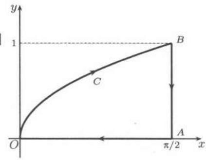
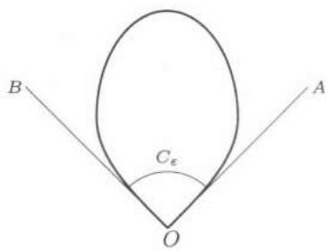

import Guide from '@/components/Guide.astro';
import Knowledge from '@/components/Knowledge.astro';
import Example from '@/components/Example.astro';
import Solution from '@/components/Solution.astro';
import Note from '@/components/Note.astro';
import Block from '@/components/Block.astro';

import Method from '@/components/Method.astro';

## $24.3.1$ $Green$公式

$Green$ 公式是将平面内的某区域上的二重积分与该区域边界上的一个特定的第二型曲线积分之间建立联系的一个重要公式.

设 $D$ 是 $\mathbf{R}^2$ 内的一个有界闭区域, 其边界 $\partial D$ 由光滑曲线或逐段光滑曲线组成. 又设函数 $P$, $Q$ 在 $D$ 上有关于自变量 $x$ 和 $y$ 的连续偏导数, 则下列 $Green$ 公式成立:

$$
\iint_ {D} \left(- \frac {\partial P}{\partial y} + \frac {\partial Q}{\partial x}\right) \mathrm{d} x \mathrm{d} y = \oint_ {\partial D} P \mathrm{d} x + Q \mathrm{d} y,\tag{24.9}
$$

其中 $\partial D$ 的方向关于 D 是正向的.

由平面上两类曲线积分之间的关系式$(24.6)$知, $Green$ 公式$(24.9)$又可以写为

$$
\begin{array}{r l} \iint_ {D} \left(\frac {\partial P}{\partial x} + \frac {\partial Q}{\partial y}\right) \mathrm{d} x \mathrm{d} y & = \oint_ {\partial D} - Q \mathrm{d} x + P \mathrm{d} y \\ & = \oint_ {\partial D} [ Q \sin (x, \boldsymbol {n}) + P \cos (x, \boldsymbol {n}) ] \mathrm{d} s, \end{array}
$$

其中 $n$ 是 $\partial D$ 上的单位外法向量. 利用 $\angle(x,n)=\angle(x,y)+\angle(y,n)=\frac{\pi}{2}+\angle(y,n)$ (参见图 $24.2$), 则

$$
\iint_ {D} \left(\frac {\partial P}{\partial x} + \frac {\partial Q}{\partial y}\right) \mathrm{d} x \mathrm{d} y = \oint_ {\partial D} [ P \cos (x, \boldsymbol {n}) + Q \cos (y, \boldsymbol {n}) ] \mathrm{d} s.\tag{24.10}
$$

公式 $(24.9)$, $(24.10)$ 给我们提供了间接求平面上曲线积分的方法, 即利用 $Green$ 公式将曲线积分化为二重积分, 即使曲线 $C$ 不封闭, 也可以采用添加“辅助线”的方法去做.

<Example title="例题 24.3.1">
C 为抛物线 $2x = \pi y^{2}$ 自 $(0,0)$ 到 $\left(\frac{\pi}{2},1\right)$ 的弧段, 求

$$
I = \int_ {C} (2 x y ^ {3} - y ^ {2} \cos x) \mathrm{d} x + (1 - 2 y \sin x + 3 x ^ {2} y ^ {2}) \mathrm{d} y.
$$

<Solution title="解">
令 $P(x,y) = 2xy^{3} - y^{2}\cos x$, $Q(x,y) = 1 - 2y\sin x + 3x^{2}y^{2}$ ，则

$$
- \frac {\partial P}{\partial y} + \frac {\partial Q}{\partial x} = 0.
$$

为了利用 $Green$ 公式 $(24.9)$, 添加辅助线 (如图 $24.3$), 则

$$
I = \int_ {C} + \int_ {\widetilde {B A}} + \int_ {\widetilde {A O}} + \int_ {\widetilde {A B}} + \int_ {\widetilde {O A}}.
$$

由 $Green$ 公式, 前三项的积分为零, 于是

$$
\begin{array}{r l} I & = \int_ {\widetilde {A B}} + \int_ {\widetilde {O A}} \\ & = \int_ {0} ^ {1} \left[ 1 - 2 y \sin \frac {\pi}{2} + 3 \left(\frac {\pi}{2}\right) ^ {2} y ^ {2} \right] \mathrm{d} y = \frac {\pi^ {2}}{4}. \end{array}
$$

  
图$24.3$
</Solution>
</Example>

<Example title="例题 24.3.2">
计算积分

$$
I = \oint_ {C} \frac {\cos (\boldsymbol {r} , \boldsymbol {n})}{r} \mathrm{d} s,
$$

其中 C 为逐段光滑的简单闭曲线, $\boldsymbol{r} = (x, y)$ , $r = |r| = \sqrt{x^{2} + y^{2}}$ , $n$ 是 C 上的单位外法向量.

<Solution title="解">
由 $\cos (\pmb {r},\pmb{n}) = \frac{\pmb{r}\cdot\pmb{n}}{r} = \frac{1}{r} (x\cos (\pmb {n},x) + y\cos (\pmb {n},y))$ 得到

$$
I = \oint_ {C} \left(\frac {x}{r ^ {2}} \cos (\boldsymbol {n}, x) + \frac {y}{r ^ {2}} \cos (\boldsymbol {n}, y)\right) d s.
$$

当 $(0,0)$ 在 $C$ 外时，利用 $Green$ 公式$(24.10)$，则

$$
I = \iint_ {D} \left[ \partial_ {x} (\frac {x}{r ^ {2}}) + \partial_ {y} (\frac {y}{r ^ {2}}) \right] \mathrm{d} x \mathrm{d} y = 0,
$$

其中 $D$ 是以 $C$ 为边界的区域.

当 $(0,0)$ 在 $C$ 内时，以 $(0,0)$ 为圆心，以充分小的 $\varepsilon$ 为半径作圆 $C_{\varepsilon}$ ，使得 $C_{\varepsilon}$ 在 $C$ 内，以 $C$ 及 $C_{\varepsilon}$ 为边界的区域为 $D_{\varepsilon}$ ，则

$$
\begin{array}{r l} I = & \oint_ {C} \left(\frac {x}{r ^ {2}} \cos (\boldsymbol {n}, x) + \frac {y}{r ^ {2}} \cos (\boldsymbol {n}, y)\right) \mathrm{d} s + \oint_ {C _ {\varepsilon}} \left(\frac {x}{r ^ {2}} \cos (\boldsymbol {n}, x) + \frac {y}{r ^ {2}} \cos (\boldsymbol {n}, y)\right) \mathrm{d} s \\ & - \oint_ {C _ {\varepsilon}} \left(\frac {x}{r ^ {2}} \cos (\boldsymbol {n}, x) + \frac {y}{r ^ {2}} \cos (\boldsymbol {n}, y)\right) \mathrm{d} s. \end{array}
$$

其中 $C_{\varepsilon}$ 上的单位法向量 $\pmb{n}$ 的方向指向坐标原点.对前两项用 $Green$ 公式，则

$$
I = - \oint_ {C _ {\varepsilon}} \left(\frac {x}{r ^ {2}} \cos (\boldsymbol {n}, x) + \frac {y}{r ^ {2}} \cos (\boldsymbol {n}, y)\right) d s.
$$

在圆周 $C_{\varepsilon}$ 上，

$$
\cos (\boldsymbol {n}, x) = - \frac {x}{\varepsilon}, \cos (\boldsymbol {n}, y) = - \frac {y}{\varepsilon}, r = \varepsilon ,
$$

从而

$$
I = \oint_ {C _ {\varepsilon}} \frac {1}{\varepsilon} \mathrm{d} s = 2 \pi .
$$

当 $(0,0)\in C$ 时，过原点作曲线 $C$ 的切线 $OA$, $OB$, 设 $OA$, $OB$ 的夹角为 $\theta$ （见图$24.4$），如果曲线 $C$ 在原点光滑，则 $\theta = \pi$

作一个以 $(0,0)$ 点为心， $\varepsilon$ 为半径的圆 $B_{\varepsilon}$ ，记 $B_{\varepsilon}$ 的圆周在 $C$ 内的部分为 $C_{\varepsilon}$ ，由上面的计算知

$$
I = \lim _ {\varepsilon \rightarrow 0} \int_ {C _ {\varepsilon}} \frac {1}{\varepsilon} \mathrm{d} s = \lim _ {\varepsilon \rightarrow 0} \theta_ {\varepsilon} = \theta ,
$$

  
图$24.4$

其中 $\theta_{\varepsilon}$ 是 $C_{\varepsilon}$ 所对应的圆心角.
</Solution>

<Note title="注意">
注意使用 $Green$ 公式的条件: $P$, $Q$ 在 $D$ 上连续可微. 这正是在本题中要区分 $(0,0)$ 在 $C$ 外, $C$ 内和 $C$ 上三种情况讨论的缘故. 许多学生没有能够注意到这里的区别, 尤其是当点 $(0,0)$ 在 $C$ 内时, 他们会错误地认为被积函数在 $C$ 上是连续可微的, 因而 $Green$ 公式就可以了.
</Note>
</Example>

<Example title="例题 24.3.3">
计算

$$
I = \oint_ {C} \frac {\mathrm{e} ^ {y}}{x ^ {2} + y ^ {2}} \left[ (x \sin x + y \cos x) \mathrm{d} x + (y \sin x - x \cos x) \mathrm{d} y \right],
$$

其中 $C: x^{2} + y^{2} = 1$ ，取逆时针方向.

<Solution title="解">
令

$$
P (x, y) = \frac {\mathrm{e} ^ {y}}{x ^ {2} + y ^ {2}} (x \sin x + y \cos x),
$$

$$
Q (x, y) = \frac {\mathrm{e} ^ {y}}{x ^ {2} + y ^ {2}} (y \sin x - x \cos x),
$$

由计算知 $\frac{\partial P}{\partial y} = \frac{\partial Q}{\partial x}$ ，从而可在不包含原点的区域上用 $Green$ 公式．为此取 $C_{\varepsilon}:x^{2} + y^{2} = \varepsilon^{2}$ ，取逆时针方向，则

$$
I = \oint_ {C} - \oint_ {C _ {\varepsilon}} + \oint_ {C _ {\varepsilon}}.
$$

对等式右边前两项用 $Green$ 公式, 于是

$$
\begin{array}{l} I = \oint_ {C _ {\varepsilon}} \frac {\mathrm{e} ^ {y}}{x ^ {2} + y ^ {2}} \left[ (x \sin x + y \cos x) \mathrm{d} x + (y \sin x - x \cos x) \mathrm{d} y \right] \\ = \frac {1}{\varepsilon^ {2}} \oint_ {C _ {\varepsilon}} \mathrm{e} ^ {y} \left[ (x \sin x + y \cos x) \mathrm{d} x + (y \sin x - x \cos x) \mathrm{d} y \right]. \end{array}
$$

记 $C_{\varepsilon}$ 围成的区域为 $D_{\varepsilon}$ ，再用一次 $Green$ 公式，则

$$
I = \frac {1}{\varepsilon^ {2}} \iint_ {D _ {\varepsilon}} - 2 \mathrm{e} ^ {y} \cos x \mathrm{d} x \mathrm{d} y.
$$

应用积分中值定理得到

$$
I = \frac {1}{\varepsilon^ {2}} (- 2 \pi \varepsilon^ {2} \mathrm{e} ^ {\eta} \cos \xi) = - 2 \pi \mathrm{e} ^ {\eta} \cos \xi ,
$$

其中 $(\xi, \eta) \in D_{\varepsilon}$ . 上述等式 $\forall \varepsilon > 0$ 都对, 令 $\varepsilon \to 0$ , 得

$$
I = \lim _ {\varepsilon \rightarrow 0 ^ {+}} (- 2 \pi \mathrm{e} ^ {\eta} \cos \xi) = - 2 \pi .
$$
</Solution>
</Example>

平面图形的面积 作为 $Green$ 公式的直接推论, 可以得到如下的面积公式.

由逐段光滑的简单曲线 $C$ 所界的面积 $S$ 可用曲线积分表示为

$$
S = \oint_ {C} x \mathrm{d} y = - \oint_ {C} y \mathrm{d} x = \frac {1}{2} \oint_ {C} x \mathrm{d} y - y \mathrm{d} x,
$$

其中曲线的正向为逆时针方向(参见上册$336$-$340$页的公式$(11.1)$及例题).

<Example title="例题 24.3.4">
计算双纽线

$$
(x ^ {2} + y ^ {2}) ^ {2} = a ^ {2} (x ^ {2} - y ^ {2})\tag{24.11}
$$

所围区域的面积.

<Solution title="解 1">
由对称性只需计算第一、四象限的面积. 令

$$
x = r \cos \theta , y = r \sin \theta , - \frac {\pi}{4} \leqslant \theta \leqslant \frac {\pi}{4},
$$

代入方程$(24.11)$得 $r=a\sqrt{\cos2\theta}$ ，则参数方程为

$$
x (\theta) = a \cos \theta \sqrt {\cos 2 \theta}, y (\theta) = a \sin \theta \sqrt {\cos 2 \theta}, - \frac {\pi}{4} \leqslant \theta \leqslant \frac {\pi}{4}.
$$

并且

$$
x ^ {\prime} (\theta) = a (- \sin \theta) \sqrt {\cos 2 \theta} + a \cos \theta \frac {- \sin 2 \theta}{\sqrt {\cos 2 \theta}},
$$

$$
y ^ {\prime} (\theta) = a \cos \theta \sqrt {\cos 2 \theta} + a \sin \theta \frac {- \sin 2 \theta}{\sqrt {\cos 2 \theta}},
$$

所以

$$
x y ^ {\prime} - y x ^ {\prime} = a ^ {2} \cos 2 \theta .
$$

由面积公式得到

$$
S = 2 \cdot \frac {1}{2} \oint x \mathrm{d} y - y \mathrm{d} x = \int_ {- \pi / 4} ^ {\pi / 4} a ^ {2} \cos 2 \theta \mathrm{d} \theta = a ^ {2}.
$$
</Solution>

<Solution title="解 2">
(用定积分求面积) 在极坐标系中, 双纽线 $(24.11)$ 的方程为

$$
r ^ {2} = a ^ {2} \cos 2 \theta , \theta \in \left[ - \frac {\pi}{4}, \frac {\pi}{4} \right] \cup \left[ \frac {3 \pi}{4}, \frac {5 \pi}{4} \right].
$$

于是

$$
S = 4 \cdot \frac {1}{2} \int_ {0} ^ {\pi / 4} r ^ {2} \mathrm{d} \theta = 2 \int_ {0} ^ {\pi / 4} a ^ {2} \cos 2 \theta \mathrm{d} \theta = a ^ {2}.
$$
</Solution>
</Example>

## $24.3.2$ 平面曲线积分与路径无关的条件

在力学上一种非常重要的力场是保守场. 质点在保守场中移动, 保守场所做的功只与质点的起点和终点的位置有关, 与移动的具体路径无关. 什么样的力场是保守场的问题从数学上看就是在什么条件下第二型曲线积分与路径无关, 这个问题不仅具有明显的实际背景, 而且在理论上也有很重要的意义.

设 $\Omega$ 是 $\mathbf{R}^2$ 内的区域, $P(x,y)$, $Q(x,y)$ 在 $\Omega$ 上连续, 记

$$
w = P (x, y) \mathrm{d} x + Q (x, y) \mathrm{d} y,
$$

任取点 $A$, $B \in \Omega$ . $\Omega$ 内从 $A$ 到 $B$ 的一条逐段光滑的简单曲线称为 $\Omega$ 内从 $A$ 到 $B$ 的一条路径, 对于 $\Omega$ 内从 $A$ 到 $B$ 的任意路径 $L$ , 如果第二型曲线积分

$$
\int_ {L} w = \int_ {L} P \mathrm{d} x + Q \mathrm{d} y
$$

只与 $A$, $B$ 有关, 而与 $L$ 的具体选取无关, 则称一阶微分形式 $w$ 在 $\Omega$ 内的曲线积分与路径无关.

<Knowledge title="定理 24.3.2">
如果平面区域 $D$ 内的任意简单闭曲线所包围的区域都完全在 $D$ 中，则称 $D$ 是单连通区域。设 $D$ 是平面内的单连通区域， $w = P\mathrm{d}x + Q\mathrm{d}y$ ，其中 $P$, $Q$ 都在 $D$ 上有连续的偏导数，则下列结论等价：

1. 对 $D$ 内的任意一条闭曲线 $C$, 有

$$
\oint_ {C} w = 0;
$$

2. 对 $D$ 内的任一条路径 $C$, 积分 $\int_{C} w$ 仅与 $C$ 的起点和终点有关, 而与所沿的路径无关;

3. 在 $D$ 内 (处处) 成立

$$
\frac {\partial P}{\partial y} = \frac {\partial Q}{\partial x};
$$

4. 存在函数 $\varphi(x, y)$ , 使得在 $D$ 内成立

$$
\mathrm{d} \varphi (x, y) = P (x, y) \mathrm{d} x + Q (x, y) \mathrm{d} y,
$$

即 $P\mathrm{d}x + Q\mathrm{d}y$ 是函数 $\varphi$ 的全微分. 这时称 $\varphi$ 是 $w$ 的势函数或原函数, 又称 $w$ 是一个恰当微分形式, 此时

$$
\varphi (x, y) = \int_ {x _ {0}} ^ {x} P (x, y _ {0}) \mathrm{d} x + \int_ {y _ {0}} ^ {y} Q (x, y) \mathrm{d} y + C,\tag{24.12}
$$

其中 $(x_{0},y_{0})$ 为 $D$ 内任一点，$C$ 为任意常数，且

$$
\int_ {(x _ {0}, y _ {0})} ^ {(x, y)} P \mathrm{d} x + Q \mathrm{d} y = \varphi \Big | _ {(x _ {0}, y _ {0})} ^ {(x, y)} = \varphi (x, y) - \varphi (x _ {0}, y _ {0}).
$$
</Knowledge>

回忆例题$24.2.3$的求解过程, 由$(24.7)$知 $-\frac{x \mathrm{~d} x + y \mathrm{~d} y}{r^{3}}$ 是 $\frac{1}{r}$ 的全微分, 则积分与路径无关, 于是

$$
w = \mu \left(\frac {1}{r _ {B}} - \frac {1}{r _ {A}}\right).
$$

但当时我们不知道可以这样计算第二型曲线积分.

<Example title="例题 24.3.5">
设 $P(x,y)$, $Q(x,y)$ 有连续偏导数，则 $\frac{\partial P}{\partial y} = \frac{\partial Q}{\partial x}$ 的充分必要条件是

$$
\int_ {x _ {0}} ^ {x} P (x, y) \mathrm{d} x + \int_ {y _ {0}} ^ {y} Q (x _ {0}, y) \mathrm{d} y = \int_ {x _ {0}} ^ {x} P (x, y _ {0}) \mathrm{d} x + \int_ {y _ {0}} ^ {y} Q (x, y) \mathrm{d} y.\tag{24.13}
$$

<Solution title="证明">
先证充分性. 设 $(24.13)$ 成立, 两边对 $x$ 求导, 得

$$
P (x, y) = P (x, y _ {0}) + \int_ {y _ {0}} ^ {y} \frac {\partial Q}{\partial x} (x, y) \mathrm{d} y.
$$

两边再对 $y$ 求导，则

$$
\frac {\partial P}{\partial y} (x, y) = \frac {\partial Q}{\partial x} (x, y).
$$

再证必要性. 由条件知 $w = P\mathrm{d}x + Q\mathrm{d}y$ 与积分路径无关. 取路径为从 $(x_0, y_0)$ 经 $(x_0, y)$ 到 $(x, y)$ , 则势函数

$$
\varphi (x, y) = \int_ {x _ {0}} ^ {x} P (x, y) \mathrm{d} x + \int_ {y _ {0}} ^ {y} Q (x _ {0}, y) \mathrm{d} y + C _ {1}.
$$

取路径为从 $(x_{0},y_{0})$ 经 $(x,y_{0})$ 到 $(x,y)$ ，则

$$
\varphi (x, y) = \int_ {x _ {0}} ^ {x} P (x, y _ {0}) \mathrm{d} x + \int_ {y _ {0}} ^ {y} Q (x, y) \mathrm{d} y + C _ {2}.
$$

令 $(x,y)=(x_{0},y_{0})$ ，得 $C_{1}=C_{2}$ .
</Solution>
</Example>

<Example title="例题 24.3.6">
设 $a$, $b$, $c$ 为常数, 满足 $ac - b^{2} > 0$ ,

$$
w = \frac {x \mathrm{d} y - y \mathrm{d} x}{a x ^ {2} + 2 b x y + c y ^ {2}},
$$

易见 $w$ 在 $(0,0)$ 以外的区域有定义，且为恰当微分形式. 求 $w$ 关于原点 $(0,0)$ 的循环常数 $\oint_{C} w$ ，其中 $C$ 可取围绕 $(0,0)$ 的任一简单封闭曲线，并约定取逆时针方向为正向.

<Solution title="解">
设 $P(x,y) = \frac{-y}{ax^2 + 2bxy + cy^2}$, $Q(x,y) = \frac{x}{ax^2 + 2bxy + cy^2}$ , 则 $\frac{\partial P}{\partial y} = \frac{\partial Q}{\partial x}$ . 可以看出, 沿椭圆 $C$ :

$$
a x ^ {2} + 2 b x y + c y ^ {2} = 1
$$

来计算曲线积分最为简便, 因为此时

$$
\oint_ {C} P \mathrm{d} x + Q \mathrm{d} y = \oint_ {C} x \mathrm{d} y - y \mathrm{d} x,
$$

上述积分值恰为椭圆的面积的两倍, 于是

$$
\oint_ {C} w = \frac {2 \pi}{\sqrt {a c - b ^ {2}}}.
$$
</Solution>
</Example>

## $24.3.3$ 练习题

$1$. 应用 $Green$ 公式求下列第二型曲线积分.

$(1)$ $\oint_{C} (x^{2} + xy) \, \mathrm{d}x + (x^{2} + y^{2}) \, \mathrm{d}y$ , $C$ 为由 $x = \pm 1$ , $y = \pm 1$ 围成的正方形, 取正向;

$(2)$ 求 $\oint_{C}\ln\frac{2+y}{1+x^{2}}dx+\frac{x(y+1)}{2+y}dy$, $C$ 的定义同 $(1)$;

$(3)$ 求 $\oint_{C}(x^{2}-y^{2})\mathrm{d}x-2xy\mathrm{d}y$, $C$ 是由 $x^{2}+y^{2}=1$, $x=y$ 及 $y$ 轴围成的曲边三角形, 取正向;

$(4)$ 求 $\int_{C}\frac{1}{x^{2}+y^{2}}(x\mathrm{d}y-y\mathrm{d}x)$ ，其中 $C$ 是：$(a)$ 旋轮线 $x=a(t-\sin t)-a\pi, y=a(1-\cos t)$ 对应于 $t=0$ 到 $t=2\pi$ 的一拱；$(b)$ $(x-1)^{2}+(y-1)^{2}=1$ 从 $(2,1)$ 经上半圆到 $(0,1)$ 的一段弧.

$2$. 设 $f(x)$ 连续可微, $L$ 为逐段光滑闭曲线, 证明:

$(1)$ $\oint_{L} f(xy)(y \, \mathrm{d}x + x \, \mathrm{d}y) = 0$ ;

$(2)$ $\oint_{L} f(x^{2} + y^{2})(x \, \mathrm{d}x + y \, \mathrm{d}y) = 0.$

$3$. 求 $\oint_{C} \frac{\partial u}{\partial n} \, \mathrm{d}s$ . 其中 $u = x^2 + y^2$ , $C$ 为 $x^2 + y^2 = 6x$ , $n$ 为 $C$ 上的单位外法向量.

$4$. 设 $C$ 为逐段光滑的简单闭曲线, $l$ 为给定方向, 证明:

$$
\oint_ {C} \cos (\boldsymbol {l}, \boldsymbol {n}) \mathrm{d} s = 0,
$$

其中 $n$ 为 $C$ 上的单位外法向量.

$5$. 设 $C$ 为包围原点的逐段光滑的简单闭曲线, $a_{ij} (i,j=1,2)$ 均为常数, $X =$

$$
a _ {1 1} x + a _ {1 2} y, Y = a _ {2 1} x + a _ {2 2} y, a _ {1 1} a _ {2 2} - a _ {1 2} a _ {2 1} \neq 0,
$$

$$
\oint_ {C} \frac {X \mathrm{d} Y - Y \mathrm{d} X}{X ^ {2} + Y ^ {2}} = 2 \pi \mathrm{sgn} (a _ {1 1} a _ {2 2} - a _ {1 2} a _ {2 1}).
$$

$6$. 设 $L$ 是单位圆周 $x^{2} + y^{2} = 1$ ，方向为逆时针，求积分

$$
\oint_ {L} \frac {(x - y) \mathrm{d} x + (x + 4 y) \mathrm{d} y}{x ^ {2} + 4 y ^ {2}}.
$$

$7$. 利用曲线积分求下述曲线所围区域的面积:

$(1)$ $x = a\cos^3 t, y = b\sin^3 t, 0 \leqslant t \leqslant 2\pi;$

$(2)$ $x^{3} + y^{3} = 3axy;$

$(3)$ $\left(\frac{x}{a}\right)^{2n + 1} + \left(\frac{y}{b}\right)^{2n + 1} = C\left(\frac{x}{a}\right)^n\left(\frac{y}{b}\right)^n, a, b, C > 0, n$ 为正整数.

$8$. 先证明曲线积分与路径无关, 然后计算积分值:

$(1)$ $\int_{(1,2)}^{(3,4)}\varphi (x)\mathrm{d}x + \psi (y)\mathrm{d}y,$ 其中 $\varphi (x),\psi (y)$ 是连续函数；

$(2)$ $\int_{(1,0)}^{(6,8)}\frac{x\mathrm{d}x + y\mathrm{d}y}{x^2 + y^2}$ , 沿不通过原点的路径.

$9$. 对于以下一阶微分形式 $w$ , 求函数 $M(x, y) \neq 0$ , 使得在适当的区域内 $Mw$ 为全微分, 并求其原函数:

$(1)$
$$
w = \left[ - y \sqrt {x ^ {2} + y ^ {2} + 1} - x (x ^ {2} + y ^ {2}) \right] \mathrm{d} x + \left[ x \sqrt {x ^ {2} + y ^ {2} + 1} - y (x ^ {2} + y ^ {2}) \right] \mathrm{d} y;
$$

$(2)$ $w = x[(ay + bx)^3 + ay^3]\mathrm{d}x + y[(ay + bx)^3 + bx^3]\mathrm{d}y.$

## $24.3.4$ 等周定理

<Knowledge title="等周定理">
等周问题是一个古老而又十分有趣的几何问题. 它可以表述为: 在周长相等的一切简单闭曲线 (即封闭而不自相交的曲线) 中, 怎样的曲线包围的图形具有最大的面积. 早在古代希腊, 人们就已经意识到这样的闭曲线应该是圆周 ① , 但这一事实的严格的数学证明还是在近代才得到的. 下面的经典证明是由 $E. Schmidt$ (施密特) 在 $1939$ 年给出的. 我们只讨论分段光滑曲线的情况.

<Solution title="证明">
设 $\Gamma$ 是平面上长为 $L$ 的分段光滑的简单闭曲线, $\Gamma$ 所围区域的面积为 $A$ . 取 $\Gamma$ 的一对平行切线 $l_{1}$, $l_{2}$ , 它们把 $\Gamma$ 夹在里面. 再取一圆周 $S$ , 也被 $l_{1}$, $l_{2}$ 所夹, 取 $S$ 的圆心为坐标原点, $x$ 轴垂直于 $l_{1}$, $l_{2}$ . 假设 $x = x(s)$ , $y = y(s)$ 是 $\Gamma$ 的弧长参数方程, 以逆时针方向为曲线的正向, $0 \leqslant s \leqslant L$ , 其中 $x$, $y$ 为 $s$ 的连续分段可微函数. 设 $l_{1}$, $l_{2}$ 与 $\Gamma$ 的两个切点的参数值分别为 $s = s_{1}$ 和 $s = 0$ , 即把 $l_{2}$ 与 $\Gamma$ 的一个切点取为曲线 $\Gamma$ 的起始点. 下面我们借助圆 $S$ 得到 $A$ 与 $L$ 的关系. 由 $Green$ 公式, 曲线 $\Gamma$ 所围区域的面积为

$$
A = \int_ {0} ^ {L} x (s) y ^ {\prime} (s) \mathrm{d} s.
$$

另一方面，设圆 $S$ 的半径为 $r$ ，圆面积就为 $\pi r^2$ .定义

$$
\tilde {y} (s) = \left\{ \begin{array}{l l} \sqrt {r ^ {2} - x ^ {2} (s)}, & 0 \leqslant s \leqslant s _ {1}, \\ - \sqrt {r ^ {2} - x ^ {2} (s)}, & s _ {1} \leqslant s \leqslant L, \end{array} \right.
$$

则方程 $x = x(s)$, $y = \tilde{y}(s)$, $0 \leqslant s \leqslant L$ 描画出与 $S$ 同样的轨迹. 一般地, 这不是圆周 $S$ 的参数表达式. 但由定积分的定义, 可以证明 $S$ 所围面积的代数和为

$$
\int_ {0} ^ {L} \tilde {y} (s) x ^ {\prime} (s) \mathrm{d} s = \int_ {0} ^ {s _ {1}} \tilde {y} (s) x ^ {\prime} (s) \mathrm{d} s + \int_ {s _ {1}} ^ {L} \tilde {y} (s) x ^ {\prime} (s) \mathrm{d} s = - \frac {\pi r ^ {2}}{2} - \frac {\pi r ^ {2}}{2} = - \pi r ^ {2}.
$$

由于 $s$ 是 $\Gamma$ 的弧长参数, 又有 $(x'(s))^2 + (y'(s))^2 \equiv 1$, $0 \leqslant s \leqslant L$ . 在积分号下用 $Cauchy$ 不等式 (见上册 $6$ 页), 得到

$$
\begin{array}{r l} A + \pi r ^ {2} & = \int_ {0} ^ {L} (x (s) y ^ {\prime} (s) - \tilde {y} (s) x ^ {\prime} (s)) \mathrm{d} s \leqslant \int_ {0} ^ {L} | (- \tilde {y} (s), x (s)) \cdot (x ^ {\prime} (s), y ^ {\prime} (s)) | \mathrm{d} s \\ & \leqslant \int_ {0} ^ {L} \sqrt {(x ^ {\prime} (s)) ^ {2} + (y ^ {\prime} (s)) ^ {2}} \cdot \sqrt {(- \tilde {y} (s)) ^ {2} + (x (s)) ^ {2}} \mathrm{d} s \\ & = r \int_ {0} ^ {L} \mathrm{d} s = L r. \end{array}
$$

再由算术平均值-几何平均值不等式得

$$
\sqrt {A \cdot \pi r ^ {2}} \leqslant \frac {A + \pi r ^ {2}}{2} \leqslant \frac {L r}{2},
$$

即

$$
4 \pi A \leqslant L ^ {2}.
$$

这就是等周不等式.

为使 $4\pi A = L^2$ ，就必须在上述计算过程中使不等号均取等号，因此有 $A = \pi r^2$ 即 $L = 2\pi r$ .由 $Cauchy$ 不等式取等号条件有

$$
(- \tilde {y} (s), x (s)) = c (s) (x ^ {\prime} (s), y ^ {\prime} (s)),
$$

于是 $\sqrt{x^2(s) + \tilde{y}^2(s)} = r = |c(s)|$ ，即 $c(s) = \pm r$ 。由 $\sqrt{x^2(s) + \tilde{y}^2(s)}$ 的连续性知不会出现在有些 $s$ 点， $c(s) = r$ ，在另外一些 $s$ 点， $c(s) = -r$ 。即

$$
(- \tilde {y} (s), x (s)) = \pm r (x ^ {\prime} (s), y ^ {\prime} (s)).\tag{24.14}
$$

从圆周 $S$ 的极坐标表达式

$$
x = r \cos \theta , \quad \tilde {y} = r \sin \theta , \quad 0 \leqslant \theta \leqslant 2 \pi ,
$$

可得

$$
\frac {\mathrm{d} x}{\mathrm{d} \theta} = - r \sin \theta = - \tilde {y}, \quad \frac {\mathrm{d} \tilde {y}}{\mathrm{d} \theta} = r \cos \theta = x.
$$

代入 $(24.14)$ 得

$$
\frac {1}{r} \left(\frac {\mathrm{d} x}{\mathrm{d} \theta}, \frac {\mathrm{d} \tilde {y}}{\mathrm{d} \theta}\right) = \pm \left(\frac {\mathrm{d} x}{\mathrm{d} s}, \frac {\mathrm{d} y}{\mathrm{d} s}\right).\tag{24.15}
$$

故 $\frac{1}{r}\frac{\mathrm{d}x}{\mathrm{d}\theta} = \pm \frac{\mathrm{d}x}{\mathrm{d}s}$ . 由一阶微分的形式不变性, 可得

$$
r \mathrm{d} \theta = \pm \mathrm{d} s.
$$

再回到$(24.15)$，得

$$
\frac {\mathrm{d} \tilde {y}}{\mathrm{d} s} = \frac {\mathrm{d} y}{\mathrm{d} s}.
$$

因此， $\tilde{y}(s) = y(s) + h$ ，其中 $h$ 是与 $S$ 无关的某常数。这说明封闭曲线 $\Gamma$ 与圆周 $S$ 差一个沿 $y$ 方向的平移。这就证明了等周不等式取等号时， $\Gamma$ 必定是半径为 $r = \frac{L}{2\pi}$ 的一个圆周.
</Solution>
</Knowledge>
