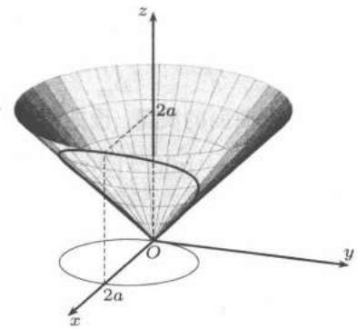

import Guide from '@/components/Guide.astro';
import Knowledge from '@/components/Knowledge.astro';
import Example from '@/components/Example.astro';
import Solution from '@/components/Solution.astro';
import Note from '@/components/Note.astro';
import Block from '@/components/Block.astro';
import Method from '@/components/Method.astro';

<Example title="例$25.1.1$">
设 $S$ 为 $z = \sqrt{x^{2} + y^{2}}$ 被 $x^{2} + y^{2} = 2ax$ 割下的部分，求

$$
I = \iint_{S} \left(x^{2} y^{2} + y^{2} z^{2} + z^{2} x^{2}\right) \mathrm{d} S.
$$

<Solution title="解$1$">
见图 $25.1$，在直角坐标系中计算

$$
\begin{array}{c} 
z_{x} = \frac{x}{z}, \quad z_{y} = \frac{y}{z}, \\ 
\sqrt{1 + z_{x}^{2} + z_{y}^{2}} = \sqrt{2}, \\ 
I = \iint_{x^{2} + y^{2} \leqslant 2 a x} [ x^{2} y^{2} + (x^{2} + y^{2})^{2} ] \sqrt{2} \mathrm{d} x \mathrm{d} y. 
\end{array}
$$

  
图$25.1$

用极坐标变换求上述二重积分，则

$$
\begin{array}{r l} 
I & = \sqrt{2} \int_{- \pi / 2}^{\pi / 2} \mathrm{d} \theta \int_{0}^{2 a \cos \theta} (r^{4} \cos^{2} \theta \sin^{2} \theta + r^{4}) r \mathrm{d} r \\ 
& = \sqrt{2} \int_{- \pi / 2}^{\pi / 2} (\cos^{2} \theta \sin^{2} \theta + 1) \cdot \left(\frac{1}{6} r^{6} \Big|_{0}^{2 a \cos \theta}\right) \mathrm{d} \theta \\ 
& = \frac{\sqrt{2}}{6} (2 a)^{6} \int_{- \pi / 2}^{\pi / 2} \cos^{6} \theta (\cos^{2} \theta \sin^{2} \theta + 1) \mathrm{d} \theta = \frac{29}{8} \sqrt{2} \pi a^{6}. 
\end{array}
$$
</Solution>

<Solution title="解$2$">
用参数式计算。 $z = \sqrt{x^{2} + y^{2}}$ 在球坐标系中的方程为 $\varphi = \frac{\pi}{4}$，因此 $S$ 的参数方程为

$$
x = \frac{1}{\sqrt{2}} r \cos \theta ,\quad y = \frac{1}{\sqrt{2}} r \sin \theta ,\quad z = \frac{1}{\sqrt{2}} r,\quad (r, \theta) \in D.
$$

又 $S$ 的边界线

$$
z = \sqrt{x^{2} + y^{2}}, \quad x^{2} + y^{2} = 2 a x
$$

的球坐标表示为

$$
\varphi = \frac{\pi}{4}, \quad r^{2} \sin^{2} \varphi = 2 a r \sin \varphi \cos \theta .
$$

于是

$$
D = \left\{(r, \theta) \mid - \frac{\pi}{2} \leqslant \theta \leqslant \frac{\pi}{2}, 0 \leqslant r \leqslant 2 \sqrt{2} a \cos \theta \right\}.
$$

计算得

$$
E = \frac{r^{2}}{2},\quad F = 0,\quad G = 1,
$$

最后得到

$$
\begin{array}{l} 
I = \int_{- \pi / 2}^{\pi / 2} \mathrm{d} \theta \int_{0}^{2 \sqrt{2} a \cos \theta} \left(\frac{1}{4} r^{4} \cos^{2} \theta \sin^{2} \theta + \frac{1}{4} r^{4}\right) \frac{r}{\sqrt{2}} \mathrm{d} r \\ 
= \frac{29}{8} \sqrt{2} \pi a^{6}. 
\end{array}
$$
</Solution>
</Example>

<Example title="例$25.1.2$">
求上半球面 $z = \sqrt{a^{2} - x^{2} - y^{2}}$ 被 $x^{2} + y^{2} = a x$ 截取部分的面积与质心坐标, 其中 $a > 0$.

<Solution title="解">
见图 $22.11$，这就是 $Viviani$ 体的上表面。 由于

$$
z_{x} = \frac{- x}{\sqrt{a^{2} - x^{2} - y^{2}}},\quad z_{y} = \frac{- y}{\sqrt{a^{2} - x^{2} - y^{2}}},
$$

故所求面积

$$
\begin{array}{r l} 
S & = \iint_{x^{2} + y^{2} \leqslant a x} \frac{a}{\sqrt{a^{2} - x^{2} - y^{2}}} \mathrm{d} x \mathrm{d} y \\ 
& = \int_{- \pi / 2}^{\pi / 2} \mathrm{d} \theta \int_{0}^{a \cos \theta} \frac{a r}{\sqrt{a^{2} - r^{2}}} \mathrm{d} r \\ 
& = (\pi - 2) a^{2}. 
\end{array}
$$

下面求质心坐标，由对称性知 $y_{0}=0$，且

$$
\begin{aligned} 
x_{0} & = \frac{1}{(\pi - 2)a^{2}}\iint \limits_{S}x\mathrm{d}S\\ 
& = \frac{2}{(\pi - 2)a^{2}}\iint \limits_{\substack{x^{2} + y^{2}\leqslant ax\\ y\geqslant 0}}\frac{ax}{\sqrt{a^{2} - x^{2} - y^{2}}}\mathrm{d}x\mathrm{d}y\\ 
& = \frac{2}{(\pi - 2)a}\int_{0}^{\pi /2}\cos \theta \mathrm{d}\theta \int_{0}^{a\cos \theta}\frac{r}{\sqrt{a^{2} - r^{2}}} r\mathrm{d}r\quad (r = a\cos t)\\ 
& = \frac{2}{(\pi - 2)a}\int_{0}^{\pi /2}\cos \theta \mathrm{d}\theta \int_{\pi /2}^{\theta}\frac{a^{2}\cos^{2}t}{a\sin t} (-a\sin t)\mathrm{d}t\\ 
& = \frac{a}{\pi - 2}\int_{0}^{\pi /2}\cos \theta \left(\frac{\pi}{2} -\theta -\sin \theta \cos \theta\right)\mathrm{d}\theta \\ 
& = \frac{2a}{3(\pi - 2)};\\ 
z_{0} & = \frac{1}{(\pi - 2)a^{2}}\iint \limits_{S}z\mathrm{d}S\\ 
& = \frac{1}{(\pi - 2)a^{2}}\iint \limits_{x^{2} + y^{2}\leqslant ax}\frac{a}{\sqrt{a^{2} - x^{2} - y^{2}}}\sqrt{a^{2} - x^{2} - y^{2}}\mathrm{d}x\mathrm{d}y\\ 
& = \frac{\pi a}{4(\pi - 2)}. 
\end{aligned}
$$
</Solution>
</Example>
