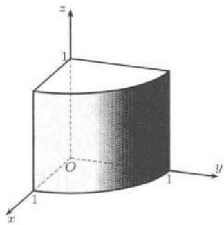
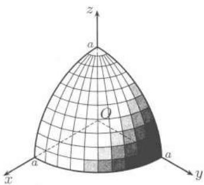
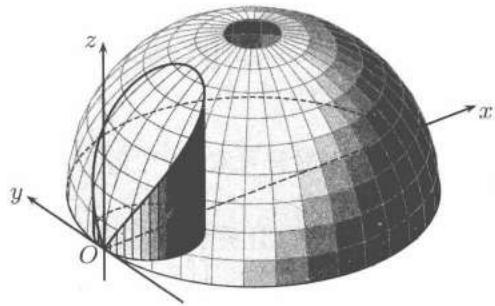

import Guide from '@/components/Guide.astro';
import Knowledge from '@/components/Knowledge.astro';
import Example from '@/components/Example.astro';
import Solution from '@/components/Solution.astro';
import Note from '@/components/Note.astro';
import Block from '@/components/Block.astro';
import Method from '@/components/Method.astro';

## $25.2.1$ 第二型曲面积分的定义和计算

设 $S$ 是逐片光滑的定向曲面, $P$, $Q$, $R$ 是在曲面 $S$ 上有定义的函数. 在曲面 $S$ 所指定的一侧作分割 $T$, 它把曲面 $S$ 分为 $n$ 个小曲面 $S_{1}, S_{2}, \cdots, S_{n}$ , 分割 $T$ 的细度 $\|T\|=\max_{1\leqslant i\leqslant n}\{S_{i}$ 的直径}, 以 $\Delta S_{i}^{(1)},\Delta S_{i}^{(2)},\Delta S_{i}^{(3)}$ 分别表示 $S_{i}$ 在 $yOz$, $zOx$, $xOy$ 三个坐标平面上的投影区域的面积. 它们的符号由 $S_{i}$ 的方向来确定, 当 $S_{i}$ 的法线正向与 $z$ 轴正向成锐角时, $S_{i}$ 在 $xOy$ 平面的投影区域的面积 $\Delta S_{i}^{(3)}$ 为正, 反之面积为负. $\Delta S_{i}^{(1)}$ 与 $\Delta S_{i}^{(2)}$ 的符号可类似地定义. 在每个 $S_{i}$ 上任取一点 $(\xi_{i},\eta_{i},\zeta_{i})$ , 若

$$
\begin{array}{l}\lim _ {\| T \| \rightarrow 0} \sum_ {i = 1} ^ {n} P (\xi_ {i}, \eta_ {i}, \zeta_ {i}) \Delta S _ {i} ^ {(1)} + \lim _ {\| T \| \rightarrow 0} \sum_ {i = 1} ^ {n} Q (\xi_ {i}, \eta_ {i}, \zeta_ {i}) \Delta S _ {i} ^ {(2)}\\+ \lim _ {\| T \| \rightarrow 0} \sum_ {i = 1} ^ {n} R (\xi_ {i}, \eta_ {i}, \zeta_ {i}) \Delta S _ {i} ^ {(3)}\end{array}
$$

存在, 且与曲面 $S$ 的分割 $T$ 以及 $(\xi_{i}, \eta_{i}, \zeta_{i})$ 在 $S_{i}$ 上的取法无关, 则称此极限为函数 $P$, $Q$, $R$ 在曲面 $S$ 上所指定的一侧上的第二型曲面积分, 记为

$$
\iint_ {S} P (x, y, z) \mathrm{d} y \mathrm{d} z + Q (x, y, z) \mathrm{d} z \mathrm{d} x + R (x, y, z) \mathrm{d} x \mathrm{d} y.
$$

设 $R(x,y,z)$ 是定义在光滑曲面

$$
S: z = z (x, y), \quad (x, y) \in D _ {x y}
$$

上的连续函数，以 $S$ 的上侧为正侧，则有

$$
\iint_ {S} R (x, y, z) \mathrm{d} x \mathrm{d} y = \pm \iint_ {D _ {x y}} R (x, y, z (x, y)) \mathrm{d} x \mathrm{d} y.
$$

如果在正侧积分, 积分号前取正号; 如果在负侧积分, 积分号前取负号.

类似地，当 $P(x,y,z)$ 在光滑曲面

$$
S: x = x (y, z), \quad (y, z) \in D _ {y z}
$$

上连续时，有

$$
\iint_ {S} P (x, y, z) \mathrm{d} y \mathrm{d} z = \pm \iint_ {D _ {y z}} P (x (y, z), y, z) \mathrm{d} y \mathrm{d} z,
$$

这里 $S$ 是以 $S$ 的法线方向与 $x$ 轴的正向成锐角的那一侧为正侧.

当 $Q(x,y,z)$ 在光滑曲面

$$
S: y = y (z, x), \quad (z, x) \in D _ {z x}
$$

上连续时，有

$$
\iint_ {S} Q (x, y, z) \mathrm{d} z \mathrm{d} x = \pm \iint_ {D _ {z x}} Q (x, y (z, x), z) \mathrm{d} z \mathrm{d} x,
$$

这里 $S$ 是以 $S$ 的法线方向与 $y$ 轴的正向成锐角的那一侧为正侧.

如果光滑曲面 $S$ 由参数方程给出:

$$
S: x = x (u, v), \quad y = y (u, v), \quad z = z (u, v), \quad (u, v) \in D,
$$

且行列式

$$
A = \frac {\partial (y , z)}{\partial (u , v)}, B = \frac {\partial (z , x)}{\partial (u , v)}, C = \frac {\partial (x , y)}{\partial (u , v)}
$$

不同时为 $0$，则

$$
\iint_ {S} P \mathrm{d} y \mathrm{d} z + Q \mathrm{d} z \mathrm{d} x + R \mathrm{d} x \mathrm{d} y = \pm \iint_ {D} (P A + Q B + R C) \mathrm{d} u \mathrm{d} v,\tag{25.3}
$$

其中积分号前正负号的选取法则如下：若向量 $(A,B,C)$ 与曲面 $S$ 上预先选定的侧的法向量方向所成角不大于直角，则取“$+$”号，否则取“$-$”号.

<Example title="例 25.2.1">
设 $\Sigma$ 为上半单位球面 $z = \sqrt{1 - (x^{2} + y^{2})}$ ，取内侧，求

$$
I = \iint_ {\Sigma} \mathrm{d} y \mathrm{d} z + \mathrm{d} z \mathrm{d} x + \mathrm{d} x \mathrm{d} y.
$$

<Solution title="解 1">
用直角坐标系计算

$$
I = \iint_ {\Sigma} \mathrm{d} y \mathrm{d} z + \iint_ {\Sigma} \mathrm{d} z \mathrm{d} x + \iint_ {\Sigma} \mathrm{d} x \mathrm{d} y = I _ {1} + I _ {2} + I _ {3}.
$$

计算 $I_{1}:\Sigma = \Sigma_{1} + \Sigma_{2}$ ，其中

$\Sigma_{1}:x=\sqrt{1-y^{2}-z^{2}},\quad(y,z)\in D_{yz}=\{y^{2}+z^{2}\leqslant1,z\geqslant0\}$ ，取后侧，

$\Sigma_{2}:x = -\sqrt{1 - y^{2} - z^{2}},(y,z)\in D_{yz}$ ，取前侧，

则

$$
I _ {1} = \iint_ {\Sigma_ {1}} \mathrm{d} y \mathrm{d} z + \iint_ {\Sigma_ {2}} \mathrm{d} y \mathrm{d} z = - \iint_ {D _ {y z}} \mathrm{d} y \mathrm{d} z + \iint_ {D _ {y z}} \mathrm{d} y \mathrm{d} z = 0.
$$

同理有

$$
I _ {2} = 0, I _ {3} = - \iint_ {D _ {x y}} \mathrm{d} x \mathrm{d} y = - \pi .
$$

最后得到

$$
I = - \pi .
$$
</Solution>

<Solution title="解 2">
用参数方程

$$
\begin{array}{c} {{\Sigma : x = \sin \varphi \cos \theta , y = \sin \varphi \sin \theta , z = \cos \varphi ,}} \\ {{0 \leqslant \varphi \leqslant \frac {\pi}{2}, 0 \leqslant \theta \leqslant 2 \pi ,}} \end{array}
$$

计算行列式

$$
A = \frac {\partial (y , z)}{\partial (\varphi , \theta)} = \sin^ {2} \varphi \cos \theta , \quad B = \frac {\partial (z , x)}{\partial (\varphi , \theta)} = \sin^ {2} \varphi \sin \theta ,
$$

$$
C = \frac {\partial (x , y)}{\partial (\varphi , \theta)} = \sin \varphi \cos \varphi .
$$

因为 $(A, B, C)$ 的方向与上半球面 $S$ 内侧的法线方向相反, 故积分号前取“$-$”号, 得到

$$
\begin{array}{r l} I & = - \iint_ {D} (\sin^ {2} \varphi \cos \theta + \sin^ {2} \varphi \sin \theta + \sin \varphi \cos \varphi) \mathrm{d} \varphi \mathrm{d} \theta \\ & = - \int_ {0} ^ {\pi / 2} \mathrm{d} \varphi \int_ {0} ^ {2 \pi} [ \sin^ {2} \varphi (\cos \theta + \sin \theta) + \sin \varphi \cos \varphi ] \mathrm{d} \theta \\ & = - 2 \pi \int_ {0} ^ {\pi / 2} \sin \varphi \cos \varphi \mathrm{d} \varphi = - \pi . \end{array}
$$
</Solution>
</Example>

<Example title="例 25.2.2">
求

$$
I = \iint_ {\Sigma} (z + x) \mathrm{d} y \mathrm{d} z + (x + y) \mathrm{d} z \mathrm{d} x + (y + z) \mathrm{d} x \mathrm{d} y,
$$

其中 $\Sigma$ 是由 $x^{2}+y^{2}=1, z=1$ 及三个坐标平面围成的立体在第一卦限的部分的表面，取外侧.

<figure class="vp-figure">
  
  <figcaption>图25.2</figcaption>
</figure>

<Solution title="解">
见图 25.2, 因为 $\Sigma$ 分块较多 (需分 $5$ 块), 不便于用参数式, 故应在直角坐标系中计算. 记 $\Sigma = \Sigma_{1} + \Sigma_{2} + \Sigma_{3} + \Sigma_{4} + \Sigma_{5}$ , 其中 $\Sigma_{1}$ 为圆柱面, $\Sigma_{2}$ 为下底面, $\Sigma_{3}$ 为上底面, $\Sigma_{4}$ 为左侧面 $y = 0$, $\Sigma_{5}$ 为右侧面 $x = 0$, 则有

$$
I = \iint_ {\Sigma} (z + x) \mathrm{d} y \mathrm{d} z + \iint_ {\Sigma} (x + y) \mathrm{d} z \mathrm{d} x + \iint_ {\Sigma} (y + z) \mathrm{d} x \mathrm{d} y = I _ {1} + I _ {2} + I _ {3}.
$$

计算 $I_{1}$ ，有

$$
I _ {1} = \sum_ {i = 1} ^ {5} \iint_ {\Sigma_ {i}} (x + z) \mathrm{d} y \mathrm{d} z.
$$

因为 $\Sigma_{2}, \Sigma_{3}, \Sigma_{4}$ 在 $yOz$ 平面上的投影面积为零, 于是

$$
\iint_ {\Sigma_ {i}} (x + z) \mathrm{d} y \mathrm{d} z = 0, \quad i = 2, 3, 4,
$$

而

$\Sigma_{1}: x=\sqrt{1-y^{2}}, (y,z)\in D_{yz}=\{0\leqslant y\leqslant1,0\leqslant z\leqslant1\}$ ，取前侧，

$\Sigma_{5}: x=0, (y,z) \in D_{yz}$ ，取后侧.

于是

$$
\begin{array}{r l} I _ {1} & = \iint_ {\Sigma_ {1}} (x + z) \mathrm{d} y \mathrm{d} z + \iint_ {\Sigma_ {5}} (x + z) \mathrm{d} y \mathrm{d} z \\ & = \iint_ {D _ {y z}} (\sqrt {1 - y ^ {2}} + z) \mathrm{d} y \mathrm{d} z - \iint_ {D _ {y z}} z \mathrm{d} y \mathrm{d} z \\ & = \int_ {0} ^ {1} \int_ {0} ^ {1} \sqrt {1 - y ^ {2}} \mathrm{d} y \mathrm{d} z = \frac {\pi}{4}. \end{array}
$$

用类似的方法可求出 $I_{2}=\frac{\pi}{4}$ .

然后求

$$
I _ {3} = \sum_ {i = 1} ^ {5} \iint_ {\Sigma_ {i}} (y + z) \mathrm{d} x \mathrm{d} y.
$$

显然有

$$
\iint_ {\Sigma_ {i}} (y + z) \mathrm{d} x \mathrm{d} y = 0, i = 1, 4, 5,
$$

而

$\Sigma_{2}: z=0, (x,y) \in D_{xy} = \{x^{2} + y^{2} \leqslant 1, x \geqslant 0, y \geqslant 0\}$ ，取下侧，

$\Sigma_{3}: z=1, (x,y) \in D_{xy},$ 取上侧，

于是

$$
\begin{array}{r l} I _ {3} & = \iint_ {\Sigma_ {2}} (y + z) \mathrm{d} x \mathrm{d} y + \iint_ {\Sigma_ {3}} (y + z) \mathrm{d} x \mathrm{d} y \\ & = - \iint_ {D _ {x y}} y \mathrm{d} x \mathrm{d} y + \iint_ {D _ {x y}} (1 + y) \mathrm{d} x \mathrm{d} y \\ & = \iint_ {D _ {x y}} \mathrm{d} x \mathrm{d} y = \frac {\pi}{4}. \end{array}
$$

最后得到

$$
I = I _ {1} + I _ {2} + I _ {3} = \frac {3}{4} \pi .
$$
</Solution>
</Example>

<Note title="注">
我们已经知道, 利用第二型曲线积分可以计算平面图形的面积. 类似地, 利用第二型曲面积分也可以计算空间立体的体积 (见表达式 (25.7)—(25.11)).
</Note>

## $25.2.2$ 两类曲面积分之间的关系

设 $S$ 是可定向曲面, $\boldsymbol{n}$ 是 $S$ 上选定的某一侧的法向量, 则

$$
\begin{array}{l} \iint_ {S} P \mathrm{d} y \mathrm{d} z + Q \mathrm{d} z \mathrm{d} x + R \mathrm{d} x \mathrm{d} y \\ = \iint_ {S} [ P \cos (\boldsymbol {n}, x) + Q \cos (\boldsymbol {n}, y) + R \cos (\boldsymbol {n}, z) ] \mathrm{d} S. \end{array}\tag{25.4}
$$

上述关系式的用处之一是可简化曲面积分的计算, 当某一类曲面积分的计算比较复杂时, 可利用公式 (25.4) 转化为另一类曲面积分进行计算.

<Example title="例 25.2.3">
求

$$
I = \iint_ {\Sigma} x y z (y ^ {2} z ^ {2} + z ^ {2} x ^ {2} + x ^ {2} y ^ {2}) \mathrm{d} S,
$$

其中 $\Sigma$ 为第一卦限中的球面 $x^{2} + y^{2} + z^{2} = a^{2} (x \geqslant 0, y \geqslant 0, z \geqslant 0)$ .

<Solution title="解">
见图 25.3, 不论用参数式或直角坐标式, 直接计算均相当复杂, 取 $\Sigma$ 的上侧, 则 $(x, y, z)$ 处的单位外法向量为 $\left(\frac{x}{a}, \frac{y}{a}, \frac{z}{a}\right)$ , 利用公式 (25.4),

$$
\begin{array}{r l} I & = a \iint_ {\Sigma} \left(y ^ {3} z ^ {3} \frac {x}{a} + z ^ {3} x ^ {3} \frac {y}{a} + x ^ {3} y ^ {3} \frac {z}{a}\right) \mathrm{d} S \\ & = a \iint_ {\Sigma} y ^ {3} z ^ {3} \mathrm{d} y \mathrm{d} z + z ^ {3} x ^ {3} \mathrm{d} z \mathrm{d} x + x ^ {3} y ^ {3} \mathrm{d} x \mathrm{d} y \\ & = 3 a \iint_ {\Sigma} x ^ {3} y ^ {3} \mathrm{d} x \mathrm{d} y = 3 a \iint_ {D _ {x y}} x ^ {3} y ^ {3} \mathrm{d} x \mathrm{d} y, \end{array}
$$

其中 $D_{xy} = \{x^2 +y^2\leqslant a^2,x\geqslant 0,y\geqslant 0\}$ ，作极坐标变换得

$$
\begin{array}{r l} I & = 3 a \int_ {0} ^ {\pi / 2} \mathrm{d} \theta \int_ {0} ^ {a} r ^ {7} \sin^ {3} \theta \cos^ {3} \theta \mathrm{d} r \\ & = \frac {3}{6 4} a ^ {9} \int_ {0} ^ {\pi / 2} \sin^ {3} 2 \theta \mathrm{d} \theta = \frac {1}{3 2} a ^ {9}. \end{array}
$$

<figure class="vp-figure">
  
  <figcaption>图25.3</figcaption>
</figure>
</Solution>
</Example>

<Example title="例 25.2.4">
求

$$
I = \iint_ {\Sigma} (y - z) \mathrm{d} y \mathrm{d} z + (z - x) \mathrm{d} z \mathrm{d} x + (x - y) \mathrm{d} x \mathrm{d} y,
$$

其中 $\Sigma$ 是球面 $x^{2} + y^{2} + z^{2} = 2Rx$ 被柱面 $x^{2} + y^{2} = 2rx (0 < r < R)$ 截下的位于 $z \geqslant 0$ 的部分, 取外侧.

<Solution title="解">
见图 25.4, 改写球面方程为 $(x - R)^{2} + y^{2} + z^{2} = R^{2}$ , 其外侧的法向量

$$
\boldsymbol {n} = \left(\frac {x - R}{R}, \frac {y}{R}, \frac {z}{R}\right).
$$

由公式(25.4)，有

$$
\begin{array}{r l} I & = \iint_ {\Sigma} (y - z, z - x, x - y) \cdot \boldsymbol {n} \mathrm{d} S \\ & = \frac {1}{R} \iint_ {\Sigma} [ (y - z) (x - R) + (z - x) y + (x - y) z ] \mathrm{d} S \\ & = \iint_ {\Sigma} (z - y) \mathrm{d} S. \end{array}
$$

由于 $\Sigma$ 关于 $xOz$ 平面对称, 而函数 $y$ 是奇函数, 于是

$$
\begin{array}{l} I = \iint_ {\Sigma} z \mathrm{d} S = \iint_ {x ^ {2} + y ^ {2} \leqslant 2 r x} \sqrt {2 R x - x ^ {2} - y ^ {2}} \frac {R}{\sqrt {2 R x - x ^ {2} - y ^ {2}}} \mathrm{d} x \mathrm{d} y \\ = R \cdot \pi r ^ {2} = \pi R r ^ {2}. \end{array}
$$

<figure class="vp-figure">
  
  <figcaption>图25.4</figcaption>
</figure>
</Solution>
</Example>

## $25.2.3$ 练习题

1. 设曲面 $\Sigma$ 的方程为 $z = z(x, y), (x, y) \in D$ , 且 $z(x, y)$ 在 $\overline{D}$ 中连续可微, 证明:

$$
\begin{array}{l} \iint_ {\Sigma} P (x, y, z) \mathrm{d} y \mathrm{d} z + Q (x, y, z) \mathrm{d} z \mathrm{d} x + R (x, y, z) \mathrm{d} x \mathrm{d} y \\ = \pm \iint_ {D} (- P z _ {x} - Q z _ {y} + R) \Big | _ {z = z (x, y)} \mathrm{d} x \mathrm{d} y. \end{array}
$$

当 $\Sigma$ 取上侧时符号取 “$+$”，当 $\Sigma$ 取下侧时符号取 “$-$”.

2. 若 $\Sigma$ 分块光滑, 且关于 $xOy$ 平面对称, $f(x,y,z)$ 在 $\overline{\Sigma}$ 上连续, 且满足 $f(x,y,z) = -f(x,y,-z)$ , 问: $\iint_{\Sigma} f(x,y,z) \mathrm{d}S = 2 \iint_{\Sigma_1} f(x,y,z) \mathrm{d}S$ 还是等于 $0$? (其中 $\Sigma_1$ 是 $\Sigma$ 在 $xOy$ 平面以上的部分.)

3. 若 $\Sigma$ 分块光滑, 且关于 $xOy$ 平面对称, $R(x,y,z)$ 在 $\overline{\Sigma}$ 上连续, 满足 $R(x,y,z) = -R(x,y,-z)$ , 问: $\iint_{\Sigma} R(x,y,z) \mathrm{d}x \mathrm{d}y = 2 \iint_{\Sigma_1} R(x,y,z) \mathrm{d}x \mathrm{d}y$ 还是等于 $0$? (其中 $\Sigma_1$ 是 $\Sigma$ 在 $xOy$ 平面以上的部分, 取侧与 $\Sigma$ 取侧相一致.)

4. 设 $\Sigma$ 是平面 $\Pi$ 内的一个有界区域, 其面积为 $S$ , $\Pi$ 取上侧的法向量为 $\pmb{n}$ , 且 $\cos (\pmb{n}, z) = \mu$ . 证明: $\Sigma$ 在 $xOy$ 平面上的投影的面积为 $\mu S$ , 并利用这个结果重新计算例题$21.4.2$.

5. 求 $I_{1} = \iint_{\Sigma} z \, \mathrm{d}x \, \mathrm{d}y, I_{2} = \iint_{\Sigma} z^{2} \, \mathrm{d}x \, \mathrm{d}y, \Sigma$ 是球面 $x^{2} + y^{2} + z^{2} = a^{2}$ , 取外侧.

6. 计算 $\iint_{S} xz \, \mathrm{d}y \, \mathrm{d}z + yx \, \mathrm{d}z \, \mathrm{d}x + yz \, \mathrm{d}x \, \mathrm{d}y$ , $S$ 是圆柱面 $x^{2} + y^{2} = 1$ 在 $-1 \leqslant z \leqslant 1$ 及 $x \geqslant 0$ 的部分, 取前侧.

7. 求 $\iint_{S} x(z^{2}-y^{2}) \, \mathrm{d}y \, \mathrm{d}z + y(x^{2}-z^{2}) \, \mathrm{d}z \, \mathrm{d}x + z(y^{2}-x^{2}) \, \mathrm{d}x \, \mathrm{d}y$ ，其中 $S$ 是 $y^{2} + z^{2} = 1$ 被 $x = 0, x = 1$, $z + y = 0$ , $z - y = 0$ 截取的上方部分，取外侧.
