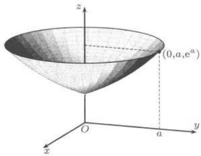
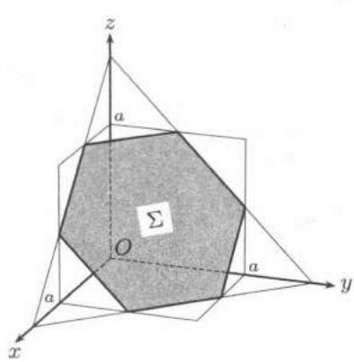
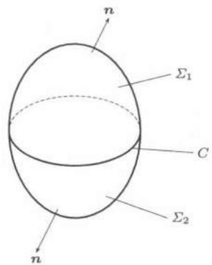

import Guide from '@/components/Guide.astro';
import Knowledge from '@/components/Knowledge.astro';
import Example from '@/components/Example.astro';
import Solution from '@/components/Solution.astro';
import Note from '@/components/Note.astro';
import Block from '@/components/Block.astro';
import Method from '@/components/Method.astro';

<Example title="例$25.3.1$">

求

$$
I = \iint_ {\Sigma} 4 x z \mathrm{d} y \mathrm{d} z - 2 y z \mathrm{d} z \mathrm{d} x + (1 - z ^ {2}) \mathrm{d} x \mathrm{d} y,
$$

其中 $\Sigma$ 是曲线 $z = e^{y} (0 \leqslant y \leqslant a)$ 绕 $z$ 轴旋转生成的旋转面, 取下侧.

<Solution title="解">

$\Sigma$ 的方程为

$$
z = \mathrm{e} ^ {\sqrt {x ^ {2} + y ^ {2}}} (x ^ {2} + y ^ {2} \leqslant a ^ {2}).
$$

  
图$25.5$

直接计算比较复杂. 考虑用 $Gauss$公式. 由于 $\Sigma$ 不闭, 需要添加辅助面

$\Sigma_{1}:z=\mathrm{e}^{a}(x^{2}+y^{2}\leqslant a^{2})$ ，取上侧.

见图$25.5$, 设 $\Sigma$ 与 $\Sigma_{1}$ 围成的区域为 $D$ . 令

$$
P = 4 x z, Q = - 2 y z, R = 1 - z ^ {2},
$$

则

$$
\frac {\partial P}{\partial x} + \frac {\partial Q}{\partial y} + \frac {\partial R}{\partial z} = 0.
$$

由公式$(25.5)$，得

$$
\begin{array}{l} I = \left(\iint_ {\Sigma} + \iint_ {\Sigma_ {1}} - \iint_ {\Sigma_ {1}}\right) (1 - z ^ {2}) \mathrm{d} x \mathrm{d} y = - \iint_ {\Sigma_ {1}} (1 - z ^ {2}) \mathrm{d} x \mathrm{d} y \\ = (\mathrm{e} ^ {2 a} - 1) \iint_ {x ^ {2} + y ^ {2} \leqslant a ^ {2}} \mathrm{d} x \mathrm{d} y = (\mathrm{e} ^ {2 a} - 1) \pi a ^ {2}. \end{array}
$$

</Solution>
</Example>

<Example title="例$25.3.2$">

计算曲面积分

$$
I = \iint_ {S} \frac {x \mathrm{d} y \mathrm{d} z + y \mathrm{d} z \mathrm{d} x + z \mathrm{d} x \mathrm{d} y}{(a x ^ {2} + b y ^ {2} + c z ^ {2}) ^ {3 / 2}},
$$

其中 $S$ 是球面 $x^{2} + y^{2} + z^{2} = 1$ ，取外侧 $(a > 0, b > 0, c > 0)$ .

<Solution title="解1">

记 $P(x,y,z) = \frac{x}{(ax^2 + by^2 + cz^2)^{3 / 2}}, Q(x,y,z) = \frac{y}{(ax^2 + by^2 + cz^2)^{3 / 2}},$ $R(x,y,z) = \frac{z}{(ax^2 + by^2 + cz^2)^{3 / 2}}$ ，则在不包含原点的任何区域上

$$
\frac {\partial P}{\partial x} + \frac {\partial Q}{\partial y} + \frac {\partial R}{\partial z} = 0.
$$

为了利用 $Gauss$公式, 对充分小的 $\varepsilon > 0$ , 作闭曲面

$$
S _ {\varepsilon} = \left\{a x ^ {2} + b y ^ {2} + c z ^ {2} = \varepsilon^ {2} \right\},
$$

取外侧. 由 $Gauss$公式

$$
I = \iint_ {S _ {\varepsilon}} \frac {x \mathrm{d} y \mathrm{d} z + y \mathrm{d} z \mathrm{d} x + z \mathrm{d} x \mathrm{d} y}{(a x ^ {2} + b y ^ {2} + c z ^ {2}) ^ {3 / 2}} = \frac {1}{\varepsilon^ {3}} \iint_ {S _ {\varepsilon}} x \mathrm{d} y \mathrm{d} z + y \mathrm{d} z \mathrm{d} x + z \mathrm{d} x \mathrm{d} y.
$$

上述积分在 $S_{\varepsilon}$ 的外侧. 再一次用 $Gauss$公式, 则

$$
I = \frac {3}{\varepsilon^ {3}} \iiint_ {a x ^ {2} + b y ^ {2} + c z ^ {2} \leqslant \varepsilon^ {2}} \mathrm{d} x \mathrm{d} y \mathrm{d} z = \frac {3}{\varepsilon^ {3}} \cdot \frac {4 \pi}{3} \cdot \frac {\varepsilon^ {3}}{\sqrt {a b c}} = \frac {4 \pi}{\sqrt {a b c}}.
$$

</Solution>

<Solution title="解2">

(不用 $Gauss$公式而直接计算) 利用单位球面的参数方程

$$
\begin{array}{r l} x = \sin \varphi \cos \theta , y = \sin \varphi \sin \theta , z = \cos \varphi , \\ 0 \leqslant \varphi \leqslant \pi , 0 \leqslant \theta \leqslant 2 \pi , \end{array}
$$

计算得到

$$
\begin{array}{l} {A = \frac {\partial (y , z)}{\partial (\varphi , \theta)} = \sin^ {2} \varphi \cos \theta , B = \frac {\partial (z , x)}{\partial (\varphi , \theta)} = \sin^ {2} \varphi \sin \theta ,} \\ {C = \frac {\partial (x , y)}{\partial (\varphi , \theta)} = \sin \varphi \cos \varphi .} \end{array}
$$

容易看出， $(A,B,C)$ 的方向与单位球面外侧法线方向相同，故积分号前取“+”号，由$(25.3)$得

$$
I = 8 \int_ {0} ^ {\pi / 2} \int_ {0} ^ {\pi / 2} \frac {\sin \varphi \mathrm{d} \varphi \mathrm{d} \theta}{(a \sin^ {2} \varphi \cos^ {2} \theta + b \sin^ {2} \varphi \sin^ {2} \theta + c \cos^ {2} \varphi) ^ {3 / 2}}.
$$

先计算对 $\varphi$ 的积分, 我们令 $\cos \varphi = t$ , 则

$$
\begin{array}{l} \int_ {0} ^ {\pi / 2} \frac {\sin \varphi \mathrm{d} \varphi}{(a \sin^ {2} \varphi \cos^ {2} \theta + b \sin^ {2} \varphi \sin^ {2} \theta + c \cos^ {2} \varphi) ^ {3 / 2}} \\ = \int_ {0} ^ {1} \frac {\mathrm{d} t}{\left[ (a \cos^ {2} \theta + b \sin^ {2} \theta) - (a \cos^ {2} \theta + b \sin^ {2} \theta - c) t ^ {2} \right] ^ {3 / 2}} \\ = \frac {1}{(a \cos^ {2} \theta + b \sin^ {2} \theta)} \cdot \frac {t}{\left[ (a \cos^ {2} \theta + b \sin^ {2} \theta) - (a \cos^ {2} \theta + b \sin^ {2} \theta - c) t ^ {2} \right] ^ {1 / 2}} \Bigg | _ {t = 0} ^ {t = 1} \\ = \frac {1}{\sqrt {c}} \cdot \frac {1}{a \cos^ {2} \theta + b \sin^ {2} \theta}. \end{array}
$$

最后得到

$$
\begin{array}{r l} I & = \frac {8}{\sqrt {c}} \int_ {0} ^ {\pi / 2} \frac {\mathrm{d} \theta}{a \cos^ {2} \theta + b \sin^ {2} \theta} = \frac {8}{\sqrt {c}} \int_ {0} ^ {+ \infty} \frac {\mathrm{d} t}{a + b t ^ {2}} (t = \tan \theta) \\ & = \frac {8}{\sqrt {c}} \frac {1}{\sqrt {a b}} \arctan \left(\sqrt {\frac {b}{a}} t\right) \Big | _ {0} ^ {+ \infty} = \frac {4 \pi}{\sqrt {a b c}}. \end{array}
$$

</Solution>

<Note title="注">
利用 $Gauss$公式来计算曲面积分在很多情况下是一种有效的手段, 但要注意使用 $Gauss$公式的条件, 要弄清楚在什么情况下要“挖洞” (即用封闭曲面把 $P$, $Q$, $R$ 无定义或不可微的点围住) 以及选择什么曲面“挖洞”计算更简便.
</Note>
</Example>

利用 $Gauss$公式可导出 $R^{3}$ 中具有逐片光滑边界的有界闭区域 $\Omega$ 的体积公式

$$
\begin{array}{r l} | \Omega | & = \iint_ {\partial \Omega} x \mathrm{d} y \mathrm{d} z = \iint_ {\partial \Omega} y \mathrm{d} z \mathrm{d} x = \iint_ {\partial \Omega} z \mathrm{d} x \mathrm{d} y \\ & = \frac {1}{3} \iint_ {\partial \Omega} x \mathrm{d} y \mathrm{d} z + y \mathrm{d} z \mathrm{d} x + z \mathrm{d} x \mathrm{d} y. \end{array}\tag{25.7}
$$

上述积分在 $\partial \Omega$ 的外侧进行. 由两类曲面积分之间的关系, 又有

$$
| \Omega | = \frac {1}{3} \iint_ {\partial \Omega} (x \cos \alpha + y \cos \beta + z \cos \gamma) d S,\tag{25.8}
$$

其中 $(\cos \alpha, \cos \beta, \cos \gamma)$ 为 $\partial \Omega$ 的单位外法向量. 如果 $\partial \Omega$ 有参数表示

$$
x = x (u, v), \quad y = y (u, v), \quad z = z (u, v), \quad (u, v) \in D,
$$

则

$$
V = \frac {1}{3} \left| \iint_ {D} (A x + B y + C z) \mathrm{d} u \mathrm{d} v \right|,\tag{25.9}
$$

其中

$$
A = \frac {\partial (y , z)}{\partial (u , v)}, B = \frac {\partial (z , x)}{\partial (u , v)}, C = \frac {\partial (x , y)}{\partial (u , v)}.
$$

$(25.9)$ 也可以写为

$$
V = \frac {1}{3} \left| \iint_ {D} \left| \begin{array}{c c c} x & y & z \\ x _ {u} & y _ {u} & z _ {u} \\ x _ {v} & y _ {v} & z _ {v} \end{array} \right| \mathrm{d} u \mathrm{d} v \right|.\tag{25.10}
$$

特别地, 若一个立体的表面在球坐标系中由方程

$$
r = r (\varphi , \theta), \quad (\varphi , \theta) \in D
$$

给出，则

$$
x = r (\varphi , \theta) \sin \varphi \cos \theta , y = r (\varphi , \theta) \sin \varphi \sin \theta , z = r (\varphi , \theta) \cos \varphi , (\varphi , \theta) \in D.
$$

代入公式 $(25.10)$ 中得到

$$
V = \frac {1}{3} \iint_ {D} r ^ {3} (\varphi , \theta) \sin \varphi \mathrm{d} \varphi \mathrm{d} \theta .\tag{25.11}
$$

当然, 公式 $(25.11)$ 也可以从三重积分中直接得到, 事实上

$$
\begin{aligned} V = & \iiint \limits_{\Omega}\mathrm{d}x\mathrm{d}y\mathrm{d}z = \iiint \limits_{\substack{(\varphi ,\theta)\in D\\ 0\leqslant \rho \leqslant r(\theta ,\varphi)}}\rho^{2}\sin \varphi   \mathrm{d}\rho   \mathrm{d}\theta   \mathrm{d}\varphi \\ = & \iint \limits_{D}\sin \varphi   \mathrm{d}\varphi   \mathrm{d}\theta \int_{0}^{r(\varphi ,\theta)}\rho^{2}  \mathrm{d}\rho \\ = & \frac{1}{3}\iint \limits_{D}r^{3}(\varphi ,\theta)  \sin \varphi   \mathrm{d}\varphi   \mathrm{d}\theta . \end{aligned}
$$

1. 利用 $Gauss$公式计算积分:

(1) $\oiint_{S} y(x - z) \, \mathrm{d}y \, \mathrm{d}z + z^2 \, \mathrm{d}z \, \mathrm{d}x + (y^2 + xz) \, \mathrm{d}x \, \mathrm{d}y,$ 其中 $S$ 是正立方体 $\{(x, y, z) | 0 \leqslant x \leqslant a, 0 \leqslant y \leqslant a, 0 \leqslant z \leqslant a\}$ ( $a > 0$ ) 的表面，取内侧.

(2) $\iint_{\Sigma} (x^3 + x) \, \mathrm{d}y \, \mathrm{d}z + (y^2 - xz) \, \mathrm{d}z \, \mathrm{d}x + (z^3 + z) \, \mathrm{d}x \, \mathrm{d}y,$ 其中 $\Sigma$ 是球面 $x^2 + y^2 + z^2 = 2z,$ 取外侧.

(3) 设 $A_{1} = x^{3} - x^{2}y + z^{3}, A_{2} = xy^{2} + y^{3}, A_{3} = xz + z^{2}, \Sigma$ 是由 $yOz$ 平面上的抛物线 $z = 1 - y^{2}$ 与 $z = 0$ 所围成的平面区域绕 $z$ 轴旋转后所得的旋转体的表面，取外侧。试求

$\oiint_{\Sigma}\left(\frac{\partial A_3}{\partial y} -\frac{\partial A_2}{\partial z}\right)\mathrm{d}y\mathrm{d}z + \left(\frac{\partial A_1}{\partial z} -\frac{\partial A_3}{\partial x}\right)\mathrm{d}z\mathrm{d}x + \left(\frac{\partial A_2}{\partial x} -\frac{\partial A_1}{\partial y}\right)\mathrm{d}x\mathrm{d}y.$

2. 先添加辅助面, 再用 $Gauss$公式计算下列曲面积分:

(1) $\iint_{\Sigma} (x^2 \cos \alpha + y^2 \cos \beta + z^2 \cos \gamma) \, \mathrm{d}S,$ 其中 $\Sigma$ 是锥面 $z^2 = x^2 + y^2$ 在 $0 \leqslant z \leqslant h$ 的一段， $(\cos \alpha, \cos \beta, \cos \gamma)$ 为 $\Sigma$ 上的单位法向量，其方向为下方.

(2) $\iint_{\Sigma} x^{3} \, \mathrm{d}y \, \mathrm{d}z + y^{3} \, \mathrm{d}z \, \mathrm{d}x + z^{3} \, \mathrm{d}x \, \mathrm{d}y,$ 其中 $\Sigma$ 为球面 $x^{2} + y^{2} + z^{2} = a^{2}$ 之上半部分，取上侧.

(3) $\iint_{\Sigma}\left(\frac{x^3}{a^3} + y^3 z^3\right)\mathrm{d}y\mathrm{d}z + \left(\frac{y^3}{b^3} + z^3 x^3\right)\mathrm{d}z\mathrm{d}x + \left(\frac{z^3}{c^3} + x^3 y^3\right)\mathrm{d}x\mathrm{d}y,$ 其中 $\Sigma$ 为椭球面 $\frac{x^2}{a^2} +\frac{y^2}{b^2} +\frac{z^2}{c^2} = 1,x\geqslant 0,$ 取后侧.

3. $F(x,y,z)$ 是定义在 $\mathbf{R}^3$ 上的光滑函数，且 $F(x,y,z) = 0$ 是一个以原点为顶点的锥面 $\Sigma$ ，如果 $\Sigma$ 与平面 $\Pi :Ax + By + Cz = D$ 围成一个锥体，证明：此锥体的体积

$$
V = \frac {1}{3} S H,
$$

其中 $S$ 为平面 $\Pi$ 上锥底部分的面积, $H$ 为顶点到锥底的高.

4. 求由曲面 $(x^{2}+y^{2}+z^{2})^{2}=a^{2}xy$ 所围成的立体的体积.

5. 求 $\iint_{\Sigma}(x^{3}+y^{3})\mathrm{d}y\mathrm{d}z+(x^{3}+2x^{2}y)\mathrm{d}z\mathrm{d}x-x^{2}z\mathrm{d}x\mathrm{d}y,$ 其中 $\Sigma$ 是单叶双曲面 $x^{2}+y^{2}-z^{2}=1$ 在 $0\leqslant z\leqslant\sqrt{3}$ 的部分，取外侧.

6. $V = \{(x,y,z)\mid x^2 +y^2 <  z <   1\} ,S = \partial V,$ 求积分

$$
\oiint_ {S} y z \mathrm{d} z \mathrm{d} x + (x ^ {2} + y ^ {2}) z \mathrm{d} x \mathrm{d} y,
$$

积分沿外法线方向.

## $7.$ 求第二型曲面积分

$$
\oiint_ {S} z \mathrm{d} y \mathrm{d} z + \cos y \mathrm{d} z \mathrm{d} x + \mathrm{d} x \mathrm{d} y,
$$

其中 $S$ 为 $x^{2} + y^{2} + z^{2} = 1$ 的外侧.

## $25.3.3$ $Stokes$ 公式

$Stokes$公式是将空间曲面上的第二型曲面积分与该曲面边界上的第二型曲线积分之间建立联系的一个重要公式.

设 $D$ 是 $R^{3}$ 中的分片光滑曲面, $D$ 的边界 $\partial D$ 由分段光滑曲线组成, 又设 $P$, $Q$, $R$ 有关于 $x$, $y$, $z$ 的连续偏导数, 则成立下列 $Stokes$公式:

$$
\oint_ {\partial D} P \mathrm{d} x + Q \mathrm{d} y + R \mathrm{d} z = \iint_ {D} \left| \begin{array}{c c c} \mathrm{d} y \mathrm{d} z & \mathrm{d} z \mathrm{d} x & \mathrm{d} x \mathrm{d} y \\ \frac {\partial}{\partial x} & \frac {\partial}{\partial y} & \frac {\partial}{\partial z} \\ P & Q & R \end{array} \right|,\tag{25.12}
$$

其中 $\partial D$ 的方向和 $D$ 的方向服从右手法则. 由两类曲面积分之间的关系 $(25.4)$, $(25.12)$ 又可以写为

$$
\oint_ {\partial D} P \mathrm{d} x + Q \mathrm{d} y + R \mathrm{d} z = \iint_ {D} \left| \begin{array}{c c c} \cos \alpha & \cos \beta & \cos \gamma \\ \frac {\partial}{\partial x} & \frac {\partial}{\partial y} & \frac {\partial}{\partial z} \\ P & Q & R \end{array} \right| \mathrm{d} S,\tag{25.13}
$$

其中 $\cos \alpha, \cos \beta, \cos \gamma$ 是曲面 $D$ 上法向量的方向余弦。如果曲面 $D$ 在 $xOy$ 平面上，则公式$(25.12)$，$(25.13)$就是$Green$公式。公式$(25.12)$与$(25.13)$给我们提供了一个求曲线积分与曲面积分的新方法。

<Example title="例$25.3.3$">

求

$$
I = \oint_ {C} (y ^ {2} - z ^ {2}) \mathrm{d} x + (z ^ {2} - x ^ {2}) \mathrm{d} y + (x ^ {2} - y ^ {2}) \mathrm{d} z,
$$

其中 $C$ 是立方体 $\{(x,y,z) \mid 0 \leqslant x \leqslant a, 0 \leqslant y \leqslant a, 0 \leqslant z \leqslant a\}$ 的表面与平面 $x + y + z = \frac{3}{2}a$ 的交线，取向从 $z$ 轴正向看去是逆时针方向.

<Solution title="分析">

见图$25.6$, 分六段积分的计算量很大, 且 $C$ 也不便于表示为一个统一的参数式. 因 $C$ 为闭曲线, 且 $P = y^{2} - z^{2}$ , $Q = z^{2} - x^{2}$ , $R = x^{2} - y^{2}$ 连续可微, 故考虑用 $Stokes$公式.

</Solution>

<Solution title="解">

令 $\Sigma$ 为 $x + y + z = \frac{3}{2} a$ 被 $C$ 所围的一块, 取上侧, 则 $C$ 的取向与 $\Sigma$ 的取侧相容. 应用 $Stokes$公式$(25.13)$,

$$
\begin{array}{l} I = \iint_ {\Sigma} \left| \begin{array}{c c c} \frac {1}{\sqrt {3}} & \frac {1}{\sqrt {3}} & \frac {1}{\sqrt {3}} \\ \frac {\partial}{\partial x} & \frac {\partial}{\partial y} & \frac {\partial}{\partial z} \\ y ^ {2} - z ^ {2} & z ^ {2} - x ^ {2} & x ^ {2} - y ^ {2} \end{array} \right| \mathrm{d} S \\ = \frac {1}{\sqrt {3}} \iint_ {\Sigma} - 4 (x + y + z) \mathrm{d} S \\ = - \frac {4}{\sqrt {3}} \iint_ {\Sigma} \frac {3}{2} a \mathrm{d} S = - 2 \sqrt {3} a \cdot | \Sigma | \\ = - 2 \sqrt {3} a \cdot \frac {3 \sqrt {3}}{4} a ^ {2} = - \frac {9}{2} a ^ {3}. \end{array}
$$

  
图$25.6$

</Solution>
</Example>

<Example title="例$25.3.4$">

设 $\Sigma$ 是分片光滑的闭曲面, $\boldsymbol{n}$ 为 $\Sigma$ 上的单位外法向量, 证明:

$$
I = \oiint_ {\Sigma} \left| \begin{array}{c c c} \cos (\boldsymbol{n}, x) & \cos (\boldsymbol{n}, y) & \cos (\boldsymbol{n}, z) \\ \frac {\partial}{\partial x} & \frac {\partial}{\partial y} & \frac {\partial}{\partial z} \\ P & Q & R \end{array} \right| d S = 0,
$$

其中分两种情形：$(1)$ $P$, $Q$, $R$ 在 $\overline{\Omega}$ 上二阶连续可微，$\Omega$ 为 $\Sigma$ 所围的立体；$(2)$ $P$, $Q$, $R$ 在 $\Sigma$ 上一阶连续可微.

<Solution title="证明">

对情形$(1)$用 $Gauss$公式

$$
\begin{array}{l} I = \iint_ {\Sigma} \left(\frac {\partial R}{\partial y} - \frac {\partial Q}{\partial z}\right) \mathrm{d} y \mathrm{d} z + \left(\frac {\partial P}{\partial z} - \frac {\partial R}{\partial x}\right) \mathrm{d} z \mathrm{d} x \\ \qquad + \left(\frac {\partial Q}{\partial x} - \frac {\partial P}{\partial y}\right) \mathrm{d} x \mathrm{d} y \\ = \iiint_ {\Omega} \left[ \frac {\partial}{\partial x} \left(\frac {\partial R}{\partial y} - \frac {\partial Q}{\partial z}\right) + \frac {\partial}{\partial y} \left(\frac {\partial P}{\partial z} - \frac {\partial R}{\partial x}\right) \right. \\ \qquad + \left. \frac {\partial}{\partial z} \left(\frac {\partial Q}{\partial x} - \frac {\partial P}{\partial y}\right) \right] \mathrm{d} x \mathrm{d} y \mathrm{d} z \\ = 0. \end{array}
$$

  
图$25.7$

情形$(2)$参见图$25.7$. 在 $\Sigma$ 上任取一条逐段光滑的闭曲线 $C$, $C$ 分 $\Sigma$ 为两部分 $\Sigma_{1}$ 与 $\Sigma_{2}$ , 在 $\Sigma_{1}$, $\Sigma_{2}$ 上分别应用 $Stokes$公式, 则对于 $i = 1, 2$ ,

$$
\iint_ {\Sigma_ {i}} \left| \begin{array}{c c c} \cos (\boldsymbol{n}, x) & \cos (\boldsymbol{n}, y) & \cos (\boldsymbol{n}, z) \\ \frac {\partial}{\partial x} & \frac {\partial}{\partial y} & \frac {\partial}{\partial z} \\ P & Q & R \end{array} \right| \mathrm{d} S = \oint_ {C _ {i}} P \mathrm{d} x + Q \mathrm{d} y + R \mathrm{d} z.
$$

因 $\Sigma_{1},\Sigma_{2}$ 分居 $C$ 两侧，故 $C_1,C_2$ 为同一条曲线 $C,$ 只是它们的定向相反.若记 $C_1$ 为 $C_{+}$ ，则 $C_2$ 为 $C_{-}$ ，从而

$$
\begin{array}{l} I = \left(\iint_ {\Sigma_ {1}} + \iint_ {\Sigma_ {2}}\right) \left| \begin{array}{c c c} \cos (\boldsymbol{n}, x) & \cos (\boldsymbol{n}, y) & \cos (\boldsymbol{n}, z) \\ \frac {\partial}{\partial x} & \frac {\partial}{\partial y} & \frac {\partial}{\partial z} \\ P & Q & R \end{array} \right| \mathrm{d} S \\ = \left(\oint_ {C _ {+}} + \oint_ {C _ {-}}\right) P \mathrm{d} x + Q \mathrm{d} y + R \mathrm{d} z = 0. \end{array}
$$

</Solution>
</Example>

<Example title="例$25.3.5$">

试用 $Stokes$公式计算

$$
I = \oint_ {C} (y ^ {2} + z ^ {2}) \mathrm{d} x + (z ^ {2} + x ^ {2}) \mathrm{d} y + (x ^ {2} + y ^ {2}) \mathrm{d} z,
$$

其中 $C$ 为 $x^{2} + y^{2} + z^{2} = 2Rx$ 与 $x^{2} + y^{2} = 2rx$ 的交线 $(0 < r < R, z > 0)$ ，$C$ 的定向使得 $C$ 所包围的球面上较小区域保持在左边.

<Solution title="解">

见图$25.4$, 设 $S$ 为球面 $x^{2} + y^{2} + z^{2} = 2Rx$ 被柱面 $x^{2} + y^{2} = 2rx$ 所截部分的外侧, 由 $Stokes$公式$(25.13)$

$$
\begin{array}{l} I = \iint_ {S} \left| \begin{array}{c c c} \frac {x - R}{R} & \frac {y}{R} & \frac {z}{R} \\ \frac {\partial}{\partial x} & \frac {\partial}{\partial y} & \frac {\partial}{\partial z} \\ y ^ {2} + z ^ {2} & z ^ {2} + x ^ {2} & x ^ {2} + y ^ {2} \end{array} \right| \mathrm{d} S \\ = \frac {2}{R} \iint_ {S} [ (y - z) (x - R) + (z - x) y + (x - y) z ] \mathrm{d} S \\ = 2 \iint_ {S} (z - y) \mathrm{d} S = 2 \iint_ {S} z \mathrm{d} S = 2 R \iint_ {x ^ {2} + y ^ {2} \leqslant 2 r x} \mathrm{d} x \mathrm{d} y = 2 \pi r ^ {2} R. \end{array}
$$

</Solution>
</Example>

## $25.3.4$ 练习题

1. 设 $C$ 是平面 $x \cos \alpha + y \cos \beta + z \cos \gamma - p = 0$ 上逐段光滑的闭曲线, $C$ 所界的面积为 $S$, $C$ 的定向与 $(\cos \alpha, \cos \beta, \cos \gamma)$ 成右手系, 试计算积分

$$
\oint_ {C} \left| \begin{array}{c c c} \mathrm{d} x & \mathrm{d} y & \mathrm{d} z \\ \cos \alpha & \cos \beta & \cos \gamma \\ x & y & z \end{array} \right|.
$$

2. 求 $\oint_{C}(y-z)\mathrm{d}x+(z-x)\mathrm{d}y+(x-y)\mathrm{d}z, C$ 为 $x^{2}+y^{2}=1$ 与 $x+y+z=1$ 的交线，从 $x$ 轴正向看是逆时针方向.

3. 求 $\int_{C}(z^{3}+3x^{2}y)\mathrm{d}x+(x^{3}+3y^{2}z)\mathrm{d}y+(y^{3}+3z^{2}x)\mathrm{d}z,$ 其中 $C$ 是 $z=\sqrt{a^{2}-x^{2}-y^{2}}$ 与 $x=y$ 的交线，自 $A\left(\frac{a}{\sqrt{2}},\frac{a}{\sqrt{2}},0\right)$ 到 $B\left(-\frac{a}{\sqrt{2}},-\frac{a}{\sqrt{2}},0\right).$

4. 用 $Stokes$公式求 $\int_{C} \mathrm{e}^{x + z}\{[(x + 1)y^2 + 1] \, \mathrm{d}x + 2xy \, \mathrm{d}y + xy^2 \, \mathrm{d}z\}$ , 其中 $C$ 是右半柱面 $|x| + |y| = a (y > 0)$ 与平面 $y = z$ 的交线上从 $(-a, 0, 0)$ 到 $(a, 0, 0)$ 的一段 $(a > 0)$ .

5. 设 $C$ 是空间任一逐段光滑的简单闭曲线, $f(x)$ , $g(x)$ , $h(x)$ 是任意连续函数. 证明:

$$
\oint_ {C} [ f (x) - y z ] \mathrm{d} x + [ g (y) - x z ] \mathrm{d} y + [ h (z) - x y ] \mathrm{d} z = 0.
$$

6. 求

$$
\iint_ {\Sigma} \left| \begin{array}{c c c} \cos \alpha & \cos \beta & \cos \gamma \\ \frac {\partial}{\partial x} & \frac {\partial}{\partial y} & \frac {\partial}{\partial z} \\ x - z & x ^ {3} - y z & - 3 x y ^ {2} \end{array} \right| d S,
$$

其中 $\Sigma$ 是 $x^{2} + y^{2} + z^{2} = R^{2}$ 在 $z\geqslant 0$ 的部分， $(\cos \alpha ,\cos \beta ,\cos \gamma)$ 是 $\Sigma$ 下侧的单位法向量.

7. 求 $\oint_{C} y \, dx + z \, dy + x \, dz$ ，其中 $C$ 是 $x^{2} + y^{2} + z^{2} = a^{2}$ 与 $x + y + z = 0$ 的交线，从 $z$ 轴正向看是逆时针方向.

## $25.3.5$ $\mathbb{R}^3$ 中曲线积分与路径无关的条件

利用 $Stokes$公式可将 $24.3.2$ 小节中平面曲线积分与路径无关的条件推广到 $\mathbf{R}^3$ 中，但首先要清楚什么是 $\mathbf{R}^3$ 中的“单连通区域”，为此我们要求无论 $L$ 是区域 $\Omega$ 内的什么样的简单闭路，总存在一个以 $L$ 为边界而且全部包含在 $\Omega$ 内的曲面 $S.$ 这时称空间区域 $\Omega$ 是曲面单连通区域．例如两个同心球面之间的部分是曲面单连通区域；一个球打了一个贯通的柱形孔洞后剩下的部分，如

$$
\Omega = \{(x, y, z) \mid x ^ {2} + y ^ {2} + z ^ {2} \leqslant 1, x ^ {2} + y ^ {2} \geqslant \frac {1}{2} \}
$$

不是曲面单连通区域; $R^{3}$ 中的圆环面

$$
T ^ {2}: (\sqrt {x ^ {2} + y ^ {2}} - a) ^ {2} + z ^ {2} = b ^ {2} (0 <   b <   a)
$$

所围的区域也不是曲面单连通区域.

如果 $D$ 是 $R^{3}$ 中的曲面单连通区域, $w = P(x, y, z) \, dx + Q(x, y, z) \, dy + R(x, y, z) \, dz$ , 其中 $P$, $Q$, $R$ 都在 $D$ 上有连续偏导数, 则下列结论等价:

(1) 对 $D$ 内任意一条闭曲线 $C$, 有

$$
\oint_ {C} w = 0;
$$

(2) 对 $D$ 内的任意一条路径 $C, \int_{C} w$ 仅与 $C$ 的起点和终点有关, 而与所沿的路径无关;

(3) 在 $D$ 内 (处处) 成立

$$
\frac {\partial Q}{\partial x} = \frac {\partial P}{\partial y}, \frac {\partial R}{\partial y} = \frac {\partial Q}{\partial z}, \frac {\partial P}{\partial z} = \frac {\partial R}{\partial x};
$$

(4) 存在势函数 $\varphi(x, y, z)$ , 使得在 $D$ 内成立

$$
\mathrm{d} \varphi (x, y, z) = P (x, y, z) \mathrm{d} x + Q (x, y, z) \mathrm{d} y + R (x, y, z) \mathrm{d} z,
$$

且

$$
\begin{array}{r l} \varphi (x, y, z) & = \int_ {x _ {0}} ^ {x} P (x, y, z) \mathrm{d} x + \int_ {y _ {0}} ^ {y} Q (x _ {0}, y, z) \mathrm{d} y \\ & \quad + \int_ {z _ {0}} ^ {z} R (x _ {0}, y _ {0}, z) \mathrm{d} z + C, \end{array}\tag{25.14}
$$

$$
\int_ {(x _ {0}, y _ {0}, z _ {0})} ^ {(x, y, z)} P \mathrm{d} x + Q \mathrm{d} y + R \mathrm{d} z = \varphi \Big | _ {(x _ {0}, y _ {0}, z _ {0})} ^ {(x, y, z)} = \varphi (x, y, z) - \varphi (x _ {0}, y _ {0}, z _ {0}).
$$

<Example title="例$25.3.6$">

对于微分式

$$
z \left(\frac {1}{x ^ {2} y} - \frac {1}{x ^ {2} + z ^ {2}}\right) \mathrm{d} x + \frac {z}{x y ^ {2}} \mathrm{d} y + \left(\frac {x}{x ^ {2} + z ^ {2}} - \frac {1}{x y}\right) \mathrm{d} z,
$$

判断原函数的存在性并求出之.

<Solution title="解1">

容易验证

$$
\frac {\partial P}{\partial y} = \frac {\partial Q}{\partial x} = - \frac {z}{x ^ {2} y ^ {2}},
$$

$$
\frac {\partial Q}{\partial z} = \frac {\partial R}{\partial y} = \frac {1}{x y ^ {2}},
$$

$$
\frac {\partial R}{\partial x} = \frac {\partial P}{\partial z} = \frac {1}{x ^ {2} y} + \frac {z ^ {2} - x ^ {2}}{(x ^ {2} + z ^ {2}) ^ {2}},
$$

因此该微分式有原函数. 根据微分式的特点, 为计算简单起见取 $z_0 = 0$ , $x_0, y_0 > 0$ , 积分路径为 $(x_0, y_0, 0) \longrightarrow (x, y_0, 0) \longrightarrow (x, y, 0) \rightarrow (x, y, z)$ , 则

$$
\varphi (x, y, z) = \int_ {0} ^ {z} \left(\frac {x}{x ^ {2} + z ^ {2}} - \frac {1}{x y}\right) \mathrm{d} z + C = \arctan \frac {z}{x} - \frac {z}{x y} + C.
$$

</Solution>

<Solution title="解2">

求原函数时也可用下面求不定积分的方法: 由

$$
\frac {\partial \varphi}{\partial z} = \frac {x}{x ^ {2} + z ^ {2}} - \frac {1}{x y},
$$

则

$$
\varphi (x, y, z) = \int \left(\frac {x}{x ^ {2} + z ^ {2}} - \frac {1}{x y}\right) \mathrm{d} z = \arctan \frac {z}{x} - \frac {z}{x y} + \psi (x, y).
$$

由此得

$$
\frac {\partial \varphi}{\partial x} = - \frac {z}{x ^ {2} + z ^ {2}} + \frac {z}{x ^ {2} y} + \frac {\partial \psi}{\partial x},
$$

$$
\frac {\partial \varphi}{\partial y} = \frac {z}{x y ^ {2}} + \frac {\partial \psi}{\partial y}.
$$

由 $\frac{\partial\varphi}{\partial x} = P, \frac{\partial\varphi}{\partial y} = Q,$ 得

$$
\frac {\partial \psi}{\partial x} = \frac {\partial \psi}{\partial y} = 0.
$$

即 $\psi (x,y)$ 为常数，所以

$$
\varphi (x, y, z) = \arctan \frac {z}{x} - \frac {z}{x y} + C.
$$

</Solution>
</Example>

## $25.3.6$ 练习题

1. 证明：下列微分式为全微分，并求出其原函数：

(1) $(x^{2}-2yz)\mathrm{d}x+(y^{2}-2xz)\mathrm{d}y+(z^{2}-2xy)\mathrm{d}z;$

$$
\left[ \frac {x}{(x ^ {2} - y ^ {2}) ^ {2}} - \frac {1}{x} + 2 x ^ {2} \right] \mathrm{d} x + \left[ \frac {1}{y} - \frac {y}{(x ^ {2} - y ^ {2}) ^ {2}} + 3 y ^ {3} \right] \mathrm{d} y + 5 z ^ {3} \mathrm{d} z. \tag {2}
$$

2. 求 $\int_{(1,2,3)}^{(6,1,1)} yz \mathrm{~d}x + xz \mathrm{~d}y + xy \mathrm{~d}z$ .

3. 设 $C$ 是由球面 $x^{2} + y^{2} + z^{2} = a^{2}$ 上的任一点沿任一路径运动到球面 $x^{2} + y^{2} + z^{2} = b^{2} (b > a)$ 上的任一点的轨迹, $C$ 分段光滑, 证明:

$$
\int_ {C} r ^ {3} (x \mathrm{d} x + y \mathrm{d} y + z \mathrm{d} z) = \frac {1}{5} (b ^ {5} - a ^ {5}),
$$

其中 $r = \sqrt{x^2 + y^2 + z^2}$
