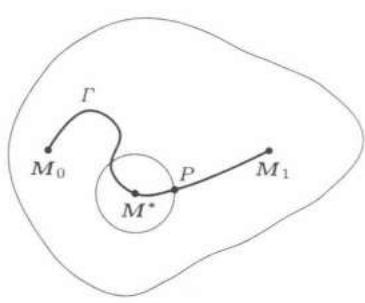

import Guide from '@/components/Guide.astro';
import Knowledge from '@/components/Knowledge.astro';
import Example from '@/components/Example.astro';
import Solution from '@/components/Solution.astro';
import Note from '@/components/Note.astro';
import Block from '@/components/Block.astro';
import Method from '@/components/Method.astro';

<Example title="例题 26.2.1 (第一 Green 恒等式)">
设 $\Sigma$ 为区域 $\Omega$ 的边界曲面, 分片光滑, $u$, $v$ 在 $\overline{\Omega}$ 上二阶连续可微, 证明:

$$
\iiint_{\Omega} \Delta u \cdot v \mathrm{d} x \mathrm{d} y \mathrm{d} z + \iiint_{\Omega} \nabla u \cdot \nabla v \mathrm{d} x \mathrm{d} y \mathrm{d} z = \iint_{\Sigma} v \frac{\partial u}{\partial n} \mathrm{d} S,
$$

其中 $\pmb{n}$ 为 $\Sigma$ 上的单位外法向量， $\frac{\partial u}{\partial n}$ 是 $u$ 在 $\pmb{n}$ 方向上的方向导数.

<Solution title="证明">
根据方向导数的计算公式,

$$
\oiint_{\Sigma} v \frac{\partial u}{\partial \boldsymbol{n}} \mathrm{d} S = \oiint_{\Sigma} v \left[ \frac{\partial u}{\partial x} \cos (\boldsymbol{n}, x) + \frac{\partial u}{\partial y} \cos (\boldsymbol{n}, y) + \frac{\partial u}{\partial z} \cos (\boldsymbol{n}, z) \right] \mathrm{d} S.
$$

利用公式($26.2$)，则

$$
\begin{array}{r l} \iint_{\Sigma} v \frac{\partial u}{\partial \boldsymbol{n}} \mathrm{d} S & = \iiint_{\Omega} \left[ \frac{\partial}{\partial x} (v u_{x}) + \frac{\partial}{\partial y} (v u_{y}) + \frac{\partial}{\partial z} (v u_{z}) \right] \mathrm{d} x \mathrm{d} y \mathrm{d} z \\ & = \iiint_{\Omega} \Delta u \cdot v \mathrm{d} x \mathrm{d} y \mathrm{d} z + \iiint_{\Omega} \nabla u \cdot \nabla v \mathrm{d} x \mathrm{d} y \mathrm{d} z. \end{array}
$$
</Solution>

<Note>
注$1$ 令 $v = 1$ ，则有

$$
\oiint_{\Sigma} \frac{\partial u}{\partial \boldsymbol{n}} \mathrm{d} S = \iiint_{\Omega} \Delta u \mathrm{d} x \mathrm{d} y \mathrm{d} z.\tag{26.15}
$$
</Note>

<Note>
注$2$ 由第一$Green$恒等式可以证明第二$Green$恒等式，见$26.2.4$小节的练习题$2$.
</Note>

</Example>

<Example title="例题 26.2.2">
设 $h(x,y,z)$ 在 $\mathbf{R}^3$ 上二阶连续可微， $\partial B_r(M)$ 是以 $M = (x,y,z)$ 为心， $r$ 为半径的球面，定义

$$
\boldsymbol{M}_{h} (x, y, z, r) = \frac{1}{4 \pi r^{2}} \oiint_{\partial B_{r} (\boldsymbol{M})} h (\xi , \eta , \zeta) \mathrm{d} S_{r},
$$

其中 $r > 0$ ，证明：

($1$) $M_{h}$ 是 $x$, $y$, $z$, $r$ 的二次连续可微函数;

$$
\Delta M_{h} (x, y, z, r) = \left(\frac{\partial^{2}}{\partial r^{2}} + \frac{2}{r} \frac{\partial}{\partial r}\right) M_{h} (x, y, z, r), \tag{2}
$$

其中 $\Delta=\frac{\partial^{2}}{\partial x^{2}}+\frac{\partial^{2}}{\partial y^{2}}+\frac{\partial^{2}}{\partial z^{2}};$

$$
\lim_{r \to 0^{+}} \frac{\partial}{\partial r} M_{h} (x, y, z, r) = 0. \tag{3}
$$

<Solution title="证明">
($1$) 由 ($25.27$), $M_{h}$ 的表达式可改写为

$$
M_{h} (x, y, z, r) = \frac{1}{4 \pi} \oiint_{\partial B_{1} (\mathbf{0})} h (x + r \alpha_{1}, y + r \alpha_{2}, z + r \alpha_{3}) \mathrm{d} S_{1},
$$

其中 $(\alpha_{1},\alpha_{2},\alpha_{3})$ 是球面 $\partial B_1(\mathbf{0})$ 的单位外法向量， $\mathrm{d}S_{1}$ 是 $\partial B_{1}(\mathbf{0})$ 的面积元.由含参变量积分的性质知 $M_h$ 是 $x,y,z,r$ 的二次连续可微函数

($2$) 由含参变量积分的求导公式得

$$
\Delta M_{h} (x, y, z, r) = \frac{1}{4 \pi} \oiint_{\partial B_{1} (\mathbf{0})} \Delta h (x + r \alpha_{1}, y + r \alpha_{2}, z + r \alpha_{3}) \mathrm{d} S_{1},\tag{26.16}
$$

$$
\begin{array}{r l} \frac{\partial M_{h}}{\partial r} & = \frac{1}{4 \pi} \iint_{\partial B_{1} (\mathbf{0})} \left(\frac{\partial h}{\partial x} \alpha_{1} + \frac{\partial h}{\partial y} \alpha_{2} + \frac{\partial h}{\partial z} \alpha_{3}\right) \mathrm{d} S_{1} \\ & = \frac{1}{4 \pi r^{2}} \iint_{\partial B_{1} (\mathbf{0})} \left(\frac{\partial h}{\partial x} \alpha_{1} + \frac{\partial h}{\partial y} \alpha_{2} + \frac{\partial h}{\partial z} \alpha_{3}\right) \mathrm{d} S_{r}. \end{array} \tag{由(25.26)}\tag{26.17}
$$

应用$Gauss$公式 ($26.2$), 则

$$
\frac{\partial M_{h}}{\partial r} = \frac{1}{4 \pi r^{2}} \iiint_{B_{r} (M)} \Delta h (\xi , \eta , \zeta) \mathrm{d} \xi \mathrm{d} \eta \mathrm{d} \zeta .\tag{26.18}
$$

应用例题$25.5.3(2)$中的结果, 则

$$
\frac{\partial^{2} M_{h}}{\partial r^{2}} = - \frac{1}{2 \pi r^{3}} \iiint_{B_{r} (M)} \Delta h (\xi , \eta , \zeta) \mathrm{d} \xi \mathrm{d} \eta \mathrm{d} \zeta + \frac{1}{4 \pi r^{2}} \oiint_{\partial B_{r} (M)} \Delta h (\xi , \eta , \zeta) \mathrm{d} S_{r}. \tag{26.19}
$$

由($26.18$)，($26.19$)得

$$
\begin{array}{r l} \frac{\partial^{2} M_{h}}{\partial r^{2}} + \frac{2}{r} \frac{\partial M_{h}}{\partial r} & = \frac{1}{4 \pi r^{2}} \oiint_{\partial B_{r} (M)} \Delta h (\xi , \eta , \zeta) \mathrm{d} S_{r} \\ & = \frac{1}{4 \pi r^{2}} \oiint_{\partial B_{r} (0)} \Delta h (x + r \alpha_{1}, y + r \alpha_{2}, z + r \alpha_{3}) \mathrm{d} S_{r} \\ & = \Delta M_{h} (x, y, z, r). \qquad (\text{由(26.16)}) \end{array}
$$

($3$) 利用 ($26.18$) 以及积分中值定理可知

$$
\lim_{r \rightarrow 0^{+}} \frac{\partial}{\partial r} M_{h} (x, y, z, r) = \lim_{r \rightarrow 0^{+}} \frac{1}{4 \pi r^{2}} \Delta h (\xi^{*}, \eta^{*}, \zeta^{*}) \cdot \frac{4}{3} \pi r^{3} = 0,
$$

其中 $(\xi^{*},\eta^{*},\zeta^{*})\in B_{r}(M)$ .
</Solution>
</Example>

<Knowledge title="性质$1$（平均值公式）">
记 $M_0 = (x_0, y_0, z_0)$ ，设函数 $u(x, y, z)$ 是某区域 $\Omega$ 上的调和函数， $M_0$ 是 $\Omega$ 中任一点。以 $M_0$ 为心， $R$ 为半径的球 $B_R(M_0)$ 完全落在 $\Omega$ 的内部，则

$$
u (M_{0}) = \frac{1}{4 \pi R^{2}} \oiint_{\partial B_{R} (M_{0})} u (x, y, z) \mathrm{d} S.
$$

<Solution title="证明">
对于 $0 < \rho \leqslant R$ ，由$Green$公式得

$$
\oiint_{\partial B_{\rho} (M_{0})} \frac{\partial u}{\partial n} (x, y, z) \mathrm{d} S = \iiint_{B_{\rho} (M_{0})} \Delta u \mathrm{d} x \mathrm{d} y \mathrm{d} z = 0,
$$

由例题$26.1.4$知结论成立.
</Solution>
</Knowledge>

<Knowledge title="性质$2$（极值原理）">
记 $M = (x, y, z)$ ，设函数 $u(M)$ 是区域 $\Omega$ 上的调和函数，且不恒等于常数，则 $u$ 在 $\Omega$ 的任何内点上的值不可能达到它在 $\Omega$ 上的上界或下界.

<Solution title="证明">
用反证法, 设调和函数 $u(M)$ 不恒等于常数, 且在区域 $\Omega$ 上的上界为 $K$ (这里假定函数 $u(M)$ 在 $\Omega$ 上有上界, 否则结论自然成立), 而 $u(M)$ 在 $\Omega$ 内某点 $M_0$ 取值为 $K$ , 我们来找出矛盾.

因为 $u(M)$ 不恒等于常数，则至少存在一点 $M_1 = (x_1, y_1, z_1) \in \Omega$ 使得 $u(M_1) < K$. 在 $\Omega$ 中作一条连接 $M_0, M_1$ 的连续曲线 $\Gamma$ (见图$26.1$)，设 $\Gamma$ 的参数方程为

$$
\Gamma : x = x (t), y = y (t), z = z (t), 0 \leqslant t \leqslant T,
$$

并且

$$
\begin{array}{l l l} x (0) = x_{0}, & y (0) = y_{0}, & z (0) = z_{0}, \\ x (T) = x_{1}, & y (T) = y_{1}, & z (T) = z_{1}. \end{array}
$$

定义

$$
t^{*} = \max \{t \mid 0 \leqslant t \leqslant T, u (x (t), y (t), z (t)) = K \},
$$

则 $0 \leqslant t^{*} < T$ 。以 $M^{*} = (x(t^{*}), y(t^{*}), z(t^{*}))$ 为心，充分小的 $\delta$ 为半径，作一个完全落在 $\Omega$ 内部的球 $B_{\delta}(M^{*})$ ，并且曲线

$$
x = x (t), \quad y = y (t), \quad z = z (t), \quad t^{*} \leqslant t \leqslant T,
$$

与球面 $\partial B_{\delta}(M^{*})$ 至少有一个交点 $P$ (见图$26.1$)，也就是说 $u(P) < K$ 。由函数 $u(M)$ 在 $P$ 点的连续性知存在 $P$ 点的一个邻域，使得在该邻域上 $u(M) < K$ ，因此 $u(M)$ 在 $\partial B_{\delta}(M^{*})$ 上的积分平均值

  
图$26.1$

$$
\frac{1}{4 \pi \delta^{2}} \oiint_{\partial B_{\delta} (M^{*})} u (x, y, z) \mathrm{d} S < \frac{1}{4 \pi \delta^{2}} \oiint_{\partial B_{\delta} (M^{*})} K \mathrm{d} S = K.
$$

但由平均值公式有

$$
\frac{1}{4 \pi \delta^{2}} \oiint_{\partial B_{\delta} (M^{*})} u (x, y, z) \mathrm{d} S = u (M^{*}) = K,
$$

由此得到矛盾. 同理可证 $u$ 也不能在 $\Omega$ 的内点取得 $u$ 在 $\Omega$ 上的下界.
</Solution>
</Knowledge>

<Note>
注$1$ 上述两个性质对任意维数的调和函数都是成立的.
</Note>

<Note>
注$2$ 若 $\Omega$ 是有界区域， $u$ 在 $\overline{\Omega}$ 上连续，在 $\Omega$ 上调和，则 $u$ 的最大最小值只能在 $\Omega$ 的边界上达到.
</Note>

<Knowledge title="命题 $26.2.1$">
若 $f$ 是以 $2\pi$ 为周期的连续函数, 则

$$
u (r \cos \theta , r \sin \theta) = \frac{1}{2 \pi} \int_{0}^{2 \pi} f (\varphi) \frac{1 - r^{2}}{1 - 2 r \cos (\theta - \varphi) + r^{2}} \mathrm{d} \varphi
$$

是单位圆盘上的调和函数，且

$$
\lim_{(\theta , r) \rightarrow (\theta_{0}, 1^{-})} \frac{1}{2 \pi} \int_{0}^{2 \pi} f (\varphi) \frac{1 - r^{2}}{1 - 2 r \cos (\theta - \varphi) + r^{2}} \mathrm{d} \varphi = f (\theta_{0}).
$$

<Solution title="证明">
唯一性的证明: 设 $u, v$ 都满足条件, 则 $w = u - v$ 当 $0 \leqslant r < 1$ 时是调和函数, 且

$$
w (\cos \theta , \sin \theta) = 0, \quad 0 \leqslant \theta < 2 \pi .
$$

由极值原理 (性质$2$) 知 $w \equiv 0$ , 于是唯一性成立.

存在性的证明要困难得多. 利用调和算子在极坐标系 $(r, \theta)$ 中的表达式

$$
\Delta := \frac{\partial^{2}}{\partial x^{2}} + \frac{\partial^{2}}{\partial y^{2}} = \frac{\partial^{2}}{\partial r^{2}} + \frac{1}{r} \frac{\partial}{\partial r} + \frac{1}{r^{2}} \frac{\partial^{2}}{\partial \theta^{2}},
$$

容易证明 $\Delta(r^{n}\cos n\theta)=\Delta(r^{n}\sin n\theta)=0$, $n=0,1,2,\cdots$ 由此，我们令

$$
u (r \cos \theta , r \sin \theta) = \frac{a_{0}}{2} + \sum_{n=1}^{\infty} (a_{n} \cos n \theta + b_{n} \sin n \theta) r^{n}.
$$

令 $r = 1$ ，由已知条件得到

$$
f (\theta) = \frac{a_{0}}{2} + \sum_{n=1}^{\infty} (a_{n} \cos n \theta + b_{n} \sin n \theta).
$$

由周期函数的$Fourier$级数理论知

$$
a_{n} = \frac{1}{\pi} \int_{0}^{2 \pi} f (\varphi) \cos n \varphi \mathrm{d} \varphi , \quad b_{n} = \frac{1}{\pi} \int_{0}^{2 \pi} f (\varphi) \sin n \varphi \mathrm{d} \varphi .
$$

代入 $u$ 的表达式中得到

$$
\begin{array}{r l} u (r \cos \theta , r \sin \theta) & = \frac{1}{\pi} \int_{0}^{2 \pi} f (\varphi) \left[ \frac{1}{2} + \sum_{n=1}^{\infty} r^{n} \cos n (\theta - \varphi) \right] \mathrm{d} \varphi \\ & = \frac{1}{2 \pi} \int_{0}^{2 \pi} f (\varphi) \operatorname{Re} \left[ \frac{1 + r \mathrm{e}^{\mathrm{i} (\theta - \varphi)}}{1 - r \mathrm{e}^{\mathrm{i} (\theta - \varphi)}} \right] \mathrm{d} \varphi \\ & = \frac{1}{2 \pi} \int_{0}^{2 \pi} f (\varphi) \frac{1 - r^{2}}{1 - 2 r \cos (\theta - \varphi) + r^{2}} \mathrm{d} \varphi . \end{array}
$$

下面证明它的确提供了问题的解.

首先证明 $u$ 在单位圆盘上是调和函数, 这只是一个对含参变量常义积分求二阶偏导数的计算, 所以留作练习, 其中要将 $u$ 的表达式改写为

$$
u (x, y) = \frac{1}{2 \pi} \int_{0}^{2 \pi} f (\varphi) \frac{1 - x^{2} - y^{2}}{1 - 2 (x \cos \varphi + y \sin \varphi) + x^{2} + y^{2}} \mathrm{d} \varphi .
$$

最后证明对每一个 $\theta_{0}$ ,

$$
\lim_{(\theta , r) \rightarrow (\theta_{0}, 1^{-})} \frac{1}{2 \pi} \int_{0}^{2 \pi} f (\varphi) \frac{1 - r^{2}}{1 - 2 r \cos (\theta - \varphi) + r^{2}} \mathrm{d} \varphi = f (\theta_{0}),
$$

这件事我们已经在例题$18.2.4$中证明过了. 这就完成了下面命题的证明.
</Solution>
</Knowledge>

<Knowledge title="推论">
若 $u$ 是半径为 $R > 0$ 的圆盘上的调和函数, 则对于 $0 \leqslant r < R$ 有

$$
\begin{array}{l} {u (r \cos \theta , r \sin \theta)} \\ {= \frac{1}{2 \pi} \int_{0}^{2 \pi} u (R \cos \varphi , R \sin \varphi) \frac{R^{2} - r^{2}}{R^{2} - 2 R r \cos (\theta - \varphi) + r^{2}} \mathrm{d} \varphi .} \end{array}\tag{26.20}
$$

称 ($26.20$) 为 $Poisson$ 积分公式.

<Solution title="证明">
若 $R = 1$, 结论就是命题$26.2.1$. 对于一般情形只需作一相似变换, 具体细节留作练习.
</Solution>
</Knowledge>

<Block title="练习题">
1. 证明：

(1) $\nabla \times (\nabla f) = 0;$

(2) $\nabla (\nabla \cdot \pmb {a}) - \nabla \times (\nabla \times \pmb {a}) = \Delta \pmb {a}$ , 其中 $\Delta \pmb {a} = (\Delta a_1, \Delta a_2, \Delta a_3)$.

2. (第二$Green$恒等式) 设 $\Sigma$ 为分片光滑封闭曲面, 围成的区域为 $\Omega$ , $u$, $v$ 在 $\overline{\Omega}$ 上二次连续可微. 证明:

$$
\iiint_{\Omega} (v \Delta u - u \Delta v) \mathrm{d} x \mathrm{d} y \mathrm{d} z = \iint_{\Sigma} \left(v \frac{\partial u}{\partial n} - u \frac{\partial v}{\partial n}\right) \mathrm{d} S,
$$

其中 $\pmb{n}$ 为 $\Sigma$ 的单位外法向量.

3. $\Sigma$ 为分片光滑封闭曲面, 围成的区域为 $\Omega$ , $u$ 在 $\overline{\Omega}$ 上二次连续可微, 在 $\Omega$ 上调和. 证明:

$$
\iiint_{\Omega} | \nabla u |^{2} \mathrm{d} x \mathrm{d} y \mathrm{d} z = \iint_{\Sigma} u \frac{\partial u}{\partial \boldsymbol{n}} \mathrm{d} S,
$$

并由此证明调和函数的惟一性, 即调和函数在 $\Omega$ 内部的值由它在边界 $\Sigma$ 上的值惟一确定.

4. 在调和函数性质$1$的条件下, 证明:

$$
u (M_{0}) = \frac{1}{\frac{4}{3} \pi R^{3}} \iiint_{B_{R} (M_{0})} u (x, y, z) \mathrm{d} x \mathrm{d} y \mathrm{d} z.
$$

5. 证明命题$26.2.1$的推论.

6. 证明: $Poisson$积分公式 ($26.20$) 定义的函数是调和函数.

7. 证明：调和函数无限次可微.

8. 若 $f$ 和 $g \circ f$ 都是一连通开集上的调和函数, $g$ 二阶连续可微, $f$ 不是常值函数, 证明: $g$ 是线性函数.

9. 证明：问题

$$
\Delta u = f (x, y, z), (x, y, z) \in D, \frac{\partial u}{\partial n} = g (x, y, z), (x, y, z) \in \partial D
$$

有解 $u$ 的必要条件是

$$
\iiint_{D} f \mathrm{d} x \mathrm{d} y \mathrm{d} z = \oiint_{\partial D} g \mathrm{d} S.
$$
</Block>
