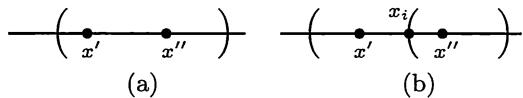

import Guide from '@/components/Guide.astro';
import Knowledge from '@/components/Knowledge.astro';
import Example from '@/components/Example.astro';
import Solution from '@/components/Solution.astro';
import Note from '@/components/Note.astro';
import Block from '@/components/Block.astro';
import Method from '@/components/Method.astro';

## 3.5.1 基本内容

1. 定义: 设有 $[a, b] \subset \bigcup_{\alpha} \mathcal{O}_{\alpha}$ , 其中每个 $\mathcal{O}_{\alpha}$ 是开区间, 则称 $\{\mathcal{O}_{\alpha}\}$ 是区间 $[a, b]$ 的一个开覆盖.

<Knowledge title="覆盖定理 ($Heine$-$Borel$ 定理)">
如果 $\{O_{\alpha}\}$ 是区间 $[a, b]$ 的一个开覆盖, 则存在 $\{O_{\alpha}\}$ 的一个有限子集 $\{O_{1}, O_{2}, \cdots, O_{n}\}$ , 它是区间 $[a, b]$ 的一个开覆盖, 也就是说有 $[a, b] \subset \bigcup_{i=1}^{n} O_{i}$ .
</Knowledge>

3. 覆盖定理也可以简单地表述为: 一个闭区间的任何一个开覆盖中一定有这个闭区间的有限子覆盖.

4. 在覆盖定理中的条件不能随意变动. 如果将闭区间 $[a, b]$ 改为开区间或无界区间, 或者将开覆盖中的每个开区间改为闭区间, 定理的结论都不再成立.

5. 在学习了拓扑学后会知道, 在数学分析中的覆盖定理是对实数系中的有界闭区间的某种拓扑性质的一种刻画. 这种性质在拓扑学中称为紧性. 在实数范围内, 区间的紧性和有界闭等价. 因此也将有界闭区间称为紧区间.

## 3.5.2 例题

<Example title="例 3.5.1">
举例说明: 覆盖定理在 $Q$ 中不成立.

这里只考虑有理数, 因此在开覆盖中的开区间和所覆盖的闭区间都由有理数组成, 它们的端点当然也都是有理数. 为了简明起见, 下面只将被覆盖的闭区间与有理数集 $\mathbf{Q}$ 取交, 而对于在开覆盖中的开区间仍采用原记号.

<Solution title="证明">
我们将在有理数的范围内构造一个开覆盖, 它将区间 $[0,2]$ 中的每一个有理数都覆盖住, 但在这个开覆盖中的任何一个有限子集却做不到这点. 为清楚起见, 用 $J = [0,2] \cap \mathbf{Q}$ 表示开覆盖的覆盖对象.

任取点 $x \in J \subset \mathbf{Q}$ . 由于 $x \neq \sqrt{2}$ , 可以取到有理数 $r_x$ , 使 $\sqrt{2} \notin (x - r_x, x + r_x)$ 成立. (例如取 $r_x \in (0, |x - \sqrt{2}|) \cap \mathbf{Q}$ 即可.) 这样就得到 $J$ 的一个开覆盖

$$
\{(x - r _ {x}, x + r _ {x}) \mid x \in J, r _ {x} \in Q \}.
$$

可以证明：在这个开覆盖中的任何有限子集都不能覆盖 J.

任取上述开覆盖中的一个有限子集

$$
\left(x _ {1} - r _ {x _ {1}}, x _ {1} + r _ {x _ {1}}\right), \dots , \left(x _ {n} - r _ {x _ {n}}, x _ {n} + r _ {x _ {n}}\right),
$$

先考察其中的一个开区间．由于它不含有 $\sqrt{2}$ ，同时区间的端点都是有理数，因此它也不会包含和 $\sqrt{2}$ 充分接近的有理数．又由于只取有限个开区间，因此它们的并也不会含有 $\sqrt{2}$ 以及和 $\sqrt{2}$ 充分接近的有理数．具体来说，令 $\delta_{i} = \max\{x_{i} - r_{x_{i}} - \sqrt{2}, \sqrt{2} - x_{i} - r_{x_{i}}\}, i = 1, \cdots, n,$ 再令 $\delta = \min\{\delta_{1}, \cdots, \delta_{n}\}$ ，则在上述开覆盖中的这个有限子集不能覆盖 J 中满足 $|\sqrt{2} - r| < \delta$ 的有理数 r. □
</Solution>
</Example>

以下给出覆盖定理的一个证明. 其中不仅用了确界存在定理, 而且使用了一种很有特色的 $Lebesgue$ (勒贝格) 方法. 这种方法有明显的几何意义, 可解决很多问题. (这种方法的缺点是: 它给出的证明一般都是非构造性的, 此外也难以推广到高维情况.)

<Example title="例 3.5.2">
用 $Lebesgue$ 方法证明覆盖定理.

<Solution title="证明">
设闭区间 $[a, b]$ 有一个开覆盖 $\{\mathcal{O}_{\alpha}\}$ . 定义数集

$$
A = \{x \geqslant a \mid \text {区间} [ a, x ] \text {在} \{\mathcal {O} _ {\alpha} \} \text {中存在有限子覆盖} \}.
$$

从区间的左端点 $x = a$ 开始. 由于在开覆盖 $\{\mathcal{O}_{\alpha}\}$ 中当然有一个开区间覆盖 $a$ , 因此 $a$ 及其右侧充分邻近的点均在数集 $A$ 中. 这保证了数集 $A$ 是非空的. 从数集 $A$ 的定义可见, 如果 $x \in A$ , 则整个区间 $[a, x] \subset A$ . 因此如果 $A$ 无上界, 则 $b \in A$ , 这就是说区间 $[a, b]$ 在开覆盖 $\{\mathcal{O}_{\alpha}\}$ 中存在有限子覆盖.

如果 $A$ 有上界, 用确界存在定理, 得到 $\xi = \sup A$ . 这时可见每个满足 $x < \xi$ 的 $x$ 都在 $A$ 中. 事实上从 $\xi = \sup A$ 和上确界为最小上界的定义, 在 $x < \xi$ 时, 存在 $y \in A$ , 使得 $x < y$ . 由于 $[a, y]$ 在 $\{\mathcal{O}_{\alpha}\}$ 中存在有限开覆盖, 所以 $[a, x] \subset [a, y]$ 更没有问题, 这就是说 $x \in A$ .

因此只要证明 $b < \xi$ , 就知道 $b \in A$ , 即 $[a, b]$ 在 $\{\mathcal{O}_{\alpha}\}$ 中存在有限开覆盖.

用反证法. 如果 $\xi \leqslant b$ , 则 $\xi \in [a, b]$ , 因此在开覆盖 $\{\mathcal{O}_{\alpha}\}$ 中有一个开区间 $\mathcal{O}_{\alpha_0}$ 覆盖 $\xi$ . 于是我们可以在这个开区间中找到 $a_0$ 和 $b_0$ , 使它满足条件 $a_0 < \xi < b_0$ . 由上面的论证知道 $a_0 \in A$ . 这就是说区间 $[a, a_0]$ 在开覆盖 $\{\mathcal{O}_{\alpha}\}$ 中存在有限子覆盖. 向这个有限子覆盖再加上一个开区间 $\mathcal{O}_{\alpha_0}$ , 就成为区间 $[a, b_0]$ 的覆盖, 所以得到 $b_0 \in A$ . 这与 $\xi = \sup A$ 矛盾.
</Solution>
</Example>

<Example title="例 3.5.3（加强形式的覆盖定理）">
证明：如果 $\{\mathcal{O}_{\alpha}\}$ 是区间 $[a,b]$ 的一个开覆盖，则存在一个正数 $\delta > 0$ ，使得对于区间 $[a,b]$ 中的任何两个点 $x', x''$ ，只要 $|x' - x''| < \delta$ ，就存在开覆盖中的一个开区间，它覆盖 $x', x''$ 。（称这个数 $\delta$ 为开覆盖的 $Lebesgue$ 数。）

<Solution title="证明">
首先用覆盖定理, 得到区间 $[a, b]$ 的一个有限子覆盖, 即开覆盖 $\{\mathcal{O}_{\alpha}\}$ 中的有限个开区间

$$
\mathcal {O} _ {1}, \mathcal {O} _ {2}, \dots , \mathcal {O} _ {n},\tag{3.1}
$$

它们的并覆盖了 $[a, b]$ . 将这有限个开区间的所有端点按大小顺序排列, 去掉其中可能有重复的点, 记为

$$
x _ {0} <   x _ {1} <   \dots <   x _ {N}.
$$

并记这个端点集为 $A=\{x_{0},x_{1},\cdots,x_{N}\}$ . 现在令

$$
\delta = \min \left\{x _ {1} - x _ {0}, x _ {2} - x _ {1}, \dots , x _ {N} - x _ {N - 1} \right\}.
$$

我们来证明这就是所求的 $Lebesgue$ 数.

设任取两点 $x', x'' \in [a, b]$ , 使 $0 < x'' - x' < \delta$ . 则有两个可能 (见图3.1):

<figure class="vp-figure">
  
  <figcaption>图3.1</figcaption>
</figure>

(a) 在闭区间 $[x', x'']$ 内没有端点集 $A$ 中的点. 于是在 (3.1) 中覆盖该闭区间中任何一点的开区间也就覆盖了整个闭区间.

(b) 在闭区间 $[x', x'']$ 内有 $A$ 中的点. 由于数 $\delta$ 的取法, 这样的点只有一个. 在图3.1(b)中将这个点记为 $x_i$ , 于是有 $x' \leqslant x_i \leqslant x''$ . 由于这个点 $x_i$ 是(3.1)中的开区间的端点, 而这个开区间并不覆盖点 $x_{i}$ , 因此在 (3.1) 中一定另有开区间覆盖点 $x_{i}$ , 它的左右端点必然分别小于 $x'$ 和大于 $x''$ , 从而也就同时覆盖点 $x'$ 和 $x''$ . $\square$
</Solution>

这个例题是覆盖定理的加强, 在今后会看到由于有了这种加强形式, 覆盖定理变得更为有力 (例如例题 5.2.2, 例题 5.4.1 和命题 10.1.5 等).
</Example>

## 3.5.3 练习题

1. 对开区间 $(0,1)$ 构造一个开覆盖, 使得它的每一个有限子集都不能覆盖 $(0,1)$ .

2. 用闭区间套定理证明覆盖定理.

3. 用覆盖定理证明闭区间套定理.

4. 用覆盖定理证明凝聚定理.

5. 试对于例题3.5.2的证明举出两个具体例子, 即(1)数集 $A$ 无上界; (2) $A$ 有上界, 且有 $b < \xi = \sup A$ 和 $\xi \notin A$ .
