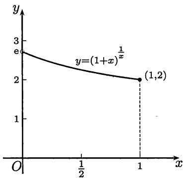

import Guide from '@/components/Guide.astro';
import Knowledge from '@/components/Knowledge.astro';
import Example from '@/components/Example.astro';
import Solution from '@/components/Solution.astro';
import Note from '@/components/Note.astro';
import Block from '@/components/Block.astro';
import Method from '@/components/Method.astro';

本节将以命题的形式证明两个重要极限。在它们的基础上可以解决许多极限的计算问题，特别是从这两个极限出发可以导出微分学中基本初等函数的所有求导法则（见[$49$]），因此是进入微分学之前的必要准备。

### $4.3.1$ $\lim_{x\to 0}\frac{\sin x}{x} = 1$

在所见的多数教科书（例如[$14$]）中均利用三角形和扇形之间的面积关系得到初等不等式（即命题$1.3.6$）

$$
\sin x <   x <   \tan x, \forall x \in \left(0, \frac {\pi}{2}\right),
$$

然后用于证明本小节的极限。在教材[$41$, $42$]中对这个问题采取了不同的处理方法。下面的证法见《数学的实践与认识》（$1987$）第$4$期$79$—$81$页，其中不需要上述不等式，但需要例题$4.1.3$的结论$\lim_{x \to 0} \sin x = 0$。（那里的证$1$不需要用上述不等式。）

<Knowledge title="命题$4.3.1$（第一个重要极限）">
$\lim_{x\to 0}\frac{\sin x}{x} = 1$

<Solution title="证明">
在单位圆内用圆心角$2x (0 < x \leqslant \frac{\pi}{2})$分圆，作出圆的一个内接多边形。如果$\pi / x = n$为正整数，就得到内接正$n$边形。否则记

$$
n = \left[ \frac {\pi}{x} \right],
$$

就可以得到圆的一个内接$n + 1$边形，其中的$n$条边所对应的圆心角都是$2x$。将余下的一条边所对应的圆心角记为$\theta_{x}$，可以计算出有

$$
0 <   \theta_ {x} = 2 \pi - 2 n x = 2 \pi - 2 x \left[ \frac {\pi}{x} \right] = 2 x \left(\frac {\pi}{x} - \left[ \frac {\pi}{x} \right]\right) <   2 x.
$$

又令$\theta_{x} = 0$对应于$\pi / x$为正整数的情况。将上述内接$n$或$n + 1$边形的周长记为$S_{x}$，就可得到

$$
\begin{array}{r} S _ {x} = 2 n \sin x + 2 \sin \frac {\theta_ {x}}{2} = 2 \left[ \frac {\pi}{x} \right] \sin x + 2 \sin \frac {\theta_ {x}}{2} \\ = 2 \pi \cdot \frac {\sin x}{x} + 2 \left(\left[ \frac {\pi}{x} \right] - \frac {\pi}{x}\right) \sin x + 2 \sin \frac {\theta_ {x}}{2}. \end{array}
$$

利用$\lim_{x\to 0}\sin x = 0$（见例题$4.1.3$），可见有

$$
S _ {x} = 2 \pi \cdot \frac {\sin x}{x} + o (1) (x \rightarrow 0 ^ {+}).
$$

当$x \to 0^{+}$时，上述圆内接多边形的每条边长都趋于$0$，因此就有$\lim_{x \to 0^{+}} S_{x} = 2\pi$。这样就得到

$$
\lim _ {x \rightarrow 0 ^ {+}} \frac {\sin x}{x} = \lim _ {x \rightarrow 0} \left(\frac {S _ {x}}{2 \pi} + o (1)\right) = 1.
$$

由于$\frac{\sin x}{x}$为偶函数，因此就得到所要求证的结果。
</Solution>
</Knowledge>

函数$\frac{\sin x}{x}$在理论和应用（例如信号处理）方面都很重要，也是数学分析中的重要例子。它在$x > 0$的图像见图$4.2$(a)(又见图$8.7$(b))。在例题$8.5.2$中研究了它的单调性。在$x = 0$处补充定义函数值为$1$后，可以证明函数在该点无限次可微，它的$Maclaurin$(麦克劳林)公式见例题$7.2.3$(参见例题$8.1.9$的注解$3$)。它在积分学中还会一再出现(如例题$11.3.1$, $11.3.2$, $12.3.6$等)。

### $4.3.2$ $\lim_{x\to0}(1+x)^{\frac{1}{x}}=e$

这是$§2.5$的极限$\lim_{n\to\infty}\left(1+\frac{1}{n}\right)^{n}=e$的重要推广。

<Knowledge title="命题$4.3.2$（第二个重要极限）">
$\lim_{x\to 0}(1 + x)^{\frac{1}{x}} = \mathrm{e}.$

<Solution title="证明">
先考虑$x \to 0^{+}$时的单侧极限（如图$4.1$）。

对$x \in (0,1)$，可有$n \in \mathbf{N}_{+}$，使得

$$
\frac {1}{n + 1} <   x \leqslant \frac {1}{n}
$$

成立。实际上将这个不等式改写一下，即是

$$
n \leqslant \frac {1}{x} <   n + 1,
$$

可见$n$是由以下公式确定的：

$$
n = \left[ \frac {1}{x} \right].\tag{4.5}
$$

  
图$4.1$

这时就可以得到估计

$$
\left(1 + \frac {1}{n + 1}\right) ^ {n} <   (1 + x) ^ {\frac {1}{x}} <   \left(1 + \frac {1}{n}\right) ^ {n + 1},\tag{4.6}
$$

其中的$n$由公式($4.5$)与$x$相联系。若将$n$看成独立的自变量，就有

$$
\lim _ {n \to \infty} \left(1 + {\frac {1}{n + 1}}\right) ^ {n} = \mathrm{e} \quad {\text {和}} \quad \lim _ {n \to \infty} \left(1 + {\frac {1}{n}}\right) ^ {n + 1} = \mathrm{e}
$$

成立。因此，$\forall \varepsilon > 0$，存在$N$，当$n > N$时，同时成立

$$
\left| \left(1 + {\frac {1}{n + 1}}\right) ^ {n} - \mathrm{e} \right| <   \varepsilon \quad {\text {和}} \quad \left| \left(1 + {\frac {1}{n}}\right) ^ {n + 1} - \mathrm{e} \right| <   \varepsilon .\tag{4.7}
$$

利用($4.5$)，可见只要有$0 < x < \delta = \frac{1}{N + 1}$，即$\frac{1}{x} > N + 1$，就可以使

$$
n = \left[ \frac {1}{x} \right] > \frac {1}{x} - 1 > N
$$

成立，从而由($4.6$)和($4.7$)得到$\left|(1 + x)^{\frac{1}{x}} - e\right| < \varepsilon$。这样就证明了

$$
\lim _ {x \rightarrow 0 ^ {+}} (1 + x) ^ {\frac {1}{x}} = \mathrm{e}.
$$

为了讨论$x \to 0^{-}$，可以取$z = -x$，则当$x \to 0^{-}$时$z \to 0^{+}$，因此

$$
\begin{array}{r l} \lim _ {x \to 0 ^ {-}} (1 + x) ^ {\frac {1}{x}} & = \lim _ {z \to 0 ^ {+}} (1 - z) ^ {- \frac {1}{z}} = \lim _ {z \to 0 ^ {+}} \left(\frac {1}{1 - z}\right) ^ {\frac {1}{z}} \\ & = \lim _ {z \to 0 ^ {+}} \left(1 + \frac {z}{1 - z}\right) ^ {\frac {1}{z}} = \lim _ {z \to 0 ^ {+}} \left(1 + \frac {z}{1 - z}\right) ^ {\frac {1 - z}{z}} = e. \end{array}
$$

合并两个单侧极限就得到所求证的结果。
</Solution>
</Knowledge>

<Note title="注 1">
对($4.6$)不加分析就直接用夹逼定理是不妥当的。由于该式中间是函数，当然不可能用数列极限的夹逼定理。如果用函数极限的夹逼定理，则($4.6$)的两侧又是什么样的函数？为什么它们的极限都等于$e$？

实际上该式两侧并非是数列（的通项），而是$x$的函数。它们在每个区间$[k, k + 1) (k \in \mathbf{N}_+)$上取常值。若将它们分别记为$f$和$g$，则先要证明当$x \to 0^+$时它们的极限均为$\mathbf{e}$，在这以后才可以用函数极限的夹逼定理。读者可以将这个做法与上面从单侧极限的$\varepsilon - \delta$定义出发的证明作比较。
</Note>

<Note title="注 2">
将函数$(1 + x)^{1 / x}$在$x = 0$处补充定义使它连续后，就可以证明延拓后的函数在原点无限次可微。它的$Maclaurin$公式计算见例题$7.2.4$。
</Note>

由以上两个重要极限可以导出以下几个基本结果。由于一般教科书中都有它们的证明，这里不再重复。要求读者能记得，会证明。

($1$) $\lim_{x\to 0}\frac{\tan x}{x} = 1;$

($3$) $\lim_{x\to 0}\frac{\ln(1 + x)}{x} = 1;$

($2$) $\lim_{x\to 0}\frac{1 - \cos x}{x^2} = \frac{1}{2};$

$$
(4) \lim _ {x \to 0} \frac {a ^ {x} - 1}{x} = \ln a (a > 0).
$$

### $4.3.3$ 例题

下面的$3$个例题表明，利用复合函数的极限方法，即变量代换法（参见命题$4.1.1$），可以扩大以上两个重要极限的适用范围（证明从略）。

<Example title="例题$4.3.1$">
若$\lim_{t\to t_0}g(t) = 0$，且当$t\neq t_0$时$g(t)\neq 0$，则$\lim_{t\to t_0}\frac{\sin g(t)}{g(t)} = 1.$
</Example>

<Example title="例题$4.3.2$">
若$\lim_{t\to t_{0}}g(t)=+\infty(-\infty)$，则$\lim_{t\to t_{0}}\left(1+\frac{1}{g(t)}\right)^{g(t)}=e.$
</Example>

<Example title="例题$4.3.3$">
设$\lim_{t\to t_0}g(t) = 0,$且$t\neq t_0$时$g(t)\neq 0,$则$\lim_{t\to t_0}\frac{\ln(1 + g(t))}{g(t)} = 1.$
</Example>

<Example title="例题$4.3.4$">
求$\lim_{x\to 0}(\cos x)^{\frac{1}{x^2}}$

<Solution title="解">
首先看出这个问题是$1^{\infty}$型的不定式，因此可以试用上述第二个重要极限。改写原问题如下:

$$
\begin{array}{r l} & {\underset {x \to 0} {\lim} (\cos x) ^ {\frac {1}{x ^ {2}}} = \underset {x \to 0} {\lim} \left(1 - 2 \sin^ {2} \frac {x}{2}\right) ^ {\frac {1}{x ^ {2}}}} \\ & {\qquad = \underset {x \to 0} {\lim} \left(1 - 2 \sin^ {2} \frac {x}{2}\right) ^ {\frac {1}{- 2 \sin^ {2} \frac {x}{2}} \cdot \frac {- 2 \sin^ {2} \frac {x}{2}}{x ^ {2}}}.} \end{array}
$$

由于$\lim_{x\to 0}\frac{2\sin^2\frac{x}{2}}{x^2} = \lim_{x\to 0}\left(\frac{\sin\frac{x}{2}}{\frac{x}{2}}\right)^2\cdot \frac{1}{2} = \frac{1}{2},$因此答案是$\mathrm{e}^{-\frac{1}{2}}$
</Solution>
</Example>

<Example title="例题$4.3.5$">
求$\lim_{x\to \infty}\left(\sin \frac{1}{x} +\cos \frac{1}{x}\right)^x.$

<Solution title="解">
与上一题类似，可将原式改写如下:

$$
\begin{array}{c} \lim _ {x \to \infty} \left[ 1 + \left(\sin \frac {1}{x} + \cos \frac {1}{x} - 1\right) \right] ^ {x} \\ = \lim _ {x \to \infty} \left[ 1 + \left(\sin \frac {1}{x} + \cos \frac {1}{x} - 1\right) \right] ^ {\frac {x}{\sin \frac {1}{x} + \cos \frac {1}{x} - 1} \cdot (\sin \frac {1}{x} + \cos \frac {1}{x} - 1)}, \end{array}
$$

可见只要计算出

$$
\lim _ {x \to \infty} x \left(\sin {\frac {1}{x}} + \cos {\frac {1}{x}} - 1\right) = \lim _ {x \to \infty} \left(\frac {\sin {\frac {1}{x}}}{\frac {1}{x}} - \frac {2 \sin^ {2} {\frac {1}{2 x}}}{\frac {1}{2 x} \cdot 2}\right) = 1,
$$

即知原问题的答案为$e$。
</Solution>

<Note title="注">
以上两个例题的求解在写法上可以利用$u^v = \mathrm{e}^{v\ln u}$和例题$4.3.3$改写如下(只写出后一例题):

$$

\begin{array}{c} \lim _ {x \to \infty} x \ln \left(\sin \frac {1}{x} + \cos \frac {1}{x}\right) = \lim _ {x \to \infty} x \ln \left[ 1 + \left(\sin \frac {1}{x} + \cos \frac {1}{x} - 1\right) \right] \\ = \lim _ {x \to \infty} x \left(\sin \frac {1}{x} + \cos \frac {1}{x} - 1\right), \end{array}

$$

以下同上。又如果一开始作代换$y = 1 / x$，则在书写上更方便一些。
</Note>
</Example>

### $4.3.4$ 练习题

<Block title="练习题">

($1$) 计算下列极限:

(($1$)) $\lim_{x\to +\infty}\left(\frac{2}{\pi}\arctan x\right)^x;$ (($2$)) $\lim_{x\to \frac{\pi}{2}^{-}}(\sin x)^{\tan x};$ (($3$)) $\lim_{x\to \infty}\left(\frac{x^2 - 1}{x^2 + 1}\right)^{x^2};$ (($4$)) $\lim_{x\to \frac{\pi}{2}^{-}}(\cos x)^{\frac{\pi}{2} -x};$ (($5$)) $\lim_{x\to 0}\frac{\sin 2x - 2\sin x}{x^3};$ (($6$)) $\lim_{x\to 1}(1 - x)\tan \left(\frac{\pi}{2} x\right).$

($2$) 注意下列两个“不等式”并求出正确值：
(($1$)) $\lim_{x\to+\infty}\frac{\sin x}{x}\neq1;$ (($2$)) $\lim_{x\to+\infty}(1+x)^{\frac{1}{x}}\neq e.$

($3$) 设$a > 0, b > 0$，求极限$\lim_{n \to \infty} \left( \frac{\sqrt[n]{a} + \sqrt[n]{b}}{2} \right)^n$。

(本题是数列极限问题，但现在可以用函数极限知识来解决。)

($4$) 设$a_1, \cdots, a_n$为正数，$n \geqslant 2$，$f(x) = \left(\frac{a_1^x + a_2^x + \cdots + a_n^x}{n}\right)^{\frac{1}{x}}$，求$\lim_{x \to 0} f(x)$。

($5$) 计算极限$\lim_{n\to \infty}\prod_{k = 1}^{n}\cos \frac{x}{2^k}$，并证明$Viète$ (韦达)公式

$$
\frac {\pi}{2} = \frac {1}{\sqrt {\frac {1}{2}} \cdot \sqrt {\frac {1}{2} + \frac {1}{2} \sqrt {\frac {1}{2}}} \cdot \sqrt {\frac {1}{2} + \frac {1}{2} \sqrt {\frac {1}{2} + \frac {1}{2} \sqrt {\frac {1}{2}}} \cdot \cdots}}.
$$

(这是数学家$Viète$在$1593$年发表的。它是数学史上第一次用无穷乘积来表示一个数，同时也是对于圆周率$\pi$的认识上的重大突破。)

</Block>
