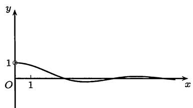
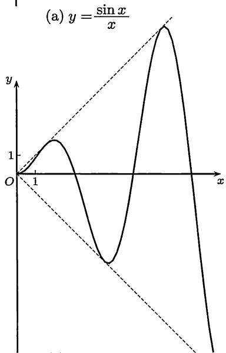
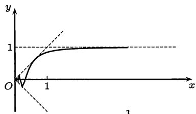
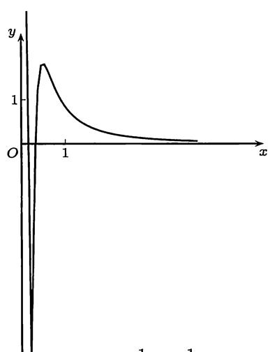

import Guide from '@/components/Guide.astro';
import Knowledge from '@/components/Knowledge.astro';
import Example from '@/components/Example.astro';
import Solution from '@/components/Solution.astro';
import Note from '@/components/Note.astro';
import Block from '@/components/Block.astro';
import Method from '@/components/Method.astro';

从数列开始, 就已接触到无穷小量、有界量和无穷大量的概念. 在本节将介绍如何将它们用于函数极限计算, 其中特别是等价量代换法将成为计算函数极限的基本方法之一.

## 4.4.1 记号 $o, O$ 与 $\sim$

设 $f(x)$ 和 $g(x)$ 在点 $a$ 的某个去心邻域 $O(a) - \{a\}$ 上定义, 并且 $g(x) \neq 0$ . (对于 $a$ 为无穷大量的情况和单侧极限等情况可类推.)

1. $f(x) = o(g(x))(x\to a)$ 的定义是： $\lim_{x\to a}\frac{f(x)}{g(x)} = 0,$ 如果当 $x\to a$ 时 $f(x)$ 和 $g(x)$ 都是无穷小量, 则称当 $x\to a$ 时 $f(x)$ 是比 $g(x)$ 更高阶的无穷小量.

2. $f(x) = o(1)(x \to a)$ 的定义是: $\lim_{x \to a} f(x) = 0$ . 因此与数列情况一样, 记号 $o(1)$ 用于表示关于某个极限过程的无穷小量.

3. $f(x) = O(g(x))(x\to a)$ 的定义是：存在常数 $M > 0$ ，使得 $\left|\frac{f(x)}{g(x)}\right| \leqslant M$ 在 $a$ 的某个去心邻域上成立,因此成立不等式 $|f(x)|\leqslant M|g(x)|.$

4. $f(x) = O(1)(x \to a)$ 的定义是: 存在 $a$ 的某个去心邻域, 使 $f$ 在其上有界. 这与数列情况不太一样, 在那里 $O(1)$ 就是有界量, 而在这里记号 $O(1)(x \to a)$ 用于表示在点 $a$ 的某个去心邻域上的一个有界量, 因此也称为局部有界量.

5. 如果有 $\lim_{x\to a}\frac{f(x)}{g(x)} = A\neq 0,$ 而且当 $x\to a$ 时 $f$ 和 $g$ 都是无穷小量（无穷大量），则称 $f$ 和 $g$ 是同阶无穷小量(无穷大量).

6. $f(x) \sim g(x) (x \to a)$ 的定义是: $\lim_{x \to a} \frac{f(x)}{g(x)} = 1$ , 如果当 $x \to a$ 时 $f$ 和 $g$ 是无穷小量 (无穷大量), 则称 $f$ 和 $g$ 是等价无穷小量 (无穷大量). 今后我们还将含有 $o, O$ 和 $\sim$ 的等式称为渐近等式, 并将 $f(x) \sim g(x) (x \to a)$ 说成是函数 $f(x)$ 和 $g(x)$ 当 $x \to a$ 时具有相同的渐近性态. 特别是当 $x \to \infty$ (包括数列极限中的 $n \to \infty$ ) 时这种表述在数学中用得很广泛.

7. 以上所说有关阶的概念还可以量化, 其方法是对有关的极限过程取一类简单的无穷小量 (或无穷大量) 作为标准. 下面只举出常用的情况. 设已知 $f(x) = o(1) (x \to a)$ . 若有常数 $\alpha > 0$ , 使得 $\lim_{x \to a} \left| \frac{f(x)}{(x - a)^{\alpha}} \right| = l > 0$ , 则称 $f(x)$ 在 $x \to a$ 时是 $\alpha$ 阶的无穷小量.

8. 在使用这些记号时, 必需写出有关的极限过程. 除了对数列可以不写出 $(n \to \infty)$ 外, 其他极限过程均不可省略 (除非另加说明). 例如以下关于对数函数的三个最基本的渐近性质当然是与相应的极限过程不可分开的:

$$
\ln x = o (1) (x \rightarrow 1), \quad \ln x = o (x) (x \rightarrow + \infty), \quad \ln x = o \left(\frac {1}{x}\right) (x \rightarrow 0 ^ {+}).
$$

下面是几个重要的极限关系(其中题(7)见下面的例题$4.4.4$):
(1) $e^{x} - 1 \sim x (x \to 0)$ ; (2) $\sin x \sim x (x \to 0)$ ;
(3) $\ln(1+x)\sim x(x\rightarrow0)$ ; (4) $1-\cos x\sim\frac{1}{2}x^{2}(x\rightarrow0)$ ;
(5) $\ln x = o(x^{-\alpha})(x \to 0^{+})(\alpha > 0)$ ; (6) $x^{k} = o(a^{x})(x \to +\infty)(a > 1)$ ;
(7) $(1+x)^{\alpha}-1\sim\alpha x(x\to0)$ ; (8) $\arctan x\sim x(x\to0).$

上面引进的一些记号, 即 $o, O, \sim$ 和关于阶与等价的概念在处理函数极限时是很有用的工具, 但这里对初学者来说同时也有许多陷阱, 很容易出错.

在使用 $o, O, \sim$ 时, 除了必须写明极限过程之外, 还要知道以下两点:

首先, 含有 $o, O$ 的等式, 即渐近等式, 与普通的等式大不一样. 它们并不是量的相等, 而是代表在极限过程中的关系.

其次, 它们一般只能从左往右读, 而不能从右往左读. 例如 $o(1) = O(1) (x \to a)$ 的含义是: 无穷小量必是局部有界量. 而 $O(1) = o(1) (x \to a)$ 是错的, 因为局部有界量当然未必是无穷小量.

<Note>
含有 $o, O$ 的等式, 是大部分学生理解的难点. 从教学中, 我们发现从集合论的角度, 可以向学生说清楚这种等式的真正含义. 例如, 在 $x \to 0$ 时, 将 $o(x)$ 理解为比 $x$ 高阶的无穷小量组成的集合, 于是等式 $f(x) = o(x)$ 中等号 $=$ 所实际表达的意思是 $\in$ . 凡是只有右边含有 $o, O$ 的等式都可以这样理解. 而两边都含有 $o, O$ 的等式中的等号 $=$ 实际表达的意思是 $\subset$ . 因此, 它们只能从左往右读.
</Note>

<Example title="例题4.4.1">
证明 $O(x^{2}) = o(x) (x \to 0)$ .
<Solution title="证明">
根据题意, 设 $\frac{f(x)}{x^2}$ 在某个 $O(0) - \{0\}$ 上有界, 即存在 $M > 0$ 和 $\delta > 0$ , 当 $0 < |x| < \delta$ 时, 成立 $|f(x)| \leqslant Mx^2$ . 于是, 当 $0 < |x| < \delta$ 时, 有

$$
\left| \frac {f (x)}{x} \right| \leqslant \left| \frac {M x ^ {2}}{x} \right| = | M x |,
$$

因此, 令 $x \to 0$ 时, 上式的极限为 $0$ . 这就是 $f(x) = o(x) (x \to 0)$ . 这样我们就证明了当 $f(x) = O(x^2) (x \to 0)$ 时, 一定就有 $f(x) = o(x) (x \to 0)$ .
</Solution>
</Example>

<Example title="例题4.4.2">
证明 $\cos x = 1 + O(x^{2}) (x \to 0)$ 成立.
<Solution title="证明">
已知有 $\lim_{x\to 0}\frac{1 - \cos x}{x^2} = \frac{1}{2}$ ，因此存在 $\delta >0$ ，使得当 $0 < |x| < \delta$ 时， $\frac{\cos x - 1}{x^2}$ 有界。这就是说 $\cos x - 1 = O(x^2)(x\to 0)$ 。再移项即得。
</Solution>
</Example>

关于无穷小量的阶可以从前面的许多例子得到理解。例如，当 $x \to 0$ 时， $\sin x$ 是一阶无穷小量， $1 - \cos x$ 是二阶无穷小量， $\sin x - \tan x$ 是三阶无穷小量等（后者见例题$4.4.5$）。又由此可见 $\sin x = O(x)$ ， $1 - \cos x = O(x^2)$ ， $\sin x - \tan x = O(x^3)(x \to 0)$ ，但并不能从这三个公式推出关于阶的结论。

应当指出, 无穷小量 (以及无穷大量) 不一定有阶.

<Example title="例题4.4.3">
证明：当 $x \to 0$ 时无穷小量 $x \sin \frac{1}{x}$ 没有阶.
<Solution title="证明">
这只要观察

$$
\lim _ {x \to 0} \frac {x \sin {\frac {1}{x}}}{x ^ {\alpha}}
$$

即可. 如取 $\alpha \geqslant 1$ , 则上述极限不存在; 但若取 $\alpha < 1$ , 则上述极限为 $0$, 因此没有阶. 但是也可以说它的阶比任何 $\alpha < 1$ 高.

当然有 $x\sin \frac{1}{x} = O(x), x\sin \frac{1}{x} = o(x^{\alpha}), \forall \alpha < 1 (x \to 0)$ .
</Solution>
</Example>

最后再举出两个用等价记号～刻画的重要渐近公式.

1. 关于阶乘的 $Stirling$ 公式:

$$
n! \sim \left(\frac {n}{\mathrm{e}}\right) ^ {n} \sqrt {2 \pi n}.
$$

它的证明将在积分学中给出 (命题$11.4.2$).

2. 如果将不超过 $x$ 的素数个数记为 $\pi(x)$ , 则有素数定理:

$$
\pi (x) \sim \frac {x}{\ln x} (x \rightarrow + \infty).
$$

素数定理是数论中的重要定理. $Legendre$ (勒让德) 和 $Gauss$ 通过实验提出了猜测. $Hadamard$ (阿达马) 和 $de la Vallée-Poussin$ (德拉瓦莱普森) 于 1896 年分别独立地给出了素数定理的第一个证明. 1949 年, $Selberg$ (塞尔伯格) 和 $Erdős$ (爱尔迪希) 又给出了它的初等证明. (例如可参考华罗庚的《数论导引》.)

## 4.4.2 思考题

1. $10^{-10000}, \mathrm{e}^{-10^{10}}, x, \sin x$ 是否是无穷小量？ $10^{10000}, \mathrm{e}^{10^{10}}, x^n, a^x (a > 1)$ 是否是无穷大量？

2. 确定下列极限是否存在, 若存在, 等于什么? (观察图 4.2 中的图像.)

(1) $\lim_{x\to 0}\frac{\sin{x}}{x};$

(2) $\lim_{x\to +\infty}\frac{\sin x}{x};$

(3) $\lim_{x\to 0}x\sin {\frac{1}{x}};$

(4) $\lim_{x\to \infty}x\sin {\frac{1}{x}};$

(5) $\lim_{x\to 0}x\sin x;$

(6) $\lim_{x\to \infty}x\sin x;$

(7) $\lim_{x\to 0}\frac{1}{x}\sin {\frac{1}{x}};$

(8) $\lim_{x\to \infty}\frac{1}{x}\sin \frac{1}{x}.$

$$
y = x \sin {\frac {1}{x}}
$$

(c) $y = x\sin x$  
  
图4.2  
(d) $y = \frac{1}{x} \sin \frac{1}{x}$

3. 当 $x \to 0$ 时, 下列等式中哪些可以成立:

(1) $o(1) = O(1)$ ;

(2) $O(1) = o(1)$ ;

(3) $o(x^{2}) = o(x)$ ;

(4) $O(x^{2}) = o(x)$ ;

(5) $x \cdot o(x^{2}) = o(x^{3});$

(6) $\frac{O(x^2)}{x} = o(x)$ .

4. 作出 $y = \mathrm{e}^{\frac{1}{x}}$ 的图形, 观察: $\mathrm{e}^{\frac{1}{x}} \to +\infty (x \to 0^{+})$ 和 $\mathrm{e}^{\frac{1}{x}} = o(1)(x \to 0^{-})$ .

## 4.4.3 等价量代换法

在求极限的计算中, 等价量代换法是基本方法之一.

<Example title="例题4.4.4">
设 $\alpha \neq 0$ 求 $\lim_{x\to 0}\frac{(1 + x)^{\alpha} - 1}{x}$

<Solution title="解">
令 $y = (1 + x)^{\alpha} - 1$ ，则当 $x \to 0$ 时 $y \to 0$ 。利用 $1 + y = (1 + x)^{\alpha}$ ，有 $\ln(1 + y) = \alpha \ln(1 + x)$ 。计算如下：

$$
\lim _ {x \rightarrow 0} \frac {(1 + x) ^ {\alpha} - 1}{x} = \lim _ {x \rightarrow 0} \frac {(1 + x) ^ {\alpha} - 1}{\ln (1 + x)} = \lim _ {y \rightarrow 0} \frac {\alpha y}{\ln (1 + y)} = \lim _ {y \rightarrow 0} \frac {\alpha y}{y} = \alpha .
$$
</Solution>

<Note>
本例是变量代换和等价量代换两个方法结合的典型例子。在以上计算中先利用 $\ln (1 + x) \sim x$ ( $x \to 0$ ), 将分母的 $x$ 换为 $\ln (1 + x)$ (将简单换成复杂), 后来又利用 $\ln (1 + y) \sim y$ ( $y \to 0$ ), 将 $\ln (1 + y)$ 换为 $y$ .
</Note>

<Note>
在本例中的指数 $\alpha$ 可以是不为0的任何实数. 而在过去我们只能用二项式展开的方法处理 $\alpha$ 为有理数的情况. 今后可以直接应用本题的一般结论.
</Note>
</Example>

<Example title="例题4.4.5">
求极限 $\lim_{x\to 0}\frac{\sin x - \tan x}{x^3}.$

<Solution title="解1">
将表达式进行分解, 利用已知极限即可如下计算:

$$
\lim _ {x \to 0} \frac {\sin x - \tan x}{x ^ {3}} = \lim _ {x \to 0} \left(\frac {\sin x}{x} \cdot \frac {1}{\cos x} \cdot \frac {\cos x - 1}{x ^ {2}}\right) = - \frac {1}{2}.
$$
</Solution>

<Solution title="解2">
若用等价量代换法, 则可写出 $\frac{\sin x - \tan x}{x^3} = \frac{\sin x (\cos x - 1)}{x^3 \cos x}$ , 然后利用当 $x \to 0$ 时的等价关系 $\sin x \sim x$ , $1 - \cos x \sim \frac{1}{2} x^2$ 和 $\cos x \sim 1$ , 将上面的表达式中的 $\sin x$ 换为 $x$ , $\cos x$ 换为 $1$ , $\cos x - 1$ 换为 $-\frac{1}{2} x^2$ , 就有

$$
\lim _ {x \to 0} \frac {\sin x - \tan x}{x ^ {3}} = \lim _ {x \to 0} \frac {\sin x (\cos x - 1)}{x ^ {3} \cos x} = \lim _ {x \to 0} \frac {x \left(- \frac {1}{2} x ^ {2}\right)}{x ^ {3}} = - \frac {1}{2}.
$$
</Solution>
</Example>

<Method title="等价量代换法">
一般的等价量代换法可以叙述如下:

设要求极限 $\lim_{x\to a}uv,$ 其中 $u,v$ 是 $x$ 的函数.如已知 $u\sim u_1(x\to a)$ ，则可以将上式中的因子 $u$ 用 $u_{1}$ 代替，写成公式就是

$$
\lim _ {x \rightarrow a} u v = \lim _ {x \rightarrow a} \left(\frac {u}{u _ {1}}\right) u _ {1} v = \lim _ {x \rightarrow a} u _ {1} v,\tag{4.8}
$$

这就是说可以将 $u$ 换成 $u_{1}$ (其中假定在 $a$ 邻近 $u_{1} \neq 0$ ). 当然这个做法可以反复使用, 例如在例题$4.4.5$的解$2$中就代换了三个因子, 使函数的表达式大大简化.

在这里要强调指出: 在对于形式为 $u + v$ 或 $(u + v)w$ 的函数求极限时, 即使有 $u \sim u_1$ 也不能将 $u$ 随便换成 $u_1$ . 例如在例题$4.4.5$中, 以下做法都是错误的:

1. 利用 $\sin x \sim \tan x (x \to 0)$ 得到 $\lim_{x \to 0} \frac{\sin x - \tan x}{x^3} = \lim_{x \to 0} \frac{\sin x - \sin x}{x^3} = 0$ .

2. 利用 $\sin x \sim x (x \to 0)$ 得到 $\lim_{x \to 0} \frac{\sin x - \tan x}{x^3} = \lim_{x \to 0} \frac{x - \tan x}{x^3} = -\frac{1}{3}$ .

3. 利用 $\tan x \sim x (x \to 0)$ 得到 $\lim_{x \to 0} \frac{\sin x - \tan x}{x^3} = \lim_{x \to 0} \frac{\sin x - x}{x^3} = -\frac{1}{6}$ .

这三个例子中的最后一步都没有错 (其中后两个数值 $-\frac{1}{3}$ 和 $-\frac{1}{6}$ 的计算在学了微分学后就可以得到), 但答案都是错的. 其原因是第一步的代换没有根据.

什么条件下才可以在和式中用等价量代换？

假定考虑的极限过程为 $x \to a$ ，则一个容易证明的充分条件就是

$$
u \sim u _ {1}, v \sim v _ {1}, \lim _ {x \rightarrow a} u + v \neq 0 \implies u + v \sim u _ {1} + v _ {1}.\tag{4.9}
$$

它清楚地表明, 在和式中用等价量代换出错的根源就在于当时起作用的是更高阶的无穷小量. 关于 (4.9) 的证明从略. 这方面有许多研究, 感兴趣的读者可以参考 [57] 以及其中所引的文献.

实际上等价量代换 (在无穷小量的情况) 的本质就是用较为简单的无穷小量代替比较复杂的无穷小量, 而将两个无穷小量之间的差略去不计. 当然, 这时它们的差必须是更高阶的无穷小量. 一种安全的做法就是保留高阶无穷小量, 而不是简单的代换. 从下一个例题中可以看到这是如何进行的.
</Method>

<Example title="例题4.4.6">
设 $f(x)=\frac{m}{1-x^{m}}-\frac{n}{1-x^{n}}, m, n \in \mathbf{N}_{+}$ ，求极限 $\lim_{x \to 1} f(x)$ .

<Solution title="解">
令 $y = x - 1$ ，则 $x \to 1 \Longleftrightarrow y \to 0$ . 计算如下：

$$
\begin{array}{l} f (x) = f (1 + y) = \frac {m}{1 - (1 + y) ^ {m}} - \frac {n}{1 - (1 + y) ^ {n}} \\ \qquad = \frac {m [ 1 - (1 + y) ^ {n} ] - n [ 1 - (1 + y) ^ {m} ]}{[ (1 + y) ^ {m} - 1 ] \cdot [ (1 + y) ^ {n} - 1 ]} \\ \qquad = \frac {n \left[ m y + \frac {m (m - 1)}{2} y ^ {2} + o (y ^ {2}) \right] - m \left[ n y + \frac {n (n - 1)}{2} y ^ {2} + o (y ^ {2}) \right]}{n m (y + o (y)) \cdot (y + o (y))} \\ \qquad = \frac {\frac {m n}{2} (m - n) y ^ {2} + o (y ^ {2})}{m n (y ^ {2} + o (y ^ {2}))} = \frac {1}{2} (m - n) + o (1) (y \to 0), \end{array}
$$

其中的 $o(y^{2}), o(y), o(1)$ 均是对 $y \to 0$ 而言的, 可见极限为 $\frac{1}{2}(m - n)$ .
</Solution>

<Note>
以上所用的方法已经超出了等价量代换法的思想. 一般称

$$
(1 + y) ^ {n} = 1 + n y + o (y) (y \rightarrow 0)
$$

或

$$
(1 + y) ^ {n} = 1 + n y + \frac {n (n - 1)}{2} + o (y ^ {2}) (y \rightarrow 0)
$$

中的 $o(y)$ 或 $o(y^2)$ 为余项. 在上一个例题中出现的各个余项是根据需要而分别选取的. 在今后学了微分学中带 $Peano$ (佩亚诺) 余项的 $Taylor$ 公式后 (见命题$7.2.2$), 可以将这个例题中的方法发展成更一般的方法 (见 §$8.1$ “函数极限的计算”).
</Note>
</Example>

## 4.4.4 练习题

1. 确定下列无穷小量的阶:

(1) $\sqrt{1 + \tan x} -\sqrt{1 - \tan x}$ $(x\to 0)$ (2) $\ln x - \ln a$ $(x\rightarrow a),a > 0;$

(3) $a^{x}-1(x\to0)$ ，其中 $a>0$;

(4) $a^{x^2} - b^{x^2}$ $(x\to 0)$ ，其中 $a,b > 0$

(5) $\ln (x + \cos \frac{\pi}{2} x)(x\to 1);$

(6) $\ln x\ln (x - 1)(x\to 1^{+})$

2. 设存在极限 $\lim_{x\to 0}\frac{f(x)}{x}$ ，又有 $f(x) - f\left(\frac{x}{2}\right) = o(x)(x\to 0)$ ，证明： $f(x) = o(x)(x\to 0).$

3. 与数列中的几个常见的无穷大量之间的关系 $\ln n \ll n^{\varepsilon} \ll a^{n} \ll n! \ll n^{n}$ ( $a > 1, \varepsilon > 0$ ) 相类似, 证明当 $x \to +\infty$ 时, 有

$$
\ln x \ll x ^ {\varepsilon} \ll a ^ {x} \ll x ^ {x} (a > 1, \varepsilon > 0),
$$

其中 $u \ll v$ 的定义是 $\lim \frac{u}{v} = 0$ .

4. 用等价量代换方法计算下列极限:

(1) $\lim_{x\to 0}\frac{\ln\left(\sin^2x + \mathrm{e}^x\right) - x}{\ln\left(x^2 + \mathrm{e}^{2x}\right) - 2x};$

(2) $\lim_{x\to +\infty}(x + 1)[\ln (x^2 +x) - 2\ln (x + 1)];$

(3) $\lim_{x\to 0}\frac{\sqrt{1 + x} - \sqrt[6]{1 + x}}{\sqrt[3]{1 + x} - 1};$

(4) $\lim_{x\to 0}\frac{\sqrt{\cos x} - \sqrt[3]{\cos x}}{\sin^2x};$

(5) $\lim_{x\to 0}\frac{(3 + 2\sin x)^x - 3^x}{\tan^2x};$

(6) $\lim_{t\to 0}\left(\frac{\arcsin t}{t}\right)^{\frac{1}{t^2}}.$
