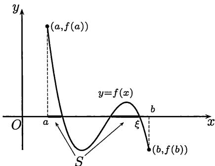

import Guide from '@/components/Guide.astro';
import Knowledge from '@/components/Knowledge.astro';
import Example from '@/components/Example.astro';
import Solution from '@/components/Solution.astro';
import Note from '@/components/Note.astro';
import Block from '@/components/Block.astro';
import Method from '@/components/Method.astro';

这两个定理有密切的关系。从内容上看，后者包含了前者。但实际上前一个定理是核心，由它出发用一个辅助函数就可以推出后一个定理。由于 $f$ 的零点就是方程 $f(x) = 0$ 的根，因此也经常将零点存在定理称为根的存在定理：

<Knowledge title="命题 $5.2.1$（零点存在定理）">
设 $f \in C[a, b]$ ，并满足条件 $f(a)f(b) < 0$ ，则存在点 $\xi \in (a, b)$ 使得 $f(\xi) = 0$ 。

<Note>
由于定理的内容有明显的几何意义 (参见图 $5.1$), 非常直观, 因此很早就被我国古代数学家用来求方程的近似根 (见 $[35]$ )。但实际上它和实数理论密切相关。例如, 在有理数范围内函数 $f(x) = x^2 - 2$ 在区间 $[0,2]$ 上满足定理的条件, 但是没有零点。由此可见, 下面的证明必然要利用实数系的这个或那个基本定理。
</Note>
</Knowledge>

## $5.2.1$ 定理的证明

关于零点存在定理的证明在数学分析的教科书中都有, 原则上从实数系的每一个基本定理 (包括与它们等价的每一个命题) 出发都可以证明它。以下用例题的形式举出几个证明。它们是学习实数系基本定理的好材料。

<Example title="例题 $5.2.1$">
用闭区间套定理和 $Bolzano$ 二分法证明零点存在定理。

<Solution title="证明">
记 $a = a_{1}, b = b_{1}$ 。用区间的中点 $c_{1} = (a_{1} + b_{1}) / 2$ 从 $[a_{1}, b_{1}]$ 得到两个闭子区间 $[a_{1}, c_{1}]$ 和 $[c_{1}, b_{1}]$ 。考虑 $f(c_{1})$ 的符号。如果恰好有 $f(c_{1}) = 0$ , 则 $c_{1}$ 就是 $f$ 的零点, 讨论结束。否则, 由于 $f(a_{1})$ 和 $f(b_{1})$ 异号, 其中一定有一个值的符号和 $f(c_{1})$ 的符号相反。因此在两个闭子区间中必有一个闭子区间, 在它的两端 $f$ 的值异号。将这个闭子区间记为 $[a_{2}, b_{2}]$ , 这时满足条件 $f(a_{2}) f(b_{2}) < 0$ 。

用数学归纳法可以证明, 或者在有限次运用二分法后已经找到了 $f$ 的一个零点, 或者以上过程可以无限地做下去, 得到一个闭区间套 $\{[a_n, b_n]\}$ 。由于这个闭区间套是根据以上过程归纳地构造出来的, 因此它具有以下特点:

$$
(1) b _ {n + 1} - a _ {n + 1} = (b _ {n} - a _ {n}) / 2; \quad (2) f (a _ {n}) f (b _ {n}) <   0, \forall n \in \mathbf {N} _ {+}.
$$

对这个 $\{[a_n, b_n]\}$ 应用闭区间套定理, 就知道存在一个点 $\xi$ , 使得

$$
\lim _ {n \to \infty} a _ {n} = \lim _ {n \to \infty} b _ {n} = \xi .
$$

考虑 $f(\xi)$ 的符号。如果 $f(\xi) \neq 0$ , 则从连续函数的局部保号性定理, 就有 $\xi$ 的一个邻域 $O(\xi)$ , 使得 $f$ 在邻域 $O(\xi)$ 上同号。但当 $n$ 充分大时, $a_{n}$ 和 $b_{n}$ 将同时进入这个邻域, 从而保号性与 $f(a_{n})f(b_{n}) < 0$ 矛盾。因此只能有 $f(\xi) = 0$ 。
</Solution>

<Note title="注 $1$">
这个证明是闭区间套定理的典型应用。如在第三章中所说, 闭区间套定理可以将原来的闭区间的某种性质“凝聚”到某一个点的附近。在上面正是这样做的。通过 $Bolzano$ 二分法, 函数 $f$ 在区间 $[a, b]$ 两端异号这个性质导致函数 $f$ 在每个区间 $[a_n, b_n]$ 的两端异号, 而且将这个性质“凝聚”到一个点 $\xi$ 的任意邻近。从而如 $f(\xi) \neq 0$ 的话, 就与连续函数的局部保号性矛盾。
</Note>

<Note title="注 $2$">
这个证明方法有一个优点, 即可以用于求近似解。 (我们将这类证明方法称为构造性的证明。) 例如, 设 $f$ 在区间 $[0,1]$ 上连续, $f(0)f(1) < 0$ , 且只有一个根 $\xi$ 。用以上二分法做 $9$ 次, 得到 $[a_{10}, b_{10}]$ 。取这个区间的中点 $c$ 为近似值, 则误差可估计为

$$
\left| c - \xi \right| <   2 ^ {- 1 0} \approx 0. 0 0 1.
$$

当然, 这个方法相当原始, 计算效率也低。较好的求根方法见 $\S 8.7$ 。
</Note>
</Example>

在第三章中曾指出, 在上述注解 $1$ 的意义上, 覆盖定理具有与闭区间套定理相反的特点, 即可以从局部性质推出整体性质。根据具体问题的特点, 可以事先看出应当采取什么思路。由于条件是非局部的, 而所要证明的结论, 即在一个点上函数值为 $0$, 是局部的, 这与覆盖定理的方向相反。由此可见, 若用覆盖定理证明零点存在定理的话, 就应当用反证法。

<Example title="例题 $5.2.2$">
用覆盖定理证明零点存在定理。

<Solution title="证明">
用反证法。设连续函数 $f$ 在区间 $[a, b]$ 两端有 $f(a)f(b) < 0$ , 但在区间中无零点。任取一点 $x_0 \in [a, b]$ , 因为 $f(x_0) \neq 0$ , 从连续函数的局部保号性定理, 存在 $\delta > 0$ , 使得函数 $f$ 在邻域 $O_{\delta}(x_0) \cap [a, b]$ 上保号。对区间 $[a, b]$ 中的每一个点都这样做, 就得到区间 $[a, b]$ 的一个开覆盖。在这个开覆盖中的每一个开区间 (和区间 $[a, b]$ 的交集) 上, 函数 $f$ 保号。

若现在直接用覆盖定理, 则不容易说清楚如何引出与条件 $f(a)f(b) < 0$ 的矛盾 (请读者试试看)。改用加强形式的覆盖定理 (即第三章例题 $3.5.3$), 存在 $Lebesgue$ 数 $\delta > 0$ , 使得对 $[a, b]$ 中的任何两点 $x', x''$ , 只要 $|x' - x''| < \delta$ , 就有开覆盖中的某一个开区间将这两个点 $x', x''$ 覆盖住。对本题的开覆盖来说, 即保证了当 $|x' - x''| < \delta$ 时, $f(x')$ 和 $f(x'')$ 同号, 即 $f(x')f(x'') > 0$ 。

用这个 $Lebesgue$ 数 $\delta$ 在区间 $[a,b]$ 中插入一系列点，连同端点一起，记为

$$
a = x _ {0} <   x _ {1} <   x _ {2} <   \dots <   x _ {n} = b,
$$

使得 $\left|x_{i}-x_{i-1}\right|<\delta,i\in\{1,2,\cdots,n\}$ 。由于 $f(x_{i-1})f(x_{i})>0,i\in\{1,2,\cdots,n\}$ ，可见 $f(a)f(b)>0$ 。引出矛盾。
</Solution>

<Note>
与用闭区间套定理的证明比较, 可见这个证明不是构造性的。它断定了根的存在, 但并未提供方法去求这个根。这种证明称为非构造性证明, 或纯粹存在性证明。在过去已遇到过很多这类证明。例如用反证法的证明都是如此。
</Note>
</Example>

<Example title="例题 $5.2.3$">
用确界存在定理和 $Lebesgue$ 方法证明零点存在定理。

<Solution title="证明">
（请参考关于 $Lebesgue$ 方法的例题 $3.5.2$ 和例题 $3.7.1$ 的证 $6$。）为确定起见，设 $f(a) > 0, f(b) < 0$ 。定义数集

$$
S = \{x \in [ a, b ] \mid f (x) \geqslant 0 \}. \tag{5.2}
$$

从 $f(a) > 0$ 知 $a \in S$ , 所以 $S$ 为非空有界数集。用确界存在定理, 记 $\xi$ 为 $S$ 的上确界。由于 $f(b) < 0$ , 我们知道 $f$ 在 $b$ 附近也取负值 (局部保号性), 因此成立

$$
\xi = \sup S <   b.
$$

我们断言： $f(\xi)=0$ 。

由于实数只有三种可能, 即大于 $0$, 等于 $0$ 和小于 $0$ (即实数的三歧性), 因此只要证明 $f(\xi) > 0$ 和 $f(\xi) < 0$ 都不可能。

如 $f(\xi) > 0$ , 则 $\xi \in S$ 。由于 $\xi < b$ 和连续函数的局部保号性, $f$ 在点 $\xi$ 的右侧邻近也取正值。这与 $\xi$ 是数集 $S$ 的上界相矛盾。

如 $f(\xi) < 0$ , 则同理知道 $f$ 在点 $\xi$ 左侧邻近也取负值。这与 $\xi$ 是数集 $S$ 的最小上界矛盾。
</Solution>

<Note>
这个证明也没有能够提供具体的求根方法, 但从方法上看并不抽象, 倒是有很直观的几何意义。如右边的图 $5.1$ 所示, 函数 $y = f(x)$ 在 $[a, b]$ 内有三个零点。由公式 $(5.2)$ 定义的数集 $S$ 在图上由两个粗黑线段表示。数集 $S$ 的上确界 $\xi$ 就是 $f(x)$ 的最大的零点。

  
图 $5.1$
</Note>
</Example>

现在给出介值定理和它的证明。这个定理的表达方式可有多种。如果将各种区间 (包括有界区间、无限区间、开区间、闭区间以及半开半闭区间等) 的共同点抽出来, 则可以将介值定理表达如下:

<Knowledge title="命题 $5.2.2$ (介值定理)">
区间上的连续函数的值域必是区间 (可缩为一点)。

<Solution title="证明">
设 $f \in C(I)$ , 其中 $I$ 为区间。为了证明 $f(I)$ 是区间, 只要证明: 若有 $x', x'' \in I$ , 且 $f(x') \neq f(x'')$ , 则函数 $f$ 能取到在 $f(x')$ 和 $f(x'')$ 之间的每一个值。

为确定起见, 只写出 $x' < x''$ , $f(x') < c < f(x'')$ 时的证明。我们要证明, 存在点 $\eta \in (x', x'') \subset I$ , 使得 $f(\eta) = c$ 。

为此作辅助函数

$$
F (x) = f (x) - c.
$$

这时有

$$
F (x ^ {\prime}) F (x ^ {\prime \prime}) = (f (x ^ {\prime}) - c) (f (x ^ {\prime \prime}) - c) <   0.
$$

在闭区间 $[x', x'']$ 上对函数 $F(x)$ 应用连续函数的零点存在定理, 就知道存在点 $\eta \in (x', x'')$ , 使得 $F(\eta) = 0$ 。这就是 $f(\eta) = c$ 。
</Solution>

<Note title="注 $1$">
介值定理的常见形式为: 若 $f \in C[a, b]$ , $a \leqslant x_1 < x_2 \leqslant b$ , 且 $f(x_1) \neq f(x_2)$ , 则 $f$ 可取到在 $f(x_1)$ 和 $f(x_2)$ 之间的每个值。 我们将此称为介值性质。

<Block title="思考题">
举例说明: 区间上的函数即使处处不连续, 也可以具有介值性质。
</Block>
</Note>

<Note title="注 $2$">
介值定理只肯定在所说的条件下值域是区间, 未说是什么区间。在下一节会知道在闭区间上的连续函数的值域一定是闭区间。但若定义域是其他类型的区间, 包括无限区间, 则连续函数的值域可以是所有可能的各种区间。
</Note>
</Knowledge>

## $5.2.2$ 例题

<Example title="例题 $5.2.4$">
设 $f \in C[a, b]$ , 且有 $f([a, b]) \subset [a, b]$ 。证明: 存在 $\xi \in [a, b]$ , 使得 $f(\xi) = \xi$ (即 $f$ 在区间 $[a, b]$ 中有不动点)。

<Solution title="证明">
引入辅助函数 $F(x) = f(x) - x$ 。从条件 $f([a,b]) \subset [a,b]$ 可以得到

$$
F (a) = f (a) - a \geqslant 0, \quad F (b) = f (b) - b \leqslant 0,
$$

因此 $F(a)F(b)\leqslant 0$ ，如果此式等于零，则 $f$ 以 $a$ 或 $b$ 为不动点．否则，对函数 $F$ 应用连续函数的零点存在定理，知道 $f$ 在 $(a,b)$ 中有不动点。
</Solution>

<Note>
这个例题是著名的 $Brouwer$ (布劳威尔) 不动点定理的特例。$Brouwer$ 不动点定理是说, 从 $n$ 维空间的球

$$
D ^ {n} = \left\{\boldsymbol {x} \in \mathbf {R} ^ {n} \mid x _ {1} ^ {2} + x _ {2} ^ {2} + \dots + x _ {n} ^ {2} \leqslant 1 \right\}
$$

到自身的连续映射必有不动点。在数轴上的闭区间就是一维的球。关于 $Brouwer$ 不动点定理的一个简洁而漂亮的证明见 $[40]$。
</Note>
</Example>

<Example title="例题 $5.2.5$">
若 $f\in C[a,b]$ ，且对每一个 $x\in [a,b]$ 存在 $y\in [a,b]$ ，使得 $|f(y)|\leqslant \frac{1}{2} |f(x)|$ ，证明： $f$ 在 $[a,b]$ 中有零点。

<Solution title="证明">
任取一点 $x_0 \in [a, b]$ , 则存在 $x_1 \in [a, b]$ , 使 $|f(x_1)| \leqslant \frac{1}{2} |f(x_0)|$ 。这样继续下去, 就可以归纳地得到一个数列 $\{x_n\}$ , 使得成立

$$
| f (x _ {n}) | \leqslant \frac {1}{2} | f (x _ {n - 1}) | \leqslant \dots \leqslant \frac {1}{2 ^ {n}} | f (x _ {0}) |.
$$

因此有 $\lim_{n\to \infty}f(x_n) = 0$ ，即数列 $\{f(x_n)\}$ 为无穷小量。

对数列 $\{x_{n}\}$ 用凝聚定理, 存在收敛子列 $\{x_{n_k}\}$ 。设极限为

$$
\lim _ {k \to \infty} x _ {n _ {k}} = \eta ,
$$

则有 $\eta \in [a,b]$ 。由于 $f$ 在 $\eta$ 连续, 就有

$$
\lim _ {k \rightarrow \infty} f (x _ {n _ {k}}) = f (\eta).
$$

由于 $\{f(x_{n_k})\}$ 是 $\{f(x_n)\}$ 的子列, 因此 $f(\eta) = 0$ 。
</Solution>

<Note>
在构造数列 $\{x_{n}\}$ 时, 有可能某个 $x_{n}$ 恰好是 $f$ 的零点。这时当然可以不必做下去。但上面写出的证明即使对这种特殊情况仍然是正确的。
</Note>
</Example>

## $5.2.3$ 练习题

1. 设 $f \in C[a, b]$ , $a \leqslant x_1 < x_2 < \cdots < x_n \leqslant b$ , 证明: 存在 $\xi \in [x_1, x_n]$ , 使成立

   $$
   f (\xi) = \frac {f (x _ {1}) + f (x _ {2}) + \cdots + f (x _ {n})}{n}.
   $$

2. 设 $f$ 是定义在一个圆周上的连续函数。证明: 存在一条直径, 使得 $f$ 在其两端取相同的值。 (试给出在圆周上的函数的连续性定义。)

3. 若余弦多项式 $C_n(x) = \sum_{k=0}^{n} a_k \cos kx$ 的系数满足条件 $\sum_{k=1}^{n-1} |a_k| < a_n$ ，证明： $C_n(x)$ 在区间 $[0, 2\pi)$ 中至少有 $2n$ 个零点。

4. 设 $a_1, a_2, a_3 > 0$ , 且 $b_1 < b_2 < b_3$ 。证明: 方程

   $$
   \frac {a _ {1}}{x - b _ {1}} + \frac {a _ {2}}{x - b _ {2}} + \frac {a _ {3}}{x - b _ {3}} = 0
   $$

   在区间 $(b_{1}, b_{2})$ 和 $(b_{2}, b_{3})$ 内恰好各有一个根。

5. 证明:

   (1) 奇数次多项式方程 $f(x)=x^{2n+1}+a_{1}x^{2n}+\cdots+a_{2n}x+a_{2n+1}=0$ 至少有一个实根;

   (2) 偶数次多项式方程 $f(x)=x^{2n}+a_{1}x^{2n-1}+\cdots+a_{2n-1}x+a_{2n}=0$ 可以没有实根, 但当 $a_{2n}<0$ 时则至少有两个实根。

6. 证明: $x^{17} + 215 / (1 + \cos^2 3x) = 18$ 必有实根。

7. 若 $f \in C[a, b]$ , 且 $f(x)$ 只取有理数。问: $f$ 有何特点?

8. 设 $f \in C[a, b]$ , 且为一对一映射。证明:

   (1) 若 $f(a) < f(b)$ , 则 $f$ 严格单调增加;

   (2) 若 $f(a) > f(b)$ , 则 $f$ 严格单调减少。

9. 设 $f \in C(-\infty, +\infty)$ ，且有 $f(-\infty) = A < B = f(+\infty)$ ，证明：对每个 $c \in (A, B)$ ，存在 $\xi$ ，使得 $f(\xi) = c$ 。

10. 设 $f \in C[a, b)$ , 数列 $\{x_{n}\}, \{y_{n}\} \subset [a, b)$ , 已知

    $$
    \lim _ {n \to \infty} x _ {n} = b, \lim _ {n \to \infty} y _ {n} = b, \lim _ {n \to \infty} f (x _ {n}) = A, \lim _ {n \to \infty} f (y _ {n}) = B,
    $$

    但 $A \neq B$ 。证明: 对每一个 $\eta \in (A, B)$ , 存在数列 $\{z_n\} \subset [a, b)$ , 满足要求

    $$
    \lim _ {n \to \infty} z _ {n} = b, \lim _ {n \to \infty} f (z _ {n}) = \eta .
    $$
