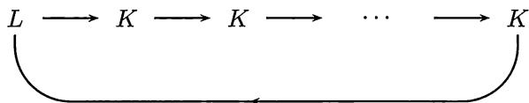
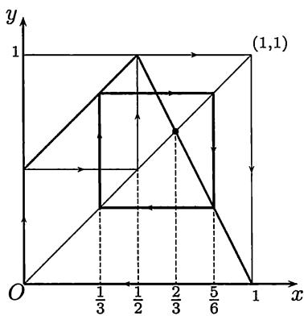

import Guide from '@/components/Guide.astro';
import Knowledge from '@/components/Knowledge.astro';
import Example from '@/components/Example.astro';
import Solution from '@/components/Solution.astro';
import Note from '@/components/Note.astro';
import Block from '@/components/Block.astro';
import Method from '@/components/Method.astro';

本节的标题取自论文 [$34$] 的题目 “Period three implies chaos”. 在本节中我们将介绍该文并证明其中的第一定理, 这样做有几个理由:

1. 该论文发表在《美国数学月刊》上, 该杂志拥有广大读者, 包括高等学校的教师和学生. 阅读该论文所需要的数学分析知识只限于本章的连续函数.

2. 该文在混沌发展的历史上起了极为重要的作用。从此以后，混沌不再只是一个普通名词，而是有确切数学内容的一个科学名词了。

3. 该文的内容是在迭代生成数列方面的新发现, 因此和本书中已经多次介绍的内容 ( $\S2.6$ 和 $3.4.4$ 小节) 有直接的关系.

4. 由该文的第二定理产生了混沌的第一个数学定义, 即 $Li$-$Yorke$ (李-约克) 定义. 我们虽然不给出第二定理的证明, 但读者还是可以由此对混沌有一个了解, 因为其中的关键概念恰恰就是 §$3.6$ 中的上、下极限.

在数学分析教科书 [$8$] 中已经将与本节大体相当的内容收入教材, 作为函数的连续性一章的最后一节. 在同年出版的数学分析参考书 [$66$] 中收入了更多的材料. $Li$-$Yorke$ 原论文 [$34$] 的译文和该文的第一作者李天岩关于发现经过的一篇短文可以在《数学译林》(1989) 第 $3$ 期中找到.

## $5.6.1$ 动力系统的基本概念

现在很多论著中所说的动力系统是一个比较模糊的名词, 实际上只要系统的状态随时间而变化, 我们就可以说它是一个动力系统. 但是这样一来, 所有以时间为自变量的常微分方程, 以及在自变量中有一个是时间的偏微分方程的理论都可以说成是动力系统的理论了. 实际上在数学的学科分类中, 微分方程仍保持不变, 包含传统的稳定性理论、定性理论和解的存在性、唯一性等内容, 而动力系统中研究的对象则主要是在 $20$ 世纪六七十年代之后形成的, 混沌就是其中占有突出地位的一部分.

关于混沌这门学科的诞生及其概况可以看 [$16$], 这是一本普及读物. 它的作者是纽约时报的记者, 他访问了开创混沌研究的许多科学家, 然后用完全通俗的语言写成此书.

这里我们主要介绍由迭代而生成的离散动力系统, 它的一般形式就是在前面已出现多次的递推公式

$$
x _ {n + 1} = f (x _ {n}), n \in \mathbf {N} _ {+},
$$

在动力系统理论中称之为一维迭代动力系统 (或一维离散动力系统).

先讲动力系统中的几个名词．从初值 $x_0$ 出发由迭代生成一个数列 $\{x_n\}_{n\geqslant 0}$ 称为由初值 $x_0$ 确定的轨道．在轨道中占有特殊地位的是不动点和周期轨.

如果 $x_{1} = f(x_{0}) = x_{0}$ ，则对所有 $n\geqslant 0$ 有 $x_{n + 1} = x_n$ .这时称点 $x_0$ ，也就是由它确定的轨道，为系统的不动点．这个概念在前面已多次出现.

如果对某一轨道 $\{x_{n}\}$ 存在正整数 $p$ , 使 $x_{n+p} = x_{n}$ 对一切 $n \geqslant 0$ 成立, 就称这个轨道是以 $p$ 为周期的周期轨. 周期轨中的点称为周期点. 显然, 不动点就是周期为 $1$ 的周期轨. 对周期轨来说, 具有以上性质的最小 $p$ 称为轨的最小周期. 实际上在第二章的第二组参考题 $18$ 和 $19$ 中都出现了周期 $2$ 轨.

我们知道, 从函数 $y = f(x)$ 的几何图像就可以直接看到不动点. 实际上也不难从几何上看出是否有周期 $2$ 轨 (请读者考虑如何看出). 但要从几何上发现是否有周期大于 $2$ 的周期轨则并非易事.

<Note>
注 在这里读者可以发现, 虽然迭代动力系统的外表形式与第二章中迭代生成数列的递推公式并无区别, 但实际上所研究的对象已大不相同. 在 §$2.6$ 以及后来的 $3.4.4$ 小节中介绍压缩映射原理时所关心的主要问题就是所得到的数列是否收敛, 若收敛则极限是什么. 而从以上的简单介绍中可以看到, 我们已经将周期轨 (和周期点) 作为更一般的研究对象了. 还应指出, 迭代动力系统的主要研究内容是比周期轨复杂得多的混沌现象. 这在下面讲了混沌的 $Li$-$Yorke$ 定义后就会明白.
</Note>

## $5.6.2$ $Li$-$Yorke$ 的两个定理

在李天岩和 $Yorke$ 的论文 [$34$] 中主要有两个定理.我们先介绍第一个.

<Knowledge title="命题 $5.6.1$ ($Li$-$Yorke$ 第一定理)">
设 $I$ 为区间, 函数 $f \in C(I)$ , 且有 $f(I) \subset I$ . 设有点 $a, b, c, d$ 属于区间 $I$, 满足条件

$$
f (a) = b, f (b) = c, f (c) = d, \quad d \leqslant a <   b <   c (\text {或} d \geqslant a > b > c),
$$

则 $f$ 有最小周期为每个正整数的所有周期轨.
</Knowledge>

现在我们来证明这个命题. 为此先要做一些准备工作, 证明几个引理. 其中前两个引理恰好是关于连续函数基本性质的练习题.

<Example title="例题 $5.6.1$ (引理 $1$)">
设 $I$ 为有界闭区间, $f \in C(I)$ . 如果有 $f(I) \supset I$ , 则 $f$ 在 $I$ 中有不动点.

<Solution title="证明">
记 $I = [a, b], f(I) = [c, d]$ , 由闭区间上连续函数的值域定理知道 $f(I)$ 也是有界闭区间, 即有 $c \leqslant a < b \leqslant d$ . 由连续函数的介值定理, 存在 $\xi, \eta \in [a, b]$ , 使得 $f(\xi) = a, f(\eta) = b$ . 不妨设 $\xi < \eta$ . 构造辅助函数

$$
F (x) = f (x) - x,
$$

$F$ 的零点即 $f$ 的不动点, 则有

$$
F (\xi) = f (\xi) - \xi = a - \xi \leqslant 0, F (\eta) = f (\eta) - \eta = b - \eta \geqslant 0.
$$

因此知道

$$
F (\xi) F (\eta) \leqslant 0.
$$

若 $\xi$ 或 $\eta$ 不是 $F$ 的零点, 则由零点存在定理可知在 $(\xi, \eta) \subset [a, b]$ 中有 $F$ 的零点, 即 $f$ 的不动点.
</Solution>

<Note>
注 与此题类似的是经典性的例题 $5.2.4$, 注意它们的证明相似而不相同.
</Note>
</Example>

<Example title="例题 $5.6.2$ (引理 $2$)">
设 $I, J$ 是两个有界闭区间, $f \in C(I)$ . 如果有 $f(I) \supset J$ , 则在 $I$ 中存在一个闭子区间 $I'$ , 使得 $f(I') = J$ .

<Solution title="证明">
设 $I = [a, b], J = [c, d]$ . 由于 $f([a, b]) \supset [c, d]$ , 由介值定理知道有 $\xi, \eta \in [a, b]$ , 使得 $f(\xi) = c, f(\eta) = d$ .

先考虑 $\xi < \eta$ 的情况. 定义

$$
\begin{array}{l} u = \sup \{s \mid f (s) = c,   \xi \leqslant s <   \eta \}, \\ v = \inf \{t \mid f (t) = d, u <   t \leqslant \eta \}. \end{array}
$$

我们断言: $f(u) = c, f(v) = d$ . 实际上, $u$ 是数集 $A = \{s \mid f(s) = c, \xi \leqslant s < \eta\}$ 的上确界. 如有 $u \in A$ , 则当然 $f(u) = c$ . 否则, 至少在集合 $A$ 中存在数列收敛于 $u$ (参见例题 $3.1.3$), 由 $f$ 的连续性可知有 $f(u) = c$ . 同理有 $f(v) = d$ .

由 $u, v$ 的定义可见 $u < v$ , 而且在 $(u, v)$ 中函数值 $f(x)$ 不可能取到 $c$ 和 $d$ , 从而一定有 $f((u, v)) \subset (c, d)$ . 这样就得到

$$
f ([ u, v ]) = [ c, d ] = J,
$$

因此 $I' = [u, v]$ 即为所求. 对于 $\xi > \eta$ 的讨论是类似的.
</Solution>
</Example>

第三个引理是引理 $2$ 的进一步发展, 而且和引理 $1$ 结合起来了. 但是在这里要引进在迭代动力系统研究中使用的一个特定记号, 这个新记号就是将复合函数 $f(f(x))$ 简记为 $f^2(x)$ , 将 $f(f(f(x)))$ 简记为 $f^3(x), \cdots$ , 一般地记

$$
f ^ {n} (x) = \underbrace {f (f (\cdots f (x) \cdots))} _ {n {\text {重}}} = (\underbrace {f \circ f \circ \cdots \circ f} _ {n {\text {个}}}) (x).\tag{5.6}
$$

<Example title="例题 $5.6.3$ (引理 $3$)">
设 $f$ 是在有界闭区间 $I_{0}, I_{1}, \cdots, I_{n-1}$ 上有定义的连续函数, 满足条件

$$
f (I _ {0}) \supset I _ {1}, f (I _ {1}) \supset I _ {2}, \dots , f (I _ {n - 2}) \supset I _ {n - 1}, f (I _ {n - 1}) \supset I _ {0},
$$

则存在点 $x_{0} \in I_{0}$ ，使得 $f^{n}(x_{0}) = x_{0}$ ，且满足 $f^{i}(x_{0}) \in I_{i}, i = 1, \cdots, n - 1$ .

<Solution title="证明">
应用引理 $2$ 于 $f(I_0) \supset I_1$ ，知道存在闭区间 $I_0^1 \subset I_0$ ，使得 $f(I_0^1) = I_1$ .

从条件 $f(I_1) \supset I_2$ , 又有 $f^2(I_0^1) \supset I_2$ : 再次用引理 $2$ 于区间 $I_0^1$ 上的函数 $f^2$ , 有闭区间 $I_0^2 \subset I_0^1 \subset I_0$ , 使得 $f^2(I_0^2) = I_2$ . 于是有

$$
f (I _ {0} ^ {2}) \subset I _ {1}, f ^ {2} (I _ {0} ^ {2}) = I _ {2}.
$$

这样进行下去就得到 $I_0^{n - 1}\subset I_0$ ，使得

$$
f (I _ {0} ^ {n - 1}) \subset I _ {1}, f ^ {2} (I _ {0} ^ {n - 1}) \subset I _ {2}, \dots , f ^ {n - 2} (I _ {0} ^ {n - 1}) \subset I _ {n - 2}, f ^ {n - 1} (I _ {0} ^ {n - 1}) = I _ {n - 1}.\tag{5.7}
$$

用最后一个条件 $f(I_{n - 1})\supset I_0$ ，有 $f^n (I_0^{n - 1})\supset I_0\supset I_0^{n - 1}$ .对于区间 $I_0^{n - 1}$ 上的 $f^n$ 应用引理 $1$,知道存在 $f^n$ 的不动点 $x_0\in I_0^{n - 1}\subset I_0$ ，使得 $f^n (x_0) = x_0$

同时由 $(5.7)$, 可见 $f(x_0) \in I_1, f^2(x_0) \in I_2, \cdots, f^{n-1}(x_0) \in I_{n-1}$ .
</Solution>
</Example>

<Knowledge title="命题 $5.6.1$ ($Li$-$Yorke$ 第一定理) 的证明">
<Solution title="证明">
定义区间 $L = [a, b], K = [b, c]$ , 则从定理的主要条件

$$
f (a) = b, f (b) = c, f (c) = d, \quad d \leqslant a <   b <   c (\text {或} d \geqslant a > b > c),
$$

可以看出有

$$
f (L) \supset K, f (K) \supset L, f (K) \supset K.
$$

现在对每个正整数 $n$ , 寻找最小周期为 $n$ 的周期点. 分以下几种情况分别讨论.

(i) $n = 1$ . 从 $f(K) \supset K$ 和引理 $1$ 即得.

(ii) $n = 2$ . 从 $f(L) \supset K$ , $f(K) \supset L$ 和引理 $3$ 知, 存在点 $x_0 \in L$ , 满足 $f(x_0) \in K$ 和 $f^2(x_0) = x_0$ . 如果点 $x_0$ 的最小周期不是 $2$, 则 $x_0$ 就是 $f$ 的不动点, 即 $x_0 = f(x_0)$ . 由于 $x_0 \in L$ 和 $f(x_0) \in K$ , 而 $L \cap K = \{b\}$ , 因此只能是 $x_0 = b$ . 但已知 $f(b) = c > b$ , $b$ 不会是不动点, 引出矛盾.

(iii) $n \geqslant 3$ . 令 $I_{0} = L, I_{1} = I_{2} = \cdots = I_{n-1} = K$ , 这样就如图 $5.3$ 所示构成了一个圈. 图中所用的记号 $I \longrightarrow J$ 表示 $f(I) \supset J$ . 从 $f(L) \supset K, f(K) \supset K$ 和 $f(K) \supset L$ 可见这个圈是成立的, 也就是说引理 $3$ 的条件满足.

  
图$5.3$

对于所取的 $n$ 个区间应用引理 $3$, 知道存在点 $x_0 \in L$ , 满足

$$
f ^ {n} (x _ {0}) = x _ {0}, f ^ {i} (x _ {0}) \in K, i = 1, \dots , n - 1.\tag{5.8}
$$

若 $n$ 不是点 $x_0$ 的最小周期, 则有 $p$ , $1 \leqslant p < n$ , 使得 $f^p(x_0) = x_0$ . 由于这时 $f^p(x_0) \in K$ , 而 $x_0 \in L$ , 因此与 (ii) 一样, 只能有 $x_0 = b$ . 但从条件 $n \geqslant 3$ 和 $f^2(x_0) = f^2(b) = f(f(b)) = f(c) = d \leqslant a$ 可见 $f^2(x_0) \notin K$ , 与 $(5.8)$ 相矛盾. $\square$
</Solution>
</Knowledge>

<Example title="例题 $5.6.4$">
在区间 $[0,1]$ 上定义分段线性函数 (其图像在图 $5.4$ 上用粗黑的折线表示):

$$
f (x) = \left\{ \begin{array}{l l} x + \frac {1}{2}, & 0 \leqslant x \leqslant \frac {1}{2}, \\ 2 (1 - x), & \frac {1}{2} <   x \leqslant 1, \end{array} \right.
$$

则 $f$ 对一切 $n \in \mathbf{N}_{+}$ 存在以 $n$ 为最小周期的周期轨.

<Solution title="证明">
取 $a = 0, b = \frac{1}{2}, c = 1$ ，则有 $f(0) = \frac{1}{2}, f\left(\frac{1}{2}\right) = 1, f(1) = 0.$ 因此从 $Li$-$Yorke$ 第一定理知道结论成立.
</Solution>

<Note>
注 从图 $5.4$ 可以清楚地看出, 其中有周期 $3$ 轨 $\left\{0, \frac{1}{2}, 1\right\}$ , 还有不动点 $\frac{2}{3}$ 和由 $\left\{\frac{1}{3}, \frac{5}{6}\right\}$ 组成的周期 $2$ 轨, 其中周期 $2$ 轨还特地用粗黑线的方框标出. 图 $5.4$ 中的箭头是按照第二章 §$2.6$ 中介绍的蛛网工作法作出的. 由于命题 $5.6.1$, 在这样简单地由两段直线组成的图像上还存在无穷多个其周期取到一切正整数的周期轨, 这完全超出了几何上的直观想像. 在 [$34$] 发表之前很少有人能想到如此简单的函数会有如此奇妙的可能性.
</Note>

  
图$5.4$
</Example>

现在介绍 [$34$] 中的第二个定理. 虽然我们在这里并不证明, 但了解一下它的内容也是很有意义的. 这里的主要预备知识就是在第三章中的上、下极限.

<Knowledge title="命题 $5.6.2$ ($Li$-$Yorke$ 第二定理)">
在与命题 $5.6.1$ 相同的条件下，在区间 $I$ 中存在一个不可列集 $S$ ，使得以 $S$ 中的任何两点 $x, y (x \neq y)$ 为初值的迭代生成数列 $\{f^n(x)\}$ 和 $\{f^n(y)\}$ 具有以下三个性质：

$$
\varlimsup_ {n \to \infty} | f ^ {n} (x) - f ^ {n} (y) | > 0,
$$

$$
\varliminf_ {n \to \infty} | f ^ {n} (x) - f ^ {n} (y) | = 0,
$$

$$
\varlimsup_ {n \to \infty} | f ^ {n} (x) - f ^ {n} (p) | > 0,
$$

其中 $p$ 是 $f$ 的任何一个周期点.
</Knowledge>

根据我们对上、下极限的理解, 可以看出, 由 $S$ 中任意两点出发的两个轨道 (就是两个迭代生成数列) 既会无限靠近, 但又总会分离开. 这样复杂的性态超出了过去的认识. 因此就产生出 $Li$-$Yorke$ 混沌的定义.

<Knowledge title="定义 (Li-Yorke 混沌)">
设 $f$ 在区间 $I$ 上有定义, 且有 $f(I) \subset I$ . 如果满足以下条件:

(1) $f$ 的周期点的最小周期无上界;

(2) 存在 $I$ 的不可列子集 $S$ , 对于 $S$ 中的任意两点 $x, y, x \neq y$ , 均有

$$
\text {(i)} \varlimsup_ {n \to \infty} | f ^ {n} (x) - f ^ {n} (y) | > 0, \quad \text {(ii)} \varliminf_ {n \to \infty} | f ^ {n} (x) - f ^ {n} (y) | = 0,
$$

则称由 $f$ 迭代生成的动力系统为混沌.
</Knowledge>

应当指出, 混沌在数学上目前存在各种不同的定义. 而上述的 $Li$-$Yorke$ 定义是在数学上第一个可操作的混沌定义. 对混沌有兴趣的读者可以从 [$21, 34, 38, 39$] 中得到比这里丰富得多的材料.
