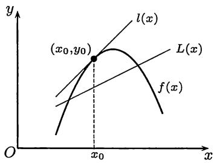
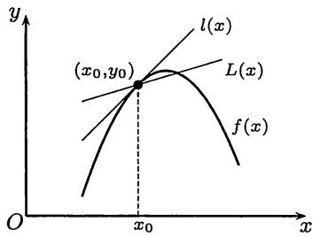
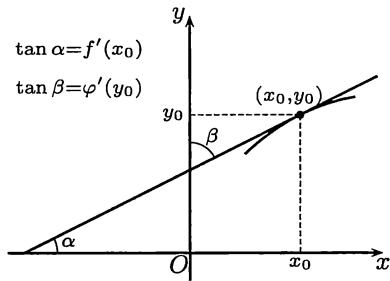
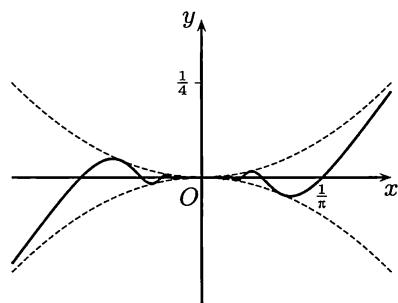

import Guide from '@/components/Guide.astro';
import Knowledge from '@/components/Knowledge.astro';
import Example from '@/components/Example.astro';
import Solution from '@/components/Solution.astro';
import Note from '@/components/Note.astro';
import Block from '@/components/Block.astro';
import Method from '@/components/Method.astro';

## 6.1.1 内容提要

## 这里的要点为

1. 导数就是变量的变化率. 它在几何上来源于如何定义一般曲线的切线, 而在运动学上则与中学物理中的瞬时速度的定义方式完全相同.

2. 从导数的定义可以看出, 计算导数就是要求 $\frac{0}{0}$ 型的不定式的函数极限. 这也就是在学习微分学之前先要学习极限理论的理由之一. §4.3 的两个重要极限以及许多例题都与此直接相关.

3. 函数在某一个点是否可导, 只与该函数在这点附近的性态有关. 因此与函数的极限和连续性类似, 函数的可导性是一种局部性概念.

4. 函数在一点可导, 则一定在该点连续. 反之未必成立.

5. 除了导数的几何意义之外, 还要知道单侧导数的几何意义, 以及在某一点的导数或单侧导数为无穷大时的几何意义.

6. 导函数的概念. 这直接导致高阶导数的概念.

7. 导数的计算. 初等函数的导函数仍是初等函数. 这里的计算可以用求导公式按部就班地进行. 对于分段定义的函数, 在特殊点上要从导数定义出发直接计算.

8. 复合函数求导的链式法则是导数计算中的基本工具.

9. 对隐函数和用参数方程定义的函数的导数计算所涉及的理论问题将在以后学习, 本章着重于学习用求导法则进行计算.

初等函数的求导公式在数学分析的教科书中都有, 本书不再重复. 请初学者注意: 求导数是数学分析中最基本的一项计算, 而这必须通过做教科书中的大量导数计算题才能学会. 否则连基本公式都记不住, 还有什么技能可谈.

## 6.1.2 思考题

1. 设 $f\in C(a,b)$ , 又在点 $x_0\in (a,b)$ 处可导. 在 $x\neq x_0$ 时定义函数

$$
g(x)=\frac{f(x)-f(x_0)}{x-x_0}.
$$

问：如何在 $x_0$ 处补充定义 $g(x)$ 才能使得 $g\in C(a,b)$ ?

2. 说明 $f_{+}^{\prime}(x_0)$ 和 $f^{\prime}(x_0^{+})$ 的不同意义, 并举出它们取不同数值的例子.

3. $f'(x_0)$ 和 $(f(x_0))'$ 有无区别？为什么？

4. 验证下列三个函数 $f(x)=\sin^2 x$, $g(x)=-\cos^2 x$, $h(x)=-\frac{1}{2}\cos 2x$ 的导函数均相等. 为什么相等?

5. 若 $f'(x_0)$ 存在, 求 $\displaystyle\lim_{\Delta x\to 0}\frac{f(x_0-\Delta x)-f(x_0)}{\Delta x}$ .

6. 若 $[f(x^2)]'=[f^2(x)]'$ , 证明: 或者 $f(1)=1$ , 或者 $f'(1)=0$ .

7. (1) 在圆面积公式 $S(r)=\pi r^2$ 和圆周长公式 $l(r)=2\pi r$ 之间有微分学的关系 $S'(r)=l(r)$ ，请作出解释；

(2) 同样, 在球体积公式 $\displaystyle V(r)=\frac{4}{3}\pi r^3$ 和球面积公式 $A(r)=4\pi r^2$ 之间有微分学的关系 $V'(r)=A(r)$ , 请作出解释;

(3) 能否在所知的初等几何计算公式中再找出类似的微分学联系?

8. 设 $f(x)$ 在 $(a,b)$ 上可导.

(1) 若 $\displaystyle\lim_{x\to a^{+}}f(x)=\infty$ ，是否可以推出 $\displaystyle\lim_{x\to a^{+}}f'(x)=\infty\,?$

(2) 若 $\displaystyle\lim_{x\to a^{+}}f'(x)=\infty$ ，是否可以推出 $\displaystyle\lim_{x\to a^{+}}f(x)=\infty\,?$

9. 判断下列命题的真假, 并说明理由:

(1) 若 $f$ 在 $x=0$ 可导, 且 $f(0)=0$ , 则 $f'(0)=0$ ; 反之也成立;

(2) 若 $f$ 在 $x_0$ 可导, 且在某 $O(x_0)$ 上 $f(x)>0$ , 则 $f'(x_0)>0$ ;

(3) 若 $f$ 为 $(-1,1)$ 上的偶函数, 于 $x=0$ 处可导, 则 $f'(0)=0$ ;

(4) 若 $f$ 为 $(-1,1)$ 上的奇函数, 于 $x=0$ 处可导, 则 $f'(0)=0$ ;

(5) 若 $f$ 在 $x_0$ 可导, 则 $|f|$ 也在 $x_0$ 处可导; 反之也成立;

(6) 若存在极限

$$
\lim_{\Delta x\to 0}\frac{f(x_0+\Delta x)-f(x_0-\Delta x)}{\Delta x},
$$

则 $f(x)$ 于 $x_0$ 处可导; 反之也成立.

10. (1) 如果 $f(x)$ 在点 $x_0$ 处既左连续, 又右连续, 问 $f(x)$ 在 $x_0$ 处是否连续?

(2) 如果 $f(x)$ 在点 $x_0$ 处既左侧可导, 又右侧可导, 问 $f(x)$ 在 $x_0$ 处是否可导? 为什么?

## 6.1.3 例题

以下第一个例题的内容是联系导数与连续的基本结果.

<Example title="例题 6.1.1">

证明: 函数在某点可导, 则在该点一定连续.

<Solution title="证法1">

设函数 $y=f(x)$ 于点 $x_0$ 处可导. 根据定义, 存在极限

$$
\lim_{\Delta x\to 0}\frac{\Delta y}{\Delta x}=f^{\prime}(x_0).
$$

因此有

$$
\frac{\Delta y}{\Delta x}=f^{\prime}(x_0)+o(1)\quad(\Delta x\to 0).
$$

两边乘以 $\Delta x$ ，得到

$$
\Delta y=f^{\prime}(x_0)\Delta x+o(\Delta x)\quad(\Delta x\to 0).\tag{6.1}
$$

由于 $\Delta x=x-x_0$, $\Delta y=y-y_0=f(x)-f(x_0)$ ，上式可以重写为

$$
f(x)=f(x_0)+f^{\prime}(x_0)(x-x_0)+o(x-x_0)\quad(x\to x_0).
$$

令 $x\to x_0$ , 就得到 $\displaystyle\lim_{x\to x_0}f(x)=f(x_0)$ .

</Solution>

称 $(6.1)$ 为无穷小增量公式. 它是微分学中的主要工具之一.

<Solution title="证法2">

将函数 $y=f(x)$ 的因变量 $y$ 的增量 $\Delta y$ 写成 $(\Delta x\neq 0)$

$$
\Delta y=\frac{\Delta y}{\Delta x}\cdot\Delta x.
$$

由于右边的差商当 $\Delta x\to 0$ 时有极限, 第二个因子是无穷小量, 因此就得到

$$
\Delta y=o(1)\quad(\Delta x\to 0).
$$

这就是说当 $x\to x_0$ 时 $f(x)\to f(x_0)$ , 即 $f$ 在 $x_0$ 处连续.

</Solution>

<Solution title="证法3">

直接用连续性的 $\varepsilon-\delta$ 定义来进行证明.由于存在极限

$$
\lim_{x\to x_0}\frac{f(x)-f(x_0)}{x-x_0}=f^{\prime}(x_0),
$$

应用局部有界性定理, 存在 $M>0$, $\eta>0$ , 使得当 $0<|x-x_0|<\eta$ 时, 成立

$$
\left|\frac{f(x)-f(x_0)}{x-x_0}\right| < M.
$$

对给定的 $\varepsilon>0$ ，取

$$
\delta=\min\left\{\eta,\frac{\varepsilon}{M}\right\}.
$$

则当 $0<|x-x_0|<\delta$ 时, 成立

$$
|f(x)-f(x_0)| = \left|\frac{f(x)-f(x_0)}{x-x_0}\right|\cdot|x-x_0| < M|x-x_0|\leqslant\varepsilon .
$$

这样就证明了 $f$ 在 $x_0$ 处连续.

</Solution>

与这个基本结论有关的其他内容有: (1) 若 $f(x)$ 在点 $x_0$ 存在某个单侧导数, 则 $f(x)$ 在点 $x_0$ 具有相应的单侧连续性; (2) 若 $f(x)$ 在点 $x_0$ 存在两个单侧导数 (不论它们是否相等), 则 $f(x)$ 在点 $x_0$ 处连续. (典型例子为 $f(x)=|x|$, $x_0=0$ .)

</Example>

<Example title="例题 6.1.2">

举例说明函数在某点可导, 但在这点外的每个点上可以不连续.

<Solution title="解">

定义函数 $f$ 如下:

$$
f(x)=\begin{cases}
x^{2}, & x \text{ 是有理数},\\
0, & x \text{ 是无理数},
\end{cases}
$$

则在 $x=0$ 处 $f'(0)=0$ , 当然函数于该点连续. 但在任何 $x\neq 0$ 处函数 $f$ 均有第二类间断点 (证明细节请读者完成).

</Solution>

</Example>

若 $y=f(x)$ 在点 $x_0$ 处可导, 则曲线 $y=f(x)$ 在点 $(x_0,f(x_0))$ 处有切线

$$
l(x)=f(x_0)+f^{\prime}(x_0)(x-x_0).
$$

下一个例题刻画了这条特殊的直线所具有的局部最优性 (见 [17]).

<Example title="例题 6.1.3">

设函数 $f(x)$ 在点 $x_0$ 处可导, $l(x)$ 定义如上. 对于不等于 $l(x)$ 的其他任何 $L(x)=ax+b$ , 存在 $\delta>0$ , 使得当 $0<|x-x_0|<\delta$ 时, 成立不等式

$$
|f(x)-l(x)| < |f(x)-L(x)|.\tag{6.2}
$$

<Solution title="证">

如图 $6.1$ 所示分两种情况讨论.

<figure class="vp-figure">
  

    

      
      (a)
    

    

      
      (b)
    

  

  <figcaption>图6.1</figcaption>
</figure>

(1) $L(x_0)\neq f(x_0)$ . 几何上这表明直线 $L(x)=ax+b$ 不经过点 $(x_0,y_0)$ , 其中 $y_0=f(x_0)=l(x_0)$ . 由于 $L(x_0)\neq y_0$ , 利用

$$
\lim_{x\to x_0}|f(x)-l(x)|=|f(x_0)-l(x_0)|=0<|f(x_0)-L(x_0)|=\lim_{x\to x_0}|f(x)-L(x)|
$$

和连续函数的局部保号性, 存在 $\delta>0$ , 使得当 $|x-x_0|<\delta$ 时, 所要的不等式 $(6.2)$ 成立. 注意: 这时 $x=x_0$ 是允许的.

(2) $L(x_0)=f(x_0)$ , 几何上这表明直线 $L(x)=ax+b$ 经过点 $(x_0,y_0)$ , 即有

$$
L(x_0)=f(x_0)=l(x_0)=ax_0+b.
$$

改写 $L(x)$ 为

$$
L(x)=a(x-x_0)+f(x_0).
$$

由于 $L(x)\neq l(x)$ , 所以必有 $a\neq f'(x_0)$ . 由于导数 $f'(x_0)$ 存在, 即有 (这就是无穷小增量公式 $(6.1)$ )

$$
f(x)=f(x_0)+f^{\prime}(x_0)(x-x_0)+o(x-x_0)\quad(x\to x_0).
$$

因此有

$$
f(x)-l(x)=o(x-x_0)\quad(x\to x_0).
$$

另一方面, 既然 $a\neq f'(x_0)$ , 因此有

$$
\frac{f(x)-l(x)}{f(x)-L(x)}=\frac{o(x-x_0)}{(f^{\prime}(x_0)-a)(x-x_0)+o(x-x_0)}=o(1)\quad(x\to x_0).
$$

从而存在 $\delta>0$ , 使得当 $0<|x-x_0|<\delta$ 时, 成立

$$
\left|\frac{f(x)-l(x)}{f(x)-L(x)}\right| < 1,
$$

这就是所要求证的不等式 $(6.2)$ .

</Solution>

</Example>

无穷小增量公式 $(6.1)$ 可以加强为在下一个例题中更为有用的形式 $(6.3)$. (取自 [17], 又参见本章第一组参考题 14.)

<Example title="例题 6.1.4">

设 $f(x)$ 在点 $x_{0}$ 处可导, 则成立以下公式:

$$
\Delta y = f^{\prime}(x_{0})\Delta x + \omega(x)\Delta x,\tag{6.3}
$$

其中的函数 $\omega(x)$ 满足条件 $\displaystyle\lim_{x\to x_{0}}\omega(x)=\omega(x_{0})=0.$

<Solution title="证">

定义

$$
\omega(x)=\begin{cases}
\dfrac{\Delta y}{\Delta x}-f^{\prime}(x_{0}), & x\neq x_{0},\\[6pt]
0, & x=x_{0}.
\end{cases}
$$

可以看出 $\omega(x)$ 在点 $x_{0}$ 处连续. 因此公式 $(6.3)$ 成立.

</Solution>

</Example>

公式 $(6.3)$ 的另一个形式是

$$
f(x)=f(x_{0})+f^{\prime}(x_{0})(x-x_{0})+\omega(x)(x-x_{0}).
$$

公式 $(6.1)$ 右边的第二项带有小 $o$ 记号, 因此并不是普通的等式, 这使得它的使用不如 $(6.3)$ 方便. 实际上, 在用 $(6.3)$ 来证明一系列求导公式时, 我们只需要作简单的计算即可. 作为例子, 我们将用它来证明反函数与复合函数的求导公式. 这两个公式的证明对初学者往往有困难, 在证明时也很容易犯错误.

<Knowledge title="命题 6.1.1">

（反函数求导公式）设 $x=\varphi(y)$ 在点 $y_{0}$ 的某邻域上为严格单调连续函数，且有 $\varphi'(y_{0})\neq 0$ 。若 $y=f(x)$ 是 $x=\varphi(y)$ 的反函数，则 $f(x)$ 在点 $x_{0}=\varphi(y_{0})$ 处可导，而且有

$$
f^{\prime}(x_{0})=\frac{1}{\varphi^{\prime}(y_{0})}.
$$

在图6.2中显示了反函数求导公式的几何意义, 其中同一条曲线代表了变量 $x$ 和 $y$ 之间的对应关系. 以 $y$ 为自变量 $x$ 为因变量时即代表函数 $x=\varphi(y)$ , 而以 $x$ 为自变量 $y$ 为因变量时就得到反函数 $y=f(x)$ . 它们在点 $(x_{0},y_{0})$ 的切线是同一条直线, 而与两条坐标轴的交角的正切成倒数关系. 这就是反函数求导公式的几何意义.

<figure class="vp-figure">
  
  <figcaption>图6.2</figcaption>
</figure>

<Solution title="证">

根据命题 $5.5.4$ (即单调连续函数的反函数定理), $f(x)$ 在点 $x_{0}$ 的邻近也是严格单调连续函数. 从 $x=\varphi(y)$ 在点 $y_{0}$ 处可导出发, 应用公式 $(6.3)$ 得到

$$
\Delta x = x-x_{0} = [\varphi^{\prime}(y_{0})+\omega(y)](y-y_{0}) = [\varphi^{\prime}(y_{0})+\omega(y)]\Delta y,\tag{6.4}
$$

其中 $\omega(y)$ 满足条件

$$
\lim_{y\to y_{0}}\omega(y)=\omega(y_{0})=0.
$$

现在用 $y=f(x)$ 代入等式$(6.4)$中的 $\omega(y)$ 内.由于 $f(x)$ 在 $x_{0}$ 处连续，而 $\omega(y)$ 在 $y_{0}=f(x_{0})$ 处连续，从复合函数的连续性定理知道 $\omega(f(x))$ 在 $x_{0}$ 处连续，且有

$$
\lim_{x\to x_{0}}\omega(f(x))=\omega(\lim_{x\to x_{0}}f(x))=\omega(f(x_{0}))=\omega(y_{0})=0.
$$

再利用条件 $\varphi'(y_{0})\neq 0$ , 存在点 $x_{0}$ 的某邻域 $O(x_{0})$ , 当 $x\in O(x_{0})$ 时, 有

$$
\varphi^{\prime}(y_{0})+\omega(f(x))\neq 0.
$$

因此当 $x\in O(x_{0})$ 时, 可以从 $(6.4)$ 得到

$$
\frac{\Delta y}{\Delta x}=\frac{1}{\varphi^{\prime}(y_{0})+\omega(f(x))}.
$$

令 $x\to x_{0}$ ，即 $\Delta x\to 0$ ，就有所要的结果

$$
\lim_{\Delta x\to 0}\frac{\Delta y}{\Delta x}=\frac{1}{\varphi^{\prime}(y_{0})}.
$$

</Solution>

对这个结果的常见说法是从

$$
\frac{\Delta y}{\Delta x}=\frac{1}{\frac{\Delta x}{\Delta y}}
$$

取极限, 就可以得到

$$
\frac{\mathrm{d}y}{\mathrm{d}x}=\frac{1}{\frac{\mathrm{d}x}{\mathrm{d}y}}.
$$

这作为一种启发或记忆方法是可以的, 但要严格讲清楚的话并不容易. 而在上面的证明中只要用公式 $(6.3)$ 进行计算.

</Knowledge>

<Knowledge title="命题 6.1.2">

（复合函数求导的链式法则）设 $u=\varphi(x)$ 于 $x_{0}$ 处可导， $y=f(u)$ 于 $u_{0}=\varphi(x_{0})$ 处可导，则 $y=f(\varphi(x))$ 于 $x_{0}$ 处可导，而且有

$$
[f(\varphi(x))]_{x=x_{0}}^{\prime}=f^{\prime}(u_{0})\varphi^{\prime}(x_{0}).
$$

<Solution title="证">

分别将无穷小增量公式 $(6.3)$ 用于 $u=\varphi(x)$ (在 $x_{0}$ ) 和 $y=f(u)$ (在 $u_{0}$ ), 得到

$$
\varphi(x)-\varphi(x_{0}) = [\varphi^{\prime}(x_{0})+\omega_{1}(x)]\Delta x,\tag{6.5}
$$

其中 $\omega_{1}(x)$ 在 $x_{0}$ 处连续, 且取值为 $0$, 又有

$$
f(u)-f(u_{0}) = [f^{\prime}(u_{0})+\omega_{2}(u)]\Delta u,\tag{6.6}
$$

其中 $\omega_{2}(u)$ 在 $u_{0}$ 连续, 且取值为 $0$.

现在考虑复合函数 $y=f(\varphi(x))$ . 在 $(6.6)$ 中令 $u=\varphi(x)$ , 利用条件 $u_{0}=\varphi(x_{0})$ , 从而有 $\Delta u=\varphi(x)-\varphi(x_{0})$ . 然后再将 $(6.5)$ 代入, 就得到

$$
\Delta y = f(\varphi(x))-f(\varphi(x_{0})) = f^{\prime}(u_{0})\varphi^{\prime}(x_{0})\Delta x + \omega(x)\Delta x,
$$

其中

$$
\omega(x)=f^{\prime}(u_{0})\omega_{1}(x)+\varphi^{\prime}(x_{0})\omega_{2}(\varphi(x))+\omega_{1}(x)\omega_{2}(\varphi(x)).
$$

根据 $\omega_{1}(x)$ 和 $\omega_{2}(u)$ 分别在 $x_{0}$ 和 $u_{0}=\varphi(x_{0})$ 处连续且取值为 $0$, 又知道 $\varphi(x)$ 在 $x_{0}$ 处连续, 就可以看出函数 $\omega(x)$ 在 $x_{0}$ 处连续且取值为 $0$. 这样就得到

$$
\lim_{x\to x_{0}}\omega(x)=0.
$$

现在只要写出差商

$$
\frac{\Delta y}{\Delta x}=f^{\prime}(u_{0})\varphi^{\prime}(x_{0})+\omega(x),
$$

再令 $x\to x_{0}$ ，就得到所要求证的公式

$$
[f(\varphi(x))]_{x=x_{0}}^{\prime}=f^{\prime}(u_{0})\varphi^{\prime}(x_{0}).
$$

</Solution>

关于复合函数求导法则证明的一个常见错误是从

$$
\frac{\Delta y}{\Delta x}=\frac{\Delta y}{\Delta u}\cdot\frac{\Delta u}{\Delta x}\tag{6.7}
$$

出发, 令 $\Delta x\to 0$ , 得到

$$
\frac{\mathrm{d}y}{\mathrm{d}x}=\frac{\mathrm{d}y}{\mathrm{d}u}\cdot\frac{\mathrm{d}u}{\mathrm{d}x}.
$$

由于这里涉及对函数极限的基本理解问题, 需要作些解释.

在 $(6.7)$ 的左边, 按照极限定义有 $\Delta x\neq 0$ , 因此无问题. 但在右边的

$$
\Delta u = u-u_{0} = \varphi(x)-\varphi(x_{0})
$$

完全可能取到 $0$ 值 (甚至有可能在 $\Delta x\to 0$ 的过程中无限次取到 $0$ 值), 因此等式 $(6.7)$ 是不合法的. 这里的 $\Delta u$ 是中间变量 $u=\varphi(x)$ 的增量, 它是由自变量 $x$ 的增量 $\Delta x$ 决定的, 没有理由加上 $\Delta u\neq 0$ 的限制.

但在命题 $6.1.2$ 的上述证明中不存在任何概念上的困难, 只是有关连续性的普通计算而已. 这就是用无穷小增量公式 $(6.3)$ 代替 $(6.1)$ 的优点.

</Knowledge>

<Example title="例题 6.1.5">

求函数

$$
f(x)=\begin{cases}
x^{2}\sin\dfrac{1}{x}, & \text{当 }x\neq 0,\\[6pt]
0, & \text{当 }x=0
\end{cases}
$$

的导函数, 并讨论其连续性 (参见图 $6.3$).

<Solution title="解">

在 $x\neq 0$ 处可以用初等函数的求导法则, 但在点 $x=0$ 处则必须按导数的定义, 先写出差商, 再求极限. 根据 $f$ 的定义, 可得到 $f'(0)=0$ (具体计算过程从略). 这里只写出所得的结果:

$$
f^{\prime}(x)=
\begin{cases}
2x\sin\dfrac{1}{x}-\cos\dfrac{1}{x}, & \text{当 }x\neq 0,\\[6pt]
0, & \text{当 }x=0.
\end{cases}
$$

<figure class="vp-figure">
  
  <figcaption>图6.3</figcaption>
</figure>

由此可见，函数 $f(x)$ 处处可导，但导函数 $f'(x)$ 在点 $x=0$ 处不连续。由于极限 $\displaystyle\lim_{x\to 0}f'(x)$ 不存在，因此 $x=0$ 是第二类间断点。

</Solution>

函数在某点的单侧导数和导函数在该点的单侧极限是不同的概念. 初学者在这一个问题上容易把两者混淆. 对本题来说, 既然有 $f'(0)=0$ , 因此在 $x=0$ 处的两个单侧导数均为 $0$, 即 $f_{-}'(0)=f_{+}'(0)=0$ . 但从 $f'(x)$ 在 $x\neq 0$ 时的表达式可以看出, 导函数在点 $x=0$ 的两个单侧极限, 即 $f'(0^{-})$ 和 $f'(0^{+})$ 都不存在. (参见下一章的命题 $7.1.7$, 即单侧导数极限定理.)

</Example>

<Example title="例题 6.1.6">

确定函数

$$
f(x)=\begin{cases}
ax+b, & x>1,\\
x^{2}, & x\leqslant 1
\end{cases}
$$

中的 $a$, $b$ , 使得函数 $f(x)$ 在 $x=1$ 处可导.

<Solution title="解">

根据函数在一点存在导数的充分必要条件是两个单侧导数存在且相等, 我们将分别计算 $f_{-}^{\prime}(1)$ 和 $f_{+}^{\prime}(1)$ .

左侧导数 $f_{-}^{\prime}(1)$ 可以直接计算如下:

$$
f_{-}^{\prime}(1)=\lim_{\Delta x\to 0^{-}}\frac{(1+\Delta x)^{2}-1}{\Delta x}
=\lim_{\Delta x\to 0^{-}}\frac{2\Delta x+\Delta^{2}x}{\Delta x}=2.
$$

右侧导数的计算有所不同. 这里一方面涉及两个待定的数 $a$, $b$ , 另一方面又必须保证函数在点 $x=1$ 处右连续. 由函数 $f$ 在 $x>1$ 的表达式 $ax+b$ 和 $f(1)=1$ 可见 $a$, $b$ 必须满足要求 $a+b=1$ , 否则 $f_{+}'(1)$ 就不可能存在. 令 $b=1-a$ , 然后可以计算如下:

$$
f_{+}^{\prime}(1)=\lim_{\Delta x\to 0^{+}}\frac{a(1+\Delta x)+(1-a)-1}{\Delta x}
=\lim_{\Delta x\to 0^{+}}\frac{a\Delta x}{\Delta x}=a.
$$

令 $f_{-}^{\prime}(1)=f_{+}^{\prime}(1)$ , 得到 $a=2$ , 从而 $b=-1$ .

</Solution>

由于单侧导数与导函数的单侧极限是不同的概念, 因此本题应当按单侧导数的定义计算. 注意在求 (单侧) 导数之前先要看是否 (单侧) 连续.

</Example>

<Example title="例题 6.1.7">

计算 $f(x)=x^{\frac{1}{x}}$ 的导函数.

<Solution title="解">

用对数求导法. 先取对数得到

$$
\ln f(x)=\ln\left(x^{\frac{1}{x}}\right)=\frac{\ln x}{x},
$$

然后求导. 左边用复合函数求导法则得到

$$
[\ln f(x)]^{\prime}=\frac{f^{\prime}(x)}{f(x)},
$$

右边直接计算得到

$$
\left(\frac{1}{x}\cdot\ln x\right)^{\prime}=-\frac{1}{x^{2}}\ln x+\frac{1}{x^{2}}
=\frac{1}{x^{2}}(1-\ln x).
$$

这样就计算出

$$
f^{\prime}(x)=f(x)\cdot\frac{1}{x^{2}}(1-\ln x)=x^{\frac{1}{x}-2}(1-\ln x).
$$

</Solution>

对数求导法在对乘积形式的函数求导数时也有用处. 例如设有多项式

$$
p(x)=(x-x_{1})(x-x_{2})\cdots(x-x_{n}),
$$

且其中 $x_{i}$, $i=1,2,\cdots,n$ 互不相等，则为了求 $p(x)$ 的导数，可以先取绝对值，再取对数，然后将

$$
\ln|p(x)|=\ln|x-x_{1}|+\ln|x-x_{2}|+\cdots+\ln|x-x_{n}|
$$

对 $x$ 求导, 就很方便地得到

$$
p^{\prime}(x)=p(x)\cdot\left(\frac{1}{x-x_{1}}+\frac{1}{x-x_{2}}+\cdots+\frac{1}{x-x_{n}}\right).
$$

</Example>

## 6.1.4 练习题

1. 证明以下基本事实:

(1) 可导的偶函数的导函数为奇函数;

(2) 可导的奇函数的导函数为偶函数;

(3) 可导的周期函数的导函数为周期函数.

2. 已知偶函数 $f(x)$ 在点 $x=0$ 处可导, 求 $f'(0)$ .

3. 确定 $a$ 的值, 使两条曲线 $y=ax^{2}$ 与 $y=\ln x$ 相切.

4. 设函数 $f(x)$, $g(x)$ 在点 $x_{0}$ 处均可导。证明： $f(x)-g(x)=o(x-x_{0})\;(x\to x_{0})$ 的充分必要条件是两条曲线 $y=f(x)$ 与 $y=g(x)$ 在 $x=x_{0}$ 时相切。

5. 设函数 $f(x)$ 可导, 且 $f(x)$ 无零点. 证明: 两条曲线 $y=f(x)$ 和 $y=f(x)\sin x$ 在其交点处相切.

6. 设 $p(x)$ 是有 $n$ 个实根的 $n$ 次多项式, 记它的相异根为 $x_{1},\cdots,x_{k}$ , 其中根 $x_{i}$ 的重数为 $n_{i}$, $i=1,2,\cdots,k$, $n_{1}+n_{2}+\cdots+n_{k}=n$ . 证明: 成立

$$
p^{\prime}(x)=p(x)\left(\sum_{i=1}^{k}\frac{n_{i}}{x-x_{i}}\right).
$$

7. 设函数

$$
f(x)=\begin{cases}
\dfrac{x}{1+\mathrm{e}^{1/x}}, & x\neq 0,\\[6pt]
0, & x=0,
\end{cases}
$$

研究 $f(x)$ 的可导性.

8. 设 $n$ 为正整数, 在什么条件下, 函数

$$
f(x)=\begin{cases}
x^{n}\sin\dfrac{1}{x}, & x\neq 0,\\[6pt]
0, & x=0
\end{cases}
$$

(1) 在 $x=0$ 处连续; (2) 在 $x=0$ 处可导; (3) 在 $x=0$ 处导函数连续.

9. 设函数 $f(x)$ 满足函数方程 $f(x+y)=f(x)\cdot f(y)$ ，且已知 $f'(0)=1$ . 证明： $f(x)$ 处处可导，且成立 $f'(x)=f(x)$ . (可与 $5.1.4$ 小节的题 $10$ 作比较.)

10. 给定函数

$$
f(x)=\begin{cases}
0, & x \text{ 为无理数},\\
x, & x \text{ 为有理数},
\end{cases}\qquad
g(x)=\begin{cases}
0, & x \text{ 为无理数},\\
x^{2}, & x \text{ 为有理数},
\end{cases}
$$

讨论它们的连续性与可导性.

11. 设 $\displaystyle f(x)=\begin{cases}
x, & x\text{ 为有理数},\\
x^{2}+x, & x\text{ 为无理数}.
\end{cases}$

(1) 证明 $x\neq 0$ 时, $f$ 不连续; (2) 计算 $f'(0)$ .

12. 设在原点某邻域 $O(0)$ 上有 $|f(x)|\leqslant |g(x)|$ , 且 $g(0)=g'(0)=0$ . 求 $f'(0)$ .
