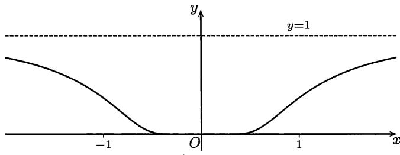
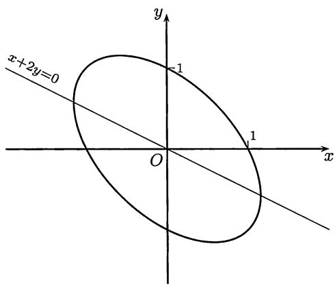

import Guide from '@/components/Guide.astro';
import Knowledge from '@/components/Knowledge.astro';
import Example from '@/components/Example.astro';
import Solution from '@/components/Solution.astro';
import Note from '@/components/Note.astro';
import Block from '@/components/Block.astro';
import Method from '@/components/Method.astro';

本节的内容为高阶导数的计算方法、隐函数求导法则和用参数方程给出的函数的求导法则。

## 6.2.1 高阶导数计算

高阶导数的计算，特别是 $n$ 阶导数的一般表达式的计算往往会有困难。这里 $Leibniz$ (莱布尼茨) 公式是主要工具:

$$
\begin{array}{l} (u v) ^ {(n)} = \binom {n} {0} u ^ {(0)} v ^ {(n)} + \binom {n} {1} u ^ {\prime} v ^ {(n - 1)} + \binom {n} {2} u ^ {\prime \prime} v ^ {(n - 2)} + \dots + \binom {n} {n} u ^ {(n)} v ^ {(0)} \\ = \sum_ {k = 0} ^ {n} \binom {n} {k} u ^ {(k)} v ^ {(n - k)}。 \end{array}
$$

由于这个公式在各种教科书中都有证明，这里不再重复。

在 $Leibniz$ 公式的右边有 $n+1$ 项，如果在 $uv$ 中有一个函数是低次多项式，则实际出现的项数就很少。这对于计算很有利。

<Example title="例 6.2.1">
计算 $(x^{2}\sin x)^{(80)}$ 。

<Solution title="解">
用 $Leibniz$ 公式和 $(\sin x)^{(4)} = \sin x, (\cos x)^{(4)} = \cos x,$ 就有

$$
\begin{array}{r l} & {(x ^ {2} \sin x) ^ {(80)} = x ^ {2} (\sin x) ^ {(80)} + \binom {80} {1} (x ^ {2}) ^ {\prime} (\sin x) ^ {(79)} + \binom {80} {2} (x ^ {2}) ^ {\prime \prime} (\sin x) ^ {(78)}} \\ & {\qquad = (x ^ {2} - 6320) \sin x - 160 x \cos x。} \end{array}
$$
</Solution>
</Example>

<Example title="例 6.2.2">
设 $f(x) = \frac{2x}{1 - x^2}$ ，求 $f^{(n)}(x)$ 。

<Solution title="解">
分解为简单分式后再求导。先将 $f$ 改写为

$$
f (x) = \frac {1}{1 - x} - \frac {1}{1 + x},
$$

这样就有

$$
f ^ {(n)} (x) = \left(\frac {1}{1 - x}\right) ^ {(n)} - \left(\frac {1}{1 + x}\right) ^ {(n)}。
$$

然后可以试求几次找出规律，并用数学归纳法证明 (细节从略):

$$
\left(\frac {2 x}{1 - x}\right) ^ {(n)} = n! \left[ \frac {1}{(1 - x) ^ {n + 1}} - \frac {(- 1) ^ {n}}{(1 + x) ^ {n + 1}} \right]。
$$
</Solution>
</Example>

<Example title="例 6.2.3">
对 $y = \arcsin x$ 计算 $y^{(n)}(0)$ 。

<Solution title="解">
直接计算很难总结出规律。关键是寻找递推关系。首先有

$$
y ^ {\prime} = \frac {1}{\sqrt {1 - x ^ {2}}},
$$

将它改写为

$$
y ^ {\prime} \sqrt {1 - x ^ {2}} = 1
$$

后再求导，得到

$$
y ^ {\prime \prime} \sqrt {1 - x ^ {2}} - y ^ {\prime} \cdot \frac {x}{\sqrt {1 - x ^ {2}}} = 0。
$$

又将它整理为

$$
(1 - x ^ {2}) y ^ {\prime \prime} - x y ^ {\prime} = 0,
$$

然后用 $Leibniz$ 公式得到

$$
y ^ {(n + 2)} \left(1 - x ^ {2}\right) + n y ^ {(n + 1)} (- 2 x) + \frac {n (n - 1)}{2} y ^ {(n)} (- 2) - \left(x y ^ {(n + 1)} + n y ^ {(n)}\right) = 0。
$$

整理后得到

$$
(1 - x ^ {2}) y ^ {(n + 2)} - (2 n + 1) x y ^ {(n + 1)} - n ^ {2} y ^ {(n)} = 0。
$$

现在用 $x = 0$ 代入，就得到递推公式

$$
y ^ {(n + 2)} (0) - n ^ {2} y ^ {(n)} (0) = 0。
$$

从 $y(0)=0$ 即可知道 $y(x)$ 在 $x=0$ 的所有偶数阶导数都等于零： $y^{(2k)}(0)=0, k\in\mathbf{N}_{+}$ . 再从 $y'(0)=1$ 出发用递推公式，计算出 $y'''(0)=1, y^{(5)}(0)=3^{2}, y^{(7)}(0)=5^{2}\cdot3^{2}, \cdots$ ，即可以总结出 $y^{(2k+1)}(0)=[(2k-1)!!]^{2}, k\in\mathbf{N}_{+}$ . ☐
</Solution>
<Note>
在第七章学了 $Taylor$ 公式后可以提出一种计算高阶导数的间接方法。见那里的例题 $7.2.1$ 解 $1$ 之后的注解中对本题的回顾。
</Note>
</Example>

<Example title="例 6.2.4">
设 $f(x) = \left\{ \begin{array}{ll}\mathrm{e}^{-\frac{1}{x^2}}, & x\neq 0,\\ 0, & x = 0, \end{array} \right.$ 证明 $f^{(n)}(0) = 0,n\in \mathbf{N}_{+}$ （见图 $6.4$）

  
图 $6.4$

<Solution title="证明">
这里的基础是对于任何 $\alpha$ 成立

$$
\lim _ {u \to + \infty} \frac {u ^ {\alpha}}{\mathrm{e} ^ {u}} = 0。
$$

先计算 $f'(0)$ . 按定义计算并作代换 $y = 1/x$, 就有

$$
f ^ {\prime} (0) = \lim _ {x \rightarrow 0} \frac {1}{x} \cdot \mathrm{e} ^ {- \frac {1}{x ^ {2}}} = \lim _ {y \rightarrow \infty} y \mathrm{e} ^ {- y ^ {2}} = 0。
$$

然后求出 $x \neq 0$ 时的导函数表达式

$$
f ^ {\prime} (x) = \frac {2}{x ^ {3}} \cdot \mathrm{e} ^ {- \frac {1}{x ^ {2}}},
$$

再按定义计算出

$$
f ^ {\prime \prime} (0) = \lim _ {x \rightarrow 0} \frac {f ^ {\prime} (x) - f ^ {\prime} (0)}{x} = \lim _ {x \rightarrow 0} \frac {2}{x ^ {4}} \cdot \mathrm{e} ^ {- \frac {1}{x ^ {2}}} = 0。
$$

然后求出 $x \neq 0$ 时的二阶导函数表达式

$$
f ^ {\prime \prime} (x) = \left(\frac {4}{x ^ {6}} - \frac {6}{x ^ {4}}\right) \cdot \mathrm{e} ^ {- \frac {1}{x ^ {2}}}。
$$

可以提出猜测，即函数 $f$ 的 $n$ 阶导数在 $x \neq 0$ 时具有以下形式:

$$
f ^ {(n)} (x) = P _ {n} \left(\frac {1}{x}\right) \cdot \mathrm{e} ^ {- \frac {1}{x ^ {2}}},
$$

其中的 $P_{n}\left(\frac{1}{x}\right)$ 的意义是在变量 $y$ 的多项式 $P_{n}(y)$ 中用 $y = \frac{1}{x}$ 代入。由于我们只要求计算 $f^{(n)}(0)$ ，而从前面的两次计算可以知道，我们不必去关心多项式 $P_{n}(y)$ 的具体次数、系数和递推关系。

用数学归纳法来证明这个猜测。已看到 $n = 1,2$ 时猜测成立。设 $f^{(k)}(x)$ 已具有所说的形式，讨论 $f^{(k + 1)}(x)$ . 通过对 $f^{(k)}(x)$ 求导，就有

$$
\begin{array}{r l} & f ^ {(k + 1)} (x) = (f ^ {(k)} (x)) ^ {\prime} \\ & \qquad = \left(P _ {k} \left(\frac {1}{x}\right) \cdot \mathrm{e} ^ {- \frac {1}{x ^ {2}}}\right) ^ {\prime} \\ & \qquad = P _ {k} ^ {\prime} \left(\frac {1}{x}\right) \cdot \left(- \frac {1}{x ^ {2}}\right) \cdot \mathrm{e} ^ {- \frac {1}{x ^ {2}}} + P _ {k} \left(\frac {1}{x}\right) \cdot \left(\frac {2}{x ^ {3}}\right) \cdot \mathrm{e} ^ {- \frac {1}{x ^ {2}}} \\ & \qquad = [ P _ {k} ^ {\prime} (y) (- y ^ {2}) + P _ {k} (y) (2 y ^ {3}) ] \Big | _ {y = \frac {1}{x}} \cdot \mathrm{e} ^ {- \frac {1}{x ^ {2}}}, \end{array}
$$

将第一个因子记为 $P_{k + 1}\left(\frac{1}{x}\right)$ 即可。

最后，用数学归纳法来证明对于任意的正整数 $n$ ，有 $f^{(n)}(0) = 0$ 成立。在 $n = 1,2$ 时已经成立。设在 $n = k$ 时已有 $f^{(k)}(0) = 0$ ，则对于 $n = k + 1$ ，可以利用 $n = k$ 和 $x \neq 0$ 时 $f^{(k)}(x)$ 的上述特殊形式作以下计算:

$$
\begin{array}{c} f ^ {(k + 1)} (0) = \lim _ {x \to 0} \frac {f ^ {(k)} (x) - f ^ {(k)} (0)}{x} = \lim _ {x \to 0} \frac {f ^ {(k)} (x)}{x} \\ = \lim _ {x \to 0} \frac {1}{x} \cdot P _ {k} \left(\frac {1}{x}\right) \cdot \mathrm{e} ^ {- \frac {1}{x ^ {2}}} = 0。 \end{array}
$$
</Solution>
<Note>
这是在数学分析中的重要例子。 (1) 它说明一个非常值函数也可以在某些点上的任何阶导数等于 $0$; (2) 幂函数 $x^n$ ( $n \geqslant 2$ ) 在 $x = 0$ 处直到 $n - 1$ 阶的导数均为 $0$, 当 $x \to 0$ 时为 $n$ 阶无穷小量。 因此 $x^n$ 的图像在原点附近随着 $n$ 增加越来越平坦。 但是与本例的函数相比，就大为不如。 因为这里对所有 $n$ 都成立

$$
\mathrm{e} ^ {- \frac {1}{x ^ {2}}} = o (x ^ {n}) (x \rightarrow 0)。
$$

从图 $6.4$ 可见这个函数在 $x = 0$ 附近的图像极其平坦。 (3) 在 $Taylor$ 公式 ( $\S 7.2$ ) 和 $Taylor$ 级数 (见下册命题 $14.4.2$) 的理论中，本例的函数有重要的应用。
</Note>
</Example>

<Example title="例 6.2.5">
将 $(- \infty, 0]$ 上的常值函数 $u(x) \equiv 0$ 和 $[1, +\infty)$ 上的常值函数 $v(x) \equiv 1$ 延拓为在 $(- \infty, +\infty)$ 上的无限次可微函数，且使其值域为 $[0,1]$。

<Solution title="解">
先定义

$$
g (x) = \left\{ \begin{array}{l l} 0, & x \leqslant 0, \\ \mathrm{e} ^ {- \frac {1}{x ^ {2}}}, & x > 0, \end{array} \right.
$$

然后令

$$
f (x) = \frac {g (x)}{g (x) + g (1 - x)},
$$

则 $f(x)$ 就满足要求。 (请读者验证。)
</Solution>
</Example>

## 6.2.2 隐函数求导法

从上一章的命题 $5.5.4$ 和其后的两个例题中我们已经看到，函数的给定方法已经突破了过去的显式方法，而可以采用隐式方法。具体地说，再举那里的 $Kepler$ 方程为例，即可以用一个方程

$$
y = x - q \sin x (0 <   q <   1)
$$

来定义一个函数 $x = x(y)$ . 用第二、三章中的迭代生成数列的方法可以计算这个函数 (的近似值)。在上一章我们能够确定这个函数是连续单调增加函数，而在本章则从反函数求导法则 (即命题 $6.1.1$) 还知道它可导，且可以将导数 $x'(y)$ 计算出来 (看下面的例题 $6.2.6$)。

本小节的隐函数求导法则与多元函数的偏导数计算有关，它的一般形式将在多元微积分的隐函数章节中学习。在这里只介绍这个法则的基本思想，并计算一些较为简单的问题。

这里的要点是：如果一个函数 $y = y(x)$ 满足方程

$$
F (x, y) = 0,
$$

则将它代入后就得到恒等式 $F(x, y(x)) \equiv 0$ . 然后对 $x$ 求导，就有可能将导数 $y'(x)$ 计算出来。

可以认为隐函数求导法则是反函数求导法则的一个发展。实际上根据上述思想就可以导出反函数的求导法则如下。

若 $y = y(x)$ 和 $x = x(y)$ 互为反函数，则可将 $y = y(x)$ 代入后者，得到

$$
x \equiv x (y (x)).
$$

对 $x$ 求导，就有

$$
1 = x ^ {\prime} (y (x)) y ^ {\prime} (x),
$$

这样就可以得到反函数求导公式

$$
y ^ {\prime} (x) = \frac {1}{x ^ {\prime} (y)},
$$

其中 $y = y(x)$ 由 $x = x(y)$ 决定。 (这不能代替命题 $6.1.1$ .为什么？)

<Example title="例 6.2.6">
设函数 $x = x(y)$ 满足 $Kepler$ 方程 $y = x - q\sin x (0 < q < 1)$ ，求 $x'(y)$ 。

<Solution title="解">
**解 1** 已知 $y = x - q \sin x (0 < q < 1)$ 是以 $(-\infty, +\infty)$ 为定义域和值域的连续单调增加函数，由于导数 $y' = 1 - q \cos x \neq 0$ ，就可以应用命题 $6.1.1$，知道反函数 $x(y)$ 可导，且得到导数

$$
x ^ {\prime} (y) = \frac {1}{y ^ {\prime} (x)} = \frac {1}{1 - q \cos x (y)}。
$$

**解 2** 将函数 $x = x(y)$ 代入方程 $y - x + q\sin x = 0$ 中，得到以 $y$ 为自变量的恒等式

$$
y - x (y) + q \sin x (y) \equiv 0。
$$

对 $y$ 求导，得到

$$
1 - x ^ {\prime} (y) + q \cos x (y) \cdot x ^ {\prime} (y) \equiv 0。
$$

这样就可以得到

$$
x ^ {\prime} (y) = \frac {1}{1 - q \cos x (y)}。
$$
</Solution>
<Note>
对这两个方法进行比较。

第一种解法是严格的，反函数的存在是由命题 $5.5.4$ 保证的，而反函数的可导与计算方法是以命题 $6.1.1$ 为根据的。它的缺点是不能解决一般的隐函数的存在和求导问题。

第二种解法的优点是可以用于一般的隐函数求导计算。但在这一章中对隐函数的存在性和可导性都还不可能建立严格的理论基础，这些问题要到多元微积分中才能解决，在那里会证明这里的计算方法是正确的 (见下册的第二十章)。此外，在一般计算中上述恒等式只写成为普通的等式。
</Note>
</Example>

<Example title="例 6.2.7">
设函数 $y = y(x)$ 满足单位圆方程 $x^{2} + y^{2} = 1$ ，用显式和隐式两种方法求 $y'(x)$ ，并作比较。

<Solution title="解">
从所给方程可以得到两个显函数：记为

$$
y _ {1} = \sqrt {1 - x ^ {2}} \quad {\text {和}} \quad y _ {2} = - \sqrt {1 - x ^ {2}},   - 1 \leqslant x \leqslant 1.\tag{6.8}
$$

它们在 $-1 < x < 1$ 上处处可导。容易计算出

$$
y _ {1} ^ {\prime} = - \frac {x}{\sqrt {1 - x ^ {2}}} \quad \text {和} \quad y _ {2} ^ {\prime} = \frac {x}{\sqrt {1 - x ^ {2}}}.\tag{6.9}
$$

另一方面，用隐函数求导法则，将 $y = y(x)$ 代入方程，有恒等式

$$
x ^ {2} + y ^ {2} (x) \equiv 1。
$$

对 $x$ 求导，得到 $2x + 2y(x)y'(x) \equiv 0$ ，就有

$$
y ^ {\prime} (x) = - \frac {x}{y (x)}.\tag{6.10}
$$

现比较这两个不同的方法。从前面的计算可见，方程 $x^{2} + y^{2} = 1$ 确定的函数不止一个。实际上，根据函数的定义，两个函数只要定义域不同，即使解析表达式相同，也应当看成是不同的函数。因此从这个观点看的话，方程 $x^{2} + y^{2} = 1$ 所确定的函数就不是只有两个，而是多得不计其数了。 (这正是将来要学习的隐函数理论中的观点。) 那么就产生了一个问题，即第二个方法所得的公式 $(6.10)$ 中的 $y'(x)$ 是指哪一个函数 $y(x)$ 的导数？

这个问题的回答是：用隐函数求导法则所得到的导数公式对 (由方程确定的) 每一个函数同时有效。由于本题十分简单，只要在公式 $(6.10)$ 中用公式 $(6.8)$ 中的 $y_{1}(x)$ 和 $y_{2}(x)$ 分别代入，就可以分别得到用第一个方法计算出来的 $y_{1}^{\prime}$ 和 $y_{2}^{\prime}$ ，即公式 $(6.9)$。至于由单位圆方程确定的其他函数，它们的定义域都是 $[-1,1]$ 的子集，因此只要可导，公式 $(6.10)$ 同样有效。 □
</Solution>
</Example>

<Example title="例 6.2.8">
设 $y = y(x)$ 可导，且满足方程 $x^{2} + xy + y^{2} = 1$ ，求 $y', y'', y'''$ 。

<Solution title="解">
将 $x^{2} + xy + y^{2} = 1$ 看成关于 $x$ 的恒等式，其中 $y = y(x)$ ，对 $x$ 求导得到

$$
2 x + y + x y ^ {\prime} + 2 y y ^ {\prime} = 0,\tag{6.11}
$$

就有

$$
y ^ {\prime} = - \frac {2 x + y}{x + 2 y}。
$$

根据这个表达式可以直接看出，在函数 $y(x)$ 可导的假定下，只要分母 $x + 2y \neq 0$ ，二阶导数 $y''$ 一定存在。

将 $(6.11)$ (它实际上也是关于 $x$ 的恒等式) 对 $x$ 求导，得到

$$
2 + 2 y ^ {\prime} + x y ^ {\prime \prime} + 2 y ^ {2} + 2 y y ^ {\prime \prime} = 0。
$$

由此可以计算出 (请读者补充计算过程)

$$
y ^ {\prime \prime} = - \frac {6}{(x + 2 y) ^ {3}}。
$$

从这个公式又一次推知，只要 $x + 2y \neq 0$ ，函数 $y(x)$ 就会有三阶导数。对 $y''$ 的公式再求导，就得到

$$
y ^ {\prime \prime \prime} = - \frac {54 x}{(x + 2 y) ^ {5}}。
$$
</Solution>
<Note>
从平面解析几何的二次曲线理论可知，如图 $6.5$ 所示，本题方程的几何图像是一个以原点为中心的椭圆，但其主轴与坐标轴不重合。这个椭圆与直线 $x + 2y = 0$ 的交点处的切线平行于 $y$ 轴，斜率为无穷大。当然可以从方程出发得到 $y(x)$ 的显式，但这时的显式表达式较复杂，计算并不方便。而且我们也不知道题意中的 $y(x)$ 是哪一个。因而隐函数求导法则即使在能求出函数的显式公式时也有它的优点。

  
图 $6.5$
</Note>
</Example>

## 6.2.3 参数方程求导法

用参数方程给出平面或空间曲线的做法由来已久。从解析几何的发展开始，许多有实际意义的曲线都是这样给定的，如果一定要用 $y = y(x)$ 或 $x = x(y)$ 来表示它们反而会很不方便。这即使对于常见的圆也是如此。在中学里已经学过极坐标和用 $\rho = \rho(\theta)$ 来表示的曲线。若写出

$$
x = \rho (\theta) \cos \theta , y = \rho (\theta) \sin \theta ,
$$

就得到了以 $\theta$ 为参数的参数方程。

对于一般的参数方程

$$
x = \varphi (t), y = \psi (t), a \leqslant t \leqslant b,
$$

在一定的条件下可以确定函数关系 $y = y(x)$ (或 $x = x(y)$ )。这时对函数 $y = y(x)$ 的研究完全可以从参数方程出发来进行，而不一定需要 $y = y(x)$ 的显式表达式。因为这样的显式表达式一般地说不一定存在，而即使存在也不一定有用。这里的情况与上一小节完全类似。

<Knowledge title="命题 6.2.1">
设 $x = \varphi(t), y = \psi(t)$ 在区间 $(a, b)$ 上可导，且 $\varphi'(t) \neq 0, \forall t \in (a, b)$ ，则有以下结论成立：

(1) $x = \varphi(t)$ 是区间 $(a, b)$ 上的严格单调连续函数，因而存在反函数 $t = t(x)$ ;

(2) 在 $x = \varphi(t)$ 和 $y = \psi(t)$ 之间存在函数关系 $y = \psi(t(x))$ ，简记为 $y = y(x)$ ;

(3) 函数 $y = y(x)$ 可导，且有公式

$$
y ^ {\prime} (x) = \left. \frac {\psi^ {\prime} (t)}{\varphi^ {\prime} (t)} \right| _ {t = t (x)}.
$$

<Solution title="证明">
关于 (1) 的证明见注 $2$ 的说明，在这里暂且先承认它。 (2) 是 (1) 的推论。下面只对于 (3) 给出证明。

由 $\varphi'(t) \neq 0$ 和 (1)，可以用反函数求导法则 (即命题 $6.1.1$)，知道 $t = t(x)$ 可导，且有

$$
t ^ {\prime} (x) = \left. \frac {1}{\varphi^ {\prime} (t)} \right| _ {t = t (x)}.
$$

对 $y = \psi (t(x))$ 用复合函数求导公式，就有

$$
y ^ {\prime} (x) = \psi^ {\prime} (t (x)) \cdot t ^ {\prime} (x) = \left. \frac {\psi^ {\prime} (t)}{\varphi^ {\prime} (t)} \right| _ {t = t (x)}.
$$
</Solution>
<Note>
**注1** 以上法则可以写为

$$
y _ {x} ^ {\prime} = y _ {t} ^ {\prime} t _ {x} ^ {\prime} = \frac {y _ {t} ^ {\prime}}{x _ {t} ^ {\prime}},
$$

因此是复合函数求导公式与反函数求导公式的结合。
</Note>
<Note>
**注2** 关于(1)的证明在此作个说明。由于在区间 $(a, b)$ 上处处有 $\varphi'(t) \neq 0$ ，应用下一章命题 $7.1.6$ 的导函数介值定理($Darboux$ (达布)定理)，可见导函数 $\varphi'(t)$ 在区间 $(a, b)$ 上保号。然后再用第八章 $\S 8.2$ 中关于单调性的讨论即可。
</Note>
</Knowledge>

<Example title="例 6.2.9">
将例题 $6.2.8$ 中的椭圆用参数方程表示为

$$
x = \frac {2}{\sqrt {3}} \cos t, y = \sin t - \frac {1}{\sqrt {3}} \cos t,
$$

计算 $y$ 对 $x$ 的前三阶导数： $y_{x}^{\prime}, y_{x}^{\prime\prime}, y_{x}^{\prime\prime\prime}$ 。

<Solution title="解">
由上面的注解，可以计算如下:

$$
\begin{array}{r l} & y _ {x} ^ {\prime} = \left(\sin t - \frac {1}{\sqrt {3}} \cos t\right) _ {x} ^ {\prime} = \left(\sin t - \frac {1}{\sqrt {3}} \cos t\right) _ {t} ^ {\prime} \cdot t _ {x} ^ {\prime} \\ & \qquad = \left(\cos t + \frac {1}{\sqrt {3}} \sin t\right) \cdot \frac {1}{x _ {t} ^ {\prime}} = - \frac {\sqrt {3}}{2} \cot t - \frac {1}{2}, \\ & y _ {x} ^ {\prime \prime} = (y _ {x} ^ {\prime}) _ {x} ^ {\prime} = (y _ {x} ^ {\prime}) _ {t} ^ {\prime} \cdot t _ {x} ^ {\prime} = \frac {\sqrt {3}}{2} \csc^ {2} t \cdot \frac {1}{x _ {t} ^ {\prime}} = - \frac {3}{4} \csc^ {3} t, \\ & y _ {x} ^ {\prime \prime \prime} = (y _ {x} ^ {\prime \prime}) _ {x} ^ {\prime} = (y _ {x} ^ {\prime \prime}) _ {t} ^ {\prime} \cdot t _ {x} ^ {\prime} = - \frac {9 \sqrt {3}}{8} \cdot \frac {\cos t}{\sin^ {5} t}. \end{array}
$$

当然在三个答案中的 $t$ 都应当理解为反函数 $t = t(x) = \arccos \frac{\sqrt{3}}{2} x$ . 同时只有当分母中的 $\sin t \neq 0$ 时公式有效，从 $x_{t}^{\prime} = -\frac{2}{\sqrt{3}} \sin t$ 可知这就是在推导法则时的条件。实际上有 $x + 2y = 2 \sin t$ ，因此与例题 $6.2.8$ 一致。
</Solution>
</Example>

## 6.2.4 练习题

1. 对 $y = \arctan x$ 计算 $y^{(n)}(0)$ .

2. 对 $y = (\arctan x)^2$ 计算 $y^{(n)}(0)$ .

3. 对 $y = (\arcsin x)^2$ 计算 $y^{(n)}(0)$ .

4. 设 $y = x^{n-1} \mathrm{e}^{\frac{1}{x}}$ ，证明： $y^{(n)} = \frac{(-1)^n}{x^{n+1}} \mathrm{e}^{\frac{1}{x}}$ .

5. 求下列函数的 $n$ 阶导函数：

(1) $y = \sin^3 x;$

(2) $y = \mathrm{e}^{x}\sin x;$

(3) $y = x^{n - 1}\ln x;$

(4) $y = x^{3} \mathrm{e}^{x};$

$$
y = \frac {x ^ {n}}{1 - x};
$$

$$
y = \frac {x ^ {n}}{(x + 1) ^ {2}};
$$

(7) $y = \sin ax \sin bx.$

6. 证明： $y = C_1 \mathrm{e}^{\lambda_1 x} + C_2 \mathrm{e}^{\lambda_2 x}$ 满足微分方程 $y'' - (\lambda_1 + \lambda_2)y' + \lambda_1\lambda_2y = 0$ .

7. 证明： $y = C_1 \sin(\omega t + \varphi) + C_2 \cos(\omega t + \varphi)$ 满足微分方程 $y'' + \omega^2 y = 0$ .

8. 若曲线由极坐标方程 $\rho = f(\theta)$ 表示，则可得到参数方程 $x = f(\theta) \cos \theta$ ， $y = f(\theta) \sin \theta$ ，求 $y'(x)$ .

9. 证明： $Archimedes$ 螺线 $\rho = a\theta$ 与双曲螺线 $\rho = a\theta^{-1}$ 在相交处的切线正交。

10. 对下列参数方程求 $y'(x)$ 和 $y''(x)$ (在 (4) 中假定 $f$ 二阶可导):

(1) $\left\{ \begin{array}{l} x = \sqrt{1 + t}, \\ y = \sqrt{1 - t}; \end{array} \right.$

$$
\left\{ \begin{array}{l} x = a \cos^ {3} t, \\ y = a \sin^ {3} t; \end{array} \right.
$$

$$
\left\{ \begin{array}{l} x = a t \cos t, \\ y = a t \sin t; \end{array} \right.
$$

$$
\left\{ \begin{array}{l} x = f ^ {\prime} (t), \\ y = t f ^ {\prime} (t) - f (t). \end{array} \right.
$$

11. 求出由方程 $x^{3} + y^{3} - 3xy = 0$ 确定的曲线上有水平切线的点。

12. 是否可以利用函数 $y = \sin x \sin 3x \sin 5x$ 的奇偶性计算 $y''(0)$ ?

13. 是否可以不展开乘积 $y = (6 + 5x)(4 + 3x)^2 (2 + x)^3$ 就求出 $y^{(5)}(0)$ ?

14. 设 $f$ 为 $7$ 次多项式，若 $f(x) + 1$ 能被 $(x - 1)^{4}$ 整除， $f(x) - 1$ 能被 $(x + 1)^{4}$ 整除，能否利用导数工具求出 $f$ ?
