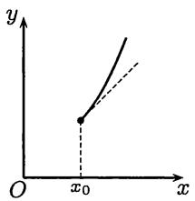
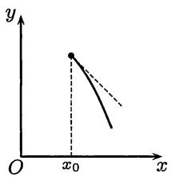
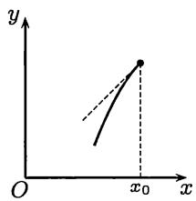
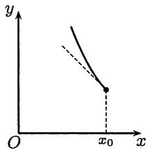
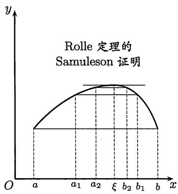
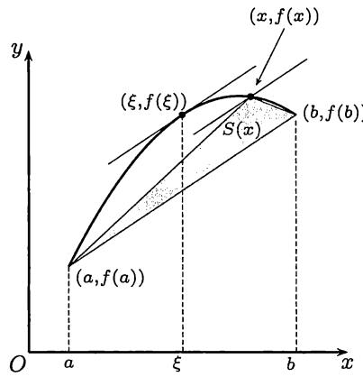
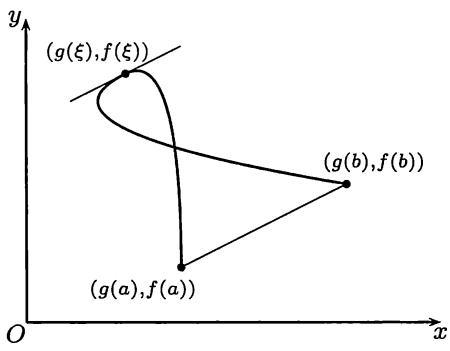
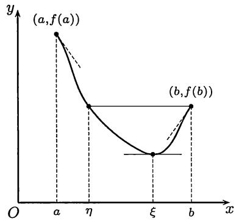

import Guide from '@/components/Guide.astro';
import Knowledge from '@/components/Knowledge.astro';
import Example from '@/components/Example.astro';
import Solution from '@/components/Solution.astro';
import Note from '@/components/Note.astro';
import Block from '@/components/Block.astro';

import Method from '@/components/Method.astro';

这里一共有四个基本定理：$Fermat$（费马）定理、$Rolle$（罗尔）定理、$Lagrange$ 中值定理和 $Cauchy$ 中值定理。实际上后三个是一个比一个更一般的中值定理。中值定理名称的由来是因为在定理中出现了具有某种性质的中间值，简称“中值”。虽然我们对中值缺乏定量的了解，但这并不影响中值定理的广泛使用。

## 7.1.1 基本定理

由于 $Fermat$ 定理是关于函数极值的基本定理，因此在讲这个定理之前，必须确切了解什么是函数的极值和极值点。

定义 设函数 $f(x)$ 在点 $x_0$ 的一个邻域 $O(x_0)$ 上有定义。如果对于每个 $x \in O(x_0)$ 成立不等式
$$
f (x) \leqslant (\geqslant) f (x _ {0}),
$$
则称 $f(x)$ 在点 $x_0$ 处达到极大值（极小值），且称点 $x_0$ 为函数 $f(x)$ 的一个极大值点（极小值点）。极大值和极小值统称极值，极大值点和极小值点统称极值点。

<Note>
注 在这里必须了解函数的极值点和最值点的区别和联系。从极值点的定义中可以看出它必须是区间的内点。因此若某个最值点又是区间的内点，则必是极值点。当然，极值点不一定是最值点。又若最值点是区间的端点，则不是极值点（有时也称为单侧极值点）。
</Note>

为了方便初学者，在这里将一般教科书中的内点定义重复一下。设 $S$ 为 $\mathbf{R}$ 中的一个非空点集。称点 $x \in S$ 为 $S$ 的内点，如果存在点 $x$ 的一个邻域 $O(x) \subset S$。对有界区间而言，开区间 $(a, b)$ 中的每一个点都是区间的内点。$a, b$ 是它的端点，但不属于 $(a, b)$。闭区间 $[a, b]$ 含有自己的两个端点 $a, b$，它们不是这个区间的内点，但所有其他点都是区间 $[a, b]$ 的内点。对半开半闭区间和无限区间可依此类推。

这里采取与多数教科书中不同的方法。先建立一个预备性质的结果。它不仅可以证明 $Fermat$ 定理，而且还可以处理更一般的问题。它的证明也极其简单。这里有四种情况。我们只处理其中之一，即右侧导数为非负的情况（参见图 7.1）。

<Knowledge title="命题 7.1.1">
设函数 $f$ 在点 $x_{0}$ 处存在右侧导数 $f'_{+}(x_{0})$。

(1) 若 $f_{+}^{\prime}(x_0) > 0$，则存在 $\delta > 0$，使得当 $x_0 < x < x_0 + \delta$ 时，成立 $f(x) > f(x_0)$；(2) 若有 $\delta > 0$，使得当 $x_0 < x < x_0 + \delta$ 时，成立 $f(x) \geqslant f(x_0)$，则 $f_{+}^{\prime}(x_0) \geqslant 0$。

<Solution title="证明">
(1) 写出右侧导数的定义：
$$
f _ {+} ^ {\prime} (x _ {0}) = \lim _ {x \rightarrow x _ {0} ^ {+}} \frac {f (x) - f (x _ {0})}{x - x _ {0}},
$$
根据函数极限的局部保号性质，就知道当 $f_{+}^{\prime}(x_0) > 0$ 时，存在 $\delta > 0$，使得当 $x_0 < x < x_0 + \delta$ 时，成立
$$
\frac {f (x) - f \left(x _ {0}\right)}{x - x _ {0}} > 0.
$$
由于 $x > x_0$，所以就得到 $f(x) > f(x_0)$。对(2)的证明完全类似。
</Solution>
</Knowledge>

这个命题有明显的几何意义。在下面的图 7.1 中显示了单侧导数大于 $0$ 和小于 $0$ 的 $4$ 种可能情况。其中情况 (a) 就是命题 7.1.1 中的情况 (1)。应当指出，在命题 7.1.1 中实质上包含了比 $Fermat$ 定理更一般的结论。

  
(a)

  
(b)

  
(c)  
图7.1

  
(d)

下面给出 $Fermat$ 定理的两个证明。第一个证明以命题7.1.1为依据，第二个证明则完全不同，它是用上一章的无穷小增量公式为工具。

<Knowledge title="命题 7.1.2 ($Fermat$ 定理)">
若 $x_{0}$ 是函数 $f$ 的极值点，且存在导数 $f'(x_{0})$，则一定有 $f'(x_{0}) = 0$。

<Solution title="证1">
不妨只给出 $x_0$ 为极小值点时的证明。根据定义，存在 $\delta > 0$，使得当 $|x - x_0| < \delta$ 时，成立
$$
f (x) \geqslant f (x _ {0}).\tag{7.1}
$$
由于存在导数 $f'(x_{0})$，所以两个单侧导数存在且相等，即有
$$
f ^ {\prime} (x _ {0}) = f _ {-} ^ {\prime} (x _ {0}) = f _ {+} ^ {\prime} (x _ {0}).\tag{7.2}
$$
从命题 7.1.1 之 (2) 和它对于 $f_{-}^{\prime}(x_{0})$ 的平行结论，就有
$$
f _ {+} ^ {\prime} (x _ {0}) \geqslant 0, f _ {-} ^ {\prime} (x _ {0}) \leqslant 0.
$$
与 (7.2) 合并，就得到 $f'(x_0) = 0$。
</Solution>

<Solution title="证2">
利用无穷小增量公式(6.1)，可以写出
$$
\begin{array}{c}f (x) - f (x _ {0}) = f ^ {\prime} (x _ {0}) \left(x - x _ {0}\right) + o (x - x _ {0}) \left(x \rightarrow x _ {0}\right)\\= [ f ^ {\prime} (x _ {0}) + o (1) ] (x - x _ {0}) \left(x \rightarrow x _ {0}\right).\end{array}
$$
用反证法。若 $f'(x_0) \neq 0$，则当 $x$ 与 $x_0$ 充分接近时，$[f'(x_0) + o(1)]$ 与 $f'(x_0)$ 同号，因此当变量 $x$ 经过 $x_0$ 时，$f(x) - f(x_0)$ 变号。这与 $x_0$ 为极值点矛盾。
</Solution>

<Note>
注1 以上两个证明方法都很重要。第一个证明的主要工具（即命题7.1.1）还会出现在下面的命题7.1.6 ($Darboux$ 定理) 的证明中。第二个证明的方法可用于处理更为一般的极值条件（见例题8.3.1）。
</Note>

<Note>
注2 由 $Fermat$ 定理知道，若 $x_0$ 是 $f(x)$ 的极值点，则只有两种情况：(1) $f(x)$ 在点 $x_0$ 处不可导；(2) $f'(x_0)$ 存在且等于零。因此在寻找函数 $f$ 的极值点时，将 $f$ 的不可导点和导数为零的点统称为“极值可疑点”。当然这只是“可疑”，因为容易举例说明 $f$ 在点 $x_0$ 不可导或 $f'(x_0) = 0$ 时，$f(x)$ 并不一定在点 $x_0$ 处达到极值。
</Note>

<Note>
注3 若 $f'(x_0) = 0$，则称 $x_0$ 为驻点 (stationary point)，或平稳点。这些名字的意思是说在这种点的附近，因变量 $f(x)$ 的值几乎不变。确切地说，从无穷小增量公式 (6.1) 和条件 $f'(x_0) = 0$ 就可得出
$$
\Delta y = f (x) - f (x _ {0}) = o (\Delta x) (\Delta x \rightarrow 0).
$$
即当 $\Delta x \to 0$ 时，$\Delta y$ 是 $\Delta x$ 的高阶无穷小。不妨看一个具体例子来理解这是什么意思。设 $y = x^3 + 1$，则 $x_0 = 0$ 是驻点，$y(0) = 1$。当 $x = 0.1$ 时，$y = 1.001$，而当 $x = 0.01$ 时，$y = 1.000001$。
</Note>
</Knowledge>

第二个基本定理是 $Rolle$ 定理，也可称为 $Rolle$ 中值定理。

<Knowledge title="命题 7.1.3 ($Rolle$ 定理)">
设 $f$ 在 $[a, b]$ 上连续，在 $(a, b)$ 上可微，且有 $f(a) = f(b)$，则存在 $\xi \in (a, b)$，使得 $f'(\xi) = 0$。

<Solution title="证1">
若 $f$ 是区间 $[a, b]$ 上的常值函数，则在 $(a, b)$ 的每一点上有 $f'(x) = 0$。因此可以在 $(a, b)$ 中任取一点作为 $\xi$。

否则，由有界闭区间上连续函数的值域定理知，$f$ 在 $[a, b]$ 上取到自己的最大值 $M$ 和最小值 $m$，且有 $m < M$。由于有题设条件 $f(a) = f(b)$，因此在 $m$ 和 $M$ 中，至少有一个与函数在端点的值不同。这就是说，至少有一个最值是在 $(a, b)$ 中取到的。设这个最值点为 $\xi \in (a, b)$。由于在区间的内点处取到的最值也就是极值，而函数 $f$ 又在 $(a, b)$ 上可微，因此可以用 $Fermat$ 定理，知道 $f'(\xi) = 0$。
</Solution>

<Note>
注1 我们看到，$Fermat$ 定理的证明只需要很少的函数极限知识，但是在 $Rolle$ 定理的证明中则需要用连续函数的一个基本定理——最值定理。回忆这个基本定理的证明方法，以及它所涉及的许多知识，可以知道 $Rolle$ 定理看似容易，实际上是前面许多内容的结晶。而这还是刚刚开始。下面的其他许多结果都是直接或间接地建筑在 $Rolle$ 定理的基础之上的。
</Note>

<Note>
注2 在 $Rolle$ 定理的三个条件中任意去掉一个或几个，定理的结论就不再成立。这些训练对于理解 $Rolle$ 定理很有必要，在一般教科书中也都有，这里不再重复。
</Note>

<Note>
注3 $Rolle$ 定理的上述证明即是一般教科书均采用的经典证明。它以闭区间上连续函数的最值定理和 $Fermat$ 定理为主要工具。但是实际上 $Rolle$ 定理和这两个定理并无必然联系。将这一点再延伸一步就可以说，本章从 $Rolle$ 定理开始的全部内容都无须用 $Fermat$ 定理就可以建立起来。支持上述观点的根据就是 $Rolle$ 定理的新证明，其中所用的工具是连续函数的零点存在定理和闭区间套定理（见《美国数学月刊》(1979)第86卷484-486页）。此外还有用覆盖定理和 $Dedekind$ 定理证明 $Rolle$ 定理的工作（参见[57]）。
</Note>

<Solution title="证2 ($Samuleson$ 证明)">
作辅助函数
$$
F (x) = f (x) - f \left(x + \frac {b - a}{2}\right), a \leqslant x \leqslant \frac {a + b}{2}.
$$
则可以从条件 $f(a) = f(b)$ 得出
$$
F (a) = f (a) - f \left({\frac {a + b}{2}}\right)   {\text {和}}   F \left({\frac {a + b}{2}}\right) = f \left({\frac {a + b}{2}}\right) - f (b) = - F (a).
$$
在区间 $\left[a, \frac{1}{2}(a + b)\right]$ 上对函数 $F$ 用零点存在定理，知道存在 $a_1 \in \left[a, \frac{1}{2}(a + b)\right]$，使得 $F(a_1) = 0$。记 $b_1 = a_1 + \frac{1}{2}(b - a)$，则就有（见图7.2）
$$
f (a _ {1}) = f (b _ {1}), [ a _ {1}, b _ {1} ] \subset [ a, b ], b _ {1} - a _ {1} = \frac {1}{2} (b - a).
$$
将以上做法继续下去，得到一个闭区间套 $\{[a_n, b_n]\}$，它满足要求：
$$
b _ {n} - a _ {n} = \frac {1}{2 ^ {n}} (b - a), f (a _ {n}) = f (b _ {n}), n \in \mathbf {N} _ {+}.
$$
应用闭区间套定理，存在唯一的点 $\xi$，它属于每个闭区间 $[a_n, b_n]$，也就是说有不等式
$$
a _ {n} \leqslant \xi \leqslant b _ {n}, \forall n \in \mathbf {N} _ {+},\tag{7.3}
$$
而且有
$$
\lim _ {n \to \infty} a _ {n} = \lim _ {n \to \infty} b _ {n} = \xi .\tag{7.4}
$$
这里需要补充一点，即总可以使得 $\xi \in (a, b)$。为此只要使得 $\{a_n\}$ 和 $\{b_n\}$ 不是常值数列就可以了。实际上，若有 $a = a_1 = a_2$，则
$$
f (a) = f \left(a _ {1}\right) = f \left(a _ {2}\right) = f \left(b _ {1}\right) = f \left(b _ {2}\right),
$$
可用 $[b_2, b_1]$ 代替 $[a_2, b_2]$ 进行下去。同样可以避免 $\{b_n\}$ 为常值数列。

由于 $f$ 在点 $\xi \in (a, b)$ 可导，因此就有
$$
\lim _ {n \rightarrow \infty} \frac {f (b _ {n}) - f (a _ {n})}{b _ {n} - a _ {n}} = f ^ {\prime} (\xi).\tag{7.5}
$$
为此只要写出无穷小增量公式：
$$
\begin{array}{l} f (b _ {n}) = f (\xi) + f ^ {\prime} (\xi) (b _ {n} - \xi) + o (b _ {n} - \xi) (b _ {n} \to \xi), \\ f (a _ {n}) = f (\xi) + f ^ {\prime} (\xi) (a _ {n} - \xi) + o (a _ {n} - \xi) (a _ {n} \to \xi), \end{array}
$$
代入 (7.5) 左边的分子，并利用 (7.3) 和 (7.4) 即可。

由于 $f(a_{n}) = f(b_{n}),\forall n\in \mathbf{N}_{+}$，因此从(7.5)可见 $f^{\prime}(\xi) = 0$。
</Solution>

<Note>
注 以上证明的基本思想有两点。(1) 第一步是用 $a_1, b_1$ 代替原来的区间端点 $a$ 和 $b$，一方面保持了在两个点上的函数值相等，另一方面则使两点之间的距离缩小了一半。（关于这一步可以参考第五章第一组参考题2的内容。）以下就是不断重复，用闭区间套定理得到唯一的点 $\xi$。(2) 利用极限 (7.5)，就保证得到 $f'(\xi) = 0$。在图7.2中我们显示了构造闭区间套过程的开始几步，即有 $f(a_1) = f(b_1), b_1 - a_1 = \frac{1}{2}(b - a), f(a_2) = f(b_2), b_2 - a_2 = \frac{1}{2}(b_1 - a_1)$。在图7.2上似乎最后得到的点 $\xi$ 是 $f$ 的极值点。但

图7.2
实际上可以举出例子，使得在 $Samuleson$ 证明中得到的 $\xi$ 可以不是极值点（作为思考题）。因此这个证明与前面的经典证明确实是完全不同的。
</Note>
</Knowledge>

将 $Rolle$ 定理中的条件 $f(a) = f(b)$ 去掉后加以推广，就得到下面的 $Lagrange$ 中值定理。虽然可以说 $Rolle$ 定理更为基本，但总的来说 $Lagrange$ 中值定理的用处要大得多，因为它很好地解决了函数研究中的一个基本问题——如何将自变量从 $a$ 到 $b$ 时所引起的因变量的增量与导数联系起来。从 $Lagrange$ 中值定理的内容来说，也已经包含了 $Rolle$ 定理为其特例。以下采用与多数教科书中的经典证明不同的面积证明方法。

<Knowledge title="命题 7.1.4 ($Lagrange$ 中值定理)">
设 $f$ 在 $[a, b]$ 上连续，在 $(a, b)$ 上可微，则存在 $\xi \in (a, b)$，使得
$$
f ^ {\prime} (\xi) = \frac {f (b) - f (a)}{b - a}.
$$

<Solution title="面积证明">
分析 先在图7.3中的 $f$ 的图像上任取一点 $(x, f(x))$，然后将它同点 $(a, f(a)), (b, f(b))$ 连接成一个三角形（图中阴影区）。记它的面积为 $S(x)$。如果让这个三角形的顶点 $(x, f(x))$ 平行它的对边移动（见图7.3经过该点的一条直线），则三角形面积不变。这条对边就是连接 $(a, f(a))$ 和 $(b, f(b))$ 的直线段。由此可见，如果 $\xi$ 是函数 $S(x)$ 的驻点（见 $Fermat$ 定理证明后的注解3），则 $f$ 的图像在点 $(\xi, f(\xi))$ 的切线就可能同

图7.3
这条直线段平行。而这就是定理中对点 $\xi$ 的要求。根据这个几何分析就可以写出以下证明。

用行列式构造辅助函数：
$$
\Delta (x) = \left| \begin{array}{c c c} 1 & 1 & 1 \\ a & b & x \\ f (a) & f (b) & f (x) \end{array} \right| = \left| \begin{array}{c c} b - a & x - a \\ f (b) - f (a) & f (x) - f (a) \end{array} \right|.\tag{7.6}
$$
(这个 $\Delta(x)$ 的值等于图 7.3 中的三角形面积 $S(x)$ 的两倍。) 利用 $\Delta(a)=\Delta(b)=0$，从 $Rolle$ 定理知道有 $\xi\in(a,b)$，使得 $\Delta'(\xi)=0$。写出
$$
\Delta^ {\prime} (x) = \left| \begin{array}{c c c} 1 & 1 & 0 \\ a & b & 1 \\ f (a) & f (b) & f ^ {\prime} (x) \end{array} \right| = \left| \begin{array}{c c} b - a & 1 \\ f (b) - f (a) & f ^ {\prime} (x) \end{array} \right|,
$$
就可以从 $\Delta'(\xi)=0$ 直接得到所要求证的结论。
</Solution>

<Note>
注1 $Rolle$ 定理和 $Lagrange$ 中值定理都具有清晰的几何意义。在图7.3中作出了曲线 $y = f(x)$ 在点 $(\xi ,f(\xi))$ 处的切线，它与连接点 $(a,f(a))$ 和 $(b,f(b))$ 的直线段平行。$Lagrange$ 中值定理的经典证明就是从这个几何意义出发，将 $f$ 的图像“减去”上述直线段来构造辅助函数。由于一般教科书中均用这个证明，本书不再重复。上面的面积证明也是以几何背景为出发点的，同时还利用了驻点所具有的特性。又由于三角形面积可以用行列式表示，从而证明过程带有更多的代数色彩。这种证明方法还可以用于证明下面的 $Cauchy$ 中值定理（留作思考题）。

应当看到，几何作图虽然很有用，但每张图都有局限性。例如，图7.2和7.3似乎提示我们中值 $\xi$ 是唯一的。实际上不一定如此。中值可以有多个，甚至无穷多个。此外，今后所遇到的许多问题并不一定都有几何背景。即使确实有几何背景，也不一定明显。因此我们在下面将介绍构造辅助函数的其他方法，它在许多问题中更实用一些。
</Note>

<Note>
注2 也可以从物理上来理解这两个定理的意义。例如，设自变量 $x$ 为时间，因变量 $y$ 是质点做直线运动时从某点起算的路程，将 $a$ 和 $b$ 作为时间的起点和终点。$Rolle$ 定理表明，若质点在起点和终点的位置相同，则一定有瞬时速度为零的时刻。这个时刻在 $Rolle$ 定理的（第一个）证明中就是质点运动转向的时刻。同样，$Lagrange$ 中值定理的运动学意义也很清楚。它表明一定存在一个时刻 $\xi$，使得在该时刻的瞬时速度恰好是质点运动（从时刻 $a$ 到 $b$）的平均速度。
</Note>

<Note>
注3 $Lagrange$ 中值定理有下列各种形式，经常称为有限增量公式：
$$
f (b) = f (a) + f ^ {\prime} (\xi) (b - a), a <   \xi <   b,\tag{7.7}
$$
$$
f (b) = f (a) + f ^ {\prime} (a + \theta (b - a)) (b - a), 0 <   \theta <   1,\tag{7.8}
$$
$$
\Delta y = f ^ {\prime} (x _ {0} + \theta \Delta x) \Delta x, 0 <   \theta <   1.\tag{7.9}
$$
将它们与上一章中的无穷小增量公式 (6.1) 或 (6.3) 作比较，就可以看出这里已经前进了一大步。从今以后，我们有了与过去完全不同的有力工具，在本章以及今后所能解决的许多问题都是过去的“原始”工具所难以对付的。
</Note>

<Note>
注4 $Lagrange$ 中值定理将函数的增量与函数在一个点上的导数值联系起来，这就为用微分学研究函数提供了基础。希望读者从今后的大量实例中体会引进导数（即变化率）的重要性。
</Note>
</Knowledge>

本节的最后一个定理是

<Knowledge title="命题 7.1.5 ($Cauchy$ 中值定理)">
设函数 $f,g$ 在 $[a,b]$ 上连续，在 $(a,b)$ 上可微，且满足条件
$$
g (b) - g (a) \neq 0 \text {和} f ^ {\prime 2} (x) + g ^ {\prime 2} (x) \neq 0, \forall x \in (a, b),
$$
则存在 $\xi \in (a,b)$，使得
$$
\frac {f (b) - f (a)}{g (b) - g (a)} = \frac {f ^ {\prime} (\xi)}{g ^ {\prime} (\xi)}.
$$

<Solution title="证明">
引进记号
$$
\lambda = \frac {f (b) - f (a)}{g (b) - g (a)}.
$$
我们的目的是要证明存在 $\xi \in (a, b)$，使得
$$
f ^ {\prime} (\xi) - \lambda g ^ {\prime} (\xi) = 0.\tag{7.10}
$$
这里要说明，如有 $g'(\xi) = 0$，则由上式可见也有 $f'(\xi) = 0$，这与条件 $f'^2(x) + g'^2(x) \neq 0, \forall x \in (a, b)$ 相矛盾。因此有了 (7.10) 之后，就一定有 $g'(\xi) \neq 0$，从而可以由它推出定理中所要的等式。

由 (7.10) 出发试作辅助函数
$$
F (x) = f (x) - \lambda g (x).
$$
然后计算
$$
\begin{array}{l} F (a) = f (a) - \frac {f (b) - f (a)}{g (b) - g (a)} \cdot g (a) = \frac {f (a) g (b) - f (b) g (a)}{g (b) - g (a)}, \\ F (b) = f (b) - \frac {f (b) - f (a)}{g (b) - g (a)} \cdot g (b) = \frac {f (a) g (b) - f (b) g (a)}{g (b) - g (a)}, \end{array}
$$
可见有 $F(a) = F(b)$。然后对 $F(x)$ 在区间 $[a, b]$ 上应用 $Rolle$ 定理，就知道存在 $\xi \in (a, b)$，使得 $F'(\xi) = 0$。这就是要证明的结果 (7.10)。
</Solution>

<Note>
注1 容易看出，只要 $g(x) \equiv x$，就从 $Cauchy$ 中值定理得到 $Lagrange$ 中值定理。因此 $Cauchy$ 中值定理是 $Lagrange$ 中值定理的一种推广。由于它能同时处理两个函数，因此在今后的许多问题中起重要作用。
</Note>

<Note>
注2 与 $Rolle$ 定理和 $Lagrange$ 中值定理一样，$Cauchy$ 中值定理也有漂亮的几何意义。为此可以先将定理中的自变量改记为 $t$，然后用参数方程
$$
x = g (t), y = f (t)
$$
定义在平面上的一条曲线。如图 7.4 所示，该曲线的两个端点是 $(g(a), f(a))$ 和 $(g(b), f(b))$。定理中关于两个函数 $f, g$ 在 $[a, b]$ 上连续和在 $(a, b)$ 上可微的条件表明，这条曲线不但连续，而且在（除去端点之外的）每一点都有切线。实际上从参数方程的求导法则（命题 6.2.1）知道，当 $g'(t) \neq 0$ 时，切线的斜率
$$
{\frac {\mathrm{d} y}{\mathrm{d} x}} = {\frac {f ^ {\prime} (t)}{g ^ {\prime} (t)}}
$$
是有限数。同样可以知道，当 $g'(t) = 0$ 但 $f'(t) \neq 0$ 时，切线将平行于 $y$ 轴。在 $Cauchy$ 中值定理中的另一个条件 $g(b) - g(a) \neq 0$ 表明，连接曲线两个端点的直线段不平行于 $y$ 轴，因此它的斜率
$$
\frac {f (b) - f (a)}{g (b) - g (a)}
$$
是有限数。这样一来就可以看出，$Cauchy$ 中值定理的结论就是说（至少）存在一个参数值 $\xi \in (a, b)$，使得在曲线上的点 $(g(\xi), f(\xi))$ 的切线恰好与连接曲线两个端点 $(g(a), f(a))$ 和 $(g(b), f(b))$ 的直线段平行。

图7.4
</Note>

<Note>
注3 如果在 $Cauchy$ 中值定理中的条件修改为 $g'(x) \neq 0, \forall x \in (a, b)$，则可以用 $g(x)$ 的反函数为工具，从 $Lagrange$ 中值定理推出 $Cauchy$ 中值定理。由于这个条件对于用参数方程给出的曲线增加了不必要的限制，排除了例如图7.4中那样的曲线，因此本书采用了较一般的条件。从图中可以看出，曲线上某些点处的切线可以与 $y$ 轴平行，曲线也可以有自交点，$Cauchy$ 中值定理仍然成立。
</Note>

<Note>
注4 如果在某点 $t_0 \in (a, b)$ 发生 $f'(t_0) = g'(t_0) = 0$，则称点 $(f(t_0), g(t_0))$ 为曲线 $x = f(t), y = g(t)$ 的奇点。奇点有几种不同的类型。本书中将在第八章的例题8.6.1中介绍奇点中的“尖点”（见图8.10）。
</Note>
</Knowledge>

## 7.1.2 导函数的两个定理

本小节证明关于导函数的两个基本定理。第一个定理 ($Darboux$ 定理) 是说区间上的导函数一定具有介值性质，即使导函数不连续时也如此。第二个定理称为单侧导数极限定理或导数极限定理，由此可以推出导函数不会有第一类间断点。这两个定理都表明导函数具有特殊性质。因此并不是每个函数都可以是某个函数的导函数。这两个定理在今后，特别是在积分学中，要起重要作用。

<Knowledge title="命题 7.1.6 ($Darboux$ 定理)">
设 $f$ 在区间 $I$ 上可微，则 $f'$ 具有介值性质。

首先说明定理的意义。在第五章中我们已经有连续函数的介值定理（即命题 5.2.2）。如果导函数 $f' \in C(I)$，则已不必再讨论。可见本命题的意义在于，区间上的导函数不论是否连续，一定有介值性质。

<Solution title="证1 (经典证明)">
这是多数教科书中采用的经典证明。这里只作简述。需要了解细节的读者可参考 [14] 第一卷的 110 小节。

仿照 §5.2，分两步进行。

(1) 为确定起见，不妨设有 $a, b \in I, a < b$，使得 $f'(a) < 0, f'(b) > 0$。如图7.5所示，应用命题7.1.1知道存在 $\delta > 0$，使得成立 $a + \delta < b - \delta$，且满足
$$
f (a + \delta) <   f (a), f (b - \delta) <   f (b). \tag {7.11}
$$

图7.5
因此在 $[a, b]$ 上 $f$ 的最小值点 $\xi$ 一定是内点，即极小值点。应用 $Fermat$ 定理就得到 $f'(\xi) = 0$。

(2) 对于 $f'(a) \neq f'(b)$ 的一般情况。为确定起见，不妨设有 $f'(a) < c < f'(b)$。构造辅助函数
$$
F (x) = f (x) - c x.
$$
就可以将问题归结为 (1) 而知道 $f'$ 能取到 $c$（细节从略）。
</Solution>

<Solution title="证2">
与 $Rolle$ 定理的 $Samuleson$ 证明类似，$Darboux$ 定理的证明并不一定要用 $Fermat$ 定理。当然只需要修改证明1中的第(1)步。若有 $f(a) = f(b)$，则用 $Rolle$ 定理即可。否则，不妨只看 $f(a) > f(b)$ 的情况（见图7.5）。由于有 $\delta > 0$，使得 $f(a) > f(b) > f(b - \delta)$，应用连续函数的介值定理，就知道存在 $\eta \in (a, b - \delta)$，满足 $f(\eta) = f(b)$。在 $[\eta, b]$ 上再用 $Rolle$ 定理即可（见图7.5）。
</Solution>
</Knowledge>

在上一章关于导数概念的讨论中，我们曾强调过不要混淆函数在某点的单侧导数和这个函数的导函数在该点同侧的单侧极限。这是两个不同的概念。但是在那里还没有条件提及事情的另一方面，即实际上这两者的值在很多情况中确实相等。例题 6.1.6 就是如此。这里的规律性就是下一个命题的内容。根据这个命题，今后对例题 6.1.6 类型的题可以有新的做法。

<Knowledge title="命题 7.1.7 (单侧导数极限定理)">
设在区间 $[a, b)$ 上有定义的函数 $f$ 在 $(a, b)$ 上可微，又在点 $a$ 右连续。若导函数 $f'(x)$ 在点 $a$ 存在右侧极限 $f'(a^{+}) = A$，则 $f$ 在点 $a$ 也一定存在右侧导数 $f_{+}'(a)$，且成立
$$
f _ {+} ^ {\prime} (a) = f ^ {\prime} (a ^ {+}) = A,
$$
即 $f'(x)$ 在点 $a$ 右连续。此外，这里的 $A$ 除了为有限数外，也可以为 $\pm \infty$。

<Solution title="证明">
令 $\Delta x = x - a, \Delta y = f(x) - f(a)$，写出函数 $f$ 在点 $a$ 右侧的差商
$$
\frac {\Delta y}{\Delta x} = \frac {f (a + \Delta x) - f (a)}{\Delta x}, \text {其中} \Delta x > 0.
$$
在闭区间 $[a, a + \Delta x]$ 上应用 $Lagrange$ 中值定理(7.9)，有 $0 < \theta < 1$，使得
$$
\Delta y = f (a + \Delta x) - f (a) = f ^ {\prime} (a + \theta \Delta x) \Delta x.
$$
因此在 $\Delta x > 0$ 时就有
$$
\frac {\Delta y}{\Delta x} = f ^ {\prime} (a + \theta \Delta x).
$$
现设有 $\lim_{x\to a^{+}}f'(x) = A$，其中 $A$ 为有限数。则对 $\varepsilon >0$，存在 $\delta >0$，使得当 $a <   x <   a + \delta$ 时，成立不等式
$$
\left| f ^ {\prime} (x) - A \right| <   \varepsilon .
$$
若有 $0 < \Delta x = x - a < \delta$，则同时就有 $a < a + \theta \Delta x < x < a + \delta$。因此当 $0 < \Delta x < \delta$ 时，也就有
$$
\left| \frac {\Delta y}{\Delta x} - A \right| = | f ^ {\prime} (a + \theta \Delta x) - A | <   \varepsilon .
$$
这样就证明了函数 $f$ 在点 $a$ 存在右侧导数，且等于 $A$。对于 $A$ 不是有限数的情况，证明类似，请读者补全。 $\square$
</Solution>
</Knowledge>

思考题 对于下列问题，如果肯定，请作出证明；如果否定，请举出例子。

1. 如果在命题中将函数 $f$ 在点 $a$ 右连续的条件去掉，则结论是否还能成立？

2. 如果在命题中的 $A$ 是无穷大量，而且不具有确定的符号，则结论是否还能成立？

3. 如果存在 $f_{+}^{\prime}(a) = A$，则是否存在 $f^{\prime}(a^{+})$？为什么？

若不只是考虑单侧情况，就可以得到

<Knowledge title="导数极限定理">
设函数 $f$ 在点 $a$ 的某邻域 $O(a)$ 上连续，在 $O(a) - \{a\}$ 上可导。若 $f'$ 在点 $a$ 处存在极限，则 $f$ 在点 $a$ 处也可导，而且 $f'$ 在点 $a$ 处连续。

<Note>
注 由此可见，若导函数在某点有极限，则它就在该点连续。这里甚至事先不要假定函数在该点可导。回顾一般函数在某点存在极限时可以在该点不连续，可见导函数的这个性质也是很独特的。
</Note>
</Knowledge>

## 7.1.3 例题

<Example title="例 7.1.1">
设 $f$ 在区间 $(a, b)$ 上可微，则导函数 $f'(x)$ 不会有第一类间断点。

<Solution title="证明">
用反证法。设点 $c \in (a, b)$ 是 $f'(x)$ 的第一类间断点，则导函数 $f'$ 在点 $c$ 存在有限的两个单侧极限
$$
f ^ {\prime} (c ^ {-}) \quad {\text { 和 }} \quad f ^ {\prime} (c ^ {+}).
$$
又因存在 $f'(c)$，所以 $f$ 在 $c$ 连续，这包含了函数 $f$ 在该点的两个单侧连续性。

应用命题 7.1.7 的结论，知道成立两个等式：
$$
f ^ {\prime} (c ^ {-}) = f _ {-} ^ {\prime} (c) \quad {\text {和}} \quad f ^ {\prime} (c ^ {+}) = f _ {+} ^ {\prime} (c).
$$
由于 $f$ 在 $c$ 可导，因此有
$$
f _ {-} ^ {\prime} (c) = f ^ {\prime} (c) = f _ {+} ^ {\prime} (c).
$$
合并这些结果就得到
$$
f ^ {\prime} (c ^ {-}) = f ^ {\prime} (c) = f ^ {\prime} (c ^ {+}).
$$
这恰恰表明导函数 $f'(x)$ 在点 $c$ 连续。引出矛盾。
</Solution>

<Note>
注 在区间上的导函数可以有第二类间断点，见例题 6.1.5 及其图 6.3。
</Note>
</Example>

<Example title="例 7.1.2">
设 $\frac{a_{0}}{n+1} + \frac{a_{1}}{n} + \cdots + a_{n} = 0,$ 证明：方程
$$
f (x) = a _ {0} x ^ {n} + a _ {1} x ^ {n - 1} + \dots + a _ {n} = 0
$$
在区间 $(0,1)$ 中至少有一个根。

<Solution title="证明">
构造辅助函数
$$
F (x) = \frac {a _ {0} x ^ {n + 1}}{n + 1} + \frac {a _ {1} x ^ {n}}{n} + \dots + a _ {n} x,
$$
则可见 $F(0) = F(1) = 0$。对 $F$ 在区间 $[0,1]$ 上用 $Rolle$ 定理，就知道 $F'(x) = f(x)$ 在区间 $(0,1)$ 中有零点。
</Solution>
</Example>

<Example title="例 7.1.3">
设 $f$ 在 $[a, b]$ 上二阶可微，$f(a) = f(b) = 0$。证明：对每个 $x \in (a, b)$，存在 $\xi \in (a, b)$，使得成立
$$
f (x) = \frac {f ^ {\prime \prime} (\xi)}{2} (x - a) (x - b).
$$

<Solution title="证1">
固定 $x \in (a, b)$，令 $\lambda = \frac{2f(x)}{(x - a)(x - b)}$。于是只要证明存在 $\xi \in (a, b)$，使成立 $f''(\xi) = \lambda$。构造在 $[a, b]$ 上的辅助函数
$$
F (t) = f (t) - \frac {\lambda}{2} (t - a) (t - b).
$$
由条件 $f(a) = f(b) = 0$ 得到 $F(a) = F(b) = 0$。从 $\lambda$ 的定义还可得到 $F(x) = 0$。在区间 $[a, x]$ 和 $[x, b]$ 上分别对 $F$ 用 $Rolle$ 定理得到两个点 $\eta_1$ 和 $\eta_2$，满足条件
$$
a <   \eta_ {1} <   x <   \eta_ {2} <   b \text {和} F ^ {\prime} (\eta_ {1}) = F ^ {\prime} (\eta_ {2}) = 0.
$$
然后再在区间 $[\eta_1, \eta_2]$ 上对 $F'$ 用 $Rolle$ 定理，知道有 $\xi \in (\eta_1, \eta_2) \subset (a, b)$，满足要求 $F''(\xi) = 0$。这就是 $f''(\xi) = \lambda$。
</Solution>

<Solution title="证2">
也可以用 $Cauchy$ 中值定理来证明。将要证明的等式改写为
$$
f ^ {\prime \prime} (\xi) = \frac {2 f (x)}{(x - a) (x - b)}.\tag{7.12}
$$
记区间 $[a, b]$ 的中点为 $c = \frac{1}{2} (a + b)$。若 $f'(c) \neq 0$，则在 (7.12) 右边的分子和分母中将 $x$ 换为变量 $t$ 后得到的一对函数的导数不会同时为 $0$，因此可利用条件 $f(a) = f(b) = 0$，在子区间 $[a, x]$ 和 $[x, b]$ 上分别用 $Cauchy$ 中值定理得到
$$
\frac {2 f (x)}{(x - a) (x - b)} = \frac {f ^ {\prime} (\eta_ {1})}{\eta_ {1} - c} = \frac {f ^ {\prime} (\eta_ {2})}{\eta_ {2} - c} = \frac {f ^ {\prime} (\eta_ {1}) - f ^ {\prime} (\eta_ {2})}{\eta_ {1} - \eta_ {2}},
$$
其中 $\eta_{1}$ 和 $\eta_{2}$ 满足要求 $a < \eta_{1} < x < \eta_{2} < b$。最后再用 $Lagrange$ 中值定理，得到 $\xi \in (\eta_1, \eta_2)$，使(7.12)成立。

若有 $f'(c) = 0$，则对于每个 $x \in (a, b)$，在子区间 $[a, x]$ 和 $[x, b]$ 中至少有一个子区间上仍可用 $Cauchy$ 中值定理，并计算如下：
$$
{\frac {2 f (x)}{(x - a) (x - b)}} = {\frac {f ^ {\prime} (\eta)}{\eta - c}} = {\frac {f ^ {\prime} (\eta) - f ^ {\prime} (c)}{\eta - c}} = f ^ {\prime \prime} (\xi).
$$
</Solution>

<Note>
注 以上两种方法可以解决许多类似的问题。实际上如果仔细分析的话，容易发现这两个方法并无多大差别，只不过在写法上略有不同而已。其中第一个方法可以称为待定常数法，是作辅助函数的一种很有用的方法。
</Note>
</Example>

<Example title="例 7.1.4">
设函数 $f$ 在点 $a$ 处二阶可导，且 $f''(a) \neq 0$，则在 $h$ 充分小时，成立 $f(a + h) - f(a) = f'(a + \theta h)h$，而且其中的 $\theta$ 具有性质 $\lim_{h \to 0} \theta(h) = 1/2$。

<Solution title="证明">
由于存在 $f''(a)$，因此至少在 $a$ 的一个邻域上 $f$ 可微。当 $h$ 充分小时，可在区间 $[a, a + h] (h > 0)$ 或 $[a + h, a] (h < 0)$ 上用 $Lagrange$ 中值定理，得到
$$
f (a + h) - f (a) = f ^ {\prime} (a + \theta h) h,\tag{7.13}
$$
其中 $0 < \theta < 1$。

考虑分式
$$
I = \frac {f (a + h) - f (a) - f ^ {\prime} (a) h}{h ^ {2}}.\tag{7.14}
$$
若令 $F(x) = f(a + x) - f(a) - f'(a)x, G(x) = x^2$，则上式的分子为 $F(h) - F(0)$，分母为 $G(h) - G(0)$，用 $Cauchy$ 中值定理，存在 $\eta \in (0, h)$ 或 $(h, 0)$，使得
$$
I = \frac {f ^ {\prime} (a + \eta) - f ^ {\prime} (a)}{2 \eta}.
$$
另一方面，将 (7.13) 用于 (7.14) 的分子，又有
$$
I = \frac {f ^ {\prime} (a + \theta h) h - f ^ {\prime} (a) h}{h ^ {2}} = \frac {f ^ {\prime} (a + \theta h) - f ^ {\prime} (a)}{h}.
$$
令以上两个表达式相等，并写成
$$
\theta \cdot \left(\frac {f ^ {\prime} (a + \theta h) - f ^ {\prime} (a)}{\theta h}\right) = \frac {f ^ {\prime} (a + \eta) - f ^ {\prime} (a)}{2 \eta}.
$$
由于 $0 < \theta < 1$，$\eta$ 在 $a$ 和 $a + h$ 之间，而且有条件 $f''(a) \neq 0$，因此在上式两边令 $h \to 0$，就可以得到 $\lim_{h \to 0} \theta(h) = 1/2$。
</Solution>
</Example>

<Example title="例 7.1.5">
若 $I$ 为区间，$f \in C(I)$，且在区间 $I$ 中的所有内点处的导数均为 $0$，证明：$f$ 为 $I$ 上的常值函数。

<Solution title="证1">
任取 $a, b \in I$，且设 $a < b$。则可以在闭区间 $[a, b]$ 上对 $f$ 用 $Lagrange$ 中值定理，知道存在 $\xi \in (a, b) (\subset I)$，使得
$$
f (a) - f (b) = f ^ {\prime} (\xi) (a - b).
$$
由于 $f'(\xi) = 0$，就有 $f(a) = f(b)$。这样就证明了函数 $f$ 在区间 $I$ 中的任意两个点上的值相等，因此 $f$ 是区间 $I$ 上的常值函数。 $\square$
</Solution>

<Note>
注 应当指出，不用 $Lagrange$ 中值定理也可以证明上述结论（例如见 [50]）。这就是下面的第二个证明，其中的方法是 $Lebesgue$ 方法（见例题 3.5.2，例题 3.7.1 的证 6 和例题 5.2.3）。这个证明的优点是只需要用右导数为 $0$ 就够了。
</Note>

<Solution title="证2 ($Lebesgue$ 方法)">
任取 $a, b \in I$，且设 $a < b$。只要证明 $f$ 在 $[a, b]$ 上为常值函数即可。

对给定的 $\varepsilon > 0$，从条件
$$
\lim _ {x \to a ^ {+}} \frac {f (x) - f (a)}{x - a} = f _ {+} ^ {\prime} (a) = 0,
$$
可见存在 $\delta > 0$，使得当 $x \in (a, a + \delta)$ 时，成立
$$
\left| \frac {f (x) - f (a)}{x - a} \right| <   \varepsilon .
$$
在不等式两边同乘 $(x - a)(>0)$，可以得到
$$
| f (x) - f (a) | \leqslant \varepsilon | x - a |.\tag{7.15}
$$
这里将不等号从“&lt;”改为“ $\leqslant$”，可以使得(7.15)在 $x = a$ 时也成立。此外，由函数 $f$ 的连续性可以知道，(7.15)在 $x = a + \delta$ 时也成立。于是，就得到在 $a \leqslant x \leqslant a + \delta$ 时成立的不等式(7.15)。它也可改写为
$$
f (a) - \varepsilon (x - a) \leqslant f (x) \leqslant f (a) + \varepsilon (x - a).\tag{7.16}
$$
从几何上看，在 $[a, a + \delta]$ 上 $y = f(x)$ 被夹在两条直线 $y = f(a) \pm \varepsilon (x - a)$ 之间。

以下用 $Lebesgue$ 方法证明不等式(7.15)(即(7.16))在区间 $[a,b]$ 上成立。

定义数集
$$
S = \{t \in [ a, b ] \mid | f (x) - f (a) | \leqslant \varepsilon | x - a |, \forall x \in [ a, t ] \}.
$$

已知有 $a + \delta \in S$，因此 $S$ 是非空有上界的数集。根据确界存在定理，有
$$
\beta = \sup S.
$$

由 $S$ 的定义和 $\beta$ 为 $S$ 的最小上界，可知这时有 $[a, \beta) \subset S$（请读者补充）。在不等式(7.15)中令 $x \to \beta^{-}$，利用 $f$ 在 $\beta$ 的连续性，可见 $\beta \in S$。

还要证明 $\beta = b$。实际上，如果 $\beta < b$，则从 $f_{+}^{\prime}(\beta) = 0$，可知存在 $\eta > 0$，使得当 $\beta \leqslant x \leqslant \beta + \eta < b$ 时，有
$$
| f (x) - f (\beta) | \leqslant \varepsilon | x - \beta |.
$$

因此当 $\beta \leqslant x\leqslant \beta +\eta$ 时就有
$$
| f (x) - f (a) | \leqslant | f (x) - f (\beta) | + | f (\beta) - f (a) | \leqslant \varepsilon (| x - \beta | + | \beta - a |) = \varepsilon | x - a |.
$$

这就推出 $\beta +\eta \in S$，而与 $\beta$ 为 $S$ 的上界相矛盾。

于是我们已经证明对于区间 $[a, b]$ 内的每一个 $x$，不等式 (7.15) 成立。最后，利用 $\varepsilon > 0$ 的任意性，就得到 $f(x) \equiv f(a)$。因此 $f$ 在 $[a, b]$ 上是常值函数。由于 $a, b$ 是区间 $I$ 中的任意两点，因此 $f$ 是 $I$ 上的常值函数。 $\square$
</Solution>
</Example>

<Example title="例 7.1.6 (不定积分的基本定理)">
若 $I$ 为区间，$f, g \in C(I)$，且已知最多除有限点外有 $f'(x) = g'(x)$，则存在常数 $C$，使得在区间 $I$ 上成立 $f(x) = g(x) + C$，这就是说 $f(x)$ 和 $g(x)$ 的差是区间 $I$ 上的一个常值函数。

<Solution title="证明">
作辅助函数
$$
F (x) = f (x) - g (x),
$$
并将区间按所指出的有限个例外点分成有限个子区间，然后对每一子区间上的函数 $F$ 分别用例题7.1.5中的结论，知道 $F$ 在每一子区间上为常数。最后从 $F \in C(I)$ 推出函数 $F(x)$ 在整个区间 $I$ 上为常值函数。 $\square$
</Solution>
</Example>

<Example title="例 7.1.7">
设 $I$ 为区间，$f \in C(I)$，且在 $I$ 中的所有内点处可微。又设存在常数 $L > 0$，使得对 $I$ 的所有内点 $x$ 成立 $|f'(x)| \leqslant L$，则 $f$ 在区间 $I$ 上满足 $Lipschitz$ 条件。

<Solution title="证明">
任取 $x_{1}, x_{2} \in I$，且 $x_{1} < x_{2}$。在区间 $[x_{1}, x_{2}]$ 上对 $f$ 用 $Lagrange$ 中值定理，就有 $\xi \in (x_{1}, x_{2})$，使成立
$$
\left| f \left(x _ {1}\right) - f \left(x _ {2}\right) \right| = \left| f ^ {\prime} (\xi) \right| \cdot \left| x _ {1} - x _ {2} \right| \leqslant L \left| x _ {1} - x _ {2} \right|.
$$
</Solution>

<Note>
注 在 5.4.5 小节的练习题 1 表明满足 $Lipschitz$ 条件的函数是一致连续函数。因此可知，导函数有界的函数具有良好的性质。
</Note>
</Example>

<Example title="例 7.1.8">
设 $f \in C[0,1]$，在 $(0,1)$ 上可微，并且 $f(0) = 0, f(1) = 1$。又设 $k_{1}, k_{2}, \cdots, k_{n}$ 是满足 $k_{1} + k_{2} + \cdots + k_{n} = 1$ 的 $n$ 个正数。证明：在 $(0,1)$ 中存在 $n$ 个互不相同的数 $t_{1}, t_{2}, \cdots, t_{n}$，使得
$$
\frac {k _ {1}}{f ^ {\prime} (t _ {1})} + \frac {k _ {2}}{f ^ {\prime} (t _ {2})} + \dots + \frac {k _ {n}}{f ^ {\prime} (t _ {n})} = 1.\tag{7.17}
$$

<Solution title="证明">
由介值定理知可以在 $(0,1)$ 中插入 $x_{1},x_{2},\cdots,x_{n-1}$，使得
$$
0 = x _ {0} <   x _ {1} <   x _ {2} <   \dots <   x _ {n - 1} <   x _ {n} = 1,
$$
同时满足
$$
f (x _ {1}) = k _ {1}, f (x _ {2}) = k _ {1} + k _ {2}, \dots , f (x _ {n - 1}) = k _ {1} + k _ {2} + \dots + k _ {n - 1}.
$$
在区间 $\left[x_{i-1},x_{i}\right]\left(i=1,2,\cdots,n\right)$ 上用 $Lagrange$ 中值定理，有 $t_{1},t_{2},\cdots,t_{n}$，使得
$$
k _ {i} = f (x _ {i}) - f (x _ {i - 1}) = f ^ {\prime} (t _ {i}) (x _ {i} - x _ {i - 1}), i = 1, 2, \dots , n.
$$
这样就有
$$
\frac {k _ {1}}{f ^ {\prime} \left(t _ {1}\right)} + \frac {k _ {2}}{f ^ {\prime} \left(t _ {2}\right)} + \dots + \frac {k _ {n}}{f ^ {\prime} \left(t _ {n}\right)} = \left(x _ {1} - x _ {0}\right) + \left(x _ {2} - x _ {1}\right) + \dots + \left(x _ {n} - x _ {n - 1}\right) = 1.
$$
</Solution>

<Note>
注 本题的条件和求证的结论有什么意义？若一开始就从运动学的角度来观察本题，则就很容易理解，而且可以很自然地想出证明的思路。实际上，如在 $Lagrange$ 中值定理后的注2中所说，将 $y = f(x)$ 看成是质点做直线运动时的路程与时间的关系，则在等式(7.17)中左边的每一项可以看成是 $k_{i}$ 除以 $t_{i}$ 时刻的瞬时速度。因此，若将 $k_{i}$ 看成是一段路程的长度，则从 $Lagrange$ 中值定理的运动学意义，适当选择 $t_{i}$ 就可以使得这样的商等于运动所花的时间。由于 $k_{1} + k_{2} + \cdots + k_{n} = 1$，又有 $f(0) = 0$ 和 $f(1) = 1$，因此就可将全路程按长度 $k_{1}, k_{2}, \cdots, k_{n}$ 分段，求出相应的时间 $x_{1}, \cdots, x_{n-1}$，然后用 $Lagrange$ 中值定理即可。这就是上述证明背后的思想。当然也可从几何角度来考虑本题的求解。
</Note>
</Example>

## 7.1.4 练习题

<Block title="练习题">

1. 用 $Rolle$ 定理解决以下问题：
(1) 证明：方程 $\mathrm{e}^x = ax^2 + bx + c$ 的不同实根不多于 $3$ 个；
(2) 证明：方程 $4ax^{3} + 3bx^{2} + 2cx = a + b + c$ 在 $(0,1)$ 内至少有一个根；
(3) 若 $f(x)=a_{n}x^{n}+a_{n-1}x^{n-1}+\cdots+a_{1}x+a_{0}=0$ 有 $n+1$ 个（不同）实根，证明：$f(x) \equiv 0$；
(4) 若 $2a^2 \leqslant 5b$，证明：方程 $x^5 + ax^4 + bx^3 + cx^2 + dx + e = 0$ 不可能有 $5$ 个不同的实根；
(5) 证明：$Legendre$ 多项式 $P_{n}(x) = \frac{1}{2^{n} n!} [(x^{2} - 1)^{n}]^{(n)}$ 在 $(-1, 1)$ 内有 $n$ 个不同实根；
(6) 证明：$Laguerre$（拉盖尔）多项式 $L_{n}(x) = \mathrm{e}^{x}(x^{n}\mathrm{e}^{-x})^{(n)}$ 有 $n$ 个不同正根。（这里需要用 $Rolle$ 定理的一个推广，见下面的题 6。）

2. 若 $f$ 在 $[a, b]$ 上满足在 $Rolle$ 定理中的条件，且 $f_{+}^{\prime}(a)f_{-}^{\prime}(b) > 0$。证明：$f^{\prime}(x) = 0$ 在 $(a, b)$ 中至少有两个根。

3. 设 $f$ 在 $[a, b]$ 上连续，在 $(a, b)$ 上可微，且有 $0 < a < b$ 成立。证明：存在 $\xi \in (a, b)$，使成立
$$
f (b) - f (a) = \ln {\frac {b}{a}} \cdot \xi f ^ {\prime} (\xi).
$$

4. 设 $f$ 在 $[a, b]$ 上可微，证明：存在 $\xi \in (a, b)$，使成立
$$
2 \xi [ f (b) - f (a) ] = (b ^ {2} - a ^ {2}) f ^ {\prime} (\xi).
$$
（若应用 $Cauchy$ 中值定理，则要讨论其条件不满足的情况。）

5. 设 $f, g$ 在 $[a, b]$ 上连续，在 $(a, b)$ 上可微，且导函数 $g'$ 在区间 $(a, b)$ 中无零点。证明：存在 $\xi \in (a, b)$，使得
$$
\frac {f ^ {\prime} (\xi)}{g ^ {\prime} (\xi)} = \frac {f (\xi) - f (a)}{g (b) - g (\xi)}.
$$

6. 设 $f$ 在 $[a, +\infty)$ 上连续，在 $(a, +\infty)$ 上可微，且 $\lim_{x \to +\infty} f(x) = f(a)$。证明：存在 $\xi > a$，使得 $f'(\xi) = 0$。

7. 设 $f(x)$ 在 $[0, +\infty)$ 上可微，且 $0 \leqslant f(x) \leqslant x / (1 + x^2)$。证明：存在 $\xi > 0$，使得
$$
f ^ {\prime} (\xi) = \frac {1 - \xi^ {2}}{(1 + \xi^ {2}) ^ {2}}.
$$

8. 对于 (1) $f(x) = ax^2 + bx + c (a \neq 0)$，(2) $f(x) = 1 / x (x > 0)$，计算在公式 $f(x + \Delta x) - f(x) = f'(x + \theta \Delta x) \Delta x$ 中的 $\theta$，并求极限 $\lim_{\Delta x \to 0} \theta$。
（这些计算是检验例题 7.1.4 的结论。此外 (1) 与第二组参考题 9 有关。）

9. 证明：当 $x \geqslant 0$ 时有 $\sqrt{x + 1} - \sqrt{x} = \frac{1}{2\sqrt{x + \theta(x)}}$，其中 $\frac{1}{4} \leqslant \theta(x) \leqslant \frac{1}{2}$，且具有性质
$$
\lim _ {x \to 0 ^ {+}} \theta (x) = \frac {1}{4}, \quad \lim _ {x \to + \infty} \theta (x) = \frac {1}{2}.
$$

10. 证明：在区间上的导函数如果单调，则一定连续。

11. 设 $f$ 在区间 $[a, b]$ 上可微。证明：若 $f(a)$ 是 $f$ 的最大值，则 $f_{+}^{\prime}(a) \leqslant 0$；若 $f(b)$ 是 $f$ 的最大值，则 $f_{-}^{\prime}(b) \geqslant 0$。

12. 证明：当且仅当 $|x| \leqslant 1 / \sqrt{2}$ 时，成立 $2 \arcsin x \equiv \arcsin (2x\sqrt{1 - x^2})$。

13. 设函数 $f$ 在区间 $I$ 上二阶可微，且 $f''(x) \equiv 0$。问：$f$ 是什么函数？

14. 证明：在有界开区间 $(a, b)$ 上无界的可微函数的导数也一定无界。

15. 设 $f$ 在 $(0, a)$ 上可微，$f(0^{+}) = +\infty$。证明：$f'(x)$ 在点 $x = 0$ 的右侧无下界。

16. 设 $f$ 在 $[a, b]$ 上连续，在 $(a, b)$ 上可微，$f(a) = f(b)$，但 $f$ 不是常值函数。证明：存在 $\xi \in (a, b)$，使 $f'(\xi) > 0$。

17. 设 $f$ 在 $[0,1]$ 上连续，在 $(0,1)$ 上二阶可微，又知连接点 $A(0,f(0))$ 和 $B(1,f(1))$ 的直线段与曲线 $y = f(x)$ 交于点 $C(c,f(c))$，其中 $0 < c < 1$。证明：在 $(0,1)$ 内存在一点 $\xi$，使 $f''(\xi) = 0$。

18. 设 $f$ 在 $[a, b]$ 上连续，在 $(a, b)$ 上可微，且 $f'(x)$ 无零点。证明：存在 $\xi, \eta \in (a, b)$，使得
$$
\frac {f ^ {\prime} (\xi)}{f ^ {\prime} (\eta)} = \frac {\mathrm{e} ^ {b} - \mathrm{e} ^ {a}}{b - a} \mathrm{e} ^ {- \eta}.
$$

19. 设 $f$ 在 $[0,1]$ 上连续，在 $(0,1)$ 上可微，$f(0) = f(1) = 0$，$f\left(\frac{1}{2}\right) = 1$。证明：
(1) 存在 $\eta \in \left(\frac{1}{2}, 1\right)$，使 $f(\eta) = \eta$；
(2) 对任何实数 $\lambda$，存在 $\xi \in (0, \eta)$，使 $f'(\xi) - \lambda(f(\xi) - \xi) = 1$。

20. 设 $f$ 为区间 $I$ 上的可微函数。证明：$f'$ 为 $I$ 上的常值函数的充分必要条件是 $f$ 为线性函数。

</Block>
