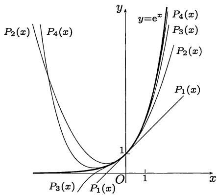

import Guide from '@/components/Guide.astro';
import Knowledge from '@/components/Knowledge.astro';
import Example from '@/components/Example.astro';
import Solution from '@/components/Solution.astro';
import Note from '@/components/Note.astro';
import Block from '@/components/Block.astro';
import Method from '@/components/Method.astro';

这一节主要是两个 $Taylor$ 公式 (也称为 $Taylor$ 展开式), 即分别带有 $Peano$ 余项和 $Lagrange$ 余项的 $Taylor$ 公式, 统称为 $Taylor$ 定理. 前者是上一章中的无穷小增量公式的推广, 而后者是 $Lagrange$ 中值定理 (即有限增量公式) 的推广.

$Taylor$ 定理的内容和证明对初学者有一定的困难. 仅仅从两个公式的复杂形式看, 就有点使人望而生畏. 因此我们将对它们的内容和证明做一定的剖析. 实际上这里的根本问题就是怎样用多项式来逼近函数. 但是从方法上来说, 则只是上一节中已用过多次的方法的重复 (参见例题 $7.1.3$ 的两个证明).

在以上内容的基础上, 本节还要介绍带 $Cauchy$ 余项的 $Taylor$ 公式. 在 $7.2.3$ 小节中将介绍 $Euler$ 数和 $Bernoulli$ 数, 以供读者参考.

## $7.2.1$ 基本定理

这里要解决的基本问题就是用多项式来逼近一个函数.

实际上, 如果局限于一次多项式, 即线性函数, 则在前面已经讨论过这个问题. 回顾第六章中的无穷小增量公式 ($6.1$), 可见它就是用线性函数 $f(x_0) + f'(x_0)(x - x_0)$ 来逼近 $f(x)$ . 例题 $6.1.3$ 则严格建立了这个函数在所有线性函数中在一定意义上所具有的最优性质.

命题 $7.2.2$ 可看成是公式 ($6.1$) 的推广. 命题 $7.2.5$ 则是例题 $6.1.3$ 的推广.

为此先做一项准备工作, 即证明在下列意义上于某点 $x_0$ 附近逼近一个函数 $f(x)$ 的多项式如果存在, 则一定是唯一的.

<Knowledge title="命题 $7.2.1$ (唯一性引理)">
设 $f$ 在点 $x_{0}$ 的某邻域 $O(x_{0})$ 上有定义, 且有

$$
f (x) = c _ {0} + c _ {1} (x - x _ {0}) + \dots + c _ {n} (x - x _ {0}) ^ {n} + o ((x - x _ {0}) ^ {n}) (x \rightarrow x _ {0}),
$$

则其中的系数 $c_{0}, c_{1}, \cdots, c_{n}$ 是唯一确定的.

<Solution title="证明">
根据条件可以知道以下表达式右边的极限都是存在的. 又根据极限的唯一性定理, 可见所有这些系数都是唯一确定的.

$$
\begin{array}{l} c _ {0} = \lim _ {x \to x _ {0}} f (x), \\ c _ {1} = \lim _ {x \to x _ {0}} \frac {f (x) - c _ {0}}{x - x _ {0}}, \\ \dots\dots\\ c _ {n} = \lim _ {x \to x _ {0}} \frac {f (x) - [ c _ {0} + c _ {1} (x - x _ {0}) + \cdots + c _ {n - 1} (x - x _ {0}) ^ {n - 1} ]}{(x - x _ {0}) ^ {n}}. \end{array}
$$
</Solution>
</Knowledge>

下面的第一个 $Taylor$ 公式, 即带有 $Peano$ 余项的 $Taylor$ 公式, 肯定了当函数 $f(x)$ 在点 $x_0$ 有 $n$ 阶导数时, 满足唯一性引理的条件的 $n$ 次多项式是存在的, 同时还给出了系数 $c_0, c_1, \cdots, c_n$ 的计算公式.

<Knowledge title="命题 $7.2.2$（带 $Peano$ 余项的 $Taylor$ 公式）">
若函数 $f$ 在点 $x_0$ 存在 $n$ 阶导数 $f^{(n)}(x_0)$ ，则有

$$
\begin{array}{l}f (x) = f (x _ {0}) + f ^ {\prime} (x _ {0}) (x - x _ {0}) + \frac {f ^ {\prime \prime} (x _ {0})}{2 !} (x - x _ {0}) ^ {2} + \dots\\\qquad + \frac {f ^ {(n)} (x _ {0})}{n !} (x - x _ {0}) ^ {n} + o ((x - x _ {0}) ^ {n}) (x \rightarrow x _ {0}).\end{array}
$$

<Solution title="证明">
首先要对于条件有准确的理解. 从函数 $f$ 在点 $x_0$ 有 $n$ 阶导数可推出 $f$ 在该点的某邻域上存在所有的 $k (< n)$ 阶导函数, 但是 $f^{(n)}(x)$ 只知在点 $x_0$ 存在.

引入多项式

$$
p _ {n} (x) = f (x _ {0}) + f ^ {\prime} (x _ {0}) (x - x _ {0}) + \frac {f ^ {\prime \prime} (x _ {0})}{2 !} (x - x _ {0}) ^ {2} + \dots + \frac {f ^ {(n)} (x _ {0})}{n !} (x - x _ {0}) ^ {n}\tag{7.18}
$$

和

$$
r _ {n} (x) = f (x) - p _ {n} (x).\tag{7.19}
$$

今后称多项式 $p_n(x)$ 为 $f(x)$ 在点 $x_0$ 处的 $n$ 阶 $Taylor$ 多项式, 称 $r_n(x)$ 为 (第 $n$ 次) 余项, 即用多项式 $p_n(x)$ 代替 $f(x)$ 所带来的误差项.

可以看出, 证明的目的只不过是要建立以下的极限关系:

$$
\lim _ {x \to x _ {0}} \frac {r _ {n} (x)}{(x - x _ {0}) ^ {n}} = 0.\tag{7.20}
$$

由 ($7.19$) 可见, 余项的可微性质与 $f$ 完全相同. 直接验证以下等式 (具体计算从略),

$$
p _ {n} (x _ {0}) = f (x _ {0}), p _ {n} ^ {\prime} (x _ {0}) = f ^ {\prime} (x _ {0}), \dots , p _ {n} ^ {(n)} (x _ {0}) = f ^ {(n)} (x _ {0}),\tag{7.21}
$$

就知道余项 $r_n(x)$ 满足条件

$$
r _ {n} (x _ {0}) = 0, r _ {n} ^ {\prime} (x _ {0}) = 0, \dots , r ^ {(n)} (x _ {0}) = 0.\tag{7.22}
$$

反复使用 $Cauchy$ 中值定理并在最后令 $x \to x_0$ ，就可以得到所要的结果：

$$
\begin{array}{r l} \frac {r _ {n} (x)}{(x - x _ {0}) ^ {n}} & = \frac {r _ {n} (x) - r _ {n} (x _ {0})}{(x - x _ {0}) ^ {n}} = \frac {r _ {n} ^ {\prime} (\xi_ {1})}{n (\xi_ {1} - x _ {0}) ^ {n - 1}} \\ & = \frac {r _ {n} ^ {\prime} (\xi_ {1}) - r _ {n} ^ {\prime} (x _ {0})}{n (\xi_ {1} - x _ {0}) ^ {n - 1}} = \frac {r _ {n} ^ {\prime \prime} (\xi_ {2})}{n (n - 1) (\xi_ {2} - x _ {0}) ^ {n - 2}} \\ & \dots\dots\\ & = \frac {r _ {n} ^ {(n - 1)} (\xi_ {n - 1}) - r _ {n} ^ {(n - 1)} (x _ {0})}{n ! (\xi_ {n - 1} - x _ {0})} \to \frac {r ^ {(n)} (x _ {0})}{n !} = 0 (x \to x _ {0}). \end{array}
$$

这里依次利用了余项 $r_{n}(x)$ 所具有的性质 ($7.22$) 中的每一个等式。在反复使用 $Cauchy$ 中值定理时得到的“中值” $\xi_{1}, \xi_{2}, \cdots, \xi_{n-1}$ 是在 $x$ 与 $x_{0}$ 之间的单调点列。例如当 $x_{0} < x$ 时，从上面的推导可以看出有

$$
x _ {0} <   \xi_ {n - 1} <   \dots <   \xi_ {2} <   \xi_ {1} <   x.
$$

因此当 $x \to x_0$ 时也有 $\xi_{n-1} \to x_0$ .

还要注意最后一步与前面不同. 由于只知道 $r_n(x)$ 在点 $x_0$ 处有 $n$ 阶导数, 所以最后一步不能用中值定理, 而只能用定义, 也就是说, 导数 $r_n^{(n)}(x_0)$ 是 $r_n(x)$ 的 $n - 1$ 阶导函数 $r_n^{(n - 1)}(x)$ 在点 $x_0$ 处的导数.
</Solution>

<Note>
称 $r_n(x) = o((x - x_0)^n)(x \to x_0)$ 为 $Peano$ (型) 余项. 容易看出当 $n = 1$ 时带 $Peano$ 余项的 $Taylor$ 公式就是上一章中的无穷小增量公式 ($6.1$). 由于这样的公式并非普通的等式, 而是反映了极限性质的渐近等式, 因此带有 $Peano$ 余项的 $Taylor$ 公式在求极限时很有用处, 对余项可以提供无穷小量的阶的估计. 但是 $Peano$ 余项并不能提供误差的定量估计. 带 $Peano$ 余项的 $Taylor$ 公式的这些特点与无穷小增量公式 ($6.1$) 完全相同. 因此可以将它称为局部 $Taylor$ 公式.
</Note>

<Note>
带 $Peano$ 余项的 $Taylor$ 公式的证明方法很多, 例如, 用数学归纳法、中值定理和下一章的 $L'Hospital$ 法则 (见例题 $8.1.5$) 都可以给出证明.
</Note>
</Knowledge>

现在给出第二个 $Taylor$ 公式. 在其中的余项有确定的表达式. 这就为误差估计提供了理论依据. 当然, 其中也有不确定的因素, 即出现了在每个中值定理中都有的“中值”. 因此这个结果也可以称为 $Taylor$ 中值定理. 读者可以看出, 在下面的公式中若 $n = 0$ , 则就是 $Lagrange$ 中值定理. 如果将 $Cauchy$ 中值定理看成是 $Lagrange$ 中值定理在两个函数情况的推广, 则 $Taylor$ 中值定理就是 $Lagrange$ 中值定理在高阶导数情况的推广.

<Knowledge title="命题 $7.2.3$（带 $Lagrange$ 余项的 $Taylor$ 公式）">
若 $f$ 在点 $x_0$ 的某邻域 $O(x_0)$ 上 $n + 1$ 阶可微，则对每个 $x \in O(x_0), x \neq x_0$ ，在 $x_0$ 和 $x$ 之间存在 $\xi$ ，使得

$$
f (x) = f \left(x _ {0}\right) + f ^ {\prime} \left(x _ {0}\right) \left(x - x _ {0}\right) + \frac {f ^ {\prime \prime} \left(x _ {0}\right)}{2 !} \left(x - x _ {0}\right) ^ {2} + \dots + \frac {f ^ {(n)} \left(x _ {0}\right)}{n !} \left(x - x _ {0}\right) ^ {n} + r _ {n} (x),
$$

$$
r _ {n} (x) = \frac {f ^ {(n + 1)} (\xi)}{(n + 1) !} (x - x _ {0}) ^ {n + 1}.
$$

<Solution title="证明 1">
可以与带 $Peano$ 余项的 $Taylor$ 公式的上述证明几乎一样来做, 即反复使用 $Cauchy$ 中值定理, 但在最后一次是用 $Lagrange$ 中值定理. 原因是在这里的函数 $f(x)$ (因而 $r_n(x)$ ) 在邻域 $O(x_0)$ 上有 $n + 1$ 阶导函数, 条件要强得多了. 证明的主要过程如下:

$$
\begin{array}{l} \frac {r _ {n} (x)}{(x - x _ {0}) ^ {n + 1}} = \frac {r _ {n} (x) - r _ {n} (x _ {0})}{(x - x _ {0}) ^ {n + 1}} = \frac {r _ {n} ^ {\prime} (\xi_ {1})}{(n + 1) (\xi_ {1} - x _ {0}) ^ {n}} \\ \qquad = \frac {r _ {n} ^ {\prime} (\xi_ {1}) - r _ {n} ^ {\prime} (x _ {0})}{(n + 1) (\xi_ {1} - x _ {0}) ^ {n}} = \frac {r _ {n} ^ {\prime \prime} (\xi_ {2})}{(n + 1) n (\xi_ {2} - x _ {0}) ^ {n - 1}} \\ \qquad \dots \dots \\ \qquad = \frac {r _ {n} ^ {(n)} (\xi_ {n}) - r _ {n} ^ {(n)} (x _ {0})}{(n + 1) ! (\xi_ {n} - x _ {0})} = \frac {r ^ {(n + 1)} (\xi)}{(n + 1) !}. \end{array}
$$
</Solution>

<Solution title="证明 2">
回顾例题 $7.1.3$ 的两种不同方法, 可以知道用辅助函数方法也能成功. 实际上, 在那里已经分析过这两个方法, 它们在本质上是完全一样的. 下面就是用辅助函数方法证明第二个 $Taylor$ 公式.

对给定的 $x \neq x_0$ , 定义

$$
\lambda = \frac {r _ {n} (x) (n + 1) !}{(x - x _ {0}) ^ {n + 1}}.
$$

于是只要证明在 $x$ 和 $x_0$ 之间存在 $\xi$ , 使得

$$
r _ {n} ^ {(n + 1)} (\xi) = \lambda
$$

即可. 不妨只考虑 $x_0 < x$ 的情况. 现在固定 $x$ , 在区间 $[x_0, x]$ 上构造辅助函数

$$
F (t) = r _ {n} (t) - \frac {\lambda}{(n + 1) !} (t - x _ {0}) ^ {n + 1}, x _ {0} \leqslant t \leqslant x.
$$

可见只要证明存在 $\xi \in (x_0, x)$ , 使得 $F^{(n+1)}(\xi) = 0$ .

从条件 ($7.22$) 和 $\lambda$ 的定义知, 辅助函数 $F$ 具有性质

$$
F (x _ {0}) = 0, F ^ {\prime} (x _ {0}) = 0, \dots , F ^ {(n)} (x _ {0}) = 0   \text { 和 }   F (x) = 0.
$$

在区间 $[x_0, x]$ 上对 $F$ 用 $Rolle$ 定理, 有 $\xi_1 \in (x_0, x)$ , 使得 $F'(\xi_1) = 0$ . 然后由于 $F'(x_0) = 0$ , 在区间 $[x_0, \xi_1]$ 上对 $F'$ 用 $Rolle$ 定理, 有 $\xi_2 \in (x_0, \xi_1)$ , 使得 $F''(\xi_2) = 0$ . 这样进行下去, 在做了 $n$ 次后, 就有

$$
x _ {0} <   \xi_ {n} <   \xi_ {n - 1} <   \dots <   \xi_ {1} <   x
$$

以及 $F^{(n)}(\xi_n) = 0$ 。最后再利用 $F^{(n)}(x_0) = 0$ ，在区间 $[x_0, \xi_n]$ 上对 $F^{(n)}(x)$ 用 $Rolle$ 定理，就得到 $\xi \in (x_0, \xi_n) \subset (x_0, x)$ ，使得 $F^{(n+1)}(\xi) = 0$ 。这样我们就完成了命题的证明。
</Solution>

<Note>
在上述命题中我们要求 $x \neq x_0$ 。实际上在 $x = x_0$ 时 $Taylor$ 公式自然成立, 这时的中值 $\xi$ 可以任取。此外, 从证明可以看出, 并不要求 $f^{(n+1)}(x_0)$ 存在, 也就是说只要 $f$ 在 $O(x_0)$ 上 $n$ 阶可微, 又在 $O(x_0) - \{x_0\}$ 上存在 $f^{(n+1)}(x)$ 即可。这对下一个命题也是如此。
</Note>
</Knowledge>

以上介绍了余项的两种不同形式, 即 $Peano$ 余项和 $Lagrange$ 余项. 实际上还有很多不同的其他余项形式, 其中对今后较为有用的是 $Cauchy$ 余项和积分型余项. 后者见 $11.4.3$ 小节. 下面是 $Cauchy$ 余项及其证明.

<Knowledge title="命题 $7.2.4$（带 $Cauchy$ 余项的 $Taylor$ 公式）">
若 $f$ 在点 $x_0$ 的某邻域 $O(x_0)$ 上 $n + 1$ 阶可微，则对每个 $x \in O(x_0), x \neq x_0$ ，在 $x_0$ 和 $x$ 之间存在 $\eta$ ，使得

$$
f (x) = f \left(x _ {0}\right) + f ^ {\prime} \left(x _ {0}\right) \left(x - x _ {0}\right) + \dots + \frac {f ^ {(n)} \left(x _ {0}\right)}{n !} \left(x - x _ {0}\right) ^ {n} + r _ {n} (x),
$$

其中

$$
r _ {n} (x) = \frac {f ^ {(n + 1)} (\eta)}{n !} (x - \eta) ^ {n} (x - x _ {0}).
$$

<Solution title="证明">
固定 $x$ ，在余项

$$
\begin{array}{r l} & {r _ {n} (x) = f (x) - p _ {n} (x)} \\ & {\qquad = f (x) - [ f (x _ {0}) + f ^ {\prime} (x _ {0}) (x - x _ {0}) + \dots + \frac {f ^ {(n)} (x _ {0})}{n !} (x - x _ {0}) ^ {n} ]} \end{array}
$$

的右边将 $x_0$ 换为变量 $t \in [x_0, x]$ , 定义函数

$$
\varPhi (t) = f (x) - [ f (t) + f ^ {\prime} (t) (x - t) + \dots + \frac {f ^ {(n)} (t)}{n !} (x - t) ^ {n} ].
$$

可以看出有

$$
\Phi (x _ {0}) = r _ {n} (x), \Phi (x) = 0.
$$

通过直接计算可以得到

$$
\Phi^ {\prime} (t) = - \frac {f ^ {(n + 1)} (t)}{n !} (x - t) ^ {n}.
$$

在区间 $[x_0, x]$ 上对 $\Phi(t)$ 用 $Lagrange$ 中值定理, 就有 $\eta \in (x, x_0)$ , 使得

$$
r _ {n} (x) = \Phi (x _ {0}) - \Phi (x) = \Phi^ {\prime} (\eta) (x _ {0} - x).
$$

将 $\Phi'(\eta)$ 的表达式代入就得到所要求证的 $Cauchy$ 余项.
</Solution>

<Note>
用这个方法也可以得到其他余项形式 (见 [14] 的第一卷 $126$ 小节).
</Note>
</Knowledge>

到此为止本小节已介绍了 $Taylor$ 公式的主要理论. 我们看到, 若函数 $f(x)$ 在点 $x_0$ 有 $n$ 阶导数, 则就有一个 $n$ 次多项式 ($7.18$), 即 $Taylor$ 多项式, 它与 $f(x)$ 的差 (即余项 ($7.19$)) 当 $x \to x_0$ 时是比 $(x - x_0)^n$ 更高阶的无穷小量. 命题 $7.2.1$ 肯定了这样的多项式是唯一的, 命题 $7.2.2$ 则解决了它的存在性. 命题 $7.2.3$ 和 $7.2.4$ 给出了余项的更为精确的表达式, 当然这时对 $f$ 要有更多的条件.

可将例题 $6.1.3$ 推广得到下列命题. 它确切地刻画了 $Taylor$ 多项式在局部逼近方面的最优性质.

<Knowledge title="命题 $7.2.5$ ($Taylor$ 多项式的逼近性质)">
设函数 $f$ 在点 $x_{0}$ 存在 $f^{(n)}(x_{0})$ , $p_{n}(x)$ 是由公式 ($7.18$) 定义的 $Taylor$ 多项式. 对于和 $p_{n}(x)$ 不相等的每一个不超过 $n$ 次的多项式 $p(x)$ , 存在 $\delta > 0$ , 使得当 $0 < |x - x_{0}| < \delta$ 时, 成立不等式

$$
| f (x) - p _ {n} (x) | <   | f (x) - p (x) |.
$$

<Solution title="证明">
先将给定的多项式 $p(x)$ 转换成用 $(x - x_0)$ 的方幂表示的升幂多项式:

$$
p (x) = a _ {0} + a _ {1} \left(x - x _ {0}\right) + \dots + a _ {n} \left(x - x _ {0}\right) ^ {n}.\tag{7.23}
$$

根据命题 $7.2.2$, 可以将 $p(x)$ 看成那里的 $f(x)$ , 然后用公式 ($7.21$) 直接求出 $a_i = p^{(i)}(x_0)/i!, i = 0, 1, \cdots, n$ . (当然也可以用代数方法计算, 这里从略.)

将 ($7.23$) 与 $Taylor$ 多项式

$$
p _ {n} (x) = f (x _ {0}) + f ^ {\prime} (x _ {0}) (x - x _ {0}) + \frac {f ^ {\prime \prime} (x _ {0})}{2 !} (x - x _ {0}) ^ {2} + \dots + \frac {f ^ {(n)} (x _ {0})}{n !} (x - x _ {0}) ^ {n}
$$

进行比较. 如果 $a_0 \neq f(x_0)$ , 则同例题 $6.1.3$ 的情况 ($1$) 完全一样, 证明是容易的. 否则, 根据这两个多项式不相等的假设条件, 两者又均已表示为以 $(x - x_0)$ 为幂次的升幂多项式, 因此一定存在一个正整数 $k$ , 满足 $0 < k \leqslant n$ 和

$a_{0}=f(x_{0}),\cdots,a_{k-1}=f^{(k-1)}(x_{0})/(k-1)!$ ，但是 $a_{k}\neq f^{(k)}(x_{0})/k!$

利用命题 $7.2.2$ (即带 $Peano$ 余项的 $Taylor$ 公式), 有

$$
\begin{array}{r l}&f (x) - p _ {n} (x) = o \left((x - x _ {0}) ^ {n}\right) (x \rightarrow x _ {0}),\\&f (x) - p (x) = [ f (x) - p _ {n} (x) ] + [ p _ {n} (x) - p (x) ]\\&\qquad = [ f ^ {(k)} (x _ {0}) / k! - a _ {k} ] (x - x _ {0}) ^ {k} + o \left((x - x _ {0}) ^ {k}\right) (x \rightarrow x _ {0}).\end{array}
$$

其中的项 $o\left((x - x_0)^k\right)$ 是对于在多项式 $[p_n(x) - p(x)]$ 中次数 $i > k$ 的所有 $(x - x_0)^i$ 项和余项 $f(x) - p_n(x)$ 之和的一个刻画.

于是有

$$
\frac {f (x) - p _ {n} (x)}{f (x) - p (x)} = \frac {o ((x - x _ {0}) ^ {n})}{[ f ^ {(k)} (x _ {0}) / k ! - a _ {k} ] (x - x _ {0}) ^ {k} + o ((x - x _ {0}) ^ {k})} (x \rightarrow x _ {0}).
$$

由于 $f^{(k)}(x_0) / k! \neq a_k$ 和 $k \leqslant n$ , 可见

$$
\frac {f (x) - p _ {n} (x)}{f (x) - p (x)} = o (1) (x \rightarrow x _ {0}).
$$

从而存在 $\delta > 0$ , 使得当 $0 < |x - x_0| < \delta$ 时, 成立

$$
\left| \frac {f (x) - p _ {n} (x)}{f (x) - p (x)} \right| <   1,
$$

这就是所要求证的不等式.
</Solution>
</Knowledge>

在图 $7.6$ 中可以看到函数 $\mathbf{e}^x$ 以及它的 $1$ 次到 $4$ 次的 $Taylor$ 多项式的图像, 其中粗黑曲线是 $\mathbf{e}^x$ 的图像. 又为清楚起见, 在每一个 $Taylor$ 多项式的图像两端都用记号 $P_{n}(x)$ 作了标记. 这里的 $P_{n}(x)$ 是 $\mathbf{e}^x$ 在点 $x = 0$ 处的 $n$ 阶 $Taylor$ 多项式:

$$
1 + x + \frac {x ^ {2}}{2 !} + \frac {x ^ {3}}{3 !} + \dots + \frac {x ^ {n}}{n !}.
$$

  
图 $7.6$

我们看到, 对于 $n = 3,4$ , $Taylor$ 多项式在 $|x|$ 不很大时已提供了对 $\mathbf{e}^x$ 的较好的逼近. 但是当 $|x|$ 足够大时, 情况完全不是如此. 例如, 当 $n$ 为奇数时 $P_{n}(x)$ 都有零点. 关于 $\mathbf{e}^x$ 的 $Taylor$ 多项式的一般性结论可参看第八章的第二组参考题 $4$.

## $7.2.2$ 例题

当 $Taylor$ 公式中的点 $x_0 = 0$ 时, 由于历史原因也称为 $Maclaurin$ 公式. 在各种微积分教科书中都要介绍几个基本初等函数的 $Maclaurin$ 公式, 其中包括 $\sin x, \cos x, \arctan x, e^x, \ln(1 + x), (1 + x)^{\alpha} (\alpha \neq 0)$ 等, 这里不再重复.

在求以上几个基本初等函数的 $Maclaurin$ 公式时, 一般的方法是直接计算函数在点 $x = 0$ 处的 $n$ 阶导数的通式, 这样就可以得到带 $Peano$ 余项的 $Maclaurin$ 公式. 为了得到带 $Lagrange$ 余项的相应公式, 则需要得到 $n$ 阶导函数的表达式, 这就困难得多了. 在上一章中关于高阶导数的不少训练与此有关.

在本小节介绍求 $Taylor$ (或 $Maclaurin$) 公式的间接法. 这在很多求 $Taylor$ 公式的问题中有效, 且具有很大的灵活性. 实际上, $\ln (1 + x)$ 和 $\arctan x$ 的 $Maclaurin$ 公式也都可以用间接法得到. 但是间接法是以若干个已知的 $Taylor$ 公式为基础的. 如果连基本的 $Taylor$ 公式都不知道, 也就不可能用间接法.

在本小节中除了 $Taylor$ 公式的计算外, 还将介绍 $Taylor$ 公式的其他应用, 特别是不能归入下一章的一些问题.

在下面有关 $Taylor$ (或 $Maclaurin$) 公式的计算题中, 如不另作说明, 则均指带 $Peano$ 余项的公式.

<Example title="例题 $7.2.1$">
计算 $f(x)=\arcsin x$ 的 $Maclaurin$ 公式直到 $x^{5}$ 项.

<Solution title="解 1">
对 $f$ 求导, 并利用二项式展开公式, 就有

$$
f ^ {\prime} (x) = \left(1 - x ^ {2}\right) ^ {- \frac {1}{2}} = 1 + \frac {1}{2} x ^ {2} + \frac {3}{8} x ^ {4} + o (x ^ {5}) (x \rightarrow 0).
$$

根据上一小节的唯一性引理和带 $Peano$ 余项的 $Taylor$ 公式, 可见上式就是 $f'(x)$ 的 $Maclaurin$ 公式. 利用 $Taylor$ 公式中的系数公式, 就可以从上式右边的已知系数反过来求出 $f'(x)$ 在 $x = 0$ 处的值和各阶导数值:

$$
1 = f ^ {\prime} (0), 0 = f ^ {\prime \prime} (0), \frac {1}{2} = \frac {f ^ {\prime \prime \prime} (0)}{2}, 0 = f ^ {(4)} (0), \frac {3}{8} = \frac {f ^ {(5)} (0)}{4 !}, 0 = f ^ {(6)} (0).
$$

这样就求出所需要的前 $6$ 阶导数:

$$
f ^ {\prime} (0) = 1, f ^ {\prime \prime} (0) = 0, f ^ {\prime \prime \prime} (0) = 1, f ^ {(4)} (0) = 0, f ^ {(5)} (0) = 9, f ^ {(6)} (0) = 0.
$$

再利用 $f(0)=0$ ，就得到所要的 $Maclaurin$ 公式：

$$
\begin{array}{r l} & {\arcsin x = x + \frac {1}{3 !} x ^ {3} + \frac {9}{5 !} x ^ {5} + o (x ^ {6})} \\ & {\qquad = x + \frac {1}{6} x ^ {3} + \frac {3}{4 0} x ^ {5} + o (x ^ {6}) (x \to 0).} \end{array}
$$
</Solution>

<Note>
若将以上的解法发展一步, 就可以写出 $\arcsin x$ 的一般的 $Maclaurin$ 公式, 而无须求出这个函数在 $x = 0$ 处的任意阶导数值. 再往前一步, 我们可以提出求高阶导数的一种间接计算法. 从 $f(x) = \arcsin x$ 的导函数出发, 计算

$$
\begin{array}{l}f ^ {\prime} (x) = \left(1 - x ^ {2}\right) ^ {- \frac {1}{2}}\\= 1 + \sum_ {k = 1} ^ {n} \frac {\left(- \frac {1}{2}\right) \left(- \frac {3}{2}\right) \cdots \left(- \frac {1}{2} - k + 1\right)}{k !} (- x ^ {2}) ^ {k} + o (x ^ {2 k + 1})\\= 1 + \sum_ {k = 1} ^ {n} \frac {(2 k - 1) ! !}{2 ^ {k} k !} x ^ {2 k} + o (x ^ {2 k + 1}) (x \rightarrow 0),\end{array}
$$

就可以对任意正整数 $k$ 得到 $f^{(2k)}(0) = 0$ 和

$$
f ^ {(2 k + 1)} (0) = (2 k)! \frac {(2 k - 1) ! !}{2 ^ {k} k !} = [ (2 k - 1)!! ] ^ {2}.
$$

这就是在例题 $6.2.3$ 已经得到的结果.

请读者试用这种新方法计算 $\arctan x$ 和 $\ln (1 + x)$ 的 $Maclaurin$ 公式和它们在 $x = 0$ 处的任意阶导数值.
</Note>

<Solution title="解 2">
由于 $f(x) = \arcsin x$ 是奇函数, 又有 $f'(0) = 1$ , 因此它的 $Maclaurin$ 公式的形式如下:

$$
\arcsin x = x + a x ^ {3} + b x ^ {5} + o (x ^ {6}) (x \rightarrow 0).
$$

这里只有两个系数 $a$ 和 $b$ 需要确定. 利用 $\arcsin x$ 是 $\sin x$ 的反函数, 又利用 $\sin x$ 的 $Maclaurin$ 公式, 就有

$$
\begin{array}{r l}&{x = \sin (\arcsin x)}\\&{\quad = \arcsin x - \frac {1}{6} (\arcsin x) ^ {3} + \frac {1}{1 2 0} (\arcsin x) ^ {5} + o (x ^ {6})}\\&{\quad = (x + a x ^ {3} + b x ^ {5}) - \frac {1}{6} (x + a x ^ {3}) ^ {3} + \frac {1}{1 2 0} x ^ {5} + o (x ^ {6}) (x \rightarrow 0).}\end{array}
$$

比较两边同次幂项的系数, 就有方程

$$
a - \frac {1}{6} = 0, b - \frac {1}{6} \cdot 3 a + \frac {1}{1 2 0} = 0.
$$

这样就可解出

$$
a = \frac {1}{6}, b = \frac {3}{4 0}.
$$
</Solution>
</Example>

<Example title="例题 $7.2.2$">
计算 $f(x)=\sqrt[3]{2-\cos x}$ 的 $Maclaurin$ 公式直到 $x^{5}$ 项.

<Solution title="解 1">
将根式内的表达式写成 $1 + (1 - \cos x)$ ，并利用

$$
1 - \cos x = \frac {x ^ {2}}{2} - \frac {x ^ {4}}{2 4} + o (x ^ {5}) (x \to 0),
$$

就可以计算如下:

$$
\begin{array}{r l} & {f (x) = \sqrt [ 3 ]{1 + (1 - \cos x)}} \\ & {\qquad = 1 + \frac {1 - \cos x}{3} - \frac {(1 - \cos x) ^ {2}}{9} + O ((1 - \cos x) ^ {3})} \\ & {\qquad = 1 + \left(\frac {x ^ {2}}{6} - \frac {x ^ {4}}{7 2}\right) - \frac {x ^ {4}}{3 6} + o (x ^ {5})} \\ & {\qquad = 1 + \frac {x ^ {2}}{6} - \frac {x ^ {4}}{2 4} + o (x ^ {5}) (x \to 0).} \end{array}
$$
</Solution>

<Solution title="解 2">
利用 $f$ 为偶函数, 因此所要求的公式的形状已可确定为

$$
f (x) = 1 + a x ^ {2} + b x ^ {4} + o (x ^ {5}) (x \to 0).
$$

为确定 $a$ 和 $b$ , 只要将上式代入

$$
[ f (x) ] ^ {3} = 2 - \cos x = 1 + \frac {x ^ {2}}{2} - \frac {x ^ {4}}{2 4} + o (x ^ {5}) (x \to 0),
$$

就得到关于待定系数的方程

$$
3 a = \frac {1}{2}, 3 b + 3 a ^ {2} = - \frac {1}{2 4}.
$$

从中解出

$$
a = \frac {1}{6}, b = - \frac {1}{2 4}.
$$
</Solution>
</Example>

<Example title="例题 $7.2.3$">
计算 $f(x) = \ln \frac{\sin x}{x}$ 的 $Maclaurin$ 公式直到 $x^6$ 项. 这里 $f(x)$ 在 $x = 0$ 的值用函数在该点的极限值 $0$ 来定义.

<Solution title="解">
从正弦函数的展开式开始, 有

$$
\sin x = x - \frac {1}{3 !} x ^ {3} + \frac {1}{5 !} x ^ {5} - \frac {1}{7 !} x ^ {7} + o (x ^ {8}) (x \rightarrow 0),
$$

就有

$$
{\frac {\sin x}{x}} = 1 - {\frac {1}{3 !}} x ^ {2} + {\frac {1}{5 !}} x ^ {4} - {\frac {1}{7 !}} x ^ {6} + o (x ^ {7}) (x \to 0).
$$

记 $y = -\frac{1}{3!} x^2 + \frac{1}{5!} x^4 - \frac{1}{7!} x^6 + o(x^7) (x \to 0)$ , 则 $y = O(x^2) (x \to 0)$ . 然后有

$$
\begin{array}{r l} & {\ln \frac {\sin x}{x} = \ln (1 + y)} \\ & {\quad = y - \frac {1}{2} y ^ {2} + \frac {1}{3} y ^ {3} + O (y ^ {4})} \\ & {\quad = \left(- \frac {1}{3 !} x ^ {2} + \frac {1}{5 !} x ^ {4} - \frac {1}{7 !} x ^ {6}\right) - \frac {1}{2} \left(\frac {1}{3 6} x ^ {4} - \frac {2}{3 ! 5 !} x ^ {6}\right) + \frac {1}{3} \left(- \frac {1}{2 1 6} x ^ {6}\right) + o (x ^ {7})} \\ & {\quad = - \frac {1}{6} x ^ {2} - \frac {1}{1 8 0} x ^ {4} - \frac {1}{2 8 3 5} x ^ {6} + o (x ^ {7}) (x \to 0).} \end{array}
$$
</Solution>
</Example>

<Example title="例题 $7.2.4$">
设已知函数 (参考图 $4.1$)

$$
f (x) = \left\{ \begin{array}{l l} (1 + x) ^ {\frac {1}{x}}, & x \neq 0, \\ \mathrm{e}, & x = 0 \end{array} \right.
$$

在 $x = 0$ 无穷次可微, 计算 $f(x)$ 的 $Maclaurin$ 公式直到 $x^4$ 项.

<Solution title="解">
在 $x \neq 0$ 时, 将函数 $f$ 写为

$$
f (x) = \exp (\ln f (x)),
$$

然后写出

$$
\ln f (x) = \frac {\ln (1 + x)}{x} = 1 - \frac {x}{2} + \frac {x ^ {2}}{3} - \frac {x ^ {3}}{4} + \frac {x ^ {4}}{5} + o (x ^ {4}) (x \rightarrow 0).
$$

将上式右边记为 $1 + y$ ，就有

$$
f (x) = \mathrm{e} ^ {1 + y} = \mathrm{e} \cdot \mathrm{e} ^ {y} = \mathrm{e} \left(1 + y + \frac {y ^ {2}}{2 !} + \frac {y ^ {3}}{3 !} + \frac {y ^ {4}}{4 !}\right) + o (x ^ {4}) (x \rightarrow 0),
$$

其中

$$
y = - \frac {x}{2} + \frac {x ^ {2}}{3} - \frac {x ^ {3}}{4} + \frac {x ^ {4}}{5} + o (x ^ {4}) (x \rightarrow 0).
$$

分别计算出

$$
y ^ {2} = \frac {1}{4} x ^ {2} - \frac {1}{3} x ^ {3} + \frac {1 3}{3 6} x ^ {4} + o (x ^ {4}) (x \rightarrow 0),
$$

$$
y ^ {3} = - \frac {1}{8} x ^ {3} + \frac {1}{4} x ^ {4} + o (x ^ {4}) (x \to 0),
$$

$$
y ^ {4} = \frac {1}{1 6} x ^ {4} + o (x ^ {4}) (x \rightarrow 0),
$$

代入前面的表达式中, 最后得到

$$
f (x) = \mathrm{e} \left(1 - \frac {1}{2} x + \frac {1 1}{2 4} x ^ {2} - \frac {7}{1 6} x ^ {3} + \frac {2 4 4 7}{5 7 6 0} x ^ {4}\right) + o (x ^ {4}) (x \rightarrow 0).
$$
</Solution>

<Note>
在上面两个例题中都没有验证函数在 $x_0 = 0$ 处存在任意阶导数. 这是在使用间接法时经常会遇到的问题. 实际上这里涉及与幂级数 (或解析函数) 的四则运算和复合运算有关的一些理论问题, 在学幂级数之前作讨论是比较困难的. 因此在例题和练习题中我们将注意力集中在计算上, 而将有关的理论问题留待以后解决. 此外, 这里还从 $\sin x$ 和 $\ln(1 + x)$ 的 $Maclaurin$ 公式出发除以 $x$ , 得到函数 $\frac{\sin x}{x}$ 和 $\frac{\ln(1 + x)}{x}$ (在 $x = 0$ 处由极限定义) 的 $Maclaurin$ 公式, 这里的理论根据可在下一章得到解决 (见例题 $8.1.9$ 的第 $3$ 个注解). (对此有兴趣的读者还可以参考 [73] 中对于这些问题的严格处理.)
</Note>
</Example>

<Example title="例题 $7.2.5$">
设 $f$ 在 $(0, +\infty)$ 上二阶可微, 且已知

$$
M _ {0} = \sup \{| f (x) | \mid x \in (0, + \infty) \} \text {和} M _ {2} = \sup \{| f ^ {\prime \prime} (x) | \mid x \in (0, + \infty) \}
$$

为有限数. 证明 $M_{1} = \sup \{|f'(x)|\mid x\in (0, + \infty)\}$ 也是有限数, 并满足不等式

$$
M _ {1} \leqslant 2 \sqrt {M _ {0} M _ {2}}.
$$

<Solution title="证">
写出

$$
f (x + t) = f (x) + f ^ {\prime} (x) t + \frac {f ^ {\prime \prime} (\xi)}{2} t ^ {2},
$$

其中 $x, t > 0, \xi \in (x, x + t)$ . 由此有估计

$$
\left| t f ^ {\prime} (x) \right| \leqslant \left| f (x + t) - f (x) - \frac {t ^ {2}}{2} f ^ {\prime \prime} (\xi) \right| \leqslant 2 M _ {0} + \frac {t ^ {2}}{2} M _ {2}.
$$

这样就得到

$$
| f ^ {\prime} (x) | \leqslant \frac {2 M _ {0}}{t} + \frac {t}{2} M _ {2}.
$$

这对每个 $x \in (0, +\infty)$ 成立. 取上确界, 就有

$$
M _ {1} \leqslant \frac {2 M _ {0}}{t} + \frac {t}{2} M _ {2}.\tag{7.24}
$$

因此 $M_{1}$ 为有限数．由于这对每个 $t > 0$ 成立，为了得到最好的估计，可以取 $t = 2\sqrt{M_0 / M_2}$ ，使右边的和达到最小，即有

$$
M _ {1} \leqslant 2 \sqrt {M _ {0} M _ {2}}.
$$
</Solution>
</Example>

<Example title="例题 $7.2.6$">
设 $f$ 在 $[a, b]$ 上二阶可微. 证明: 存在 $\xi \in (a, b)$ , 使得

$$
f (a) - 2 f \left(\frac {a + b}{2}\right) + f (b) = \frac {1}{4} (b - a) ^ {2} f ^ {\prime \prime} (\xi).
$$

<Solution title="证">
写出 $f(a), f(b)$ 在点 $\frac{a + b}{2}$ 的 $Taylor$ 展开式:

$$
f (a) = f \left(\frac {a + \dot {b}}{2}\right) + f ^ {\prime} \left(\frac {a + b}{2}\right) \left(\frac {a - b}{2}\right) + \frac {1}{2} f ^ {\prime \prime} (\eta_ {1}) \left(\frac {b - a}{2}\right) ^ {2},
$$

$$
f (b) = f \left(\frac {a + b}{2}\right) + f ^ {\prime} \left(\frac {a + b}{2}\right) \left(\frac {b - a}{2}\right) + \frac {1}{2} f ^ {\prime \prime} (\eta_ {2}) \left(\frac {b - a}{2}\right) ^ {2},
$$

然后将两式相加, 就有

$$
f (a) - 2 f \left(\frac {a + b}{2}\right) + f (b) = \frac {1}{8} (b - a) ^ {2} [ f ^ {\prime \prime} (\eta_ {1}) + f ^ {\prime \prime} (\eta_ {2}) ].
$$

对 $f''$ 用 $Darboux$ 定理 (命题 $7.1.6$), 即有 $\xi \in (a, b)$ , 使得

$$
f ^ {\prime \prime} (\xi) = \frac {1}{2} [ f ^ {\prime \prime} (\eta_ {1}) + f ^ {\prime \prime} (\eta_ {2}) ].
$$
</Solution>

<Note>
本题的证明方法很多, 除了用 $Taylor$ 公式为主要工具的上述证明外, 这里再简述两种证明方法.

1. 令 $\lambda = \frac{f(a) + f(b) - 2f\left(\frac{a + b}{2}\right)}{\frac{(b - a)^2}{4}}$ ，构造辅助函数

$$
F (t) = f (t) + f (a) - 2 f \left(\frac {t + a}{2}\right) - \lambda \frac {(t - a) ^ {2}}{4},
$$

以下与例题 $7.1.3$ 相同.

2. 作辅助函数

$$
\varphi (x) = f \left(x + \frac {b - a}{2}\right) - f (x),
$$

然后考虑差 $\varphi \left(\frac{a + b}{2}\right) - \varphi (a)$ .
</Note>
</Example>

## $7.2.3$ $Euler$ 数与 $Bernoulli$ 数

在初等函数的 $Taylor$ 展开式中有几个例子, 如 $\sec x$ 和 $\tan x$ , 一般难以求出通式. 原因在于其中出现了著名的 $Euler$ 数和 $Bernoulli$ 数.

<Example title="例题 $7.2.7$">
计算 $\sec x$ 的 $Maclaurin$ 展开式.

<Solution title="解">
由于 $\sec x$ 是偶函数, 可以假定有

$$
\sec x = c _ {0} + c _ {2} x ^ {2} + c _ {4} x ^ {4} + \dots + c _ {2 n} x ^ {2 n} + o (x ^ {2 n + 1}) (x \rightarrow 0).
$$

现在令

$$
c _ {2 n} = (- 1) ^ {n} \frac {E _ {2 n}}{(2 n) !}, n \in \mathbf {N} _ {+},
$$

写出

$$
\sec x = E _ {0} - \frac {E _ {2}}{2 !} x ^ {2} + \frac {E _ {4}}{4 !} x ^ {4} + \dots + (- 1) ^ {n} \frac {E _ {2 n}}{(2 n) !} x ^ {2 n} + o (x ^ {2 n + 1}) (x \rightarrow 0).\tag{7.25}
$$

将公式 ($7.25$) 和 $\cos x$ 的 $Maclaurin$ 公式一起代入恒等式 $\cos x \sec x \equiv 1$ 中, 就可以得到确定数列 $\{E_{2n}\}$ 的递推公式:

$$
E _ {0} = 1, E _ {2} + E _ {0} = 1, E _ {4} + \frac {4 !}{2 ! 2 !} E _ {2} + E _ {0} = 0,
$$

$$
E _ {2 n} + \binom {2 n} {2} E _ {2 n - 2} + \binom {2 n} {4} E _ {2 n - 4} + \dots + E _ {0} = 0.
$$

从而可以得出

$$
E _ {2} = - 1, E _ {4} = 5, E _ {6} = - 6 1, E _ {8} = 1 3 8 5, E _ {1 0} = - 5 0 5 2 1, \dots .
$$

例如, 这样就可以写出直到前 $6$ 项系数的公式:

$$
\sec x = 1 + \frac {x ^ {2}}{2} + \frac {5}{2 4} x ^ {4} + \frac {6 1}{7 2 0} x ^ {6} + \frac {2 7 7}{8 0 6 4} x ^ {8} + \frac {5 0 5 2 1}{3 6 2 8 8 0 0} x ^ {1 0} + o (x ^ {1 1}) (x \to 0).
$$

称 $E_{2n}$ 为 $Euler$ 数. 当 $n$ 为偶数时, $E_{2n}$ 为正奇数, 且除 $E_0$ 外, 其个位数字都是 $5$; 当 $n$ 为奇数时, $E_{2n}$ 为负奇数, 其个位数字都是 $1$.
</Solution>

<Note>
又有

$$
\operatorname{sech} x = \frac {2}{\mathrm{e} ^ {x} + \mathrm{e} ^ {- x}} = E _ {0} + \frac {E _ {2}}{2 !} x ^ {2} + \dots + \frac {E _ {2 n}}{(2 n) !} x ^ {2 n} + o (x ^ {2 n + 1}) (x \rightarrow 0),
$$

其中的函数 $\operatorname{sech} x$ 称为双曲正割.
</Note>

<Note>
令 $E_{2n} = (-1)^{n}\overline{E}_{n}$ , 也有将 $\overline{E}_n$ 称为 $Euler$ 数的.
</Note>
</Example>

$Bernoulli$ 数是 $Jacob$ $Bernoulli$ 研究前 $n$ 个正整数的 $p$ 次方幂之和

$$
1 ^ {p} + 2 ^ {p} + 3 ^ {p} + \dots + n ^ {p}
$$

的计算公式时得到的 (其原文的中译文见 [35] 的 $299—302$ 页). 对于 $p = 1, 2, 3$ 的公式, 学生在中学里都已经知道. $Jacob$ $Bernoulli$ 的目的是要对一切正整数 $p$ 求出一般的计算公式. 他发现

$$
\begin{array}{c} 1 ^ {p} + 2 ^ {p} + \dots + n ^ {p} = \frac {1}{p + 1} n ^ {p + 1} + \frac {1}{2} n ^ {p} + \frac {p}{2} A n ^ {p - 1} + \frac {p (p - 1) (p - 2)}{4 !} B n ^ {p - 3} \\ \qquad + \frac {p (p - 1) (p - 2) (p - 3) (p - 4)}{6 !} C n ^ {p - 5} + \dots , \end{array}
$$

其中右边的项直写到 $n$ 或 $n^2$ 项为止. 公式中出现的常数

$$
A = \frac {1}{6}, B = - \frac {1}{3 0}, C = \frac {1}{4 2}, \dots
$$

就是 $Bernoulli$ 数.

以下采用目前的标准方法来引入 $Bernoulli$ 数. 考虑计算函数

$$
f (x) = \left\{ \begin{array}{l l} \frac {x}{\mathrm{e} ^ {x} - 1}, & x \neq 0, \\ 1, & x = 0 \end{array} \right.
$$

的 $Maclaurin$ 展开式. 令

$$
f (x) = B _ {0} + \frac {B _ {1}}{1 !} x + \frac {B _ {2}}{2 !} x ^ {2} + \dots + \frac {B _ {n}}{n !} x ^ {n} + o (x ^ {n}) (x \rightarrow 0),
$$

并将它代入恒等式

$$
f (x) \cdot \frac {\mathrm{e} ^ {x} - 1}{x} = f (x) \left[ 1 + \frac {x}{2 !} + \frac {x ^ {2}}{3 !} + \dots + \frac {x ^ {n}}{(n + 1) !} + o \left(x ^ {n}\right) \right] \equiv 1
$$

中, 就可以得到确定数列 $\{B_n\}$ 的递推公式:

$$
B _ {0} = 1, \frac {1}{2 !} B _ {0} + B _ {1} = 0, \frac {1}{3 !} B _ {0} + \frac {1}{2 ! 1 !} B _ {1} + \frac {1}{2 !} B _ {2} = 0,
$$

$$
\binom {n} {0} B _ {0} + \binom {n} {1} B _ {1} + \binom {n} {2} B _ {2} + \dots + \binom {n} {n - 1} B _ {n - 1} = 0.
$$

从而可以得出

$$
\begin{array}{r} B _ {1} = - \frac {1}{2}, B _ {2} = \frac {1}{6}, B _ {4} = - \frac {1}{3 0}, B _ {6} = \frac {1}{4 2}, B _ {8} = - \frac {1}{3 0}, \\ B _ {1 0} = \frac {5}{6 6}, B _ {1 2} = - \frac {6 9 1}{2 7 3 0}, B _ {1 4} = \frac {7}{6}, \dots , \end{array}
$$

当 $n$ 为大于 $1$ 的奇数时 $B_{n}=0$ .

<Note>
令 $B_{2n} = (-1)^{n - 1}\overline{B}_n$ ( $n \geqslant 1$ ), 也有称 $\overline{B}_n$ 为 $Bernoulli$ 数的. 注意所有 $\overline{B}_n > 0$ .
</Note>

<Example title="例题 $7.2.8$">
计算 $x \cot x$ 的 $Maclaurin$ 展开式, 在 $x = 0$ 处的函数值补充定义为 $1$.

<Solution title="解">
以下运算越出了实数的范围, 还用到了 $Euler$ 公式 $\mathrm{e}^{\mathrm{i}x} = \cos x + \mathrm{i}\sin x$ , 其合理性将在复变函数论中得到解释.

$$
\begin{array}{r l} & {x \cot x = x \cdot \frac {\cos x}{\sin x} = \mathrm{i} x \cdot \frac {\mathrm{e} ^ {\mathrm{i} x} + \mathrm{e} ^ {- \mathrm{i} x}}{\mathrm{e} ^ {\mathrm{i} x} - \mathrm{e} ^ {- \mathrm{i} x}} = \mathrm{i} x + \frac {2 \mathrm{i} x}{\mathrm{e} ^ {2 \mathrm{i} x} - 1}} \\ & {\qquad = \mathrm{i} x + B _ {0} + \frac {B _ {1}}{1 !} 2 \mathrm{i} x + \frac {B _ {2}}{2 !} (2 \mathrm{i} x) ^ {2} + \dots + \frac {B _ {2 n}}{(2 n) !} (2 \mathrm{i} x) ^ {2 n} + o (x ^ {2 n})} \\ & {\qquad = \operatorname{Re} \Big [ \mathrm{i} x + B _ {0} + \frac {B _ {1}}{1 !} 2 \mathrm{i} x + \frac {B _ {2}}{2 !} (2 \mathrm{i} x) ^ {2} + \dots + \frac {B _ {2 n}}{(2 n) !} (2 \mathrm{i} x) ^ {2 n} + o (x ^ {2 n}) \Big ]} \\ & {\qquad = 1 - \frac {\overline {{B}} _ {1} 2 ^ {2}}{2 !} x ^ {2} - \frac {\overline {{B}} _ {2} 2 ^ {4}}{4 !} x ^ {4} + \dots - \frac {\overline {{B}} _ {n} 2 ^ {2 n}}{(2 n) !} x ^ {2 n} + o (x ^ {2 n + 1}) (x \to 0).} \end{array}
$$

写出其前 $5$ 项的系数, 即有

$$
x \cot x = 1 - \frac {1}{3} x ^ {2} - \frac {1}{4 5} x ^ {4} - \frac {2}{9 4 5} x ^ {6} - \frac {1}{4 7 2 5} x ^ {8} + o (x ^ {9}) (x \rightarrow 0).
$$
</Solution>
</Example>

<Example title="例题 $7.2.9$">
计算函数 $\tan x$ 的 $Maclaurin$ 展开式.

<Solution title="解">
利用恒等式 $\tan x = \cot x - 2\cot 2x$ ，当 $x = 0$ 时将右边取其极限 $0$.这样就有

$$
\begin{array}{r l} & {\tan x = \frac {x \cot x - 2 x \cot 2 x}{x}} \\ & {\qquad = \frac {\overline {{{B}}} _ {1} (2 ^ {2} - 1) 2 ^ {2}}{2 !} x + \frac {\overline {{{B}}} _ {2} (2 ^ {4} - 1) 2 ^ {4}}{4 !} x ^ {3} + \dots} \\ & {\qquad + \frac {\overline {{{B}}} _ {n} (2 ^ {2 n} - 1) 2 ^ {2 n}}{(2 n) !} x ^ {2 n - 1} + o (x ^ {2 n}) (x \to 0).} \end{array}
$$

写出其前 $5$ 项的系数, 即有

$$
\tan x = x + \frac {1}{3} x ^ {3} + \frac {2}{1 5} x ^ {5} + \frac {1 7}{3 1 5} x ^ {7} + \frac {6 2}{2 8 3 5} x ^ {9} + o (x ^ {1 0}) (x \rightarrow 0).
$$
</Solution>
</Example>

这样的例子还有很多, 例如在 $x \csc x, \ln \cos x, \ln (\sin x / x)$ 的 $Maclaurin$ 公式中都出现 $Bernoulli$ 数. 此外, $Bernoulli$ 数还出现在以下无穷级数的求和公式中:

$$
\sum_ {n = 1} ^ {\infty} \frac {1}{n ^ {2 k}} = \frac {\overline {{B}} _ {k}}{2} \cdot \frac {(2 \pi) ^ {2 k}}{(2 k) !},\tag{7.26}
$$

其中 $k$ 为正整数. 这个公式可以从例题 $7.2.8$ 的结果得到(见《数学译林》(1991)第 $10$ 期 $348$ 页). 从第二章 $2.3.2$ 小节的题 $6$ 已经知道, 无穷级数

$$
1 + \frac {1}{2 ^ {p}} + \frac {1}{3 ^ {p}} + \dots + \frac {1}{n ^ {p}} + \dots
$$

在 $p > 1$ 时收敛. 公式 ($7.26$) 给出了当 $p = 2k$ 为偶数时的求和公式. 它是 $Euler$ 发现的. 公式 ($7.26$) 的证明见本书下册的例题 $16.2.3$.

当 $k = 1$ 时就可从公式 ($7.26$) 得到数学分析中的一个重要结果:

$$
\sum_ {n = 1} ^ {\infty} \frac {1}{n ^ {2}} = 1 + \frac {1}{4} + \frac {1}{9} + \dots + \frac {1}{n ^ {2}} + \dots = \frac {\pi^ {2}}{6}.
$$

求这个级数和就是所谓的 $Basel$ 问题. 在 $Euler$ 之前没有人想到它的答案中会出现圆周率 $\pi$ . 有兴趣的读者可以从 [12] 的第九章中了解与此有关的故事.

在积分学的积分近似计算和 $Stirling$ 公式中我们还会遇到 $Bernoulli$ 数 (见 $11.3.2$ 和 $11.4.2$ 小节).

## $7.2.4$ 练习题

1. 计算 $x \csc x, \ln \cos x, \ln \left(\frac{\sin x}{x}\right)$ 的 $Maclaurin$ 公式.

2. 能否用 $Taylor$ 公式作如下计算:

$$
\begin{array}{c} \lim _ {x \to 0} \frac {\sin x}{x} = \lim _ {x \to 0} \frac {x + o (x ^ {2})}{x} = 1, \\ \lim _ {x \to 0} \frac {1 - \cos x}{x ^ {2}} = \lim _ {x \to 0} \frac {1 - \left(1 - \frac {1}{2} x ^ {2} + o (x ^ {3})\right)}{x ^ {2}} = \frac {1}{2}, \end{array}
$$

为什么？

3. 试对函数 $f(x) = (x + a)^n (a \neq 0)$ 和 $x_0 = 0$ 计算它的 $Taylor$ 多项式, 从而得到二项式展开定理的一个新证明.

4. 设 $f$ 在 $x_0$ 处存在 $f^{(n)}(x_0)$ , 且有 $f(x) = \sum_{k=0}^{n} a_k (x - x_0)^k + o((x - x_0)^n) (x \to x_0)$ ,

证明： $f^{\prime}(x) = \sum_{k = 0}^{n - 1}(k + 1)a_{k + 1}(x - x_0)^k +o((x - x_0)^{n - 1})(x\to x_0).$

5. 用间接法求函数 $f(x) = \sqrt[3]{\sin x^3}$ 的带 $Peano$ 余项的 $Maclaurin$ 公式, 要求写出直到 $x^{13}$ 项的系数. 然后利用这个公式计算出函数 $f(x)$ 在点 $x = 0$ 的直到 $13$ 阶的各阶导数值.

6. 计算 $\arcsin x$ 的带 $Peano$ 余项的 $Maclaurin$ 公式.

7. 计算 $f(x) = \frac{\arcsin x}{\sqrt{1 - x^2}}$ 的带 $Peano$ 余项的 $Maclaurin$ 公式.

8. 估计下列近似公式的绝对误差:

(1) $e^{x} \approx 1 + x + \frac{x^{2}}{2!} + \cdots + \frac{x^{n}}{n!}$ ，当 $0 \leqslant x \leqslant 1;$

(2) $\sin x \approx x - \frac{x^3}{6}$ , 当 $|x| \leqslant \frac{1}{2}$ ;

(3) $\tan x \approx x + \frac{x^3}{3}$ , 当 $|x| \leqslant \frac{1}{10}$ ;

(4) $\sqrt{1 + x} \approx 1 + \frac{x}{2} - \frac{x^2}{8}$ , 当 $0 \leqslant x \leqslant 1$ .

9. 若函数 $f$ 在某点 $x_0$ 的任意阶 $Taylor$ 多项式均恒等于 $0$, 是否可推出 $f(x) \equiv 0$ ? (参考例题 $6.2.4$ 的结论.)

10. 设 $f$ 在 $[-1, 1]$ 上有任意阶导数, $f^{(n)}(0) = 0, \forall n \in \mathbf{N}_{+}$ , 且存在常数 $C \geqslant 0$ , 使得对所有 $n \in \mathbf{N}_{+}$ 和 $x \in [-1, 1]$ 成立不等式 $|f^{(n)}(x)| \leqslant n! C^n$ . 证明: $f(x) \equiv 0$ .

11. 设 $f$ 在 $[a, b]$ 上二阶可微, 且 $f'(a) = f'(b) = 0$ . 证明: 存在 $\xi \in (a, b)$ , 使得成立

$$
| f ^ {\prime \prime} (\xi) | \geqslant \frac {4}{(b - a) ^ {2}} | f (b) - f (a) |.
$$

12. (1) 设 $f$ 在 $(a, b)$ 上可微. 试问对每个点 $\xi \in (a, b)$ , 是否一定存在两个点 $x_{1}, x_{2} \in (a, b)$ , 使得

$$
\frac {f (x _ {2}) - f (x _ {1})}{x _ {2} - x _ {1}} = f ^ {\prime} (\xi)?
$$

(2) 设 $f$ 在 $(a, b)$ 上可微, 且在某点 $\xi \in (a, b)$ 处有 $f''(\xi) > 0$ . 证明: 存在两个点 $x_1, x_2 \in (a, b)$ , 使得成立

$$
\frac {f (x _ {2}) - f (x _ {1})}{x _ {2} - x _ {1}} = f ^ {\prime} (\xi).
$$

13. 设 $f$ 在 $[a, +\infty)$ 上二阶可微, 且 $f(x) \geqslant 0, f''(x) \leqslant 0$ , 证明: 在 $x \geqslant a$ 时 $f'(x) \geqslant 0$ .

14. 设 $f$ 在 $(-1, 1)$ 上 $n + 1$ 阶可微, $f^{(n + 1)}(0) \neq 0, n \in \mathbf{N}_{+}$ , 在 $0 < |x| < 1$ 上有

$$
f (x) = f (0) + f ^ {\prime} (0) x + \dots + \frac {f ^ {(n - 1)} (0)}{(n - 1) !} x ^ {n - 1} + \frac {f ^ {(n)} (\theta x)}{n !} x ^ {n},
$$

其中 $0 < \theta < 1$ ，证明： $\lim_{x\to 0}\theta = \frac{1}{n + 1}.$

15. 证明: 在 $|x| \leqslant 1$ 时存在 $\theta \in (0,1)$ , 使得 $\arcsin x = \frac{x}{\sqrt{1 - (\theta x)^2}}$ , 且有

$$
\lim _ {x \rightarrow 0} \theta = \frac {1}{\sqrt {3}}.
$$

16. 设 $f$ 在 $O_{\delta}(x_0)$ 上 $n$ 阶可微, 且 $f''(x_0) = \cdots = f^{(n-1)}(x_0) = 0$ , $f^{(n)}(x_0) \neq 0$ . 证明: 当 $0 < |h| < \delta$ 时, 成立 $f(x_0 + h) - f(x_0) = hf'(x_0 + \theta h), 0 < \theta < 1$ , 且成立

$$
\lim _ {h \rightarrow 0} \theta = \frac {1}{n ^ {\frac {1}{n - 1}}}.
$$
