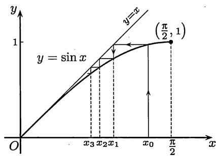

import Guide from '@/components/Guide.astro';
import Knowledge from '@/components/Knowledge.astro';
import Example from '@/components/Example.astro';
import Solution from '@/components/Solution.astro';
import Note from '@/components/Note.astro';
import Block from '@/components/Block.astro';
import Method from '@/components/Method.astro';

## $8.1.1$ $L'Hospital$法则

从数学分析的学习开始，极限计算就是一大难题。这种状况在有了 $L'Hospital$ 法则后才可以说有了根本的改变。由于这个法则将求不定式极限归之于简单的导数计算，而且（在条件满足时）可以连续使用，许多看似复杂的问题就可迎刃而解。关于 $L'Hospital$ 法则的叙述、证明以及应用时的注意事项等在数学分析的教科书中都有详细的介绍，其基本思想又与 §$2.4$ 完全相同，这里不再重复 ① 。因同样的理由，也不准备举很多常规性的例题和练习题。

这里只强调指出一点，即虽然 $L'Hospital$ 法则确实是计算极限的强有力工具，但毕竟“一花独放不是春”，初学者要学会将 $L'Hospital$ 法则的使用与其他工具相结合，这样才能有更好的效果。这里所说的其他工具包括在前面各章中已经介绍的多种方法，如等价量代换法、变量代换法、不定式因子的分离、各种恒等变换、无穷小增量公式等，也包括在下一小节将要介绍的带 $Peano$ 余项的 $Taylor$ 公式等。总之，若初学者在用 $L'Hospital$ 法则时出现复杂的计算或甚至失败，原因往往不是 $L'Hospital$ 法则不好，而是你对于它的认识有误。不要认为既然 $L'Hospital$ 法则这样有力，那么其他（已经学过的）方法都可以不要了。

先看下面几个简单问题，它们在第四章中很难解决，现在用 $L'Hospital$ 法则来做就成为容易的问题了（回顾那里的例题 $4.4.5$）。但从下面又可看出，这里也需要与其他工具结合。

<Example title="例8.1.1">
<Solution title="解">
用 $L'Hospital$ 法则可计算如下：

$$
\lim _ {x \rightarrow 0} \frac {\sin x - x}{x ^ {3}} = \lim _ {x \rightarrow 0} \frac {\cos x - 1}{3 x ^ {2}} = - \frac {1}{6}.
$$

最后一步利用了已知的等价关系 $1 - \cos x \sim \frac{1}{2} x^2 (x \to 0)$ 。
</Solution>
</Example>

<Example title="例8.1.2">
<Solution title="解1">
不用其他工具，连用三次 $L'Hospital$ 法则就可以解决问题：

$$
\begin{array}{r l} \lim _ {x \to 0} \frac {x - \tan x}{x ^ {3}} & = \lim _ {x \to 0} \frac {1 - \sec^ {2} x}{3 x ^ {2}} = \lim _ {x \to 0} \frac {- 2 \sec^ {2} x \tan x}{6 x} \\ & = - \lim _ {x \to 0} \frac {2 \sec^ {2} x \tan^ {2} x + \sec^ {4} x}{3} = - \frac {1}{3}. \end{array}
$$
</Solution>
<Solution title="解2">
实际上用一次 $L'Hospital$ 法则就够了：

$$
\lim _ {x \rightarrow 0} \frac {x - \tan x}{x ^ {3}} = \lim _ {x \rightarrow 0} \frac {1 - \sec^ {2} x}{3 x ^ {2}} = \lim _ {x \rightarrow 0} \frac {- \tan^ {2} x}{3 x ^ {2}} = - \frac {1}{3}.
$$
</Solution>
</Example>

<Example title="例8.1.3">
<Solution title="解1">
直接用 $L'Hospital$ 法则三次，得到

$$
\begin{array}{r l} \lim _ {x \to 0} \frac {1 - \cos x ^ {2}}{x ^ {3} \sin x} & = \lim _ {x \to 0} \frac {2 \sin x ^ {2}}{3 x \sin x + x ^ {2} \cos x} = \lim _ {x \to 0} \frac {4 x \cos x ^ {2}}{(3 - x ^ {2}) \sin x + 5 x \cos x} \\ & = \lim _ {x \to 0} \frac {4 \cos x ^ {2} - 8 x ^ {2} \sin x ^ {2}}{(8 - x ^ {2}) \cos x - 7 x \sin x} = \frac {1}{2}. \end{array}
$$
</Solution>
<Solution title="解2">
实际上不需要微分学知识，用等价量代换法即可解决：

$$
\begin{array}{r l} \lim _ {x \to 0} \frac {1 - \cos x ^ {2}}{x ^ {3} \sin x} & = \lim _ {x \to 0} \frac {2 \sin^ {2} \frac {x ^ {2}}{2}}{x ^ {3} \sin x} \\ & = \lim _ {x \to 0} \left(\frac {\sin \frac {x ^ {2}}{2}}{\frac {x ^ {2}}{2}}\right) ^ {2} \cdot \left(\frac {x}{2 \sin x}\right) = \frac {1}{2}. \end{array}
$$
</Solution>
<Solution title="解3">
若利用当 $x \to 0$ 时成立 $\cos x^2 = 1 - \frac{(x^2)^2}{2} + o((x^2)^2)$ 和 $\sin x = x + o(x)$ ，则就有

$$
\begin{array}{r l} & {\underset {x \to 0} {\lim} \frac {1 - \cos x ^ {2}}{x ^ {3} \sin x} = \underset {x \to 0} {\lim} \frac {\frac {x ^ {4}}{2} + o (x ^ {4})}{x ^ {3} (x + o (x))} = \underset {x \to 0} {\lim} \frac {\frac {x ^ {4}}{2} + o (x ^ {4})}{x ^ {4} + o (x ^ {4})}} \\ & {\qquad = \underset {x \to 0} {\lim} \frac {\frac {1}{2} + o (1)}{1 + o (1)} = \frac {1}{2}.} \end{array}
$$
</Solution>
</Example>

<Example title="例8.1.4">
<Solution title="解">
根据第四章的 $Heine$ 归结原理（即命题 $4.2.3$），只要计算函数极限

$$
\lim _ {x \to 0 ^ {+}} \frac {\mathrm{e} - (1 + x) ^ {\frac {1}{x}}}{x}.
$$

这是 $\frac{0}{0}$ 型的不定式问题。用 $L'Hospital$ 法则，得到

$$
\begin{array}{l} \lim _ {x \to 0 ^ {+}} \frac {\mathrm{e} - (1 + x) ^ {\frac {1}{x}}}{x} = \lim _ {x \to 0 ^ {+}} \left\{- \left[ (1 + x) ^ {\frac {1}{x}} \right] \cdot \frac {\frac {x}{1 + x} - \ln (1 + x)}{x ^ {2}} \right\} \\ = - \mathrm{e} \cdot \lim _ {x \to 0 ^ {+}} \frac {\frac {x}{1 + x} - \ln (1 + x)}{x ^ {2}} \\ = - \mathrm{e} \cdot \lim _ {x \to 0 ^ {+}} \frac {\frac {1}{(1 + x) ^ {2}} - \frac {1}{1 + x}}{2 x} \\ = - \mathrm{e} \cdot \lim _ {x \to 0 ^ {+}} \frac {- 1}{2 (1 + x) ^ {2}} = \frac {\mathrm{e}}{2}. \end{array}
$$
</Solution>
<Note>
实际上本题的答案就是例题 $7.2.4$ 中的函数 $f(x)$ 的导数 $f'(0)$（乘 $-1$）。
</Note>
</Example>

用 $L'Hospital$ 法则可以对带 $Peano$ 余项的 $Taylor$ 公式给出新证明。

<Example title="例8.1.5">
<Solution title="证明">
若 $f$ 在点 $x_{0}$ 存在 $f^{(n)}(x_{0})$ ，则有

$$
\begin{array}{l}f (x) = f (x _ {0}) + f ^ {\prime} (x _ {0}) (x - x _ {0}) + \frac {f ^ {\prime \prime} (x _ {0})}{2 !} (x - x _ {0}) ^ {2} + \dots\\\qquad + \frac {f ^ {(n)} (x _ {0})}{n !} (x - x _ {0}) ^ {n} + o ((x - x _ {0}) ^ {n}) (x \rightarrow x _ {0}).\end{array}
$$

如在第七章的 $(7.19)$ 那样引进余项

$$
\begin{array}{l} r _ {n} (x) = f (x) - [ f (x _ {0}) + f ^ {\prime} (x _ {0}) (x - x _ {0}) + \frac {f ^ {\prime \prime} (x _ {0})}{2 !} (x - x _ {0}) ^ {2} + \dots \\ \qquad + \frac {f ^ {(n)} (x _ {0})}{n !} (x - x _ {0}) ^ {n} ], \end{array}
$$

它满足以下的 $n + 1$ 个条件：

$$
r _ {n} (x _ {0}) = 0, r _ {n} ^ {\prime} (x _ {0}) = 0, \dots , r _ {n} ^ {(n)} (x _ {0}) = 0.\tag{8.1}
$$

只需要证明 $\lim_{x\to x_0}\frac{r_n(x)}{(x - x_0)^n} = 0,$ 这是 $\frac{0}{0}$ 型的不定式。用 $L'Hospital$ 法则如下：

$$
\lim _ {x \rightarrow x _ {0}} \frac {r _ {n} (x)}{(x - x _ {0}) ^ {n}} = \lim _ {x \rightarrow x _ {0}} \frac {r _ {n} ^ {\prime} (x)}{n (x - x _ {0}) ^ {n - 1}} = \dots = \lim _ {x \rightarrow x _ {0}} \frac {r _ {n} ^ {(n - 1)} (x)}{n ! (x - x _ {0})}.
$$

在以上的 $n - 1$ 次应用 $L'Hospital$ 法则中，利用了 $(8.1)$ 中的前 $n - 1$ 个条件。从条件 $r_n^{(n - 1)}(x_0) = 0$ 可见上面的最后一式仍然是 $\frac{0}{0}$ 型的不定式。但这里不能再用 $L'Hospital$ 法则。与命题 $7.2.2$ 中一样，从导数定义出发，即可利用条件 $r^{(n)}(x_0) = 0$ 得到所要求证的结果。 □
</Solution>
</Example>

## $8.1.2$ $Taylor$公式与极限计算

先介绍用 $Taylor$ 公式对错误使用等价量代换法进行分析的一个例子。

<Example title="例8.1.6">
根据实际教学情况，在用 $L'Hospital$ 法则计算例题 $8.1.4$ 中的极限时，很多学生在最后一步不再用 $L'Hospital$ 法则，而作以下计算：

$$
\lim _ {x \rightarrow 0} \frac {\frac {x}{1 + x} - \ln (1 + x)}{x ^ {2}} = \lim _ {x \rightarrow 0} \frac {\frac {x}{1 + x} - x}{x ^ {2}} = \lim _ {x \rightarrow 0} \frac {x - (1 + x) x}{(1 + x) x ^ {2}} = - 1,
$$

但正确答案却是 $-\frac{1}{2}$ 。问题当然出在不恰当地使用了等价量代换法。因为根据 $4.4.3$ 小节，应当按照 $(4.8)$ 或 $(4.9)$ 的方式才能用等价量代换。

用 $Taylor$ 公式进行分析就可一目了然。分子的两项可用 $Taylor$ 公式写出为

$$
\begin{array}{c} {\frac {x}{1 + x} = x - x ^ {2} + o (x ^ {2}) (x \to 0),} \\ {\ln (1 + x) = x - \frac {1}{2} x ^ {2} + o (x ^ {2}) (x \to 0).} \end{array}
$$

可见这两项相减后，$x$ 的一次项恰好对消，因此起作用的是在两个展开式中的 $x^{2}$ 项的系数。正确的计算为

$$
\lim _ {x \to 0} \frac {\frac {x}{1 + x} - \ln {(1 + x)}}{x ^ {2}} = \lim _ {x \to 0} \frac {(x - x ^ {2}) - (x - \frac {1}{2} x ^ {2}) + o (x ^ {2})}{x ^ {2}} = - \frac {1}{2}.
$$

由此可见，前面的错误原因在于用 $x$ 替换 $\ln (1 + x)$ 时太粗糙了，丢掉了在该问题中起关键作用的二次项。

从 $Taylor$ 公式的应用来看，问题是在每一个具体场合究竟应当写出多少项？当然这需要尝试。再以上面的分子为例。将 $\ln (1 + x)$ 写为 $x + o(x)(x \to 0)$ ，这也是 $Taylor$ 公式，并没有错误。如果将第一项也写为 $x + o(x)$ ，就会发现仅仅写出一次项的系数是不够的。

以上错误还说明，学生在刚学了 $Taylor$ 公式后一般还不会在求函数极限时加以使用，在计算时仍停留在使用无穷小增量公式（也就是 $n = 1$ 的带 $Peano$ 余项的最简单的 $Taylor$ 公式）的知识水平上。解决这个问题的方法是实践和教师的引导。

带有 $Peano$ 余项的 $Taylor$ 公式在求极限中有广泛的应用是不奇怪的，因为 $Peano$ 余项本身就是对于无穷小量的一个刻画。下面是应用 $Taylor$ 公式求极限的第一个例子（为清楚起见用 $\exp(x)$ 表示 $\mathbf{e}^x$）。
</Example>

<Block title="例8.1.4 的解 2">
用 $Taylor$ 公式作下列计算：

$$
\begin{array}{r l} \delta_ {n} = \mathrm{e} - \left(1 + \frac {1}{n}\right) ^ {n} & = \mathrm{e} - \exp \left[ n \ln \left(1 + \frac {1}{n}\right) \right] \\ & = \mathrm{e} - \exp \left[ n \left(\frac {1}{n} - \frac {1}{2 n ^ {2}} + O \left(\frac {1}{n ^ {3}}\right)\right) \right] \\ & = \mathrm{e} - \exp \left[ 1 - \frac {1}{2 n} + O \left(\frac {1}{n ^ {2}}\right) \right] \\ & = \mathrm{e} \left(1 - \exp \left[ - \frac {1}{2 n} + O \left(\frac {1}{n ^ {2}}\right) \right]\right) \\ & = \mathrm{e} \left[ 1 - \left(1 - \frac {1}{2 n} + O \left(\frac {1}{n ^ {2}}\right)\right) \right] \\ & = \frac {\mathrm{e}}{2 n} + O \left(\frac {1}{n ^ {2}}\right), \end{array}
$$

可见 $\lim_{n\to \infty}n\delta_n = \frac{\mathrm{e}}{2}$

<Note>
例题 $7.2.4$ 已经提供了本题的一种解法，实质上与此相同。此外，本章第一组参考题 $6$ 又提供了另一个解法。
</Note>
</Block>

<Example title="例8.1.7">
<Solution title="解">
记所求的极限为 $I$，写出分子的 $Maclaurin$ 公式：

$$
\begin{array}{r l}1 - (\cos x) ^ {\sin x}&= 1 - \mathrm{e} ^ {\sin x \ln \cos x}\\&= 1 - [ 1 + \sin x \ln \cos x + o (\sin x \ln \cos x) ]\\&= - \sin x \ln \cos x + o (\sin x \ln \cos x) (x \rightarrow 0),\end{array}
$$

然后如下计算即可得到答案：

$$
\begin{array}{l}I = \lim _ {x \rightarrow 0} \frac {- \sin x \ln \cos x}{x ^ {3}} = \lim _ {x \rightarrow 0} \frac {- \ln \cos x}{x ^ {2}} = \lim _ {x \rightarrow 0} \frac {- \ln \left[ 1 + \left(- \frac {x ^ {2}}{2} + o (x ^ {3})\right)\right]}{x ^ {2}}\\= \lim _ {x \rightarrow 0} \frac {\frac {x ^ {2}}{2} + o (x ^ {3}) + o (x ^ {2})}{x ^ {2}} = \frac {1}{2}.\end{array}
$$
</Solution>
</Example>

<Example title="例8.1.8">
<Solution title="解1">
可以看出只要计算分子的 $Maclaurin$ 展开式直到 $x^4$ 项即可：

$$
\begin{array}{r l} & {\cos (\sin x) - \cos x = 1 - \frac {1}{2 !} (\sin x) ^ {2} + \frac {1}{4 !} (\sin x) ^ {4} - \left(1 - \frac {1}{2 !} x ^ {2} + \frac {1}{4 !} x ^ {4}\right) + o (x ^ {5})} \\ & {\qquad = - \frac {1}{2} \left(x - \frac {1}{6} x ^ {3}\right) ^ {2} + \frac {1}{2 4} x ^ {4} + \frac {1}{2} x ^ {2} - \frac {1}{2 4} x ^ {4} + o (x ^ {5})} \\ & {\qquad = - \frac {1}{2} \left(x ^ {2} - \frac {1}{3} x ^ {4}\right) + \frac {1}{2} x ^ {2} + o (x ^ {5})} \\ & {\qquad = \frac {1}{6} x ^ {4} + o (x ^ {5}) (x \to 0),} \end{array}
$$

因此所求的极限为 $\frac{1}{6}$ 。
</Solution>
<Solution title="解2">
在写出 $\cos(\sin x) - \cos x$ 的展开式后，可以看出只要计算如下：

$$
\begin{array}{r l} \lim _ {x \to 0} \frac {\cos (\sin x) - \cos x}{x ^ {4}} & = \lim _ {x \to 0} \left(\frac {1}{2} \cdot \frac {x ^ {2} - \sin^ {2} x}{x ^ {4}}\right) \\ & = \frac {1}{2} \lim _ {x \to 0} \left(\frac {x + \sin x}{x} \cdot \frac {x - \sin x}{x ^ {3}}\right) = \frac {1}{6}. \end{array}
$$
</Solution>
<Solution title="解3">
利用分子的特殊形式，应用 $Lagrange$ 中值定理即可得到

$$
\cos (\sin x) - \cos x = - \sin \xi (\sin x - x),
$$

其中 $\xi$ 在 $x$ 与 $\sin x$ 之间。因此就可以计算如下：

$$
\begin{array}{r l} \lim _ {x \to 0} \frac {\cos (\sin x) - \cos x}{x ^ {4}} & = \lim _ {x \to 0} \frac {- \sin \xi (\sin x - x)}{x ^ {4}} \\ & = - \lim _ {x \to 0} \left(\frac {\sin \xi}{\xi} \cdot \frac {\xi}{x} \cdot \frac {\sin x - x}{x ^ {3}}\right) = \frac {1}{6}. \end{array}
$$
</Solution>
<Solution title="解4">
本题也可以用三角函数的和差化积公式来做，计算如下：

$$
\begin{array}{r l} \lim _ {x \to 0} \frac {\cos (\sin x) - \cos x}{x ^ {4}} & = \lim _ {x \to 0} \left[ \frac {- 1}{x ^ {4}} \cdot 2 \sin \left(\frac {\sin x - x}{2}\right) \cdot \sin \left(\frac {\sin x + x}{2}\right) \right] \\ & = - 2 \lim _ {x \to 0} \left(\frac {1}{x ^ {4}} \cdot \frac {\sin x - x}{2} \cdot \frac {\sin x + x}{2}\right) \\ & = - \lim _ {x \to 0} \frac {\sin x - x}{x ^ {3}} = \frac {1}{6}. \end{array}
$$

注意这里使用了多次等价量代换，使问题大大简化了。
</Solution>
</Example>

<Example title="例8.1.9">
<Solution title="证明">
这时 $f$ 在 $x = 0$ 的某邻域上可微，因此当 $x \neq 0$ 时可按定义求出

$$
g ^ {\prime} (x) = \frac {f ^ {\prime} (x) x - f (x)}{x ^ {2}}.\tag{8.2}
$$

余下只有一个问题，即证明 $g'(0) = \frac{1}{2} f''(0)$ 且 $\lim_{x \to 0} g'(x) = g'(0)$ 。

应用 $7.1.2$ 小节的导数极限定理，只要证明：（1）$g$ 在 $x = 0$ 处连续；（2）$g'$ 在 $x = 0$ 处有极限，并求出此极限。（若不用导数极限定理，则需另行计算 $g'(0)$ 。）

（1）从 $g$ 的定义即可得到

$$
\lim _ {x \rightarrow 0} g (x) = \lim _ {x \rightarrow 0} \frac {f (x)}{x} = \lim _ {x \rightarrow 0} \frac {f (x) - f (0)}{x} = f ^ {\prime} (0) = g (0).
$$

（2）利用带 $Peano$ 余项的 $Maclaurin$ 公式：

$$
\begin{array}{l} {f (x) = f ^ {\prime} (0) x + \frac {1}{2} f ^ {\prime \prime} (0) x ^ {2} + o (x ^ {2}) (x \to 0),} \\ {f ^ {\prime} (x) = f ^ {\prime} (0) + f ^ {\prime \prime} (0) x + o (x) (x \to 0),} \end{array}
$$

将它们代入 $(8.2)$ ，就在 $x \neq 0$ 时有

$$
\begin{array}{c} g ^ {\prime} (x) = \frac {(f ^ {\prime} (0) + f ^ {\prime \prime} (0) x) x - \left(f ^ {\prime} (0) x + \frac {1}{2} f ^ {\prime \prime} (0) x ^ {2}\right) + o (x ^ {2})}{x ^ {2}} \\ = \frac {1}{2} f ^ {\prime \prime} (0) + o (1) (x \to 0). \end{array}
$$

因此存在极限 $\lim_{x\to0}g'(x)=\frac{1}{2}f''(0)$ ，再应用导数极限定理即得所要的结论。 □
</Solution>
<Note>
比较 $f$ 和 $g$ 的 $Maclaurin$ 展开式：

$$
\begin{array}{r l} & {f (x) = f ^ {\prime} (0) x + \frac {f ^ {\prime \prime} (0)}{2} x ^ {2} + o (x ^ {2}) (x \to 0),} \\ & {g (x) = f ^ {\prime} (0) + \frac {f ^ {\prime \prime} (0)}{2} x + o (x) (x \to 0),} \end{array}
$$

可以发现，后一个公式可以由前一个除以 $x$ 得到，恰与 $x \neq 0$ 时 $g(x)$ 的定义一致。但是在证明 $g(0) = f'(0)$ 和 $g'(0) = \frac{1}{2} f''(0)$ 之前，当然还不知道由这样的形式运算得到的结果是否是 $g$ 的 $Maclaurin$ 展开式。因此可以认为，本例题的意义就在于对这样的形式运算作出了严格证明。
</Note>
<Note>
这个例题的结论可以推广。只要多次应用导数极限定理，就可以证明：若 $f(0) = 0$ ，且存在 $f^{(n + 1)}(0)$ ，则上述 $g(x)$ 的 $n$ 阶导函数 $g^{(n)}$ 在 $x = 0$ 处连续，且 $g^{(n)}(0) = f^{(n + 1)}(0) / (n + 1)$ 。（这将作为本章的第二组参考题 $2$ 。）
</Note>
<Note>
应用上述推广，就可以为上一章的例题 $7.2.3$ 和 $7.2.4$ 中的计算提供理论根据。这里的结果可以简述为：如果 $f(x)$ 满足 $f(0) = 0$ ，又存在 $f^{(n + 1)}(0)$ ，则如下定义的函数：

$$
g (x) = \left\{ \begin{array}{l l} \frac {f (x)}{x}, & x \neq 0, \\ f ^ {\prime} (0), & x = 0 \end{array} \right.
$$

在 $x = 0$ 处存在 $g^{(n)}(0)$ ，且有 $Maclaurin$ 展开式：

$$
g (x) = f ^ {\prime} (0) + f ^ {\prime \prime} (0) x + \frac {f ^ {\prime \prime \prime} (0)}{2 !} x ^ {2} + \dots + \frac {f ^ {(n + 1)} (0)}{(n + 1) !} x ^ {n} + o \left(x ^ {n}\right) (x \rightarrow 0).
$$

因此，形式上这个展开式可以从 $f$ 的 $Maclaurin$ 展开式除以 $x$ 得到。在例题 $7.2.3$ 和 $7.2.4$ 中对于 $\sin x$ 和 $\ln (1 + x)$ 就是这样做的，但当时没有能够证明其合理性。
</Note>
</Example>

<Example title="例8.1.10">
<Solution title="证">
数列 $\{x_{n}\}$ 为严格单调减少数列，收敛于 $0$ （请读者补充证明）。以下用 $Stolz$ 定理计算：

$$
\begin{array}{r l} & {\underset {n \to \infty} {\lim} n x _ {n} ^ {2} = \underset {n \to \infty} {\lim} \frac {n}{\frac {1}{x _ {n} ^ {2}}}} \\ & {\qquad = \underset {n \to \infty} {\lim} \frac {1}{\frac {1}{x _ {n + 1} ^ {2}} - \frac {1}{x _ {n} ^ {2}}}} \\ & {\qquad = \underset {n \to \infty} {\lim} \frac {x _ {n} ^ {2} x _ {n + 1} ^ {2}}{x _ {n} ^ {2} - x _ {n + 1} ^ {2}}} \\ & {\qquad = \underset {n \to \infty} {\lim} \frac {x _ {n} ^ {2} \sin^ {2} x _ {n}}{\frac {1}{3} x _ {n} ^ {4} + o (x _ {n} ^ {5})} = 3,} \end{array}
$$

在其中用了 $x_{n + 1} = \sin x_n = x_n - \frac{1}{6} x_n^3 + o(x_n^4).$
</Solution>
<Note>
在图 $8.1$ 上用蛛网工作法（见 $2.6.2$ 小节）作出了数列的前几项。可以看出数列 $\{x_{n}\}$ 收敛于 $0$ 一定很慢。本题的结果对此作出了渐近的刻画。
</Note>
</Example>

  
图$8.1$

## $8.1.3$ 练习题

1. 以下几个函数极限均不宜用 $L'Hospital$ 法则，为什么？
(1) $\lim_{x\to1}\frac{x}{x+1};$ (2) $\lim_{x\to+\infty}\frac{x+\sin x}{x-\sin x};$ (3) $\lim_{x\to+\infty}\frac{e^{x}+e^{-x}}{e^{x}-e^{-x}};$ (4) $\lim_{x\to+\infty}\frac{x}{\sqrt{1+x^{2}}}$

2. 求下列极限：
(1) $\lim_{x\to0}\frac{a^{x^{2}}-b^{x^{2}}}{(a^{x}-b^{x})^{2}};$ (2) $\lim_{x\to+\infty}\left[\left(x^{3}-x^{2}+\frac{x}{2}\right)\mathrm{e}^{\frac{1}{x}}-\sqrt{1+x^{6}}\right];$ (3) $\lim_{x\to0^{+}}\left(\ln\frac{1}{x}\right)^{x};$ (4) $\lim_{x\to+\infty}\left(\frac{\pi}{2}-\arctan x\right)^{\frac{1}{\ln x}}.$

3. 确定 $a, b$ ，使得当 $x \to 0$ 时，下列函数为尽可能高阶的无穷小量：
(1) $f(x) = x - (a + b \cos x) \sin x$ ； (2) $f(x) = \mathrm{e}^{x} - \frac{1 + ax}{1 + bx}$ ； (3) $f(x) = \cot x - \frac{1 + ax^2}{x + bx^3}$ ； (4) $f(x) = \cos x - \frac{1 + ax^2}{1 + bx^2}$ .

4. 应用 $Taylor$ 公式求下列极限：
(1) $\lim_{x\to0}\left(\frac{1}{x}-\frac{1}{\sin x}\right)$ ； (2) $\lim_{x\to0}\frac{e^{x^{3}}-1-x^{3}}{\sin^{6}2x}$ ； (3) $\lim_{n\to\infty}n^{2}\ln\left(n\sin\frac{1}{n}\right)$ ； (4) $\lim_{n\to\infty}(-1)^{n}n\sin(\sqrt{n^{2}+2}\pi)$ ； (5) $\lim_{x\to0}\frac{\sin(\tan x)-\tan(\sin x)}{x^{7}}$ ； (6) $\lim_{x\to0}\frac{x\sin(\sin x)-\sin^{2}x}{x^{6}}$ .

5. 设存在 $f''(a)$ ，证明： $\lim_{h \to 0} \frac{f(a + 2h) - 2f(a + h) + f(a)}{h^2} = f''(a)$ .

6. 设 $f$ 在某邻域 $O(x_0)$ 上二阶连续可微， $f'(x_0) \neq 0$ ， $f(x) \neq f(x_0)$ ， $\forall x \neq x_0$ 。求 $\lim_{x \to x_0} \left[ \frac{1}{f(x) - f(x_0)} - \frac{1}{f'(x_0)(x - x_0)} \right]$ .

7. 设 $f$ 在 $[0, +\infty)$ 上二阶连续可微，且 $f''(x) > 0$ ， $f(0) = f'(0) = 0$ 。试求极限 $\lim_{x \to 0^+} \frac{xf(u)}{uf(x)}$ ，其中 $u$ 是函数 $f$ 的图像在点 $(x, f(x))$ 处的切线在 $x$ 轴上的截距。

8. 令 $f(x) = \lim_{n\to \infty}n^x\left[\left(1 + \frac{1}{n + 1}\right)^{n + 1} - \left(1 + \frac{1}{n}\right)^n\right]$ ，确定其定义域和值域。

9. 设 $x_{1} > 0, x_{n + 1} = \ln (1 + x_{n}), n \in \mathbf{N}_{+}$ ，证明： $\lim_{n\to \infty}nx_n = 2$ .

10. 设 $x_0 = \ln a, a > 0, x_n = \sum_{k=0}^{n-1} \ln (a - x_k), n \in \mathbf{N}_+$ ，求 $\lim_{n \to \infty} x_n$ .
