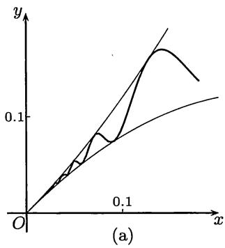
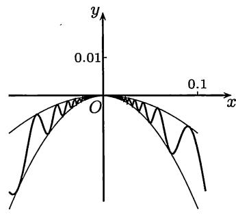

import Guide from '@/components/Guide.astro';
import Knowledge from '@/components/Knowledge.astro';
import Example from '@/components/Example.astro';
import Solution from '@/components/Solution.astro';
import Note from '@/components/Note.astro';
import Block from '@/components/Block.astro';
import Method from '@/components/Method.astro';

设函数 $f \in C(I)$ , 在 $I$ 的内点处处可微, 则有以下结论.

$1$. $f$ 为区间 $I$ 上的单调函数的充分必要条件是导函数不变号.

$2$. $f$ 为区间 $I$ 上的严格单调函数的充分必要条件是除了导函数不变号外, 还在集合 $\{x \in I \mid f'(x) = 0\}$ 中不包含任何长度大于零的区间.

证明的方法是用 $Lagrange$ 中值定理. 这在教科书中都有, 不再重复.

从数列极限和函数极限的学习开始, 单调性就一直起着重要的作用. 现在以导数为工具, 给出了判定单调性的新的有效方法, 可以说解决了函数研究中的一个基本问题. 搞清了函数的不同单调区间, 也就知道了函数图像的上升与下降, 这对解决许多问题都是有帮助的.

## 8.2.1 例题

虽然函数的单调性与导数有如上所说的密切关系, 但仅仅由一个点上的导数符号不能得出单调性. 请将下一个例题与命题 $7.1.1$ 联系起来考虑这个问题.

<Example title="例8.2.1">

问：由函数在一个点上的导数符号大于(小于)$0$能否推出函数在该点的一个充分小的邻域上为单调？

<Solution title="解">

答案是不能. 举例如下: 令

$$
f (x) = \left\{ \begin{array}{l l} x + 2 x ^ {2} \sin \frac {1}{x}, & x \neq 0, \\ 0, & x = 0. \end{array} \right.
$$

则易求出 $f'(0) = 1 > 0$ . 又可以求出当 $x \neq 0$ 时的导函数表达式为

$$
f ^ {\prime} (x) = 1 + 4 x \sin {\frac {1}{x}} - 2 \cos {\frac {1}{x}}.
$$

取 $x = \frac{1}{n\pi}$ ，则有

$$
f ^ {\prime} \left(\frac {1}{n \pi}\right) = 1 - 2 (- 1) ^ {n},
$$

可见在 $x = 0$ 的任意邻近导函数 $f'(x)$ 都不保号. 因此在 $x = 0$ 的每个邻域上 $f$ 都不是单调的 (该函数在 $x > 0$ 部分的图像见图 $8.2$(a)).

  
图 $8.2$

</Solution>

在任何一个区间上不单调的连续函数和可微函数都是存在的 (见 [$57$]).

</Example>

<Example title="例8.2.2">

问：函数在其极值点的每一侧邻近是否一定具有单调性？

<Solution title="解">

答案是不一定. 举例如下: 令

$$
f (x) = \left\{ \begin{array}{l l} 0, & x = 0, \\ - x ^ {2} \left(2 + \sin \frac {1}{x}\right), & x \neq 0, \end{array} \right.
$$

则 $f$ 在 $x = 0$ 处取到极大值 $0$.从不等式

$$
- 3 x ^ {2} \leqslant f (x) \leqslant - x ^ {2}
$$

即可求出 $f^{\prime}(0) = 0$ .但当 $x\neq 0$ 时

$$
f ^ {\prime} (x) = - 4 x - 2 x \sin {\frac {1}{x}} + \cos {\frac {1}{x}},
$$

因此在极值点 $x = 0$ 两侧的任意邻近都不可能是单调的 (见图 $8.2$(b)).

</Solution>

</Example>

<Example title="例8.2.3">

设函数 $f(x) = \left(1 + \frac{1}{x}\right)^{x + \alpha}$ ，证明：当 $\alpha \geqslant \frac{1}{2}$ 时， $f$ 于 $x > 0$ 时严格单调减少；而当 $\alpha < \frac{1}{2}$ 时，则 $f$ 于 $x$ 充分大时严格单调增加。

<Solution title="证明">

用对数求导法, 可以写出

$$
f ^ {\prime} (x) = f (x) \left[ \ln \left(1 + \frac {1}{x}\right) - \frac {x + \alpha}{x ^ {2} + x} \right].
$$

将上式右边记为 $f(x) \cdot u(x)$ , 则 $f'$ 与 $u$ 同号. 由于有

$$
\lim _ {x \to + \infty} u (x) = 0,
$$

只要观察 $u$ 是否单调即可判定其符号. 计算得到

$$
u ^ {\prime} (x) = \frac {\alpha + (2 \alpha - 1) x}{x ^ {2} (1 + x) ^ {2}}.
$$

可见当 $\alpha \geqslant \frac{1}{2}$ 和 $x > 0$ 时有 $u'(x) > 0$ , 因此 $u$ 为严格单调增加函数, 所以当 $x > 0$ 时 $u(x) < 0$ 成立. 这保证了 $f$ 在 $x > 0$ 时严格单调减少. 当 $\alpha < \frac{1}{2}$ 时, 则至少在 $x$ 充分大时 $u'(x) < 0$ , 所以有 $u(x) > 0$ . 这保证了函数 $f$ 在 $x$ 充分大时严格单调增加.

</Solution>

</Example>

<Example title="例8.2.4">

证明: 对每个正整数 $n$, 方程 $x^{n+2}-2x^{n}-1=0$ 只有唯一正根.

<Solution title="证明">

记方程左边的表达式为 $f(x)$ . 从 $f(\sqrt{2}) = -1$ 和 $f(+\infty) = +\infty$ 可见方程有大于 $\sqrt{2}$ 的正根. 为了知道 $f$ 的单调性, 求导后得到

$$
f ^ {\prime} (x) = (n + 2) x ^ {n + 1} - 2 n x ^ {n - 1} = (n + 2) x ^ {n - 1} \left(x ^ {2} - \frac {2 n}{n + 2}\right).
$$

因此函数 $f$ 在点

$$
\xi = \sqrt {\frac {2 n}{n + 2}} (<   \sqrt {2})
$$

的导数值为 $0$. 函数 $f$ 在区间 $[0, \xi]$ 上严格单调减少，而在区间 $[\xi, +\infty)$ 上严格单调增加。又从 $f(0) = -1$ ，就知道 $f(x) = 0$ 除了上述大于 $\sqrt{2}$ 的一个正根外没有其他正根。

</Solution>

</Example>

<Example title="例8.2.5">

设 $a > 0$, 确定方程 $f(x) = ax - \ln x = 0$ 恰有两个正根的条件.

<Solution title="解">

从 $f'(x) = a - 1 / x$ 可见在 $(0, a^{-1}]$ 上 $f$ 严格单调减少，而在 $[a^{-1}, +\infty)$ 上 $f$ 严格单调增加。又由于

$$
f (0 ^ {+}) = + \infty , f (+ \infty) = \lim _ {x \to + \infty} x \left(a - \frac {\ln x}{x}\right) = + \infty ,
$$

可见方程 $f(x) = 0$ 有两个正根的条件是

$$
f \left(\frac {1}{a}\right) = 1 - \ln {\frac {1}{a}} <   0.
$$

由此可以确定 $a$ 应当满足条件 $a < \frac{1}{\mathrm{e}}$ .

</Solution>

</Example>

## 8.2.2 练习题

<Block title="练习题">

$1$. 问: 单调函数若可微, 则其导函数是否也单调? 反之又如何? 请举例说明.

$2$. 证明: 函数 $\left(1 + \frac{1}{x}\right)^x$ 在区间 $(- \infty, -1)$ 和 $(0, +\infty)$ 上单调增加.

$3$. 设 $f$ 在 $[0, +\infty)$ 上可微, $f(0) = 0$ 且 $f'$ 严格单调增加, 证明: $\frac{f(x)}{x}$ 在 $(0, +\infty)$ 上也严格单调增加.

$4$. 设 $f, g$ 在 $[0, a]$ 上连续, 在 $(0, a)$ 上可微, $f(0) = g(0) = 0$ , $f', g' > 0$ , 证明: 如果 $f' / g'$ 单调增加, 则 $f / g$ 也单调增加.

$5$. 设 $f$ 在区间 $[a, +\infty)$ 上二阶可微, 并且满足条件: ($1$) $f(a) > 0$ ; ($2$) $f'(a) < 0$ ; ($3$) 在 $x > a$ 时 $f''(x) \leqslant 0$ , 证明: $f(x)$ 在 $(a, +\infty)$ 内有且只有一个零点.

$6$. 设 $f \in C[a, +\infty)$ , 且当 $x > a$ 时成立 $f'(x) > k > 0$ , 其中 $k$ 为常数, 证明: 若 $f(a) < 0$ , 则于区间 $(a, a - f(a) / k)$ 内方程 $f(x) = 0$ 有且只有一个实根.

$7$. 设 $a > 0$ , 证明: 方程 $a \mathrm{e}^{x} = 1 + x + \frac{x^{2}}{2}$ 只有一个实根.

$8$. 证明: 方程 $f(x) = \left( \frac{2}{\pi} - 1 \right) \ln x - \ln 2 + \ln (1 + x^2) = 0$ 在开区间 $(0,1)$ 内只有一个实根.

</Block>
