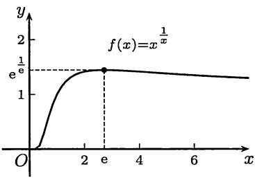
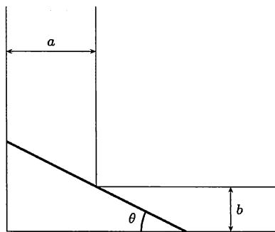

import Guide from '@/components/Guide.astro';
import Knowledge from '@/components/Knowledge.astro';
import Example from '@/components/Example.astro';
import Solution from '@/components/Solution.astro';
import Note from '@/components/Note.astro';
import Block from '@/components/Block.astro';
import Method from '@/components/Method.astro';

<Block title="§$8.3$ 函数的极值与最值">

<Block title="关于极值与最值的基本事实">
1. 根据 $7.1.1$ 小节给出的定义, 极值点必须是函数的定义域中的内点. 这就是说, 极值点必须有一个邻域在函数的定义域中.

2. 若函数 $f$ 在点 $x_0$ 两侧 (邻近) 均为单调, 且具有相反的单调性, 则 $x_0$ 为极值点.

3. 根据 $Fermat$ 定理, 函数的极值点或是函数的不可导点 (包括不连续点), 或是函数的导数等于零的点.

4. 若函数 $f$ 在点 $x_0$ 处二阶可微, $f'(x_0) = 0$ , $f''(x_0) \neq 0$ , 则 $x_0$ 一定是极值点. 此时, 若 $f''(x_0) > 0$ , 则 $x_0$ 是极小值点; 而若 $f''(x_0) < 0$ , 则 $x_0$ 是极大值点.

5. 若函数 $f$ 在点 $x_0$ 处为 $n$ 阶可微, $f'(x_0) = f''(x_0) = \cdots = f^{(n-1)}(x_0) = 0$ , 但 $f^{(n)}(x_0) \neq 0$ , 则有以下结论 (证明见例题 $8.3.1$):

(1) 若 $n$ 为奇数, 则 $x_0$ 一定不是极值点;

(2) 若 $n$ 为偶数, 则 $x_0$ 一定是 $f$ 的极值点. 若 $f^{(n)}(x_0) > 0$ , 则 $x_0$ 是极小值点; 若 $f^{(n)}(x_0) < 0$ , 则 $x_0$ 是极大值点.

6. 以上 $2$、$4$、$5$ 三项所列出的条件都是充分而非必要的条件. 目前还不知道函数在某个点达到极值的充分必要条件是什么.

7. 若函数 $f$ 在点 $x_0$ 有任意阶的导数, 而且所有这些导数值都等于 $0$ , 则函数仍然可能在点 $x_0$ 处达到或不达到极值. 前者的例子见例题 $6.2.4$, 其中的函数在点 $x = 0$ 的任意阶导数为 $0$ , 又在该点取到极小值 (见图 $6.4$). 后者的例子可以从例题 $6.2.4$ 中的函数经适当改造后得到 (留作思考题).

8. 若函数在内点达到最值, 则同时也达到极值.

9. 在闭区间或半闭半开区间上定义的函数的最值点位置只有两种可能: (1) 端点, (2) 极值点. 这是寻找函数最值点的基本原则.
</Block>

<Example title="例 $8.3.1$">
若函数 $f$ 在点 $x_{0}$ 处 $n$ 阶可微, 且满足条件

$$
f ^ {\prime} (x _ {0}) = f ^ {\prime \prime} (x _ {0}) = \dots = f ^ {(n - 1)} (x _ {0}) = 0, f ^ {(n)} (x _ {0}) \neq 0,
$$

则有结论: (1) 若 $n$ 为奇数, 则 $x_{0}$ 一定不是 $f$ 的极值点; (2) 若 $n$ 为偶数, 则当 $f^{(n)}(x_{0}) > 0 (< 0)$ 时, $x_{0}$ 是函数 $f$ 的极小值点 (极大值点).

<Solution title="证明">
这时 $f$ 在 $x_0$ 的 $Taylor$ 公式为

$$
f (x) = f \left(x _ {0}\right) + \frac {1}{n !} f ^ {(n)} \left(x _ {0}\right)\left(x - x _ {0}\right) ^ {n} + o \left(\left(x - x _ {0}\right) ^ {n}\right)\left(x \rightarrow x _ {0}\right).
$$

将它改写成

$$
f (x) - f (x _ {0}) = \frac {1}{n !} \left[ f ^ {(n)} (x _ {0}) + o (1) \right] (x - x _ {0}) ^ {n} (x \rightarrow x _ {0}),\tag{8.3}
$$

由于 $f^{(n)}(x_0) \neq 0$ , 则存在 $\delta > 0$ , 当 $x \in O_{\delta}(x_0)$ 时, 公式 $(8.3)$ 右边的方括号中的表达式的符号完全由 $f^{(n)}(x_0)$ 确定.

若 $n$ 为奇数, 则可以从 $(8.3)$ 看出当 $x \in (x_0 - \delta, x_0)$ 和 $x \in (x_0, x_0 + \delta)$ 时, $f(x) - f(x_0)$ 异号, 因此 $x_0$ 一定不是极值点.

若 $n$ 为偶数, 则公式 $(8.3)$ 表明, 当 $x \in O_{\delta}(x_0) - \{x_0\}$ 时, $f(x) - f(x_0)$ 与 $n$ 阶导数 $f^{(n)}(x_0)$ 的符号一致. 因此当 $f^{(n)}(x_0) > 0$ 时, $x_0$ 是 $f$ 的极小值点. 反之, 若 $f^{(n)}(x_0) < 0$ , 则 $x_0$ 是 $f$ 的极大值点. $\square$
</Solution>

<Note>
$n = 1$ 时这就是 $Fermat$ 定理 (命题 $7.1.2$)，即从 $f^{\prime}(x_0)\neq 0$ 可推出 $x_0$ 不是 $f$ 的极值点.上述证明就是那里的证 $2$.
</Note>
</Example>

<Example title="例 $8.3.2$">
证明: $x = 0$ 是 $f(x) = \mathrm{e}^{x} + \mathrm{e}^{-x} + 2 \cos x$ 的极小值点.

<Solution title="证明">
计算得到 $f'(0) = f''(0) = f'''(0) = 0$ , $f^{(4)}(0) = 4$ . 用上一命题的结论可见 $x = 0$ 是 $f(x)$ 的极小值点. □
</Solution>
</Example>

<Example title="例 $8.3.3$">
现在可以解决在 §$2.5$ 中引进数 $\mathrm{e}$ 时所提出的下列问题.

已知正数 $a$, 把它分成若干部分, 如果要求各部分的乘积达到最大, 应该怎样分法?

<Solution title="解">
设将 $a$ 分成 $n$ 份, 然后相乘. 由平均值定理知道, 若给定 $n$ , 则应将 $a$ 分成相等的 $n$ 份最为有利. 这时所得到的乘积为

$$
\left(\frac {a}{n}\right) ^ {n}.
$$

问题是如何取 $n$ 才能使这个乘积最大.

令 $x = \frac{a}{n}$ , 则上述乘积为 $\left(x^{\frac{1}{x}}\right)^a$ . 因此所提的问题和求函数

$$
f (x) = x ^ {\frac {1}{x}} (x > 0)\tag{8.4}
$$

的最大值有密切关系.

求 $f(x)$ 的导数, 得到

$$
f ^ {\prime} (x) = f (x) \left(\frac {\ln x}{x}\right) ^ {\prime} = f (x) \cdot \frac {1}{x ^ {2}} (1 - \ln x).
$$

可见导函数 $f'(x)$ 只有一个零点 $x = \mathrm{e}$ . 从导函数的表达式可见, 在 $(0, \mathrm{e})$ 上 $f$ 严格单调增加, 而在 $(\mathrm{e}, +\infty)$ 上 $f$ 严格单调减少. 因此 $x = \mathrm{e}$ 是函数 $f$ 的最大值点 (见图 $8.3$).

  
图$8.3$

由于在一开始时令 $x = a / n$ ，所以要求 $a / x$ 为正整数．如果 $a / \mathrm{e}$ 不是正整数，则应当取 $n$ 为多少？

若 $0 < a < \mathrm{e}$ , 则可以看出 $n = 1$ . 也就是说不分比分好. 若 $a / \mathrm{e} \notin \mathbf{N}_{+}$ 且 $a > \mathrm{e}$ , 则总可以找到一个正整数 $n$ , 使得

$$
\frac {a}{n + 1} <   \mathrm{e} <   \frac {a}{n}.
$$

然后比较 $f\left(\frac{a}{n + 1}\right)$ 和 $f\left(\frac{a}{n}\right)$ 的大小, 决定将 $a$ 分成 $n$ 份还是 $n + 1$ 份. $\square$
</Solution>

<Note title="注$1$">
另一个与此相关的问题是: 若 $a \in \mathbf{N}_{+}$ , 且要求所分成的每一份都是正整数, 则应当如何分才能使乘积最大?

这个问题的答案是: 首先每一份应当不是 $2$ 就是 $3$, 也就是说与数 $\mathrm{e}$ 尽可能接近. 一旦知道这个结论后, 可以用数学归纳法来证明它, 并不需要上述微分学的知识. 然后, 由于 $2 + 2 + 2 = 3 + 3$ , 但 $2^3 < 3^2$ , 因此在将正整数 $a$ 分成若干个 $2$ 与 $3$ 之和时, $2$ 最多出现两次. 这样就将分法完全确定下来, 并保证乘积最大.

最后将分法小结如下: 设 $a \in \mathbf{N}_{+}$ . (1) 若 $a$ 是 $3$ 的倍数, 则每一份为 $3$; (2) 若 $a \equiv 1 (\bmod 3)$ , 则取两份 $2$, 其余均为 $3$; (3) 若 $a \equiv 2 (\bmod 3)$ , 则取一份 $2$, 其余均为 $3$.
</Note>

<Note title="注$2$">
在 $(8.4)$ 中的函数的最大值也可以从不等式

$$
\mathrm{e} ^ {u} \geqslant 1 + u
$$

得到, 其中仅当 $u = 0$ 时成立等号. 这从带 $Lagrange$ 余项的 $Taylor$ 公式 (其中 $0 < \theta < 1$ )

$$
\mathrm{e} ^ {u} = 1 + u + \frac {\mathrm{e} ^ {\theta u}}{2 !} u ^ {2} \geqslant 1 + u
$$

就可以得到. 然后令

$$
u = \frac {x - \mathrm{e}}{\mathrm{e}}
$$

代入, 略加整理, 即可得到不等式

$$
\mathrm{e} ^ {\frac {1}{\mathrm{e}}} \geqslant x ^ {\frac {1}{x}},
$$

当且仅当 $x = \mathrm{e}$ 时成立等号.
</Note>
</Example>

<Example title="例 $8.3.4$">
问: 能通过图 $8.4$ 的直角河道的最长船身是多少?

<Solution title="解">
在图上我们看到宽度为 $a$ 和 $b$ 的河道成直角相接。现在设想将船简化为一个直线段。在图上经过河岸的突出角作出一条斜线段。以图示的角度 $\theta$ 为这个线段位置的参数， $0 < \theta < \frac{1}{2}\pi$ 。可以看出，能通过直角河道的船身长度在任何情况都不会超出这个线段的长度 $l(\theta)$ 。由于这对每个 $\theta$ 都成立，因此能通过这个河道的最长船身不会超过

  
图$8.4$

$$
\min _ {0 <   \theta <   \frac {\pi}{2}} \{l (\theta) \}.
$$

另一方面, 可以看出, 在用一个直线段来表示船时, 只要船身不超过这个最小值, 船就能够通过这个直角河道. 所以求最大船长的问题就转变成为求函数 $l(\theta)$ 的最小值问题, 这里自变量 $\theta$ 的范围是 $\left(0, \frac{\pi}{2}\right)$ .

容易写出函数 $l(\theta)$ 的表达式:

$$
l (\theta) = a \sec \theta + b \csc \theta , 0 <   \theta <   \frac {\pi}{2}.
$$

求导得到

$$
l ^ {\prime} (\theta) = \frac {a \sin \theta}{\cos^ {2} \theta} - \frac {b \cos \theta}{\sin^ {2} \theta} = \frac {1}{\sin^ {2} \theta \cos^ {2} \theta} \cdot (a \sin^ {3} \theta - b \cos^ {3} \theta).
$$

由于当 $\theta$ 从 $0$ 变到 $\frac{1}{2}\pi$ 时最后一个因子 $a\sin^3\theta - b\cos^3\theta$ 的值从 $-b$ 到 $a$ 严格单调增加, 因此 $l'(\theta)$ 存在唯一的零点

$$
\theta_ {0} = \arctan \sqrt [ 3 ]{\frac {b}{a}}.
$$

从 $l'(\theta)$ 的符号变化可见 $\theta_{0}$ 是函数 $l(\theta)$ 的最小值点.

最后计算出 $l(\theta)$ 的最小值

$$
l (\theta_ {0}) = \left(a ^ {\frac {2}{3}} + b ^ {\frac {2}{3}}\right) ^ {\frac {3}{2}},
$$

这就是能通过所示直角河道的最大船身长度。由于我们无法考虑各种船的具体形状，而是将船简化为一个直线段，因此所求出的数值只有参考价值。但是这个值肯定是能通过的船身长度的一个上界。
</Solution>
</Example>

<Block title="$8.3.2$ 练习题">
1. 设 $f \in C(I)$ , $I$ 为区间, 证明: 若 $x_0 \in I$ 是 $f$ 的唯一极值点, 则 $x_0$ 一定是最值点; 又若 $x_0$ 是极小值点 (极大值点), 则它也是 $f$ 的唯一最小值点 (唯一最大值点).

2. 求出方程 $x^{3} + px + q = 0$ 有三个不同实根的充分必要条件.

3. 求出方程 $\frac{1}{x^2} + px + q = 0$ 有三个不同实根的充分必要条件.

4. 证明: $f(x) = a^{2}\mathrm{e}^{\lambda x} + b^{2}\mathrm{e}^{-\lambda x} (a, b > 0)$ 存在与 $\lambda$ 无关的极小值.

5. 证明: $y = \frac{ax + b}{cx + d}$ 若不是常值函数, 则不会有极值.

6. 比较两个数的大小: (1) $\pi^{\mathrm{e}}$ 和 $\mathrm{e}^{\pi}$ , (2) $(\sqrt{n})^{\sqrt{n+1}}$ 和 $(\sqrt{n+1})^{\sqrt{n}}$ .

7. 考虑下列几何极值问题 (能用初等方法做就不一定用微分学工具):

(1) 在面积为定值的三角形中, 什么三角形的周长最小?

(2) 在周长为定值的三角形中, 什么三角形的面积最大?

(3) 在椭圆 $\frac{x^2}{a^2} + \frac{y^2}{b^2} = 1$ 内, 各边平行于坐标轴的内接矩形中, 面积最大的矩形的长和宽为多少?

(4) 在椭圆 $\frac{x^2}{a^2} + \frac{y^2}{b^2} = 1$ 内, 各边平行于坐标轴的内接矩形中, 周长最大的矩形的长和宽为多少?

8. 考虑给定边界值的二阶线性非齐次微分方程

$$
y ^ {\prime \prime} + p (x) y ^ {\prime} + q (x) y = r (x), a <   x <   b, y (a) = A, y (b) = B,
$$

其中 $p, q, r$ 是给定的函数, $A$ 和 $B$ 是给定的数. 又设 $q(x) < 0, \forall x \in (a, b)$ , 证明: 如果这个微分方程在闭区间 $[a, b]$ 上存在解, 则必唯一.

<Note>
前面与极值问题有关的材料还有 $5.3.3$ 小节的题 $9$, 第五章第二组参考题 $16$-$18$.
</Note>
</Block>

</Block>
