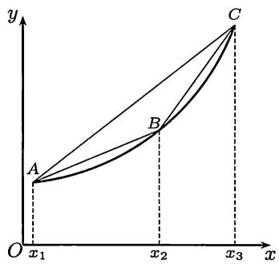
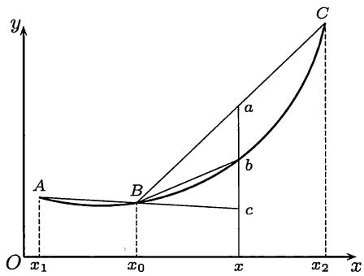

import Guide from '@/components/Guide.astro';
import Knowledge from '@/components/Knowledge.astro';
import Example from '@/components/Example.astro';
import Solution from '@/components/Solution.astro';
import Note from '@/components/Note.astro';
import Block from '@/components/Block.astro';

import Method from '@/components/Method.astro';

凸函数是有广泛应用的一类重要函数。它与凸集的研究一起已形成为一个专门的方向——凸分析。有关凸函数的试题经常在考研试卷中出现，有时在高考试卷中也会出现。本节将介绍凸函数的基本事实。关于用凸函数为工具来证明不等式则将在下一节的$8.5.2$小节内介绍。与积分有关的凸函数性质见第十一章中的$11.2.1$小节的凸函数不等式和部分参考题。

## $8.4.1$ 基本命题

<Block title="定义">
设函数 $f$ 在区间 $I$ 上定义. 若对每一对点 $x_{1}, x_{2} \in I, x_{1} \neq x_{2}$ 和每个 $\lambda \in (0,1)$ , 成立不等式

$$
f (\lambda x _ {1} + (1 - \lambda) x _ {2}) \leqslant \lambda f (x _ {1}) + (1 - \lambda) f (x _ {2}),\tag{8.5}
$$

则称 $f$ 为区间 $I$ 上的下凸函数。又若在 $(8.5)$ 中成立严格不等号，则称 $f$ 为区间 $I$ 上的严格下凸函数。若函数 $-f$ 为下凸函数（严格下凸函数），则称 $f$ 为上凸函数（严格上凸函数）。下凸函数和上凸函数统称为凸函数。
</Block>

<Note>
请读者注意: 下凸函数和上凸函数的名称在我国的数学分析教学中使用已久, 它们与向下凸和向上凸的直观说法一致, 方便易记; 但也有很多教科书和其他文献使用凸函数和凹函数的名称, 因为下凸函数和上凸函数在英语中分别为 convex function 和 concave function.
</Note>

凸函数的定义有明显的几何意义. 在图 $8.5$ 中我们看到下凸条件 $(8.5)$ 表明, 连接该函数图像 $y = f(x)$ 上的任意两点的直线段应当在相应的曲线段的上方. 在下一个命题中我们将对条件 $(8.5)$ 作进一步的发掘, 从而得到更多的等价条件, 这在研究凸函数时非常有用.

<Knowledge title="命题 8.4.1">
函数 $f$ 在区间 $I$ 上为下凸的充分必要条件是对于区间 $I$ 中的任意三点 $x_{1} < x_{2} < x_{3}$ , 成立不等式

$$
\frac {f (x _ {2}) - f (x _ {1})}{x _ {2} - x _ {1}} \leqslant \frac {f (x _ {3}) - f (x _ {1})}{x _ {3} - x _ {1}} \leqslant \frac {f (x _ {3}) - f (x _ {2})}{x _ {3} - x _ {2}}.\tag{8.6}
$$

又如在不等式中的不等号“ $\leqslant$ ”都改为严格的不等号“&lt;”，则就是严格下凸的充分必要条件.

分析 在证明之前先分析条件 $(8.6)$ 的意义.

  
图$8.5$

如图 $8.5$ 所示, 将坐标平面上的三个点 $(x_{1}, f(x_{1}))$ , $(x_{2}, f(x_{2}))$ , $(x_{3}, f(x_{3}))$ 记为点 $A, B, C$ , 又用 $k(\overline{AB}), k(\overline{BC}), k(\overline{AC})$ 表示直线段 $\overline{AB}, \overline{BC}, \overline{AC}$ 的斜率, 则可以将条件 $(8.6)$ 改写为

$$
k (\overline {{{{A B}}}}) \leqslant k (\overline {{{{A C}}}}) \leqslant k (\overline {{{{B C}}}}).\tag{8.7}
$$

但这个条件实际上含有三个不等式:

$$
k (\overline {{A B}}) \leqslant k (\overline {{A C}}), k (\overline {{A B}}) \leqslant k (\overline {{B C}}), k (\overline {{A C}}) \leqslant k (\overline {{B C}}).\tag{8.8}
$$

利用行列式计算容易得到下列等式:

$$
\begin{array}{r l r} \left| \begin{array}{c c c} 1 & 1 & 1 \\ x _ {1} & x _ {2} & x _ {3} \\ f (x _ {1}) & f (x _ {2}) & f (x _ {3}) \end{array} \right| & = \left| \begin{array}{c c} x _ {2} - x _ {1} & x _ {3} - x _ {1} \\ f (x _ {2}) - f (x _ {1}) & f (x _ {3}) - f (x _ {1}) \end{array} \right| \\ & = \left| \begin{array}{c c} x _ {2} - x _ {1} & x _ {3} - x _ {2} \\ f (x _ {2}) - f (x _ {1}) & f (x _ {3}) - f (x _ {2}) \end{array} \right| \\ & = \left| \begin{array}{c c} x _ {3} - x _ {1} & x _ {3} - x _ {2} \\ f (x _ {3}) - f (x _ {1}) & f (x _ {3}) - f (x _ {2}) \end{array} \right|. \end{array}
$$

由于三个二阶行列式非负的条件恰好分别对应了 $(8.8)$ 中的三个不等式,因此这三个不等式相互等价 $^{①}$ . 这样在下面命题 $8.4.1$ 的证明中只需要证明下凸函数的定义和这三个不等式中的某一个等价即可.

<Solution title="证明">
由给定的 $x_{1} < x_{2} < x_{3}$ 可以计算出

$$
\lambda = \frac {x _ {3} - x _ {2}}{x _ {3} - x _ {1}},
$$

它满足条件 $0 < \lambda < 1$ 和等式

$$
x _ {2} = \lambda x _ {1} + (1 - \lambda) x _ {3}.
$$

先证必要性. 由于 $f$ 下凸, 有

$$
f (x _ {2}) \leqslant \lambda f (x _ {1}) + (1 - \lambda) f (x _ {3}).
$$

将 $\lambda$ 的表达式代入, 再加整理, 就得到

$$
(x _ {3} - x _ {1}) [ f (x _ {2}) - f (x _ {1}) ] \leqslant (x _ {2} - x _ {1}) [ f (x _ {3}) - f (x _ {1}) ],
$$

这就是 $k(\overline{AB}) \leqslant k(\overline{AC})$ .

再证充分性. 任取一个不等式, 例如 $k(\overline{AB}) \leqslant k(\overline{AC})$ , 就可以改写为

$$
f (\lambda x _ {1} + (1 - \lambda) x _ {3}) \leqslant \lambda f (x _ {1}) + (1 - \lambda) f (x _ {3}).
$$

由于 $x_{1} < x_{2} < x_{3}$ , 同时它们又是区间 $I$ 中的任意三点, 因此就证明了 $f$ 在 $I$ 上为下凸函数. $\square$
</Solution>
</Knowledge>

<Knowledge title="命题 8.4.2">
开区间上的凸函数必是连续函数.

分析 先作几何观察. 不妨只讨论下凸函数. 设 $f$ 为开区间 $I$ 上的下凸函数, 点 $x_0 \in I$ . 如图 $8.6$ 所示, 在开区间 $I$ 中于 $x_0$ 两侧取 $x_1 < x_0 < x_2$ , 记坐标平面上的点 $(x_1, f(x_1)), (x_0, f(x_0)), (x_2, f(x_2))$ 为 $A, B, C$ . 先从几何上分析如何可以证明 $f$ 于点 $x_0$ 右连续.

取 $x_0 < x < x_2$ ，并在图 $8.6$ 上标出三个点 $a, b, c$ ，它们分别是在坐标平面上过点 $(x, 0)$ 而平行于 $y$ 轴的直线与直线段 $\overline{BC}$ 、曲线 $y = f(x)$ 和直线段 $\overline{AB}$ 的延长线的交点。容易看出，在 $x \to x_0^+$ 时，点 $a$ 和 $c$ 沿直线趋于点 $B$ ，若能证明点 $b$ 确实在 $a, c$ 之间，则证明就完成了。以下即是将这些几何上的观察翻译成分析语言。

  
图$8.6$

<Solution title="证明">
对 $x_{1} < x_{0} < x$ 和 $x_{0} < x < x_{2}$ 分别应用命题 $8.4.1$ , 就得到

$$
k (\overline {{{B c}}}) \leqslant k (\overline {{{B b}}}) \leqslant k (\overline {{{B a}}}).\tag{8.9}
$$

由于 $x_0 < x$ ，不等式 $(8.9)$ 等价于在 $a, b, c$ 三点的纵坐标之间的下列序关系：

$$
\frac {x - x _ {0}}{x _ {0} - x _ {1}} \cdot [ f (x _ {0}) - f (x _ {1}) ] + f (x _ {0}) \leqslant f (x) \leqslant \frac {x _ {2} - x}{x _ {2} - x _ {0}} f (x _ {0}) + \frac {x - x _ {0}}{x _ {2} - x _ {0}} f (x _ {2}).
$$

令 $x \to x_0^+$ , 用夹逼定理, 就得到

$$
\lim _ {x \to x _ {0} ^ {+}} f (x) = f (x _ {0}).
$$

关于 $f$ 在点 $x_{0}$ 为左连续的证明完全类似, 从略.
</Solution>

<Note>
若凸函数的定义域不是开区间, 则在端点处可以不连续. 例如,

$$
f (x) = \left\{ \begin{array}{l l} 1, & x = 0, 1, \\ 0, & 0 <   x <   1 \end{array} \right.
$$

在闭区间 $[0,1]$ 上是下凸函数，但在端点处不连续.
</Note>
</Knowledge>

<Knowledge title="命题 8.4.3">
若 $f$ 为开区间 $I$ 上的下凸函数, 则

(1) $f$ 处处存在有限的两个单侧导数, 而且成立不等式 $f_{-}^{\prime}(x) \leqslant f_{+}^{\prime}(x), x \in I$ ;

(2) 对任何 $x, y \in I, x < y$ , 成立不等式 $f_{-}^{\prime}(x) \leqslant f_{+}^{\prime}(x) \leqslant f_{-}^{\prime}(y) \leqslant f_{+}^{\prime}(y)$ , 由此知道 $f_{-}^{\prime}$ 和 $f_{+}^{\prime}$ 均为单调增加函数.

<Solution title="证明">
只要利用不等式 $(8.6)$ 和图 $8.5, 8.6$ 就够了.

(1) 利用 $(8.8)$ 中的第一个不等式, 在图 $8.6$ 上有 $k(\overline{Bb}) \leqslant k(\overline{BC})$ , 而且可以看出当 $x \to x_0^+$ 时, $k(\overline{Bb})$ 单调减少, 同时又以 $k(\overline{Bc})$ 为下界, 因此一定有极限. 这就证明了 $f_+(x_0)$ 存在. 类似地可以证明 $f_-(x_0)$ 的存在性.

(2) 观察图 $8.5$, 利用 $(8.6)$, 再分别令 $x_{2} \to x_{1}^{+}$ 和 $x_{2} \to x_{3}^{-}$ , 由于在 $(1)$ 中已经证明了两个单侧导数的存在性, 因此就得到 $f_{+}^{\prime}(x_{1}) \leqslant k(\overline{AC}) \leqslant f_{-}^{\prime}(x_{3})$ . 将 $x_{1}, x_{3}$ 改记为 $x, y$ 即可. $\square$
</Solution>

<Note>
由于命题 $8.4.3$ 的证明不需要用命题 $8.4.2$ 的结论, 因此很多文献中将后者作为前者的推论得到, 即从两个单侧导数存在推出连续. 从命题 $8.4.2$ 的证明可见, 直接证明连续性也是容易的.
</Note>
</Knowledge>

<Knowledge title="命题 8.4.4">
设 $f$ 在区间 $I$ 上可微, 则

(1) $f$ 在 $I$ 上为下凸函数的充分必要条件是 $f'$ 在 $I$ 上为单调增加函数；

(2) $f$ 在 $I$ 上为严格下凸函数的充分必要条件是 $f'$ 在 $I$ 上严格单调增加.

<Solution title="证明">
先给出 $(1)$ 的充分性部分的证明. 利用命题 $8.4.1$ 和对其结果 (在证明前) 的分析, 可见只需要证明对曲线 $y = f(x)$ 上自左到右的任意不同三点 $A, B, C$ 成立 $k(\overline{AB}) \leqslant k(\overline{BC})$ .

设 $f'$ 在区间 $I$ 上单调增加. 取 $x_{1}, x_{2} \in I, x_{1} < x_{2}, \lambda \in (0,1)$ . 引入

$$
x _ {\lambda} = \lambda x _ {1} + (1 - \lambda) x _ {2}.
$$

将点 $(x_{1},f(x_{1})),(x_{\lambda},f(x_{\lambda})),(x_{2},f(x_{2}))$ 分别记为 $A,B,C,$ 则就有

$$
\begin{array}{r} k (\overline {{A B}}) = \frac {f (x _ {\lambda}) - f (x _ {1})}{x _ {\lambda} - x _ {1}}, \\ k (\overline {{B C}}) = \frac {f (x _ {2}) - f (x _ {\lambda})}{x _ {2} - x _ {\lambda}}. \end{array}
$$

对右边的两个差商用 $\$Lagrange$ 微分中值定理, 分别得到 $f'(\xi_{1})$ 和 $f'(\xi_{2})$ , 其中

$$
\xi_ {1} \in (x _ {1}, x _ {\lambda}), \xi_ {2} \in (x _ {\lambda}, x _ {2}).
$$

由于 $\xi_{1}<\xi_{2}$ ，利用条件 $f'$ 为单调增加，因此有

$$
f ^ {\prime} (\xi_ {1}) \leqslant f ^ {\prime} (\xi_ {2}).\tag{8.10}
$$

这样就得到所要的结果

$$
k (\overline {{{{A B}}}}) \leqslant k (\overline {{{{B C}}}}).
$$

$(1)$ 的必要性部分可由命题 $8.4.3$ 之 $(2)$ 得出.

关于 $(2)$ 的证明只概述如下:

充分性部分可从上面看出. 由于 $f'$ 严格单调增加, 因此从 $\xi_1 < \xi_2$ 可见不等式 $(8.10)$ 成立严格不等号, 即有 $k(\overline{AB}) < k(\overline{BC})$ . 由命题 $8.4.1$ 的证明过程可知这时就保证了 $f$ 严格下凸.

又若 $f'$ 单调增加但不是严格单调增加, 则在区间 $I$ 上存在点 $x_1 < x_2$ , 使得 $f'(x)$ 在子区间 $[x_1, x_2]$ 上为常值函数, 从而 $f$ 在区间 $[x_1, x_2]$ 上是线性函数, 而不可能是严格下凸函数. 这样就完成了必要性的证明.
</Solution>
</Knowledge>

<Knowledge title="命题 8.4.5">
若 $f$ 是区间 $I$ 上的可微下凸函数, 则经过点 $(x_0, f(x_0)) (x_0 \in I)$ 的切线一定在曲线 $y = f(x)$ 的下方, 即成立不等式

$$
f (x) \geqslant f (x _ {0}) + f ^ {\prime} (x _ {0}) (x - x _ {0}), \forall x \in I.
$$

又若 $f$ 严格下凸, 则上述不等式成立等号的充分必要条件是 $x = x_0$ .

<Solution title="证明">
将上述不等式的右边移项到左边, 然后用 $\$Lagrange$ 中值定理, 就有

$$
f (x) - f \left(x _ {0}\right) - f ^ {\prime} \left(x _ {0}\right) \left(x - x _ {0}\right) = \left(f ^ {\prime} (\xi) - f ^ {\prime} \left(x _ {0}\right)\right) \left(x - x _ {0}\right),
$$

其中 $\xi \in (x_0, x)$ 或 $(x, x_0)$ . 用命题 $8.4.4$ 可见上式非负, 而在 $f$ 为严格下凸时, $f'$ 为严格单调, 因此仅当 $x = x_0$ 时为 $0$ .
</Solution>

<Note>
称直线 $y = f(x_0) + f'(x_0)(x - x_0)$ 为凸函数 $f$ 在点 $(x_0, f(x_0))$ 处的支撑线. 若去掉可微条件, 则仍存在相应的支撑线, 见 $8.4.2$ 小节的题 $11$ .
</Note>
</Knowledge>

<Knowledge title="命题 8.4.6">
设函数 $f$ 于区间 $I$ 上二阶可微, 则

(1) $f$ 在 $I$ 上为下凸函数的充分必要条件是在 $I$ 上处处有 $f''(x) \geqslant 0$ ;

(2) $f$ 在 $I$ 上为严格下凸函数的充分必要条件是在 $I$ 上处处有 $f''(x) \geqslant 0$ , 而且在任一正长度的子区间上 $f''(x)$ 不恒等于零.

这个命题可以从命题 $8.4.4$ 的结论直接得出, 但也可以证明如下.

<Solution title="证明">
（只证明 $(1)$）先证必要性. 对区间的内点 $x$ , 取 $h > 0$ 充分小, 就可以由下凸性推出不等式

$$
f (x) \leqslant \frac {1}{2} [ f (x - h) + f (x + h) ].
$$

这保证了下列极限非负:

$$
\lim _ {h \to 0} \frac {f (x + h) - 2 f (x) + f (x - h)}{h ^ {2}} = f ^ {\prime \prime} (x).
$$

对端点可由 $\$Darboux$ 定理推出.

再证充分性. 如命题 $8.4.4$ 证明一开始那样对 $x_{1} < x_{2}$ 和 $0 < \lambda < 1$ 引入 $x_{\lambda}$ , 并写出 $f(x_{1})$ 和 $f(x_{2})$ 在点 $x_{\lambda}$ 的带 $\$Lagrange$ 型余项的 $\$Taylor$ 公式:

$$
\begin{array}{r} f (x _ {1}) = f (x _ {\lambda}) + f ^ {\prime} (x _ {\lambda}) (x _ {1} - x _ {\lambda}) + \frac {1}{2} f ^ {\prime \prime} (\xi_ {1}) (x _ {1} - x _ {\lambda}) ^ {2}, \\ f (x _ {2}) = f (x _ {\lambda}) + f ^ {\prime} (x _ {\lambda}) (x _ {2} - x _ {\lambda}) + \frac {1}{2} f ^ {\prime \prime} (\xi_ {2}) (x _ {2} - x _ {\lambda}) ^ {2}, \end{array}
$$

其中 $\xi_1\in (x_1,x_\lambda),\xi_2\in (x_\lambda ,x_2)$ .将第一式乘 $\lambda$ 与第二式乘 $(1 - \lambda)$ 相加，利用二阶导数非负和 $x_{\lambda} = \lambda x_{1} + (1 - \lambda)x_{2}$ ，就得到所要的不等式

$$
\lambda f (x _ {1}) + (1 - \lambda) f (x _ {2}) \geqslant f (x _ {\lambda}).
$$
</Solution>
</Knowledge>

<Knowledge title="命题 8.4.7 (下凸函数的 Jensen (詹森) 不等式)">
如 $f$ 为区间 $I$ 上的二阶可微下凸函数, 则对任何 $x_{1}, x_{2}, \cdots, x_{n} \in I$ 与满足条件 $\lambda_{1} + \lambda_{2} + \cdots + \lambda_{n} = 1$ 的 $n$ 个正数 $\lambda_{1}, \lambda_{2}, \cdots, \lambda_{n}$ 成立不等式

$$
\lambda_ {1} f (x _ {1}) + \lambda_ {2} f (x _ {2}) + \dots + \lambda_ {n} f (x _ {n}) \geqslant f (\lambda_ {1} x _ {1} + \lambda_ {2} x _ {2} + \dots + \lambda_ {n} x _ {n}).\tag{8.11}
$$

又若 $f$ 严格下凸, 则上述不等式成立等号的充分必要条件是

$$
x _ {1} = x _ {2} = \dots = x _ {n}.\tag{8.12}
$$

<Solution title="证明">
记 $\overline{x} = \lambda_{1}x_{1} + \lambda_{2}x_{2} + \cdots + \lambda_{n}x_{n}$ (即数 $x_{1}, x_{2}, \cdots, x_{n}$ 的加权平均值), 并写出 $f(x_{i}) (i = 1, 2, \cdots, n)$ 在点 $\overline{x}$ 的带 $\$Lagrange$ 余项的 $\$Taylor$ 公式:

$$
f (x _ {i}) = f (\overline {{{{x}}}}) + f ^ {\prime} (\overline {{{{x}}}}) (x _ {i} - \overline {{{{x}}}}) + \frac {f ^ {\prime \prime} (\xi_ {i})}{2 !} (x _ {i} - \overline {{{{x}}}}) ^ {2}, i = 1, 2, \dots , n.
$$

将这 $n$ 个公式分别乘以 $\lambda_{1}, \lambda_{2}, \cdots, \lambda_{n}$ 后相加，利用条件 $\lambda_{1} + \lambda_{2} + \cdots + \lambda_{n} = 1$ 和二阶导数非负，就得到 $\$Jensen$ 不等式：

$$
\lambda_ {1} f (x _ {1}) + \lambda_ {2} f (x _ {2}) + \dots + \lambda_ {n} f (x _ {n}) \geqslant f (\overline {{x}}) + f ^ {\prime} (\overline {{x}}) (\overline {{x}} - \overline {{x}}) = f (\overline {{x}}).
$$

以下讨论当 $f$ 严格下凸时, 在 $\$Jensen$ 不等式中成立等号的条件.

若在上述不等式中成立等号, 则由于每个 $\lambda_{i} > 0 (i = 1, 2, \cdots, n)$ , 从以上证明过程可以看出只能是对每个 $i = 1, 2, \cdots, n$ 成立

$$
f (x _ {i}) = f (\overline {{{{x}}}}) + f ^ {\prime} (\overline {{{{x}}}}) (x _ {i} - \overline {{{{x}}}}).
$$

用命题 $8.4.5$, 可见只能有 $x_{i} = \overline{x}$ .

反之是明显的. 若条件 $(8.12)$ 成立, 则对每个 $i = 1, 2, \cdots, n$ 有 $x_{i} = \overline{x}$ , 因此在上面的不等式中成立等号.
</Solution>

<Note>
命题中的二阶可微条件并非必要 (作为下面的练习题 $1$). 但从应用来看, 用二阶导数来检验凸性较为方便. 这在 $8.5.2$ 小节中有很多例题可供参考.
</Note>
</Knowledge>

以下是一个与凸性密切相关的概念, 它在许多方面有应用.

<Block title="定义">
称曲线 $y = f(x)$ 上的点 $(x_0, f(x_0))$ 为拐点 (或变曲点)，如果在该点两侧邻近的曲线具有不同的严格凸性.
</Block>

关于拐点的基本命题见下面练习题的最后几个题.

## $8.4.2$ 练习题

1. 在不假定函数 $f$ 可微的条件下, 证明 $\$Jensen$ 不等式 $(8.11)$ 仍然成立.

2. 设 $f$ 是区间 $(a, b)$ 上的上凸函数, 且 $f(x) > 0$ , 证明: 函数 $1 / f$ 是区间 $(a, b)$ 上的下凸函数. 又问: 若在上题中将 $f$ 的上凸条件改为下凸, 则有何结论? (本题的变形是对 $f$ 加上一阶可微或二阶可微条件.)

3. 设 $f, g$ 是 $(a, b)$ 上的下凸函数, 证明: $\max \{f, g\}$ 也是 $(a, b)$ 上的下凸函数.

4. 设 $f$ 和 $g$ 均为区间 $I$ 上的单调增加非负下凸函数, 证明: $f \cdot g$ 为区间 $I$ 上的下凸函数.

5. 设 $f$ 在区间 $I$ 上为下凸函数, 证明: $F(x) = \mathrm{e}^{f(x)}$ 也是 $I$ 上的下凸函数.

6. 设 $f$ 和 $g$ 为 $(- \infty, + \infty)$ 上的下凸函数, 问: 复合函数 $f \circ g$ 是否一定是 $(- \infty, + \infty)$ 上的下凸函数?

7. 设 $f$ 为 $(- \infty, + \infty)$ 上的下凸函数, 证明: 或者 $f$ 为单调函数, 或者存在点 $c$ , 使得 $f$ 在 $(- \infty, c]$ 上单调减少, 而在 $[c, + \infty)$ 上单调增加.

8. 设 $f$ 在 $(- \infty, + \infty)$ 上有界, 且处处有 $f''(x) \geqslant 0$ , 证明: $f$ 只能是常值函数.

9. 设 $f$ 在 $(a,b)$ 上 $n$ 阶可微 $(n>2)$ ， $f^{(n)}(x)>0$ 。又有 $x_{0}\in(a,b)$ ，使对于 $k=1,2,\cdots,n-1$ 成立 $f^{(k)}(x_{0})=0$ 。证明：

(1) $n$ 为奇数时, $f$ 在 $(a, b)$ 上严格单调增加;

(2) $n$ 为偶数时, $f$ 在 $(a, b)$ 上严格下凸.

10. 设 $f$ 在开区间 $(c, d)$ 上为下凸函数, 则 $f$ 一定满足内闭的 $\$Lipschitz$ 条件. (这就是说对每个有界闭区间 $[a, b] \subset (c, d)$ , 存在 $M > 0$ , 对所有 $x_{1}, x_{2} \in [a, b]$ , 成立 $|f(x_{1}) - f(x_{2})| \leqslant M|x_{1} - x_{2}|.$ )

11. 证明: $f$ 在开区间 $I$ 上为下凸函数的充分必要条件是对每个 $c \in I$ , 存在 $a$ , 使在区间 $I$ 上成立不等式 $f(x) \geqslant a(x - c) + f(c)$ (称 $y = a(x - c) + f(c)$ 为支撑线).

12. 设 $f$ 在 $[a, +\infty)$ 上为凸函数, 证明: $\lim_{x \to +\infty} \frac{f(x)}{x}$ 一定有意义.

13. 设 $f$ 在 $(- \infty, + \infty)$ 上为凸函数, 又有 $\lim_{x \to \pm \infty} \frac{f(x)}{x} = 0$ , 证明: $f$ 是常值函数.

14. 设 $f$ 是 $[a, b]$ 上的凸函数, 如果有 $c \in (a, b)$ 使得 $f(a) = f(c) = f(b)$ , 证明: $f(x)$ 是 $[a, b]$ 上的常值函数.

15. 设 $a < b < c < d$ , 证明: 若 $f$ 在 $[a, c]$ 和 $[b, d]$ 上是下凸函数, 则 $f$ 也是 $[a, d]$ 上的下凸函数.

16. 证明: 不存在三次或三次以上的奇次多项式为 $(- \infty, + \infty)$ 上的凸函数.

17. 设 $f$ 在区间 $(a, b)$ 上二阶可微, $f''$ 无零点, 证明: 对该区间内的任何两点 $a < x_1 < x_2 < b$ 用 $\$Lagrange$ 中值定理得到 $f(x_1) - f(x_2) = f'(\xi)(x_1 - x_2)$ 时, 其中的中值 $\xi \in (x_1, x_2)$ 总是唯一的.

18. 若曲线 $y = f(x)$ 以 $(x_0, f(x_0))$ 为拐点，且存在 $f''(x_0)$ ，证明： $f''(x_0) = 0$ .

19. 问: 若已知有 $f''(x_0) = 0$ , 则点 $(x_0, f(x_0))$ 是否一定是曲线 $y = f(x)$ 的拐点?

20. 设 $f$ 在点 $x_{0}$ 处 $n (n > 2)$ 阶可微, 且满足条件 $f''(x_{0}) = \cdots = f^{(n-1)}(x_{0}) = 0$ , 但 $f^{(n)}x_{0} \neq 0$ , 请参考例题 $8.3.1$ 写出点 $(x_{0}, f(x_{0}))$ 是拐点的充分必要条件并作出证明.
