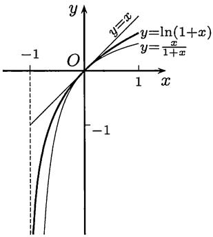
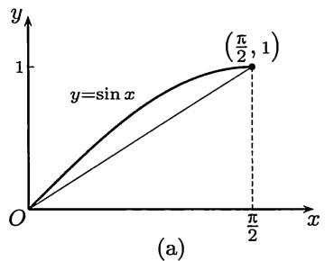
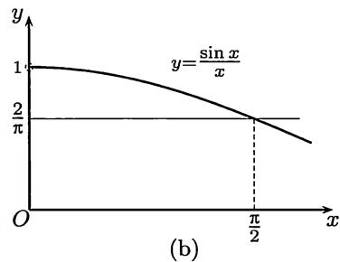

import Guide from '@/components/Guide.astro';
import Knowledge from '@/components/Knowledge.astro';
import Example from '@/components/Example.astro';
import Solution from '@/components/Solution.astro';
import Note from '@/components/Note.astro';
import Block from '@/components/Block.astro';
import Method from '@/components/Method.astro';

不等式在数学中十分重要, 内容极为丰富. 在本节中我们用导数为工具来证明一些不等式. 其中用凸函数为工具的例题则在 $8.5.2$ 小节中作专门介绍. 与积分有关的不等式见 §$11.2$. 这方面的部分参考书为 [$2$, $22$, $30$, $48$, $62$, $63$].

## $8.5.1$ 例题

例题$8.5.1$是用$Lagrange$中值定理证明不等式的典型例子. 在图$8.7$中显示了不等式的几何意义.

<Example title="例题8.5.1">

证明: 在 $x > -1$, $x \neq 0$ 时, 成立不等式

$$
\frac {x}{1 + x} <   \ln (1 + x) <   x.
$$

<Solution title="证明">

记 $f(x) = \ln (1 + x)$ , 从中值定理得到

$$
\ln (1 + x) = f (x) - f (0) = \frac {x}{1 + \theta x}, 0 <   \theta <   1.
$$

对 $x > 0$ 和 $-1 < x < 0$ 分别讨论就可以得到

$$
\frac {x}{1 + x} <   \frac {x}{1 + \theta x} <   x.
$$

  
图$8.7$

</Solution>

<Note>

回顾第二章中的不等式 ($2.16$), 即

$$
{\frac {1}{n + 1}} <   \ln \left(1 + {\frac {1}{n}}\right) <   {\frac {1}{n}},
$$

可以看到它只是本例题在 $x = 1 / n$ 时的特例．当时的不等式($2.16$)来自于对数$e$的研究，在那里只用了一个工具——平均值不等式.

</Note>

</Example>

$Cauchy$ 中值定理在证明不等式中也有应用.

<Example title="例题8.5.2">

证明: 对 $0 < a < b \leqslant \frac{\pi}{2}$ , 成立不等式

$$
\frac {\sin a}{a} > \frac {\sin b}{b}.
$$

<Solution title="证明">

这等价于证明函数 $\frac{\sin x}{x}$ 在区间 $(0, \frac{\pi}{2}]$ 上严格单调减少. (该函数的图像见图$4.2$(a)和$8.8$(b).) 这里用$Cauchy$中值定理来作出证明. 令 $f(x) = \sin x$ , $g(x) = \sin \frac{b}{a} x$ . 从$Cauchy$中值定理知道存在 $\xi \in (0, a)$ , 使成立

$$
\frac {\sin a}{\sin b} = \frac {f (a) - f (0)}{g (a) - g (0)} = \frac {f ^ {\prime} (\xi)}{g ^ {\prime} (\xi)}.
$$

由于 $f^{\prime}(\xi) = \cos \xi, g^{\prime}(\xi) = \frac{b}{a}\cos \frac{b}{a}\xi,$ 而 $\cos u$ 在 $0 < u < \frac{\pi}{2}$ 上严格单调减少，因此就得到所要的结果

$$
{\frac {\sin a}{\sin b}} = {\frac {a}{b}} \cdot {\frac {\cos \xi}{\cos {\frac {b}{a}} \xi}} > {\frac {a}{b}}.
$$

</Solution>

<Note>

这个例题的证明方法很多, 这里再举出两个.

(1) 在区间 $(0, \pi / 2]$ 上定义辅助函数 $F(x) = \sin x / x$ , 求导即可.

(2) 利用 $8.2.2$ 小节的题 $4$, 在 $[0, \pi/2)$ 上取 $f(x) = x$ , $g(x) = \sin x$ , 由于 $f'(x)/g'(x) = \sec x$ 单调增加, 因此 $x/\sin x$ 也单调增加.

</Note>

</Example>

利用单调性证明不等式的例子很多. 一个典型例题就是

<Example title="例题8.5.3">

证明: 在 $x > 0$ 时, 成立 $\sin x > x - \frac{x^{3}}{6}$ .

<Solution title="证明">

令 $F(x) = \sin x - x + \frac{x^3}{6}$ ，则有 $F(0) = 0$ . 因此只要证明当 $x > 0$ 时成立 $F'(x) > 0$ ，就可以从 $F$ 单调增加知道在 $x > 0$ 时成立 $F(x) > 0$ . 由于 $F'(0) = 0$ ，又发现问题归结为证明 $F''(x) > 0 (x > 0)$ . 由于 $F''(x) = -\sin x + x$ ，可见这已满足. 由此反推即可.

</Solution>

</Example>

证明不等式的另一个方法是将它转化为极值问题. 下面就是一个典型例子 (见 [$30$]), 它在本书第十二章中有用.

<Example title="例题8.5.4">

设 $a \geqslant 1$ , 证明: 在 $x \in [0, a]$ 时成立不等式

$$
0 \leqslant \mathrm{e} ^ {- x} - \left(1 - \frac {x}{a}\right) ^ {a} \leqslant \frac {x ^ {2}}{a} \mathrm{e} ^ {- x}.
$$

<Solution title="证明">

先证明左边的不等式 (这时只要 $a > 0$ ). 将中间的表达式记为 $f(x)$ , 则只要证明 $f$ 在区间 $[0, a]$ 上的最小值非负即可. 由于 $f(0) = 0$ , $f(a) = \mathrm{e}^{-a} > 0$ , 因此只要证明若 $f$ 有极值, 则该极值非负.

若 $f'$ 没有零点, 则无极值; 若 $f'$ 有零点, 记为 $\xi$ , 就有

$$
f ^ {\prime} (\xi) = - \mathrm{e} ^ {- \xi} + \left(1 - \frac {\xi}{a}\right) ^ {a - 1} = 0.
$$

由此即可计算出

$$
f (\xi) = \mathrm{e} ^ {- \xi} - \left(1 - \frac {\xi}{a}\right) ^ {a} = \frac {\xi}{a} \cdot \mathrm{e} ^ {- \xi} \geqslant 0.
$$

因此左边不等式成立. 对右边不等式的证明留作为 $8.5.3$ 小节的练习题 $16$. □

</Solution>

<Note>

在证明右边的不等式时, 如果先乘以 $\mathbf{e}^x$ , 则计算方便一些 (见 [$44$]). 但这不是实质性的技巧.

</Note>

</Example>

下面是用一元微分学对平均值不等式的一个证明。它是由 $Liouville$ (刘维尔) 提出的 (又为后人多次“发现”)。

<Example title="例题8.5.5">

用 $Liouville$ 方法证平均值不等式, 即对非负数 $x_{1}, x_{2}, \cdots, x_{n}$ 有

$$
\frac {x _ {1} + x _ {2} + \cdots + x _ {n}}{n} \geqslant \sqrt [ n ]{x _ {1} x _ {2} \cdots x _ {n}},
$$

其中等号成立的充分必要条件是 $x_{1}=x_{2}=\cdots=x_{n}$ .

<Solution title="证明">

若在 $x_{1}, x_{2}, \cdots, x_{n}$ 中有 $0$ 出现，则不等式已成立。同时也可看出成立等号的条件是其中每个数为 $0$。因此在下面设 $x_{1}, x_{2}, \cdots, x_{n}$ 全为正数。

用数学归纳法. 在 $n = 2$ 时已知成立. 现设平均值不等式对 $n$ 已成立, 讨论 $n + 1$ 的情况.

构造辅助函数

$$
y = \left(\frac {\sum_ {i = 1} ^ {n + 1} x _ {i}}{n + 1}\right) ^ {n + 1} - \prod_ {i = 1} ^ {n + 1} x _ {i},
$$

并将 $x_{n + 1}$ 看成是自变量， $y$ 是因变量. 求导得到

$$
\frac {\mathrm{d} y}{\mathrm{d} x _ {n + 1}} = \left(\frac {\sum_ {i = 1} ^ {n + 1} x _ {i}}{n + 1}\right) ^ {n} - \prod_ {i = 1} ^ {n} x _ {i}.
$$

可以看出这个导函数是 $(x_{n + 1}$ 的)严格单调增加函数. 求出它的零点

$$
x _ {n + 1} = - \sum_ {i = 1} ^ {n} x _ {i} + (n + 1) \left(\prod_ {i = 1} ^ {n} x _ {i}\right) ^ {\frac {1}{n}},\tag{8.13}
$$

可见 $y$ 在该点取到最小值. 记这个最小值为 $m$ , 则可以计算出

$$
\begin{array}{l} m = \prod_ {i = 1} ^ {n} x _ {i} \left(\frac {\sum_ {i = 1} ^ {n + 1} x _ {i}}{n + 1} - x _ {n + 1}\right) \\ = \prod_ {i = 1} ^ {n} x _ {i} \left[ \left(\prod_ {i = 1} ^ {n} x _ {i}\right) ^ {\frac {1}{n}} + \sum_ {i = 1} ^ {n} x _ {i} - (n + 1) \left(\prod_ {i = 1} ^ {n} x _ {i}\right) ^ {\frac {1}{n}} \right] \\ = \prod_ {i = 1} ^ {n} x _ {i} \left[ \sum_ {i = 1} ^ {n} x _ {i} - n \left(\prod_ {i = 1} ^ {n} x _ {i}\right) ^ {\frac {1}{n}} \right]. \end{array}
$$

对最后一式的第二个因子用归纳假设, 可见最小值 $m \geqslant 0$ . 因此得到 $y \geqslant m \geqslant 0$ , 即已经得到了所要求证的不等式.

若在 $n+1$ 的平均值不等式中成立等号，则有 $y=0$，从而有 $y=m=0$。从 $m$ 的表达式和归纳假设可得 $x_{1}=x_{2}=\cdots=x_{n}$ 。又由 $y=m$ 可见 $x_{n+1}$ 满足等式 ($8.13$)，从而有 $x_{n+1}=x_{1}=\cdots=x_{n}$ .

</Solution>

</Example>

下面的 $Jordan$ (若尔当) 不等式是关于正弦函数的一个基本不等式. 图 $8.8$(a) 是该不等式的几何意义, 在图 $8.8$(b) 中作出了证 $1$ 中的辅助函数 $\sin x / x$ 的图像.

<Example title="例题8.5.6 ($Jordan$不等式)">

设 $0 \leqslant x \leqslant \frac{\pi}{2}$ , 则成立不等式 $\sin x \geqslant \frac{2}{\pi} x$ .

<Solution title="证明1">

在 $x = 0$ 时不等式已成立. 对 $0 < x \leqslant \pi / 2$ 可以引入辅助函数 (见图$8.8$(b))

$$
F (x) = \frac {\sin x}{x}.
$$

从例题$8.5.2$知 $F(x)$ 在 $(0, \pi / 2]$ 上严格单调减少，从而在 $0 < x \leqslant \pi / 2$ 时成立

$$
F \left(\frac {\pi}{2}\right) = \frac {2}{\pi} \leqslant F (x) = \frac {\sin x}{x}.
$$

这等价于所要求证的不等式.

</Solution>

<Solution title="证明2">

构造辅助函数

$$
\varphi (x) = \sin x - \frac {2}{\pi} x,
$$

则只要证明在区间 $[0, \pi / 2]$ 上函数 $\varphi(x)$ 非负.

在区间的两个端点上有

$$
\varphi (0) = \varphi \left(\frac {\pi}{2}\right) = 0.
$$

计算

$$
\varphi^ {\prime} (x) = \cos x - \frac {2}{\pi},
$$

可见 $\varphi'(x)$ 在区间 $[0, \pi/2]$ 上严格单调减少。由于 $\varphi'(0) > 0, \varphi'(\pi/2) < 0$ ，因此存在唯一的点 $\xi \in (0, \pi/2)$ ，使得 $\varphi'(\xi) = 0$ 。这样就知道在 $0 \leqslant x \leqslant \xi$ 时函数 $\varphi(x)$ 严格单调增加，因此有 $\varphi(x) \geqslant \varphi(0) = 0$ ；而在 $\xi \leqslant x \leqslant \pi/2$ 时 $\varphi(x)$ 严格单调减少，因此有 $\varphi(x) \geqslant \varphi(\pi/2) = 0$ 。这样就证明了在区间 $[0, \pi/2]$ 上处处成立 $\varphi(x) \geqslant 0$ .

  
图$8.8$

</Solution>

<Note>

从图$8.8$(a)可以想到, 若 $y = \sin x$ 在 $[0, \pi/2]$ 上为上凸函数, 则就可以得到$Jordan$不等式. 从 $y'' = -\sin x$ 可见这是对的. 因此就得到了$Jordan$不等式的第三个证明.

</Note>

</Example>

用 $Taylor$ 公式也是证明不等式的一种方法. 例如下一个例题中就同时提供了关于函数 $\ln (1 + x)$ 的许多不等式.

<Example title="例题8.5.7">

当 $x > 0$ 时, 证明: 对每个正整数 $n$ 成立不等式

$$
x - \frac {x ^ {2}}{2} + \frac {x ^ {3}}{3} - \dots - \frac {x ^ {2 n}}{2 n} <   \ln (1 + x) <   x - \frac {x ^ {2}}{2} + \frac {x ^ {3}}{3} - \dots + \frac {x ^ {2 n - 1}}{2 n - 1}.
$$

<Solution title="证明">

写出函数 $\ln (1 + x)$ 的带$Lagrange$余项的$Maclaurin$公式：

$$
\ln (1 + x) = x - \frac {x ^ {2}}{2} + \frac {x ^ {3}}{3} - \dots + (- 1) ^ {n - 1} \frac {x ^ {n}}{n} + \frac {(- 1) ^ {n}}{n + 1} \cdot \frac {x ^ {n + 1}}{(1 + \theta x) ^ {n + 1}},
$$

其中 $0 < \theta < 1$ . 由于 $x > 0$ , 右边的余项的符号由 $(-1)^n$ 决定. 当 $n$ 为偶数时该项大于 $0$, 而当 $n$ 为奇数时该项小于 $0$. 这样就得到所要求证的不等式. □

</Solution>

</Example>

## $8.5.2$ 用凸性证不等式

这里的基本工具是 $Jensen$ 不等式 ($8.11$) (见命题 $8.4.7$). 在那里已经提到, 该不等式对所有下凸函数成立, 而并不要求二阶可微的条件. 但用二阶导数的符号来验证一个给定函数是否下凸还是一个很实际的方法.

在下面的前三个不等式统称为经典不等式. 由于它们在数学中的重要性, 均作为命题给出. 第一个不等式即平均值不等式 (命题 $1.3.3$) 的推广.

<Knowledge title="命题8.5.1 (广义的算术平均值 - 几何平均值不等式)">

设有非负数 $x_{1}, \cdots, x_{n}$ 和正数 $\lambda_{1}, \cdots, \lambda_{n}$ , 且 $\lambda_{1} + \cdots + \lambda_{n} = 1$ , 则成立不等式

$$
\prod_ {k = 1} ^ {n} x _ {k} ^ {\lambda_ {k}} \leqslant \sum_ {k = 1} ^ {n} \lambda_ {k} x _ {k},\tag{8.14}
$$

其中当且仅当 $x_{1}=x_{2}=\cdots=x_{n}$ 时成立等号.

<Solution title="证明">

令 $f(u) = -\ln u, u > 0$ . 由于 $f''(u) = 1 / u^2 > 0$ , 因此 $f(u)$ 是严格下凸函数 (用命题$8.4.6$). 用$Jensen$不等式($8.11$)得到

$$
- \ln \left(\sum_ {k = 1} ^ {n} \lambda_ {k} x _ {k}\right) \leqslant - \sum_ {k = 1} ^ {n} \lambda_ {k} \ln x _ {k}.
$$

移项并利用对数函数的单调性, 即可得到所要求证的不等式. 关于其中成立等号的条件已在命题 $8.4.7$ 中得到证明. □

</Solution>

<Note>

若取 $\lambda_{i}=1/n, i=1,2,\cdots,n,$ 就得到普通的平均值不等式. 此外, 与平均值不等式类似, 有许多不同的方法可以证明以上的广义平均值不等式.

</Note>

</Knowledge>

第二个要介绍的 $Hölder$ (赫尔德) 不等式是在第一章中的 $Cauchy$ 不等式 (见命题 $1.3.5$) 的推广, 它在数学的许多领域中起重要作用, 也可以用于证明广义的平均值不等式.

<Knowledge title="命题8.5.2 ($Hölder$ 不等式)">

设 $x_{1}, x_{2}, \cdots, x_{n}$ 和 $y_{1}, y_{2}, \cdots, y_{n}$ 均为非负数，又有 $p > 1$, $q > 1$，且满足 (共轭) 条件

$$
\frac {1}{p} + \frac {1}{q} = 1,
$$

则成立不等式

$$
\sum_ {k = 1} ^ {n} x _ {k} y _ {k} \leqslant \left(\sum_ {k = 1} ^ {n} x _ {k} ^ {p}\right) ^ {\frac {1}{p}} \left(\sum_ {k = 1} ^ {n} y _ {k} ^ {q}\right) ^ {\frac {1}{q}},\tag{8.15}
$$

其中成立等号的充分必要条件是数组 $x_{1}^{p}, x_{2}^{p}, \cdots, x_{n}^{p}$ 和 $y_{1}^{q}, y_{2}^{q}, \cdots, y_{n}^{q}$ 成比例.

<Solution title="证明">

先对于至少有一个数组中的每个数都大于 $0$ 的情况作出证明. 为确定起见, 不妨设 $y_{1}, y_{2}, \cdots, y_{n}$ 中的每个数都大于 $0$, 则可证明如下.

取函数 $f(u) = u^p, u \geqslant 0$ . 由于 $f''(u) = p(p - 1)u^{p - 2} \geqslant 0$ , 因此 $f(u)$ 是严格下凸函数. 令

$$
\lambda_ {k} = \frac {y _ {k} ^ {q}}{\sum_ {i = 1} ^ {n} y _ {i} ^ {q}}, u _ {k} = x _ {k} y _ {k} ^ {1 - q}, k = 1, 2, \dots , n,
$$

并代入 $Jensen$ 不等式 ($8.11$), 就有

$$
\left(\frac {\sum_ {k = 1} ^ {n} x _ {k} y _ {k}}{\sum_ {k = 1} ^ {n} y _ {k} ^ {q}}\right) ^ {p} \leqslant \sum_ {k = 1} ^ {n} \left[ \frac {y _ {k} ^ {q}}{\sum_ {i = 1} ^ {n} y _ {i} ^ {q}} \cdot (x _ {k} y _ {k} ^ {1 - q}) ^ {p} \right] = \frac {\sum_ {k = 1} ^ {n} x _ {k} ^ {p}}{\sum_ {k = 1} ^ {n} y _ {k} ^ {q}}.\tag{8.16}
$$

其中利用了 $p, q$ 满足条件 $p + q - pq = 0$ . 两边开 $p$ 次根, 并略加整理即得

$$
\sum_ {k = 1} ^ {n} x _ {k} y _ {k} \leqslant \left(\sum_ {k = 1} ^ {n} x _ {k} ^ {p}\right) ^ {\frac {1}{p}} \left(\sum_ {k = 1} ^ {n} y _ {k} ^ {q}\right) ^ {1 - \frac {1}{p}} = \left(\sum_ {k = 1} ^ {n} x _ {k} ^ {p}\right) ^ {\frac {1}{p}} \left(\sum_ {k = 1} ^ {n} y _ {k} ^ {q}\right) ^ {\frac {1}{q}}.
$$

关于在 $Hölder$ 不等式中成立等号的条件也可从 $Jensen$ 不等式得到, 即 $u_{1} = u_{2} = \cdots = u_{n}$ . 从 $u_{k}$ 的表达式, 可以将这个条件写成为: 存在常数 $C$, 使成立 $x_{k}^{p} = Cy_{k}^{q}, k = 1, 2, \cdots, n$ . 由不等式 ($8.15$) 的对称性, 对 $x_{1}, x_{2}, \cdots, x_{n}$ 中每个数大于 $0$ 的情况的证明完全相同. 而在不等式中成立等号的条件可统一写成为: 存在两个不全为 $0$ 的数 $\lambda$ 和 $\mu$ , 使成立

$$
\lambda x _ {k} ^ {p} = \mu y _ {k} ^ {q}, k = 1, 2, \dots , n.\tag{8.17}
$$

现在讨论其余情况, 即在两个数组中都有某些数为 $0$ 的情况.

若有一个数组中的数全为 $0$, 则不等式 ($8.15$) 成立等号, 且只要在 $\lambda$ 和 $\mu$ 中取一个为 $0$, 就可以使得 ($8.17$) 成立.

对于两个数组都有部分数为 $0$, 但不是全为 $0$ 的情况, 可以取定 $y_{1}, y_{2}, \cdots, y_{n}$ , 将其中为 $0$ 的数 (以及在数组 $x_{1}, x_{2}, \cdots, x_{n}$ 中相同下标的数) 剔除, 就可以归结为前面的情况来证明. 又从不等式 ($8.15$) 可直接看出, 如有某个 $y_{k} = 0$ , 且在不等式中成立等号, 则相应地也一定有 $x_{k} = 0$ . 因此条件 ($8.17$) 仍然成立. ☐

</Solution>

</Knowledge>

第三个不等式就是下面的 $Minkowski$ (闵可夫斯基) 不等式. 当其中的参数 $p = 2$ 时就是 $n$ 维 $Euclid$ (欧几里得) 空间的三点不等式 (或三角形不等式).

<Knowledge title="命题8.5.3 ($Minkowski$ 不等式)">

设 $x_{1}, x_{2}, \cdots, x_{n}$ 和 $y_{1}, y_{2}, \cdots, y_{n}$ 均为非负数, 又有 $p \geqslant 1$ , 则成立不等式

$$
\left[ \sum_ {k = 1} ^ {n} (x _ {k} + y _ {k}) ^ {p} \right] ^ {\frac {1}{p}} \leqslant \left(\sum_ {k = 1} ^ {n} x _ {k} ^ {p}\right) ^ {\frac {1}{p}} + \left(\sum_ {k = 1} ^ {n} y _ {k} ^ {p}\right) ^ {\frac {1}{p}},\tag{8.18}
$$

当且仅当数组 $x_{1}, x_{2}, \cdots, x_{n}$ 和 $y_{1}, y_{2}, \cdots, y_{n}$ 成比例时成立等号.

<Solution title="证明">

只需对 $p > 1$ 作出证明. 令 $f(u) = \left(1 - u^{\frac{1}{p}}\right)^p, 0 < u < 1,$ 并计算导数

$$
f ^ {\prime} (u) = - \left(1 - u ^ {\frac {1}{p}}\right) ^ {p - 1} u ^ {\frac {1}{p} - 1},
$$

$$
f ^ {\prime \prime} (u) = \left(1 - \frac {1}{p}\right) \left(1 - u ^ {\frac {1}{p}}\right) ^ {p - 2} u ^ {\frac {1}{p} - 2}.
$$

可见 $f(u)$ 是严格下凸函数. 令

$$
\lambda_ {k} = \frac {(x _ {k} + y _ {k}) ^ {p}}{\sum_ {i = 1} ^ {n} (x _ {i} + y _ {i}) ^ {p}}, u _ {k} = \left(\frac {x _ {k}}{x _ {k} + y _ {k}}\right) ^ {p},
$$

这里假定每个 $x_{k} + y_{k} \neq 0 (k = 1, 2, \cdots, n)$ 成立. 这使得每个 $u_{k}$ 有意义, 同时保证 $\lambda_{k} > 0$ 成立.

将上述 $\lambda_{k}, u_{k} (k = 1, 2, \cdots, n)$ 代入 $Jensen$ 不等式 ($8.11$)，就有

$$
\begin{array}{r l} \left[ 1 - \left(\sum_ {k = 1} ^ {n} \frac {x _ {k} ^ {p}}{\sum_ {i = 1} ^ {n} (x _ {i} + y _ {i}) ^ {p}}\right) ^ {\frac {1}{p}} \right] ^ {p} & \leqslant \sum_ {k = 1} ^ {n} \frac {(x _ {k} + y _ {k}) ^ {p}}{\sum_ {i = 1} ^ {n} (x _ {i} + y _ {i}) ^ {p}} \cdot \left(1 - \frac {x _ {k}}{x _ {k} + y _ {k}}\right) ^ {p} \\ & = \frac {\sum_ {k = 1} ^ {n} y _ {k} ^ {p}}{\sum_ {k = 1} ^ {n} (x _ {k} + y _ {k}) ^ {p}}. \end{array}
$$

在上式两边开 $p$ 次根并加以整理, 就可得到所要的 $Minkowski$ 不等式.

若在该不等式中成立等号, 则从 $Jensen$ 不等式知道有 $u_{1}=u_{2}=\cdots=u_{n}$ . 由此可得到两个数组成比例的结论.

最后, 若对某些 (但不是所有) $k$ 有 $x_{k} + y_{k} = 0$ , 则由于 $x_{k} \geqslant 0$ 和 $y_{k} \geqslant 0$ , 就有 $x_{k} = y_{k} = 0$ . 因此在将它们剔除后就可以归结为前面的情况, 而且并不影响在等号成立时两个数组成比例的结论. 对于两个数组全由 $0$ 组成的极端情况, 命题明显成立. $\square$

</Solution>

<Note>

注$1$ 在 $p = 2$ 时两个数组中的数的非负性要求可以取消. 但这时成立等号的条件应当改写为: 存在两个不全为$0$的非负数 $\lambda$ 和 $\mu$ , 使得成立

$$
\lambda x _ {k} = \mu y _ {k}, k = 1, 2, \dots , n.
$$

读者可以思考这个条件在 $n$ 维 $Euclid$ 空间中的几何意义.

</Note>

<Note>

注$2$ 证明 $Minkowski$ 不等式的方法很多, 例如用数学归纳法或 $Hölder$ 不等式都可以证明它.

</Note>

</Knowledge>

下面的不等式是第一章中的 $Bernoulli$ 不等式 (命题 $1.3.1$) 的推广。它也可以用凸性来证明。读者如果对比两者的结论和所用的工具，就可以对于自己已经向前走了多远有一个了解。

<Knowledge title="命题8.5.4 ($Bernoulli$ 不等式)">

在 $x > -1$ 时, 对于 $0 < \alpha < 1$ 成立不等式

$$
(1 + x) ^ {\alpha} \leqslant 1 + \alpha x,
$$

而对于 $\alpha < 0$ 和 $\alpha > 1$ 则成立相反的不等式

$$
(1 + x) ^ {\alpha} \geqslant 1 + \alpha x,
$$

而且在这些不等式中仅当 $x = 0$ 时成立等号.

<Solution title="证明">

对于函数 $f(x) = (1 + x)^{\alpha}$ 计算导数:

$$
\begin{array}{l} {f ^ {\prime} (x) = \alpha (1 + x) ^ {\alpha - 1},} \\ {f ^ {\prime \prime} (x) = \alpha (\alpha - 1) (1 + x) ^ {\alpha - 2},} \end{array}
$$

就可以知道, 当 $0 < \alpha < 1$ 时 $f(x)$ 是严格上凸函数, 而当 $\alpha < 0$ 和 $\alpha > 1$ 时 $f(x)$ 是严格下凸函数. 另一方面 $y = 1 + \alpha x$ 是曲线 $y = f(x)$ 在点 $(0,1)$ 处的切线. 应用命题$8.4.5$, 就有所要的不等式, 包括成立等号的条件.

</Solution>

</Knowledge>

## $8.5.3$ 练习题

$1$. 证明: 当 $x > 1$ 时, 成立 $\ln x > \frac{2(x - 1)}{x + 1}$ .

$2$. 证明: 当 $0 < a < b$ 时, 成立不等式

$$
a \ln a + b \ln b > (a + b) \cdot [ \ln (a + b) - \ln 2 ].
$$

$3$. 证明：对任意 $0 < x_{1} < x_{2}$ ，成立不等式

$$
\frac {x _ {2} - x _ {1}}{x _ {2}} <   \ln \frac {x _ {2}}{x _ {1}} <   \frac {x _ {2} - x _ {1}}{x _ {1}}.
$$

$4$. 证明以下不等式:

($1$) $a^{\frac{x_1 + x_2 + \cdots + x_n}{n}}\leqslant \frac{1}{n} (a^{x_1} + a^{x_2} + \dots +a^{x_n}),$ 其中 $a > 0;$

($2$) $\left(\frac{x_{1}+x_{2}+\cdots+x_{n}}{n}\right)^{p}\leqslant\frac{1}{n}(x_{1}^{p}+x_{2}^{p}+\cdots+x_{n}^{p})$ ，其中$p>1$;

($3$) 当 $x_{1}, x_{2}, \cdots, x_{n} > 0$ 时,

$$
\frac {x _ {1} + x _ {2} + \cdots + x _ {n}}{n} \leqslant \left(x _ {1} ^ {x _ {1}} x _ {2} ^ {x _ {2}} \dots x _ {n} ^ {x _ {n}}\right) ^ {\frac {1}{x _ {1} + x _ {2} + \cdots + x _ {n}}}.
$$

$5$. 证明: 对于 $0 < \alpha < 1$ 和 $x > 0$ 成立 $x^{\alpha} - \alpha x + \alpha - 1 \leqslant 0$ , 而当 $\alpha > 1$ 时不等式反向成立.

$6$. 从命题$2.5.1$已知, 对每个 $n \in \mathbf{N}_{+}$ , 成立不等式

$$
\left(1 + \frac {1}{n}\right) ^ {n} \leqslant \mathrm{e} \leqslant \left(1 + \frac {1}{n}\right) ^ {n + 1}.
$$

作为进一步的发展, 求出最大的 $\alpha$ 和最小的 $\beta$ , 使得

$$
\left(1 + \frac {1}{n}\right) ^ {n + \alpha} \leqslant \mathrm{e} \leqslant \left(1 + \frac {1}{n}\right) ^ {n + \beta}, \forall n \in \mathbf {N} _ {+}.
$$

(本题与例题 $8.2.3$ 有联系.)

$7$. 证明: 对 $0 < a < b$ , 成立以下不等式:

$$
a <   \frac {2}{\frac {1}{a} + \frac {1}{b}} <   \sqrt {a b} <   \frac {b - a}{\ln b - \ln a} <   \frac {a + b}{2} <   \sqrt {\frac {a ^ {2} + b ^ {2}}{2}} <   b.
$$

$8$. 对于 $2n$ 个正数 $x_{1}, x_{2}, \cdots, x_{n}$ 和 $\lambda_{1}, \lambda_{2}, \cdots, \lambda_{n}$ ，且 $\lambda_{1} + \lambda_{2} + \cdots + \lambda_{n} = 1$ ，定义加权的 $t$ 阶平均值（或 $t$ 阶和）为

$$
M _ {t} (x, \lambda) = \left(\sum_ {i = 1} ^ {n} \lambda_ {i} x _ {i} ^ {t}\right) ^ {\frac {1}{t}}.
$$

它在 $t = -1$ 时为调和平均值, $t = 1$ 时为算术平均值, $t = 2$ 时为平方平均值 (即均方根值). 又若在 $t = 0, +\infty, -\infty$ 时用极限作补充定义, 则在 $t = 0$ 时为几何平均值, $t = +\infty$ 时为 $\max\{x\}$, $t = -\infty$ 时为 $\min\{x\}$ . 这样就使 $M_{t}(x, \lambda)$ 在 $-\infty \leqslant t \leqslant +\infty$ 上处处有定义. 证明: $M_{t}(x, \lambda)$ 是 $t$ 的单调增加函数, 在 $n > 1$ 且 $x_{1}, x_{2}, \cdots, x_{n}$ 不全相等时为 $t$ 的严格单调增加函数.

$9$. 证明: 若将 $Minkowski$ 不等式 ($8.18$) 中的参数 $p \geqslant 1$ 的条件改为 $0 < p < 1$ , 则不等式反向成立.

$10$. 证明 $Young$ (杨氏) 不等式: 若 $x, y \geqslant 0, p, q > 1$ , $\frac{1}{p} + \frac{1}{q} = 1$ , 则成立不等式

$$
x ^ {\frac {1}{p}} y ^ {\frac {1}{q}} \leqslant \frac {x}{p} + \frac {y}{q}.
$$

$11$. 试用 $Young$ 不等式证明:

($1$) 广义的算术平均值-几何平均值不等式; ($2$) $Hölder$ 不等式.

$12$. 设 $f$ 和 $\varphi$ 在 $x \geqslant a$ 时可微, $f(a) = \varphi(a)$ , 且当 $x \geqslant a$ 时, 成立 $|f'(x)| \leqslant \varphi'(x)$ , 证明: 当 $x \geqslant a$ 时, 成立 $|f(x) - f(a)| \leqslant \varphi(x) - \varphi(a)$ .

$13$. 设 $f$ 满足 $f(1) = 1$ , 且当 $x \geqslant 1$ 时有 $f'(x) = \frac{1}{x^2 + f^2(x)}$ . 证明: 极限 $\lim_{x \to +\infty} f(x)$ 存在, 且小于 $1 + \pi/4$ .

$14$. 设 $A = (a_{ij})_{1 \leqslant i, j \leqslant n}$ 是每行每列的和均等于 $1$ 的非负元素矩阵, 又有

$$
\left( \begin{array}{c} y _ {1} \\ \vdots \\ y _ {n} \end{array} \right) = \boldsymbol {A} \left( \begin{array}{c} x _ {1} \\ \vdots \\ x _ {n} \end{array} \right),
$$

其中两个向量的所有元素也都是非负数, 证明: $y_{1} \cdots y_{n} \geqslant x_{1} \cdots x_{n}$ .

$15$. 若记

$$
T _ {n} (x) = x - \frac {1}{3 !} x ^ {3} + \dots + \frac {(- 1) ^ {n}}{(2 n + 1) !} x ^ {2 n + 1} = \sum_ {k = 1} ^ {n} \frac {(- 1) ^ {k}}{(2 k + 1) !} x ^ {2 k + 1}
$$

为 $\sin x$ 在 $x = 0$ 处的 $2n + 1$ 次$Taylor$多项式, 证明:

$\sin x > \sum_{k=1}^{n} \frac{(-1)^k}{(2k+1)!} x^{2k+1}$ , 其中 $x > 0, n$ 为奇数,

$\sin x < \sum_{k=1}^{n} \frac{(-1)^k}{(2k+1)!} x^{2k+1}$ , 其中 $x > 0, n$ 为偶数.

(例题 $8.5.3$ 是本题的一个特例. 类似地, 可以建立关于 $\cos x$ 的结果.)

$16$. 证明例题 $8.5.4$ 中右边的不等式.
