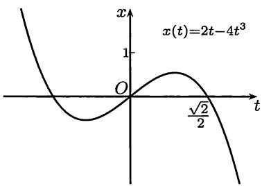
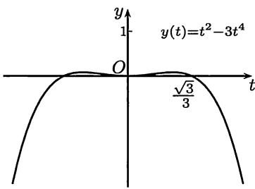
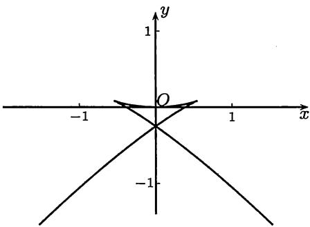

import Guide from '@/components/Guide.astro';
import Knowledge from '@/components/Knowledge.astro';
import Example from '@/components/Example.astro';
import Solution from '@/components/Solution.astro';
import Note from '@/components/Note.astro';
import Block from '@/components/Block.astro';
import Method from '@/components/Method.astro';

在用微分学知识作函数 $y = f(x)$ 的图像时, 应注意以下基本内容:

1.  基本初等函数的图像 (中学数学中的基本内容).

2.  多项式函数 $y = a_{0}x^{n} + a_{1}x^{n-1} + \cdots + a_{n}$ 的图像, 特别是其中 $n = 2$, $3$ 时的所有可能情况, 以及 $n$ 为奇数和偶数时的各种可能情况.

3.  利用某个函数的已知图像经过简单变换得到新的图像的方法. 这里的内容有, 设已知 $y = f(x)$ 的图像, 求以下函数的图像:
    (1) $y = f(-x)$ ; (2) $y = -f(x)$ ;
    (3) $y = -f(-x)$ ; (4) $x = f(y)$ ;
    (5) $y = f(x + a)$ ; (6) $y = f(kx)$ ;
    (7) $y = kf(x)$ ; (8) $y = f(x) + a$ ;
    (9) $y = |f(x)|$ .

4.  已知函数 $y = f(x)$ 和 $y = g(x)$ 的图像, 作出函数 $y = f(x) + g(x)$ , $y = f(x) - g(x)$ , $y = f(x) \cdot g(x)$ 的图像.

熟练掌握以上技巧对于作出函数的大致图像 (即所谓作草图) 有很大帮助. 作草图时不需要微分学的知识, 但是若能将作草图的方法与微分学相结合, 就可以既迅速又准确地作出函数的图像.

对于函数 $y = f(x)$ 的一般作图步骤在教科书中均有介绍, 这里不必重复. 对于用参数方程表示的函数 $x = x(t), y = y(t)$ 的作图问题, 一般是先分别作出 $x = x(t)$ 和 $y = y(t)$ 的图像, 然后再拼成为一张图 (见下面的例题). 对于用方程 $F(x, y) = 0$ 确定的隐函数, 往往引入参数 $t$ 而转化为上一问题.

## 8.6.1 例题

<Example title="例题 8.6.1">
作出用参数方程 $x = 2t - 4t^{3}$ , $y = t^{2} - 3t^{4}$ 给出的曲线图像.

<Solution title="证明">
$x(t)$ 和 $y(t)$ 只是 $t$ 的三次和四次多项式, 容易分别作出它们的图像如图 $8.9$ ($a$) 、$8.9$ ($b$) 所示:

  
($a$)

  
($b$)  
图 $8.9$

关于三次多项式 $x(t) = 2t - 4t^3$ 的主要分析如下: $x(t)$ 是奇函数; 导函数 $x_{t}^{\prime} = 2 - 12t^{2}$ 的零点为 $t = \pm 1 / \sqrt{6}$ , 其中 $-1 / \sqrt{6} \approx -0.4082$ 是极小值点, 极小值为 $-2\sqrt{6} / 9 \approx -0.5443$, $1 / \sqrt{6} \approx 0.4082$ 是极大值点, 极大值为 $2\sqrt{6} / 9 \approx 0.5443$; $x(t)$ 有三个零点: $0$ 和 $\pm \sqrt{2} / 2 \approx \pm 0.7071$.

关于四次多项式 $y = t^2 - 3t^4$ 的主要分析如下: $y(t)$ 是偶函数; 导函数 $y_t' = 2t - 12t^3$ 有三个零点: $0$ 和 $\pm 1 / \sqrt{6} \approx \pm 0.4082$, 其中 $t = 0$ 为极小值点, 极小值为 $0$, 其他两个零点是 $y(t)$ 的极大值点, 极大值为 $1/12 \approx 0.0833$; $y(t)$ 除了二重零点 $0$ 之外还有两个零点: $\pm \sqrt{3}/3 \approx \pm 0.5774$.

现在已经可以将以上分析合并以得到所要求的参数方程的图像, 这就是图 $8.10$, 其中参数 $t$ 的变化范围为从 $-0.95$ 到 $0.95$.

图 $8.10$ 的作法如下. 首先, 当 $x$ 换为 $-x$ 时, 对应的参数值 $t$ 也反号, 但 $y$ 是 $t$ 的偶函数, 从而可见在 $xOy$ 坐标系中曲线关于 $y$ 轴对称. 因此以下只需讨论参数 $t > 0$ 的情况. 根据 $6.2.3$ 小节的参数方程求导法则, 就有

$$
\frac {\mathrm{d} y}{\mathrm{d} x} = \frac {y _ {t} ^ {\prime}}{x _ {t} ^ {\prime}} = t \cdot \frac {1 - 6 t ^ {2}}{1 - 6 t ^ {2}},
$$

因此当 $t \neq 1 / \sqrt{6} \approx 0.4082$ 时, 就得到 $\frac{\mathrm{dy}}{\mathrm{dx}} = t$ .

图 $8.10$

从前面对 $x_{t}^{\prime}$ 和 $y_{t}^{\prime}$ 的分析已经知道当 $t = 1 / \sqrt{6}$ 时这两个导数均为 $0$, 我们将这样的点称为奇点. 这是本例中的主要困难. 由于关于 $y$ 轴对称, 因此有两个奇点: $(\pm 2\sqrt{6} / 9, 1/12)$ , 两个坐标的近似值为 $\pm 0.5443$ 和 $0.0833$.

当 $t$ 从 $0$ 变化到 $1 / \sqrt{6}$ 时, 由于 $y_{x}^{\prime} = t$, 而 $x(t)$ 和 $y(t)$ 均为 $t$ 的严格单调增加函数, 因此可以知道 $y$ 是 $x$ 的严格单调增加函数. 又由于导函数 $y_{x}^{\prime}$ 也是 $x$ 的严格单调增加函数, 因此 $y = y(x)$ 是下凸函数.

从同样的分析可以知道, 当 $t$ 从 $1 / \sqrt{6}$ 起增加时, $y$ 是 $x$ 的严格单调增加函数, 而且是上凸函数.

从前面已经得到的导数公式可以知道, 有

$$
\lim _ {t \to \frac {1}{\sqrt {6}}} \frac {\mathrm{d} y}{\mathrm{d} x} = \frac {1}{\sqrt {6}} \approx 0.4082,
$$

因此在奇点处存在切线. 确切地说, 在奇点 $(2\sqrt{6} / 9, 1/12)$ 的左侧邻近, 存在 $y = y(x)$ 的两个分支, 它们在 $x = 1 / \sqrt{6}$ 处存在相同的左侧导数. (这里对每一支可以应用命题 $7.1.7$, 即单侧导数极限定理.) 我们将这样的奇点称为尖点.

根据对称性就可以得到 $t < 0$ 时的曲线图像. 此外, 从表达式可以知道不存在任何渐近线.

值得注意的是, 参数方程 $x = x(t)$ 和 $y = y(t)$ 都是简单的多项式, 但在 $xOy$ 平面上的曲线却会出现复杂的性态. 这个例子就是在突变理论 ($Catastrophe\ Theory$) 中燕尾突变 ($Swallowtail\ Catastrophe$) 的分歧集合的图像 (见 $[52]$). 图 $8.10$ 就是燕尾突变这个名称的由来. 此外, 本题又见于《数学译林》($1992$) 第 $4$ 期《数学的基本要求》一文中的题 $6$.
</Solution>

以上关于凸性的结论是从导函数 $y_{x}^{\prime}$ 的单调性得到的, 即利用了命题 $8.4.4$. 也可以直接计算出

$$
y _ {x} ^ {\prime \prime} = (y _ {x} ^ {\prime}) _ {x} ^ {\prime} = \frac {(y _ {x} ^ {\prime}) _ {t} ^ {\prime}}{x _ {t} ^ {\prime}} = \frac {1}{2 (1 - 6 t ^ {2})},
$$

然后用命题 $8.4.6$ 作出结论.

当 $t \to 0$ 时 $x(t)$ 和 $y(t)$ 均为无穷小量, 且有 $y(t) \sim \frac{1}{4} x(t)^2 (t \to 0)$ . 这是对图 $8.10$ 上的曲线在原点附近的渐近描述.

在 $[59]$ 的第一册中, 对 $[27]$ 中关于函数作图的 §$1.4$ 和 §$2.12$ 有较详细的讲解与分析, 并在附录 $1$ 和附录 $2$ 中, 利用软件 $PSTricks$ 分别作出了这两节的作图题的全部答案. (附录 $1$ 中的习题号为 $237$—$380$, 附录 $2$ 中的习题号为 $1471$—$1555$.)

</Example>

## 8.6.2 练习题

1.  随手画出一条曲线代表 $y = f(x)$ , 然后试画出其一阶导函数和二阶导函数的图形 (本题是《数学译林》($1992$) 第 $4$ 期《数学的基本要求》一文中的第 $1$ 题).

2.  证明: 曲线 $y = \frac{x + 1}{x^2 + 1}$ 有位于同一直线上的三个拐点, 并作图.

3.  作出以下函数的图像:

    (1) $y = \left(1 + \frac{1}{x}\right)^x (x > 0)$; (2) $y = \frac{1}{1 + x^2} \mathrm{e}^{\frac{1}{1 - x^2}}$; (3) $y = \frac{x^4}{(1 + x)^3}$; (4) $y = (1 + x^2)\mathrm{e}^{-x^2}$; (5) $y = \frac{\ln x}{x} (x > 0)$; (6) $y = x^{\frac{2}{3}}\mathrm{e}^{-x}$; (7) $y = \frac{(x - 1)^3}{(x + 1)^2}$; (8) $y = \sqrt{\frac{x^3}{x - a}} (a > 0)$; (9) $y = x^x (x > 0)$; (10) $y = x^{\frac{1}{x}} (x > 0)$.

4.  证明: 方程 $x^{y} = y^{x}$ 在第一象限内的图像由一条直线和一条曲线组成, 并作出此图像.

5.  作出以下用参数方程给出的曲线:

    (1) $x = t^2 - 2, y = t(t^2 - 2)$ ;

    (2) $x = 2t - t^2, y = 3t - t^3$ ;

    (3) $x = \frac{3t}{1 + t^3}, y = \frac{3t^2}{1 + t^3}$;

    (4) $x = t - t^3, y = 1 - t^4$ ;

    (5) $x = a(t - \sin t), y = a(1 - \cos t)$ (摆线);

    (6) $x = a(\cos t + t\sin t), y = a(\sin t - t\cos t)$ (圆的渐开线).
