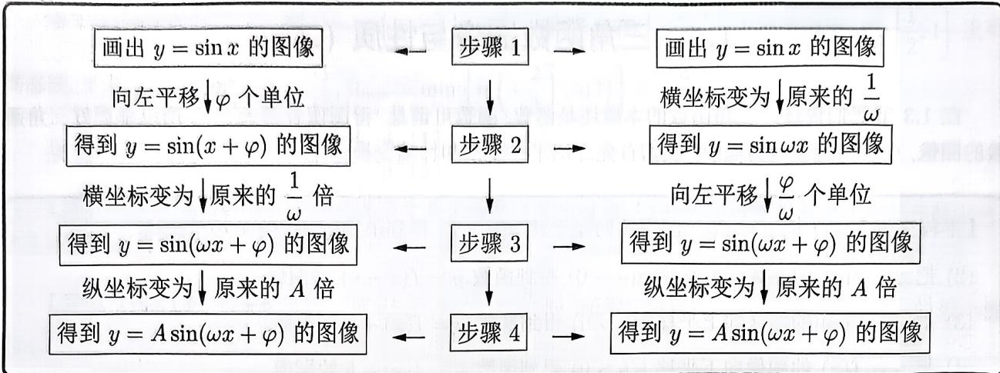

import Guide from '@/components/Guide.astro';
import Knowledge from '@/components/Knowledge.astro';
import Example from '@/components/Example.astro';
import Analysis from '@/components/Analysis.astro';
import Solution from '@/components/Solution.astro';
import Variant from '@/components/Variant.astro';
import Note from '@/components/Note.astro';
import Block from '@/components/Block.astro';

接下来, 我们首先将上述的总结应用到具体的三角函数. 还是以 $y = \sin x$ 为例, 介绍如何将它变换到 $y = A\sin (\omega x + \varphi)(A > 0, \omega > 0)$ 的图像. 设 $\varphi > 0$ , 我们给出如下两种变换途径:

因为 $y = \sin(\omega x + \varphi) = \sin\left[\omega\left(x + \frac{\varphi}{\omega}\right)\right]$ 且 $\varphi > 0$ ，所以由 $y = \sin \omega x$ 得到 $y = \sin(\omega x + \varphi)$ ，需要向左平移 $\frac{\varphi}{\omega}$ 个单位长度，而不是 $\varphi$ 个单位长度.

另外, 若 $\varphi < 0$ , 只需将上述变换中的“向左平移 $\varphi$ 个单位”换成“向右平移 $|\varphi|$ 个单位”“向左平移 $\frac{\varphi}{\omega}$ 个单位”换成“向右平移 $\frac{|\varphi|}{\omega}$ 个单位”, 其余保持不变.

<Example title="例 1.46">
(2022 浙江 6) 为了得到函数 $y = 2 \sin 3x$ 的图像, 只要把函数 $y = 2 \sin \left(3x + \frac{\pi}{5}\right)$ 图像上所有的点 ( ). A. 向左平移 $\frac{\pi}{5}$ 个单位长度 B. 向右平移 $\frac{\pi}{5}$ 个单位长度 C. 向左平移 $\frac{\pi}{15}$ 个单位长度 D. 向右平移 $\frac{\pi}{15}$ 个单位长度
<Solution>
因为 $y = 2\sin \left(3x + \frac{\pi}{5}\right) = 2\sin \left[3\left(x + \frac{\pi}{15}\right)\right]$ ，所以按照“左加右减”原则可知，只需将它向右平移 $\frac{\pi}{15}$ 个单位就能得到 $y = 2\sin 3x$ 图像，故选D.
</Solution>
</Example>

如果平移前后的函数名没有发生改变, 直接进行变换即可, 但如果三角函数平移前与平移后三角名称发生了变化, 我们首先要把三角名称进行统一然后再进行变换.

<Example title="例 1.47">
(2013 全国 II 文 16) 函数 $y = \cos(2x + \varphi)(-\pi \leqslant \varphi \leqslant \pi)$ 的图像向右平移 $\frac{\pi}{2}$ 个单位后, 与函数 $y = \sin\left(2x + \frac{\pi}{3}\right)$ 的图像重合, 则 $\varphi =$ \_\_\_\_ .
<Solution>
由 $y = \cos (2x + \varphi) = \sin \left(2x + \varphi +\frac{\pi}{2}\right)$ ，图像向右平移 $\frac{\pi}{2}$ 得

$$
y = \sin \left[ 2 \left(x - \frac {\pi}{2}\right) + \varphi + \frac {\pi}{2} \right] = \sin \left(2 x + \varphi - \frac {\pi}{2}\right)
$$

因为平移后的图像与函数 $y = \sin \left(2x + \frac{\pi}{3}\right)$ 的图像重合, 所以

$$
2 x + \varphi - \frac {\pi}{2} = 2 x + \frac {\pi}{3} + 2 k \pi (k \in \mathbb {Z}),
$$

解得 $\varphi = \frac{5\pi}{6} + 2k\pi (k \in \mathbb{Z})$ . 因为 $-\pi \leqslant \varphi \leqslant \pi$ , 所以 $k = 0, \varphi = \frac{5\pi}{6}$ , 故填 $\frac{5\pi}{6}$ .
</Solution>
</Example>

三角函数的平移变换, 很多时候都与伸缩变换一起考查. 变换的方式为 “先伸缩后平移” 或 “先平移后伸缩”, 下面例题为 “先伸缩后平移”.

<Example title="例 1.48">
(2017 全国 I 理 9) 已知曲线 $C_{1}: y = \cos x, C_{2}: y = \sin\left(2x + \frac{2\pi}{3}\right)$ ，则下面结论正确的是（）. A. 把 $C_{1}$ 上各点的横坐标伸长到原来的 2 倍，再把得到的曲线向右平移 $\frac{\pi}{6}$ 个单位，得到 $C_{2}$ B. 把 $C_{1}$ 上各点的横坐标伸长到原来的 2 倍，再把得到的曲线向左平移 $\frac{\pi}{12}$ 个单位，得到 $C_{2}$ C. 把 $C_{1}$ 上各点的横坐标缩短到原来的 $\frac{1}{2}$ 倍，再把得到的曲线向右平移 $\frac{\pi}{6}$ 个单位，得到 $C_{2}$ D. 把 $C_{1}$ 上各点的横坐标缩短到原来的 $\frac{1}{2}$ 倍，再把得到的曲线向左平移 $\frac{\pi}{12}$ 个单位，得到 $C_{2}$
<Solution>
 $C_2:y = \sin \left(2x + \frac{2\pi}{3}\right) = \cos \left[\frac{\pi}{2} -\left(2x + \frac{2\pi}{3}\right)\right] = \cos \left[-\left(2x + \frac{\pi}{6}\right)\right] = \cos \left(2x + \frac{\pi}{6}\right).$ 结合选项，先伸缩再平移，即由 $C_1$ 图像横坐标缩短为原来的 $\frac{1}{2}$ ，得到 $y = \cos 2x$ ，再将它向左平移 $\frac{\pi}{12}$ 得到曲线 $C_2$ ，故选D.
</Solution>
</Example>

对于图像变换问题, 需明确函数图像变换的先后顺序, 弄清楚谁是变换前的函数图像, 谁是变换后的函数图像, 已知变换后的函数图像, 求变换前的函数图像, 常对变换后的图像做相反的变换即可, 比如下例, 做相反变换就是 “先平移后伸缩”.

<Example title="例 1.49">
(2021 全国 I 理 7) 把函数 $y = f(x)$ 图像上所有点的横坐标缩短到原来的 $\frac{1}{2}$ 倍, 纵坐标不变, 再把所得曲线向右平移 $\frac{\pi}{3}$ 个单位长度, 得到函数 $y = \sin\left(x - \frac{\pi}{4}\right)$ 的图像, 则 $f(x) = (\quad)$ .
A. $\sin\left(\frac{x}{2}-\frac{7\pi}{12}\right)$ B. $\sin\left(\frac{x}{2}+\frac{\pi}{12}\right)$ C. $\sin\left(2x-\frac{7\pi}{12}\right)$ D. $\sin\left(2x+\frac{\pi}{12}\right)$
<Solution>
将函数 $y = \sin\left(x - \frac{\pi}{4}\right)$ 的图像向左平移 $\frac{\pi}{3}$ ，得 $y = \sin\left(x + \frac{\pi}{3} - \frac{\pi}{4}\right) = \sin\left(x + \frac{\pi}{12}\right)$ ; 再将图像上所有点的横坐标伸长为原来的 2 倍, 得 $f(x) = \sin\left(\frac{1}{2}x + \frac{\pi}{12}\right)$ ，故选 B.
</Solution>
</Example>

<Variant title="变式 1.49.1">
(2019 天津 7) 已知函数 $f(x)=A\sin(\omega x+\varphi)(A>0,\omega>0,|\varphi|<\pi)$ 是奇函数，将 $y=f(x)$ 的图像上所有点的横坐标伸长到原来的 2 倍 (纵坐标不变)，所得图像对应的函数为 $g(x)$ ，若 $g(x)$ 的最小正周期为 $2\pi$ ，且 $g\left(\frac{\pi}{4}\right)=\sqrt{2}$ ，则 $f\left(\frac{3\pi}{8}\right)=(\quad)$ .
A. -2
B. $-\sqrt{2}$ C. $\sqrt{2}$ D. 2
</Variant>

<Variant title="变式 1.49.2">
(2022 全国甲文 5)已知函数 $f(x)=\sin\left(\omega x+\frac{\pi}{3}\right)(\omega>0)$ 的图像向左平移 $\frac{\pi}{2}$ 个单位后得到曲线 C, 若曲线 C 关于 y 轴对称, 则 $\omega$ 的最小值是 ( ).
A. $\frac{1}{6}$ B. $\frac{1}{4}$ C. $\frac{1}{3}$ D. $\frac{1}{2}$
</Variant>
