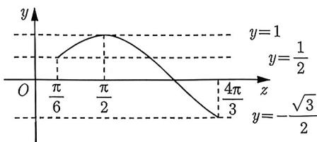
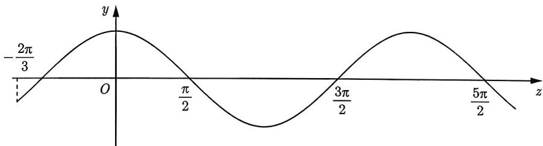
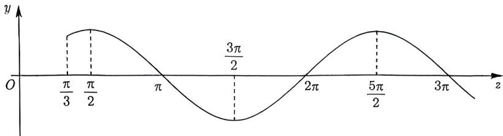
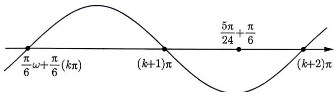
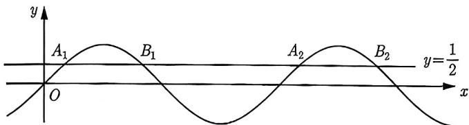

import Guide from '@/components/Guide.astro';
import Knowledge from '@/components/Knowledge.astro';
import Example from '@/components/Example.astro';
import Analysis from '@/components/Analysis.astro';
import Solution from '@/components/Solution.astro';
import Variant from '@/components/Variant.astro';
import Note from '@/components/Note.astro';
import Block from '@/components/Block.astro';

假设已知 $f(x) = A\sin (\omega x + \varphi) + b$ (或 $f(x) = A\cos (\omega x + \varphi) + b$ ) 零点或极值点的个数, 求参数范围, 我们分以下三种情况:

(1) $\omega, \varphi, A$ 为定值, 已知 $f(x)$ 在区间 $[x_1, x_2]$ 上零点的个数, 求 $b$ 的取值范围.

(2) $\varphi, b, A$ 为定值, 已知 $f(x)$ 在区间 $[x_1, x_2]$ 上零点或极值点的个数, 求 $\omega$ 的取值范围.

(3) $\omega, b, A$ 为定值, 已知 $f(x)$ 在区间 $[x_1, x_2]$ 上零点或极值点的个数, 求 $\varphi$ 的取值范围.

第 (1) 种题型我们在《新高考数学你真的掌握了吗？函数》中介绍过, 方法简单概括为分离参数 $b$ , 画双图, 看交点. 具体见下例.

<Example title="例 1.58">
(2021 长沙模拟) 已知函数 $f(x)=\sin\left(2x+\frac{\pi}{6}\right)+\frac{3}{2}+b$ ，当 $x\in\left[0,\frac{7\pi}{12}\right]$ 时，函数 $f(x)$ 有且只有一个零点，求实数 b 的取值范围.

<Solution>
由 $f(x) = 0$ 得 $\sin \left(2x + \frac{\pi}{6}\right) = -\frac{3}{2} - b.$ 令 $z = 2x + \frac{\pi}{6}$ , 因为 $x \in \left[0, \frac{7\pi}{12}\right]$ , 所以 $z \in \left[\frac{\pi}{6}, \frac{4\pi}{3}\right]$ , 于是原问题等价于 $y = \sin z$ 与 $y = -\frac{3}{2} - b$ 在 $\left[\frac{\pi}{6}, \frac{4\pi}{3}\right]$ 上有且只有一个交点, 画出如图1-19所示的图像, 可知

<figure class="vp-figure">
  
  <figcaption>图1-19</figcaption>
</figure>

(1) 当 $-\frac{3}{2} - b = 1$ , 即 $b = -\frac{5}{2}$ 时, 有且只有一个交点;

(2) 当 $-\frac{\sqrt{3}}{2} \leqslant -\frac{3}{2} - b < \frac{1}{2}$ , 即 $-2 < b \leqslant \frac{\sqrt{3} - 3}{2}$ 时, 有且仅有一个交点.

综上所述, $b$ 的取值范围为 $\left(-2, \frac{\sqrt{3} - 3}{2}\right] \cup \left\{-\frac{5}{2}\right\}$ .
</Solution>

</Example>

<Variant title="变式 1.58.1">
(2023 河北邯郸统考三模) 已知函数 $f(x)=2\pi\left[\cos2\pi x+\cos\left(\frac{2\pi}{3}-2\pi x\right)\right]-a,$ $a \in R,$ 在区间 $\left(0, \frac{1}{2}\right)$ 上有两个零点, 求 a 的取值范围.

</Variant>

第 (2) 种和第 (3) 种题型可以视为同一种类型, 我们处理的方法是换元, 将动图 (伸缩与平移) 问题转化为定图动区间问题. 首先我们从简单的情形开始, 即换元后新的变量所在区间可以被锁定. 比如正弦函数在区间内单调, 在区间内没有零点等都可以锁定区间的范围, 见下例.

<Example title="例 1.59">
(2016 天津文 8) 已知函数 $f(x)=\frac{\sqrt{2}}{2}\sin\left(\omega x-\frac{\pi}{4}\right)(\omega>0)$ ，若在区间 $(\pi,2\pi)$ 内没有零点，则 $\omega$ 的取值范围是（）.

A. $\left(0,\frac{1}{8}\right]$ B. $\left(0,\frac{1}{4}\right]\cup\left[\frac{5}{8},1\right)$ C. $\left(0,\frac{5}{8}\right]$ D. $\left(0,\frac{1}{8}\right]\cup\left[\frac{1}{4},\frac{5}{8}\right]$

<Solution>
令 $z = \omega x - \frac{\pi}{4}$ , 因为 $x \in (\pi, 2\pi)$ , 所以 $z \in \left(\pi \omega - \frac{\pi}{4}, 2\pi \omega - \frac{\pi}{4}\right)$ , 则原问题等价于 $y = \frac{\sqrt{2}}{2} \sin z$ 在区间 $\left(\pi \omega - \frac{\pi}{4}, 2\pi \omega - \frac{\pi}{4}\right)$ 内没有零点, 故存在 $k \in \mathbb{Z}$ 使得 $\left(\pi \omega - \frac{\pi}{4}, 2\pi \omega - \frac{\pi}{4}\right) \subset [k\pi, (k + 1)\pi]$ , 于是 $\left\{ \begin{array}{l} \pi \omega - \frac{\pi}{4} \geqslant k\pi \\ 2\pi \omega - \frac{\pi}{4} \leqslant k\pi + \pi \end{array} \right.$ , 解得 $k + \frac{1}{4} \leqslant \omega \leqslant \frac{k}{2} + \frac{5}{8}$ , $k \in \mathbb{Z}$ . 因为 $\omega > 0$ , 所以 $\left\{ \begin{array}{l} \frac{k}{2} + \frac{5}{8} > 0 \\ k + \frac{1}{4} \leqslant \frac{k}{2} + \frac{5}{8} \end{array} \right.$ , 解得 $-\frac{5}{4} < k \leqslant \frac{3}{4}$ , $k \in \mathbb{Z}$ , 于是 $k = -1, 0$ . 当 $k = 0$ 时, $\frac{1}{4} \leqslant \omega \leqslant \frac{5}{8}$ ; 当 $k = -1$ 时, $0 < \omega \leqslant \frac{1}{8}$ .

综上所述, $\omega \in \left(0, \frac{1}{8}\right] \cup \left[\frac{1}{4}, \frac{5}{8}\right]$ , 故选 D.
</Solution>

</Example>

<Variant title="变式 1.59.1">
(2022 上海模考) 若函数 $f(x)=\cos mx(m>0)$ 在区间 $(2\pi,3\pi)$ 内既没有取到最大值 1, 也没有取到最小值 -1, 则 m 的取值范围为 \_\_\_\_.
</Variant>

<Variant title="变式 1.59.2">
已知函数 $f(x)=2\cos(\omega x+\varphi)+1\left(\omega>0,|\varphi|<\frac{\pi}{2}\right)$ ，其图像与直线 y=3 相邻两个交点的距离为 $\frac{2\pi}{3}$ ，若 $f(x)>1$ 对任意 $x\in\left(-\frac{\pi}{12},\frac{\pi}{6}\right)$ 恒成立，则 $\varphi$ 的取值范围是 \_\_\_\_.
</Variant>

接下来, 我们讨论更复杂的情形. 不过, 在此之前, 有一个至关重要的细节需要单独来讨论下, 那就是区间的开闭问题.

(1) 设 $x_{1} < x_{2}$ , 且只有 $x_{1}$ 落在闭区间 $[a, b]$ 内, 则 $a \leqslant x_{1} \leqslant b < x_{2}$ .

(2) 设 $x_{1} < x_{2}$ , 且只有 $x_{1}$ 落在开区间 $(a, b)$ 内, 则 $a < x_{1} < b \leqslant x_{2}$ .

请同学们自己画图推导 (1) 与 (2), 仔细体会结论中能取等号与不能取等号的问题.

<Example title="例 1.60">
（2022 广东三模）已知函数 $f(x)=3\cos\left(\omega x-\frac{2\pi}{3}\right)(\omega>0)$ ，且 $f(x)$ 在 $[0,\pi]$ 上有且仅有 3 个零点，则 $\omega$ 的取值范围是（）.
A. $\left[\frac{5}{3},\frac{8}{3}\right)$ B. $\left[\frac{5}{3},\frac{13}{6}\right)$ C. $\left[\frac{7}{6},\frac{13}{6}\right)$ D. $\left[\frac{13}{6},\frac{19}{6}\right)$

<Solution>
令 $z = \omega x - \frac{2\pi}{3}$ , 因为 $x \in [0, \pi]$ , 所以 $z \in \left[-\frac{2\pi}{3}, \pi \omega - \frac{2\pi}{3}\right]$ . 于是原问题转化为 $y = \cos z$ 在 $\left[-\frac{2\pi}{3}, \pi \omega - \frac{2\pi}{3}\right]$ 上恰有 3 个零点. 因为区间的左端点为 $-\frac{2\pi}{3}$ , 画出如图 1-20 所示的 $y = \cos z$ 的图像, 所以 $y = \cos z$ 在该区间内仅有的 3 个零点只能是 $-\frac{\pi}{2}, \frac{\pi}{2}, \frac{3\pi}{2}$ . 因为题中的区间是闭区间, 所以右端点需满足 $\frac{3\pi}{2} \leqslant \omega \pi - \frac{2\pi}{3} < \frac{5\pi}{2}$ , 得 $\frac{13}{6} \leqslant \omega < \frac{19}{6}$ , 故选 D.

<figure class="vp-figure">
  
  <figcaption>图1-20</figcaption>
</figure>
</Solution>

</Example>

例1.60中的区间是闭区间, 下面我们再来看看开区间的情形.

<Example title="例 1.61">
（2022 全国甲理 11）设函数 $f(x)=\sin\left(\omega x+\frac{\pi}{3}\right)$ 在区间 $(0,\pi)$ 恰有三个极值点、两个零点，则实数 $\omega$ 的取值范围是（）.
A. $\left[\frac{5}{3},\frac{13}{6}\right)$ B. $\left[\frac{5}{3},\frac{19}{6}\right)$ C. $\left(\frac{13}{6},\frac{8}{3}\right]$ D. $\left(\frac{13}{6},\frac{19}{6}\right]$

<Solution>
结合选项只考虑 $\omega > 0$ ，令 $z = \omega x + \frac{\pi}{3}$ ，因为 $x \in (0, \pi)$ ，所以 $z \in \left(\frac{\pi}{3}, \omega \pi + \frac{\pi}{3}\right)$ 。于是原问题转化为 $y = \sin z$ 在区间 $\left(\frac{\pi}{3}, \omega \pi + \frac{\pi}{3}\right)$ 上恰有三个极值点、两个零点，画出如图1-21所示的图像，可知当 $z > \frac{\pi}{3}$ 时，两个零点依次为 $\pi, 2\pi$ ，三个极值点依次为 $\frac{\pi}{2}, \frac{3\pi}{2}, \frac{5\pi}{2}$ 。因为题中的区间是开区间，所以右端点需满足 $\frac{5\pi}{2} < \omega \pi + \frac{\pi}{3} \leqslant 3\pi$ ，解得 $\frac{13}{6} < \omega \leqslant \frac{8}{3}$ ，即 $\omega \in \left(\frac{13}{6}, \frac{8}{3}\right]$ ，故选C.

<figure class="vp-figure">
  
  <figcaption>图1-21</figcaption>
</figure>
</Solution>

</Example>

<Variant title="变式 1.61.1">
（2023 浙江统考二模）已知函数 $f(x)=a\cos\omega x(a\neq0,\omega>0)$ ，若将函数 $y=f(x)$ 的图像向左平移 $\frac{\pi}{6\omega}$ 个单位长度后得到函数 $y=g(x)$ 的图像，若关于 x 的方程 $g(x)=0$ 在 $\left[0,\frac{7\pi}{12}\right]$ 上有且仅有两个不相等的实根，则实数 $\omega$ 的取值范围是（）.

A. $\left[\frac{10}{7},\frac{24}{7}\right)$ B. $\left[\frac{16}{7},4\right)$ C. $\left[\frac{10}{7},4\right)$ D. $\left[\frac{16}{7},\frac{24}{7}\right)$

</Variant>

<Variant title="变式 1.61.2">
（2023 云南模考）设 $f(x)=\cos\left(\omega x-\frac{\pi}{6}\right)(\omega>0)$ ，若存在 $x_{1},x_{2}\in\left[0,\frac{\pi}{2}\right]$ ，且 $x_{1}<x_{2}$ ，使得 $f(x_{1})-f(x_{2})=-2$ ，则 $\omega$ 的最小值是（）.
A. 2
B. $\frac{7}{3}$ C. 3
D. $\frac{13}{3}$

</Variant>

不知道大家是否注意到, 例1.60和例1.61及其变式有一个共同点, 那就是换元后, 新的变量所在的区间有一个端点被固定了, 这极大地降低了讨论的复杂度. 接下来, 我们来看看两个端点均不固定的情形. 先从简单的例子开始.

<Example title="例 1.62">
（2023 广东茂名统考二模）已知函数 $f(x)=\sin\left(\omega x+\frac{\pi}{6}\right)(\omega>0)$ ，若 $f\left(\frac{\pi}{6}\right)=0$ ，且 $f(x)$ 在 $\left(\frac{\pi}{6},\frac{5\pi}{24}\right)$ 上恰有 1 个零点，则 $\omega$ 的最小值为（）.
A. 11 B. 29 C. 35 D. 47

<Solution>
令 $z = \omega x + \frac{\pi}{6}$ , 因为 $x \in \left(\frac{\pi}{6}, \frac{5\pi}{24}\right)$ , 故 $z \in \left(\frac{\pi}{6}\omega + \frac{\pi}{6}, \frac{5\pi}{24}\omega + \frac{\pi}{6}\right)$ , 则原问题等价于 $y = \sin z$ 在区间 $\left(\frac{\pi}{6}\omega + \frac{\pi}{6}, \frac{5\pi}{24}\omega + \frac{\pi}{6}\right)$ 上恰有 1 个零点. 由题意可知 $z = \frac{\pi}{6}\omega + \frac{\pi}{6}$ 是 $y = \sin z$ 的零点, 故我们只需要确定右端点 $\frac{5\pi}{24}\omega + \frac{\pi}{6}$ 落在如图 1-22 所示的区间, 即

$$
\left\{ \begin{array}{l l} { \frac {\pi}{6} \omega + \frac {\pi}{6} = k \pi} \\ {(k + 1) \pi <   \frac {5 \pi}{2 4} \omega + \frac {\pi}{6} \leqslant (k + 2) \pi} \end{array} \right. \Rightarrow \left\{ \begin{array}{l l} {\omega = 6 k - 1} \\ { \frac {2 4}{5} k + 4 <   \omega \leqslant \frac {2 4}{5} k + \frac {4 4}{5}} \end{array} \right. \Rightarrow k = 5, 6, 7, 8.
$$

当 k=5 时, $\omega$ 取得最小值 29, 故选 B.

<figure class="vp-figure">
  
  <figcaption>图1-22</figcaption>
</figure>
</Solution>

</Example>

在例1.62中我们看到, 换元后新的变量所在区间的左右端点均不固定. 但是, 题中的附加条件在一定程度上将左端点固定了, 这也降低了问题的复杂度. 接下来我们看看最一般的情形. 受例1.62的启发, 对于一般的情形, 我们可以分类讨论, 而分类的方法就是定端点, 具体见下例.

<Example title="例 1.63">
（2023 山西四模）已知函数 $f(x)=\cos(\omega x+\varphi)(\omega>0,-\pi<\varphi<0)$ ， $f(0)=\frac{\sqrt{3}}{2}$ ，且 $f(x)$ 在 $[-100\pi,100\pi]$ 上恰有 100 个零点，则 $\omega$ 的取值范围是（）.

A. $\left[\frac{147}{300},\frac{149}{300}\right)$ B. $\left(\frac{147}{300},\frac{149}{300}\right)$ C. $\left[\frac{149}{300},\frac{151}{300}\right)$ D. $\left(\frac{149}{300},\frac{151}{300}\right)$

<Analysis>
受例1.62的启发, 我们应该按区间左右端点是否为零点来分类讨论.
</Analysis>

<Solution>
由题意知 $f(0) = \cos \varphi = \frac{\sqrt{3}}{2}$ , 又 $-\pi < \varphi < 0$ , 故 $\varphi = -\frac{\pi}{6}$ , 所以 $f(x) = \cos \left(\omega x - \frac{\pi}{6}\right)$ . 令 $z = \omega x - \frac{\pi}{6}$ , 因为 $x \in [-100\pi, 100\pi]$ , 所以 $z \in \left[-100\pi\omega - \frac{\pi}{6}, 100\pi\omega - \frac{\pi}{6}\right] = [z_1, z_2]$ , 则原问题等价于 $y = \cos z$ 在区间 $[z_1, z_2]$ 上恰有 100 个零点.

(1) 若 $z_{1}$ 是零点, 则存在 $k \in \mathbb{Z}$ 使得

$$
\left\{ \begin{array}{l l} - 1 0 0 \pi \omega - \frac {\pi}{6} = k \pi + \frac {\pi}{2} & \\ k \pi + \frac {\pi}{2} + 9 9 \pi \leqslant 1 0 0 \pi \omega - \frac {\pi}{6} <   k \pi + \frac {\pi}{2} + 1 0 0 \pi & \end{array} \right. \Rightarrow \frac {9 9}{2 0 0} \leqslant \omega <   \frac {1}{2}.
$$

此时 $-100\pi \omega - \frac{\pi}{6} \in \left(-50\pi - \frac{\pi}{6}, -\frac{99}{2}\pi - \frac{\pi}{6}\right] = -50\pi + \left(-\frac{\pi}{6}, \frac{\pi}{3}\right]$ , 不存在 $k \in \mathbb{Z}$ 使得第一个方程成立, 即方程组无解.

(2) 若 $z_{1}$ 不是零点, 则存在 $k \in \mathbb{Z}$ 使得

$$
\left\{ \begin{array}{l l} \frac {\pi}{2} + k \pi <   - 1 0 0 \pi \omega - \frac {\pi}{6} <   \frac {\pi}{2} + (k + 1) \pi \\ \frac {\pi}{2} + (k + 1 0 0) \pi \leqslant 1 0 0 \pi \omega - \frac {\pi}{6} <   \frac {\pi}{2} + (k + 1 0 1) \pi \end{array} \right. \Rightarrow \left\{ \begin{array}{l l} \frac {- 3 k - 5}{3 0 0} <   \omega <   \frac {- 3 k - 2}{3 0 0} \\ \frac {3 k + 3 0 2}{3 0 0} \leqslant \omega <   \frac {3 k + 3 0 5}{3 0 0} \end{array} \right.\tag{\textcircled{1}.}
$$

要保证这个不等式组的解集不是空集, 则需要满足 $\left\{ \begin{array}{l} \frac{-3k - 2}{300} > \frac{3k + 302}{300} \\ \frac{3k + 305}{300} > \frac{-3k - 5}{300} \end{array} \right.$ , 解得 $-\frac{155}{3} < k < -\frac{152}{3}$ , $k \in \mathbb{Z}$ , 即 $k = -51$ , 代入式①得 $\frac{149}{300} \leqslant \omega < \frac{151}{300}$ , 故选 C.
</Solution>

要保证 $\left\{ \begin{array}{l} a < x < b \\ c < x < d \end{array} \right.$ 的解集不是空集, 需要满足 $\left\{ \begin{array}{l} b > c \\ d > a \end{array} \right.$ . 我们从反面来理解这个结论. 若 $a < x < b$ 与 $c < x < d$ 没有交集, 则 $a \geqslant d$ 或 $b \leqslant c$ , 因此它们有交集等价于 $a < d$ 且 $b > c$ . 这些结论都不需要记忆, 掌握推导即可.

</Example>

<Example title="例 1.64">
（2022 广东高三期末）设函数 $f(x)=2\sin(\omega x+\varphi)-1$ ，若对于任意实数 $\varphi, f(x)$ 在区间 $\left[\frac{\pi}{4},\frac{3\pi}{4}\right]$ 上至少有 2 个零点，至多有 3 个零点，则 $\omega$ 的取值范围是（）.

A. $\left[\frac{8}{3},\frac{16}{3}\right)$ B. $\left[4,\frac{16}{3}\right)$ C. $\left[4,\frac{20}{3}\right)$ D. $\left[\frac{8}{3},\frac{20}{3}\right)$

<Solution>
令 $f(x)=0$ ，则 $\sin(\omega x+\varphi)=\frac{1}{2}$ ，结合选项只考虑 $\omega>0$ ，令 $z=\omega x+\varphi$ ，因为 $x\in\left[\frac{\pi}{4},\frac{3\pi}{4}\right]$ ，所以 $z\in\left[\frac{\pi}{4}\omega+\varphi,\frac{3\pi}{4}\omega+\varphi\right]=[z_{1},z_{2}]$ ，则原问题等价于 $y=\sin z$ 在区间 $[z_{1},z_{2}]$ 至少有 2 个 z，至多有 3 个 z，使得 $\sin z=\frac{1}{2}$ 。我们在坐标轴上画出 $\sin z=\frac{1}{2}$ 的零点，如图 1-23 所示，其中 $A_{k}=2k\pi+\frac{\pi}{6}$ ， $B_{k}=2k\pi+\frac{5\pi}{6}$ 。由于周期性，我们只需要考虑 $A_{1},A_{2},B_{1}$ 和 $B_{2}$ 即可。
注意到 $\varphi$ 的任意性, 所以区间 $[z_{1},z_{2}]$ 可以在坐标轴上任意滑动. 因为 $[z_{1},z_{2}]$ 至少包含两个零点, 所以该区间的长度至少要大于 $A_{1}A_{2}$ 的长度. 同样地, 该区间至多含有 3 个零点, 则该区间的长度必然要小于 $A_{1}B_{2}$ 的长度. 于是 $\left\{\begin{aligned}\frac{\pi\omega}{2}&\geqslant2\pi\\ \frac{\pi\omega}{2}&<\frac{16\pi}{6}\end{aligned}\right.$ ，解得 $4\leqslant\omega<\frac{16}{3}$ ，故选 B.

<figure class="vp-figure">
  
  <figcaption>图1-23</figcaption>
</figure>
</Solution>

</Example>
