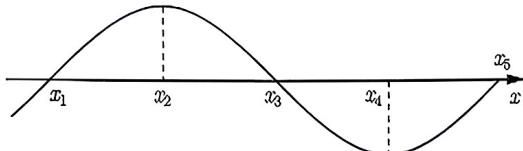
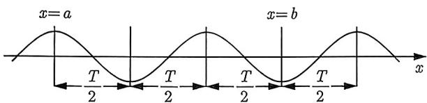
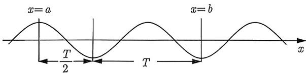
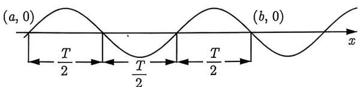
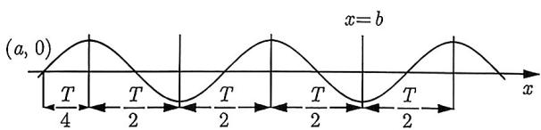

import Guide from '@/components/Guide.astro';
import Knowledge from '@/components/Knowledge.astro';
import Example from '@/components/Example.astro';
import Analysis from '@/components/Analysis.astro';
import Solution from '@/components/Solution.astro';
import Variant from '@/components/Variant.astro';
import Note from '@/components/Note.astro';
import Block from '@/components/Block.astro';
import Summary from '@/components/Summary.astro';
import Method from '@/components/Method.astro';

函数的对称性与周期性的关系一直以来都是高考数学中重要的内容. 在《新高考数学你真的掌握了吗？函数》一书中, 我们已经对它进行了重点阐述. 在这里, 我们再重述一下相关结论.

<Knowledge title="知识点 1.8">
（1）若 $x = a, x = b$ 是 $f(x)$ 的两条对称轴，则 $2|a - b|$ 是它的一个周期. (2) 若 $(a,0), (b,0)$ 是 $f(x)$ 的两个对称中心，则 $2|a - b|$ 是它的一个周期. (3) 若 $(a,0), x = b$ 分别是 $f(x)$ 的对称中心和对称轴，则 $4|a - b|$ 是它的一个周期.
</Knowledge>

在函数那里, 其题型一般都是已知某个抽象函数在某些点的数值, 利用周期性求其他点处的值或者求和. 其难点在于如何利用题中所给的条件推出对称轴和对称中心.

但是, 如果函数不是抽象的, 而是由三角函数 $f(x) = A \sin(\omega x + \varphi)(\omega > 0)$ 或 $f(x) = A \cos(\omega x + \varphi)(\omega > 0)$ 给定的, 则题型往往是求 $\omega$ 或 $\varphi$ . 根据 $\omega = \frac{2\pi}{T}$ , 这里 $T$ 是 $f(x)$ 的最小正周期. 注意是最小正周期, 因此知识点1.8的结论不够用. 我们需要加强版的知识点1.8.

<Knowledge title="知识点 1.9">
设函数 $f(x) = A\sin (\omega x + \varphi)(\omega > 0)$ 或 $f(x) = A\cos (\omega x + \varphi)(\omega > 0)$, $T$ 是 $f(x)$ 的最小正周期.
(1) 若 $x = a, x = b$ 是 $f(x)$ 的两条相邻的称轴, 则 $T = 2|a - b|$;
(2) 若 $(a,0), (b,0)$ 是 $f(x)$ 的两个相邻的对称中心, 则 $T = 2|a - b|$;
(3) 若 $(a,0), x = b$ 分别是 $f(x)$ 的对称中心和对称轴, 且相邻, 则 $T = 4|a - b|$.
</Knowledge>

上述知识点可以通过正弦函数图像辅助记忆. 不过, 一定要注意必须满足 “相邻” 这个条件.

<Example title="例 1.65">
(2019 全国 II 文 8) 若 $x_{1}=\frac{\pi}{4}$ , $x_{2}=\frac{3\pi}{4}$ 是函数 $f(x)=\sin\omega x(\omega>0)$ 两个相邻的极值点, 则 $\omega=(\quad)$ .
A. 2
B. $\frac{3}{2}$ C. 1
D. $\frac{1}{2}$
<Solution>
由题意可知 $x_{1} = \frac{\pi}{4}$ 和 $x_{2} = \frac{3\pi}{4}$ 是函数 $f(x) = \sin \omega x (\omega > 0)$ 两条相邻的对称轴, 所以 $T = 2(x_{2} - x_{1}) = \pi$ , 则 $\omega = 2$ , 故选 A.
</Solution>
</Example>

因为例1.65明确告诉了两个极值点(对称轴)相邻, 故我们可以直接应用知识点1.9求它的最小正周期. 但有时候会把相邻这个条件隐藏起来, 需要我们把这个条件挖出.

  
图1-24

设 $f(x) = A\sin (\omega x + \varphi)$ 或 $f(x) = A\cos (\omega x + \varphi)$ ，其图像如图1-24所示，通过图像很容易得到 $|x_{2} - x_{1}| = \frac{T}{4} < \frac{T}{2}, |x_{3} - x_{1}| = \frac{T}{2} < T, |x_{4} - x_{2}| = \frac{T}{2} < T.$ 由此，我们得到如下结论.

设 $f(x)=A\sin(\omega x+\varphi)$ 或 $f(x)=A\cos(\omega x+\varphi)$ ， $x_{1}$ 和 $x_{3}$ 是 $f(x)$ 的零点， $x_{2}$ 和 $x_{4}$ 是 $f(x)$ 的极值点，如图 1-24 所示，记 T 是 $f(x)$ 的最小正周期.
(1) 若 $|x_{2}-x_{1}|<\frac{T}{2}$ ，则零点 $x_{1}$ 与极大值点 $x_{2}$ 相邻，于是 $T=4|x_{2}-x_{1}|$ ;
(2) 若 $|x_{3}-x_{1}|<T$ ，则 $x_{1}, x_{3}$ 是相邻的零点，于是 $T=2|x_{3}-x_{1}|$ ;
(3) 若 $|x_{4}-x_{2}|<T$ ，则 $x_{2}, x_{4}$ 是相邻的极值点，于是 $T=2|x_{4}-x_{2}|$ .

结论总结1.1中的三种情形都可以唯一确定最小正周期, 也就是可以确定 $\omega$ 的数值. 但是并没有告诉我们如何求 $\varphi$ . 值得注意的是, 上述结论总结中的条件和结论不等价. 下面, 我们通过一个例题来阐述它们为什么不等价, 以及探索出解决这类问题的通法.

<Example title="例 1.66">
(2017 天津 7) 设函数 $f(x)=2\sin(\omega x+\varphi), x\in\mathbb{R}$ ，其中 $\omega>0,|\varphi|<\pi,$ 若 $f\left(\frac{5\pi}{8}\right)=2,$ $f\left(\frac{11\pi}{8}\right)=0,$ 且 $f(x)$ 的最小正周期大于 $2\pi,$ 则（）.
A. $\omega=\frac{2}{3},\varphi=\frac{\pi}{12}$ B. $\omega=\frac{2}{3},\varphi=-\frac{11\pi}{12}$ C. $\omega=\frac{1}{3},\varphi=-\frac{11\pi}{24}$ D. $\omega=\frac{1}{3},\varphi=\frac{7\pi}{24}$
<Analysis>
因为 $x = \frac{5\pi}{8}$ 是 $f(x)$ 极大值点, $x = \frac{11\pi}{8}$ 是 $f(x)$ 的零点, 且满足 $\frac{11\pi}{8} - \frac{5\pi}{8} < \frac{T}{2}$ , 所以极大值点 $x = \frac{5\pi}{8}$ 与零点 $x = \frac{11\pi}{8}$ 相邻, 于是 $T = 4\left(\frac{11\pi}{8} - \frac{5\pi}{8}\right) = 3\pi$ , 因此 $\omega = \frac{2\pi}{T} = \frac{2}{3}$ . 接下来我们需要确定 $\varphi$ 的值. 显然需要再次利用条件 $f\left(\frac{5\pi}{8}\right) = 2$ 或条件 $f\left(\frac{11\pi}{8}\right) = 0$ . 我们先尝试利用条件 $f\left(\frac{11\pi}{8}\right) = 0$ .
</Analysis>
<Solution title="解析1">
因为 $\omega = \frac{2}{3}$ , 所以 $f(x) = 2\sin \left(\frac{2}{3} x + \varphi\right)$ . 由 $f\left(\frac{11\pi}{8}\right) = 0$ 可得 $\frac{11}{12}\pi + \varphi = k\pi (k \in \mathbb{Z})$ , 解得 $\varphi = k\pi - \frac{11}{12}\pi (k \in \mathbb{Z})$ . 因为 $|\varphi| < \pi$ , 所以 $k$ 可取0与1. 当 $k = 0$ 时, $\varphi = -\frac{11}{12}\pi$ ; 当 $k = 1$ 时, $\varphi = \frac{1}{12}\pi$ . 选项A, B均满足题意, 无法排除其中任何选项. 下面我们利用 $f\left(\frac{5\pi}{8}\right) = 2$ . 因为 $f\left(\frac{5\pi}{8}\right) = 2$ , 所以 $\frac{2}{3} \times \frac{5\pi}{8} + \varphi = \frac{\pi}{2} + 2k\pi (k \in \mathbb{Z})$ , 解得 $\varphi = \frac{\pi}{12} + 2k\pi (k \in \mathbb{Z})$ , 又 $|\varphi| < \pi$ , 所以 $k$ 只能取0, 此时 $\varphi = \frac{\pi}{12}$ , 故选A.
</Solution>
</Example>

看到这里, 你肯定会问这样一个问题: 为什么利用 $f\left(\frac{11\pi}{8}\right)=0$ 会产生增根? 这是因为极大值点 $\frac{5\pi}{8}$ 与零点 $\frac{11\pi}{8}$ 相邻 能推出 $T=3\pi$ 且 $\frac{11\pi}{8}$ 为零点 不能推出

上面框架图中, 左边显然能推出右边, 但是右边不能推出左边. 因为 $T = 3\pi$ 和 $\frac{11\pi}{8}$ 为零点只能推出 $\frac{5\pi}{8}$ 为极值点, 也就是说 $\frac{5\pi}{8}$ 既可能为极大值点, 也可能为极小值点. 这也就是为什么利用 $f\left(\frac{11\pi}{8}\right) = 0$ 会产生增根的原因. 利用 $f\left(\frac{5\pi}{8}\right) = 2$ 不会产生增根是因为下面的等价关系.

极大值点 $\frac{5\pi}{8}$ 与零点 $\frac{11\pi}{8}$ 相邻 $T = 3\pi$ 且 $\frac{5\pi}{8}$ 为极大值点

当然, 你非要利用 $f\left(\frac{11\pi}{8}\right) = 0$ , 也并非不行, 只是要注意零点 $\frac{11\pi}{8}$ 的特殊性, 它不是任意的零点, 它是与极大值点 $\frac{5\pi}{8}$ 相邻的零点, 因此我们将解析 1 修改下.

<Solution title="解析2">
因为零点 $\frac{11\pi}{8}$ 与极大值点 $\frac{5\pi}{8}$ 相邻，所以 $\frac{11}{12}\pi + \varphi = (2k + 1)\pi(k \in \mathbb{Z})$ ，解得 $\varphi = (2k + 1)\pi - \frac{11}{12}\pi(k \in \mathbb{Z})$ 。因为 $|\varphi| < \bar{\pi}$ ，所以 k 只能取 0，此时 $\varphi = \frac{\pi}{12}$ ，故选 A.
</Solution>

不难看出, 利用零点要比极值点多费些心思. 通过上述讨论, 我们的经验是有极值点就利用极值点, 否则就用零点. 总结如下:

<Method title="方法总结 1.3">
设f(x)=Asin(ωx+φ)或f(x)=Acos(ωx+φ), x1和x3是f(x)的零点, x2和x4是f(x)的极值点,记T是f(x)的最小正周期.
(1)若已知x1和x2,且$|x2-x1|<T/2$,则利用T=4|x2-x1|求ω,利用极值点x2求φ;
(2)若已知x1和x3,且$|x3-x1|<T$,则利用T=2|x3-x1|求ω,利用x1或x3均可求φ;
(3)若已知x2和x4,且$|x4-x2|<T$,则利用T=2|x4-x2|求ω,利用x2或x4均可求φ.
</Method>

从上述的讨论不难看出, 这类问题的讨论很烦琐, 究其原因就是在翻译条件的过程中, 造成了一些信息的丢失, 以至于会产生增根的情形, 比如知识点1.9和结论总结1.1, 这其实是受抽象函数的对称性和周期性的影响.

对于三角函数, 可以从方程的角度出发, 有几个方程就列几个式子, 看似笨拙, 但其实是解决这类问题的通法.

<Solution title="解析3">
结合选项,由题意可知,存在 $k_{1},k_{2}\in \mathbb{Z}$ ，使得 $\left\{ \begin{array}{ll}\omega \cdot \frac{5}{8}\pi +\varphi = 2k_1\pi +\frac{\pi}{2} & \textcircled{1}\\ \omega \cdot \frac{11}{8}\pi +\varphi = k_2\pi & \textcircled{2} \\ 0 <   \omega <  1 & \textcircled{3} \end{array} \right.$ ， $\textcircled{1} -\textcircled{2}$ 可

得 $\left\{ \begin{array}{l} \omega = \frac{4}{3} (k_2 - 2k_1) - \frac{2}{3} \\ 0 < \omega < 1 \end{array} \right.$ . 因为 $k_{2} - 2k_{1} \in \mathbb{Z}$ 且注意到 $0 < \omega < 1$ , 所以 $k_{2} - 2k_{1}$ 只能取 1, 于是可得 $\left\{ \begin{array}{l} \omega = \frac{2}{3} \\ k_{2} = 2k_{1} + 1 \end{array} \right.$ . 将 $\omega = \frac{2}{3}$ 代入式①可得 $\varphi = \frac{\pi}{12} + 2k_{1}\pi (k_{1} \in \mathbb{Z})$ . 又因为 $|\varphi| < \pi$ , 所以 $k_{1}$ 只能取 0, 于是 $\varphi = \frac{\pi}{12}$ , 故选 A.
</Solution>

<Note>
我们也可以将 $\omega = \frac{2}{3}$ 代入式②可得 $\varphi = k_2\pi -\frac{11}{12}\pi .$ 因为 $|\varphi | <   \pi$ 和 $k_{2} = 2k_{1} + 1,$ 所以 $k_{2}$ 只能取1,于是 $\varphi = \frac{\pi}{12}$ ，故选A.
</Note>

<Variant title="变式 1.66.1">
（2022 宁夏银川一模）设函数 $f(x)=4\sin(\omega x+\varphi)$ ，其中 $0<\omega<1,|\varphi|<\pi$ ，若 $f\left(\frac{3\pi}{8}\right)=4, f\left(\frac{9\pi}{8}\right)=0$ ，则 $f(x)$ 在 $[0,2\pi]$ 上的单调递减区间是（）.

A. $\left[0,\frac{3\pi}{8}\right]$ B. $\left[\frac{15\pi}{8},2\pi\right]$ C. $\left[\frac{3\pi}{8},\frac{15\pi}{8}\right]$ D. $[0,\pi]$
</Variant>

在例1.65和例1.66中, 已知能够判断出函数的零点或极值点是相邻的, 于是利用结论总结1.1可以求出函数的最小正周期. 如果无法判断它们是否相邻, 可以得到如下结论.

设 $f(x) = A\sin (\omega x + \varphi)$ , 记 $T$ 是 $f(x)$ 的最小正周期. (1) 如图1-25所示, 若 $x = a$ , $x = b$ 是 $f(x)$ 的两个极值点, 则 $|b - a| = k \cdot \frac{T}{2} (k \in \mathbb{N}^*)$ ; (2) 如图1-26所示, 若 $x = a$ 是极大值点, $x = b$ 是极小值点, 则 $|b - a| = \frac{T}{2} + kT (k \in \mathbb{N})$ ; (3) 如图1-27所示, 若 $x = a$ , $x = b$ 是 $f(x)$ 的两个零点, 则 $|b - a| = k \cdot \frac{T}{2} (k \in \mathbb{N}^*)$ ; (4) 如图1-28所示, 若 $x = a$ 和 $x = b$ 分别是 $f(x)$ 的零点与极值点, 则 $|b - a| = \frac{T}{4} + k \cdot \frac{T}{2} (k \in \mathbb{N})$ .

  
图1-25

  
图1-26

  
图1-27

  
图1-28

<Note>
建议同学们结合图像来理解结论总结1.2, 不要死记硬背. 若想利用结论解题, 要特别注意由于没有相邻的条件, 所以无法确定最小正周期, 也就是说所求出的 $\omega$ 可能会出现增根, 需要讨论验证. 结合前面的讨论, 若条件中有极值点, 则利用极值点来排除增根, 没有极值点就利用零点来排除增根. 或者, 不要利用结论, 干脆就直接将条件用方程式列出, 解方程.
</Note>

接下来, 我们将采用两种不同的方法分别解答后面的两道例题. 对于变式题和习题册中的练习, 我们将灵活运用, 确保两种方法均有涵盖. 这样做是因为这两种方法在本质上是等价的, 计算量几乎完全相同.

<Example title="例 1.67">
已知函数 $f(x)=\sin\left(\omega x+\frac{3\pi}{4}\right)^{\prime}(\omega>0)$ ，若 $f\left(\frac{\pi}{2}\right)=1, f\left(-\frac{\pi}{2}\right)=0$ ，求 $\omega$ .
<Solution>
设 $T$ 是 $f(x)$ 的最小正周期, 则由题意可知 $\frac{\pi}{2} - \left(-\frac{\pi}{2}\right) = \frac{T}{4} + k_1 \cdot \frac{T}{2}$ , 解得 $T = \frac{4\pi}{1 + 2k_1}(k_1 \in \mathbb{Z})$ , 即 $\frac{2\pi}{\omega} = \frac{4\pi}{1 + 2k_1}$ , 整理得 $\omega = \frac{1 + 2k_1}{2}(k_1 \in \mathbb{Z})$ , 即 $f(x) = \sin \left(\frac{1 + 2k_1}{2} x + \frac{3\pi}{4}\right)$ . 因为 $f\left(\frac{\pi}{2}\right) = \sin \left(\frac{1 + 2k_1}{2} \cdot \frac{\pi}{2} + \frac{3\pi}{4}\right) = 1$ , 所以存在 $k_2 \in \mathbb{Z}$ 使得 $\frac{1 + 2k_1}{2} \cdot \frac{\pi}{2} + \frac{3\pi}{4} = 2k_2\pi + \frac{\pi}{2}$ , 解得 $k_1 = 4k_2 - 1$ , 即 $\omega = 4k_2 - \frac{1}{2}, k_2 \in \mathbb{N}^*$ .
</Solution>
</Example>

<Example title="例 1.68">
(2023 福建模拟-多选题) 已知函数 $f(x)=\sin\omega x+\sqrt{3}\cos\omega x(\omega>0)$ 满足 $f\left(\frac{\pi}{6}\right)=2,$ $f\left(\frac{2\pi}{3}\right)=0,$ 则（）.
A. 曲线 $y = f(x)$ 关于直线 $x = \frac{7\pi}{6}$ 对称
B. 函数 $y = f\left(x - \frac{\pi}{3}\right)$ 是奇函数
C. 函数 $y = f(x)$ 在 $\left(\frac{\pi}{6}, \frac{7\pi}{6}\right)$ 上单调递减
D. 函数 $y = f(x)$ 的值域为 $[-2, 2]$
<Solution>
 $f(x) = \sin \omega x + \sqrt{3}\cos \omega x = 2\sin \left(\omega x + \frac{\pi}{3}\right)$ ，由于 $x = \frac{\pi}{6}$ 是 $f(x)$ 的极大值点，则 $\frac{\pi}{6}\omega + \frac{\pi}{3} = \frac{\pi}{2} + 2k_1\pi (k_1 \in \mathbb{Z})$ ，解得 $\omega = 12k_1 + 1$ 。又 $f\left(\frac{2\pi}{3}\right) = 0$ ，则 $\frac{2\pi}{3}\omega + \frac{\pi}{3} = k_2\pi (k_2 \in \mathbb{Z})$ ，得 $\omega = \frac{3k_2 - 1}{2}, k_2 \in \mathbb{Z}$ 。故 $\frac{3k_2 - 1}{2} = 12k_1 + 1$ ，变形为 $k_2 = 8k_1 + 1$ ，即 $\omega = 12k_1 + 1, k_1 \in \mathbb{Z}$ 。又因为 $\omega > 0$ ，所以 $k_1 \in \mathbb{N}$ 。

选项A, $f\left(\frac{7\pi}{6}\right) = 2\sin \left[(12k + 1)\frac{7\pi}{6} +\frac{\pi}{3}\right] = -2,$ 故A正确.

选项 B, 因为 $f\left(x-\frac{\pi}{3}\right)=2\sin\left[(12k+1)\left(x-\frac{\pi}{3}\right)+\frac{\pi}{3}\right]=2\sin[(12k+1)x-4k\pi]=2\sin[(12k+1)x]=-f\left(-x-\frac{\pi}{3}\right)$ ，即 $f\left(x-\frac{\pi}{3}\right)=-f\left(-x-\frac{\pi}{3}\right)$ ，所以函数 $y=f\left(x-\frac{\pi}{3}\right)$ 是奇函数，故 B 正确.
选项 C, 取 $\omega = 13$ , 则最小正周期 $T = \frac{2\pi}{\omega} = \frac{2\pi}{13} < \frac{7\pi}{6} - \frac{\pi}{6} = \pi$ , 故 C 错误.
选项 D, 函数 $f(x)=2\sin\left(\omega x+\frac{\pi}{3}\right), (\omega>0), -2 \leqslant 2\sin\left(\omega x+\frac{\pi}{3}\right) \leqslant 2,$ 故 D 正确.
综上所述, 选 ABD.
</Solution>
</Example>
